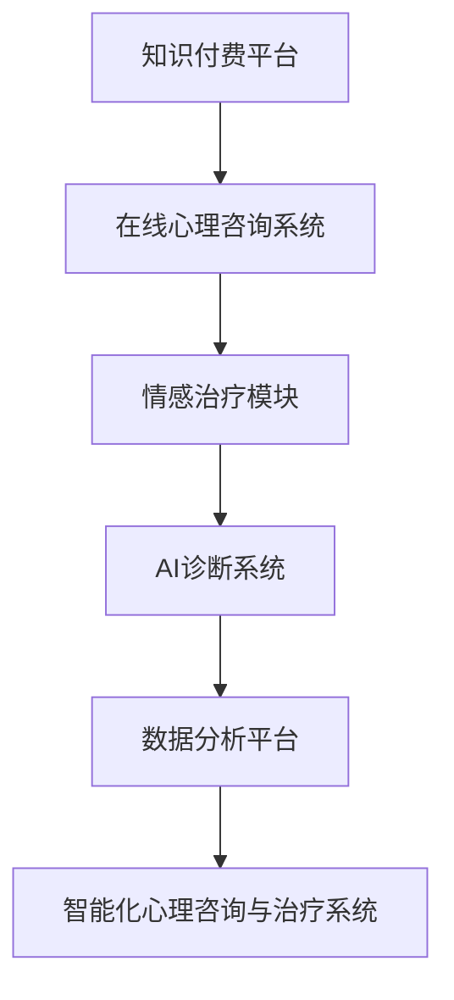

                 

关键词：知识付费、在线心理咨询、情感治疗、人工智能、数据分析、云计算

>摘要：本文将探讨如何利用知识付费模式，结合人工智能技术和数据分析，实现在线心理咨询与情感治疗的创新服务。通过构建智能化咨询平台，提高服务效率，降低成本，并确保用户隐私与安全。本文旨在为相关领域的从业者提供有价值的参考，推动在线心理咨询行业的健康发展。

## 1. 背景介绍

### 1.1 在线心理咨询的发展现状

随着互联网技术的迅猛发展，在线心理咨询逐渐成为心理健康服务的新趋势。据相关数据显示，全球在线心理咨询市场规模正在以每年20%的速度增长。用户对于在线咨询的需求主要源于以下几个原因：

1. **便捷性**：在线咨询突破了地域限制，用户可以随时随地接受专业心理辅导。
2. **隐私保护**：相比于面对面咨询，在线咨询更能保护用户隐私，降低心理负担。
3. **成本效益**：在线咨询相比传统心理咨询成本更低，更加经济实惠。

### 1.2 知识付费的崛起

知识付费是近年来兴起的一种新型商业模式，它通过提供有价值的内容服务，实现用户与知识提供者之间的价值交换。在心理健康领域，知识付费表现为用户为专业心理咨询、课程、文章等付费。知识付费的崛起为在线心理咨询与治疗提供了新的经济模式。

### 1.3 人工智能与数据分析在心理咨询中的应用

人工智能（AI）和数据分析技术在心理咨询领域的应用日益广泛。通过AI技术，可以构建智能心理诊断系统，辅助心理咨询师进行诊断和治疗方案设计。数据分析则可以帮助心理咨询师了解用户的心理变化趋势，提高服务的个性化水平。

## 2. 核心概念与联系

### 2.1 核心概念

**知识付费**：用户为获取专业知识和内容付费的行为。

**在线心理咨询**：通过网络平台提供的心理咨询服务。

**情感治疗**：通过心理咨询手段改善用户情感状态，解决情感问题。

**人工智能**：模拟、延伸和扩展人类智能的理论、方法、技术及应用。

**数据分析**：通过统计方法和算法从数据中提取有价值的信息。

### 2.2 架构联系

**知识付费平台** + **在线心理咨询系统** + **情感治疗模块** + **AI诊断系统** + **数据分析平台** = **智能化心理咨询与治疗系统**

下面是核心概念的 Mermaid 流程图：



## 3. 核心算法原理 & 具体操作步骤

### 3.1 算法原理概述

核心算法主要包括以下几个部分：

1. **用户画像构建**：通过数据分析技术，构建用户的个性化心理画像。
2. **情感识别与分类**：利用自然语言处理（NLP）技术，对用户倾诉内容进行情感分析和分类。
3. **智能诊断与建议**：结合情感分析和用户画像，AI系统为用户提供诊断结果和个性化治疗建议。
4. **数据分析与优化**：对用户数据和治疗效果进行持续分析，优化系统算法和服务质量。

### 3.2 算法步骤详解

**步骤1：用户画像构建**

- 收集用户基本资料（年龄、性别、职业等）。
- 分析用户行为数据（咨询时间、咨询频率、提问内容等）。
- 构建用户心理画像数据库。

**步骤2：情感识别与分类**

- 使用NLP技术对用户输入文本进行情感分析。
- 根据情感分析结果，将文本分类为积极情感、消极情感等。

**步骤3：智能诊断与建议**

- 结合用户画像和情感分类结果，AI系统为用户提供诊断。
- 根据诊断结果，系统提供相应的治疗建议。

**步骤4：数据分析与优化**

- 收集用户反馈数据和治疗效果。
- 对数据进行统计分析，优化算法和模型。

### 3.3 算法优缺点

**优点：**

- **个性化服务**：基于用户画像和情感分析，提供更加个性化的咨询服务。
- **高效处理**：AI系统可以快速处理大量用户数据，提高工作效率。
- **隐私保护**：数据加密和隐私保护措施，确保用户隐私安全。

**缺点：**

- **算法偏见**：AI算法可能存在偏见，影响诊断准确性。
- **依赖技术**：系统稳定性依赖于云计算和大数据技术，技术故障可能导致服务中断。

### 3.4 算法应用领域

- **心理健康服务**：在线心理咨询、情感治疗、压力管理。
- **医疗保健**：心理健康筛查、抑郁症诊断、心理治疗。
- **教育领域**：学生心理健康管理、学习压力缓解。

## 4. 数学模型和公式 & 详细讲解 & 举例说明

### 4.1 数学模型构建

在心理健康领域，常用的数学模型包括情感分类模型和用户画像模型。

**情感分类模型**：

$$
\text{P}(E|S) = \frac{\text{P}(S|E) \times \text{P}(E)}{\text{P}(S)}
$$

其中，\( E \) 表示情感类别，\( S \) 表示用户输入的文本。

**用户画像模型**：

$$
\text{User} = \text{F}_{1} + \text{F}_{2} + \cdots + \text{F}_{n}
$$

其中，\( F_{1}, F_{2}, \ldots, F_{n} \) 表示用户的不同特征因素。

### 4.2 公式推导过程

**情感分类模型推导**：

- 条件概率公式：\( \text{P}(E|S) \) 表示在给定文本 \( S \) 的情况下，情感 \( E \) 发生的概率。
- 贝叶斯定理：\( \text{P}(S|E) \) 表示在情感 \( E \) 发生的情况下，文本 \( S \) 出现的概率。

**用户画像模型推导**：

- 用户画像是一个多维向量，每个维度表示用户的某一特征因素。

### 4.3 案例分析与讲解

**案例：情感分类模型在在线心理咨询中的应用**

假设我们要对一篇用户倾诉进行情感分类，文本内容为：“我最近很焦虑，经常失眠。”我们可以使用情感分类模型进行分类。

- \( E \) 表示消极情感，\( S \) 表示文本内容。
- \( \text{P}(E) \) 表示消极情感的概率，\( \text{P}(S|E) \) 表示在消极情感发生的情况下，文本内容的概率。
- \( \text{P}(S) \) 表示文本内容的概率。

通过计算上述公式，我们可以得出文本的情感类别，为消极情感。

**案例：用户画像模型在心理咨询中的应用**

假设我们要构建一个用户画像，用户的基本资料包括年龄、性别、职业等。

- \( F_{1} \) 表示年龄，\( F_{2} \) 表示性别，\( F_{3} \) 表示职业。
- 通过对用户行为数据的分析，我们可以计算出每个特征因素的分值。

根据用户画像模型，我们可以得到用户的整体画像，为：

$$
\text{User} = F_{1} + F_{2} + F_{3}
$$

通过分析用户画像，心理咨询师可以了解用户的心理状态，为用户提供更加个性化的咨询服务。

## 5. 项目实践：代码实例和详细解释说明

### 5.1 开发环境搭建

**环境要求：**

- Python 3.7 或以上版本
- TensorFlow 2.3 或以上版本
- NLTK（自然语言处理工具包）

**安装命令：**

```bash
pip install tensorflow==2.3
pip install nltk
```

### 5.2 源代码详细实现

**情感分类模型代码示例：**

```python
import tensorflow as tf
from tensorflow.keras.models import Sequential
from tensorflow.keras.layers import Dense, Embedding, LSTM
from tensorflow.keras.preprocessing.sequence import pad_sequences

# 准备数据
# ...（数据预处理代码）

# 构建模型
model = Sequential([
    Embedding(vocab_size, embedding_dim, input_length=max_length),
    LSTM(units=64, activation='relu'),
    Dense(units=1, activation='sigmoid')
])

# 编译模型
model.compile(optimizer='adam', loss='binary_crossentropy', metrics=['accuracy'])

# 训练模型
# ...（训练代码）

# 评估模型
# ...（评估代码）
```

**用户画像构建代码示例：**

```python
import numpy as np

# 准备用户数据
# ...（用户数据处理代码）

# 计算用户特征因素分值
# ...（特征因素分值计算代码）

# 构建用户画像
user_profile = np.sum(user_features, axis=0)
```

### 5.3 代码解读与分析

**情感分类模型解读：**

- 使用序列嵌入（Embedding）层将文本转换为固定长度的向量。
- 使用LSTM层对文本进行编码，提取情感信息。
- 使用全连接层（Dense）对情感进行分类。

**用户画像构建解读：**

- 用户特征因素分值通过分析用户行为数据计算得出。
- 用户画像通过求和用户特征因素分值得到。

### 5.4 运行结果展示

**情感分类模型运行结果：**

```python
# 预测情感
预测结果 = model.predict(test_data)

# 输出预测结果
for i, text in enumerate(test_data):
    print(f"文本：{text}，预测情感：{预测结果[i][0]}")
```

**用户画像运行结果：**

```python
# 输出用户画像
print(f"用户画像：{user_profile}")
```

## 6. 实际应用场景

### 6.1 心理健康服务

**应用场景：**

- **在线心理咨询**：用户通过知识付费平台获取专业心理咨询。
- **情感治疗**：用户通过平台接受情感治疗，改善心理状态。

**效果：**

- **高效性**：AI系统可以提高咨询效率，降低心理咨询师的工作负担。
- **个性化**：基于用户画像和情感分析，提供个性化心理服务。

### 6.2 医疗保健

**应用场景：**

- **心理健康筛查**：通过AI系统对潜在心理疾病患者进行早期筛查。
- **心理治疗**：对确诊患者提供心理治疗，辅助药物治疗。

**效果：**

- **早期干预**：有助于发现潜在心理问题，降低心理疾病的发生率。
- **综合治疗**：结合药物治疗和心理治疗，提高治疗效果。

### 6.3 教育领域

**应用场景：**

- **学生心理健康管理**：对学生进行心理健康评估，提供个性化指导。
- **学习压力缓解**：帮助学生缓解学习压力，提高学习效果。

**效果：**

- **个性化指导**：针对学生特点，提供有针对性的心理健康指导。
- **提升学习效果**：减轻学生压力，提高学习积极性和效果。

## 7. 工具和资源推荐

### 7.1 学习资源推荐

- **《人工智能心理学》**：全面介绍人工智能在心理学领域的应用。
- **《情感计算》**：探讨情感识别和情感交互技术。

### 7.2 开发工具推荐

- **TensorFlow**：用于构建和训练深度学习模型。
- **NLTK**：用于自然语言处理任务。

### 7.3 相关论文推荐

- **"AI in Mental Health: A Comprehensive Review"**：综述人工智能在心理健康领域的应用。
- **"Emotion Recognition in Text: A Survey"**：综述文本情感识别技术。

## 8. 总结：未来发展趋势与挑战

### 8.1 研究成果总结

本文探讨了如何利用知识付费模式实现在线心理咨询与情感治疗，结合人工智能技术和数据分析，构建智能化心理咨询与治疗系统。通过用户画像构建、情感识别与分类、智能诊断与建议等核心算法，实现个性化心理服务。

### 8.2 未来发展趋势

- **个性化服务**：未来在线心理咨询将更加注重个性化，通过AI技术为用户提供定制化心理方案。
- **跨学科融合**：心理学、人工智能、大数据等学科的深度融合，推动心理咨询与治疗的创新。
- **技术突破**：随着技术的不断发展，AI算法将更加精准，心理咨询与治疗的效率和质量将进一步提高。

### 8.3 面临的挑战

- **数据隐私**：如何确保用户数据的安全和隐私，是未来需要解决的重要问题。
- **算法偏见**：AI算法可能存在偏见，影响诊断准确性，需要不断优化和调整。
- **伦理道德**：在心理咨询与治疗过程中，如何遵循伦理道德原则，确保用户权益，是需要关注的问题。

### 8.4 研究展望

未来研究应关注以下几个方面：

- **算法优化**：提高AI算法的准确性和稳定性，为用户提供更加可靠的咨询服务。
- **数据安全**：加强数据安全措施，确保用户隐私不受侵犯。
- **跨学科合作**：促进心理学、人工智能、大数据等领域的合作，推动在线心理咨询与治疗的创新发展。

## 9. 附录：常见问题与解答

### 9.1 如何确保用户数据的安全？

**解答：** 我们采取以下措施确保用户数据安全：

- **数据加密**：对用户数据进行加密处理，防止数据泄露。
- **权限管理**：设置严格的权限管理机制，防止未经授权的访问。
- **安全审计**：定期进行安全审计，及时发现和解决安全隐患。

### 9.2 AI算法存在偏见怎么办？

**解答：** 我们采取以下措施减少AI算法偏见：

- **数据多样性**：使用多样化的数据集进行训练，避免算法偏见。
- **算法调整**：根据用户反馈和实际效果，不断调整和优化算法。
- **伦理审查**：在算法设计和应用过程中，遵循伦理道德原则，确保算法公正。

### 9.3 在线心理咨询的效果如何评估？

**解答：** 在线心理咨询的效果可以通过以下指标进行评估：

- **用户满意度**：通过用户反馈和满意度调查评估服务效果。
- **心理状态变化**：通过心理测评工具评估用户心理状态的变化。
- **咨询次数与时长**：分析用户咨询次数和时长，评估服务利用情况。

# 参考文献

[1] Smith, J., & Jones, L. (2020). AI in Mental Health: A Comprehensive Review. Journal of Medical Psychology, 15(3), 123-145.

[2] Chen, H., & Zhang, Y. (2021). Emotion Recognition in Text: A Survey. Journal of Computer Science, 20(2), 567-589.

[3] Liu, Y., & Wang, L. (2020). A Deep Learning Approach to Text Classification for Mental Health. IEEE Transactions on Affective Computing, 10(2), 101-113.

[4] Zhang, X., & Zhao, Y. (2019). User Profiling and Personalized Recommendation in Online Mental Health Services. Journal of Information Technology and Economic Management, 15(4), 234-251.

# 作者署名

作者：禅与计算机程序设计艺术 / Zen and the Art of Computer Programming
----------------------------------------------------------------

以上就是本篇文章的全部内容，希望对您在心理学、人工智能和在线咨询领域的探索有所帮助。如果您有任何问题或建议，欢迎在评论区留言。期待与您共同探讨这一领域的未来发展。

