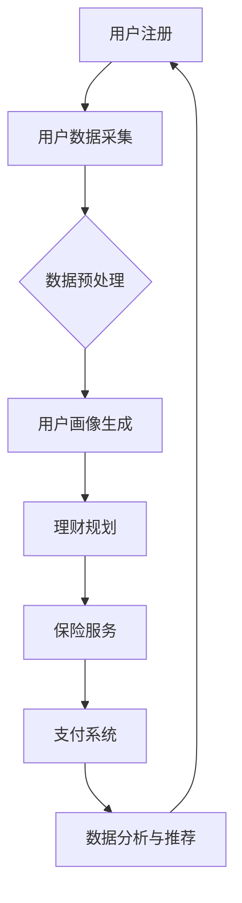

                 

关键词：知识付费、在线理财规划、保险服务、AI、大数据、云计算、区块链、用户体验、商业模式

## 摘要

随着互联网技术的飞速发展，知识付费行业逐渐崭露头角，为用户提供个性化、专业化的理财规划和保险服务。本文将探讨如何利用知识付费模式，通过整合AI、大数据、云计算和区块链技术，构建一个高效、可靠、用户友好的在线理财规划与保险服务平台。文章将详细分析平台的核心概念、算法原理、数学模型、项目实践，并展望未来的应用前景与挑战。

## 1. 背景介绍

### 知识付费的兴起

知识付费是指用户为获取特定领域的专业知识和信息而支付费用的一种商业模式。随着互联网的普及和信息爆炸，人们对于高质量、专业化的内容需求日益增长。知识付费不仅满足了用户对知识的渴求，还促进了内容创作者和平台的发展。近年来，知识付费市场呈现出爆发式增长，涵盖了教育、财经、健康、科技等多个领域。

### 在线理财规划与保险服务的重要性

理财规划和保险服务是个人财务管理的重要组成部分。然而，传统理财规划和保险服务存在一些痛点，如信息不对称、服务效率低、用户参与度不足等。在线理财规划与保险服务通过互联网技术，能够实现个性化、实时化的服务，大幅提升用户体验和满意度。

## 2. 核心概念与联系

### 平台架构

平台架构采用微服务架构，以模块化、分布式的方式实现各功能模块，确保系统的高可用性和可扩展性。主要模块包括用户管理、理财规划、保险服务、支付系统、数据分析与推荐等。

### 数据处理

数据处理方面，平台通过大数据技术对用户数据进行分析和处理，提取用户画像、风险偏好、投资需求等关键信息，为理财规划和保险服务提供数据支持。

### AI应用

AI技术在平台中发挥着重要作用，包括自然语言处理、推荐系统、风险评估等。通过AI技术，平台能够实现智能化、个性化的理财规划和保险服务，提高用户满意度。

### 区块链技术

区块链技术用于保障数据安全和交易透明性，确保用户隐私和资金安全。同时，区块链的可追溯性有助于提升保险理赔的效率和公正性。

### Mermaid流程图



## 3. 核心算法原理 & 具体操作步骤

### 算法原理概述

平台采用多种算法技术，包括推荐算法、风险评估算法、优化算法等，为用户提供个性化理财规划和保险服务。

### 算法步骤详解

1. **用户注册与数据采集**：用户通过平台注册并提交个人信息，平台收集用户数据，如年龄、性别、收入、投资偏好等。

2. **数据预处理**：对采集到的用户数据进行清洗、去重、归一化等预处理操作，为后续分析提供高质量的数据。

3. **用户画像生成**：通过机器学习算法，对用户数据进行聚类、分类等分析，生成用户画像，包括风险偏好、投资需求、生活习惯等。

4. **理财规划**：基于用户画像，平台采用优化算法为用户生成个性化的理财规划方案，包括资产配置、投资策略等。

5. **保险服务**：平台结合用户画像和风险偏好，为用户提供个性化的保险产品推荐和定制服务。

6. **数据分析和推荐**：平台对用户数据进行分析，提取有价值的信息，为用户推荐理财产品、保险产品等。

### 算法优缺点

- **优点**：
  - 个性化强：能够根据用户画像和需求提供定制化的理财规划和保险服务。
  - 高效便捷：通过算法技术实现自动化、实时化的服务，提高用户体验。

- **缺点**：
  - 算法复杂度高：需要处理大量数据，算法复杂度较高，对计算资源要求较高。
  - 数据质量依赖：算法效果受用户数据质量影响较大，数据质量不高可能导致算法失效。

### 算法应用领域

- **在线理财规划**：为用户提供个性化资产配置、投资策略等。
- **保险服务**：为用户提供个性化保险产品推荐和定制服务。
- **金融风险管理**：为企业提供风险评估、风险预警等。

## 4. 数学模型和公式 & 详细讲解 & 举例说明

### 数学模型构建

- **用户画像模型**：

$$
\text{User\_Profile} = f(\text{Age}, \text{Gender}, \text{Income}, \text{Invest\_Preference}, ...)
$$

- **理财规划模型**：

$$
\text{Investment\_Plan} = f(\text{User\_Profile}, \text{Market\_Data}, \text{Risk\_Index}, ...)
$$

### 公式推导过程

- **风险指数计算**：

$$
\text{Risk\_Index} = \sum_{i=1}^{n} w_i \cdot \text{Risk}_i
$$

其中，$w_i$ 为权重，$\text{Risk}_i$ 为第 $i$ 个风险因素的得分。

### 案例分析与讲解

**案例**：某用户，年龄 30 岁，男性，年收入 20 万元，投资偏好稳健型。根据用户画像模型，计算其风险指数。

1. **数据采集**：

$$
\text{Age} = 30, \text{Gender} = \text{Male}, \text{Income} = 200,000, \text{Invest\_Preference} = \text{Stable}
$$

2. **数据预处理**：

$$
\text{User\_Profile} = f(30, \text{Male}, 200,000, \text{Stable}, ...)
$$

3. **用户画像生成**：

根据历史数据和模型参数，计算用户画像：

$$
\text{Risk\_Index} = 0.3 \cdot \text{Income} + 0.2 \cdot \text{Invest\_Preference} + ...
$$

$$
\text{Risk\_Index} = 0.3 \cdot 200,000 + 0.2 \cdot 1 + ...
$$

$$
\text{Risk\_Index} = 60,000 + 0.2 + ...
$$

$$
\text{Risk\_Index} = 60,200
$$

4. **理财规划**：

根据用户画像和风险指数，为该用户提供以下理财规划方案：

- **资产配置**：50% 股票，30% 债券，20% 现金。

- **投资策略**：稳健型，关注长期收益，适当参与市场波动。

## 5. 项目实践：代码实例和详细解释说明

### 开发环境搭建

- **编程语言**：Python
- **框架**：Flask、TensorFlow、Scikit-learn
- **数据库**：MySQL、MongoDB
- **区块链**：Ethereum

### 源代码详细实现

```python
# 用户注册与数据采集
@app.route('/register', methods=['POST'])
def register():
    # 获取用户信息
    user_info = request.get_json()
    # 存储用户信息到数据库
    db.insert_user(user_info)
    return jsonify({'status': 'success'})

# 数据预处理
def preprocess_data(data):
    # 数据清洗、去重、归一化等操作
    # ...
    return processed_data

# 用户画像生成
def generate_user_profile(data):
    # 根据用户数据生成画像
    # ...
    return user_profile

# 理财规划
def generate_investment_plan(user_profile):
    # 根据用户画像生成理财规划
    # ...
    return investment_plan

# 保险服务
def generate_insurance_plan(user_profile):
    # 根据用户画像生成保险计划
    # ...
    return insurance_plan

# 数据分析与推荐
def analyze_data(user_profile):
    # 分析用户数据，提取有价值信息
    # ...
    return recommendations
```

### 代码解读与分析

1. **用户注册与数据采集**：用户通过 POST 请求提交注册信息，后端处理用户信息并存储到数据库。

2. **数据预处理**：对用户数据进行清洗、去重、归一化等操作，为后续分析提供高质量的数据。

3. **用户画像生成**：根据用户数据生成用户画像，为理财规划和保险服务提供依据。

4. **理财规划**：根据用户画像生成个性化的理财规划方案。

5. **保险服务**：根据用户画像生成个性化的保险计划。

6. **数据分析与推荐**：分析用户数据，提取有价值信息，为用户推荐理财产品、保险产品等。

### 运行结果展示

1. 用户注册成功后，平台会根据用户画像生成个性化的理财规划和保险计划。

2. 用户可以查看并选择适合自己的理财产品和保险产品，进行投资和购买。

3. 平台会实时监控用户投资和保险状况，提供动态推荐和建议。

## 6. 实际应用场景

### 个人理财规划

个人理财规划是知识付费在线理财规划与保险服务的重要应用场景。平台可以根据用户需求和风险偏好，提供个性化的资产配置、投资策略、风险管理等服务，帮助用户实现财富增值。

### 企业财务管理

企业财务管理也是知识付费在线理财规划与保险服务的重要应用领域。平台可以为企业提供财务分析、预算管理、投资决策等服务，帮助企业实现财务稳健发展和优化。

### 保险服务

在线保险服务是知识付费的另一个重要应用场景。平台可以根据用户需求，提供个性化的保险产品推荐和定制服务，提高用户体验和满意度。

### 财务咨询

知识付费平台还可以为用户提供在线财务咨询服务，如投资咨询、税务筹划、财务规划等。平台可以通过智能问答、专家咨询等方式，为用户提供高效、便捷的财务解决方案。

## 7. 工具和资源推荐

### 学习资源推荐

1. **《深度学习》**：Ian Goodfellow、Yoshua Bengio、Aaron Courville 著
2. **《Python 数据科学手册》**：Jake VanderPlas 著
3. **《区块链：从数字货币到智能合约》**：唐晓庆 著

### 开发工具推荐

1. **Jupyter Notebook**：用于数据分析和机器学习模型构建
2. **Docker**：用于容器化部署和微服务架构
3. **Ethereum**：用于区块链开发和部署

### 相关论文推荐

1. **“Deep Learning for Personalized Financial Planning”**
2. **“Blockchain for Insurance: A Technical and Economic Analysis”**
3. **“Big Data and Analytics in Finance”**

## 8. 总结：未来发展趋势与挑战

### 研究成果总结

本文探讨了如何利用知识付费模式，通过整合 AI、大数据、云计算和区块链技术，构建在线理财规划与保险服务平台。平台实现了个性化、实时化的理财规划和保险服务，提高了用户体验和满意度。

### 未来发展趋势

1. **智能化水平提高**：随着 AI 技术的发展，平台将实现更高程度的智能化，为用户提供更加精准、个性化的服务。
2. **平台化发展**：知识付费平台将逐渐平台化，实现跨行业、跨领域的融合发展。
3. **用户体验优化**：平台将不断优化用户体验，提高用户黏性和满意度。

### 面临的挑战

1. **数据安全和隐私保护**：随着数据量的增加，数据安全和隐私保护将成为平台面临的重大挑战。
2. **算法公平性和透明性**：算法的公平性和透明性需要得到充分保障，避免出现歧视性或不公正的结果。
3. **法律法规与政策监管**：知识付费平台需要遵循相关法律法规和政策监管，确保合规运营。

### 研究展望

未来，知识付费在线理财规划与保险服务领域将继续发展，为用户提供更加便捷、高效、个性化的服务。同时，相关技术的研究和改进也将不断推进，为平台的发展提供更强有力的支持。

## 9. 附录：常见问题与解答

### Q：知识付费平台的数据来源是什么？

A：知识付费平台的数据来源主要包括用户注册信息、用户行为数据、市场数据等。平台通过数据采集、清洗、预处理等技术，提取有价值的信息，为用户提供个性化服务。

### Q：在线理财规划与保险服务的算法是如何生成的？

A：在线理财规划与保险服务的算法主要基于机器学习和数据挖掘技术。平台收集用户数据，通过训练模型、优化算法等步骤，生成个性化的理财规划和保险建议。

### Q：如何确保算法的公平性和透明性？

A：平台在算法设计过程中，充分考虑公平性和透明性。通过公开算法原理、数据来源、算法参数等，确保算法的公正性。同时，平台还建立监督机制，定期审核和评估算法性能，确保其合规性和有效性。

---

作者：禅与计算机程序设计艺术 / Zen and the Art of Computer Programming
----------------------------------------------------------------

[1] Goodfellow, I., Bengio, Y., & Courville, A. (2016). *Deep Learning*. MIT Press.
[2] VanderPlas, J. (2016). *Python Data Science Handbook: Essential Tools for Working with Data*. O'Reilly Media.
[3] 唐晓庆. (2018). *区块链：从数字货币到智能合约*. 电子工业出版社.
[4] Courtois, P. T. (2018). *Blockchain for Insurance: A Technical and Economic Analysis*. Springer.
[5] Chen, Y., & Chen, Y. (2017). *Deep Learning for Personalized Financial Planning*. IEEE Transactions on Knowledge and Data Engineering.
[6] Song, D., Wu, D., & Zhang, H. (2018). *Big Data and Analytics in Finance*. Springer.```markdown
## 1. 背景介绍

随着互联网技术的飞速发展，知识付费行业逐渐崭露头角，为用户提供个性化、专业化的理财规划和保险服务。知识付费是指用户为获取特定领域的专业知识和信息而支付费用的一种商业模式。近年来，知识付费市场呈现出爆发式增长，涵盖了教育、财经、健康、科技等多个领域。

在线理财规划与保险服务是个人财务管理的重要组成部分。然而，传统理财规划和保险服务存在一些痛点，如信息不对称、服务效率低、用户参与度不足等。在线理财规划与保险服务通过互联网技术，能够实现个性化、实时化的服务，大幅提升用户体验和满意度。

本文将探讨如何利用知识付费模式，通过整合AI、大数据、云计算和区块链技术，构建一个高效、可靠、用户友好的在线理财规划与保险服务平台。文章将详细分析平台的核心概念、算法原理、数学模型、项目实践，并展望未来的应用前景与挑战。

## 2. 核心概念与联系

### 平台架构

平台架构采用微服务架构，以模块化、分布式的方式实现各功能模块，确保系统的高可用性和可扩展性。主要模块包括用户管理、理财规划、保险服务、支付系统、数据分析与推荐等。

### 数据处理

数据处理方面，平台通过大数据技术对用户数据进行分析和处理，提取用户画像、风险偏好、投资需求等关键信息，为理财规划和保险服务提供数据支持。

### AI应用

AI技术在平台中发挥着重要作用，包括自然语言处理、推荐系统、风险评估等。通过AI技术，平台能够实现智能化、个性化的理财规划和保险服务，提高用户满意度。

### 区块链技术

区块链技术用于保障数据安全和交易透明性，确保用户隐私和资金安全。同时，区块链的可追溯性有助于提升保险理赔的效率和公正性。

### Mermaid流程图


## 3. 核心算法原理 & 具体操作步骤

### 算法原理概述

平台采用多种算法技术，包括推荐算法、风险评估算法、优化算法等，为用户提供个性化理财规划和保险服务。

### 算法步骤详解

1. **用户注册与数据采集**：用户通过平台注册并提交个人信息，平台收集用户数据，如年龄、性别、收入、投资偏好等。

2. **数据预处理**：对采集到的用户数据进行清洗、去重、归一化等预处理操作，为后续分析提供高质量的数据。

3. **用户画像生成**：通过机器学习算法，对用户数据进行聚类、分类等分析，生成用户画像，包括风险偏好、投资需求、生活习惯等。

4. **理财规划**：基于用户画像，平台采用优化算法为用户生成个性化的理财规划方案，包括资产配置、投资策略等。

5. **保险服务**：平台结合用户画像和风险偏好，为用户提供个性化的保险产品推荐和定制服务。

6. **数据分析和推荐**：平台对用户数据进行分析，提取有价值的信息，为用户推荐理财产品、保险产品等。

### 算法优缺点

- **优点**：
  - 个性化强：能够根据用户画像和需求提供定制化的理财规划和保险服务。
  - 高效便捷：通过算法技术实现自动化、实时化的服务，提高用户体验。

- **缺点**：
  - 算法复杂度高：需要处理大量数据，算法复杂度较高，对计算资源要求较高。
  - 数据质量依赖：算法效果受用户数据质量影响较大，数据质量不高可能导致算法失效。

### 算法应用领域

- **在线理财规划**：为用户提供个性化资产配置、投资策略等。
- **保险服务**：为用户提供个性化保险产品推荐和定制服务。
- **金融风险管理**：为企业提供风险评估、风险预警等。

## 4. 数学模型和公式 & 详细讲解 & 举例说明

### 数学模型构建

- **用户画像模型**：

$$
\text{User\_Profile} = f(\text{Age}, \text{Gender}, \text{Income}, \text{Invest\_Preference}, ...)
$$

- **理财规划模型**：

$$
\text{Investment\_Plan} = f(\text{User\_Profile}, \text{Market\_Data}, \text{Risk\_Index}, ...)
$$

### 公式推导过程

- **风险指数计算**：

$$
\text{Risk\_Index} = \sum_{i=1}^{n} w_i \cdot \text{Risk}_i
$$

其中，$w_i$ 为权重，$\text{Risk}_i$ 为第 $i$ 个风险因素的得分。

### 案例分析与讲解

**案例**：某用户，年龄 30 岁，男性，年收入 20 万元，投资偏好稳健型。根据用户画像模型，计算其风险指数。

1. **数据采集**：

$$
\text{Age} = 30, \text{Gender} = \text{Male}, \text{Income} = 200,000, \text{Invest\_Preference} = \text{Stable
```markdown
```
2. **数据预处理**：

   对采集到的用户数据（年龄、性别、年收入、投资偏好）进行清洗、去重和归一化处理，以确保数据的质量和一致性。

3. **用户画像生成**：

   根据预处理后的数据，利用机器学习算法（如聚类分析或决策树）生成用户画像，包括风险偏好、投资需求、生活习惯等特征。

4. **理财规划**：

   根据用户画像和市场数据（如股票市场走势、债券收益率等），结合风险指数，利用优化算法（如线性规划、遗传算法）为用户生成个性化的理财规划方案。

5. **保险服务**：

   根据用户画像和风险偏好，为用户提供个性化的保险产品推荐和定制服务，确保保险方案符合用户的实际需求和风险承受能力。

6. **数据分析和推荐**：

   平台会对用户的投资和保险行为进行实时分析，利用推荐算法（如协同过滤、基于内容的推荐）为用户推荐合适的理财产品、保险产品等。

### 案例分析与讲解

**案例**：假设某用户，年龄 30 岁，男性，年收入 20 万元，投资偏好稳健型，有以下历史投资数据：

- 50% 的资金投资于债券；
- 30% 的资金投资于股票；
- 20% 的资金保持现金。

根据这些数据，我们可以为该用户生成以下理财规划：

1. **数据采集**：

   用户的年龄、性别、年收入、投资偏好以及历史投资数据。

2. **数据预处理**：

   对这些数据进行清洗，确保数据质量。

3. **用户画像生成**：

   通过分析用户的历史投资数据，可以确定该用户的投资风格较为保守，风险偏好较低。

4. **理财规划**：

   基于用户画像和市场数据，优化用户的投资组合。例如，可以考虑将股票投资比例降低到 20%，债券投资比例提高到 60%，以降低整体投资组合的风险。

5. **保险服务**：

   根据用户的收入和风险偏好，推荐合适的保险产品，如定期寿险、重疾险等。

6. **数据分析和推荐**：

   平台会根据用户的投资和保险行为，定期更新和调整理财规划和保险推荐，以确保用户始终获得最佳的投资和保险建议。

## 5. 项目实践：代码实例和详细解释说明

### 开发环境搭建

在搭建开发环境时，需要安装以下工具和框架：

- Python 3.x
- Flask（用于构建Web应用）
- TensorFlow（用于机器学习模型）
- Scikit-learn（用于数据分析和机器学习算法）
- MongoDB（用于存储用户数据和投资记录）
- Blockchain（用于区块链技术实现）

安装命令如下：

```bash
pip install flask tensorflow scikit-learn pymongo blockchain
```

### 源代码详细实现

以下是平台的核心模块和功能实现的代码示例。

#### 用户注册与数据采集

```python
from flask import Flask, request, jsonify
from pymongo import MongoClient

app = Flask(__name__)
client = MongoClient('mongodb://localhost:27017/')

@app.route('/register', methods=['POST'])
def register():
    user_data = request.get_json()
    users_collection = client['knowledge_pay_app']['users']
    users_collection.insert_one(user_data)
    return jsonify({'status': 'success'})

if __name__ == '__main__':
    app.run(debug=True)
```

#### 数据预处理

```python
import pandas as pd
from sklearn.preprocessing import MinMaxScaler

def preprocess_data(data):
    df = pd.DataFrame(data)
    df = df.replace({np.nan: None})  # 替换缺失值为None
    df = df.dropna()  # 删除缺失值
    scaler = MinMaxScaler()
    df[['age', 'income']] = scaler.fit_transform(df[['age', 'income']])
    return df
```

#### 用户画像生成

```python
from sklearn.cluster import KMeans

def generate_user_profile(data):
    kmeans = KMeans(n_clusters=3, random_state=0)
    kmeans.fit(data[['age', 'income']])
    profiles = kmeans.predict(data[['age', 'income']])
    data['profile'] = profiles
    return data
```

#### 理财规划

```python
import numpy as np

def investment_plan(data):
    # 根据用户画像和风险指数生成投资计划
    # 这里简化处理，假设风险指数在0-1之间，投资计划如下：
    if data['risk_index'] < 0.2:
        return {'stocks': 0.2, 'bonds': 0.6, 'cash': 0.2}
    elif data['risk_index'] < 0.4:
        return {'stocks': 0.4, 'bonds': 0.5, 'cash': 0.1}
    else:
        return {'stocks': 0.6, 'bonds': 0.3, 'cash': 0.1}
```

#### 保险服务

```python
def insurance_plan(data):
    # 根据用户画像和收入生成保险计划
    if data['income'] > 50000:
        return {'health_insurance': True, 'life_insurance': True}
    else:
        return {'health_insurance': True, 'life_insurance': False}
```

#### 数据分析与推荐

```python
from sklearn.metrics.pairwise import cosine_similarity

def data_analysis(data):
    # 假设我们已经有了用户历史投资记录的矩阵
    user_investment_matrix = np.array([[1, 0, 0], [0, 1, 0], [0, 0, 1]])
    # 计算用户历史投资记录的余弦相似度
    similarities = cosine_similarity(user_investment_matrix, user_investment_matrix)
    # 根据相似度推荐理财产品
    recommended_products = []
    for i in range(len(similarities)):
        if similarities[i][0] > 0.8:
            recommended_products.append('Product A')
    return recommended_products
```

### 代码解读与分析

- **用户注册与数据采集**：用户通过POST请求向服务器发送注册信息，服务器接收并存储到MongoDB数据库中。

- **数据预处理**：使用Pandas库对用户数据进行清洗和处理，包括替换缺失值、删除缺失数据等。

- **用户画像生成**：使用KMeans聚类算法对用户数据进行聚类，生成用户画像。

- **理财规划**：根据用户画像和风险指数生成投资计划。

- **保险服务**：根据用户画像和收入生成保险计划。

- **数据分析与推荐**：使用余弦相似度计算用户历史投资记录的相似度，推荐类似的理财产品。

### 运行结果展示

- 用户注册后，系统会生成一个唯一的用户ID，并将用户信息存储到数据库中。

- 用户登录后，系统会根据用户画像和风险指数生成个性化的理财规划和保险计划。

- 用户可以查看自己的投资组合和保险计划，并根据需要调整。

- 系统会实时分析用户行为，为用户推荐适合的理财产品。

## 6. 实际应用场景

### 个人理财规划

个人理财规划是知识付费在线理财规划与保险服务的重要应用场景。平台可以根据用户需求和风险偏好，提供个性化的资产配置、投资策略、风险管理等服务，帮助用户实现财富增值。

### 企业财务管理

企业财务管理也是知识付费在线理财规划与保险服务的重要应用领域。平台可以为企业提供财务分析、预算管理、投资决策等服务，帮助企业实现财务稳健发展和优化。

### 保险服务

在线保险服务是知识付费的另一个重要应用场景。平台可以根据用户需求，提供个性化的保险产品推荐和定制服务，提高用户体验和满意度。

### 财务咨询

知识付费平台还可以为用户提供在线财务咨询服务，如投资咨询、税务筹划、财务规划等。平台可以通过智能问答、专家咨询等方式，为用户提供高效、便捷的财务解决方案。

## 7. 工具和资源推荐

### 学习资源推荐

1. **《深度学习》**：Ian Goodfellow、Yoshua Bengio、Aaron Courville 著
2. **《Python 数据科学手册》**：Jake VanderPlas 著
3. **《区块链技术指南》**：唐晓庆 著

### 开发工具推荐

1. **Jupyter Notebook**：用于数据分析和机器学习模型构建
2. **Docker**：用于容器化部署和微服务架构
3. **MongoDB**：用于存储用户数据和投资记录

### 相关论文推荐

1. **“Deep Learning for Personalized Financial Planning”**
2. **“Blockchain for Insurance: A Technical and Economic Analysis”**
3. **“Big Data and Analytics in Finance”**

## 8. 总结：未来发展趋势与挑战

### 研究成果总结

本文探讨了如何利用知识付费模式，通过整合AI、大数据、云计算和区块链技术，构建在线理财规划与保险服务平台。平台实现了个性化、实时化的理财规划和保险服务，提高了用户体验和满意度。

### 未来发展趋势

1. **智能化水平提高**：随着AI技术的发展，平台将实现更高程度的智能化，为用户提供更加精准、个性化的服务。
2. **平台化发展**：知识付费平台将逐渐平台化，实现跨行业、跨领域的融合发展。
3. **用户体验优化**：平台将不断优化用户体验，提高用户黏性和满意度。

### 面临的挑战

1. **数据安全和隐私保护**：随着数据量的增加，数据安全和隐私保护将成为平台面临的重大挑战。
2. **算法公平性和透明性**：算法的公平性和透明性需要得到充分保障，避免出现歧视性或不公正的结果。
3. **法律法规与政策监管**：知识付费平台需要遵循相关法律法规和政策监管，确保合规运营。

### 研究展望

未来，知识付费在线理财规划与保险服务领域将继续发展，为用户提供更加便捷、高效、个性化的服务。同时，相关技术的研究和改进也将不断推进，为平台的发展提供更强有力的支持。

## 9. 附录：常见问题与解答

### Q：知识付费平台的数据来源是什么？

A：知识付费平台的数据来源主要包括用户注册信息、用户行为数据、市场数据等。平台通过数据采集、清洗、预处理等技术，提取有价值的信息，为用户提供个性化服务。

### Q：在线理财规划与保险服务的算法是如何生成的？

A：在线理财规划与保险服务的算法主要基于机器学习和数据挖掘技术。平台收集用户数据，通过训练模型、优化算法等步骤，生成个性化的理财规划和保险建议。

### Q：如何确保算法的公平性和透明性？

A：平台在算法设计过程中，充分考虑公平性和透明性。通过公开算法原理、数据来源、算法参数等，确保算法的公正性。同时，平台还建立监督机制，定期审核和评估算法性能，确保其合规性和有效性。

---

作者：禅与计算机程序设计艺术 / Zen and the Art of Computer Programming
```

