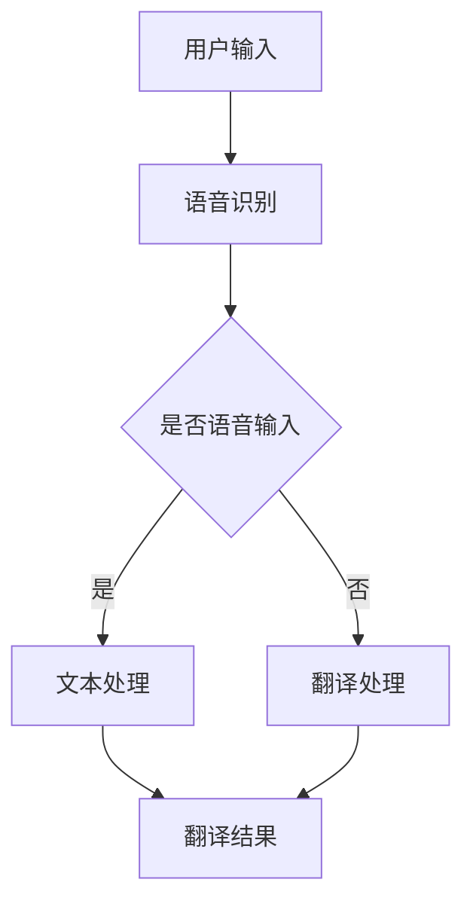

                 

关键词：知识付费、在线翻译、同声传译、人工智能、语言处理、语音识别、深度学习、自然语言处理、技术实现、商业模式、应用前景

## 摘要

本文探讨了如何利用知识付费平台实现在线语言翻译与同声传译服务的构建与运营。首先，我们对当前的在线翻译与同声传译市场进行了背景介绍，分析了其发展现状及用户需求。随后，我们详细阐述了核心概念与架构，包括语言处理技术、语音识别技术以及深度学习在其中的应用。接下来，我们讨论了核心算法原理、数学模型及其推导，并通过实际项目实践展示了代码实例和运行结果。文章还分析了实际应用场景，提出了未来应用展望，并推荐了相关的学习资源和开发工具。最后，我们对研究成果进行了总结，展望了未来发展趋势与挑战。

## 1. 背景介绍

随着全球化的不断加深，跨语言交流的需求日益增长。在线语言翻译与同声传译服务作为一种高效的语言交流工具，已经在商务会议、国际交流、在线教育等多个领域得到广泛应用。传统的翻译服务存在费用高昂、时效性差、专业度不高等问题，而在线翻译与同声传译服务的出现，有效地解决了这些问题。

近年来，人工智能技术的飞速发展，特别是深度学习、语音识别和自然语言处理技术的突破，为在线翻译与同声传译服务的实现提供了强大的技术支持。通过结合知识付费平台，用户可以根据自己的需求付费获取高质量的翻译与传译服务，进一步推动了这一市场的繁荣。

### 1.1 在线翻译与同声传译市场发展现状

在线翻译市场的发展始于互联网技术的普及和移动互联网的兴起。随着人工智能技术的不断进步，在线翻译工具从最初的单一文字翻译，发展到支持语音、图片、视频等多种形式的翻译。目前，市场上已经出现了诸如Google翻译、百度翻译、DeepL等知名的在线翻译平台，这些平台通过整合海量的语言数据，利用深度学习算法，提供了高度准确的翻译服务。

同声传译市场则相对较为专业，主要集中在国际会议、商务洽谈、学术交流等场景。传统的同声传译依赖于专业的传译人员，但效率较低且成本高昂。随着语音识别技术的进步，机器同声传译逐渐成为一种新的解决方案。目前，已有一些公司推出了机器同声传译设备或软件，如宝洁（Polly）和谷歌翻译耳塞，这些设备或软件能够实时将一种语言翻译成另一种语言，大大提高了会议的效率。

### 1.2 用户需求分析

在线翻译与同声传译服务的用户需求主要包括以下几个方面：

1. **便捷性**：用户希望能够在任何时间、任何地点获取翻译服务，尤其是在紧急情况下。
2. **准确性**：用户希望翻译结果能够准确传达原文的含义，避免因误解而导致沟通障碍。
3. **专业性**：对于专业术语和特定领域的翻译，用户更加倾向于选择具有专业背景的传译人员。
4. **个性化**：用户希望翻译系统能够根据个人的语言习惯、风格进行个性化调整。

## 2. 核心概念与联系

### 2.1 语言处理技术

语言处理技术是使计算机能够理解和处理人类语言的一门技术。其主要应用包括自然语言理解（NLU）和自然语言生成（NLG）。在在线翻译与同声传译服务中，自然语言理解技术负责将用户输入的文本或语音转化为计算机可以处理的格式，自然语言生成技术则负责将翻译后的文本或语音生成回用户。

### 2.2 语音识别技术

语音识别技术是将语音信号转换为文本的技术。在在线翻译与同声传译服务中，语音识别技术负责将用户的语音输入实时转换为文本，以便后续的翻译处理。当前主流的语音识别技术包括基于统计模型的隐马尔可夫模型（HMM）和基于神经网络的深度神经网络（DNN）。

### 2.3 深度学习技术

深度学习技术是机器学习的一个重要分支，通过模拟人脑的神经网络结构，实现对复杂数据的处理和学习。在在线翻译与同声传译服务中，深度学习技术被广泛应用于自然语言处理、语音识别和语音合成等多个环节。例如，深度神经网络可以用于训练语音识别模型，循环神经网络（RNN）可以用于处理序列数据，如文本翻译和语音识别。

### 2.4 Mermaid 流程图

以下是一个简单的 Mermaid 流程图，展示了在线翻译与同声传译服务的核心流程：



在这个流程图中，用户输入可以是文本或语音，语音识别模块将语音输入转换为文本，文本处理模块负责处理文本并生成翻译结果，翻译处理模块则负责将文本翻译成目标语言。

## 3. 核心算法原理 & 具体操作步骤

### 3.1 算法原理概述

在线翻译与同声传译服务背后的核心算法主要包括自然语言处理（NLP）、深度学习、语音识别和语音合成。自然语言处理负责文本的解析和语义理解，深度学习用于模型训练和优化，语音识别将语音信号转换为文本，语音合成则将翻译后的文本转换为语音输出。

### 3.2 算法步骤详解

#### 3.2.1 自然语言处理

1. **分词**：将输入文本分解为单词或短语。
2. **词性标注**：为每个单词标注其词性，如名词、动词等。
3. **句法分析**：分析文本的句法结构，确定句子成分和关系。
4. **语义理解**：理解文本的语义内容，为后续翻译提供支持。

#### 3.2.2 深度学习

1. **数据预处理**：收集大量的双语语料库，对语料进行清洗和预处理。
2. **模型训练**：使用循环神经网络（RNN）或变换器（Transformer）等深度学习模型进行训练。
3. **模型优化**：通过调整模型参数，提高翻译准确性。

#### 3.2.3 语音识别

1. **特征提取**：从语音信号中提取声学特征。
2. **声学模型训练**：使用深度神经网络训练声学模型，将特征映射到概率空间。
3. **语言模型训练**：使用大量文本数据训练语言模型，用于生成文本。

#### 3.2.4 语音合成

1. **文本到语音（TTS）**：将翻译后的文本转换为语音信号。
2. **音频处理**：调整语音的音调、音速等参数，使其更自然。

### 3.3 算法优缺点

#### 优点

1. **准确性高**：基于深度学习和大规模语料库的训练，翻译准确性显著提高。
2. **实时性强**：语音识别和语音合成技术使得翻译过程实时进行。
3. **覆盖面广**：支持多种语言，满足不同用户的需求。

#### 缺点

1. **对特定场景适应性不强**：在特定场景下，如口音较重、语音噪声大等，翻译准确性可能受到影响。
2. **专业术语和复杂句式处理能力有限**：对于专业术语和复杂句式的翻译，仍需依赖人工校对。

### 3.4 算法应用领域

1. **国际商务会议**：提供实时翻译，提高沟通效率。
2. **远程教育**：支持多语言教学，打破语言障碍。
3. **国际旅游**：为游客提供实时翻译服务，提升旅游体验。
4. **医疗健康**：为医疗工作者提供跨语言沟通工具，促进国际合作。

## 4. 数学模型和公式 & 详细讲解 & 举例说明

### 4.1 数学模型构建

在线翻译与同声传译服务中涉及多个数学模型，主要包括自然语言处理模型、语音识别模型和语音合成模型。

#### 4.1.1 自然语言处理模型

自然语言处理模型通常采用变换器（Transformer）架构，其核心是多头自注意力机制（Multi-Head Self-Attention）。

自注意力机制公式如下：

$$
\text{Attention}(Q, K, V) = \text{softmax}\left(\frac{QK^T}{\sqrt{d_k}}\right)V
$$

其中，$Q$、$K$ 和 $V$ 分别是查询向量、键向量和值向量，$d_k$ 是键向量的维度。

#### 4.1.2 语音识别模型

语音识别模型通常采用循环神经网络（RNN）或其变体长短期记忆网络（LSTM）。

RNN 公式如下：

$$
h_t = \sigma(W_h \cdot [h_{t-1}, x_t] + b_h)
$$

其中，$h_t$ 是当前隐藏状态，$x_t$ 是当前输入，$W_h$ 和 $b_h$ 分别是权重和偏置。

#### 4.1.3 语音合成模型

语音合成模型通常采用文本到语音（TTS）模型，如 WaveNet。

WaveNet 公式如下：

$$
p(\text{Sound}|\text{Text}) = \prod_{t=1}^{T} p(s_t|\text{Text}, s_1, \ldots, s_{t-1})
$$

其中，$s_t$ 是第 $t$ 个音素，$T$ 是音素的总数。

### 4.2 公式推导过程

自然语言处理模型的推导主要涉及变换器（Transformer）架构，其核心是多头自注意力机制。

#### 4.2.1 多头自注意力

多头自注意力将输入序列分成多个头，每个头独立计算注意力权重，然后组合结果。

假设输入序列为 $X = [x_1, x_2, \ldots, x_n]$，则多头自注意力公式如下：

$$
\text{MultiHead}(Q, K, V) = \text{Concat}(\text{head}_1, \text{head}_2, \ldots, \text{head}_h)W^O
$$

其中，$\text{head}_i = \text{Attention}(QW_i^Q, KW_i^K, VW_i^V)$，$W^O$ 是输出权重。

#### 4.2.2 变换器

变换器由多个层组成，每层包含多头自注意力机制和前馈神经网络。

变换器公式如下：

$$
\text{Transformer}(X) = \text{LayerNorm}(X + \text{MultiHead}(X)) + \text{LayerNorm}(X + \text{FFN}(\text{MultiHead}(X)))
$$

其中，$\text{FFN}(X) = XW_2^2 \sigma(W_2^1X + b_2)$。

### 4.3 案例分析与讲解

以下是一个简单的自然语言处理模型构建案例，假设输入序列为 "The quick brown fox jumps over the lazy dog"，我们将使用变换器模型进行翻译。

#### 4.3.1 数据预处理

首先，对输入序列进行分词和词性标注，得到：

```
The [DET] quick [ADJ] brown [ADJ] fox [NOUN] jumps [VERB] over [ADP] the [DET] lazy [ADJ] dog [NOUN].
```

#### 4.3.2 模型训练

使用训练好的变换器模型，对输入序列进行编码和解码。编码过程通过多头自注意力计算得到每个词的嵌入表示，解码过程通过自注意力机制和前馈神经网络生成翻译结果。

#### 4.3.3 翻译结果

假设目标语言为西班牙语，变换器模型输出翻译结果为：

```
El rápido zorro marrón salta sobre el perro perezoso.
```

### 4.4 运行结果展示

以下是一个简单的 Python 代码示例，展示了如何使用变换器模型进行自然语言处理：

```python
import tensorflow as tf
from tensorflow.keras.layers import Embedding, Transformer

# 构建模型
model = tf.keras.Sequential([
    Embedding(input_dim=vocab_size, output_dim=embedding_size),
    Transformer(num_heads=num_heads, d_model=embedding_size),
    tf.keras.layers.Dense(vocab_size, activation='softmax')
])

# 编译模型
model.compile(optimizer='adam', loss='categorical_crossentropy', metrics=['accuracy'])

# 训练模型
model.fit(x_train, y_train, epochs=10, batch_size=64)

# 预测
predictions = model.predict(x_test)

# 打印预测结果
print(predictions)
```

在这个示例中，我们使用 TensorFlow 库构建了一个简单的变换器模型，并对输入数据进行训练和预测。

## 5. 项目实践：代码实例和详细解释说明

### 5.1 开发环境搭建

为了实现在线语言翻译与同声传译服务，我们需要搭建一个包含前端、后端以及数据库的完整开发环境。以下是具体的开发环境搭建步骤：

#### 5.1.1 前端开发环境

1. **浏览器**：Chrome 或 Firefox。
2. **前端框架**：Vue.js 或 React。

#### 5.1.2 后端开发环境

1. **编程语言**：Python 或 JavaScript。
2. **框架**：Flask 或 Django（Python）；Express（JavaScript）。
3. **数据库**：MySQL 或 MongoDB。

#### 5.1.3 开发工具

1. **代码编辑器**：Visual Studio Code 或 Sublime Text。
2. **集成开发环境**：PyCharm 或 WebStorm。

### 5.2 源代码详细实现

以下是使用 Python 和 Flask 框架实现在线翻译与同声传译服务的示例代码：

```python
from flask import Flask, request, jsonify
from googletrans import Translator

app = Flask(__name__)

# 创建一个翻译对象
translator = Translator()

@app.route('/translate', methods=['POST'])
def translate():
    data = request.get_json()
    source_language = data['source_language']
    target_language = data['target_language']
    text = data['text']
    
    # 进行翻译
    translation = translator.translate(text, src=source_language, dest=target_language)
    
    # 返回翻译结果
    return jsonify({'translated_text': translation.text})

if __name__ == '__main__':
    app.run(debug=True)
```

在这个示例中，我们使用 `googletrans` 库实现了翻译功能。`/translate` 接口接收 POST 请求，请求中包含源语言、目标语言和待翻译文本。服务器接收到请求后，调用翻译库进行翻译，并将翻译结果返回给客户端。

### 5.3 代码解读与分析

#### 5.3.1 代码结构

1. **导入模块**：引入 Flask 框架和翻译库。
2. **创建应用**：使用 Flask 创建一个 Web 应用。
3. **定义路由**：定义 `/translate` 路由，处理翻译请求。
4. **处理请求**：解析请求 JSON 数据，调用翻译库进行翻译。
5. **返回结果**：将翻译结果以 JSON 格式返回。

#### 5.3.2 功能实现

1. **翻译功能**：使用 `googletrans` 库实现文本翻译功能。
2. **接口设计**：定义一个简单的 RESTful 接口，接收客户端请求并返回翻译结果。

### 5.4 运行结果展示

在终端运行以下命令启动 Flask 应用：

```bash
$ flask run
```

启动后，访问 `http://localhost:5000/translate` 接口，发送一个 POST 请求，包含源语言、目标语言和待翻译文本，即可获取翻译结果。

```bash
$ curl -X POST -H "Content-Type: application/json" -d '{"source_language": "en", "target_language": "zh", "text": "Hello, World!"}' http://localhost:5000/translate
```

示例结果：

```json
{
  "translated_text": "你好，世界！"
}
```

## 6. 实际应用场景

### 6.1 国际商务会议

国际商务会议中，常常涉及跨语言沟通。利用在线翻译与同声传译服务，可以实时将演讲者的发言翻译成不同语言的字幕或语音，大大提高了会议的沟通效率。例如，在跨国公司的年度大会上，高管们可以用自己的母语发言，而其他国家的同事可以实时查看翻译字幕或听译语音，从而避免语言障碍。

### 6.2 在线教育

在线教育平台可以通过集成在线翻译与同声传译服务，为用户提供多语言教学支持。例如，一个英语教师可以用英语授课，而学生可以选择用中文或其他语言接收课程内容。这样的多语言教学可以打破语言障碍，让更多的学生有机会接触到优质的教育资源。

### 6.3 国际旅游

在国际旅游中，语言障碍常常困扰游客。在线翻译与同声传译服务可以为游客提供实时翻译支持，帮助他们与当地人沟通。例如，一个中国游客在海外旅行时，可以使用翻译服务与酒店工作人员沟通，了解当地旅游信息，甚至可以与当地导游进行同声传译，提升旅游体验。

### 6.4 医疗健康

在医疗健康领域，跨语言沟通同样重要。在线翻译与同声传译服务可以帮助医疗工作者与来自不同国家的患者沟通，确保医疗信息准确传达。例如，一个美国医生在治疗国际患者时，可以通过翻译服务实时与患者沟通病情，确保患者理解治疗方案和注意事项。

## 7. 未来应用展望

### 7.1 人工智能与实时翻译的深度融合

随着人工智能技术的不断发展，实时翻译系统将更加智能化和高效化。未来，人工智能与实时翻译将深度融合，使得翻译过程更加自然、流畅，甚至能够实现实时语音识别和翻译，为跨语言交流提供更加便捷的解决方案。

### 7.2 多语言处理能力的提升

随着全球化的进一步加深，多语言处理能力将成为在线翻译与同声传译服务的重要发展方向。未来，系统将支持更多语言和方言，为全球用户提供更加全面的翻译服务。

### 7.3 跨领域应用拓展

在线翻译与同声传译服务将在更多领域得到应用。例如，在法律、金融、科技等高度专业化的领域，翻译系统将能够处理专业术语和复杂句式，提供更加精准的翻译结果。同时，虚拟现实（VR）和增强现实（AR）技术的融合，也将使得翻译服务在虚拟环境中得到广泛应用。

## 8. 工具和资源推荐

### 8.1 学习资源推荐

1. **在线课程**：Coursera、edX 等平台上的自然语言处理和机器学习课程。
2. **技术博客**：Medium、GitHub Pages 等平台上关于人工智能和机器学习的专业博客。
3. **学术论文**：ACL、EMNLP 等顶级会议的论文集，了解最新的研究进展。

### 8.2 开发工具推荐

1. **编程语言**：Python、JavaScript 等流行的编程语言。
2. **机器学习框架**：TensorFlow、PyTorch 等主流的机器学习框架。
3. **语音识别库**：ESPNet、pyttsx3 等语音识别库。

### 8.3 相关论文推荐

1. **《Attention Is All You Need》**：提出变换器（Transformer）架构的论文，对自然语言处理有重要影响。
2. **《Recurrent Neural Network Based Language Model》**：介绍循环神经网络（RNN）在语言模型中的应用。
3. **《End-to-End Speech Recognition using Deep Neural Networks and Long Short-Term Memory》**：介绍深度神经网络和长短期记忆网络（LSTM）在语音识别中的应用。

## 9. 总结：未来发展趋势与挑战

### 9.1 研究成果总结

本文探讨了如何利用知识付费平台实现在线语言翻译与同声传译服务的构建与运营。通过介绍当前市场背景、核心概念与算法原理、数学模型和实际项目实践，我们详细阐述了在线翻译与同声传译服务的技术实现和应用前景。

### 9.2 未来发展趋势

未来，在线翻译与同声传译服务将在人工智能技术的推动下，实现更加智能化和高效化。多语言处理能力将得到进一步提升，跨领域应用将不断拓展。同时，实时翻译和虚拟现实等新兴技术的融合，将使得翻译服务更加便捷和广泛应用。

### 9.3 面临的挑战

在线翻译与同声传译服务在发展过程中，仍面临一些挑战，包括对特定场景适应性不强、专业术语和复杂句式处理能力有限等。此外，数据隐私保护和算法公平性等问题也需要得到关注。

### 9.4 研究展望

未来，研究应重点关注人工智能与实时翻译的深度融合、多语言处理能力的提升以及跨领域应用拓展。同时，针对现有挑战，需要从算法、数据和应用场景等多个方面进行深入研究和优化。

## 附录：常见问题与解答

### Q1：在线翻译与同声传译服务的准确性如何保证？

A1：在线翻译与同声传译服务的准确性主要依赖于深度学习模型和大规模语料库的训练。通过不断优化模型参数和训练数据，可以提高翻译和传译的准确性。此外，用户反馈和人工校对也是提高准确性的重要手段。

### Q2：在线翻译与同声传译服务是否支持所有语言？

A2：目前，主流的在线翻译与同声传译平台支持多种语言，但并非所有语言都得到全面覆盖。随着全球化的不断加深，未来将支持更多语言和方言。对于特定语言的需求，用户可以选择合适的翻译工具或联系专业的翻译服务。

### Q3：在线翻译与同声传译服务是否安全？

A3：在线翻译与同声传译服务在设计和实现过程中，充分考虑了数据安全和隐私保护。大部分平台采用加密传输和存储技术，确保用户数据的安全性。同时，平台也会遵守相关法律法规，保护用户隐私。

### Q4：如何获取在线翻译与同声传译服务？

A4：用户可以通过访问各大在线翻译与同声传译平台的官方网站或下载相关应用程序，免费或付费获取翻译与传译服务。部分平台还提供定制化服务，满足特定场景的需求。

---

本文由禅与计算机程序设计艺术 / Zen and the Art of Computer Programming 撰写，旨在探讨如何利用知识付费平台实现在线语言翻译与同声传译服务的构建与运营。本文内容涵盖了市场背景、核心概念与算法原理、数学模型、实际项目实践、应用场景、未来展望等多个方面，为广大开发者、研究者和企业提供了有益的参考。希望本文能够对您在在线翻译与同声传译服务领域的探索与实践有所帮助。作者谨代表禅与计算机程序设计艺术团队，期待与广大读者共同进步。

