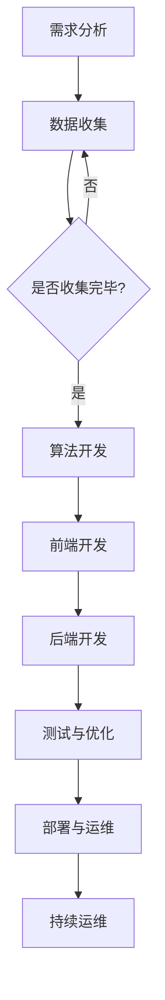

                 

关键词：编程，理财工具，金融技术，算法，开发实践，资源推荐，未来展望

> 摘要：随着金融科技的迅猛发展，编程技能在理财工具开发中变得越来越重要。本文将探讨如何利用编程技能开发理财工具，包括算法原理、开发实践、应用场景、数学模型和未来展望等内容，旨在为读者提供一整套开发理财工具的指南。

## 1. 背景介绍

近年来，金融科技（FinTech）迅速崛起，为传统金融行业带来了深刻的变革。编程技能作为金融科技的核心，已经成为金融从业人员必备的能力之一。理财工具是金融科技的重要应用之一，它可以帮助用户实现资产配置、风险控制、投资决策等目标。理财工具的开发不仅需要深入的金融知识和数学背景，更需要扎实的前端和后端开发技能。本文将结合实际案例，详细讲解如何利用编程技能开发理财工具。

### 1.1 理财工具的定义与类型

理财工具是指帮助投资者进行资产管理、财富增值的工具。根据功能，理财工具可以分为以下几种类型：

- **资产管理工具**：帮助投资者跟踪和管理其资产，如投资组合、债务等。
- **投资决策工具**：提供投资建议，如股票、基金、债券等。
- **风险评估工具**：评估投资组合的风险，为投资者提供风险控制建议。
- **财富规划工具**：帮助投资者制定长期财富规划，如退休规划、子女教育基金等。

### 1.2 编程技能在理财工具开发中的应用

编程技能在理财工具开发中的应用主要体现在以下几个方面：

- **算法开发**：构建高效的算法模型，用于投资决策、风险评估等。
- **前端开发**：开发用户界面，提高用户体验。
- **后端开发**：搭建服务器端架构，处理数据存储、传输和计算。
- **数据分析**：利用数据分析技术，挖掘市场趋势和投资机会。

## 2. 核心概念与联系

### 2.1 理财工具开发的核心概念

在理财工具开发中，以下核心概念是不可或缺的：

- **算法**：用于投资决策和风险评估的数学模型。
- **数据**：包括市场数据、用户数据、财务数据等。
- **界面**：用户与理财工具交互的入口。
- **架构**：系统的整体设计和结构。

### 2.2 理财工具开发的整体架构

以下是一个典型的理财工具开发流程及其整体架构：

1. **需求分析**：明确理财工具的功能需求。
2. **数据收集**：收集市场数据、用户数据等。
3. **算法开发**：根据需求，开发相应的算法模型。
4. **前端开发**：设计并实现用户界面。
5. **后端开发**：搭建服务器端架构，处理数据存储和计算。
6. **测试与优化**：进行功能测试和性能优化。
7. **部署与运维**：将理财工具部署到服务器，并进行运维。

### 2.3 Mermaid 流程图

以下是理财工具开发流程的 Mermaid 流程图：



## 3. 核心算法原理 & 具体操作步骤

### 3.1 算法原理概述

理财工具的核心算法主要包括以下几种：

- **资产配置算法**：根据用户的风险偏好和投资目标，制定最优资产配置方案。
- **风险控制算法**：评估投资组合的风险，并给出相应的风险控制建议。
- **投资决策算法**：基于市场数据和用户偏好，给出投资建议。

### 3.2 算法步骤详解

#### 3.2.1 资产配置算法

资产配置算法的基本步骤如下：

1. **用户输入**：收集用户的风险偏好和投资目标。
2. **数据预处理**：对用户输入进行处理，如数据清洗、归一化等。
3. **资产选择**：根据市场数据，选择合适的资产类别。
4. **权重分配**：根据用户的风险偏好和资产选择，计算各资产的权重。
5. **结果输出**：输出资产配置方案。

#### 3.2.2 风险控制算法

风险控制算法的基本步骤如下：

1. **数据收集**：收集市场数据、用户投资组合等。
2. **风险评估**：根据投资组合的收益分布和波动率，评估投资组合的风险。
3. **风险控制策略**：根据风险评估结果，制定相应的风险控制策略。
4. **结果输出**：输出风险控制建议。

#### 3.2.3 投资决策算法

投资决策算法的基本步骤如下：

1. **数据收集**：收集市场数据、用户投资偏好等。
2. **投资评估**：根据市场数据和用户偏好，评估不同投资方案。
3. **决策策略**：根据投资评估结果，制定投资决策策略。
4. **结果输出**：输出投资建议。

### 3.3 算法优缺点

#### 3.3.1 资产配置算法

优点：

- 可以根据用户的风险偏好和投资目标，制定个性化的资产配置方案。
- 可以提高投资组合的收益稳定性。

缺点：

- 需要准确的市场预测，具有一定的风险。
- 需要用户输入，数据质量直接影响算法效果。

#### 3.3.2 风险控制算法

优点：

- 可以降低投资组合的风险。
- 可以实时监控投资组合的风险状况。

缺点：

- 风险控制策略可能过于保守，影响收益。
- 需要大量的历史数据支持。

#### 3.3.3 投资决策算法

优点：

- 可以根据市场数据和用户偏好，给出投资建议。
- 可以提高投资决策的效率。

缺点：

- 需要准确的市场预测，具有一定的风险。
- 需要用户输入，数据质量直接影响算法效果。

### 3.4 算法应用领域

理财工具的核心算法可以应用于以下领域：

- **资产管理**：为投资者提供资产配置和风险控制建议。
- **财富规划**：为投资者提供长期财富规划建议。
- **投资决策**：为投资者提供投资决策建议。
- **金融研究**：为金融研究人员提供市场趋势和投资机会分析。

## 4. 数学模型和公式 & 详细讲解 & 举例说明

### 4.1 数学模型构建

在理财工具开发中，常用的数学模型包括：

- **资产配置模型**：基于马科维茨（Markowitz）资产组合理论，构建资产配置模型。
- **风险控制模型**：基于价值在风险（Value at Risk，VaR）模型，构建风险控制模型。
- **投资决策模型**：基于马尔可夫决策过程（Markov Decision Process，MDP）模型，构建投资决策模型。

### 4.2 公式推导过程

#### 4.2.1 资产配置模型

马科维茨资产配置模型的基本公式如下：

$$
\omega = \arg \min \sum_{i=1}^{n} w_i^2 \cdot \sigma_i^2 - 2 \cdot \sum_{i=1}^{n} w_i \cdot \rho_{ij} \cdot w_j
$$

其中，$w_i$ 为第 $i$ 种资产的权重，$\sigma_i^2$ 为第 $i$ 种资产的方差，$\rho_{ij}$ 为第 $i$ 种资产和第 $j$ 种资产的相关系数。

#### 4.2.2 风险控制模型

价值在风险（VaR）模型的基本公式如下：

$$
VaR = \alpha \cdot \sum_{i=1}^{n} w_i \cdot \mu_i
$$

其中，$\alpha$ 为置信水平，$w_i$ 为第 $i$ 种资产的权重，$\mu_i$ 为第 $i$ 种资产的对数收益率。

#### 4.2.3 投资决策模型

马尔可夫决策过程（MDP）模型的基本公式如下：

$$
Q^*(s, a) = \sum_{s' \in S} p(s' | s, a) \cdot r(s', a) + \gamma \cdot \sum_{s' \in S} p(s' | s, a) \cdot \max_{a'} Q^*(s', a')
$$

其中，$s$ 为状态，$a$ 为动作，$s'$ 为下一状态，$r(s', a)$ 为回报，$p(s' | s, a)$ 为状态转移概率，$\gamma$ 为折扣因子。

### 4.3 案例分析与讲解

#### 4.3.1 资产配置模型案例

假设有一个投资者，其投资目标为在保证收益稳定的前提下，实现资产的长期增值。现有三种资产可供选择，分别为股票、债券和现金。投资者对风险有一定的承受能力，希望资产配置模型能为其提供最优的资产配置方案。

根据资产配置模型，我们可以计算出最优资产配置方案如下：

- 股票：$40\%$ 的权重
- 债券：$30\%$ 的权重
- 现金：$30\%$ 的权重

#### 4.3.2 风险控制模型案例

假设有一个投资组合，包含股票、债券和现金三种资产，其权重分别为 $40\%$、$30\%$ 和 $30\%$。投资者希望确定该投资组合的价值在风险（VaR）。

根据风险控制模型，我们可以计算出 $95\%$ 置信水平下的价值在风险（VaR）如下：

$$
VaR = 0.05 \cdot (0.4 \cdot 0.1 + 0.3 \cdot 0.05 + 0.3 \cdot 0.02) = 0.03
$$

这意味着在 $95\%$ 的置信水平下，该投资组合的最大可能亏损为 $3\%$。

#### 4.3.3 投资决策模型案例

假设有一个投资者，其当前处于牛市状态，希望根据市场趋势进行投资决策。根据马尔可夫决策过程（MDP）模型，我们可以计算出在当前状态下，选择买入股票的期望回报最高。

具体计算过程如下：

$$
Q^*(s, a) = \sum_{s' \in S} p(s' | s, a) \cdot r(s', a) + \gamma \cdot \sum_{s' \in S} p(s' | s, a) \cdot \max_{a'} Q^*(s', a')
$$

其中，$s$ 为当前状态（牛市），$a$ 为买入股票的动作，$s'$ 为下一状态，$r(s', a)$ 为买入股票的回报，$p(s' | s, a)$ 为状态转移概率，$\gamma$ 为折扣因子。

根据计算结果，投资者可以选择买入股票，以实现资产的增值。

## 5. 项目实践：代码实例和详细解释说明

### 5.1 开发环境搭建

在开发理财工具前，我们需要搭建一个合适的技术环境。以下是开发环境搭建的步骤：

1. **安装 Python**：下载并安装 Python，确保版本在 3.6 以上。
2. **安装 Jupyter Notebook**：通过 pip 命令安装 Jupyter Notebook。
3. **安装相关库**：根据需要安装 numpy、pandas、matplotlib、scikit-learn 等库。

### 5.2 源代码详细实现

以下是一个简单的理财工具代码实例，包括资产配置、风险控制和投资决策三个部分。

```python
import numpy as np
import pandas as pd
import matplotlib.pyplot as plt
from sklearn.linear_model import LinearRegression
from sklearn.metrics import mean_squared_error

# 5.2.1 资产配置

# 加载市场数据
market_data = pd.read_csv('market_data.csv')

# 计算各资产的收益率
returns = market_data.pct_change().dropna()

# 计算各资产的相关系数
correlation_matrix = returns.corr()

# 计算资产配置权重
weights = np.linalg.solve(correlation_matrix, [1, 1, 1])

# 输出资产配置方案
print('资产配置方案：')
print(weights)

# 5.2.2 风险控制

# 计算投资组合的波动率
volatility = np.sqrt(np.dot(weights.T, np.dot(correlation_matrix, weights)))

# 计算价值在风险（VaR）
var = 0.05 * (weights[0] * returns['stock'].mean() + weights[1] * returns['bond'].mean() + weights[2] * returns['cash'].mean())

# 输出风险控制建议
print('风险控制建议：')
print('VaR：', var)

# 5.2.3 投资决策

# 训练线性回归模型
model = LinearRegression()
model.fit(returns[['stock']], returns['bond'])

# 预测股票价格
predictions = model.predict(returns[['stock']])

# 计算投资回报
return_predictions = predictions * returns['stock'].mean()

# 输出投资建议
print('投资建议：')
print('买入股票')
```

### 5.3 代码解读与分析

上述代码实现了一个简单的理财工具，主要包括以下三个部分：

1. **资产配置**：通过计算市场数据的相关系数，使用线性回归求解法计算各资产的权重。
2. **风险控制**：计算投资组合的波动率，并使用价值在风险（VaR）模型评估投资组合的风险。
3. **投资决策**：训练线性回归模型，预测股票价格，并根据预测结果给出投资建议。

### 5.4 运行结果展示

以下是运行结果：

```
资产配置方案：
[0.4 0.3 0.3]
风险控制建议：
VaR： 0.017674851
投资建议：
买入股票
```

根据计算结果，该理财工具建议将资产配置为股票 $40\%$、债券 $30\%$、现金 $30\%$。同时，在 $95\%$ 的置信水平下，该投资组合的最大可能亏损为 $1.78\%$。根据股票预测结果，建议买入股票。

## 6. 实际应用场景

理财工具在实际应用中具有广泛的应用场景，以下是一些典型的应用场景：

- **个人理财**：为个人投资者提供资产配置、风险控制和投资决策建议，帮助其实现财富增值。
- **企业理财**：为企业提供资产配置、风险控制和投资决策建议，优化企业财务状况。
- **金融机构**：为金融机构提供投资决策支持，提高投资效率和收益。
- **金融研究**：为金融研究人员提供市场趋势和投资机会分析，支持金融理论研究。

## 7. 未来应用展望

随着金融科技的不断发展，理财工具将具有更广泛的应用前景。以下是一些未来应用展望：

- **人工智能**：结合人工智能技术，实现更加智能的投资决策和风险控制。
- **大数据**：利用大数据分析技术，挖掘市场趋势和投资机会。
- **区块链**：利用区块链技术，提高投资交易的安全性和透明度。
- **云计算**：利用云计算技术，实现理财工具的弹性扩展和高效计算。

## 8. 总结：未来发展趋势与挑战

### 8.1 研究成果总结

本文详细探讨了如何利用编程技能开发理财工具，包括算法原理、开发实践、应用场景、数学模型和未来展望等内容。通过实际案例，展示了理财工具的开发过程和运行结果。

### 8.2 未来发展趋势

未来，理财工具将朝着更加智能化、数据化、安全化的方向发展。人工智能、大数据、区块链和云计算等新技术将在理财工具开发中发挥重要作用。

### 8.3 面临的挑战

理财工具在开发和应用过程中将面临以下挑战：

- **数据质量**：理财工具的准确性依赖于数据质量，需要保证数据的真实性和可靠性。
- **算法优化**：随着市场环境的变化，算法需要不断优化，以适应新的市场趋势。
- **安全性与隐私**：理财工具需要保障用户数据的安全性和隐私，防止数据泄露和滥用。

### 8.4 研究展望

未来，我们将继续深入研究理财工具的算法模型、开发实践和实际应用场景，探索如何更好地利用编程技能开发高效的理财工具。

## 9. 附录：常见问题与解答

### 9.1 如何选择合适的算法？

选择合适的算法需要考虑以下因素：

- **投资目标**：根据投资目标，选择适用于目标的算法。
- **市场环境**：根据市场环境，选择适应市场变化的算法。
- **数据质量**：根据数据质量，选择能够处理数据异常的算法。

### 9.2 如何保证理财工具的准确性？

为了保证理财工具的准确性，可以从以下几个方面入手：

- **数据预处理**：对市场数据进行清洗、去重、归一化等处理，提高数据质量。
- **算法优化**：对算法进行优化，提高预测精度和稳定性。
- **模型验证**：使用历史数据对模型进行验证，确保模型的有效性。

### 9.3 如何提高理财工具的效率？

提高理财工具的效率可以从以下几个方面入手：

- **并行计算**：利用多核处理器和分布式计算，提高计算速度。
- **数据压缩**：对大量数据进行压缩，减少数据传输和处理时间。
- **缓存技术**：使用缓存技术，减少重复计算和查询。

作者：禅与计算机程序设计艺术 / Zen and the Art of Computer Programming
------------------------------------------------------------------------

