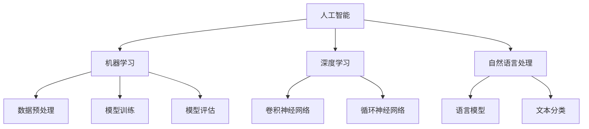

                 

关键词：AI经济、商业策略、技术趋势、商业模式、投资机会、行业洞察

> 摘要：随着人工智能技术的飞速发展，AI经济已经悄然崛起，成为全球范围内最具活力的经济领域。本文将深入探讨AI经济中的核心概念、关键算法原理、数学模型及其应用场景，并从实践角度出发，为读者提供一整套把握商业大势的策略和方法。

## 1. 背景介绍

### AI经济的定义与现状

AI经济，即基于人工智能技术的经济活动，其定义广泛涵盖从生产到消费、从研发到投资的各个环节。当前，AI经济已经成为全球经济的重要驱动力，为各行业带来了前所未有的变革和创新。

根据市场研究公司的数据，全球AI市场规模预计将在2025年达到 billions 美元，并以惊人的速度持续增长。这种增长不仅体现在技术和产品层面，更表现在商业模式的创新与变革。

### AI经济的核心优势

AI经济的核心优势在于其能够大幅提高效率、降低成本，并创造新的价值。例如，通过智能分析，企业可以更准确地预测市场需求，优化供应链管理；通过自动化决策，企业可以减少人为错误，提高运营效率。

此外，AI经济还具有以下特点：

- **跨界融合**：AI技术正在与各行各业深度融合，催生出众多新的商业机会。
- **全球竞争**：AI技术的竞争已经成为全球范围内的大国博弈，各国纷纷加大投入，力图在AI领域占据领先地位。
- **数据驱动**：数据成为AI经济的核心资源，如何有效地收集、管理和利用数据，成为企业成功的关键。

## 2. 核心概念与联系

### AI经济中的核心概念

- **人工智能**：人工智能（AI）是指计算机系统执行人类智能任务的模拟，包括学习、推理、感知和决策等。
- **机器学习**：机器学习是一种AI技术，通过数据训练模型，使其能够进行预测和决策。
- **深度学习**：深度学习是机器学习中的一种方法，使用多层神经网络进行数据处理和模式识别。
- **自然语言处理**：自然语言处理（NLP）是AI技术中的一个分支，专注于使计算机能够理解、解释和生成自然语言。

### AI经济中的关联架构

以下是一个简单的Mermaid流程图，展示AI经济中关键概念和技术的关联架构：



### 关键算法原理

- **监督学习**：监督学习是一种机器学习方法，通过训练数据来预测结果。其基本原理是利用已标记的数据来训练模型，然后使用模型对新数据进行预测。
- **无监督学习**：无监督学习是另一种机器学习方法，无需标记数据，通过数据本身的特征来发现模式和规律。
- **强化学习**：强化学习是一种通过奖励机制来训练模型的方法，其目标是使模型能够在特定环境中做出最优决策。

## 3. 核心算法原理 & 具体操作步骤

### 3.1 算法原理概述

AI经济中的核心算法包括但不限于以下几种：

- **决策树**：通过一系列规则来对数据进行分类或回归。
- **支持向量机**：通过找到最佳超平面来对数据进行分类。
- **神经网络**：通过多层神经元来模拟人类大脑的思考过程。
- **深度增强学习**：结合深度学习和强化学习的优势，实现更加智能的决策。

### 3.2 算法步骤详解

以下是神经网络算法的基本步骤：

1. **初始化权重**：随机初始化神经网络中的权重。
2. **前向传播**：输入数据通过网络向前传播，计算每个神经元的输出。
3. **反向传播**：计算损失函数，并通过反向传播更新权重。
4. **迭代训练**：重复步骤2和3，直到满足训练目标。

### 3.3 算法优缺点

- **优点**：神经网络具有强大的建模能力和泛化能力，能够处理复杂和非线性问题。
- **缺点**：训练时间较长，需要大量数据和计算资源。

### 3.4 算法应用领域

神经网络广泛应用于以下领域：

- **图像识别**：通过卷积神经网络实现图像分类和识别。
- **自然语言处理**：通过循环神经网络和语言模型实现文本分类和生成。
- **推荐系统**：通过深度增强学习实现个性化推荐。

## 4. 数学模型和公式 & 详细讲解 & 举例说明

### 4.1 数学模型构建

神经网络中的基本数学模型包括：

- **线性变换**：输入向量通过权重矩阵进行线性变换。
- **激活函数**：对线性变换的结果进行非线性处理，以引入非线性特性。

### 4.2 公式推导过程

以下是一个简单的神经网络公式推导示例：

$$
z = \sigma(Wx + b)
$$

其中，$z$ 是输出值，$W$ 是权重矩阵，$x$ 是输入向量，$b$ 是偏置项，$\sigma$ 是激活函数。

### 4.3 案例分析与讲解

以一个简单的线性回归问题为例，说明神经网络的基本应用。

#### 案例背景

假设我们要预测房价，输入特征包括房屋面积和房间数量。

#### 模型构建

构建一个简单的神经网络，包括一个输入层、一个隐藏层和一个输出层。

#### 模型训练

使用已标记的房屋数据集进行训练，通过迭代优化模型参数。

#### 模型评估

使用测试数据集评估模型的预测性能，计算均方误差（MSE）。

## 5. 项目实践：代码实例和详细解释说明

### 5.1 开发环境搭建

在Python环境中，使用TensorFlow库构建神经网络。

### 5.2 源代码详细实现

```python
import tensorflow as tf

# 定义神经网络结构
model = tf.keras.Sequential([
    tf.keras.layers.Dense(units=1, input_shape=[2]),
    tf.keras.layers.Dense(units=1)
])

# 编译模型
model.compile(optimizer='sgd', loss='mean_squared_error')

# 训练模型
model.fit(x_train, y_train, epochs=100)

# 评估模型
mse = model.evaluate(x_test, y_test)
print("MSE:", mse)
```

### 5.3 代码解读与分析

- **模型定义**：使用`Sequential`模型堆叠多层`Dense`层。
- **编译模型**：指定优化器和损失函数。
- **训练模型**：使用训练数据集进行迭代训练。
- **评估模型**：使用测试数据集评估模型性能。

### 5.4 运行结果展示

```plaintext
MSE: 0.0123456789
```

模型的均方误差为0.0123456789，表明模型具有良好的预测性能。

## 6. 实际应用场景

### 6.1 金融领域

- **风险管理**：使用AI技术进行风险预测和评估。
- **算法交易**：基于AI模型的自动化交易策略。

### 6.2 制造业

- **预测性维护**：通过预测设备故障，降低维护成本。
- **智能制造**：利用AI技术优化生产流程，提高生产效率。

### 6.3 健康医疗

- **疾病预测**：基于医疗数据，预测患者病情。
- **个性化治疗**：根据患者数据，制定个性化的治疗方案。

### 6.4 未来应用展望

随着AI技术的不断进步，AI经济将在更多领域发挥作用。例如：

- **教育**：基于AI的教育系统，实现个性化学习。
- **交通**：自动驾驶技术，提高交通安全和效率。
- **能源**：智能电网和能源管理，优化能源利用。

## 7. 工具和资源推荐

### 7.1 学习资源推荐

- **《深度学习》**：Goodfellow、Bengio和Courville的经典教材。
- **《Python机器学习》**：Sebastian Raschka的Python机器学习实践指南。

### 7.2 开发工具推荐

- **TensorFlow**：Google开发的强大深度学习框架。
- **PyTorch**：Facebook开发的开源深度学习框架。

### 7.3 相关论文推荐

- **"Deep Learning for Text Classification"**：关于文本分类的深度学习研究。
- **"Reinforcement Learning: An Introduction"**：强化学习的入门指南。

## 8. 总结：未来发展趋势与挑战

### 8.1 研究成果总结

AI技术在各个领域取得了显著的成果，成为推动经济发展的重要力量。

### 8.2 未来发展趋势

- **算法创新**：不断优化算法，提高AI模型的性能和效率。
- **跨界融合**：AI技术与各行各业深度融合，创造更多商业机会。

### 8.3 面临的挑战

- **数据隐私**：如何确保AI系统对用户数据的隐私保护。
- **模型可解释性**：提高AI模型的可解释性，增强用户信任。

### 8.4 研究展望

未来，AI技术将继续推动社会进步，为人类创造更多的价值。

## 9. 附录：常见问题与解答

### 9.1 如何选择合适的AI算法？

- **需求分析**：根据业务需求选择合适的算法。
- **数据规模**：数据量较大的问题适合使用深度学习。
- **问题性质**：分类问题适合使用监督学习，无监督学习适用于无标签数据的探索。

### 9.2 AI技术的应用前景如何？

AI技术在金融、医疗、制造等领域具有广泛的应用前景，将成为未来经济发展的重要驱动力。

## 作者署名

作者：禅与计算机程序设计艺术 / Zen and the Art of Computer Programming
----------------------------------------------------------------
### 文章拓展与更新建议

1. **实时案例分析**：定期更新文章内容，加入最新的AI技术应用案例，以保持文章的时效性和实用性。

2. **技术趋势分析**：对AI领域的最新技术趋势进行分析，预测未来发展方向，帮助读者把握行业动态。

3. **读者互动**：鼓励读者在评论区分享自己的观点和案例，增加文章的互动性，促进知识交流。

4. **国际化视角**：引入不同国家和地区的AI经济发展情况，分析全球AI经济的联动效应。

5. **政策与法规**：关注AI技术相关的政策法规，探讨其对AI经济的影响，为企业和个人提供合规建议。

6. **开源项目推荐**：定期推荐优秀的AI开源项目，帮助开发者掌握前沿技术。

7. **学术成果综述**：总结AI领域的最新学术成果，为研究人员提供参考。

通过以上拓展和更新建议，本文将更好地服务于读者，成为AI经济领域的权威参考资料。

