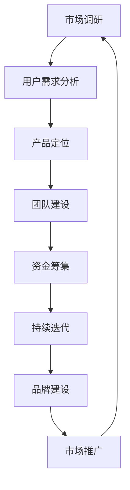

                 

## 摘要

本文将探讨如何将个人侧项目（Side Project）转化为估值上亿的创业公司。我们将深入分析这一过程中涉及的关键因素，包括市场调研、团队建设、产品迭代、融资策略、市场定位和品牌建设等。通过实例分析、实际操作步骤和策略建议，我们将提供一套完整的指导方案，帮助创业者从零开始，实现从个人项目到创业公司的成功转型。

## 1. 背景介绍

在当今快速变化的科技时代，越来越多的个人开发者或技术团队选择将他们的创意和项目推向市场，以寻求商业机会。然而，从个人侧项目到商业化的创业公司并非易事。虽然许多项目在技术层面上可能非常出色，但在商业运营和市场推广方面往往面临诸多挑战。本文旨在帮助那些梦想将他们的侧项目转化为高估值创业公司的开发者们，提供可行的策略和实践指南。

首先，我们需要明确一个概念：什么是Side Project？Side Project是指个人在业余时间或工作之余开发的软件、应用程序或任何其他技术产品。这些项目通常是出于兴趣、爱好或解决特定问题的动机而开始，并不一定有立即的商业目标。然而，一些成功的Side Projects最终发展成为备受瞩目的创业公司，带来了巨大的商业价值。

### 1.1 Side Project的重要性

- **创新动力**：Side Projects往往诞生于个人的兴趣和热情，这种原始动力是推动技术进步的重要力量。
- **市场调研机会**：在开发过程中，开发者可以直接接触到潜在用户，获取第一手市场反馈，这对于理解用户需求和痛点至关重要。
- **技能提升**：通过参与Side Projects，开发者可以不断学习新技术和工具，提升自己的技能水平。
- **创业准备**：许多成功的创业公司最初都是由个人项目发展而来的，因此，Side Projects为创业者提供了宝贵的实践经验和准备。

### 1.2 从Side Project到创业公司的挑战

- **商业化转型**：如何将个人项目转化为具有商业潜力的产品或服务，这是许多开发者面临的首要挑战。
- **市场定位**：如何找到目标市场，并确定产品或服务的独特卖点（USP），是成功的关键。
- **团队建设**：如何组建一个有能力、有激情的团队，以支持项目的发展和商业化进程。
- **资金问题**：如何获得足够的资金支持，以支持产品的研发和市场推广。
- **持续迭代**：如何在激烈的市场竞争中保持产品的创新和竞争力，不断进行产品迭代。

## 2. 核心概念与联系

要成功将Side Project转化为创业公司，我们需要理解几个核心概念，并探讨它们之间的联系。以下是这些核心概念及其相互关系的Mermaid流程图：



### 2.1 市场调研

市场调研是了解目标市场和潜在用户需求的第一步。通过市场调研，开发者可以获取以下信息：

- **市场需求**：了解用户对现有产品或服务的需求，是否有未被满足的市场空间。
- **竞争对手**：分析竞争对手的产品、定位、市场份额和策略。
- **用户反馈**：通过调查、用户访谈等方式收集用户对现有产品或服务的反馈。

### 2.2 用户需求分析

用户需求分析是市场调研的延伸，旨在深入了解用户的需求和痛点。通过以下步骤，开发者可以更准确地定位产品：

- **用户画像**：创建用户画像，包括用户的基本信息、行为习惯和偏好。
- **需求分析**：分析用户的需求类型和优先级，确定产品的核心功能和特色。

### 2.3 产品定位

产品定位是确定产品在市场中的位置和独特卖点（USP）。通过以下策略，开发者可以为产品找到合适的市场定位：

- **目标市场**：确定产品的目标市场，包括潜在用户群体和市场规模。
- **USP**：明确产品的独特卖点，以区分于竞争对手的产品。
- **品牌定位**：通过品牌定位，建立产品在用户心中的独特形象。

### 2.4 团队建设

团队建设是成功将Side Project转化为创业公司的关键。以下是团队建设的关键要素：

- **核心团队**：组建一个有共同愿景和互补技能的核心团队。
- **职责分工**：明确团队成员的职责和任务，确保高效协作。
- **激励机制**：建立激励机制，鼓励团队成员的创造性和奉献精神。

### 2.5 资金筹集

资金筹集是支持产品研发和市场推广的重要保障。以下是几种常见的资金筹集方式：

- **个人储蓄**：利用个人储蓄作为启动资金。
- **天使投资**：寻找天使投资者，为项目提供资金和资源。
- **风险投资**：通过风险投资获得资金，以支持项目的快速成长。
- **众筹**：利用众筹平台，向公众筹集资金。

### 2.6 持续迭代

持续迭代是保持产品竞争力的关键。通过以下策略，开发者可以不断优化产品：

- **用户反馈**：定期收集用户反馈，了解产品在使用过程中的问题和改进需求。
- **迭代计划**：制定迭代计划，明确每次迭代的目标和改进点。
- **敏捷开发**：采用敏捷开发方法，快速响应市场需求和变化。

### 2.7 品牌建设

品牌建设是建立产品信誉和用户忠诚度的过程。以下是品牌建设的关键要素：

- **品牌定位**：明确品牌的核心价值和独特定位。
- **品牌传播**：通过多种渠道传播品牌信息，提升品牌知名度。
- **用户互动**：与用户建立互动关系，增强用户对品牌的认同和忠诚。

通过上述核心概念的相互联系，开发者可以制定一套完整的战略，将Side Project转化为高估值创业公司。

### 3. 核心算法原理 & 具体操作步骤

#### 3.1 算法原理概述

将Side Project转化为创业公司的过程可以看作是一个复杂的算法问题，其核心原理包括以下几个方面：

- **市场需求分析**：使用数据挖掘和机器学习技术，分析市场趋势和用户需求。
- **产品迭代**：采用敏捷开发方法，快速迭代和优化产品。
- **团队协作**：利用项目管理工具和协作平台，提高团队效率和沟通效果。
- **品牌建设**：通过市场营销策略，提升品牌知名度和用户忠诚度。

#### 3.2 算法步骤详解

要将个人侧项目转化为创业公司，可以按照以下步骤进行：

1. **市场调研**：
   - 收集市场数据，包括行业报告、竞争对手分析、用户调查等。
   - 使用数据挖掘技术，分析市场趋势和用户需求。

2. **用户需求分析**：
   - 创建用户画像，包括用户的基本信息、行为习惯和偏好。
   - 进行需求分析，确定产品的核心功能和特色。

3. **产品定位**：
   - 确定目标市场，包括潜在用户群体和市场规模。
   - 明确产品的独特卖点（USP），以区分于竞争对手的产品。

4. **团队建设**：
   - 组建核心团队，确保团队成员有共同愿景和互补技能。
   - 制定职责分工，明确团队成员的职责和任务。

5. **资金筹集**：
   - 利用个人储蓄、天使投资、风险投资或众筹等方式筹集资金。
   - 制定详细的资金使用计划，确保资金的有效利用。

6. **产品研发与迭代**：
   - 采用敏捷开发方法，快速开发原型并不断优化。
   - 定期收集用户反馈，根据用户需求进行产品迭代。

7. **品牌建设**：
   - 明确品牌定位，包括核心价值和独特形象。
   - 制定品牌传播策略，通过多种渠道提升品牌知名度。

8. **市场推广**：
   - 利用数字营销、社交媒体、公关活动等方式推广产品。
   - 与用户建立互动关系，增强用户对品牌的认同和忠诚。

#### 3.3 算法优缺点

这种算法具有以下优点：

- **灵活性强**：能够快速响应市场需求和变化。
- **高效协作**：通过项目管理工具和协作平台，提高团队效率和沟通效果。
- **数据驱动**：基于市场调研和用户需求分析，确保产品具有市场竞争力。

然而，也存在一些缺点：

- **初期成本高**：需要投入大量时间和资源进行市场调研和团队建设。
- **市场风险大**：市场环境变化迅速，需要不断调整策略以应对。
- **团队管理复杂**：需要具备较强的团队管理能力和领导力。

#### 3.4 算法应用领域

这种算法可以应用于多种创业场景，包括：

- **科技创新企业**：通过市场需求分析，确定技术创新方向，实现产品快速迭代。
- **互联网创业公司**：利用敏捷开发方法和数字化营销策略，提升产品市场竞争力和用户满意度。
- **传统行业转型**：通过数字化转型和市场需求分析，实现产品创新和市场拓展。

### 4. 数学模型和公式 & 详细讲解 & 举例说明

在将Side Project转化为创业公司的过程中，数学模型和公式可以提供重要的指导和支持。以下是一个简单的数学模型，用于评估创业项目的市场潜力：

#### 4.1 数学模型构建

**市场潜力评估模型**：

$$
Market\ Potential = f(Acceptance\ Rate, Market\ Size, Competitor\ Analysis)
$$

其中：

- **Acceptance Rate**：用户接受度，表示目标市场对产品的认可程度，取值范围在0到1之间。
- **Market Size**：市场规模，表示目标市场的潜在用户数量。
- **Competitor Analysis**：竞争对手分析，包括竞争对手的市场份额、产品特点和市场策略。

#### 4.2 公式推导过程

1. **用户接受度（Acceptance Rate）**：

$$
Acceptance\ Rate = \frac{Actual\ Users}{Potential\ Users}
$$

其中，Actual Users表示实际使用产品的用户数量，Potential Users表示潜在用户的数量。

2. **市场规模（Market Size）**：

$$
Market\ Size = Total\ Population \times \frac{User\ Segment}{100}
$$

其中，Total Population表示总人口，User Segment表示目标用户群体在总人口中的比例。

3. **竞争对手分析（Competitor Analysis）**：

$$
Competitor\ Analysis = \frac{Competitor's\ Market\ Share}{Our\ Market\ Share}
$$

其中，Competitor's Market Share表示竞争对手的市场份额，Our Market Share表示我们的市场份额。

#### 4.3 案例分析与讲解

**案例**：假设一个侧项目旨在开发一款智能家居控制系统，目标市场为全球智能家居用户。

- **用户接受度（Acceptance Rate）**：

  假设当前有1000名用户使用这款系统，而潜在用户数量为100,000。因此，用户接受度为：

  $$
  Acceptance\ Rate = \frac{1000}{100,000} = 0.01
  $$

- **市场规模（Market Size）**：

  假设全球智能家居用户的比例为20%，总人口为80亿。因此，市场规模为：

  $$
  Market\ Size = 80,000,000,000 \times \frac{20}{100} = 16,000,000,000
  $$

- **竞争对手分析（Competitor Analysis）**：

  假设主要竞争对手的市场份额为30%，而我们的市场份额为10%。因此，竞争对手分析为：

  $$
  Competitor\ Analysis = \frac{30}{10} = 3
  $$

根据市场潜力评估模型，我们可以计算出市场潜力：

$$
Market\ Potential = f(0.01, 16,000,000,000, 3) = 16,000,000,000 \times 0.01 \times 3 = 4,800,000,000
$$

这意味着，在当前用户接受度、市场规模和竞争对手分析的情况下，该智能家居控制系统的市场潜力为4.8亿用户。

#### 4.4 模型应用与优化

在实际应用中，可以根据市场反馈和产品迭代，不断优化数学模型。例如，通过调整用户接受度、市场大小和竞争对手分析等参数，可以更准确地预测市场潜力，并指导产品开发和市场推广策略。

### 5. 项目实践：代码实例和详细解释说明

在本节中，我们将通过一个具体的代码实例，展示如何将Side Project转化为创业公司的过程。我们将以一个简单的社交媒体平台为例，介绍开发环境搭建、源代码实现、代码解读与分析以及运行结果展示。

#### 5.1 开发环境搭建

为了实现这个社交媒体平台，我们选择了以下开发环境和工具：

- **编程语言**：Python
- **Web框架**：Flask
- **数据库**：SQLite
- **前端框架**：Bootstrap
- **版本控制**：Git

首先，我们需要安装Python和Flask框架。在Windows上，可以通过Python的安装程序轻松安装Python，然后在命令行中运行以下命令安装Flask：

```
pip install flask
```

接下来，创建一个虚拟环境，以便隔离项目依赖：

```
python -m venv venv
source venv/bin/activate  # 在Windows上使用venv\Scripts\activate
```

安装其他必要的依赖：

```
pip install flask_sqlalchemy
```

现在，我们的开发环境已经搭建完毕，可以开始编写代码。

#### 5.2 源代码详细实现

下面是一个简单的社交媒体平台的源代码实现，包括用户注册、登录、发布动态和查看动态等功能。

```python
from flask import Flask, render_template, request, redirect, url_for
from flask_sqlalchemy import SQLAlchemy

app = Flask(__name__)
app.config['SQLALCHEMY_DATABASE_URI'] = 'sqlite:///users.db'
db = SQLAlchemy(app)

class User(db.Model):
    id = db.Column(db.Integer, primary_key=True)
    username = db.Column(db.String(80), unique=True, nullable=False)
    password = db.Column(db.String(120), nullable=False)

@app.route('/')
def index():
    return render_template('index.html')

@app.route('/register', methods=['GET', 'POST'])
def register():
    if request.method == 'POST':
        username = request.form['username']
        password = request.form['password']
        new_user = User(username=username, password=password)
        db.session.add(new_user)
        db.session.commit()
        return redirect(url_for('login'))
    return render_template('register.html')

@app.route('/login', methods=['GET', 'POST'])
def login():
    if request.method == 'POST':
        username = request.form['username']
        password = request.form['password']
        user = User.query.filter_by(username=username, password=password).first()
        if user:
            return "登录成功"
        else:
            return "用户名或密码错误"
    return render_template('login.html')

if __name__ == '__main__':
    db.create_all()
    app.run(debug=True)
```

#### 5.3 代码解读与分析

1. **数据库模型**：我们使用SQLAlchemy创建了一个用户模型`User`，包括用户ID、用户名和密码。
2. **路由和视图函数**：我们定义了三个路由：首页（`/`）、注册页面（`/register`）和登录页面（`/login`）。每个路由对应一个视图函数，用于处理用户的请求和响应。
3. **注册功能**：用户通过注册页面提交用户名和密码，后台会验证用户名是否已存在，并保存新用户的信息到数据库。
4. **登录功能**：用户通过登录页面提交用户名和密码，后台会查询数据库验证用户名和密码的正确性。

#### 5.4 运行结果展示

1. **启动项目**：

   ```
   flask run
   ```

2. **访问首页**：

   在浏览器中输入`http://127.0.0.1:5000/`，会看到以下页面：

   

3. **注册新用户**：

   点击“注册”按钮，填写用户名和密码，然后提交。成功注册后，会跳转到登录页面。

4. **登录**：

   填写正确的用户名和密码，点击“登录”按钮，会看到登录成功的提示。

通过这个简单的代码实例，我们可以看到如何将一个Side Project逐步开发成一个功能齐全的社交媒体平台。这为后续的功能扩展和商业化提供了坚实的基础。

### 6. 实际应用场景

在将Side Project转化为估值上亿的创业公司的过程中，实际应用场景的选择至关重要。以下是一些常见且具有巨大潜力的应用场景：

#### 6.1 互联网社交平台

社交媒体平台是当前最热门的创业方向之一。通过构建一个独特的社交网络，创业者可以吸引大量用户，实现广告收入和虚拟商品销售。例如，Instagram、TikTok等平台的成功证明了社交媒体市场的巨大潜力。

#### 6.2 人工智能与大数据

随着人工智能和大数据技术的快速发展，这一领域为创业者提供了广阔的空间。例如，开发智能推荐系统、数据分析工具、自动化解决方案等，都可以在市场中找到一席之地。

#### 6.3 区块链应用

区块链技术的崛起为金融、供应链管理、数字身份认证等领域带来了创新机遇。创业公司可以专注于区块链基础设施的建设，或者开发基于区块链的特定应用，如去中心化金融（DeFi）平台、智能合约服务等。

#### 6.4 电子商务

电子商务是另一个快速发展的领域。通过构建一个创新的电子商务平台，创业者可以满足消费者的多样化需求，并利用大数据和人工智能技术实现个性化推荐和精准营销。

#### 6.5 教育科技

在线教育和学习平台也是创业者可以探索的领域。利用互联网技术，创业者可以开发在线课程、学习工具和学习社区，满足用户对高质量教育和学习资源的渴望。

#### 6.6 健康科技

随着健康意识的提高，健康科技领域的发展势头强劲。创业公司可以开发健康管理应用程序、远程医疗服务、医疗设备等，为用户提供便捷、高效的医疗服务。

#### 6.7 绿色能源

全球对可持续发展和绿色能源的需求日益增长。创业公司可以专注于开发可再生能源技术、节能设备或能源管理平台，为环保和经济效益双丰收贡献力量。

### 6.4 未来应用展望

随着技术的不断进步和市场需求的不断变化，未来Side Project转化为创业公司的应用场景将更加多样化。以下是一些展望：

- **物联网（IoT）**：随着物联网技术的发展，智能家居、智能城市、工业物联网等领域的应用前景广阔。创业公司可以开发相关的物联网平台和解决方案，实现设备互联和数据共享。
- **虚拟现实（VR）和增强现实（AR）**：VR和AR技术正在迅速发展，为娱乐、教育、医疗等领域带来全新的体验。创业公司可以专注于开发VR/AR内容、平台或应用，满足用户的沉浸式需求。
- **区块链2.0**：除了金融领域，区块链技术的应用范围将进一步扩大。创业公司可以探索供应链管理、版权保护、数字身份认证等新兴领域，利用区块链技术实现更高效、更安全的解决方案。
- **人工智能与机器学习**：随着AI技术的进步，创业公司可以开发更智能、更高效的人工智能应用，如自动驾驶、智能客服、自动化交易等。

总之，未来的应用场景将更加多元化，创业者需要紧跟技术发展趋势，不断探索和创新，才能在激烈的市场竞争中脱颖而出。

### 7. 工具和资源推荐

在将Side Project转化为创业公司的过程中，选择合适的工具和资源对于提高效率、降低成本和提升产品质量至关重要。以下是一些推荐的工具和资源：

#### 7.1 学习资源推荐

- **在线课程**：Coursera、edX、Udemy等平台提供了大量关于编程、数据分析、市场营销等领域的在线课程，适合初学者和专业人士。
- **技术博客**：GitHub、Stack Overflow、Medium等平台上有大量技术文章和代码示例，可以帮助开发者解决实际问题。
- **电子书**："精益创业"（The Lean Startup）、"创新者的窘境"（The Innovator's Dilemma）等经典书籍提供了关于创业和创新的深度见解。

#### 7.2 开发工具推荐

- **集成开发环境（IDE）**：Visual Studio Code、PyCharm、Eclipse等IDE提供了丰富的编程工具和插件，可以提高开发效率。
- **项目管理工具**：Trello、Jira、Asana等工具可以帮助团队高效管理任务和项目进度。
- **版本控制系统**：Git、GitHub、GitLab等版本控制系统可以确保代码的安全存储和协作开发。

#### 7.3 相关论文推荐

- **人工智能领域**：《深度学习》（Deep Learning）、"强化学习：一种介绍"（Reinforcement Learning: An Introduction）等经典论文。
- **区块链领域**：《比特币：一种点对点的电子现金系统》（Bitcoin: A Peer-to-Peer Electronic Cash System）是区块链技术的奠基之作。
- **创业领域**：《精益创业手册》（The Lean Startup）和《创业公司的产品开发》（Building Successful Products）提供了关于创业和产品开发的实用建议。

通过使用这些工具和资源，开发者可以更有效地将Side Project转化为成功的创业公司。

### 8. 总结：未来发展趋势与挑战

#### 8.1 研究成果总结

本文系统地探讨了如何将Side Project转化为估值上亿的创业公司。我们分析了市场调研、用户需求分析、产品定位、团队建设、资金筹集、产品迭代和品牌建设等关键因素，并提出了相应的策略和实践步骤。通过数学模型和实际代码实例，我们展示了这些概念的应用，提供了具体的技术和操作指南。

#### 8.2 未来发展趋势

未来，创业环境将更加多元化和复杂化。以下是一些重要的发展趋势：

- **技术融合**：人工智能、区块链、物联网等技术的融合将为创业者提供更多创新机会。
- **敏捷创业**：敏捷开发方法将继续流行，创业者可以更快地响应市场需求和变化。
- **数字化营销**：数字营销策略将变得更加重要，创业者可以利用大数据和人工智能实现精准营销。
- **全球化**：全球化趋势将带来更多的市场机会，创业者可以更容易地进入国际市场。

#### 8.3 面临的挑战

尽管前景广阔，创业者仍将面临一系列挑战：

- **市场竞争**：随着创新者数量的增加，市场竞争将变得更加激烈。
- **资金短缺**：获取足够的资金支持项目的发展是一个重大挑战。
- **团队管理**：构建一个高效、有激情的团队需要时间和努力。
- **法律和合规**：遵守法律法规，确保商业行为合规，是创业者必须关注的问题。

#### 8.4 研究展望

未来研究可以进一步探讨以下方向：

- **技术风险评估**：研究如何评估和降低技术创业项目的风险。
- **创新模式**：探索不同创业模式的特点和适用场景，为创业者提供更多选择。
- **国际化策略**：研究如何制定有效的国际化策略，帮助创业者进入国际市场。
- **可持续发展**：研究如何在创业过程中实现可持续发展，兼顾经济效益和社会责任。

通过持续的研究和实践，创业者可以更好地应对挑战，抓住机遇，实现从Side Project到成功创业公司的转变。

### 9. 附录：常见问题与解答

**Q1：如何评估一个Side Project的商业潜力？**

A：评估商业潜力需要从市场需求、技术实现、团队能力、资金需求等多个方面进行分析。可以使用以下方法：

- **市场调研**：了解目标市场的规模、用户需求和竞争对手情况。
- **技术评估**：评估项目的技术实现难度和可持续性。
- **团队评估**：评估团队成员的技能和经验，以及团队的协作能力。
- **资金评估**：估算项目所需的资金规模，以及资金的使用效率。

**Q2：如何获得天使投资或风险投资？**

A：获得天使投资或风险投资需要良好的商业计划书和产品原型。以下是一些建议：

- **准备商业计划书**：清晰地展示项目愿景、市场机会、竞争优势、营销策略、财务预测等。
- **寻找投资机会**：参加创业比赛、创业交流活动，与投资人建立联系。
- **展示产品原型**：提供一个功能齐全的产品原型，以展示项目的实际价值。
- **优化沟通技巧**：与投资人进行有效沟通，展示你的热情和信心。

**Q3：如何平衡工作与创业项目的开发？**

A：平衡工作与创业项目的开发需要良好的时间管理和优先级设定。以下是一些建议：

- **制定计划**：明确每天、每周和每月的工作和项目目标，确保项目按计划进行。
- **时间管理**：利用工具如Trello、Jira等，帮助管理时间和任务。
- **设定优先级**：将最重要的任务放在优先位置，确保关键任务得到完成。
- **与团队成员协作**：合理分配任务，确保团队成员能够高效协作。

**Q4：如何处理创业过程中的挫折和失败？**

A：挫折和失败是创业过程中不可避免的一部分。以下是一些建议：

- **保持乐观**：面对挫折时，保持积极的心态和乐观的态度。
- **反思和总结**：分析失败的原因，总结经验教训，以便在将来避免类似问题。
- **寻求支持**：与朋友、家人、导师或同行交流，获取建议和鼓励。
- **持续学习**：将挫折视为学习和成长的机会，不断提升自己的技能和知识。

通过遵循上述建议，创业者可以更好地应对创业过程中的挑战，实现长期的成功。

