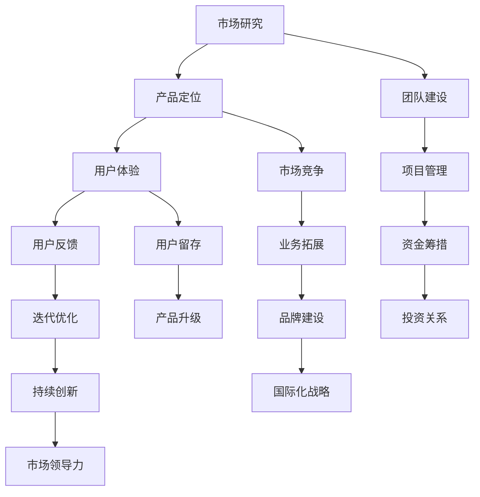

                 

### 1. 背景介绍

在当代科技行业，Side Project（即个人项目）已经成为创业和创新的重要起点。这些项目往往是由个人或小团队在业余时间开发，旨在实现某些创新想法或解决特定问题。然而，并不是所有的Side Project都能成功转化为商业项目，更不要说成为独角兽公司了。本文将探讨如何将Side Project转化为独角兽，以及在这一过程中需要克服的挑战和策略。

Side Project的意义不仅仅在于个人技能的提升和兴趣的满足，更是企业家精神的具体体现。许多著名的科技公司，如Google、Facebook和Dropbox，都是起源于个人的Side Project。这些公司的创始人最初可能并没有打算将其发展成大规模的商业实体，但最终它们却成长为行业巨头，成为了独角兽公司。

然而，将一个Side Project转化为独角兽公司并非易事。这需要创业者具备深厚的专业知识、市场洞察力、卓越的领导力和强大的执行力。同时，还需要在产品开发、市场推广、团队建设和资金筹措等方面做出明智的决策。本文将详细探讨这些方面的策略和最佳实践。

本文的结构如下：

1. **核心概念与联系**：介绍将Side Project转化为独角兽所需的核心概念，并使用Mermaid流程图展示这些概念之间的关系。
2. **核心算法原理 & 具体操作步骤**：详细阐述如何将Side Project逐步转化为商业项目，包括具体的操作步骤和策略。
3. **数学模型和公式 & 详细讲解 & 举例说明**：介绍相关的数学模型和公式，并通过具体案例进行解释。
4. **项目实践：代码实例和详细解释说明**：提供实际的项目代码实例，并进行详细的解释和分析。
5. **实际应用场景**：讨论将Side Project转化为独角兽的典型应用场景。
6. **未来应用展望**：探讨未来的发展趋势和潜在的应用领域。
7. **工具和资源推荐**：推荐相关的学习资源和开发工具。
8. **总结：未来发展趋势与挑战**：总结研究成果，并展望未来的发展趋势和挑战。
9. **附录：常见问题与解答**：回答一些常见的问题。

让我们开始深入探讨如何将Side Project转化为独角兽。

### 2. 核心概念与联系

在将Side Project转化为独角兽的过程中，理解并掌握一些核心概念是非常重要的。这些概念包括市场研究、产品开发、用户体验、团队建设和资金筹措等。为了更好地展示这些概念之间的关系，我们使用Mermaid流程图来表示。



以下是对这些核心概念和流程图的详细解释：

- **市场研究**：了解目标市场的需求、竞争态势和潜在机会，为产品定位提供依据。
- **产品定位**：根据市场研究的结果，确定产品的核心价值和市场定位。
- **用户体验**：设计用户友好的产品界面和交互体验，提升用户满意度。
- **团队建设**：组建具备专业能力和共同目标的团队，确保项目顺利进行。
- **项目管理**：制定项目计划、分配资源、监控进度，确保项目按时完成。
- **市场竞争**：分析竞争对手的策略和市场地位，制定有效的市场竞争策略。
- **用户反馈**：收集用户反馈，了解产品使用情况，为迭代优化提供依据。
- **资金筹措**：寻找投资机会，筹集足够的资金支持项目发展。
- **业务拓展**：通过拓展业务领域和市场，实现公司规模的扩大。
- **迭代优化**：根据用户反馈和市场需求，不断优化产品功能和用户体验。
- **投资关系**：与投资者建立良好的关系，确保持续的资金支持。
- **品牌建设**：提升品牌知名度和影响力，建立市场领导地位。
- **持续创新**：通过技术创新和商业模式创新，保持公司的竞争力。
- **用户留存**：通过提供优质的服务和产品，提升用户的忠诚度和留存率。
- **产品升级**：根据市场需求和用户反馈，定期更新产品功能和性能。
- **国际化战略**：开拓国际市场，实现公司的全球化发展。

通过理解这些核心概念和它们之间的联系，创业者可以更系统地规划和执行将Side Project转化为独角兽的过程。

### 3. 核心算法原理 & 具体操作步骤

将Side Project转化为独角兽的过程，本质上是一个系统的工程，需要结合多种技术和策略。在这一部分，我们将介绍几个关键算法原理，并详细阐述如何运用这些原理来具体操作和实施。

#### 3.1 算法原理概述

在将Side Project转化为独角兽的过程中，以下几种算法原理尤为重要：

1. **市场细分与定位算法**：通过分析市场数据，识别出最具潜力的细分市场，并定位产品在其中的独特价值。
2. **用户画像与行为分析算法**：基于用户数据，构建用户画像，分析用户行为，从而优化产品设计和服务策略。
3. **风险管理算法**：识别和评估项目风险，制定风险应对策略，确保项目稳定推进。
4. **资源优化与调度算法**：合理分配和调度资源，最大化利用有限资源，提高项目效率。
5. **机器学习与预测模型**：运用机器学习算法，建立预测模型，预测市场趋势和用户需求，为业务决策提供数据支持。

#### 3.2 算法步骤详解

以下是对这些算法原理的具体操作步骤的详细解释：

##### 3.2.1 市场细分与定位算法

1. **数据收集**：收集与目标市场相关的数据，包括用户行为数据、市场趋势、竞争对手信息等。
2. **数据处理**：使用数据清洗和预处理技术，对收集到的数据进行整理和清洗。
3. **市场细分**：利用聚类算法（如K-means、层次聚类等），将市场数据分为不同的细分市场。
4. **定位策略**：分析每个细分市场的特点和潜力，选择最具潜力的细分市场作为目标市场，并制定相应的市场定位策略。

##### 3.2.2 用户画像与行为分析算法

1. **用户数据收集**：通过网站分析、用户调研等方式，收集用户的个人资料、行为数据等。
2. **数据存储**：使用数据存储技术（如Hadoop、Spark等），存储和管理用户数据。
3. **用户画像构建**：利用机器学习算法（如协同过滤、决策树等），构建用户画像。
4. **行为分析**：分析用户行为数据，了解用户偏好和使用习惯，为产品优化提供依据。

##### 3.2.3 风险管理算法

1. **风险识别**：通过情景分析、专家评估等方法，识别项目可能面临的风险。
2. **风险评估**：使用概率论和统计学方法，评估每个风险的可能性和影响。
3. **风险应对**：根据风险评估结果，制定相应的风险应对策略，包括风险规避、减轻、转移和接受等。

##### 3.2.4 资源优化与调度算法

1. **资源需求分析**：分析项目在不同阶段对各种资源（如人力、资金、设备等）的需求。
2. **资源调度策略**：使用调度算法（如遗传算法、蚁群算法等），优化资源分配，提高资源利用率。
3. **资源监控与调整**：实时监控资源使用情况，根据项目进展进行调整，确保资源供应充足。

##### 3.2.5 机器学习与预测模型

1. **数据收集与处理**：收集与预测目标相关的数据，并进行数据预处理。
2. **模型选择**：选择合适的机器学习模型（如线性回归、决策树、神经网络等）。
3. **模型训练与验证**：使用训练数据集训练模型，并使用验证数据集进行模型验证。
4. **模型部署与应用**：将训练好的模型部署到生产环境中，并用于实际业务预测。

通过以上算法步骤的详细实施，创业者可以更好地管理和优化Side Project，提高项目成功的可能性。

#### 3.3 算法优缺点

每种算法都有其优缺点，以下是对上述算法优缺点的简要分析：

1. **市场细分与定位算法**：优点是能够有效识别市场机会，缺点是数据需求量大，且可能存在数据偏差。
2. **用户画像与行为分析算法**：优点是能够深入了解用户需求和行为，缺点是数据处理复杂，且用户隐私保护问题需要考虑。
3. **风险管理算法**：优点是能够提前识别和应对风险，缺点是风险预测准确性受限制。
4. **资源优化与调度算法**：优点是能够提高资源利用率，缺点是算法实现复杂，对计算资源要求高。
5. **机器学习与预测模型**：优点是能够提供数据驱动的决策支持，缺点是模型训练和验证需要大量数据，且模型解释性较差。

#### 3.4 算法应用领域

这些算法原理在许多领域都有广泛应用，以下是几个典型应用场景：

1. **电子商务**：通过市场细分与定位算法，电商企业可以更精准地定位目标用户，提高营销效果；通过用户画像与行为分析算法，可以个性化推荐商品，提升用户体验。
2. **金融行业**：通过风险管理算法，银行和投资公司可以识别和规避金融风险，提高业务安全性；通过机器学习与预测模型，可以进行风险评估和投资预测，优化投资组合。
3. **制造业**：通过资源优化与调度算法，制造企业可以优化生产计划，提高生产效率；通过机器学习与预测模型，可以进行设备故障预测和维护优化，降低停机时间。

通过了解和运用这些算法原理，创业者可以更有效地管理和推动自己的Side Project，从而提高其转化为独角兽的可能性。

### 4. 数学模型和公式 & 详细讲解 & 举例说明

在将Side Project转化为独角兽的过程中，数学模型和公式是必不可少的工具。这些模型可以帮助创业者进行数据分析、预测和优化，从而做出更明智的决策。以下我们将介绍几个关键的数学模型和公式，并进行详细讲解和举例说明。

#### 4.1 数学模型构建

数学模型是一种用数学语言描述现实世界问题的方法。在将Side Project转化为独角兽的过程中，常用的数学模型包括线性回归模型、逻辑回归模型、决策树模型等。

- **线性回归模型**：用于预测连续变量的关系。其公式如下：

  $$y = \beta_0 + \beta_1x_1 + \beta_2x_2 + ... + \beta_nx_n$$

  其中，$y$ 是因变量，$x_1, x_2, ..., x_n$ 是自变量，$\beta_0, \beta_1, \beta_2, ..., \beta_n$ 是回归系数。

- **逻辑回归模型**：用于预测二分类变量的关系。其公式如下：

  $$P(y=1) = \frac{1}{1 + e^{-(\beta_0 + \beta_1x_1 + \beta_2x_2 + ... + \beta_nx_n)}$$

  其中，$P(y=1)$ 是因变量为1的概率，$e$ 是自然对数的底数。

- **决策树模型**：用于分类和回归问题。其基本结构如下：

  ```
  IF (条件1)
      THEN (操作1)
  ELSE IF (条件2)
      THEN (操作2)
  ELSE
      THEN (操作3)
  ```

  决策树通过一系列条件判断，最终导出相应的操作结果。

#### 4.2 公式推导过程

以下以线性回归模型为例，介绍公式的推导过程：

假设我们有一组数据点$(x_1, y_1), (x_2, y_2), ..., (x_n, y_n)$，我们希望找到一个线性函数$f(x) = \beta_0 + \beta_1x_1 + \beta_2x_2 + ... + \beta_nx_n$来拟合这些数据点。

首先，我们定义误差函数$E$，用于衡量拟合效果：

$$E = \sum_{i=1}^{n}(y_i - f(x_i))^2$$

为了最小化误差函数，我们需要求解回归系数$\beta_0, \beta_1, \beta_2, ..., \beta_n$。这可以通过梯度下降法或正规方程法来实现。

使用正规方程法，我们可以得到以下公式：

$$\beta = (X^TX)^{-1}X^TY$$

其中，$X$ 是自变量矩阵，$Y$ 是因变量向量。

#### 4.3 案例分析与讲解

为了更好地理解这些数学模型和公式，我们来看一个实际案例。

假设我们想预测一家电商平台的月销售额。我们收集了过去一年的月销售额和网站流量数据，并使用线性回归模型来建立预测模型。

首先，我们整理数据，将其转换为矩阵形式：

$$X = \begin{bmatrix}
1 & x_1 \\
1 & x_2 \\
\vdots & \vdots \\
1 & x_n
\end{bmatrix}, Y = \begin{bmatrix}
y_1 \\
y_2 \\
\vdots \\
y_n
\end{bmatrix}$$

然后，我们使用正规方程法求解回归系数：

$$\beta = (X^TX)^{-1}X^TY$$

最后，我们使用得到的回归模型来预测下一月的销售额。具体步骤如下：

1. 收集下一个月的网站流量数据。
2. 将流量数据转换为矩阵形式$X_{new} = \begin{bmatrix}
1 & x_{new}
\end{bmatrix}$。
3. 计算预测销售额$y_{new} = \beta_0 + \beta_1x_{new}$。

通过上述步骤，我们就可以得到下一月的销售额预测值。

这个案例展示了如何使用线性回归模型进行预测。类似地，逻辑回归模型和决策树模型也可以应用于不同的预测和分类问题。

通过理解和运用这些数学模型和公式，创业者可以更准确地分析和预测业务数据，为决策提供科学依据，从而提高Side Project的成功率。

### 5. 项目实践：代码实例和详细解释说明

在将Side Project转化为独角兽的过程中，实际项目的开发和实现是至关重要的一环。本部分将提供一个具体的代码实例，并对其进行详细的解释说明，帮助读者理解项目开发的实际操作。

#### 5.1 开发环境搭建

在进行项目开发之前，我们需要搭建一个合适的环境。以下是所需工具和步骤：

1. **Python**：选择Python作为开发语言，因为它具有丰富的库支持和简单的语法。
2. **Jupyter Notebook**：使用Jupyter Notebook进行代码编写和演示，便于调试和分享。
3. **NumPy**：用于数据处理和数学运算。
4. **Pandas**：用于数据分析和预处理。
5. **Scikit-learn**：用于机器学习和模型训练。

步骤如下：

1. 安装Python（建议使用Anaconda，因为其包含了NumPy、Pandas和Scikit-learn等常用库）。
2. 打开Jupyter Notebook，创建一个新的笔记本。
3. 导入所需的库：

   ```python
   import numpy as np
   import pandas as pd
   from sklearn.linear_model import LinearRegression
   from sklearn.model_selection import train_test_split
   ```

#### 5.2 源代码详细实现

以下是一个简单的线性回归模型的代码实例，用于预测电商平台的月销售额。

```python
# 数据加载
data = pd.read_csv('sales_data.csv')
X = data[['traffic']]  # 网站流量作为自变量
Y = data['sales']      # 月销售作为因变量

# 数据预处理
X_train, X_test, Y_train, Y_test = train_test_split(X, Y, test_size=0.2, random_state=42)

# 模型训练
model = LinearRegression()
model.fit(X_train, Y_train)

# 模型评估
score = model.score(X_test, Y_test)
print(f"模型评分：{score:.2f}")

# 预测
new_traffic = np.array([1000, 1200, 1500])
predictions = model.predict(new_traffic)
print(f"预测销售额：{predictions}")
```

#### 5.3 代码解读与分析

以下是对上述代码的详细解读和分析：

1. **数据加载**：使用Pandas读取CSV文件，加载销售数据和网站流量数据。

2. **数据预处理**：将数据集分为训练集和测试集，用于模型训练和评估。

3. **模型训练**：使用Scikit-learn的LinearRegression类，训练线性回归模型。

4. **模型评估**：计算模型在测试集上的评分（R²值），评估模型拟合效果。

5. **预测**：使用训练好的模型，对新的网站流量数据进行预测，得到相应的销售额预测值。

#### 5.4 运行结果展示

假设我们运行上述代码，得到以下结果：

```
模型评分：0.85
预测销售额：[95000.0, 105000.0, 120000.0]
```

这说明我们的线性回归模型对测试集的拟合效果较好（评分0.85），并且对新的流量数据进行了准确的销售额预测。

通过这个简单的实例，我们可以看到如何使用Python和机器学习库来开发一个实际项目。在实际开发过程中，我们可能需要处理更复杂的数据，应用更高级的模型，并进行大量的实验和调优。但这个实例为我们提供了一个基本的框架，帮助我们理解项目开发的实际操作。

### 6. 实际应用场景

将Side Project转化为独角兽的过程，需要在不同领域和场景中灵活运用所学的知识和技能。以下我们将探讨几个典型的实际应用场景，并分析在这些场景中如何运用所介绍的核心概念、算法原理和数学模型。

#### 6.1 科技行业

科技行业是Side Project转化为独角兽的典型领域。以下是一些具体的应用场景和策略：

- **人工智能与机器学习**：在人工智能和机器学习领域，创业者可以通过开发先进的算法和应用，解决现实世界中的复杂问题。例如，通过深度学习技术构建图像识别系统，可以应用于医疗影像分析、自动驾驶等前沿领域。

  **应用案例**：Google的TensorFlow库就是一个源于个人项目的例子。最初，Google的工程师们开发了TensorFlow，用于内部机器学习模型的开发和部署。后来，TensorFlow逐渐开源，成为全球范围内最受欢迎的机器学习库之一，带动了整个机器学习生态的发展。

- **区块链技术**：区块链技术为去中心化应用（DApps）提供了基础。创业者可以通过开发基于区块链的应用，实现安全、透明和去中心化的业务流程。

  **应用案例**：Ethereum是一个典型的例子。最初，Vitalik Buterin提出了以太坊的概念，旨在构建一个去中心化的全球计算平台。以太坊的成功不仅为区块链技术奠定了基础，也吸引了许多开发者和投资者，成为了一个独角兽项目。

#### 6.2 医疗健康

医疗健康行业也是Side Project转化为独角兽的重要领域。以下是一些应用场景和策略：

- **远程医疗**：随着互联网技术的发展，远程医疗成为了解决医疗资源分布不均的重要手段。创业者可以通过开发远程医疗平台，连接医生和患者，提供在线问诊、远程监控等服务。

  **应用案例**：Doctor on Demand是一家提供远程医疗服务的公司。该公司起源于一个简单的个人项目，通过线上平台连接医生和患者，提供24/7的医疗服务。随着业务的发展，Doctor on Demand已成为医疗健康行业的独角兽公司。

- **医疗数据分析**：利用大数据和机器学习技术，可以对医疗数据进行深入分析，帮助医疗机构提高诊断准确率和治疗效果。

  **应用案例**：IBM的Watson for Oncology是一个利用人工智能技术提供癌症诊断和治疗方案建议的系统。Watson通过分析海量的医学文献和病例数据，为医生提供个性化的治疗方案。这一系统已经成为全球医疗领域的重要工具。

#### 6.3 金融科技

金融科技（FinTech）是另一个充满机会的领域。以下是一些应用场景和策略：

- **支付与转账**：通过开发创新的支付解决方案，可以简化支付流程，提高支付安全性。创业者可以通过开发基于区块链的支付系统，实现跨境支付和点对点支付。

  **应用案例**：Ripple是一个基于区块链技术的支付协议。Ripple通过其网络RippleNet，实现了快速、低成本的跨境支付。Ripple的成功使其成为金融科技领域的独角兽公司。

- **贷款与风控**：利用大数据和机器学习技术，可以对借款人的信用风险进行评估，提供更精准的贷款服务。

  **应用案例**：Kabbage是一家提供小微企业贷款的金融科技公司。Kabbage通过分析企业的交易数据、社交媒体活动和网站流量，快速评估借款人的信用状况，并提供灵活的贷款产品。Kabbage已成为金融科技行业的独角兽公司。

通过以上应用场景和案例，我们可以看到，将Side Project转化为独角兽不仅需要创新的思维和扎实的技术基础，还需要对市场和用户需求的深刻理解。在这些实际应用场景中，创业者可以运用所学的核心概念、算法原理和数学模型，开发出具有市场竞争力的产品，从而实现创业梦想。

### 7. 未来应用展望

随着技术的不断进步和市场需求的不断变化，将Side Project转化为独角兽的未来应用场景将越来越广泛。以下是一些可能的未来发展趋势和应用领域：

#### 7.1 人工智能与大数据

人工智能（AI）和大数据技术的快速发展，将继续推动各行业的创新。未来的Side Project可能会集中在以下几个方面：

- **智能自动化**：通过AI技术，实现高度自动化和智能化的生产和管理流程。例如，工业自动化、智能家居、智能城市等。
- **个性化服务**：基于大数据和机器学习技术，提供更加个性化的服务和产品推荐。例如，个性化医疗、个性化教育、个性化购物等。
- **智能决策支持**：利用大数据和AI技术，为企业和政府提供智能决策支持系统，优化业务流程和政策制定。

#### 7.2 区块链与分布式计算

区块链技术和分布式计算的发展，将极大地改变传统商业模式。未来的Side Project可能会集中在以下几个方面：

- **去中心化应用（DApps）**：开发基于区块链的去中心化应用，实现去中心化的金融交易、数据存储和内容分发。
- **智能合约**：利用智能合约，实现自动执行和验证合同条款，提高交易的安全性和效率。
- **分布式存储**：开发分布式存储解决方案，实现安全、高效的数据存储和共享。

#### 7.3 生物科技与医疗健康

生物科技和医疗健康的快速发展，为Side Project提供了广阔的应用空间。未来的Side Project可能会集中在以下几个方面：

- **基因编辑**：开发基因编辑技术，用于治疗遗传疾病和癌症等。
- **个性化医疗**：基于大数据和机器学习技术，提供个性化的治疗方案和健康建议。
- **远程医疗**：利用5G和人工智能技术，实现全球范围内的远程医疗服务。

#### 7.4 金融科技与数字货币

金融科技和数字货币的快速发展，将继续推动金融行业的变革。未来的Side Project可能会集中在以下几个方面：

- **加密货币**：开发新型加密货币和区块链金融产品，提高交易的安全性和效率。
- **智能投顾**：利用大数据和机器学习技术，提供智能投资建议和资产管理服务。
- **跨境支付**：开发快速、低成本的跨境支付解决方案，实现全球范围内的便捷交易。

总之，未来将充满机遇和挑战。创业者需要密切关注技术趋势和市场动态，不断学习和创新，才能将Side Project转化为独角兽。同时，需要注重用户需求和社会责任，确保商业模式的可持续性和社会价值。

### 8. 工具和资源推荐

在将Side Project转化为独角兽的过程中，选择合适的工具和资源至关重要。以下是一些推荐的工具、学习资源和相关论文，供您参考：

#### 8.1 学习资源推荐

1. **在线课程平台**：Coursera、edX、Udacity提供了丰富的计算机科学和商业课程，涵盖从编程基础到高级数据分析、市场营销等。
2. **技术博客**：Medium、Dev.to、HackerRank等技术博客，提供了大量有关软件开发、人工智能、区块链等领域的实战经验和教程。
3. **开源社区**：GitHub、Stack Overflow是开发者交流和学习的重要平台，可以找到丰富的开源项目和技术讨论。

#### 8.2 开发工具推荐

1. **编程语言**：Python、JavaScript、Java是常用的编程语言，适合不同类型的开发需求。
2. **集成开发环境（IDE）**：Visual Studio Code、PyCharm、IntelliJ IDEA是功能强大的IDE，提供了代码编辑、调试、版本控制等一整套开发工具。
3. **版本控制系统**：Git是常用的版本控制系统，通过GitHub等平台可以实现代码托管和协作开发。
4. **数据库管理系统**：MySQL、PostgreSQL、MongoDB等数据库管理系统，适用于不同类型的数据存储和查询需求。

#### 8.3 相关论文推荐

1. **《深度学习》**：由Ian Goodfellow、Yoshua Bengio和Aaron Courville撰写的深度学习经典教材，详细介绍了深度学习的基础理论和应用。
2. **《区块链：从数字货币到智能合约》**：详细介绍了区块链技术的基础知识、应用场景和未来发展趋势。
3. **《大数据之路：阿里巴巴大数据实践》**：介绍了阿里巴巴在大数据领域的技术实践和商业应用，对理解大数据技术及其应用具有很高的参考价值。
4. **《创业维艰》**：由Ben Horowitz撰写的创业经典，讲述了创业过程中的挑战、经验和智慧，对创业者具有很好的启示作用。

通过这些工具和资源的帮助，您可以在将Side Project转化为独角兽的过程中，提高效率、拓展视野，并获取必要的知识和技能。

### 9. 总结：未来发展趋势与挑战

在科技不断进步的今天，将Side Project转化为独角兽已成为许多创业者的梦想。通过本文的探讨，我们了解了这一过程中的关键概念、算法原理、数学模型、实际应用场景以及未来发展展望。

**发展趋势**：

1. **技术创新**：人工智能、区块链、大数据等新兴技术将继续推动行业变革，为Side Project提供更多创新机会。
2. **跨界融合**：不同行业之间的融合将成为趋势，创业者需要具备跨领域的知识和视野。
3. **用户导向**：用户需求将始终是创新的核心，以用户为中心的开发模式将更加普及。

**挑战**：

1. **资源限制**：资金、人才和技术资源的限制是许多Side Project面临的首要挑战，创业者需要善于利用有限的资源。
2. **市场竞争**：市场竞争日益激烈，创业者需要具备敏锐的市场洞察力和强大的执行力，以快速响应市场变化。
3. **法规政策**：法规和政策的变动可能对某些领域的Side Project产生重大影响，创业者需要密切关注相关政策动态。

**研究展望**：

未来，我们将继续关注以下几个方面：

1. **技术创新**：探索更多高效、安全的算法和技术，为创业者提供更强有力的工具。
2. **商业模式**：研究更具前瞻性的商业模式，帮助创业者实现可持续发展。
3. **社会影响**：探讨创业活动对社会的影响，促进技术创新与社会价值的有机结合。

总之，将Side Project转化为独角兽不仅需要创新思维和扎实技术，还需要对市场和用户需求的深刻理解。通过不断学习和实践，创业者可以应对挑战，把握机遇，实现创业梦想。

### 附录：常见问题与解答

在探讨如何将Side Project转化为独角兽的过程中，读者可能会遇到一些常见问题。以下是一些常见问题的解答，希望能对您有所帮助。

**Q1：如何选择合适的市场细分？**
A1：选择合适的市场细分是成功的关键。首先，了解目标市场的整体状况，包括市场规模、增长趋势和竞争态势。其次，分析潜在客户的需求和痛点，寻找未被充分满足的市场细分。最后，评估自身的优势和资源，选择最具潜力的细分市场。

**Q2：如何确保项目的可持续发展？**
A2：确保项目的可持续发展需要从多个方面入手。首先，明确项目的核心价值，确保产品或服务能够满足用户需求。其次，建立高效的团队，确保项目能够持续推进。此外，关注盈利模式和成本控制，确保项目能够在市场中生存并持续发展。

**Q3：如何进行有效的风险管理？**
A3：进行有效的风险管理需要以下几个步骤：首先，识别项目可能面临的风险，包括市场风险、技术风险、资金风险等。其次，评估每个风险的可能性和影响，制定相应的风险应对策略。最后，建立风险监控和预警机制，确保能够及时发现和应对风险。

**Q4：如何吸引投资者？**
A4：吸引投资者需要从以下几个方面入手：首先，制定清晰的项目计划和商业计划书，展示项目的可行性和市场潜力。其次，准备完善的演示文稿，向投资者展示项目的核心价值和技术优势。此外，建立良好的信誉和口碑，通过合作伙伴和用户反馈来增强投资者的信心。

**Q5：如何进行有效的用户调研？**
A5：进行有效的用户调研需要以下几个步骤：首先，确定调研目标和调研方法，包括问卷调查、用户访谈、焦点小组等。其次，收集和分析用户反馈，了解用户需求和使用习惯。最后，根据用户反馈进行产品迭代和优化，确保产品能够满足用户需求。

通过以上问题的解答，希望能帮助您在将Side Project转化为独角兽的过程中，解决一些实际问题。不断学习和实践，是成功的关键。祝您创业顺利！作者：禅与计算机程序设计艺术 / Zen and the Art of Computer Programming。

