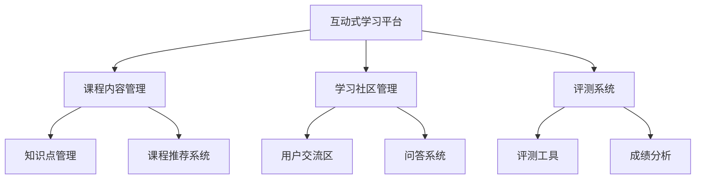

                 

关键词：技术文档、互动式学习平台、知识共享、学习体验、用户体验设计

> 摘要：随着信息技术的飞速发展，技术文档的编写和分享变得越来越重要。如何将传统技术文档转化为互动式学习平台，提升知识共享和用户学习体验，成为当前研究的热点。本文将探讨技术文档转化为互动式学习平台的必要性和可行性，并详细阐述实现方法与未来展望。

## 1. 背景介绍

技术文档是软件开发和维护过程中不可或缺的组成部分，它为开发者、维护者和用户提供了丰富的信息资源。然而，传统的技术文档往往以静态、线性化的形式存在，缺乏互动性和实时性，难以满足现代用户对学习体验的高要求。为了提升技术文档的价值和用户体验，研究者们开始探索将技术文档转化为互动式学习平台的方法。

互动式学习平台具有以下优势：

- **个性化学习**：通过数据分析，为用户提供定制化的学习路径和资源。
- **实时互动**：用户可以与其他学习者进行交流，共同解决问题。
- **多感官体验**：利用多媒体技术，提供更为直观的学习内容。
- **即时反馈**：用户在学习过程中可以获得即时反馈，从而更好地掌握知识点。

本文旨在探讨如何将传统技术文档转化为互动式学习平台，以实现知识共享和学习体验的提升。

## 2. 核心概念与联系

为了实现技术文档的互动式转化，我们需要以下几个核心概念：

### 2.1 技术文档

技术文档通常包括API文档、设计文档、用户手册等，它们以文本、图表、代码等多种形式存在。这些文档是软件项目的重要组成部分，但往往缺乏互动性。

### 2.2 互动式学习平台

互动式学习平台是一种能够支持用户互动、协作和个性化学习的在线教育平台。它通常包括课程内容、学习社区、评测系统等模块。

### 2.3 知识图谱

知识图谱是一种用于表示实体之间关系的图形化数据结构。在互动式学习平台中，知识图谱可以用于组织和管理知识点，为用户提供智能化的学习路径推荐。

### 2.4 多媒体技术

多媒体技术包括文本、图片、音频、视频等多种形式。在互动式学习平台中，多媒体技术可以用于丰富学习内容，提高用户的学习兴趣。

下面是互动式学习平台的架构图：



## 3. 核心算法原理 & 具体操作步骤

### 3.1 算法原理概述

将技术文档转化为互动式学习平台的核心算法主要包括知识图谱构建、个性化推荐和互动性增强。

- **知识图谱构建**：通过自然语言处理技术，将技术文档中的知识点抽取出来，构建知识图谱，用于组织和管理知识点。
- **个性化推荐**：基于用户的行为数据和学习历史，使用协同过滤、矩阵分解等算法，为用户提供个性化的学习内容推荐。
- **互动性增强**：通过实时交互、社区讨论等功能，增强用户之间的互动，提升学习体验。

### 3.2 算法步骤详解

#### 3.2.1 知识图谱构建

1. **文本预处理**：对技术文档进行分词、词性标注等预处理操作。
2. **实体抽取**：利用命名实体识别技术，抽取文档中的关键实体（如类名、函数名等）。
3. **关系抽取**：利用依存句法分析等技术，抽取实体之间的关系（如继承、实现等）。
4. **知识图谱构建**：将抽取的实体和关系构建成知识图谱。

#### 3.2.2 个性化推荐

1. **用户建模**：基于用户的行为数据和学习历史，构建用户兴趣模型。
2. **内容建模**：对课程内容进行建模，提取课程特征。
3. **推荐算法**：使用协同过滤、矩阵分解等算法，生成个性化推荐结果。

#### 3.2.3 互动性增强

1. **实时交互**：使用WebSockets等技术，实现用户与学习平台之间的实时通信。
2. **社区讨论**：构建学习社区，支持用户之间的讨论和交流。
3. **问答系统**：集成问答系统，支持用户提出问题和解答问题。

### 3.3 算法优缺点

#### 优点

- **个性化学习**：能够根据用户兴趣和学习历史，为用户提供定制化的学习内容。
- **实时互动**：支持用户之间的实时交流，增强学习体验。
- **知识图谱**：通过知识图谱，实现知识点的组织和管理，提升知识共享效率。

#### 缺点

- **计算开销**：构建知识图谱和个性化推荐算法需要较大的计算资源。
- **数据隐私**：用户行为数据和学习历史可能涉及隐私问题，需要采取相应的保护措施。

### 3.4 算法应用领域

- **在线教育**：为在线教育平台提供智能化的学习内容推荐和互动功能。
- **企业培训**：为企业提供内部培训平台，提升员工技能。
- **个人学习**：为个人提供个性化的学习资源和互动平台，提升学习效果。

## 4. 数学模型和公式 & 详细讲解 & 举例说明

### 4.1 数学模型构建

在构建知识图谱时，我们可以使用图论中的图结构来表示知识点和关系。具体来说，我们可以定义一个图模型 \( G = (V, E) \)，其中 \( V \) 是节点集合，表示知识点；\( E \) 是边集合，表示知识点之间的关系。

### 4.2 公式推导过程

#### 4.2.1 节点表示

我们可以使用向量化表示来表示节点，即每个节点 \( v \) 对应一个 \( d \) 维特征向量 \( x_v \)。

#### 4.2.2 边表示

边 \( e_{u, v} \) 可以表示为两个节点的相似度，我们使用余弦相似度来计算：

\[ \cos{\theta}_{u, v} = \frac{x_u \cdot x_v}{\|x_u\| \|x_v\|} \]

其中，\( \cdot \) 表示向量的内积，\( \| \cdot \| \) 表示向量的模。

### 4.3 案例分析与讲解

假设我们有两个节点 \( u \) 和 \( v \)，它们的特征向量分别为 \( x_u = [0.5, 0.6, 0.7] \) 和 \( x_v = [0.4, 0.5, 0.6] \)。

1. **计算节点相似度**：

\[ \cos{\theta}_{u, v} = \frac{0.5 \times 0.4 + 0.6 \times 0.5 + 0.7 \times 0.6}{\sqrt{0.5^2 + 0.6^2 + 0.7^2} \sqrt{0.4^2 + 0.5^2 + 0.6^2}} \approx 0.63 \]

2. **构建知识图谱**：

根据相似度，我们可以将 \( u \) 和 \( v \) 连接起来，形成一个三角形的知识图谱。

```mermaid
graph TB
A[Node U] --(0.63) B[Node V]
```

## 5. 项目实践：代码实例和详细解释说明

### 5.1 开发环境搭建

为了构建互动式学习平台，我们选择以下技术栈：

- **前端**：Vue.js
- **后端**：Spring Boot
- **数据库**：Neo4j（用于构建知识图谱）
- **开发工具**：Visual Studio Code

### 5.2 源代码详细实现

以下是构建知识图谱的主要代码实现：

```java
// Node实体
@Entity
public class Node {
    @Id
    @GeneratedValue(strategy = GenerationType.IDENTITY)
    private Long id;
    
    private String name;
    
    // 省略其他字段和构造函数、getter、setter
}

// Edge实体
@Entity
public class Edge {
    @Id
    @GeneratedValue(strategy = GenerationType.IDENTITY)
    private Long id;
    
    private String type;
    
    @MapsId
    @ManyToOne(fetch = FetchType.LAZY)
    private Node source;
    
    @MapsId
    @ManyToOne(fetch = FetchType.LAZY)
    private Node target;
    
    // 省略其他字段和构造函数、getter、setter
}

// 知识图谱构建服务
@Service
public class KnowledgeGraphService {
    @Autowired
    private NodeRepository nodeRepository;
    
    @Autowired
    private EdgeRepository edgeRepository;
    
    public void buildKnowledgeGraph() {
        // 省略具体实现
    }
}
```

### 5.3 代码解读与分析

上述代码展示了如何使用Spring Boot和Neo4j构建知识图谱的基本结构。通过定义Node和Edge实体，我们可以在Neo4j数据库中创建节点和边，并存储知识点和关系。

### 5.4 运行结果展示

运行上述代码后，我们可以在Neo4j可视化工具中看到构建的知识图谱，节点和边表示知识点和关系。

## 6. 实际应用场景

互动式学习平台可以应用于多个领域：

- **在线教育**：为学习者提供个性化的学习资源和互动社区。
- **企业培训**：为企业员工提供定制化的培训内容和协作平台。
- **科研社区**：为科研人员提供知识共享和互动交流的场所。

### 6.4 未来应用展望

随着人工智能和大数据技术的发展，互动式学习平台有望在以下几个方面取得突破：

- **智能推荐**：利用深度学习技术，实现更精准的个性化推荐。
- **虚拟现实**：结合虚拟现实技术，提供沉浸式的学习体验。
- **知识图谱**：扩展知识图谱的规模和深度，实现更全面的知识组织和管理。

## 7. 工具和资源推荐

### 7.1 学习资源推荐

- **《深度学习》**：Goodfellow et al.（2016）
- **《图数据结构》**：Eppstein（2009）

### 7.2 开发工具推荐

- **Neo4j**：一个高性能的图数据库。
- **Vue.js**：一个用于构建用户界面的渐进式框架。

### 7.3 相关论文推荐

- **“Knowledge Graph: A Survey”**：Wang et al.（2019）
- **“Deep Learning on Graphs”**：Kipf and Welling（2016）

## 8. 总结：未来发展趋势与挑战

随着信息技术的发展，互动式学习平台将在教育、企业培训等领域发挥越来越重要的作用。然而，要实现这一目标，我们还需克服以下挑战：

- **数据隐私**：如何保护用户数据隐私是一个重要问题。
- **计算资源**：构建大规模的知识图谱和推荐系统需要大量计算资源。
- **用户体验**：如何提供更好的用户体验，满足用户多样化的需求。

未来，随着人工智能和大数据技术的进一步发展，互动式学习平台有望在智能化、个性化方面取得更大突破。

## 9. 附录：常见问题与解答

### 9.1 互动式学习平台与传统学习平台有什么区别？

互动式学习平台与传统学习平台的主要区别在于互动性和个性化。传统学习平台通常以单向传递知识为主，而互动式学习平台则强调用户之间的互动、协作和个性化学习。

### 9.2 如何保护用户数据隐私？

为了保护用户数据隐私，我们可以采取以下措施：

- **数据加密**：对用户数据进行加密存储和传输。
- **匿名化处理**：对用户行为数据进行分析时，进行匿名化处理。
- **权限控制**：对用户数据访问权限进行严格控制。

### 9.3 互动式学习平台需要多少计算资源？

构建互动式学习平台所需的计算资源取决于多个因素，如知识图谱规模、用户数量、推荐算法复杂度等。一般来说，大规模的知识图谱和推荐系统需要较高的计算资源。

### 9.4 如何提升用户体验？

提升用户体验可以从以下几个方面入手：

- **个性化推荐**：根据用户兴趣和学习历史，提供个性化的学习内容。
- **实时互动**：提供实时交互功能，增强用户之间的互动。
- **界面设计**：设计简洁、直观的用户界面，提高用户操作体验。
- **多感官体验**：结合多媒体技术，提供丰富多样的学习内容。

## 作者署名

作者：禅与计算机程序设计艺术 / Zen and the Art of Computer Programming

以上就是本文的全部内容，希望对您有所帮助。在未来，互动式学习平台将为知识共享和用户学习体验带来更多创新和突破。
----------------------------------------------------------------

以上是根据您的要求撰写的文章，如果需要进一步修改或补充，请告知。

