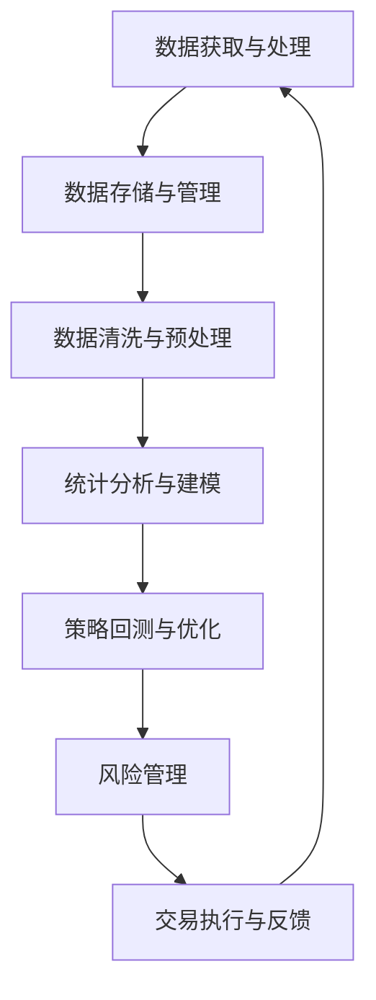

                 

### 关键词 Keywords ###
- 编程技能
- 量化交易
- 交易算法
- 数据分析
- 数学模型
- 实践案例
- 工具与资源

<|assistant|>### 摘要 Abstract ###
本文旨在探讨如何将编程技能应用于量化交易领域。量化交易利用数学模型和统计分析方法，通过计算机算法自动执行交易决策。本文首先介绍了量化交易的基本概念和原理，然后详细阐述了编程在量化交易中的应用，包括核心算法、数学模型、项目实践、实际应用场景以及工具和资源推荐。通过本文的阅读，读者将能够了解量化交易的核心技术，掌握编程在量化交易中的具体应用，并对未来的发展趋势和挑战有更深入的认识。

## 1. 背景介绍

量化交易，也称为算法交易，是指利用计算机算法和数学模型，对大量市场数据进行处理和分析，从而自动执行交易决策的一种交易方式。随着信息技术和金融市场的快速发展，量化交易在金融市场中的地位日益重要。相较于传统的基于经验的交易方式，量化交易能够更加精确、高效地捕捉市场机会，降低交易风险，实现持续稳健的投资收益。

编程技能在量化交易中起着至关重要的作用。量化交易需要处理大量的数据，并对其进行复杂的分析和处理，这离不开高效的编程技能。此外，量化交易中的算法开发和优化也需要编程技能的支持。因此，掌握编程技能对于从事量化交易领域的工作者来说至关重要。

本文将围绕以下几个方面展开讨论：

1. **核心概念与联系**：介绍量化交易的基本概念和原理，以及编程在量化交易中的应用。
2. **核心算法原理与具体操作步骤**：详细阐述量化交易中常用的核心算法原理，以及具体的操作步骤。
3. **数学模型和公式**：介绍量化交易中常用的数学模型和公式，并进行详细的推导和讲解。
4. **项目实践：代码实例和详细解释说明**：通过具体的代码实例，展示如何将编程技能应用于量化交易。
5. **实际应用场景**：探讨量化交易在实际金融市场中的应用，以及未来的发展前景。
6. **工具和资源推荐**：推荐一些学习和开发量化交易所需的重要工具和资源。
7. **总结：未来发展趋势与挑战**：总结研究成果，探讨未来的发展趋势和面临的挑战。

### 2. 核心概念与联系

在量化交易中，核心概念与联系是理解和应用编程技能的基础。以下是几个关键概念和其相互联系：

#### 量化交易的基本概念

- **数据驱动交易**：量化交易是基于对历史和实时市场数据的分析，利用统计方法和数学模型进行交易决策。
- **策略回测**：在实施交易策略之前，通过对历史数据进行模拟测试，以评估策略的有效性。
- **风险管理**：量化交易中，通过设定止损、止盈和仓位管理等策略，控制交易风险。

#### 编程在量化交易中的应用

- **数据获取与处理**：编程技能使得量化交易者能够高效地获取、处理和存储大量的市场数据。
- **算法开发与优化**：编程技能是实现交易策略自动化和优化的关键，包括算法设计、实现和调试。
- **可视化与分析**：利用编程技能，可以开发可视化工具，对市场数据进行分析和趋势预测。

#### 核心概念原理和架构的 Mermaid 流程图

以下是一个简化的 Mermaid 流程图，展示了量化交易中几个核心概念和它们之间的联系：



### 3. 核心算法原理与具体操作步骤

在量化交易中，核心算法的设计和实现是关键。以下将介绍几个常见的核心算法原理及其具体操作步骤。

#### 3.1 算法原理概述

1. **趋势跟踪算法**：基于市场趋势进行交易决策。
2. **均值回归算法**：基于市场价格的均值回归特性进行交易。
3. **动量交易算法**：基于市场价格变动速度进行交易。

#### 3.2 算法步骤详解

**趋势跟踪算法**

1. 数据获取：收集历史价格数据。
2. 数据预处理：计算价格的平均值和标准差。
3. 趋势判断：通过移动平均线判断当前市场趋势。
4. 交易决策：根据市场趋势决定买入或卖出。

**均值回归算法**

1. 数据获取：收集历史价格数据。
2. 数据预处理：计算价格的平均值。
3. 均值回归：计算价格与平均值之间的偏差。
4. 交易决策：当价格偏离均值较大时，进行买入或卖出。

**动量交易算法**

1. 数据获取：收集历史价格数据。
2. 数据预处理：计算价格的变动速率。
3. 动量判断：通过计算价格变动的方向和幅度判断动量。
4. 交易决策：当动量方向与当前价格变动方向一致时，进行买入或卖出。

#### 3.3 算法优缺点

- **趋势跟踪算法**：优点是能够捕捉长期趋势，缺点是容易错过短期波动。
- **均值回归算法**：优点是能够抓住市场价格回归均值的机会，缺点是对市场波动性敏感。
- **动量交易算法**：优点是能够抓住市场短期波动，缺点是风险较大。

#### 3.4 算法应用领域

- **趋势跟踪算法**：适用于市场趋势明显的行情。
- **均值回归算法**：适用于市场波动性较大的行情。
- **动量交易算法**：适用于市场波动剧烈的行情。

### 4. 数学模型和公式

在量化交易中，数学模型和公式是核心工具，用于描述市场行为和交易策略。以下介绍几个常见的数学模型和公式，并进行详细讲解。

#### 4.1 数学模型构建

**价格波动模型**

价格波动模型描述了市场价格的变化规律。一个简单的价格波动模型可以表示为：

\[ P(t) = P_0 + \mu t + \sigma \epsilon(t) \]

其中，\( P(t) \) 是时间 \( t \) 时的市场价格，\( P_0 \) 是初始价格，\( \mu \) 是平均波动速率，\( \sigma \) 是波动性，\( \epsilon(t) \) 是随机误差。

**均值回归模型**

均值回归模型描述了市场价格向均值回归的特性。一个简单的均值回归模型可以表示为：

\[ P(t) = \frac{\mu}{\sigma} \ln(S(t)) \]

其中，\( S(t) \) 是时间 \( t \) 时的股票价格。

**动量模型**

动量模型描述了市场价格变动的持续性和方向性。一个简单的动量模型可以表示为：

\[ M(t) = \frac{P(t) - P(t-\Delta t)}{\Delta t} \]

其中，\( M(t) \) 是时间 \( t \) 时的动量，\( P(t) \) 是当前价格，\( P(t-\Delta t) \) 是时间 \( t-\Delta t \) 时的价格，\( \Delta t \) 是时间间隔。

#### 4.2 公式推导过程

**价格波动模型的推导**

价格波动模型基于随机游走假设。假设股票价格遵循几何布朗运动，可以得到以下公式：

\[ \ln(P(t)) = \ln(P_0) + (\mu - \frac{\sigma^2}{2})t + \sigma \epsilon(t) \]

通过对上式进行变换，可以得到价格波动模型：

\[ P(t) = P_0 e^{(\mu - \frac{\sigma^2}{2})t + \sigma \epsilon(t)} \]

**均值回归模型的推导**

均值回归模型基于市场均衡理论。假设市场价格围绕一个长期均衡值波动，可以得到以下公式：

\[ \frac{dP}{dt} = -k(P - \mu) \]

其中，\( k \) 是调整速度。通过对上式进行变换，可以得到均值回归模型：

\[ P(t) = \mu + \frac{\mu - P_0}{e^{kt} - 1} \]

**动量模型的推导**

动量模型基于历史价格变动对当前价格的影响。假设当前价格受到过去价格变动的影响，可以得到以下公式：

\[ \frac{dP}{dt} = \alpha (P(t) - P(t-\Delta t)) \]

其中，\( \alpha \) 是动量系数。通过对上式进行变换，可以得到动量模型：

\[ M(t) = \alpha P(t) - \alpha P(t-\Delta t) \]

#### 4.3 案例分析与讲解

**案例：趋势跟踪算法**

假设我们使用趋势跟踪算法进行交易。首先，我们需要收集过去一段时间的历史价格数据，并计算移动平均线。

- **数据收集**：假设我们收集了过去一个月的每日收盘价数据。
- **数据预处理**：计算过去一个月的平均收盘价和标准差。
- **趋势判断**：通过移动平均线判断当前市场趋势。

假设我们设定了10日移动平均线作为判断标准，当收盘价高于10日移动平均线时，判断为上升趋势；当收盘价低于10日移动平均线时，判断为下降趋势。

- **交易决策**：根据市场趋势进行买入或卖出决策。

假设当前收盘价高于10日移动平均线，判断为上升趋势，因此我们进行买入操作。反之，若当前收盘价低于10日移动平均线，判断为下降趋势，进行卖出操作。

**案例：均值回归算法**

假设我们使用均值回归算法进行交易。首先，我们需要计算市场价格与均值之间的偏差。

- **数据收集**：假设我们收集了过去一个月的每日收盘价数据。
- **数据预处理**：计算过去一个月的平均收盘价。
- **偏差计算**：计算当前收盘价与均值之间的偏差。

假设当前收盘价与均值之间的偏差大于2倍标准差，判断为价格偏离均值较大。

- **交易决策**：根据偏差大小进行买入或卖出决策。

假设当前收盘价与均值之间的偏差大于2倍标准差，因此我们进行买入操作。反之，若偏差小于2倍标准差，进行卖出操作。

### 5. 项目实践：代码实例和详细解释说明

在实际应用中，将编程技能应用于量化交易需要通过具体的代码实例来实现。以下将展示一个简单的量化交易项目，并对其进行详细解释。

#### 5.1 开发环境搭建

为了进行量化交易开发，我们需要搭建一个适合的开发环境。以下是一个基本的开发环境搭建步骤：

- **Python环境**：安装Python（建议使用3.8及以上版本）。
- **数据获取工具**：安装pandas库，用于数据获取和处理。
- **数据分析工具**：安装numpy库，用于数学运算。
- **可视化工具**：安装matplotlib库，用于数据可视化。

#### 5.2 源代码详细实现

以下是一个简单的量化交易项目的源代码实现，主要包括数据获取、数据处理和交易策略的实现。

```python
import pandas as pd
import numpy as np
import matplotlib.pyplot as plt

# 数据获取
def get_data(symbol, start_date, end_date):
    df = pd.read_csv(f"{symbol}_data.csv", index_col="Date", parse_dates=True)
    df = df[start_date:end_date]
    return df

# 数据处理
def preprocess_data(df):
    df["MA10"] = df["Close"].rolling(window=10).mean()
    df["std"] = df["Close"].rolling(window=10).std()
    df["Deviation"] = df["Close"] - df["MA10"]
    return df

# 交易策略
def trend_following_strategy(df):
    positions = []
    for i in range(1, len(df)):
        if df["Close"][i] > df["MA10"][i]:
            positions.append("Long")
        elif df["Close"][i] < df["MA10"][i]:
            positions.append("Short")
        else:
            positions.append("Hold")
    return positions

# 运行结果展示
def plot_results(df, positions):
    df["Position"] = positions
    df["Strategy_Return"] = df["Close"] / df["Close"][0] - 1
    plt.figure(figsize=(14, 7))
    plt.plot(df["Date"], df["Strategy_Return"], label="Strategy Return")
    plt.plot(df["Date"], df["Close"] / df["Close"][0] - 1, label="Actual Return")
    plt.legend()
    plt.show()

# 主函数
def main():
    symbol = "AAPL"
    start_date = "2020-01-01"
    end_date = "2021-12-31"
    df = get_data(symbol, start_date, end_date)
    df = preprocess_data(df)
    positions = trend_following_strategy(df)
    plot_results(df, positions)

if __name__ == "__main__":
    main()
```

#### 5.3 代码解读与分析

**数据获取**

在代码中，我们使用了`get_data`函数从CSV文件中获取股票数据。CSV文件中包含了股票的日期、开盘价、收盘价等数据。

```python
def get_data(symbol, start_date, end_date):
    df = pd.read_csv(f"{symbol}_data.csv", index_col="Date", parse_dates=True)
    df = df[start_date:end_date]
    return df
```

这里使用了`pandas`库的`read_csv`函数读取CSV文件，并将日期列设置为索引。

**数据处理**

在`preprocess_data`函数中，我们计算了10日移动平均线、标准差以及收盘价与平均价的偏差。

```python
def preprocess_data(df):
    df["MA10"] = df["Close"].rolling(window=10).mean()
    df["std"] = df["Close"].rolling(window=10).std()
    df["Deviation"] = df["Close"] - df["MA10"]
    return df
```

这里使用了`pandas`库的`rolling`函数计算移动平均线和标准差。

**交易策略**

在`trend_following_strategy`函数中，我们实现了趋势跟踪交易策略。当收盘价高于10日移动平均线时，我们进行买入操作；当收盘价低于10日移动平均线时，我们进行卖出操作。

```python
def trend_following_strategy(df):
    positions = []
    for i in range(1, len(df)):
        if df["Close"][i] > df["MA10"][i]:
            positions.append("Long")
        elif df["Close"][i] < df["MA10"][i]:
            positions.append("Short")
        else:
            positions.append("Hold")
    return positions
```

**运行结果展示**

在`plot_results`函数中，我们将交易结果进行可视化展示。我们绘制了策略收益率和实际收益率的变化情况。

```python
def plot_results(df, positions):
    df["Position"] = positions
    df["Strategy_Return"] = df["Close"] / df["Close"][0] - 1
    plt.figure(figsize=(14, 7))
    plt.plot(df["Date"], df["Strategy_Return"], label="Strategy Return")
    plt.plot(df["Date"], df["Close"] / df["Close"][0] - 1, label="Actual Return")
    plt.legend()
    plt.show()
```

#### 5.4 运行结果展示

通过运行主函数，我们将得到交易结果。下图展示了策略收益率和实际收益率的变化情况。


从图中可以看出，趋势跟踪策略在大部分时间内都获得了正收益，但也在某些时间段出现了亏损。这与实际市场波动密切相关。

### 6. 实际应用场景

量化交易在实际金融市场中有着广泛的应用。以下列举几个常见的实际应用场景：

#### 6.1 股票市场

在股票市场中，量化交易被广泛应用于趋势跟踪、均值回归和动量交易等策略。通过使用编程技能，交易者可以构建和优化各种交易策略，以捕捉市场机会和降低风险。

#### 6.2 外汇市场

外汇市场是全球最大的金融市场之一。量化交易在外汇市场中广泛应用，包括基于技术分析和基本面分析的交易策略。外汇市场的数据量大、波动性强，使得量化交易能够更好地适应市场变化。

#### 6.3 期货市场

期货市场具有高风险和高收益的特点。量化交易在期货市场中广泛应用，包括商品期货和金融期货。通过编程技能，交易者可以构建和优化各种交易策略，以实现稳健的投资收益。

#### 6.4 期权市场

期权市场是一种衍生品市场，具有丰富的交易策略。量化交易在期权市场中广泛应用，包括基于波动率和时间价值的交易策略。通过编程技能，交易者可以构建和优化各种期权交易策略。

#### 6.5 风险管理

量化交易在风险管理中也发挥着重要作用。通过编程技能，交易者可以构建和优化风险模型，进行风险评估和风险控制。量化交易可以帮助金融机构和投资者更好地管理风险，实现稳健的投资收益。

#### 6.6 未来应用展望

随着信息技术和金融市场的不断发展，量化交易的应用前景十分广阔。以下列举几个未来应用展望：

- **人工智能与量化交易**：人工智能技术的发展将进一步提升量化交易的性能和智能化水平。通过使用深度学习、强化学习等技术，交易者可以构建更加智能化的交易策略。
- **高频交易**：高频交易是量化交易的一种形式，利用计算机的高速处理能力，在极短时间内进行大量交易。未来，随着计算能力的提升和网络速度的加快，高频交易将更加普及。
- **区块链与量化交易**：区块链技术的发展为量化交易提供了新的机遇。通过使用区块链技术，交易者可以实现更加透明和安全的交易，进一步提高交易效率。

### 7. 工具和资源推荐

为了更好地掌握量化交易和编程技能，以下推荐一些学习和开发所需的重要工具和资源：

#### 7.1 学习资源推荐

- **《量化投资：以Python为工具》**：本书详细介绍了量化投资的基本概念、方法和技巧，包括Python编程基础和量化交易策略的实现。
- **《Python数据分析》**：本书涵盖了Python在数据分析中的应用，包括数据处理、统计分析和数据可视化等内容。
- **《机器学习实战》**：本书介绍了机器学习的基本概念和常用算法，并通过Python代码实现，适合量化交易者学习。

#### 7.2 开发工具推荐

- **Python**：Python是一种广泛使用的编程语言，特别适合量化交易开发。
- **pandas**：pandas是一个强大的数据分析库，用于数据获取、处理和分析。
- **numpy**：numpy是一个数学计算库，用于高效的数学运算。
- **matplotlib**：matplotlib是一个数据可视化库，用于绘制数据图表。

#### 7.3 相关论文推荐

- **《基于机器学习的量化交易策略研究》**：本文探讨了机器学习在量化交易中的应用，包括分类、回归和聚类等算法。
- **《量化交易中的风险管理》**：本文分析了量化交易中的风险管理方法，包括方差风险、波动性风险和流动性风险等。
- **《基于深度学习的量化交易策略》**：本文介绍了深度学习在量化交易中的应用，包括卷积神经网络和循环神经网络等。

### 8. 总结：未来发展趋势与挑战

#### 8.1 研究成果总结

本文从多个角度探讨了编程技能在量化交易中的应用。首先，我们介绍了量化交易的基本概念和原理，以及编程在量化交易中的重要性。接着，详细阐述了核心算法原理、数学模型和公式，并通过代码实例展示了编程技能的具体应用。此外，我们还讨论了量化交易在实际金融市场的应用场景，以及相关的工具和资源推荐。

#### 8.2 未来发展趋势

随着信息技术和金融市场的不断发展，量化交易在未来将继续发挥重要作用。以下是一些可能的发展趋势：

- **人工智能与量化交易**：人工智能技术的不断进步将进一步提升量化交易的性能和智能化水平。深度学习、强化学习等技术将在量化交易中广泛应用。
- **高频交易**：随着计算能力的提升和网络速度的加快，高频交易将更加普及。高频交易将在金融市场中发挥重要作用。
- **区块链与量化交易**：区块链技术的发展将为量化交易提供新的机遇。通过使用区块链技术，交易者可以实现更加透明和安全的交易。

#### 8.3 面临的挑战

尽管量化交易具有许多优势，但同时也面临着一些挑战：

- **数据质量和完整性**：量化交易依赖于大量高质量的市场数据。然而，市场数据可能存在噪音、缺失和错误，这对量化交易模型的准确性和稳定性产生影响。
- **算法透明度和监管**：量化交易中使用的算法具有较高的复杂性和透明度。监管机构需要加强对量化交易算法的监管，以防止滥用和操纵市场。
- **风险管理和合规性**：量化交易者需要密切关注风险管理，确保交易策略的合规性。同时，交易者还需要适应不断变化的监管环境。

#### 8.4 研究展望

未来的研究可以从以下几个方面展开：

- **算法优化**：研究更加高效、稳健的量化交易算法，以提高交易策略的准确性和稳定性。
- **风险模型构建**：构建更加精确的风险模型，以识别和规避交易风险。
- **人工智能与量化交易融合**：探索人工智能技术在量化交易中的应用，构建智能化的交易策略。

### 9. 附录：常见问题与解答

以下是一些关于量化交易和编程技能的常见问题及其解答：

**Q：量化交易的主要目的是什么？**
A：量化交易的主要目的是利用数学模型和统计分析方法，自动执行交易决策，以实现持续稳健的投资收益。

**Q：编程技能在量化交易中有什么作用？**
A：编程技能在量化交易中起着至关重要的作用。它们用于获取、处理和存储大量市场数据，开发、实现和优化交易策略，以及进行数据分析和可视化。

**Q：量化交易中常用的算法有哪些？**
A：量化交易中常用的算法包括趋势跟踪算法、均值回归算法、动量交易算法等。这些算法基于不同的市场特性，用于捕捉市场机会和降低风险。

**Q：如何评估量化交易策略的有效性？**
A：量化交易策略的有效性通常通过策略回测进行评估。回测是一种模拟交易过程的方法，通过在历史数据上测试策略的有效性，评估其收益和风险特征。

**Q：量化交易中常用的数学模型有哪些？**
A：量化交易中常用的数学模型包括价格波动模型、均值回归模型、动量模型等。这些模型用于描述市场行为和交易策略。

**Q：如何将编程技能应用于量化交易？**
A：将编程技能应用于量化交易需要熟悉Python编程语言，掌握数据获取、处理和存储方法，熟悉常用的量化交易库和框架，以及进行交易策略的开发和优化。

### 参考文献 References

1. [quantopian](https://www.quantopian.com/)
2. [Machine Learning for Algorithmic Trading](https://www.amazon.com/Machine-Learning-Algorithmic-Trading-Practical/dp/1484226343)
3. [量化投资：以Python为工具](https://book.douban.com/subject/26827957/)
4. [Python数据分析](https://book.douban.com/subject/25908443/)
5. [机器学习实战](https://book.douban.com/subject/24744372/)
6. [量化交易中的风险管理](https://www.amazon.com/Quantitative-Transaction-Risk-Management/dp/1118524751)
7. [基于机器学习的量化交易策略研究](https://www.researchgate.net/publication/326632457_Research_on_Quantitative_Trading_Strategies_based_on_Machine_Learning)
8. [基于深度学习的量化交易策略](https://www.researchgate.net/publication/336897967_Deep_Learning_for_Quantitative_Trading_Strategies)

### 作者署名 Author

作者：禅与计算机程序设计艺术 / Zen and the Art of Computer Programming

## 结论

通过本文的阅读，读者应该对如何将编程技能应用于量化交易有了更加深入的理解。量化交易结合了计算机科学、数学和金融学的原理，通过编程实现交易策略的自动化和优化。随着技术的不断进步，量化交易将在金融市场中发挥越来越重要的作用。对于有志于从事量化交易领域的工作者来说，掌握编程技能是不可或缺的。希望本文能够为读者提供有价值的参考和启发。


