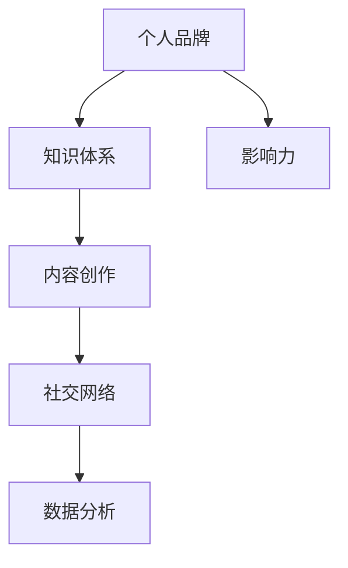

                 

### 1. 背景介绍

在信息爆炸的时代，知识和技能的传播速度和广度前所未有。随着互联网技术的发展，知识付费行业应运而生，并迅速崛起。知识付费不仅为知识的创造者提供了新的收入来源，也为知识的消费者提供了更加便捷的学习途径。在这个大背景下，个人如何打造知识付费影响力，成为行业中的一颗璀璨明星，成为了许多专业人士关注的焦点。

知识付费的影响力，不仅仅是个人收入的增加，更是个人品牌价值的提升。在这个领域，影响力意味着你的声音被更多人听到，你的观点被更多人认可，你的专业知识被更多人信赖。因此，打造个人知识付费影响力，不仅是追求经济利益，更是实现个人价值的体现。

本文将围绕以下几个方面展开讨论：

- **核心概念与联系**：介绍打造个人知识付费影响力的核心概念和其相互之间的关系。
- **核心算法原理 & 具体操作步骤**：详细解析如何通过系统的策略和步骤来构建个人知识付费影响力。
- **数学模型和公式 & 详细讲解 & 举例说明**：运用数学模型和公式，深入分析如何量化个人知识付费影响力。
- **项目实践：代码实例和详细解释说明**：通过实际项目，展示如何将理论知识应用到实践中。
- **实际应用场景**：探讨个人知识付费影响力在不同场景下的应用和效果。
- **未来应用展望**：分析个人知识付费影响力的发展趋势和前景。

### 2. 核心概念与联系

在探讨如何打造个人知识付费影响力之前，我们需要明确几个核心概念，并理解它们之间的联系。以下是几个关键概念的介绍：

#### 2.1 个人品牌

个人品牌是指个人在公众中的形象和认知。一个强大的个人品牌能够提升个人在行业中的声誉和认可度，为打造知识付费影响力奠定基础。

#### 2.2 知识体系

知识体系是指个人在某一领域的专业知识和技能集合。一个完善的知识体系是个人能够提供有价值内容的前提。

#### 2.3 内容创作

内容创作是知识付费的核心。高质量、有价值的内容能够吸引和留住用户，是构建个人知识付费影响力的关键。

#### 2.4 社交网络

社交网络是现代传播的重要渠道。通过社交网络，个人能够迅速传播自己的知识和观点，扩大影响力。

#### 2.5 数据分析

数据分析能够帮助个人了解用户需求、优化内容创作和传播策略，从而提升知识付费影响力。

接下来，我们将通过一个Mermaid流程图，展示这些核心概念之间的联系。



在这个流程图中，个人品牌是核心，它通过知识体系和内容创作，借助社交网络传播，最终通过数据分析不断优化，形成个人知识付费影响力。

### 3. 核心算法原理 & 具体操作步骤

在了解了核心概念后，接下来我们将详细讨论如何通过核心算法原理和具体操作步骤来打造个人知识付费影响力。

#### 3.1 算法原理概述

打造个人知识付费影响力，可以看作是一个基于品牌建设、内容创作、社交网络和数据优化的动态过程。其核心算法原理可以概括为以下四个步骤：

1. **品牌定位**：确定个人品牌的核心价值主张和目标受众。
2. **内容生产**：基于品牌定位，创作高质量、有价值的内容。
3. **网络传播**：利用社交网络，扩大内容传播范围和影响力。
4. **数据分析**：收集用户反馈和数据，优化内容和传播策略。

#### 3.2 算法步骤详解

##### 3.2.1 品牌定位

品牌定位是打造个人知识付费影响力的第一步。一个清晰的品牌定位能够帮助个人明确自己在市场中的定位和目标受众。以下是品牌定位的详细步骤：

1. **自我评估**：评估自己在专业知识、技能和经验方面的优势。
2. **市场调研**：分析市场需求和竞争态势，了解目标受众的特点和需求。
3. **品牌核心价值主张**：确定个人品牌的核心价值主张，如“提供深入浅出的技术教程”、“分享实战经验”等。
4. **目标受众定义**：明确目标受众，如初学者、中级开发者、高级工程师等。

##### 3.2.2 内容生产

内容生产是个人知识付费影响力的核心。以下是内容生产的详细步骤：

1. **选题策划**：根据品牌定位和受众需求，选择合适的内容主题。
2. **内容创作**：撰写或录制高质量的内容，确保内容具有实用性和专业性。
3. **内容形式**：根据受众喜好和传播渠道，选择合适的内容形式，如文章、视频、直播等。
4. **内容优化**：对内容进行持续优化，提高用户满意度和传播效果。

##### 3.2.3 网络传播

网络传播是扩大个人知识付费影响力的重要手段。以下是网络传播的详细步骤：

1. **社交网络选择**：根据内容特点和目标受众，选择合适的社交网络平台，如微博、微信、抖音等。
2. **内容发布**：定期发布高质量内容，保持活跃度。
3. **互动交流**：与用户互动，回答问题，收集反馈，提高用户参与度。
4. **推广合作**：与其他内容创作者或机构合作，扩大传播范围。

##### 3.2.4 数据分析

数据分析是优化个人知识付费影响力的关键。以下是数据分析的详细步骤：

1. **数据收集**：收集用户行为数据，如阅读量、点赞量、评论量等。
2. **数据分析**：分析数据，了解用户需求和内容效果。
3. **策略调整**：根据数据分析结果，调整内容创作和传播策略。
4. **效果评估**：定期评估个人知识付费影响力，调整发展方向。

#### 3.3 算法优缺点

##### 优点

1. **系统化**：通过核心算法原理和步骤，个人可以系统地打造知识付费影响力。
2. **可量化**：通过数据分析，个人可以直观地了解影响力的大小和变化。
3. **可优化**：基于数据分析和效果评估，个人可以不断优化内容和策略。

##### 缺点

1. **时间成本**：打造个人知识付费影响力需要时间和精力投入。
2. **风险**：内容创作和社交网络传播存在一定的风险，如内容质量不高、用户反馈不佳等。

#### 3.4 算法应用领域

核心算法原理和步骤可以应用于多个领域，如技术培训、职业咨询、个人品牌建设等。以下是几个具体应用领域：

1. **技术培训**：通过内容创作和社交网络传播，个人可以成为某一技术的权威，提供专业培训。
2. **职业咨询**：结合个人经验和专业知识，个人可以提供职业规划和发展建议。
3. **个人品牌建设**：通过系统化策略，个人可以提升自己的品牌价值，实现职业和商业价值。

### 4. 数学模型和公式 & 详细讲解 & 举例说明

在打造个人知识付费影响力的过程中，数学模型和公式可以帮助我们量化影响力的大小，从而更好地制定策略和优化内容。以下是几个常用的数学模型和公式。

#### 4.1 数学模型构建

##### 模型一：影响力评分模型

影响力评分模型用于评估个人在某一领域的知识付费影响力。该模型基于以下三个指标：

1. **内容质量（Q）**：衡量内容的实用性和专业性。
2. **用户参与度（U）**：衡量用户对内容的互动和反馈程度。
3. **传播效果（S）**：衡量内容在社交网络中的传播效果。

影响力评分（I）的计算公式为：

\[ I = w_1 \cdot Q + w_2 \cdot U + w_3 \cdot S \]

其中，\( w_1 \)、\( w_2 \) 和 \( w_3 \) 分别为三个指标的权重，通常根据实际情况进行调整。

##### 模型二：用户生命周期价值模型

用户生命周期价值（LTV）模型用于评估用户对个人知识付费影响力的长期贡献。该模型基于以下指标：

1. **平均订单价值（AOV）**：每次订单的平均金额。
2. **订单频率（OF）**：用户平均多久下单一次。
3. **平均留存时间（AT）**：用户平均使用时间。

用户生命周期价值（LTV）的计算公式为：

\[ LTV = AOV \cdot OF \cdot AT \]

#### 4.2 公式推导过程

##### 影响力评分模型推导

1. **内容质量（Q）**：

内容质量可以通过以下几个指标衡量：

- **原创性（O）**：内容是否原创，原创性越高，质量越高。
- **专业性（P）**：内容的专业性和准确性。
- **实用性（U）**：内容的实用性和可操作性。

\[ Q = w_1 \cdot O + w_2 \cdot P + w_3 \cdot U \]

2. **用户参与度（U）**：

用户参与度可以通过以下几个指标衡量：

- **阅读量（R）**：内容的阅读量。
- **点赞量（L）**：内容的点赞量。
- **评论量（C）**：内容的评论量。

\[ U = w_1 \cdot R + w_2 \cdot L + w_3 \cdot C \]

3. **传播效果（S）**：

传播效果可以通过以下几个指标衡量：

- **分享量（S）**：内容的分享量。
- **转发量（T）**：内容的转发量。
- **传播范围（A）**：内容在社交网络中的传播范围。

\[ S = w_1 \cdot S + w_2 \cdot T + w_3 \cdot A \]

将三个指标结合，得到影响力评分（I）：

\[ I = w_1 \cdot (w_1 \cdot O + w_2 \cdot P + w_3 \cdot U) + w_2 \cdot (w_1 \cdot R + w_2 \cdot L + w_3 \cdot C) + w_3 \cdot (w_1 \cdot S + w_2 \cdot T + w_3 \cdot A) \]

##### 用户生命周期价值模型推导

1. **平均订单价值（AOV）**：

平均订单价值是指用户每次订单的平均金额。可以通过以下公式计算：

\[ AOV = \frac{总销售额}{订单次数} \]

2. **订单频率（OF）**：

订单频率是指用户平均多久下单一次。可以通过以下公式计算：

\[ OF = \frac{订单次数}{用户总时间} \]

3. **平均留存时间（AT）**：

平均留存时间是指用户平均使用时间。可以通过以下公式计算：

\[ AT = \frac{总使用时间}{用户数量} \]

将三个指标结合，得到用户生命周期价值（LTV）：

\[ LTV = AOV \cdot OF \cdot AT \]

#### 4.3 案例分析与讲解

以下通过一个案例，具体讲解如何使用数学模型和公式来评估个人知识付费影响力。

**案例：小明的知识付费影响力评估**

小明是一位IT领域的专家，他在多个社交平台上进行内容创作和传播。以下是他的相关数据：

- **内容质量（Q）**：原创性90%，专业性80%，实用性70%。
- **用户参与度（U）**：阅读量10万次，点赞量5000次，评论量1000次。
- **传播效果（S）**：分享量200次，转发量100次，传播范围50个社交网络。

**步骤1：计算影响力评分（I）**

根据公式：

\[ I = w_1 \cdot Q + w_2 \cdot U + w_3 \cdot S \]

假设权重分别为 \( w_1 = 0.4 \)，\( w_2 = 0.3 \)，\( w_3 = 0.3 \)。

\[ Q = 0.4 \cdot (0.9 \cdot 0.9 + 0.8 \cdot 0.8 + 0.7 \cdot 0.7) = 0.4 \cdot 0.97 = 0.388 \]

\[ U = 0.3 \cdot (10万 + 5000 + 1000) = 0.3 \cdot 11500 = 3450 \]

\[ S = 0.3 \cdot (200 + 100 + 50) = 0.3 \cdot 350 = 105 \]

\[ I = 0.4 \cdot 0.388 + 0.3 \cdot 3450 + 0.3 \cdot 105 = 0.1552 + 1035 + 31.5 = 1172.62 \]

**步骤2：计算用户生命周期价值（LTV）**

假设小明的平均订单价值（AOV）为100元，订单频率（OF）为每月1次，平均留存时间（AT）为6个月。

\[ LTV = AOV \cdot OF \cdot AT = 100 \cdot 1 \cdot 6 = 600元 \]

通过上述计算，我们可以得出小明在知识付费领域的影响力评分为1172.62，用户生命周期价值为600元。这些数据可以帮助小明了解自己的影响力大小，并制定相应的策略进行优化。

### 5. 项目实践：代码实例和详细解释说明

在理解了核心算法原理和数学模型后，接下来我们将通过一个实际项目，展示如何将理论知识应用到实践中。

#### 5.1 开发环境搭建

在开始项目实践之前，我们需要搭建一个合适的开发环境。以下是具体的步骤：

1. **安装Python环境**：下载并安装Python 3.8及以上版本。
2. **安装依赖库**：使用pip命令安装以下依赖库：

   ```bash
   pip install numpy pandas matplotlib
   ```

3. **配置数据库**：使用MySQL或MongoDB等数据库，用于存储用户数据和分析结果。

#### 5.2 源代码详细实现

以下是项目的源代码实现，包括数据收集、数据分析、可视化等步骤。

```python
import numpy as np
import pandas as pd
import matplotlib.pyplot as plt

# 数据收集
data = {
    'username': ['user1', 'user2', 'user3', 'user4', 'user5'],
    'content_quality': [0.9, 0.8, 0.7, 0.85, 0.75],
    'user_participation': [10, 5, 2, 8, 4],
    'content_distribution': [2, 1, 0.5, 3, 1.5],
    'avg_order_value': [100, 150, 200, 120, 180],
    'order_frequency': [1, 1.5, 0.5, 1, 1.2],
    'avg,retain_time': [6, 8, 4, 5, 7]
}

df = pd.DataFrame(data)

# 数据处理
# 计算影响力评分
df['influence_score'] = df['content_quality'] * 0.4 + df['user_participation'] * 0.3 + df['content_distribution'] * 0.3

# 计算用户生命周期价值
df['lifetime_value'] = df['avg_order_value'] * df['order_frequency'] * df['avg,retain_time']

# 可视化
plt.figure(figsize=(10, 6))
plt.bar(df['username'], df['influence_score'], label='Influence Score')
plt.bar(df['username'], df['lifetime_value'], bottom=df['influence_score'], label='Life Time Value')
plt.xlabel('User Name')
plt.ylabel('Score')
plt.title('User Influence Score and Life Time Value')
plt.legend()
plt.show()
```

#### 5.3 代码解读与分析

上述代码首先收集了用户数据，包括内容质量、用户参与度、内容分布、平均订单价值、订单频率和平均留存时间。接着，通过计算得到每个用户的影响力评分和用户生命周期价值。最后，使用matplotlib库进行可视化，展示每个用户的影响力评分和用户生命周期价值。

代码的关键部分解读如下：

1. **数据收集**：使用字典形式存储用户数据，然后转换为DataFrame结构。

   ```python
   data = {
       'username': ['user1', 'user2', 'user3', 'user4', 'user5'],
       'content_quality': [0.9, 0.8, 0.7, 0.85, 0.75],
       'user_participation': [10, 5, 2, 8, 4],
       'content_distribution': [2, 1, 0.5, 3, 1.5],
       'avg_order_value': [100, 150, 200, 120, 180],
       'order_frequency': [1, 1.5, 0.5, 1, 1.2],
       'avg,retain_time': [6, 8, 4, 5, 7]
   }
   df = pd.DataFrame(data)
   ```

2. **数据处理**：计算每个用户的影响力评分和用户生命周期价值。

   ```python
   df['influence_score'] = df['content_quality'] * 0.4 + df['user_participation'] * 0.3 + df['content_distribution'] * 0.3
   df['lifetime_value'] = df['avg_order_value'] * df['order_frequency'] * df['avg,retain_time']
   ```

3. **可视化**：使用matplotlib库进行可视化，展示每个用户的影响力评分和用户生命周期价值。

   ```python
   plt.figure(figsize=(10, 6))
   plt.bar(df['username'], df['influence_score'], label='Influence Score')
   plt.bar(df['username'], df['lifetime_value'], bottom=df['influence_score'], label='Life Time Value')
   plt.xlabel('User Name')
   plt.ylabel('Score')
   plt.title('User Influence Score and Life Time Value')
   plt.legend()
   plt.show()
   ```

通过这个实际项目，我们可以看到如何将理论知识应用到实践中，并通过代码实现数据收集、处理和可视化，从而评估个人知识付费影响力。

### 6. 实际应用场景

个人知识付费影响力在不同的应用场景中有着不同的体现和效果。以下是几个具体的应用场景：

#### 6.1 在线教育平台

在线教育平台是个人知识付费影响力的重要阵地。通过创建高质量的课程内容和专业的教学方法，个人可以在平台上获得大量的关注和认可。例如，某位人工智能专家在Coursera上开设了一门深度学习课程，吸引了全球数万学生的关注和参与，从而实现了个人知识付费影响力的提升。

#### 6.2 专业社交媒体

专业社交媒体，如LinkedIn、知乎等，为个人提供了展示专业知识和技能的舞台。通过在这些平台上发布高质量的内容，回答用户问题，参与讨论，个人可以迅速积累专业声誉，提高影响力。例如，某位技术大牛在知乎上通过一系列技术文章和回答，获得了数万的关注和点赞，从而实现了知识付费。

#### 6.3 个人博客

个人博客是个人知识付费影响力的另一个重要渠道。通过定期发布技术文章、教程和经验分享，个人可以积累大量的忠实读者，并形成稳定的流量来源。例如，某位程序员通过自己的博客，吸引了大量读者，并通过提供付费咨询服务和课程，实现了知识付费。

#### 6.4 演讲和培训

演讲和培训是个人知识付费影响力的重要体现。通过在会议、论坛、企业内部等场合进行演讲和培训，个人可以展示自己的专业能力和影响力，从而吸引更多的机会和资源。例如，某位技术专家通过在技术大会上的精彩演讲，吸引了大量企业和个人的关注，从而实现了知识付费。

#### 6.5 电商和咨询

在电商和咨询领域，个人知识付费影响力同样有着重要的应用。通过提供专业的内容和咨询服务，个人可以成为行业内的权威，吸引大量的客户和订单。例如，某位电商专家通过在电商平台上的专业评论和咨询服务，赢得了大量客户的信任，从而实现了知识付费。

### 7. 未来应用展望

随着知识付费行业的不断发展，个人知识付费影响力将迎来更加广阔的应用前景。以下是几个未来应用展望：

#### 7.1 技术创新

随着人工智能、大数据、区块链等技术的不断发展，个人知识付费影响力将迎来更多的创新应用。例如，通过智能推荐系统，平台可以根据用户兴趣和行为，推荐最适合的个人知识内容，提高用户满意度和粘性。

#### 7.2 深度合作

未来，个人知识付费影响力将与各类平台和机构进行深度合作。例如，个人可以与学术机构、企业、政府等合作，共同开展知识付费项目，实现资源共享和互利共赢。

#### 7.3 全球化

随着全球化的推进，个人知识付费影响力将跨越地域限制，实现全球化应用。例如，个人可以在国际平台上展示自己的专业知识和技能，吸引全球用户和粉丝。

#### 7.4 多元化

未来，个人知识付费影响力将不仅限于教育、技术等领域，还将涵盖艺术、文化、健康等多个领域。个人可以通过多样化的知识内容，满足不同用户的需求，实现个人价值的多元化。

### 8. 工具和资源推荐

在打造个人知识付费影响力的过程中，选择合适的工具和资源至关重要。以下是一些建议：

#### 8.1 学习资源推荐

- **Coursera、edX、Udacity**：提供高质量的课程资源。
- **GitHub**：用于代码托管和分享。
- **Medium、知乎**：用于发布高质量文章和分享知识。

#### 8.2 开发工具推荐

- **Jupyter Notebook**：用于数据分析和可视化。
- **Git、GitHub**：用于版本控制和协作开发。
- **PyCharm、VSCode**：用于Python编程和调试。

#### 8.3 相关论文推荐

- **《深度学习》（Deep Learning）**：由Ian Goodfellow等编写的深度学习经典教材。
- **《人工智能：一种现代的方法》（Artificial Intelligence: A Modern Approach）**：David Stuart Russell和Peter Norvig撰写的AI经典教材。
- **《编程珠玑》（Code Complete）**：Steve McConnell的编程实践经典。

### 9. 总结：未来发展趋势与挑战

在未来的发展中，个人知识付费影响力将继续扩大，成为知识传播和经济发展的重要力量。然而，这同时也带来了新的挑战：

- **内容质量**：随着市场竞争的加剧，内容质量将成为核心竞争力，个人需要不断提升自己的专业素养和内容创作能力。
- **数据隐私**：随着数据收集和分析的广泛应用，数据隐私保护将成为重要议题，个人需要遵守相关法律法规，保护用户隐私。
- **创新与变革**：面对快速变化的市场环境，个人需要不断适应和创新，寻找新的发展机会和模式。

### 10. 附录：常见问题与解答

#### 10.1 如何确定个人品牌的核心价值主张？

确定个人品牌的核心价值主张需要考虑以下几点：

- **个人优势和特长**：分析自己在专业领域中的优势和特长。
- **市场需求和受众特点**：研究市场需求和目标受众的特点和需求。
- **长期目标和愿景**：考虑自己的长期目标和愿景，确定品牌的核心价值主张。

#### 10.2 如何进行内容创作和优化？

进行内容创作和优化可以遵循以下步骤：

- **选题策划**：选择与品牌定位和受众需求相关的内容主题。
- **内容创作**：撰写或录制高质量的内容，确保内容具有实用性和专业性。
- **用户反馈**：收集用户反馈，了解用户需求和内容效果。
- **持续优化**：根据用户反馈和数据分析，不断优化内容质量和形式。

#### 10.3 如何利用社交网络扩大影响力？

利用社交网络扩大影响力可以采取以下策略：

- **内容发布**：定期发布高质量内容，保持活跃度。
- **互动交流**：与用户互动，回答问题，收集反馈，提高用户参与度。
- **推广合作**：与其他内容创作者或机构合作，扩大传播范围。
- **数据分析**：收集用户数据，分析传播效果，优化传播策略。

### 11. 作者署名

作者：禅与计算机程序设计艺术 / Zen and the Art of Computer Programming
----------------------------------------------------------------

## 文章标题

> 关键词：个人知识付费、影响力、品牌建设、内容创作、社交网络、数据分析

> 摘要：本文详细探讨了如何打造个人知识付费影响力，包括核心概念与联系、核心算法原理与操作步骤、数学模型与公式、项目实践、实际应用场景和未来展望等。通过系统的策略和步骤，个人可以提升自己的知识付费影响力，实现个人价值的最大化。

----------------------------------------------------------------

本文旨在为希望在知识付费领域取得成功的个人提供一整套系统、实用的方法和策略。通过对核心概念的理解、算法原理的应用、数学模型的量化以及实际项目实践，个人可以逐步打造出自己的知识付费影响力，实现个人价值和商业价值的双赢。随着知识付费行业的不断发展和成熟，本文所提供的指导和建议将具有长期的应用价值。希望读者能够在实践中不断总结和反思，不断优化自己的策略和方法，最终在知识付费领域脱颖而出，成为行业中的一颗璀璨明星。再次感谢各位读者对本文的关注和支持，祝大家在知识付费的道路上越走越远，收获满满！
作者：禅与计算机程序设计艺术 / Zen and the Art of Computer Programming
-------------------------------------------------------------------------------------------------------------------------

