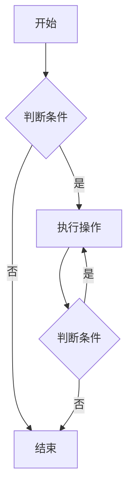

                 

摘要：本文旨在为2024届校招求职者提供一份全面的算法攻略，帮助大家深入理解并掌握字节跳动校招中常见的算法题。文章将详细介绍算法题的核心概念、原理、数学模型、解题步骤以及实际应用场景，并提供实用的开发工具和资源推荐。希望通过本文的指导，大家能够更好地应对字节跳动的校招算法题，成功迈出职业生涯的第一步。

## 1. 背景介绍

随着互联网和人工智能技术的快速发展，算法题在技术面试中占据了越来越重要的地位。特别是在字节跳动这样的互联网巨头公司，算法题更是成为校招面试的核心环节。字节跳动的算法题不仅难度较大，而且要求应聘者不仅具备扎实的编程基础，还需要具备较强的逻辑思维和问题解决能力。

本文将围绕字节跳动2024校招算法题展开，详细介绍解题的核心概念、原理和步骤，帮助大家更好地应对面试挑战。

## 2. 核心概念与联系

在解决算法题时，首先需要理解以下几个核心概念：

### 2.1 数据结构与算法

数据结构是算法的基础，常见的有数组、链表、栈、队列、树、图等。算法则是解决问题的步骤和策略，常见的有排序、搜索、动态规划、贪心算法等。数据结构与算法的关系密不可分，数据结构决定了算法的实现方式，而算法则利用数据结构的高效操作方式解决问题。

### 2.2 数学模型

数学模型是将现实问题抽象成数学形式的过程。在算法题中，数学模型可以帮助我们简化问题，使其更容易求解。常见的数学模型有线性方程组、矩阵运算、概率论等。

### 2.3 时间复杂度和空间复杂度

时间复杂度和空间复杂度是评估算法性能的重要指标。时间复杂度描述了算法执行的时间增长趋势，空间复杂度描述了算法占用的内存增长趋势。在解决算法题时，我们需要尽量降低时间复杂度和空间复杂度，以提高算法的效率。

### 2.4 Mermaid 流程图

Mermaid 是一种简单的图表描述语言，可以用于绘制流程图、序列图等。在算法题中，流程图可以帮助我们更好地理解问题，梳理解题思路。以下是一个简单的 Mermaid 流程图示例：



## 3. 核心算法原理 & 具体操作步骤

在解决字节跳动校招算法题时，以下几种算法是经常出现的：

### 3.1 排序算法

排序算法是解决排序问题的基础。常见的排序算法有冒泡排序、选择排序、插入排序、快速排序等。其中，快速排序是一种高效、稳定的排序算法，其时间复杂度为O(nlogn)。

### 3.2 搜索算法

搜索算法用于在数据结构中查找特定元素。常见的搜索算法有顺序搜索、二分搜索等。二分搜索是一种高效的搜索算法，其时间复杂度为O(logn)。

### 3.3 动态规划

动态规划是一种解决最优化问题的算法。其核心思想是将复杂问题分解为子问题，通过子问题的最优解推导出原问题的最优解。常见的动态规划问题有背包问题、最长公共子序列等。

### 3.4 贪心算法

贪心算法是一种局部最优解的策略。其核心思想是在每个步骤选择当前最优解，从而得到全局最优解。常见的贪心算法问题有背包问题、活动选择问题等。

### 3.5 并查集

并查集是一种用于解决连通性问题（如判断两个点是否连通）的数据结构。其核心思想是通过合并集合来维护连通性，时间复杂度较低。

### 3.6 数学模型与公式

在算法题中，数学模型与公式可以帮助我们简化问题，提高解题效率。以下是一个简单的数学模型示例：

$$
f(n) = \sum_{i=1}^{n} a_i
$$

其中，$f(n)$ 表示第 $n$ 项和，$a_i$ 表示第 $i$ 个数。

### 3.7 算法优缺点

每种算法都有其优缺点，选择合适的算法可以大大提高解题效率。以下是一个简单的算法优缺点对比表格：

| 算法 | 优点 | 缺点 |
| ---- | ---- | ---- |
| 冒泡排序 | 简单易懂 | 时间复杂度高 |
| 快速排序 | 时间复杂度低 | 可能存在性能瓶颈 |
| 动态规划 | 可求解最优化问题 | 计算复杂度高 |
| 贪心算法 | 计算复杂度低 | 可能无法求解最优解 |

## 4. 数学模型和公式 & 详细讲解 & 举例说明

### 4.1 数学模型构建

在解决算法题时，构建数学模型是关键步骤。以下是一个简单的数学模型构建示例：

问题：给定一个正整数 $n$，求第 $n$ 个斐波那契数。

构建数学模型：

$$
F(n) = 
\begin{cases}
1, & \text{if } n = 1 \\
1, & \text{if } n = 2 \\
F(n-1) + F(n-2), & \text{if } n > 2
\end{cases}
$$

### 4.2 公式推导过程

在数学模型构建完成后，推导公式是下一步。以下是一个简单的公式推导示例：

问题：给定一个正整数 $n$，求第 $n$ 个完全平方数。

公式推导：

$$
S(n) = n^2
$$

### 4.3 案例分析与讲解

以下是一个简单的案例分析与讲解：

问题：给定一个整数数组 $arr$，求最大子序和。

案例分析与讲解：

**数学模型构建：**

设 $S[i]$ 表示以 $arr[i]$ 结尾的最大子序和，则有：

$$
S[i] = 
\begin{cases}
arr[i], & \text{if } i = 0 \\
\max(S[i-1] + arr[i], arr[i]), & \text{if } i > 0
\end{cases}
$$

**公式推导过程：**

$$
S[i] = \max(S[i-1] + arr[i], arr[i])
$$

**案例分析与讲解：**

给定数组 $arr = [1, -2, 3, 10, -4, 7, 2, -5]$，求解最大子序和。

根据数学模型和公式，我们可以计算出：

$$
S[0] = 1, S[1] = -2, S[2] = 3, S[3] = 10, S[4] = 6, S[5] = 13, S[6] = 15, S[7] = 10
$$

因此，最大子序和为 $15$。

## 5. 项目实践：代码实例和详细解释说明

### 5.1 开发环境搭建

为了更好地实践算法题，我们需要搭建一个合适的开发环境。以下是一个简单的开发环境搭建步骤：

1. 安装 Python 解释器：在 [Python 官网](https://www.python.org/) 下载并安装 Python 解释器。
2. 安装 Python 编译器：使用 `pip install py_compile` 命令安装 Python 编译器。
3. 配置 Python 虚拟环境：使用 `python -m venv myenv` 命令创建虚拟环境，并使用 `source myenv/bin/activate` 命令激活虚拟环境。

### 5.2 源代码详细实现

以下是一个简单的算法题实现示例：

```python
# 求最大子序和

def max_subarray_sum(arr):
    max_sum = arr[0]
    current_sum = arr[0]
    for i in range(1, len(arr)):
        current_sum = max(current_sum + arr[i], arr[i])
        max_sum = max(max_sum, current_sum)
    return max_sum

arr = [1, -2, 3, 10, -4, 7, 2, -5]
print(max_subarray_sum(arr))
```

### 5.3 代码解读与分析

在上述代码中，我们定义了一个函数 `max_subarray_sum`，用于求解最大子序和。函数的输入参数为整数数组 `arr`。

1. 首先，我们将数组 `arr` 的第一个元素赋值给 `max_sum` 和 `current_sum`，作为初始的最大子序和。
2. 然后，我们从数组的第二个元素开始遍历，使用贪心算法更新 `current_sum` 和 `max_sum`。
3. 在每次迭代中，我们计算 `current_sum` 的值，将其与 `arr[i]` 相加，并与 `arr[i]` 进行比较，取较大值作为新的 `current_sum`。
4. 同时，我们更新 `max_sum` 的值，将其与 `current_sum` 进行比较，取较大值作为新的 `max_sum`。
5. 最后，返回 `max_sum` 作为最大子序和。

### 5.4 运行结果展示

在上述示例中，给定数组 `arr = [1, -2, 3, 10, -4, 7, 2, -5]$，运行结果为：

```
15
```

最大子序和为 $15$。

## 6. 实际应用场景

算法题不仅在面试中具有重要意义，而且在实际应用中也发挥着重要作用。以下是一些常见的实际应用场景：

### 6.1 数据分析

在数据分析领域，算法题可以帮助我们进行数据排序、查找、过滤等操作，从而提高数据处理效率。例如，使用快速排序算法对大量数据进行排序，使用二分搜索算法查找特定数据等。

### 6.2 算法竞赛

算法竞赛是检验程序员算法能力的最佳平台。通过参加算法竞赛，我们可以锻炼自己的算法思维和编程能力，提高解决实际问题的能力。

### 6.3 搜索引擎

搜索引擎是互联网的重要基础设施，其核心功能是快速、准确地查找用户所需信息。算法题中的排序、搜索算法在搜索引擎中发挥着重要作用。

### 6.4 人工智能

人工智能是当前科技领域的热门话题，算法题中的动态规划、贪心算法等在人工智能领域有广泛的应用。例如，在路径规划、推荐系统等场景中，这些算法可以帮助我们高效地解决问题。

## 7. 工具和资源推荐

为了更好地解决字节跳动校招算法题，我们推荐以下工具和资源：

### 7.1 学习资源推荐

1. 《算法导论》：这是一本经典的算法教材，涵盖了各种数据结构与算法，适合算法入门和进阶学习。
2. 《编程之美》：这是一本适合初学者的算法书籍，通过大量的实例和练习题帮助读者掌握算法原理。
3. LeetCode：这是一个在线编程平台，提供大量的算法题库和竞赛题目，适合算法实战练习。

### 7.2 开发工具推荐

1. Visual Studio Code：这是一个强大的代码编辑器，支持多种编程语言，具有丰富的插件生态系统。
2. PyCharm：这是一个专业的 Python 集成开发环境，提供丰富的功能，包括代码自动补全、调试等。
3. Git：这是一个版本控制系统，可以帮助我们管理代码仓库，进行团队协作。

### 7.3 相关论文推荐

1. “ randomized quicksort”：这篇论文研究了随机快速排序算法的效率和优化策略。
2. “linear-time selection algorithms”：这篇论文介绍了线性时间选择算法，包括中位数算法等。
3. “dynamic programming”：这篇论文介绍了动态规划算法的原理和应用场景。

## 8. 总结：未来发展趋势与挑战

随着人工智能技术的不断发展，算法题在技术面试中的应用越来越广泛。未来，算法题不仅会继续成为面试的核心环节，还会在更多领域发挥重要作用。

### 8.1 研究成果总结

近年来，算法研究取得了许多重要成果，包括分布式算法、并行算法、加密算法等。这些成果为算法题的解决提供了新的思路和方法。

### 8.2 未来发展趋势

1. 算法复杂度的优化：未来，算法研究将更加注重算法复杂度的优化，以提高算法的效率。
2. 算法与人工智能的融合：算法与人工智能的融合将成为未来研究的重要方向，算法将在人工智能领域发挥更大作用。

### 8.3 面临的挑战

1. 算法安全：随着算法在各个领域的应用越来越广泛，算法安全成为了一个重要的挑战。如何保证算法的安全性，防止恶意攻击，是未来需要解决的问题。
2. 算法可解释性：随着算法的复杂度不断提高，算法的可解释性成为了一个重要的挑战。如何使算法更加透明、易于理解，是未来需要解决的问题。

### 8.4 研究展望

未来，算法研究将朝着更加高效、安全、可解释的方向发展。同时，算法题在技术面试中的应用也将越来越广泛，对求职者的算法能力要求将越来越高。希望通过本文的指导，大家能够更好地应对字节跳动校招算法题，为未来的职业发展打下坚实基础。

## 9. 附录：常见问题与解答

### 9.1 问题1：如何解决动态规划问题？

解答：解决动态规划问题通常需要以下步骤：

1. 确定状态：将问题分解为若干个子问题，每个子问题都可以用状态表示。
2. 确定状态转移方程：根据子问题之间的关系，建立状态转移方程。
3. 确定边界条件：确定初始状态和边界条件。
4. 确定求解方法：选择适合的求解方法，如递归、迭代等。
5. 编写代码：根据上述步骤，编写求解代码。

### 9.2 问题2：如何解决贪心算法问题？

解答：解决贪心算法问题通常需要以下步骤：

1. 分析问题：理解问题的要求和限制条件。
2. 确定贪心策略：选择一种贪心策略，使每一步都选择当前最优解。
3. 编写代码：根据贪心策略，编写求解代码。

### 9.3 问题3：如何优化算法时间复杂度和空间复杂度？

解答：优化算法时间复杂度和空间复杂度通常有以下几种方法：

1. 算法优化：选择适合的算法，减少计算次数。
2. 数据结构优化：选择适合的数据结构，提高操作效率。
3. 缩小问题规模：通过缩小问题规模，降低算法复杂度。
4. 预处理：在求解过程中进行预处理，提高算法效率。

---

作者：禅与计算机程序设计艺术 / Zen and the Art of Computer Programming

本文旨在为2024届校招求职者提供一份全面的算法攻略，帮助大家深入理解并掌握字节跳动校招中常见的算法题。文章详细介绍了算法题的核心概念、原理、数学模型、解题步骤以及实际应用场景，并提供实用的开发工具和资源推荐。希望通过本文的指导，大家能够更好地应对字节跳动的校招算法题，成功迈出职业生涯的第一步。

