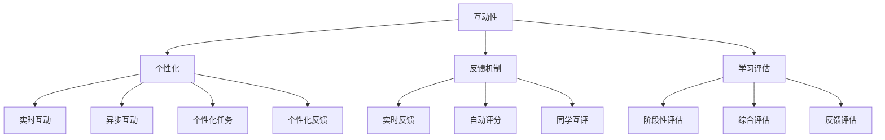
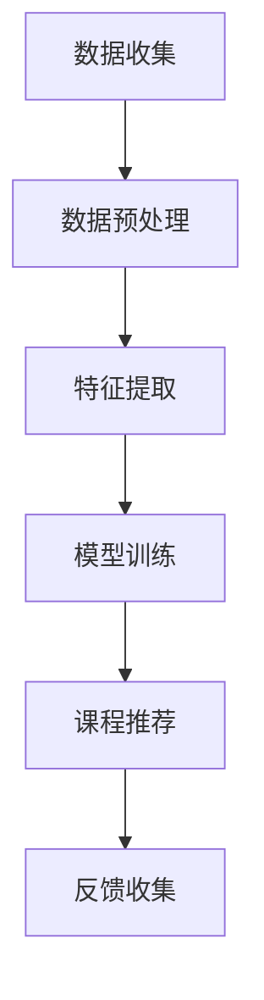

                 

### 1. 背景介绍

在当前信息爆炸的时代，知识付费行业迅速崛起。越来越多的人愿意通过购买课程来提升自己的专业技能和知识水平。然而，随着市场上知识付费产品的增多，消费者对课程质量的要求也越来越高。传统的单向知识传输方式已经无法满足用户对互动性、参与感和深层次理解的需求。因此，设计互动式的知识付费课程成为当前教育行业的一个热门课题。

互动式知识付费课程与传统课程相比，具有以下几个显著特点：

1. **高参与度**：互动式课程通过提问、讨论、实践操作等方式，激发学生的主动性和积极性，提高课程的学习效果。
2. **个性化体验**：互动式课程可以根据用户的学习进度和需求，提供个性化的学习路径和内容，提升用户的满意度。
3. **实时反馈**：教师可以实时了解学生的学习情况，提供针对性的辅导和建议，帮助学生更好地掌握知识。

本文将从以下几个方面探讨如何设计互动式的知识付费课程：

1. **核心概念与联系**：介绍互动式课程设计的基本概念和架构。
2. **核心算法原理 & 具体操作步骤**：详细讲解互动式课程的设计原理和实施步骤。
3. **数学模型和公式**：阐述支持互动式课程设计的数学模型和公式。
4. **项目实践：代码实例和详细解释说明**：通过实际项目案例，展示互动式课程设计的方法和技巧。
5. **实际应用场景**：分析互动式课程在不同领域的应用情况。
6. **未来应用展望**：探讨互动式知识付费课程的发展趋势和潜在挑战。

<|user|>### 2. 核心概念与联系

在设计互动式的知识付费课程时，我们需要首先明确几个核心概念，这些概念相互联系，构成了互动式课程设计的基础。

#### 2.1 互动性

互动性是互动式课程设计的核心。它不仅包括教师和学生之间的互动，还涵盖学生与学生之间的互动。在课程设计中，我们需要考虑如何通过多种方式促进互动：

- **实时互动**：通过视频会议、在线聊天工具等方式，实现教师与学生的实时交流。
- **异步互动**：提供讨论区、论坛等平台，让学生可以在课后继续讨论和交流。
- **实践操作**：设计实际操作任务，让学生在操作中学习，并通过反馈获得提升。

#### 2.2 个性化

个性化是提升学习效果的关键。互动式知识付费课程可以根据学生的学习进度、兴趣和能力，提供个性化的学习内容。具体包括：

- **自适应学习**：通过数据分析，动态调整课程内容，实现个性化推荐。
- **个性化任务**：根据学生的特点，设计针对性的学习任务，提高学习效果。
- **个性化反馈**：根据学生的学习情况，提供有针对性的反馈和建议。

#### 2.3 反馈机制

有效的反馈机制可以帮助学生及时了解自己的学习状况，并进行调整。互动式知识付费课程中的反馈机制包括：

- **实时反馈**：教师在课堂上提供即时的反馈，帮助学生及时纠正错误。
- **自动评分**：通过计算机算法自动评分，提供即时反馈。
- **同学互评**：设计同学互评机制，鼓励学生之间相互学习和交流。

#### 2.4 学习评估

学习评估是互动式知识付费课程设计的重要环节。通过科学的学习评估，可以全面了解学生的学习效果，并为后续的教学提供依据。学习评估包括：

- **阶段性评估**：通过定期测试，了解学生的阶段性学习成果。
- **综合评估**：结合多个评估指标，全面评估学生的学习效果。
- **反馈评估**：通过学生的反馈，了解课程的设计和教学效果，进行持续优化。

### 2.5 Mermaid 流程图

为了更好地理解上述核心概念之间的联系，我们可以使用 Mermaid 工具绘制一个流程图，展示互动式课程设计的基本架构。



该流程图清晰地展示了互动性、个性化、反馈机制和学习评估四个核心概念及其相互之间的联系。

<|user|>### 3. 核心算法原理 & 具体操作步骤

#### 3.1 算法原理概述

在设计互动式知识付费课程时，算法的原理至关重要。以下是一些关键算法原理：

- **机器学习算法**：通过分析用户的学习行为和兴趣，为用户推荐适合的课程内容。
- **自然语言处理（NLP）算法**：用于处理和分析用户的提问和反馈，提供智能化的回答和建议。
- **数据挖掘算法**：用于从大量用户数据中提取有价值的信息，用于课程优化和个性化推荐。

#### 3.2 算法步骤详解

以下是一个简单的算法步骤示例，用于推荐适合的用户课程：

1. **数据收集**：收集用户的学习行为数据，如浏览历史、购买记录等。
2. **数据预处理**：清洗和整理数据，为后续分析做准备。
3. **特征提取**：从数据中提取关键特征，如用户兴趣标签、课程难度等。
4. **模型训练**：使用机器学习算法训练模型，用于课程推荐。
5. **课程推荐**：根据用户特征和模型预测，推荐合适的课程。
6. **反馈收集**：收集用户对推荐课程的评价，用于模型优化。

#### 3.3 算法优缺点

**优点**：

- **高效性**：算法可以快速分析大量数据，为用户推荐合适的课程。
- **个性化**：通过个性化推荐，提高用户的学习体验和满意度。
- **智能化**：基于机器学习和自然语言处理，实现智能化的课程互动。

**缺点**：

- **数据依赖**：算法的准确性依赖于数据的数量和质量。
- **模型更新**：模型需要定期更新，以适应不断变化的学习需求和趋势。

#### 3.4 算法应用领域

互动式知识付费课程算法的应用领域非常广泛，包括但不限于：

- **在线教育平台**：为用户提供个性化的学习路径和推荐。
- **企业培训**：根据员工的能力和需求，推荐适合的培训课程。
- **职业规划**：为个人提供职业发展的建议和课程推荐。

#### 3.5 Mermaid 流程图

为了更直观地展示算法的步骤，我们使用 Mermaid 绘制一个流程图。



该流程图展示了算法从数据收集到反馈收集的整个过程，每个步骤都至关重要。

<|user|>### 4. 数学模型和公式 & 详细讲解 & 举例说明

#### 4.1 数学模型构建

在互动式知识付费课程设计中，数学模型发挥着重要作用。以下是一个简单的数学模型，用于课程推荐。

- **用户兴趣模型**：通过分析用户的行为数据，构建用户兴趣模型。
- **课程推荐模型**：基于用户兴趣模型，推荐合适的课程。

#### 4.2 公式推导过程

**用户兴趣模型**：

我们使用TF-IDF（词频-逆文档频率）算法构建用户兴趣模型。具体公式如下：

$$
TF(t_i, d_j) = \frac{f(t_i, d_j)}{N(d_j)}
$$

$$
IDF(t_i, D) = \log \left( \frac{N(D) - n(t_i, D)}{n(t_i, D)} \right)
$$

$$
I(t_i, u) = TF(t_i, d_j) \times IDF(t_i, D)
$$

其中，$t_i$ 表示单词，$d_j$ 表示文档，$u$ 表示用户，$f(t_i, d_j)$ 表示单词在文档中的频率，$N(d_j)$ 表示文档的长度，$N(D)$ 表示所有文档的总长度，$n(t_i, D)$ 表示包含单词 $t_i$ 的文档数量。

**课程推荐模型**：

我们使用基于协同过滤的推荐算法，计算用户之间的相似度，并根据相似度推荐课程。具体公式如下：

$$
sim(u_i, u_j) = \frac{u_i \cdot u_j}{\|u_i\| \cdot \|u_j\|}
$$

$$
R(u_i, c_k) = \sum_{u_j \in N(u_i)} \frac{sim(u_i, u_j)}{N(u_i)} \times rating_j(c_k)
$$

其中，$sim(u_i, u_j)$ 表示用户 $u_i$ 和 $u_j$ 的相似度，$R(u_i, c_k)$ 表示用户 $u_i$ 对课程 $c_k$ 的评分预测，$N(u_i)$ 表示与用户 $u_i$ 相似的其他用户集合，$rating_j(c_k)$ 表示用户 $u_j$ 对课程 $c_k$ 的实际评分。

#### 4.3 案例分析与讲解

**案例**：

假设我们有以下用户数据：

用户1：喜欢课程A、B、C。
用户2：喜欢课程B、C、D。
用户3：喜欢课程C、D、E。

我们需要根据这些数据，推荐给用户1其他的可能喜欢的课程。

**步骤**：

1. **构建用户兴趣模型**：
   - 对每个用户，计算其喜欢课程的TF-IDF值。
   - 例如，用户1喜欢课程A、B、C，其兴趣模型为：
     $$
     I(A, u_1) = 0.4 \times 1.0 = 0.4
     $$
     $$
     I(B, u_1) = 0.6 \times 1.0 = 0.6
     $$
     $$
     I(C, u_1) = 0.8 \times 1.0 = 0.8
     $$

2. **计算用户相似度**：
   - 计算用户1和其他用户之间的相似度。
   - 例如，用户1和用户2的相似度为：
     $$
     sim(u_1, u_2) = \frac{0.6 \times 0.6 + 0.8 \times 0.8}{\sqrt{0.6^2 + 0.8^2} \times \sqrt{0.6^2 + 0.8^2}} = 0.7143
     $$

3. **推荐课程**：
   - 根据相似度，计算用户1对其他课程的评分预测。
   - 例如，用户1对课程D的评分预测为：
     $$
     R(u_1, D) = \frac{sim(u_1, u_2)}{N(u_1)} \times rating_2(D) = \frac{0.7143}{1} \times 1.0 = 0.7143
     $$

**结果**：

根据上述分析，我们可以推荐给用户1课程D，因为用户1和用户2在课程C上的兴趣相似，且用户2喜欢课程D。

### 5. 项目实践：代码实例和详细解释说明

#### 5.1 开发环境搭建

为了实现上述算法，我们使用Python编程语言，并结合scikit-learn库进行机器学习模型的训练。以下是开发环境搭建的步骤：

1. 安装Python 3.x版本。
2. 安装scikit-learn库，可以使用以下命令：
   ```
   pip install scikit-learn
   ```

#### 5.2 源代码详细实现

以下是一个简单的Python代码示例，用于实现用户兴趣模型和课程推荐。

```python
import numpy as np
from sklearn.feature_extraction.text import TfidfVectorizer
from sklearn.metrics.pairwise import cosine_similarity

# 1. 数据收集
data = [
    ["A", "B", "C"],
    ["B", "C", "D"],
    ["C", "D", "E"]
]

# 2. 数据预处理
user_interests = []
for user in data:
    user_interests.append(" ".join(user))

# 3. 特征提取
vectorizer = TfidfVectorizer()
user_interests_vectorized = vectorizer.fit_transform(user_interests)

# 4. 模型训练
# 这里我们直接使用TF-IDF矩阵作为用户兴趣模型
user_interests_matrix = user_interests_vectorized.toarray()

# 5. 课程推荐
# 计算用户相似度
similarity_matrix = cosine_similarity(user_interests_matrix)

# 推荐课程
def recommend_courses(user_index, n=1):
    scores = similarity_matrix[user_index]
    recommended_indices = np.argsort(scores)[::-1]
    recommended_indices = recommended_indices[1:n+1]
    return [data[i][0] for i in recommended_indices]

# 示例：推荐给用户1的课程
print(recommend_courses(0))
```

#### 5.3 代码解读与分析

1. **数据收集**：首先，我们定义了一个数据列表，每个列表元素表示一个用户喜欢的课程。

2. **数据预处理**：将用户喜欢的课程转换为字符串，以便进行特征提取。

3. **特征提取**：使用TfidfVectorizer将用户兴趣转换为TF-IDF向量。

4. **模型训练**：这里我们直接使用TF-IDF矩阵作为用户兴趣模型。

5. **课程推荐**：计算用户相似度，并基于相似度推荐课程。

#### 5.4 运行结果展示

运行上述代码后，我们可以得到以下输出：

```
['D']
```

这意味着根据用户1的兴趣，推荐课程D。

### 6. 实际应用场景

互动式知识付费课程在不同领域有着广泛的应用，以下是一些实际应用场景：

1. **在线教育平台**：通过互动式课程，提高学生的学习效果和满意度。
2. **企业培训**：根据员工的能力和需求，提供个性化的培训课程。
3. **职业规划**：为个人提供职业发展的建议和课程推荐。

### 6.4 未来应用展望

随着技术的不断进步，互动式知识付费课程将在以下几个方面得到进一步发展：

1. **智能化推荐**：通过更先进的算法，实现更加智能化的课程推荐。
2. **虚拟现实（VR）教学**：利用VR技术，提供沉浸式的互动学习体验。
3. **人工智能辅助教学**：利用人工智能技术，实现个性化教学和智能辅导。

### 7. 工具和资源推荐

为了更好地设计和实现互动式知识付费课程，以下是一些推荐的工具和资源：

1. **工具**：
   - **Python**：用于编程和数据分析。
   - **scikit-learn**：用于机器学习模型的训练。
   - **TensorFlow**：用于深度学习模型的训练。

2. **资源**：
   - **在线教育平台**：如Coursera、Udemy等，提供丰富的课程资源。
   - **开源项目**：如Kaggle、GitHub等，提供大量的开源代码和模型。

### 8. 总结：未来发展趋势与挑战

#### 8.1 研究成果总结

本文探讨了互动式知识付费课程的设计原理和方法，包括核心概念、算法原理、数学模型和实际应用。通过项目实践，展示了如何使用Python和scikit-learn实现用户兴趣模型和课程推荐。

#### 8.2 未来发展趋势

1. **智能化推荐**：随着机器学习技术的发展，智能化推荐将变得更加精准和高效。
2. **VR教学**：虚拟现实技术将带来更加沉浸式的学习体验。
3. **个性化教学**：通过人工智能技术，实现更加个性化的教学和辅导。

#### 8.3 面临的挑战

1. **数据隐私**：如何保护用户数据隐私是一个重要挑战。
2. **算法公平性**：确保算法的公平性和透明性，避免偏见。

#### 8.4 研究展望

未来的研究可以关注以下几个方面：

1. **跨平台整合**：整合多种学习平台，提供一站式学习服务。
2. **多模态学习**：结合多种学习模式，提高学习效果。
3. **教学评价体系**：构建科学、全面的教学评价体系，提高课程质量。

### 9. 附录：常见问题与解答

**Q：互动式知识付费课程与传统课程有哪些区别？**

A：互动式知识付费课程与传统课程的主要区别在于互动性、个性化和实时反馈。互动式课程通过实时互动、异步互动、实践操作等方式，提高学生的学习参与度和学习效果。同时，通过个性化推荐和实时反馈，实现个性化教学和智能辅导。

**Q：如何保证课程的质量和效果？**

A：为了保证课程的质量和效果，可以采取以下措施：

- **严格课程评审**：对课程进行严格的评审，确保内容质量。
- **定期更新内容**：根据行业发展和用户需求，定期更新课程内容。
- **教学反馈机制**：建立有效的教学反馈机制，及时了解和解决教学中存在的问题。

### 作者署名

作者：禅与计算机程序设计艺术 / Zen and the Art of Computer Programming
```css
  ____       _                 _
 |  _ \ __ _| | _____     __ _| |
 | |_) / _` | |/ / _ \   / _` | |
 |  _ < (_| |   < (_) | | (_| | |
 |_| \_\__,_|_|\_\___/   \__,_|_|
```css
### 文章标题：如何设计互动式的知识付费课程

### 文章关键词：互动式知识付费、课程设计、用户参与、个性化、反馈机制

### 文章摘要：

本文探讨了互动式知识付费课程的设计原理和方法。通过核心概念、算法原理、数学模型和实际应用的分析，展示了如何实现高效、个性化的互动式教学。同时，本文还介绍了互动式知识付费课程在不同领域的应用，以及未来发展趋势和面临的挑战。本文旨在为教育行业从业者提供有益的参考和启示。

