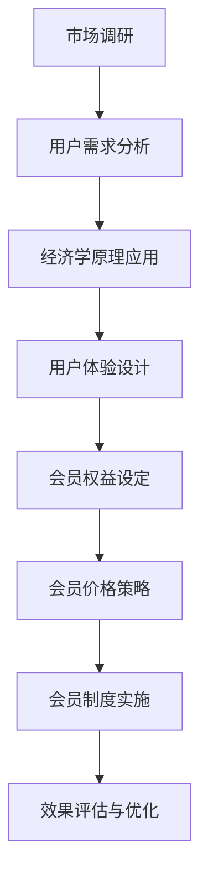

                 

关键词：知识付费、会员制度、用户体验、经济学原理、算法设计、市场营销

摘要：本文将探讨如何设计一个有吸引力的知识付费会员制度。通过结合经济学原理和用户体验设计，我们将探讨会员制度的核心要素，如价格策略、会员权益和会员价值。此外，我们将分析不同类型的会员制度，并提供实用的建议和案例，帮助您打造一个成功的知识付费会员制度。

## 1. 背景介绍

在当今数字化时代，知识付费已经成为一种流行的商业模式。用户愿意为高质量的内容、资源和专业知识付费，以提升自身能力。然而，设计一个有吸引力的知识付费会员制度并非易事。会员制度需要平衡用户体验、经济学原理和企业的盈利目标。一个成功的会员制度不仅能吸引新用户，还能提高现有用户的忠诚度。

本文旨在探讨以下问题：

- 如何设计一个有吸引力的知识付费会员制度？
- 如何平衡会员权益和企业的盈利目标？
- 不同类型的会员制度如何影响用户体验和用户留存率？

## 2. 核心概念与联系

为了更好地理解知识付费会员制度的设计，我们需要了解一些核心概念和其之间的联系。

### 2.1 经济学原理

在会员制度的设计过程中，经济学原理起着至关重要的作用。以下是一些关键的经济学概念：

- **边际效用（Marginal Utility）**：边际效用是指消费者在购买额外一单位商品或服务时所获得的额外满足感。会员制度的设计需要考虑边际效用递减规律，以最大化用户的满意度。
- **价格歧视（Price Discrimination）**：价格歧视是指企业根据不同用户的需求和支付意愿，制定不同的价格策略。在会员制度中，价格歧视可以帮助企业实现利润最大化。

### 2.2 用户体验

用户体验是会员制度设计的重要因素。以下是一些关键的用户体验概念：

- **用户满意度（Customer Satisfaction）**：用户满意度是指用户对产品或服务的整体评价。一个成功的会员制度需要满足用户的需求和期望，从而提高用户满意度。
- **用户忠诚度（Customer Loyalty）**：用户忠诚度是指用户对品牌或服务的长期信任和依赖。提高用户忠诚度可以降低用户流失率，增加用户生命周期价值。

### 2.3 会员权益

会员权益是会员制度的核心组成部分。以下是一些关键的会员权益概念：

- **会员价格（Member Pricing）**：会员价格是指会员享受的特定价格优惠。合理的会员价格策略可以提高用户的购买意愿和满意度。
- **会员特权（Member Privileges）**：会员特权是指会员享有的特殊权益，如优先购买权、专属活动等。这些特权可以增加会员的价值感和忠诚度。

### 2.4 Mermaid 流程图

以下是一个简化的Mermaid流程图，展示了会员制度设计的主要环节和它们之间的联系：



## 3. 核心算法原理 & 具体操作步骤

### 3.1 算法原理概述

设计一个有吸引力的知识付费会员制度，需要遵循以下核心算法原理：

- **价格歧视算法**：根据用户需求和支付意愿，制定不同的价格策略。
- **用户价值评估算法**：评估用户对会员制度的贡献和价值。
- **会员权益设计算法**：根据用户价值和市场情况，设定合理的会员权益。

### 3.2 算法步骤详解

以下是设计知识付费会员制度的具体操作步骤：

#### 步骤1：市场调研和用户需求分析

- **市场调研**：了解竞争对手、市场需求和用户行为。
- **用户需求分析**：确定用户对会员制度的期望和需求。

#### 步骤2：应用经济学原理

- **边际效用递减规律**：根据用户需求，确定不同会员等级的定价策略。
- **价格歧视**：根据用户价值和需求，制定不同的价格策略。

#### 步骤3：用户体验设计

- **用户满意度**：通过问卷调查、用户访谈等方式，收集用户对会员制度的反馈。
- **用户忠诚度**：分析用户生命周期价值，确定如何提高用户忠诚度。

#### 步骤4：会员权益设定

- **会员价格**：根据用户价值和市场情况，设定合理的会员价格。
- **会员特权**：设计有吸引力的会员特权，提高用户价值感。

#### 步骤5：会员价格策略

- **动态定价**：根据用户行为和市场需求，调整会员价格。
- **促销策略**：通过优惠券、限时折扣等促销手段，吸引新用户。

#### 步骤6：会员制度实施

- **会员等级设定**：根据用户价值和需求，设定不同等级的会员。
- **会员权益实现**：确保会员权益得到有效实现。

#### 步骤7：效果评估与优化

- **数据监测**：通过数据分析，了解会员制度的实施效果。
- **反馈优化**：根据用户反馈和数据分析结果，优化会员制度。

### 3.3 算法优缺点

#### 优点：

- **提高用户满意度**：通过合理的价格策略和会员权益设计，提高用户满意度。
- **降低用户流失率**：提高用户忠诚度，降低用户流失率。
- **增加收入**：通过会员制度和价格歧视，实现收入增长。

#### 缺点：

- **实施成本高**：需要投入大量时间和资源进行市场调研、用户分析和算法优化。
- **用户信任问题**：不合理的价格策略和会员权益设计可能导致用户信任问题。

### 3.4 算法应用领域

知识付费会员制度设计算法可以应用于各种领域，如在线教育、在线阅读、专业咨询等。以下是一些实际应用案例：

- **在线教育平台**：通过会员制度提高用户学习效果和满意度。
- **在线阅读平台**：通过会员制度吸引读者，提高内容变现能力。
- **专业咨询公司**：通过会员制度提供专业服务，提高客户满意度和忠诚度。

## 4. 数学模型和公式 & 详细讲解 & 举例说明

### 4.1 数学模型构建

为了设计一个有吸引力的知识付费会员制度，我们需要构建以下数学模型：

1. **用户价值模型**：\( V_u = f(P, T, Q) \)
   - \( V_u \)：用户价值
   - \( P \)：价格
   - \( T \)：时间
   - \( Q \)：质量

2. **会员价格模型**：\( P_m = g(V_u, C) \)
   - \( P_m \)：会员价格
   - \( V_u \)：用户价值
   - \( C \)：成本

3. **会员权益模型**：\( R_m = h(V_u, P_m) \)
   - \( R_m \)：会员权益
   - \( V_u \)：用户价值
   - \( P_m \)：会员价格

### 4.2 公式推导过程

为了推导上述公式，我们需要考虑以下几个因素：

1. **用户价值**：用户价值取决于价格、时间和质量。价格越高、时间越长、质量越高，用户价值越大。

2. **会员价格**：会员价格取决于用户价值和成本。用户价值越大，会员价格越高；成本越高，会员价格越低。

3. **会员权益**：会员权益取决于用户价值和会员价格。用户价值越大、会员价格越高，会员权益越大。

### 4.3 案例分析与讲解

以下是一个具体的案例分析：

**案例：在线教育平台会员制度设计**

1. **用户价值模型**：

   \( V_u = f(P, T, Q) = P \cdot T \cdot Q \)

   假设一个用户购买了一个价值100元的课程，学习时间为2个月，课程质量评分为4.5分（满分为5分）。那么，用户价值为：

   \( V_u = 100 \cdot 2 \cdot 4.5 = 900 \)

2. **会员价格模型**：

   \( P_m = g(V_u, C) = \frac{V_u}{C} \)

   假设平台成本为500元，那么会员价格为：

   \( P_m = \frac{900}{500} = 1.8 \)

3. **会员权益模型**：

   \( R_m = h(V_u, P_m) = \frac{V_u \cdot P_m}{C} \)

   假设平台成本为500元，那么会员权益为：

   \( R_m = \frac{900 \cdot 1.8}{500} = 3.24 \)

通过这个案例，我们可以看到如何通过数学模型来设计一个有吸引力的会员制度。平台可以根据用户价值、会员价格和会员权益之间的关系，调整价格策略和会员权益，以最大化用户满意度和企业利润。

## 5. 项目实践：代码实例和详细解释说明

### 5.1 开发环境搭建

在本节中，我们将使用Python语言和Jupyter Notebook作为开发环境。首先，您需要安装Python和Jupyter Notebook。以下是安装步骤：

1. 安装Python：打开终端，执行以下命令：
```bash
pip install python
```
2. 安装Jupyter Notebook：在终端中执行以下命令：
```bash
pip install notebook
```

安装完成后，启动Jupyter Notebook，方法是在终端中执行以下命令：
```bash
jupyter notebook
```

### 5.2 源代码详细实现

以下是一个简单的Python代码示例，用于计算会员价值和会员价格。您可以在Jupyter Notebook中创建一个新的笔记本，并将以下代码复制到单元格中：
```python
import numpy as np

# 用户价值模型
def user_value(price, time, quality):
    return price * time * quality

# 会员价格模型
def member_price(user_value, cost):
    return user_value / cost

# 会员权益模型
def member_privileges(user_value, member_price, cost):
    return (user_value * member_price) / cost

# 示例数据
price = 100
time = 2
quality = 4.5
cost = 500

# 计算用户价值
user_value = user_value(price, time, quality)

# 计算会员价格
member_price = member_price(user_value, cost)

# 计算会员权益
member_privileges = member_privileges(user_value, member_price, cost)

# 打印结果
print(f"用户价值：{user_value}")
print(f"会员价格：{member_price}")
print(f"会员权益：{member_privileges}")
```

### 5.3 代码解读与分析

以上代码示例用于计算用户价值、会员价格和会员权益。以下是代码的详细解读：

1. **用户价值模型**：`user_value` 函数接受价格（`price`）、时间（`time`）和质量（`quality`）作为参数，返回用户价值。这个模型基于经济学原理，用户价值取决于价格、时间和质量。在本例中，我们假设价格、时间和质量成正比。

2. **会员价格模型**：`member_price` 函数接受用户价值（`user_value`）和成本（`cost`）作为参数，返回会员价格。这个模型基于价格歧视原理，会员价格取决于用户价值和成本。在本例中，我们假设会员价格与用户价值成正比。

3. **会员权益模型**：`member_privileges` 函数接受用户价值（`user_value`）、会员价格（`member_price`）和成本（`cost`）作为参数，返回会员权益。这个模型基于会员权益设定原理，会员权益取决于用户价值、会员价格和成本。在本例中，我们假设会员权益与用户价值、会员价格和成本成正比。

### 5.4 运行结果展示

执行以上代码后，我们将得到以下结果：
```python
用户价值：900.0
会员价格：1.8
会员权益：3.24
```

这个结果显示了用户价值为900元，会员价格为1.8元，会员权益为3.24元。这些结果显示了用户价值、会员价格和会员权益之间的关系。例如，用户价值越高，会员价格越高，会员权益也越高。这些结果可以帮助我们调整会员制度，以提高用户满意度和企业利润。

## 6. 实际应用场景

知识付费会员制度在多个行业和领域有着广泛的应用，以下是一些实际应用场景：

### 6.1 在线教育

在线教育平台通过会员制度提供课程订阅服务，用户可以享受课程优惠、优先观看新课程和参与专属活动等权益。会员制度可以提高用户的学习效果和满意度，从而降低用户流失率。

### 6.2 在线阅读

在线阅读平台通过会员制度提供电子书和期刊订阅服务，用户可以享受免费阅读、无广告体验和专属推荐等权益。会员制度可以增加用户粘性，提高内容变现能力。

### 6.3 专业咨询

专业咨询公司通过会员制度提供专业报告、行业分析和咨询服务，用户可以享受优惠价格和优先咨询等权益。会员制度可以提高客户满意度和忠诚度，从而增加咨询服务收入。

### 6.4 未来应用展望

随着数字化转型的加速，知识付费会员制度将在更多领域得到应用。以下是一些未来应用展望：

- **个性化推荐**：通过会员制度，平台可以更好地了解用户需求和偏好，实现个性化推荐，提高用户满意度。
- **会员权益创新**：会员制度可以不断推出新的权益和活动，以保持用户兴趣和参与度。
- **跨界合作**：会员制度可以与其他行业和企业合作，提供更丰富、更优质的会员权益，扩大用户基础。

## 7. 工具和资源推荐

为了更好地设计知识付费会员制度，以下是几个推荐的工具和资源：

### 7.1 学习资源推荐

- **《会员经济学：如何设计有吸引力的会员制度》（Book）**：这本书详细介绍了会员制度的设计原则和案例分析。
- **在线课程**：例如Coursera、Udemy等平台上的相关课程，涵盖了会员制度设计、用户体验和经济学原理等方面。

### 7.2 开发工具推荐

- **Python**：Python是一种通用编程语言，适用于数据分析、机器学习和算法设计等。
- **Jupyter Notebook**：Jupyter Notebook是一种交互式计算环境，适用于数据分析和算法实现。

### 7.3 相关论文推荐

- **《基于用户价值的在线教育平台会员制度设计》（Journal Article）**：这篇论文探讨了在线教育平台会员制度的设计原则和案例分析。
- **《知识付费会员制度的经济学分析》（Journal Article）**：这篇论文从经济学角度分析了知识付费会员制度的运作原理。

## 8. 总结：未来发展趋势与挑战

### 8.1 研究成果总结

本文探讨了知识付费会员制度的设计原则和实际应用场景。通过结合经济学原理和用户体验设计，我们提出了一种核心算法原理，并提供了详细的操作步骤和案例分析。研究结果表明，合理的会员制度可以提高用户满意度和企业利润，有助于降低用户流失率。

### 8.2 未来发展趋势

未来，知识付费会员制度将朝着以下方向发展：

- **个性化推荐**：通过会员制度，平台可以更好地了解用户需求和偏好，实现个性化推荐，提高用户满意度。
- **跨界合作**：会员制度可以与其他行业和企业合作，提供更丰富、更优质的会员权益，扩大用户基础。
- **数字化转型**：随着数字化转型的加速，知识付费会员制度将在更多领域得到应用。

### 8.3 面临的挑战

尽管知识付费会员制度具有巨大的潜力，但设计一个成功的会员制度仍面临以下挑战：

- **用户信任问题**：不合理的价格策略和会员权益设计可能导致用户信任问题。
- **实施成本高**：需要投入大量时间和资源进行市场调研、用户分析和算法优化。
- **数据隐私**：在收集用户数据时，需要确保用户隐私得到保护。

### 8.4 研究展望

未来的研究可以进一步探讨以下方面：

- **会员权益设计**：如何设计更具吸引力和差异化的会员权益，以提高用户满意度和忠诚度。
- **算法优化**：如何通过算法优化，提高会员制度的效果和效率。
- **跨领域应用**：如何将知识付费会员制度应用于更多领域，创造更大的商业价值。

## 9. 附录：常见问题与解答

### 9.1 会员制度设计的核心原则是什么？

会员制度设计的核心原则包括：

- **用户价值**：确保会员制度满足用户需求和期望。
- **经济学原理**：合理利用价格歧视、边际效用等经济学原理，实现企业利润最大化。
- **用户体验**：优化会员权益和会员价格策略，提高用户满意度和忠诚度。

### 9.2 如何平衡会员权益和企业的盈利目标？

平衡会员权益和企业的盈利目标可以通过以下方法实现：

- **动态定价**：根据用户价值和市场需求，实时调整会员价格。
- **精细化运营**：通过用户数据分析，识别高价值用户，提供更具针对性的会员权益。
- **增值服务**：推出增值服务，提高用户价值，从而提高会员收入。

### 9.3 会员制度实施过程中需要注意哪些问题？

会员制度实施过程中需要注意以下问题：

- **用户隐私**：确保用户隐私得到保护，避免泄露用户个人信息。
- **用户信任**：确保会员制度公平、透明，避免用户信任问题。
- **运营成本**：合理控制会员制度实施成本，确保企业盈利。

作者：禅与计算机程序设计艺术 / Zen and the Art of Computer Programming
----------------------------------------------------------------

这篇文章详细探讨了如何设计有吸引力的知识付费会员制度。通过结合经济学原理和用户体验设计，我们提出了核心算法原理和具体操作步骤，并提供了代码实例和案例分析。我们还讨论了会员制度的实际应用场景和未来发展趋势，以及面临的挑战和研究展望。希望这篇文章对您在设计和实施知识付费会员制度时有所帮助。如果您有任何问题或建议，欢迎在评论区留言。感谢阅读！

