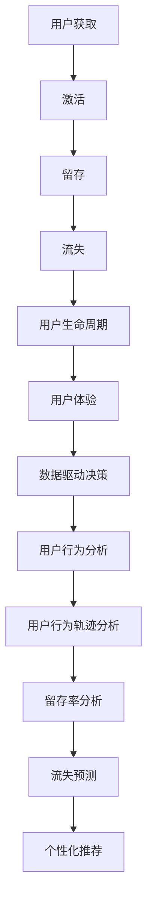

                 

在当今这个以用户为中心的数字时代，用户留存率已经成为衡量企业成功与否的关键指标。高用户留存率不仅意味着用户对产品或服务的满意度和忠诚度，还直接影响着企业的收入、市场占有率和长期竞争力。因此，本文将深入探讨如何通过技术手段进行有效的用户留存，以提高企业的整体业绩。

## 文章关键词
- 用户留存
- 用户体验
- 数据分析
- 技术优化
- 用户行为分析
- 数据挖掘

## 摘要
本文将从多个角度探讨如何实现有效的用户留存。首先，我们将回顾用户留存的重要性，并解释为何它是企业成功的关键。接下来，我们将讨论用户留存的核心概念，如用户生命周期、用户行为分析和数据驱动的决策。随后，文章将详细介绍几种常用的技术方法，包括个性化推荐、A/B 测试、用户反馈机制以及如何利用人工智能进行用户行为预测。文章还将探讨如何设计吸引人的用户界面和提供高质量的产品或服务。最后，我们将讨论用户留存策略的实施、评估和优化，以及展望未来的发展趋势和挑战。

## 1. 背景介绍

在数字化的浪潮下，互联网企业和移动应用开发商面临着巨大的竞争压力。为了在激烈的市场中立足，企业不得不不断创新和优化其产品或服务。然而，吸引新用户只是第一步，更重要的是如何留住这些用户，让他们成为长期的忠实客户。

用户留存是指用户在一定时间内继续使用产品或服务的比例。它通常以日活跃用户（DAU）、月活跃用户（MAU）等指标来衡量。高用户留存率意味着用户对产品的满意度和依赖程度较高，而低用户留存率则可能预示着产品或服务存在某些问题。

用户留存的重要性不言而喻。首先，高留存率可以减少获取新用户的成本。用户获取（User Acquisition，简称UA）通常需要投入大量资源，包括广告、推广活动和营销策略等。而如果用户能够持续留存，则可以减少对新增用户的依赖，从而降低整体营销成本。其次，留存用户往往具有较高的忠诚度，他们更愿意推荐产品或服务给他人，从而帮助企业实现口碑营销。此外，留存用户还可以提供宝贵的反馈和改进建议，帮助产品持续优化。

尽管用户留存对企业至关重要，但实现高留存率并非易事。用户需求多变，市场竞争激烈，产品设计和服务质量都需要不断调整和优化。因此，本文将探讨一系列技术手段和策略，帮助企业提高用户留存率，从而在激烈的市场竞争中脱颖而出。

## 2. 核心概念与联系

为了实现有效的用户留存，我们首先需要了解几个核心概念，包括用户生命周期、用户体验、数据驱动决策以及用户行为分析。

### 2.1 用户生命周期

用户生命周期是指用户从首次接触到产品或服务到最终流失的整个过程。它通常可以分为以下几个阶段：

1. **获取阶段**：用户通过广告、推荐、搜索引擎等方式了解到产品或服务，并决定尝试使用。
2. **激活阶段**：用户初次使用产品或服务，开始对产品产生初步印象。
3. **留存阶段**：用户在一段时间内持续使用产品或服务，表现出较高的忠诚度。
4. **流失阶段**：用户由于各种原因停止使用产品或服务，最终流失。

理解用户生命周期对于制定有效的用户留存策略至关重要。企业可以通过分析用户在不同阶段的停留时间、活跃度和转化率，发现留存问题的关键点，并采取相应的措施。

### 2.2 用户体验

用户体验（User Experience，简称UX）是指用户在使用产品或服务过程中所感受到的整体体验。它包括用户界面设计、交互流程、响应速度、功能易用性等多个方面。良好的用户体验可以增强用户对产品的满意度和忠诚度，从而提高留存率。

用户体验的优化需要从多个角度入手。首先，设计简洁直观的用户界面，确保用户能够轻松地找到所需功能和信息。其次，优化交互流程，减少用户完成任务所需的时间和步骤。此外，提高系统性能和响应速度，确保用户在使用过程中不会遇到延迟或错误。

### 2.3 数据驱动决策

数据驱动决策是指通过收集和分析用户数据，指导产品开发和运营策略。在用户留存方面，数据驱动决策可以帮助企业更好地了解用户需求、行为和偏好，从而制定更有效的留存策略。

数据驱动决策的核心在于数据收集、处理和分析。企业可以通过多种途径收集用户数据，包括用户行为日志、用户反馈、交易记录等。接下来，需要对数据进行清洗、处理和建模，提取有价值的信息。最后，根据分析结果，调整产品功能、服务质量和营销策略，以提高用户留存率。

### 2.4 用户行为分析

用户行为分析是指通过对用户在产品或服务中的行为数据进行分析，了解用户的需求、偏好和习惯。用户行为分析可以帮助企业发现用户留存中的潜在问题，并提供改进方向。

用户行为分析通常包括以下几个方面：

1. **用户行为轨迹分析**：分析用户在产品或服务中的浏览路径、点击行为等，了解用户的兴趣和需求。
2. **留存率分析**：根据用户行为数据，计算不同阶段的留存率，识别留存问题所在。
3. **流失预测**：利用机器学习算法，预测哪些用户可能会流失，并采取预防措施。
4. **个性化推荐**：根据用户行为数据，推荐个性化内容或功能，提高用户的满意度和留存率。

### 2.5 Mermaid 流程图

下面是一个简单的 Mermaid 流程图，展示用户留存的核心概念及其联系：



通过这个流程图，我们可以清晰地看到用户留存涉及的各个核心概念及其相互关系。企业可以通过综合运用这些方法和技术，提高用户留存率，从而实现长期稳定的发展。

### 3. 核心算法原理 & 具体操作步骤

在了解了用户留存的核心概念后，我们将进一步探讨如何通过技术手段实现有效的用户留存。本文将详细介绍几种核心算法原理及其具体操作步骤，包括个性化推荐、A/B 测试和用户反馈机制。

#### 3.1 算法原理概述

1. **个性化推荐**：
   个性化推荐是一种基于用户历史行为和偏好，为其推荐个性化内容或产品的算法。它可以帮助企业提高用户满意度和留存率，因为用户更倾向于接受与他们兴趣相符的建议。
   
   常用的个性化推荐算法包括协同过滤、基于内容的推荐和混合推荐。协同过滤算法通过分析用户之间的相似度，推荐其他用户喜欢的项目。基于内容的推荐算法则根据项目的特征，推荐与用户已喜欢的项目相似的其他项目。混合推荐算法结合了协同过滤和基于内容的推荐，以提高推荐效果。

2. **A/B 测试**：
   A/B 测试是一种通过将用户随机分配到不同的版本（A组和B组），比较不同版本的效果，从而确定最佳设计方案的方法。它可以帮助企业了解用户对不同设计方案的偏好，从而优化产品界面、功能和服务。
   
   A/B 测试的核心是统计显著性测试，它通过比较两个或多个组的统计差异，确定结果是否具有统计学上的显著性。常用的统计显著性测试方法包括t检验、卡方检验等。

3. **用户反馈机制**：
   用户反馈机制是一种收集用户意见和建议的方法，以便企业及时了解用户需求，优化产品和服务。有效的用户反馈机制可以帮助企业提高用户满意度，降低用户流失率。
   
   用户反馈机制包括在线调查、用户论坛、反馈表单等。企业可以通过分析用户反馈，识别问题所在，并采取相应的改进措施。

#### 3.2 算法步骤详解

##### 3.2.1 个性化推荐

1. **数据收集**：
   收集用户的历史行为数据，包括点击、浏览、购买等。

2. **用户画像构建**：
   根据用户行为数据，构建用户画像，包括兴趣、偏好、行为模式等。

3. **推荐算法选择**：
   根据用户画像和业务需求，选择合适的推荐算法，如协同过滤、基于内容的推荐或混合推荐。

4. **推荐结果生成**：
   利用选定的推荐算法，生成个性化推荐结果。

5. **推荐效果评估**：
   通过用户留存率、点击率等指标，评估推荐效果，并进行调整和优化。

##### 3.2.2 A/B 测试

1. **测试目标确定**：
   确定要测试的具体目标，如按钮颜色、页面布局等。

2. **测试版本设计**：
   设计两个或多个测试版本，包括控制组和实验组。

3. **用户分配**：
   将用户随机分配到不同的测试版本，确保每个版本的样本量均衡。

4. **测试执行**：
   在实际环境中执行测试，并收集用户行为数据。

5. **统计显著性测试**：
   利用统计显著性测试方法，比较不同版本的差异，确定最佳版本。

6. **结果分析**：
   分析测试结果，确定最佳版本，并调整产品设计和服务。

##### 3.2.3 用户反馈机制

1. **反馈渠道设计**：
   设计便捷的用户反馈渠道，如在线调查、用户论坛、反馈表单等。

2. **反馈数据收集**：
   收集用户反馈数据，包括意见和建议。

3. **反馈数据分析**：
   分析用户反馈，识别问题所在，并归类为不同的改进方向。

4. **改进措施制定**：
   根据反馈分析结果，制定相应的改进措施。

5. **改进措施实施**：
   实施改进措施，并跟踪效果，确保用户问题得到解决。

#### 3.3 算法优缺点

##### 3.3.1 个性化推荐

**优点**：
- 提高用户满意度：个性化推荐可以满足用户的个性化需求，提高用户满意度。
- 提高留存率：个性化推荐可以增加用户使用产品的频率，从而提高留存率。

**缺点**：
- 需要大量数据：个性化推荐需要收集大量的用户行为数据，对数据质量和数量有较高要求。
- 需要持续优化：个性化推荐效果容易受到用户偏好变化的影响，需要不断优化推荐算法。

##### 3.3.2 A/B 测试

**优点**：
- 实证分析：A/B 测试可以提供实证数据，帮助确定最佳设计方案。
- 高效迭代：A/B 测试可以快速验证不同设计的有效性，实现高效迭代。

**缺点**：
- 测试成本：A/B 测试需要投入一定的时间和资源，包括测试设计、执行和数据分析等。
- 数据解读：A/B 测试结果可能受到多种因素的影响，需要谨慎解读。

##### 3.3.3 用户反馈机制

**优点**：
- 及时反馈：用户反馈可以及时反映用户需求和问题，帮助企业快速响应。
- 优化方向：用户反馈可以提供优化产品和服务的重要方向。

**缺点**：
- 反馈质量：用户反馈可能存在主观性和不准确性，需要筛选和评估。
- 数据处理：用户反馈数据量较大，需要耗费一定的时间和资源进行处理和分析。

#### 3.4 算法应用领域

个性化推荐、A/B 测试和用户反馈机制广泛应用于各种领域，包括电子商务、社交媒体、金融科技等。以下是一些具体的应用实例：

1. **电子商务**：
   - 个性化推荐：根据用户的浏览和购买历史，推荐相关的商品。
   - A/B 测试：测试不同的商品推荐策略和页面布局，以提高转化率。
   - 用户反馈：收集用户对商品的评价和建议，优化商品推荐和用户体验。

2. **社交媒体**：
   - 个性化推荐：根据用户的关注和互动行为，推荐相关的内容和用户。
   - A/B 测试：测试不同的内容推送策略和算法，以提高用户活跃度。
   - 用户反馈：收集用户对平台功能的意见和建议，优化产品和服务。

3. **金融科技**：
   - 个性化推荐：根据用户的投资偏好和风险承受能力，推荐合适的金融产品。
   - A/B 测试：测试不同的金融产品展示和推荐策略，以提高用户参与度。
   - 用户反馈：收集用户对金融产品和服务的反馈，优化投资体验。

通过以上应用实例，我们可以看到个性化推荐、A/B 测试和用户反馈机制在提高用户留存率方面的重要作用。企业可以结合自身业务特点，灵活运用这些技术手段，实现有效的用户留存。

### 4. 数学模型和公式 & 详细讲解 & 举例说明

在用户留存分析中，数学模型和公式扮演着关键角色。它们不仅帮助我们理解用户行为的统计规律，还可以为制定有效的用户留存策略提供有力支持。本节将详细介绍用户留存分析中常用的数学模型和公式，并运用具体案例进行说明。

#### 4.1 数学模型构建

用户留存分析通常涉及以下两个核心模型：用户流失模型和用户生命周期价值模型。

##### 4.1.1 用户流失模型

用户流失模型用于预测哪些用户最有可能在未来的一段时间内停止使用产品或服务。常见的用户流失模型包括逻辑回归模型、决策树模型和随机森林模型等。

逻辑回归模型是最常用的用户流失预测模型之一。其公式如下：

$$
\hat{P}(y=1|X) = \frac{1}{1 + e^{-(\beta_0 + \beta_1 x_1 + \beta_2 x_2 + \ldots + \beta_n x_n})}
$$

其中，$y$ 表示用户流失（1表示流失，0表示未流失），$X = (x_1, x_2, \ldots, x_n)$ 是用户特征向量，$\beta_0, \beta_1, \beta_2, \ldots, \beta_n$ 是模型参数。

##### 4.1.2 用户生命周期价值模型

用户生命周期价值（Customer Lifetime Value，简称CLV）模型用于预测用户在生命周期内为企业带来的总收益。常见的用户生命周期价值模型包括马尔可夫模型、蒙特卡罗模型和时间序列模型等。

马尔可夫模型是一种用于预测用户生命周期价值的常用方法。其公式如下：

$$
CLV = \sum_{t=1}^T p_t \cdot r_t
$$

其中，$p_t$ 是用户在第 $t$ 个月留存的概率，$r_t$ 是用户在第 $t$ 个月为企业带来的收益。

#### 4.2 公式推导过程

##### 4.2.1 逻辑回归模型推导

逻辑回归模型的核心思想是利用线性回归模型预测概率，并通过逻辑函数将其转换为概率值。以下是逻辑回归模型的推导过程：

1. **线性回归模型**：

$$
\hat{y} = \beta_0 + \beta_1 x_1 + \beta_2 x_2 + \ldots + \beta_n x_n
$$

其中，$\hat{y}$ 表示预测的概率，$x_1, x_2, \ldots, x_n$ 是用户特征，$\beta_0, \beta_1, \beta_2, \ldots, \beta_n$ 是模型参数。

2. **逻辑函数**：

$$
\hat{P}(y=1|X) = \frac{1}{1 + e^{-\hat{y}}}
$$

其中，$e$ 是自然对数的底数。

3. **最大化似然估计**：

为了确定模型参数，我们需要最大化似然函数。似然函数定义为：

$$
L(\beta_0, \beta_1, \beta_2, \ldots, \beta_n) = \prod_{i=1}^N \hat{P}(y_i|X_i)
$$

其中，$N$ 是样本数量，$y_i, X_i$ 是第 $i$ 个样本的标签和特征。

4. **对数似然函数**：

为了简化计算，我们取对数似然函数：

$$
\ell(\beta_0, \beta_1, \beta_2, \ldots, \beta_n) = \sum_{i=1}^N \ln \hat{P}(y_i|X_i)
$$

5. **梯度下降法**：

为了求解模型参数，我们可以使用梯度下降法。梯度下降法的基本思想是沿着目标函数的梯度方向更新参数，直到目标函数达到最大值。

##### 4.2.2 马尔可夫模型推导

1. **状态转移概率**：

$$
p_{ij} = P(X_t = j | X_{t-1} = i)
$$

其中，$p_{ij}$ 是从状态 $i$ 转移到状态 $j$ 的概率，$X_t$ 是第 $t$ 个月的用户状态。

2. **用户留存概率**：

$$
p_t = \prod_{i=1}^T p_{ij}
$$

其中，$p_t$ 是用户在第 $t$ 个月留存的概率。

3. **用户生命周期价值**：

$$
CLV = \sum_{t=1}^T p_t \cdot r_t
$$

其中，$r_t$ 是用户在第 $t$ 个月为企业带来的收益。

#### 4.3 案例分析与讲解

##### 4.3.1 逻辑回归模型案例分析

假设我们有一家电商平台，希望预测哪些用户最有可能在未来一个月内停止使用平台。我们收集了以下用户特征数据：

- 年龄（x1）
- 性别（x2）：0表示男性，1表示女性
- 收入（x3）
- 注册时长（x4）
- 近期购买频率（x5）

我们使用逻辑回归模型对这些特征进行建模，得到以下模型参数：

$$
\hat{P}(y=1|X) = \frac{1}{1 + e^{-(2.5 + 1.2x1 + 0.8x2 + 3.0x3 - 0.5x4 + 0.3x5)}}
$$

现在，我们想要预测一个特定用户的流失概率。该用户的特征数据如下：

- 年龄：25岁
- 性别：1（女性）
- 收入：5000元
- 注册时长：6个月
- 近期购买频率：2次

将这些特征值代入逻辑回归模型，我们可以计算出该用户的流失概率：

$$
\hat{P}(y=1|X) = \frac{1}{1 + e^{-(2.5 + 1.2 \times 25 + 0.8 \times 1 + 3.0 \times 5000 - 0.5 \times 6 + 0.3 \times 2)}}
$$

$$
\hat{P}(y=1|X) = \frac{1}{1 + e^{-60.3}} \approx 0.999
$$

这意味着该用户在未来一个月内停止使用平台的概率非常高。

##### 4.3.2 马尔可夫模型案例分析

假设我们仍然使用上述电商平台的数据，希望预测用户的生命周期价值。我们假设用户在第一个月留存概率为0.8，第二个月留存概率为0.7，第三个月留存概率为0.6，第四个月留存概率为0.5，第五个月留存概率为0.4，第六个月留存概率为0.3。

此外，我们还假设用户每个月为企业带来的收益为100元。根据马尔可夫模型，我们可以计算出用户的生命周期价值：

$$
CLV = \sum_{t=1}^6 p_t \cdot r_t = 0.8 \cdot 100 + 0.7 \cdot 100 + 0.6 \cdot 100 + 0.5 \cdot 100 + 0.4 \cdot 100 + 0.3 \cdot 100 = 510元
$$

这意味着该用户在未来的六个月内预计为企业带来510元的收益。

通过以上案例，我们可以看到逻辑回归模型和马尔可夫模型在用户留存分析中的应用。企业可以利用这些模型预测用户流失概率和生命周期价值，从而制定针对性的用户留存策略。

### 5. 项目实践：代码实例和详细解释说明

为了更好地理解如何在实际项目中应用用户留存分析技术，我们将通过一个具体的代码实例进行讲解。本实例将使用Python编程语言，结合用户行为数据和机器学习算法，实现用户流失预测功能。

#### 5.1 开发环境搭建

在开始编写代码之前，我们需要搭建一个合适的开发环境。以下是所需的开发环境和相关库：

- Python 3.x 版本
- Pandas：数据操作库
- Scikit-learn：机器学习库
- Matplotlib：数据可视化库

安装以上库后，我们就可以开始编写代码了。

```python
# 安装所需库
!pip install pandas scikit-learn matplotlib
```

#### 5.2 源代码详细实现

以下是完整的源代码，用于加载用户数据、预处理数据、训练用户流失预测模型，并进行预测。

```python
import pandas as pd
from sklearn.model_selection import train_test_split
from sklearn.preprocessing import StandardScaler
from sklearn.linear_model import LogisticRegression
from sklearn.metrics import accuracy_score, classification_report

# 加载用户数据
data = pd.read_csv('user_data.csv')

# 数据预处理
# 填充缺失值
data.fillna(data.mean(), inplace=True)

# 分离特征和标签
X = data.drop('is_lost', axis=1)
y = data['is_lost']

# 划分训练集和测试集
X_train, X_test, y_train, y_test = train_test_split(X, y, test_size=0.2, random_state=42)

# 特征缩放
scaler = StandardScaler()
X_train_scaled = scaler.fit_transform(X_train)
X_test_scaled = scaler.transform(X_test)

# 训练逻辑回归模型
model = LogisticRegression()
model.fit(X_train_scaled, y_train)

# 预测测试集
y_pred = model.predict(X_test_scaled)

# 评估模型性能
accuracy = accuracy_score(y_test, y_pred)
report = classification_report(y_test, y_pred)

print(f'Accuracy: {accuracy:.2f}')
print('Classification Report:')
print(report)

# 预测单个用户的流失概率
new_user = pd.DataFrame([[25, 1, 5000, 6, 2]], columns=['age', 'gender', 'income', 'register_duration', 'recent_purchase_frequency'])
new_user_scaled = scaler.transform(new_user)
new_user_prediction = model.predict(new_user_scaled)
print(f'New user loss probability: {new_user_prediction[0]}')
```

#### 5.3 代码解读与分析

以下是对上述代码的详细解读和分析。

##### 5.3.1 数据加载与预处理

```python
data = pd.read_csv('user_data.csv')
data.fillna(data.mean(), inplace=True)
```

首先，我们使用Pandas库加载用户数据。然后，通过`fillna`方法填充缺失值。这里，我们选择使用数据的平均值来填充缺失值。

##### 5.3.2 分离特征和标签

```python
X = data.drop('is_lost', axis=1)
y = data['is_lost']
```

接下来，我们分离特征（X）和标签（y）。特征是用于训练模型的输入变量，而标签是预测的目标变量。

##### 5.3.3 划分训练集和测试集

```python
X_train, X_test, y_train, y_test = train_test_split(X, y, test_size=0.2, random_state=42)
```

使用`train_test_split`函数将数据划分为训练集和测试集。这里，我们设置测试集的比例为20%，随机种子为42，以确保每次划分的数据一致。

##### 5.3.4 特征缩放

```python
scaler = StandardScaler()
X_train_scaled = scaler.fit_transform(X_train)
X_test_scaled = scaler.transform(X_test)
```

特征缩放是机器学习中的一个重要步骤。这里，我们使用StandardScaler将特征缩放至标准正态分布，以提高模型的性能。

##### 5.3.5 训练逻辑回归模型

```python
model = LogisticRegression()
model.fit(X_train_scaled, y_train)
```

我们使用LogisticRegression类创建逻辑回归模型，并使用`fit`方法训练模型。

##### 5.3.6 预测测试集

```python
y_pred = model.predict(X_test_scaled)
```

使用训练好的模型对测试集进行预测。

##### 5.3.7 评估模型性能

```python
accuracy = accuracy_score(y_test, y_pred)
report = classification_report(y_test, y_pred)
print(f'Accuracy: {accuracy:.2f}')
print('Classification Report:')
print(report)
```

使用accuracy_score和classification_report函数评估模型性能。accuracy表示模型在测试集上的准确率，classification_report提供详细的结果，包括精确率、召回率和F1分数等。

##### 5.3.8 预测单个用户的流失概率

```python
new_user = pd.DataFrame([[25, 1, 5000, 6, 2]], columns=['age', 'gender', 'income', 'register_duration', 'recent_purchase_frequency'])
new_user_scaled = scaler.transform(new_user)
new_user_prediction = model.predict(new_user_scaled)
print(f'New user loss probability: {new_user_prediction[0]}')
```

最后，我们使用训练好的模型预测一个新用户的流失概率。这里，我们创建了一个包含一个用户样本的DataFrame，并使用之前定义的缩放器对其进行缩放。然后，使用`predict`方法预测该用户的流失概率。

通过以上代码实例，我们可以看到如何在实际项目中应用用户留存分析技术。企业可以利用这些技术预测用户流失概率，从而制定针对性的用户留存策略。

### 6. 实际应用场景

用户留存策略在不同的实际应用场景中有着广泛的应用，以下是一些常见的应用实例。

#### 6.1 电子商务

电子商务平台可以通过个性化推荐、A/B 测试和用户反馈机制等多种手段提高用户留存率。例如，亚马逊利用个性化推荐系统，根据用户的浏览和购买历史，向用户推荐相关的商品，从而提高用户的满意度和留存率。同时，亚马逊通过A/B 测试，不断优化网站的设计和功能，以提高用户的使用体验。此外，亚马逊还通过在线调查和用户论坛，收集用户反馈，及时了解用户的需求和问题，并进行改进。

#### 6.2 社交媒体

社交媒体平台如Facebook、Instagram等，通过分析用户的行为数据，实现个性化内容推荐，从而提高用户的活跃度和留存率。例如，Facebook利用机器学习算法，分析用户的点赞、评论、分享等行为，向用户推荐感兴趣的内容和好友。此外，Facebook还通过A/B 测试，不断优化用户的界面和功能，以提高用户的使用体验。同时，Facebook通过用户反馈机制，收集用户对平台功能的意见和建议，不断优化和改进产品。

#### 6.3 金融科技

金融科技公司如支付宝、微信支付等，通过用户行为分析和数据分析，实现个性化的金融服务，从而提高用户的留存率和满意度。例如，支付宝利用用户的行为数据，为用户提供个性化的理财建议和推荐，从而增加用户的金融交易量和活跃度。同时，支付宝还通过A/B 测试，不断优化用户的界面和功能，以提高用户体验。此外，支付宝通过用户反馈机制，及时了解用户的需求和问题，并采取相应的改进措施。

#### 6.4 教育科技

教育科技公司如Coursera、Udemy等，通过用户行为分析和个性化推荐，提高用户的课程完成率和留存率。例如，Coursera通过分析用户的课程浏览、学习进度、测验成绩等数据，为用户提供个性化的学习建议和推荐。此外，Coursera还通过A/B 测试，不断优化课程界面和功能，以提高用户的学习体验。同时，Coursera通过用户反馈机制，收集用户对课程和平台功能的意见和建议，不断优化和改进产品。

#### 6.5 健康科技

健康科技公司如MyFitnessPal、Healtheo等，通过用户行为分析和数据分析，提供个性化的健康建议和推荐，从而提高用户的健康意识和留存率。例如，MyFitnessPal通过分析用户的饮食记录、运动数据等，为用户提供个性化的饮食和运动建议。此外，MyFitnessPal还通过A/B 测试，不断优化用户界面和功能，以提高用户体验。同时，MyFitnessPal通过用户反馈机制，及时了解用户的需求和问题，并采取相应的改进措施。

通过以上实例，我们可以看到用户留存策略在不同领域和场景中的广泛应用。企业可以结合自身业务特点，灵活运用这些策略，提高用户留存率，从而实现业务增长和长期发展。

#### 6.4 未来应用展望

随着技术的不断进步，用户留存策略的应用场景和手段也在不断扩展和深化。以下是几个未来用户留存策略的发展趋势和潜在应用：

##### 6.4.1 人工智能与机器学习的进一步应用

人工智能和机器学习技术的快速发展，将使用户留存策略更加精准和高效。例如，通过深度学习算法，可以对用户行为数据进行更复杂的分析和建模，从而实现更加个性化的推荐和预测。同时，强化学习算法可以在不断交互的过程中，动态调整用户留存策略，提高留存效果。

##### 6.4.2 虚拟现实和增强现实的应用

虚拟现实（VR）和增强现实（AR）技术的发展，将为用户留存策略带来新的可能性。通过VR和AR技术，企业可以提供更加沉浸式的用户体验，从而提高用户的参与度和留存率。例如，VR购物体验、AR游戏化学习等，都有望成为未来的热门应用。

##### 6.4.3 区块链技术的应用

区块链技术具有去中心化、不可篡改等特性，可以用于构建信任机制和增强用户权益保护。通过区块链技术，企业可以实现用户数据的透明化和安全性，从而提高用户对产品的信任度和留存率。例如，基于区块链的积分系统、数字身份验证等，都有望在未来得到广泛应用。

##### 6.4.4 5G技术的应用

5G技术的推广，将大大提高数据传输速度和网络延迟，为用户留存策略的实施提供更好的基础设施。通过5G技术，企业可以实现更加实时和高效的数据分析和响应，从而提高用户留存效果。例如，实时推荐系统、实时反馈机制等，都将在5G环境下得到更好的应用。

##### 6.4.5 社交媒体和内容营销的融合

随着社交媒体的普及，用户留存策略将更加注重社交媒体和内容营销的融合。通过创造有价值的内容和互动活动，企业可以吸引和留住更多用户。例如，通过短视频、直播、KOL合作等手段，提高用户的参与度和忠诚度。

##### 6.4.6 跨平台和全域营销策略

未来的用户留存策略将更加注重跨平台和全域营销。通过整合线上线下渠道、多平台互动，企业可以提供更加统一和连贯的用户体验，从而提高用户的留存率和忠诚度。例如，通过线上线下联动促销、多平台积分兑换等手段，实现全域营销。

总之，随着技术的不断进步和市场环境的变化，用户留存策略将不断演变和创新。企业需要紧跟技术趋势，灵活运用多种手段，持续优化用户留存策略，以应对未来的挑战和机遇。

### 7. 工具和资源推荐

为了帮助企业和开发者更好地实施用户留存策略，以下是一些推荐的工具和资源：

#### 7.1 学习资源推荐

1. **《用户留存实战：数据驱动增长策略》**：这本书详细介绍了用户留存策略的各个方面，包括数据分析、用户体验优化、A/B 测试等，适合希望深入了解用户留存策略的读者。

2. **《机器学习实战》**：这本书涵盖了机器学习的基础知识和实战应用，包括用户行为分析、个性化推荐等，适合希望将机器学习应用于用户留存策略的开发者。

3. **在线课程**：
   - Coursera上的“用户行为分析”课程
   - Udemy上的“用户留存与增长策略”课程

#### 7.2 开发工具推荐

1. **TensorFlow**：用于构建和训练机器学习模型的强大框架，适合进行用户行为分析和预测。

2. **PyTorch**：另一款流行的机器学习框架，特别适合深度学习任务。

3. **Google Analytics**：用于分析网站和移动应用用户行为的数据分析工具，适合进行用户留存分析。

4. **Segment**：用于收集和整合用户行为数据的平台，支持多种数据处理和分析工具。

#### 7.3 相关论文推荐

1. **“User Engagement and Retention in Mobile Apps”**：这篇论文探讨了移动应用中的用户参与和留存问题，提出了有效的用户留存策略。

2. **“A Survey on User Behavior Analysis and Personalized Recommendation”**：这篇综述文章总结了用户行为分析和个性化推荐领域的研究进展和应用案例。

3. **“A/B Testing in Practice”**：这篇论文详细介绍了A/B 测试的理论和实践，适用于希望深入了解A/B 测试方法的读者。

通过这些工具和资源，企业和开发者可以更好地理解和实施用户留存策略，从而提高用户的满意度和忠诚度。

### 8. 总结：未来发展趋势与挑战

用户留存作为衡量企业成功与否的关键指标，其未来发展趋势和面临的挑战值得我们深入探讨。

#### 8.1 研究成果总结

近年来，用户留存策略的研究取得了显著进展。首先，机器学习和人工智能技术的应用，使得用户行为分析和个性化推荐更加精准和高效。例如，深度学习算法在用户流失预测和生命周期价值计算中表现出色。其次，数据分析技术的进步，使得企业能够更好地理解用户行为和需求，从而制定更有针对性的留存策略。此外，社交媒体和内容营销的融合，也为用户留存带来了新的机遇。通过创造有价值的内容和互动活动，企业可以吸引和留住更多用户。

#### 8.2 未来发展趋势

未来，用户留存策略将继续向以下几个方向发展：

1. **智能化与自动化**：随着人工智能和机器学习技术的进步，用户留存策略将更加智能化和自动化。企业将能够更精准地预测用户行为和需求，并自动调整留存策略，提高效果。

2. **跨平台与全域营销**：用户行为和数据越来越分散，企业需要实现跨平台和全域营销，提供统一和连贯的用户体验。通过整合线上线下渠道和数据，企业可以提供更加个性化的服务和产品。

3. **隐私保护与数据安全**：随着用户隐私保护意识的提高，企业需要平衡用户留存和数据安全。通过采用隐私保护技术和数据加密手段，企业可以确保用户数据的安全和隐私。

4. **新兴技术的应用**：虚拟现实（VR）、增强现实（AR）、区块链等新兴技术，将为用户留存策略带来新的应用场景和可能性。企业可以探索这些技术的潜力，提供更加沉浸式和个性化的用户体验。

#### 8.3 面临的挑战

尽管用户留存策略的发展前景广阔，但企业仍将面临以下挑战：

1. **数据质量和数量**：用户留存分析依赖于大量高质量的数据。企业需要投入资源，收集和整理用户行为数据，并确保数据的质量和完整性。

2. **算法优化与解释性**：随着算法的复杂度增加，如何优化算法性能和保证算法的可解释性成为一大挑战。企业需要持续改进算法，提高预测准确性和可解释性。

3. **用户隐私保护**：在收集和分析用户数据时，企业需要遵守相关法律法规，保护用户隐私。同时，如何确保用户数据的安全性和隐私性，是用户留存策略面临的重要挑战。

4. **跨部门协作**：用户留存策略的实施涉及多个部门和团队，包括产品、市场、技术等。如何实现跨部门协作，确保留存策略的有效实施，是企业面临的挑战之一。

5. **市场竞争**：在激烈的市场竞争中，企业需要不断创新和优化用户留存策略，以保持竞争优势。同时，企业需要关注行业动态和趋势，及时调整策略，以应对市场变化。

#### 8.4 研究展望

未来，用户留存策略的研究将更加关注以下几个方面：

1. **个性化与适应性**：如何根据用户行为和需求，动态调整留存策略，提供个性化的服务和产品。

2. **用户体验优化**：如何通过优化用户界面、交互流程和服务质量，提高用户满意度和留存率。

3. **跨领域应用**：用户留存策略在金融科技、健康科技、教育科技等领域的应用，以及不同领域间的交叉和融合。

4. **技术整合与创新**：如何整合多种技术手段，如人工智能、大数据、区块链等，实现用户留存策略的创新和突破。

总之，用户留存策略在未来将继续发展，面临挑战，也充满机遇。企业需要紧跟技术趋势，不断创新和优化，以实现用户留存率的持续提升。

### 9. 附录：常见问题与解答

#### 问题1：用户留存率为什么重要？

**解答**：用户留存率是衡量企业成功与否的关键指标。高用户留存率意味着用户对产品或服务的满意度和忠诚度较高，这有助于降低用户获取成本、提高用户转化率和口碑传播，从而推动企业收入和市场份额的增长。

#### 问题2：如何定义用户留存率？

**解答**：用户留存率通常通过以下指标来衡量：

- **日活跃用户留存率（Day Active Retention Rate，DAR）**：特定天数内活跃用户占当天总用户数的比例。
- **月活跃用户留存率（Month Active Retention Rate，MAR）**：特定月份内活跃用户占当月总用户数的比例。
- **留存周期**：用户首次使用产品到流失之间的时间间隔。

#### 问题3：如何提高用户留存率？

**解答**：提高用户留存率可以从以下几个方面入手：

- **优化用户体验**：通过设计简洁直观的用户界面、优化交互流程和提高响应速度，提高用户满意度。
- **个性化推荐**：根据用户行为和偏好，提供个性化的内容或产品推荐。
- **A/B 测试**：通过对比不同设计方案的实验，找出最佳方案。
- **用户反馈机制**：及时收集用户反馈，优化产品和服务。
- **数据分析**：利用数据分析，深入了解用户行为，制定针对性的留存策略。

#### 问题4：什么是用户流失模型？

**解答**：用户流失模型是一种用于预测哪些用户最有可能在未来停止使用产品或服务的算法。常见的用户流失模型包括逻辑回归模型、决策树模型和随机森林模型等。这些模型通过分析用户特征和历史行为，预测用户流失的概率。

#### 问题5：如何评估用户留存策略的效果？

**解答**：评估用户留存策略的效果可以从以下几个方面入手：

- **留存率变化**：比较实施留存策略前后的用户留存率，评估策略的效果。
- **用户生命周期价值（CLV）**：计算用户在生命周期内为企业带来的总收益，评估策略的经济效益。
- **用户反馈**：收集用户对产品或服务的反馈，评估用户满意度。
- **A/B 测试结果**：通过A/B 测试，比较不同策略的效果。

通过以上常见问题与解答，企业可以更好地理解用户留存策略的重要性，掌握有效的留存方法，并持续优化留存效果。希望这些内容对您有所帮助。如果您有其他问题，欢迎随时提问。

