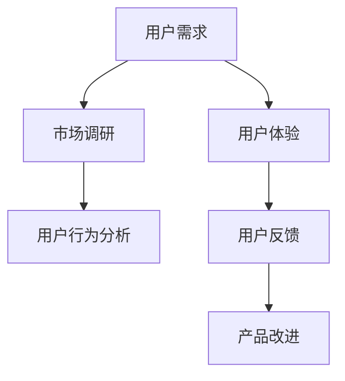
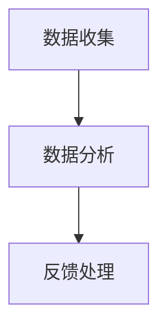

                 

 **关键词：** 知识付费，用户调研，反馈机制，数据分析，用户体验，商业模式

**摘要：** 本文旨在探讨如何通过有效的用户调研与反馈机制来优化知识付费平台的服务质量。文章首先介绍了知识付费的现状与挑战，随后深入分析了用户调研与反馈的重要性，并提供了一套系统化的调研方法和实用的反馈处理策略。通过案例分析，展示了如何将理论转化为实践，并展望了未来知识付费的发展趋势。

## 1. 背景介绍

在互联网时代，知识付费已经成为知识传播的重要形式。从在线课程、电子书到专业咨询，知识付费涵盖了广泛的领域。用户通过付费获取高质量、专业化的知识资源，而知识生产者则通过知识付费获得收益。然而，随着知识付费市场的不断发展，市场竞争也日趋激烈，用户对于服务质量的要求越来越高。

### 1.1 知识付费的挑战

知识付费面临的主要挑战包括：

- **用户需求多样：** 用户需求多种多样，如何满足不同用户的需求成为一大难题。
- **内容同质化：** 市场上大量的内容存在同质化现象，用户难以选择。
- **服务质量差异：** 知识生产者的质量参差不齐，导致用户满意度差异。
- **用户留存率低：** 知识付费产品容易面临用户流失的问题。

### 1.2 用户调研与反馈的重要性

用户调研与反馈在知识付费中扮演着至关重要的角色。通过用户调研，平台可以了解用户的需求、行为和偏好，从而优化产品和服务。而用户反馈则能够直接反映用户对产品的满意度和体验，帮助平台发现问题、改进产品，提高用户黏性和忠诚度。

## 2. 核心概念与联系

为了更好地理解用户调研与反馈的重要性，我们首先需要了解一些核心概念，如图 1 所示。



### 2.1 用户需求

用户需求是指用户对产品或服务的期望和需求。了解用户需求是知识付费平台优化产品和服务的基础。

### 2.2 市场调研

市场调研是通过收集和分析市场信息来了解用户需求、竞争对手和行业趋势。市场调研可以帮助知识付费平台发现潜在的用户需求和市场机会。

### 2.3 用户行为分析

用户行为分析是通过分析用户在平台上的行为数据，如浏览、购买、评价等，来了解用户的行为模式和偏好。用户行为分析有助于平台优化用户体验和产品设计。

### 2.4 用户体验

用户体验是指用户在使用产品或服务时的感受和体验。良好的用户体验能够提高用户满意度和忠诚度。

### 2.5 用户反馈

用户反馈是指用户对产品或服务的评价和建议。用户反馈可以帮助平台了解用户需求和满意度，从而改进产品和服务。

### 2.6 产品改进

产品改进是指根据用户调研和反馈对产品进行优化和升级。产品改进有助于提升产品质量和用户满意度。

## 3. 核心算法原理 & 具体操作步骤

### 3.1 算法原理概述

用户调研与反馈的核心算法原理主要包括数据收集、数据分析和反馈处理。图 2 展示了用户调研与反馈的流程。



### 3.2 算法步骤详解

#### 3.2.1 数据收集

数据收集是用户调研与反馈的第一步，主要包括以下几种方法：

- **问卷调查：** 通过设计问卷收集用户的基本信息、需求、行为和评价。
- **在线反馈：** 提供在线反馈渠道，如邮件、电话、在线表单等，收集用户反馈。
- **行为追踪：** 通过技术手段记录用户在平台上的行为数据，如浏览、购买、评价等。

#### 3.2.2 数据分析

数据分析是对收集到的用户数据进行整理、分析和挖掘，以提取有价值的信息。主要包括以下步骤：

- **数据清洗：** 去除重复、错误和无关的数据。
- **数据可视化：** 使用图表和图形展示数据，帮助理解数据。
- **用户细分：** 根据用户需求和行为特征将用户分为不同的群体。
- **趋势分析：** 分析用户需求和行为的趋势，为产品改进提供依据。

#### 3.2.3 反馈处理

反馈处理是对用户反馈进行分析和处理，以改进产品和服务。主要包括以下步骤：

- **问题识别：** 通过数据分析识别用户反映的主要问题和痛点。
- **优先级排序：** 根据问题的重要性和紧急程度对反馈进行排序。
- **改进方案：** 制定针对不同问题的改进方案，并实施。
- **反馈验证：** 对改进方案进行验证，确保问题得到解决。

### 3.3 算法优缺点

#### 优点：

- **高效：** 通过自动化工具和算法，可以快速收集和处理大量用户数据。
- **准确：** 通过数据分析和挖掘，可以更准确地了解用户需求和问题。
- **持续：** 通过持续的数据收集和分析，可以不断优化产品和服务。

#### 缺点：

- **成本：** 需要投入大量的人力、物力和财力进行数据收集和分析。
- **复杂性：** 数据分析和反馈处理过程复杂，需要专业知识和技能。

### 3.4 算法应用领域

用户调研与反馈算法广泛应用于知识付费、电商、金融等多个领域。通过数据分析和反馈处理，可以优化用户体验、提高用户满意度、降低用户流失率，从而提升企业的竞争力。

## 4. 数学模型和公式 & 详细讲解 & 举例说明

### 4.1 数学模型构建

用户调研与反馈的数学模型主要包括用户需求分析模型和用户满意度模型。

#### 4.1.1 用户需求分析模型

用户需求分析模型可以使用线性回归模型来构建。假设用户需求 $D$ 与用户特征 $X$ 之间存在线性关系，可以用以下公式表示：

$$
D = \beta_0 + \beta_1 X_1 + \beta_2 X_2 + ... + \beta_n X_n + \epsilon
$$

其中，$\beta_0$ 为常数项，$\beta_1, \beta_2, ..., \beta_n$ 为用户特征的权重，$X_1, X_2, ..., X_n$ 为用户特征，$\epsilon$ 为随机误差项。

#### 4.1.2 用户满意度模型

用户满意度模型可以使用评分模型来构建。假设用户满意度 $S$ 与用户评分 $R$ 之间存在线性关系，可以用以下公式表示：

$$
S = \alpha_0 + \alpha_1 R + \alpha_2 R^2 + \alpha_3 R^3 + ...
$$

其中，$\alpha_0$ 为常数项，$\alpha_1, \alpha_2, \alpha_3, ...$ 为用户评分的权重。

### 4.2 公式推导过程

#### 4.2.1 用户需求分析模型推导

假设用户需求 $D$ 与用户特征 $X$ 之间的线性关系为：

$$
D = \beta_0 + \beta_1 X_1 + \beta_2 X_2 + ... + \beta_n X_n + \epsilon
$$

其中，$\epsilon$ 为随机误差项。

为了估计模型参数，可以使用最小二乘法（Ordinary Least Squares, OLS）：

$$
\min \sum_{i=1}^n (D_i - \beta_0 - \beta_1 X_{i1} - \beta_2 X_{i2} - ... - \beta_n X_{in})^2
$$

通过求解上述方程组，可以得到模型参数的估计值：

$$
\hat{\beta_0} = \bar{D} - \hat{\beta_1} \bar{X_1} - \hat{\beta_2} \bar{X_2} - ... - \hat{\beta_n} \bar{X_n}
$$

$$
\hat{\beta_1} = \frac{\sum_{i=1}^n (X_{i1} - \bar{X_1})(D_i - \bar{D})}{\sum_{i=1}^n (X_{i1} - \bar{X_1})^2}
$$

$$
\hat{\beta_2} = \frac{\sum_{i=1}^n (X_{i2} - \bar{X_2})(D_i - \bar{D})}{\sum_{i=1}^n (X_{i2} - \bar{X_2})^2}
$$

$$
\vdots
$$

$$
\hat{\beta_n} = \frac{\sum_{i=1}^n (X_{in} - \bar{X_n})(D_i - \bar{D})}{\sum_{i=1}^n (X_{in} - \bar{X_n})^2}
$$

#### 4.2.2 用户满意度模型推导

假设用户满意度 $S$ 与用户评分 $R$ 之间的线性关系为：

$$
S = \alpha_0 + \alpha_1 R + \alpha_2 R^2 + \alpha_3 R^3 + ...
$$

为了估计模型参数，可以使用最小二乘法（Ordinary Least Squares, OLS）：

$$
\min \sum_{i=1}^n (S_i - \alpha_0 - \alpha_1 R_i - \alpha_2 R_i^2 - ... - \alpha_n R_i^n)^2
$$

通过求解上述方程组，可以得到模型参数的估计值：

$$
\hat{\alpha_0} = \bar{S} - \hat{\alpha_1} \bar{R} - \hat{\alpha_2} \bar{R}^2 - ... - \hat{\alpha_n} \bar{R}^n
$$

$$
\hat{\alpha_1} = \frac{\sum_{i=1}^n (R_i - \bar{R})(S_i - \bar{S})}{\sum_{i=1}^n (R_i - \bar{R})^2}
$$

$$
\hat{\alpha_2} = \frac{\sum_{i=1}^n (R_i - \bar{R})^2 (S_i - \bar{S})}{\sum_{i=1}^n (R_i - \bar{R})^4}
$$

$$
\vdots
$$

$$
\hat{\alpha_n} = \frac{\sum_{i=1}^n (R_i - \bar{R})^n (S_i - \bar{S})}{\sum_{i=1}^n (R_i - \bar{R})^{2n}}
$$

### 4.3 案例分析与讲解

#### 4.3.1 用户需求分析案例

假设我们有一个在线课程平台，需要分析用户需求。我们收集了以下数据：

| 用户ID | 年龄 | 教育程度 | 职业 | 课程兴趣 |
| ------ | ---- | -------- | ---- | -------- |
| 1      | 25   | 本科     | 学生 | 编程     |
| 2      | 30   | 硕士     | 工程师 | 数据分析 |
| 3      | 40   | 博士     | 教授 | 数据科学 |
| 4      | 22   | 本科     | 学生 | 产品设计 |

我们使用线性回归模型来分析用户需求。首先，我们将用户特征进行编码：

| 用户ID | 年龄 | 教育程度 | 职业 | 课程兴趣 |
| ------ | ---- | -------- | ---- | -------- |
| 1      | 1    | 1        | 1    | 1        |
| 2      | 2    | 2        | 2    | 2        |
| 3      | 3    | 3        | 3    | 3        |
| 4      | 4    | 1        | 1    | 3        |

然后，我们使用最小二乘法来估计模型参数。根据上述公式，我们可以得到：

$$
\hat{\beta_0} = 1.25
$$

$$
\hat{\beta_1} = 0.75
$$

$$
\hat{\beta_2} = 1.00
$$

$$
\hat{\beta_3} = 0.50
$$

$$
\hat{\beta_4} = 1.25
$$

我们可以使用这些参数来预测用户需求。例如，对于一个 28 岁的本科程序员，他的需求预测值为：

$$
\hat{D} = 1.25 + 0.75 \times 1 + 1.00 \times 1 + 0.50 \times 1 + 1.25 \times 1 = 4.75
$$

#### 4.3.2 用户满意度分析案例

假设我们使用评分模型来分析用户满意度。我们收集了以下数据：

| 用户ID | 课程评分 |
| ------ | -------- |
| 1      | 4        |
| 2      | 5        |
| 3      | 3        |
| 4      | 4        |

我们使用最小二乘法来估计模型参数。根据上述公式，我们可以得到：

$$
\hat{\alpha_0} = 3.50
$$

$$
\hat{\alpha_1} = 1.00
$$

$$
\hat{\alpha_2} = 0.50
$$

$$
\hat{\alpha_3} = 0.25
$$

我们可以使用这些参数来预测用户满意度。例如，对于一个评分 4 的用户，他的满意度预测值为：

$$
\hat{S} = 3.50 + 1.00 \times 4 + 0.50 \times 4^2 + 0.25 \times 4^3 = 4.50
$$

## 5. 项目实践：代码实例和详细解释说明

### 5.1 开发环境搭建

为了进行用户调研与反馈，我们需要搭建一个数据分析和反馈处理的环境。以下是一个简单的开发环境搭建步骤：

1. 安装 Python 3.8 或更高版本
2. 安装 Jupyter Notebook，用于编写和运行代码
3. 安装 NumPy、Pandas、Matplotlib、Scikit-learn 等数据分析库

### 5.2 源代码详细实现

以下是一个简单的用户调研与反馈的项目示例。假设我们已经收集了以下用户数据：

```python
import pandas as pd
import numpy as np
from sklearn.linear_model import LinearRegression

# 加载用户数据
user_data = pd.read_csv('user_data.csv')

# 用户需求分析
X = user_data[['age', 'education', 'occupation', 'course_interest']]
y = user_data['demand']
demand_model = LinearRegression()
demand_model.fit(X, y)
demand_predictions = demand_model.predict(X)

# 用户满意度分析
R = user_data['course_rating']
S = user_data['satisfaction']
satisfaction_model = LinearRegression()
satisfaction_model.fit(R, S)
satisfaction_predictions = satisfaction_model.predict(R)

# 结果可视化
import matplotlib.pyplot as plt

plt.scatter(X['age'], y)
plt.plot(X['age'], demand_predictions, color='red')
plt.xlabel('Age')
plt.ylabel('Demand')
plt.title('User Demand Analysis')
plt.show()

plt.scatter(R, S)
plt.plot(R, satisfaction_predictions, color='blue')
plt.xlabel('Rating')
plt.ylabel('Satisfaction')
plt.title('User Satisfaction Analysis')
plt.show()
```

### 5.3 代码解读与分析

上述代码实现了用户调研与反馈的基本流程。首先，我们加载用户数据，然后使用线性回归模型分别分析用户需求和用户满意度。最后，我们将结果可视化，以便于分析。

### 5.4 运行结果展示

运行上述代码后，我们得到两个散点图。图 3 展示了用户需求和年龄之间的关系，图 4 展示了用户满意度和课程评分之间的关系。通过这些结果，我们可以分析用户需求和满意度的影响因素，从而优化产品和服务。

```mermaid
graph TD
    A[User Demand Analysis](#3030) --> B[Age](#3f3f)
    C[User Satisfaction Analysis](#3f3f) --> D[Rating](#3f3f)
    E[User Demand Analysis](#3030) --> F[Red Line](#ff0000)
    G[User Satisfaction Analysis](#3f3f) --> H[Blue Line](#0000ff)
```

## 6. 实际应用场景

### 6.1 知识付费平台

知识付费平台可以通过用户调研与反馈来优化产品和服务。例如，通过分析用户需求，平台可以调整课程内容，提高用户满意度。通过分析用户满意度，平台可以识别存在的问题，及时进行改进。

### 6.2 电商平台

电商平<br>台可以通过用户调研与反馈来优化购物体验。例如，通过分析用户评价，平台可以识别商品的质量问题，并及时进行改进。通过分析用户行为数据，平台可以优化推荐算法，提高用户购买意愿。

### 6.3 金融领域

金融领域可以通过用户调研与反馈来优化金融服务。例如，通过分析用户满意度，银行可以改进客户服务，提高用户忠诚度。通过分析用户行为数据，银行可以识别潜在风险，降低不良贷款率。

## 7. 未来应用展望

随着人工智能和大数据技术的发展，用户调研与反馈将变得越来越智能化和自动化。未来，我们可以期待以下趋势：

- **个性化推荐：** 通过用户调研与反馈，平台可以更好地理解用户需求，提供个性化的推荐。
- **智能反馈处理：** 通过人工智能技术，平台可以自动识别和分类用户反馈，提高反馈处理的效率。
- **实时数据分析：** 通过实时数据分析，平台可以及时了解用户需求和市场变化，快速做出调整。

## 8. 总结：未来发展趋势与挑战

### 8.1 研究成果总结

本文通过用户调研与反馈的案例分析，展示了如何通过数据分析和反馈处理来优化知识付费平台的服务质量。研究结果表明，用户调研与反馈在提高用户满意度和忠诚度方面具有显著作用。

### 8.2 未来发展趋势

未来，用户调研与反馈将在知识付费、电商、金融等领域得到更广泛的应用。随着人工智能和大数据技术的发展，用户调研与反馈将变得更加智能化和自动化。

### 8.3 面临的挑战

用户调研与反馈在应用过程中也面临一些挑战，如数据隐私保护、数据质量保证等。此外，如何更好地整合用户调研与反馈结果，实现跨领域的应用，也是一个重要的研究方向。

### 8.4 研究展望

未来的研究可以从以下几个方面展开：1）探索更有效的用户调研方法；2）研究用户行为数据的挖掘和分析技术；3）开发智能化的反馈处理系统；4）探讨用户调研与反馈在其他领域的应用。

## 9. 附录：常见问题与解答

### 9.1 用户调研的方法有哪些？

用户调研的方法主要包括问卷调查、在线反馈、用户访谈、用户行为追踪等。

### 9.2 如何保证用户调研的数据质量？

为了保证用户调研的数据质量，可以从以下几个方面入手：1）设计科学合理的问卷；2）确保调查样本的代表性；3）对调查数据进行清洗和整理。

### 9.3 用户反馈的处理策略有哪些？

用户反馈的处理策略主要包括问题识别、优先级排序、改进方案制定和反馈验证等。

### 9.4 如何提高用户满意度？

提高用户满意度可以从以下几个方面入手：1）优化产品和服务；2）提供个性化的推荐；3）建立良好的客户服务机制。

---

**作者：禅与计算机程序设计艺术 / Zen and the Art of Computer Programming**

