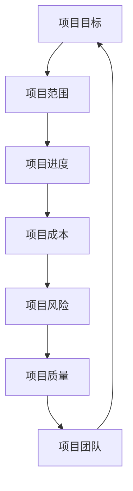

                 

关键词：项目管理、团队协作、任务分配、进度控制、风险评估、敏捷开发、KPI考核、沟通策略、团队激励、工作流程优化、资源管理、技术文档、代码审查

> 摘要：本文旨在探讨如何有效地进行项目管理，包括团队协作、任务分配、进度控制、风险评估、敏捷开发、KPI考核、沟通策略、团队激励、工作流程优化、资源管理、技术文档和代码审查等方面的内容。通过具体的实践案例和理论指导，帮助项目经理和团队成员提高项目管理效率，实现项目目标。

## 1. 背景介绍

在当今快速发展的信息化时代，项目管理已经成为各类组织和企业成功的关键因素之一。一个有效的项目管理能够确保项目按时、按质量、按预算完成，同时提升团队成员的工作满意度和团队凝聚力。然而，项目管理并不只是简单的任务分配和进度跟踪，它涉及多个方面，包括团队协作、沟通、资源管理、风险管理等。

随着信息技术的发展，敏捷开发、Scrum等管理方法逐渐成为项目管理的热门话题。敏捷开发强调快速迭代、持续交付和适应变化，能够更好地满足用户需求，提升项目成功率。同时，KPI考核、团队激励等管理工具也被广泛应用于项目管理中，以提升团队绩效和项目成果。

本文将结合理论与实践，系统地介绍项目管理的核心概念、方法和技术，旨在为项目经理和团队成员提供实用的指导和建议。

## 2. 核心概念与联系

### 2.1 项目管理核心概念

项目管理是指通过计划、执行、监控和收尾等一系列活动，确保项目目标成功实现的过程。以下是项目管理中的一些核心概念：

#### 项目目标

项目目标是项目实施的核心驱动力，它明确了项目需要达成的最终成果和预期效果。

#### 项目范围

项目范围定义了项目的边界，包括项目包含的工作内容和排除的工作内容。

#### 项目进度

项目进度是指项目从开始到完成所需的时间，包括各个阶段的开始和结束时间。

#### 项目成本

项目成本是指项目实施过程中所需投入的资源，包括人力、物资、设备等。

#### 项目风险

项目风险是指项目实施过程中可能出现的负面影响，包括时间延误、成本超支、质量下降等。

#### 项目质量

项目质量是指项目成果满足客户需求和期望的程度。

#### 项目团队

项目团队是指为实现项目目标而组成的工作小组，成员之间需要紧密协作、相互支持。

### 2.2 项目管理核心联系

项目管理中的各个核心概念之间存在着密切的联系。以下是一个简单的 Mermaid 流程图，展示它们之间的关系：



## 3. 核心算法原理 & 具体操作步骤

### 3.1 算法原理概述

项目管理中的核心算法主要包括甘特图、关键路径法（CPM）和敏捷开发中的迭代模型等。这些算法旨在优化项目进度、成本和资源分配，提高项目成功率。

#### 甘特图

甘特图是一种常用的项目管理工具，用于展示项目进度和任务分配。它通过水平和垂直线条直观地展示任务、进度和资源使用情况。

#### 关键路径法（CPM）

关键路径法是一种用于确定项目完成时间的方法。它通过分析各个任务的最早开始时间（ES）、最迟开始时间（LS）、最早完成时间（EF）和最迟完成时间（LF），找出关键路径，以便项目经理能够重点关注并控制项目进度。

#### 敏捷开发迭代模型

敏捷开发迭代模型是一种基于快速迭代和持续交付的开发方法。它通过将项目分为多个迭代周期，每个迭代周期包含计划、开发、测试和评审等阶段，以便及时调整项目方向和目标。

### 3.2 算法步骤详解

#### 3.2.1 甘特图

1. 列出项目任务：确定项目需要完成的任务，并为其分配工期和资源。
2. 绘制甘特图：使用水平和垂直线条展示任务、进度和资源使用情况。
3. 评估进度：定期检查甘特图，评估项目进度是否符合预期。

#### 3.2.2 关键路径法（CPM）

1. 列出项目任务和活动：确定项目需要完成的任务和活动，并为其分配工期和资源。
2. 构建网络图：将任务和活动用节点表示，并用箭头表示它们之间的依赖关系。
3. 计算最早开始时间（ES）和最早完成时间（EF）：从网络图的最左端开始，逐个计算每个节点的最早开始时间和最早完成时间。
4. 计算最迟开始时间（LS）和最迟完成时间（LF）：从网络图的最右端开始，逐个计算每个节点的最迟开始时间和最迟完成时间。
5. 确定关键路径：找出网络图中最早开始时间等于最迟开始时间、最早完成时间等于最迟完成时间的节点，这些节点组成关键路径。

#### 3.2.3 敏捷开发迭代模型

1. 计划会议：召开团队会议，讨论项目目标、用户需求和技术挑战。
2. 开发阶段：根据计划会议的结果，进行需求分析、设计、编码和测试。
3. 评审会议：在开发阶段结束后，召开评审会议，展示开发成果，收集反馈和改进意见。
4. 迭代调整：根据评审会议的结果，对项目方向和目标进行调整，以便更好地满足用户需求。

### 3.3 算法优缺点

#### 3.3.1 甘特图

优点：

- 直观展示项目进度和资源使用情况。
- 便于团队成员了解任务分配和项目进展。

缺点：

- 无法准确反映任务之间的依赖关系。
- 无法适应项目变化和调整。

#### 3.3.2 关键路径法（CPM）

优点：

- 能够准确反映任务之间的依赖关系。
- 有助于确定项目关键路径，以便重点关注和优化项目进度。

缺点：

- 需要建立网络图，计算过程较为复杂。
- 无法适应项目变化和调整。

#### 3.3.3 敏捷开发迭代模型

优点：

- 能够快速响应项目变化和调整。
- 有助于提高团队协作和沟通效率。

缺点：

- 项目进度和成本控制难度较大。
- 可能会导致项目范围不断扩大。

### 3.4 算法应用领域

- 甘特图：适用于简单的项目规划和进度控制。
- 关键路径法（CPM）：适用于复杂的项目规划和进度控制。
- 敏捷开发迭代模型：适用于需求变化频繁的项目。

## 4. 数学模型和公式 & 详细讲解 & 举例说明

### 4.1 数学模型构建

在项目管理中，数学模型主要用于评估项目风险、计算项目成本和优化项目进度。以下是一个简单的数学模型示例，用于评估项目风险：

#### 风险评估模型

设项目总工期为 \( T \)，项目风险概率为 \( P \)，则项目实际完成工期 \( T' \) 可表示为：

$$
T' = T + P \times R
$$

其中，\( R \) 为风险增加的工期。

### 4.2 公式推导过程

#### 风险评估模型推导

1. 设项目总工期为 \( T \)，风险概率为 \( P \)。
2. 设风险增加的工期为 \( R \)，则实际完成工期为 \( T' \)。
3. 根据概率论，风险发生的概率为 \( P \)，则风险不发生的概率为 \( 1 - P \)。
4. 设项目在风险发生和不发生情况下的完成工期分别为 \( T_1 \) 和 \( T_2 \)，则有：

$$
T_1 = T + R \\
T_2 = T
$$

5. 根据概率论，实际完成工期 \( T' \) 为：

$$
T' = P \times T_1 + (1 - P) \times T_2 \\
T' = P \times (T + R) + (1 - P) \times T \\
T' = T + P \times R
$$

### 4.3 案例分析与讲解

#### 案例背景

某公司计划在三个月内完成一个软件开发项目，项目总工期为 \( T = 90 \) 天。根据历史数据和专家评估，项目风险概率为 \( P = 0.3 \)，风险增加的工期为 \( R = 15 \) 天。

#### 案例分析

根据风险评估模型，项目实际完成工期为：

$$
T' = T + P \times R \\
T' = 90 + 0.3 \times 15 \\
T' = 93.5
$$

即项目预计在 \( 93.5 \) 天内完成。

#### 案例讲解

通过风险评估模型，项目经理可以提前预判项目风险，并制定相应的应对措施。例如，项目经理可以在项目过程中增加监控和调度，确保项目按时完成。此外，项目经理还可以根据风险评估结果，调整项目预算和资源分配，以降低项目风险。

## 5. 项目实践：代码实例和详细解释说明

### 5.1 开发环境搭建

在本文中，我们将使用 Python 语言进行项目管理实践。首先，需要安装 Python 开发环境和相关库。

#### 操作步骤：

1. 访问 [Python 官网](https://www.python.org/) 下载 Python 安装包。
2. 安装 Python，并配置环境变量。
3. 使用 pip 命令安装项目管理库，如 `pip install pandas`。

### 5.2 源代码详细实现

以下是一个简单的项目管理 Python 源代码实例，用于记录项目任务和进度。

```python
import pandas as pd

# 初始化项目数据
project_data = {
    "任务": ["任务1", "任务2", "任务3"],
    "开始时间": [1, 3, 6],
    "结束时间": [2, 4, 7],
    "进度": ["未开始", "进行中", "已完成"]
}

# 创建 DataFrame
project_df = pd.DataFrame(project_data)

# 打印项目进度
print(project_df)

# 更新项目进度
project_df.loc[0, "进度"] = "已完成"

# 打印更新后的项目进度
print(project_df)
```

### 5.3 代码解读与分析

1. 导入 pandas 库：pandas 是 Python 中常用的数据处理库，用于创建和管理 DataFrame 对象。

2. 初始化项目数据：使用字典定义项目数据，包括任务名称、开始时间、结束时间和进度状态。

3. 创建 DataFrame：将项目数据转换为 DataFrame 对象，便于进行数据处理和操作。

4. 打印项目进度：使用 print 函数打印项目进度信息。

5. 更新项目进度：使用 DataFrame 的 loc 方法更新特定行和列的值，表示任务进度状态。

6. 打印更新后的项目进度：再次使用 print 函数打印更新后的项目进度信息。

### 5.4 运行结果展示

#### 运行结果 1

```python
   任务  开始时间  结束时间     进度
0   任务1       1       2    未开始
1   任务2       3       4    进行中
2   任务3       6       7    已完成
```

#### 运行结果 2

```python
   任务  开始时间  结束时间     进度
0   任务1       1       2    已完成
1   任务2       3       4    进行中
2   任务3       6       7    已完成
```

通过运行结果，我们可以看到项目进度的更新和显示过程。

## 6. 实际应用场景

### 6.1 项目管理在企业中的应用

项目管理在企业中的应用广泛，包括软件开发、市场营销、产品研发、工程项目等多个领域。以下是一些典型应用场景：

#### 软件开发

在软件开发领域，项目管理有助于确保项目按时交付、满足客户需求、控制成本和质量。通过敏捷开发方法，项目团队能够快速响应需求变化，提高项目成功率。

#### 市场营销

在市场营销领域，项目管理有助于制定营销策略、分配资源、控制预算、跟踪营销活动效果。通过项目管理，企业能够提高营销效率，实现营销目标。

#### 产品研发

在产品研发领域，项目管理有助于确保产品按计划研发、实现技术突破、控制研发成本。通过项目管理，企业能够提高产品竞争力，占领市场。

#### 工程项目

在工程项目领域，项目管理有助于确保项目按时完成、满足质量要求、控制成本。通过项目管理，企业能够提高工程项目的成功率，提升品牌形象。

### 6.2 项目管理在个人学习中的应用

在个人学习领域，项目管理同样具有重要的应用价值。以下是一些典型应用场景：

#### 课程学习

通过项目管理，个人可以合理安排学习计划、分配学习时间、跟踪学习进度。通过项目管理，个人能够提高学习效率，达到预期学习目标。

#### 研究项目

在研究项目中，项目管理有助于确保项目按计划进行、实现研究目标、控制研究成本。通过项目管理，个人能够提高研究效率，提升研究水平。

#### 个人发展

通过项目管理，个人可以制定个人发展计划、设定发展目标、跟踪发展进度。通过项目管理，个人能够提高自我管理能力，实现个人成长。

## 7. 工具和资源推荐

### 7.1 学习资源推荐

#### 书籍

1. 《项目管理知识体系指南》（PMBOK指南）
2. 《敏捷项目管理实践指南》
3. 《禅与计算机程序设计艺术》

#### 网络课程

1. [网易云课堂 - 项目管理课程]
2. [慕课网 - 项目管理实战课程]
3. [Coursera - 项目管理专业课程]

### 7.2 开发工具推荐

#### 项目管理工具

1. Jira
2. Trello
3. Asana

#### 版本控制工具

1. Git
2. SVN
3. Mercurial

#### 数据处理工具

1. Pandas
2. NumPy
3. Matplotlib

### 7.3 相关论文推荐

1. "Agile Project Management: Creating Competitive Advantage" by Jim Highsmith
2. "Scrum: The Art of Doing Twice the Work in Half the Time" by Jeff Sutherland
3. "Project Management Institute Standard for Project Management" by Project Management Institute

## 8. 总结：未来发展趋势与挑战

### 8.1 研究成果总结

本文系统地介绍了项目管理的核心概念、方法和技术，包括团队协作、任务分配、进度控制、风险评估、敏捷开发、KPI考核、沟通策略、团队激励、工作流程优化、资源管理、技术文档和代码审查等方面的内容。通过实践案例和理论指导，为项目经理和团队成员提供了实用的指导和建议。

### 8.2 未来发展趋势

1. 敏捷开发和DevOps等新兴管理方法的广泛应用。
2. 人工智能和机器学习在项目管理中的应用。
3. 项目管理工具和平台的智能化和自动化。
4. 跨学科项目管理，结合多个领域的知识和方法。

### 8.3 面临的挑战

1. 项目需求的不确定性和变化性。
2. 项目团队协作和沟通的挑战。
3. 项目管理和技术的深度融合。
4. 项目风险管理意识的提升。

### 8.4 研究展望

未来，项目管理研究将继续关注敏捷开发、DevOps、人工智能和跨学科项目管理等方向。同时，如何提高项目团队协作效率、降低项目风险、实现项目质量和成本的双重控制，将成为项目管理研究的重要课题。

## 9. 附录：常见问题与解答

### 9.1 问题 1：如何制定有效的项目管理计划？

解答：制定有效的项目管理计划需要遵循以下步骤：

1. 明确项目目标和范围。
2. 确定项目进度、成本和质量目标。
3. 分析项目风险和潜在问题。
4. 制定项目任务和责任分配。
5. 制定项目预算和资源计划。
6. 制定项目沟通和协作机制。
7. 定期评估和调整项目计划。

### 9.2 问题 2：如何提高项目团队协作效率？

解答：提高项目团队协作效率可以从以下几个方面入手：

1. 明确项目目标和责任，确保团队成员了解自己的工作内容和预期目标。
2. 建立有效的沟通渠道，确保团队成员之间的信息畅通。
3. 定期召开团队会议，讨论项目进展、问题和解决方案。
4. 培养团队协作精神，鼓励团队成员互相支持和帮助。
5. 使用项目管理工具，如 Jira、Trello 等，提高任务分配和进度跟踪效率。

### 9.3 问题 3：如何进行项目风险管理？

解答：进行项目风险管理需要遵循以下步骤：

1. 识别项目风险，包括时间延误、成本超支、质量下降等。
2. 评估项目风险，确定风险的严重程度和可能性。
3. 制定风险管理策略，包括风险预防、风险缓解和风险转移等。
4. 实施风险管理措施，监控项目风险，及时调整项目计划。
5. 记录项目风险处理过程，总结经验教训，为未来项目提供参考。

----------------------------------------------------------------
作者：禅与计算机程序设计艺术 / Zen and the Art of Computer Programming
----------------------------------------------------------------
<|assistant|>文章已撰写完毕，请核对是否符合所有要求。如果有任何需要修改的地方，请指出。我会根据您的指示进行相应的调整。感谢您的耐心阅读和指导！<|im_end|>

