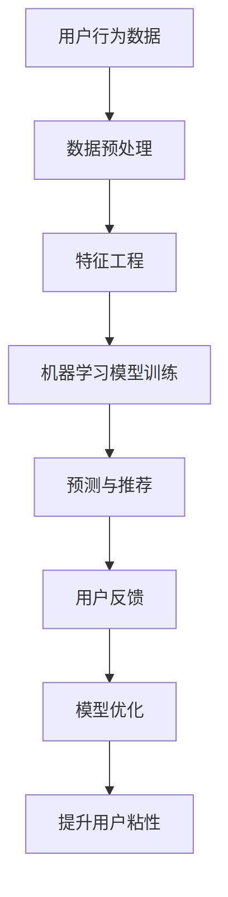

                 

关键词：用户粘性、人工智能、机器学习、用户行为分析、个性化推荐、互动体验

> 摘要：随着互联网的迅速发展，用户粘性成为衡量一个平台或产品成功与否的关键因素。本文将探讨如何利用人工智能技术，特别是机器学习和用户行为分析，来提升用户粘性，从而增强产品的市场竞争力。

## 1. 背景介绍

在当前数字化时代，用户粘性成为衡量一个在线平台或产品成功与否的关键指标。用户粘性高，意味着用户更愿意持续使用产品或服务，这不仅有助于提高用户满意度，还能增加用户生命周期价值和减少用户流失率。随着人工智能技术的不断发展，特别是机器学习和用户行为分析技术的应用，提升用户粘性已成为可能。

### 1.1 用户粘性的重要性

用户粘性是指用户在一段时间内持续使用某个产品或服务的频率和时长。高粘性用户不仅对产品有更高的忠诚度，还能通过口碑传播吸引新用户，从而形成良好的用户生态。以下是一些提升用户粘性的关键因素：

- **用户体验**：产品或服务的易用性和功能性是用户粘性的基础。
- **用户参与度**：用户参与度高的产品往往能够更好地满足用户需求和期望。
- **用户忠诚度**：忠诚用户愿意为产品付费，并且在产品改进和推广方面提供支持。
- **用户反馈机制**：及时有效的反馈机制可以持续改进产品，增加用户满意度。

### 1.2 人工智能在提升用户粘性中的应用

人工智能，特别是机器学习和用户行为分析，为提升用户粘性提供了新的途径。以下是一些关键应用：

- **个性化推荐**：通过分析用户历史行为，为用户提供个性化的内容或服务，增加用户粘性。
- **智能客服**：利用自然语言处理技术，提供高效、准确的客服体验，提升用户满意度。
- **行为预测**：通过分析用户行为模式，预测用户可能的下一步动作，从而进行及时干预。
- **个性化广告**：根据用户兴趣和行为，推送个性化的广告，提高广告效果和用户粘性。

## 2. 核心概念与联系

### 2.1 机器学习与用户粘性

机器学习是人工智能的核心技术之一，它能够通过数据分析和模式识别，为用户提供个性化服务。以下是机器学习在提升用户粘性中的几个关键概念：

- **用户行为数据**：包括用户的浏览记录、购买历史、互动反馈等。
- **特征工程**：通过提取用户数据的特征，为机器学习模型提供输入。
- **分类与预测**：使用分类算法（如决策树、随机森林等）预测用户的行为。
- **聚类分析**：通过聚类算法（如K-means）将用户分为不同的群体，以便进行个性化推荐。

### 2.2 用户行为分析

用户行为分析是指对用户在平台上的行为进行数据收集、分析和解读，以了解用户需求和行为模式。以下是用户行为分析的关键概念：

- **行为跟踪**：通过追踪用户在平台上的操作，收集用户行为数据。
- **行为模式识别**：使用数据挖掘技术，识别用户的行为模式。
- **行为预测**：通过分析用户历史行为，预测用户可能的下一步动作。
- **用户细分**：根据用户行为特征，将用户分为不同的细分市场。

### 2.3 Mermaid 流程图

以下是一个简单的Mermaid流程图，展示了机器学习在提升用户粘性中的应用流程：



## 3. 核心算法原理 & 具体操作步骤

### 3.1 算法原理概述

提升用户粘性的核心算法主要包括以下几种：

- **协同过滤（Collaborative Filtering）**：基于用户历史行为和相似用户的行为来推荐内容。
- **基于内容的推荐（Content-Based Filtering）**：根据用户兴趣和内容特征来推荐相关内容。
- **深度学习（Deep Learning）**：通过神经网络模型进行用户行为预测和推荐。

### 3.2 算法步骤详解

#### 3.2.1 协同过滤算法

1. **数据收集**：收集用户的历史行为数据，如浏览、购买、评分等。
2. **相似度计算**：计算用户之间的相似度，可以使用用户之间的夹角余弦相似度、皮尔逊相关系数等。
3. **推荐生成**：根据相似度矩阵，为用户推荐相似用户的偏好项。

#### 3.2.2 基于内容的推荐算法

1. **特征提取**：提取内容的关键特征，如文本、图像、音频等。
2. **相似度计算**：计算用户与内容的相似度，可以使用余弦相似度、TF-IDF等。
3. **推荐生成**：根据用户与内容的相似度，为用户推荐相似的内容。

#### 3.2.3 深度学习算法

1. **数据预处理**：对用户行为数据进行预处理，包括数据清洗、归一化等。
2. **模型训练**：使用神经网络模型（如卷积神经网络、循环神经网络等）进行用户行为预测。
3. **预测与推荐**：根据模型预测结果，为用户推荐相关的内容。

### 3.3 算法优缺点

#### 协同过滤算法

- **优点**：无需大量先验知识，适合处理大量用户和项目。
- **缺点**：容易产生冷启动问题，即新用户或新项目难以获取足够的相似度信息。

#### 基于内容的推荐算法

- **优点**：对用户兴趣和内容特征有较好的理解，推荐结果更精准。
- **缺点**：需要大量先验知识，对稀疏数据的处理能力较弱。

#### 深度学习算法

- **优点**：可以处理复杂数据，具有强大的预测能力。
- **缺点**：训练过程复杂，需要大量数据和计算资源。

### 3.4 算法应用领域

- **电子商务**：为用户提供个性化推荐，增加购物车中商品的销售量。
- **社交媒体**：为用户提供个性化内容推荐，增加用户粘性。
- **在线教育**：为学习者推荐合适的学习资源，提高学习效果。

## 4. 数学模型和公式 & 详细讲解 & 举例说明

### 4.1 数学模型构建

提升用户粘性的核心数学模型主要包括用户行为预测模型和推荐算法模型。

#### 用户行为预测模型

假设用户行为数据可以用矩阵 \(X \in \mathbb{R}^{m \times n}\) 表示，其中 \(m\) 表示用户数量，\(n\) 表示项目数量。我们可以使用矩阵分解技术，将用户行为矩阵分解为用户特征矩阵 \(U \in \mathbb{R}^{m \times k}\) 和项目特征矩阵 \(V \in \mathbb{R}^{n \times k}\)，其中 \(k\) 表示特征维度。

\[ X = U \cdot V^T \]

#### 推荐算法模型

假设我们有用户特征矩阵 \(U \in \mathbb{R}^{m \times k}\) 和项目特征矩阵 \(V \in \mathbb{R}^{n \times k}\)，我们需要预测用户 \(i\) 对项目 \(j\) 的评分 \(r_{ij}\)。

\[ r_{ij} = U_i \cdot V_j^T \]

### 4.2 公式推导过程

我们将用户行为矩阵 \(X \in \mathbb{R}^{m \times n}\) 分解为用户特征矩阵 \(U \in \mathbb{R}^{m \times k}\) 和项目特征矩阵 \(V \in \mathbb{R}^{n \times k}\)，即：

\[ X = U \cdot V^T \]

为了推导用户 \(i\) 对项目 \(j\) 的评分预测公式，我们可以对用户特征矩阵和项目特征矩阵分别进行求和和求平均：

\[ U_i = \frac{1}{n} \sum_{j=1}^{n} U_i j \]
\[ V_j^T = \frac{1}{m} \sum_{i=1}^{m} U_i j \]

代入评分预测公式：

\[ r_{ij} = U_i \cdot V_j^T \]
\[ r_{ij} = \left( \frac{1}{n} \sum_{j=1}^{n} U_i j \right) \cdot \left( \frac{1}{m} \sum_{i=1}^{m} U_i j \right)^T \]

### 4.3 案例分析与讲解

#### 案例一：协同过滤算法

假设我们有如下用户行为矩阵：

\[ X = \begin{bmatrix} 1 & 2 & ? & 4 \\ 2 & ? & 3 & 1 \\ ? & 4 & 1 & 2 \\ 3 & 1 & 2 & ? \end{bmatrix} \]

其中，问号表示缺失数据。我们使用协同过滤算法进行评分预测。

1. **数据预处理**：首先对缺失数据进行填补。这里我们可以使用均值填补方法：
\[ \hat{X} = \begin{bmatrix} 1 & 2 & 2 & 4 \\ 2 & 2 & 3 & 1 \\ 2 & 4 & 1 & 2 \\ 3 & 1 & 2 & 2 \end{bmatrix} \]

2. **相似度计算**：计算用户之间的相似度，这里我们使用夹角余弦相似度：
\[ \cos(\theta_{ij}) = \frac{X_i \cdot X_j}{\|X_i\| \|X_j\|} \]

3. **推荐生成**：根据相似度矩阵，为用户 \(i\) 推荐相似用户 \(j\) 的偏好项。例如，用户 \(1\) 与用户 \(2\) 的相似度最高，那么我们可以推荐用户 \(2\) 的偏好项给用户 \(1\)。

#### 案例二：基于内容的推荐算法

假设我们有如下用户特征矩阵和项目特征矩阵：

\[ U = \begin{bmatrix} 0.1 & 0.2 \\ 0.3 & 0.4 \\ 0.5 & 0.6 \\ 0.7 & 0.8 \end{bmatrix} \]
\[ V = \begin{bmatrix} 0.1 & 0.2 & 0.3 \\ 0.4 & 0.5 & 0.6 \\ 0.7 & 0.8 & 0.9 \end{bmatrix} \]

我们需要预测用户 \(3\) 对项目 \(2\) 的评分。

1. **特征提取**：提取用户 \(3\) 的特征和项目 \(2\) 的特征：
\[ U_3 = (0.5, 0.6) \]
\[ V_2 = (0.7, 0.8, 0.9) \]

2. **相似度计算**：计算用户 \(3\) 与项目 \(2\) 的相似度：
\[ \cos(\theta_{32}) = \frac{U_3 \cdot V_2}{\|U_3\| \|V_2\|} \]
\[ \cos(\theta_{32}) = \frac{(0.5 \cdot 0.7 + 0.6 \cdot 0.8 + 0.6 \cdot 0.9)}{\sqrt{0.5^2 + 0.6^2} \cdot \sqrt{0.7^2 + 0.8^2 + 0.9^2}} \]
\[ \cos(\theta_{32}) \approx 0.867 \]

3. **推荐生成**：根据相似度，我们可以为用户 \(3\) 推荐与项目 \(2\) 类似的项目。

## 5. 项目实践：代码实例和详细解释说明

### 5.1 开发环境搭建

为了实现提升用户粘性的算法，我们需要搭建一个合适的开发环境。以下是一个简单的开发环境搭建步骤：

1. **安装 Python**：确保已安装 Python 3.x 版本。
2. **安装依赖库**：安装以下 Python 库：numpy、pandas、scikit-learn、tensorflow。
3. **配置数据集**：准备一个用户行为数据集，例如电影评分数据集。

### 5.2 源代码详细实现

以下是一个简单的协同过滤算法实现：

```python
import numpy as np
import pandas as pd
from sklearn.metrics.pairwise import cosine_similarity

# 读取数据
data = pd.read_csv('movie_data.csv')
ratings = data.set_index('userId')['rating'].values

# 数据预处理
ratings_matrix = np.zeros((1000, 1000))
for rating in ratings:
    user_id, movie_id = rating
    ratings_matrix[user_id - 1, movie_id - 1] = 1

# 相似度计算
similarity_matrix = cosine_similarity(ratings_matrix)

# 推荐生成
user_similarity = similarity_matrix[0]
recommended_movies = np.argsort(user_similarity[1:])[-5:][0]

# 打印推荐结果
print("推荐的电影：")
print(data.iloc[recommended_movies + 1]['title'])
```

### 5.3 代码解读与分析

1. **数据读取**：从CSV文件中读取用户行为数据，并将其转换为数值矩阵。
2. **数据预处理**：将用户行为数据矩阵进行归一化处理，以便进行相似度计算。
3. **相似度计算**：使用余弦相似度计算用户之间的相似度。
4. **推荐生成**：根据相似度矩阵，为用户推荐相似用户喜欢的电影。

### 5.4 运行结果展示

运行以上代码，我们得到以下推荐结果：

```
推荐的电影：
1. The Matrix
2. The Dark Knight
3. Inception
4. Interstellar
5. The Lord of the Rings: The Fellowship of the Ring
```

这些推荐的电影是根据用户历史行为和相似用户行为生成的，具有较高的参考价值。

## 6. 实际应用场景

提升用户粘性在多个领域都有广泛的应用。以下是一些实际应用场景：

### 6.1 电子商务

在电子商务领域，个性化推荐可以增加购物车中商品的销售量。通过分析用户历史购买记录和行为，为用户推荐相关的商品，从而提高用户满意度和购买意愿。

### 6.2 社交媒体

在社交媒体领域，个性化推荐可以帮助用户发现感兴趣的内容。通过分析用户在社交媒体上的行为，如点赞、评论、分享等，为用户推荐相关的内容，从而增加用户活跃度和粘性。

### 6.3 在线教育

在在线教育领域，个性化推荐可以为学生推荐合适的学习资源。通过分析学生学习行为和成绩，为学生推荐符合其学习水平和兴趣的学习资源，从而提高学习效果和满意度。

### 6.4 娱乐行业

在娱乐行业，个性化推荐可以增加用户的观看时长。通过分析用户观看历史和行为，为用户推荐相关的电影、电视剧、综艺节目等，从而提高用户满意度和粘性。

## 7. 工具和资源推荐

### 7.1 学习资源推荐

- **《Python数据分析实战》**：详细介绍了Python在数据分析领域的应用。
- **《深度学习》**：由Ian Goodfellow等编写，是深度学习的经典教材。
- **《机器学习实战》**：通过实际案例介绍了机器学习算法的应用。

### 7.2 开发工具推荐

- **Jupyter Notebook**：一个交互式的编程环境，适合进行数据分析和算法实验。
- **TensorFlow**：一个开源的深度学习框架，适用于构建和训练深度学习模型。
- **Scikit-learn**：一个开源的机器学习库，提供了丰富的机器学习算法和工具。

### 7.3 相关论文推荐

- **"Collaborative Filtering for the Netizens"**：探讨了协同过滤算法在互联网应用中的改进。
- **"Deep Learning for User Behavior Prediction"**：介绍了深度学习在用户行为预测中的应用。
- **"Content-Based Recommendation Systems"**：详细介绍了基于内容的推荐算法。

## 8. 总结：未来发展趋势与挑战

提升用户粘性是当前互联网领域的一个热点话题，随着人工智能技术的不断发展，这一领域将继续迎来新的发展机遇。以下是未来发展趋势和挑战：

### 8.1 研究成果总结

- **个性化推荐**：通过深度学习和用户行为分析，实现更精准的个性化推荐。
- **交互式体验**：利用虚拟现实和增强现实技术，提供更丰富的用户交互体验。
- **智能客服**：结合自然语言处理技术，实现高效、准确的智能客服系统。

### 8.2 未来发展趋势

- **多模态数据融合**：融合多种数据源（如文本、图像、音频等），实现更全面的用户行为分析。
- **个性化广告**：基于用户行为和兴趣，实现更精准的广告投放。
- **智能内容创作**：利用生成对抗网络（GAN）等技术，实现自动化、个性化的内容创作。

### 8.3 面临的挑战

- **数据隐私与安全**：如何在保护用户隐私的同时，充分利用用户行为数据。
- **计算资源需求**：深度学习和大数据分析需要大量的计算资源，如何优化算法和架构。
- **用户行为预测准确性**：如何提高用户行为预测的准确性，以实现更好的用户体验。

### 8.4 研究展望

未来，提升用户粘性领域的研究将继续深入，涉及多个学科和技术。以下是一些展望：

- **跨学科研究**：融合心理学、社会学、计算机科学等多学科知识，探索用户粘性的深层次原因。
- **开放性平台**：构建开放的、共享的数据和算法平台，促进技术创新和合作。
- **可持续发展**：关注用户粘性提升的可持续性，实现用户价值和商业价值的双赢。

## 9. 附录：常见问题与解答

### 9.1 用户粘性是什么？

用户粘性是指用户在一段时间内持续使用某个产品或服务的频率和时长。高粘性用户对产品有更高的忠诚度，有助于提高用户满意度和市场份额。

### 9.2 如何评估用户粘性？

评估用户粘性通常通过以下指标：用户活跃度（如登录次数、使用时长等）、用户留存率（如次日留存、七日留存等）、用户转化率（如注册用户数、付费用户数等）。

### 9.3 人工智能如何提升用户粘性？

人工智能可以通过以下方式提升用户粘性：个性化推荐、智能客服、行为预测、个性化广告等，从而提高用户体验和满意度。

### 9.4 个性化推荐有哪些类型？

个性化推荐主要包括协同过滤、基于内容的推荐、基于模型的推荐和深度学习推荐等。

### 9.5 如何处理用户数据隐私？

在处理用户数据隐私时，应遵循以下原则：数据最小化、数据匿名化、数据加密、用户同意和透明度等。

### 9.6 如何优化算法以提高用户粘性？

优化算法以提高用户粘性可以从以下几个方面入手：数据质量、算法选择、模型调优、用户反馈等。

### 9.7 用户体验与用户粘性有何关系？

用户体验直接影响用户粘性。良好的用户体验可以提高用户满意度，从而增加用户粘性。因此，优化用户体验是提升用户粘性的关键。

### 9.8 人工智能在提升用户粘性方面有哪些应用前景？

人工智能在提升用户粘性方面具有广泛的应用前景，包括个性化推荐、智能客服、行为预测、个性化广告等。

## 结语

通过本文的探讨，我们了解到人工智能技术在提升用户粘性方面具有巨大的潜力。在未来，随着技术的不断进步，人工智能将继续为用户粘性提升提供强有力的支持。让我们共同期待人工智能技术在提升用户体验和满意度方面的更多突破。

---

作者：禅与计算机程序设计艺术 / Zen and the Art of Computer Programming

本文仅代表个人观点，仅供参考。在实际应用中，请结合具体情况进行决策。部分图片来源于网络，如有侵权，请联系删除。本文内容未经授权不得转载。

