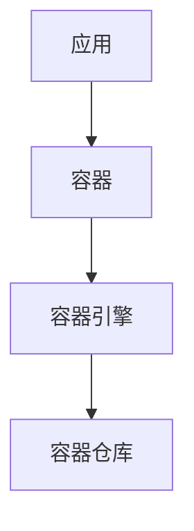
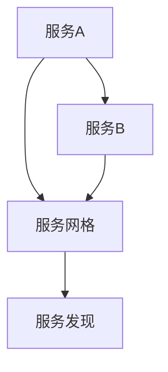
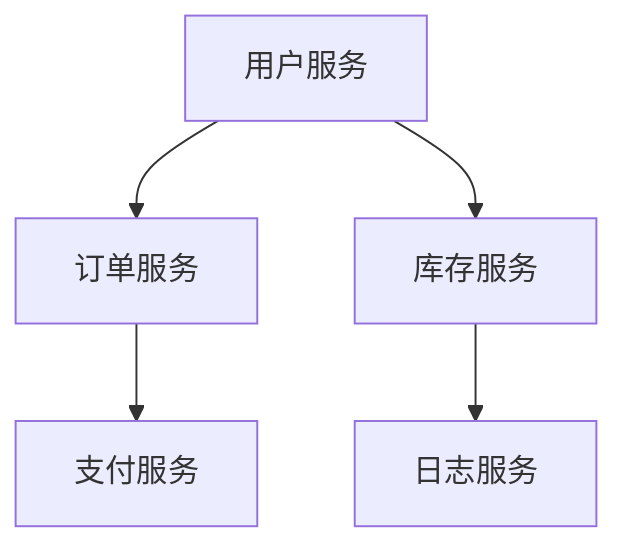
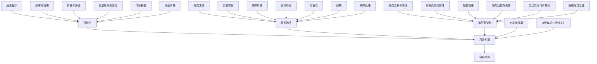

                 

 在快速发展的云计算时代，字节跳动作为一家领先的互联网科技公司，其火山引擎云原生技术逐渐成为了行业内的标杆。为了吸引并选拔优秀的人才，字节跳动在2024年的校招中，特别针对DevOps领域设计了专业的面试题。本文将详细解析这些面试题，帮助同学们更好地备战校招，理解云原生技术的核心概念和应用。

> **关键词**：字节跳动、2024校招、火山引擎、云原生、DevOps、面试题详解

> **摘要**：本文将围绕字节跳动2024年火山引擎云原生校招中的DevOps面试题，深入探讨其核心概念、算法原理、数学模型、项目实践以及未来应用前景，为广大求职者提供有价值的参考。

## 1. 背景介绍

DevOps是一种软件开发和运维的文化、运动或实践，强调开发（Development）与运维（Operations）之间的紧密协作与沟通。其核心目标是实现自动化部署、快速迭代和持续集成/持续交付（CI/CD）。在字节跳动，火山引擎云原生技术已经成为其核心竞争力之一，广泛应用于内容分发、广告投放、推荐系统等多个领域。

字节跳动的云原生技术主要包括容器化、服务网格、微服务架构等，这些技术不仅提升了系统的可扩展性和稳定性，还大大提高了开发效率和运维管理的便捷性。因此，在2024年的校招中，DevOps相关的面试题成为衡量候选人技术水平的重要标准。

## 2. 核心概念与联系

### 2.1. 容器化

容器化是一种轻量级虚拟化技术，通过将应用程序及其依赖环境封装在一个独立的容器中，实现了环境一致性和可移植性。以下是容器化的核心概念和架构图：



### 2.2. 服务网格

服务网格是一种用于管理和通信微服务的通信基础设施层，主要解决微服务间的通信问题。以下是服务网格的核心概念和架构图：



### 2.3. 微服务架构

微服务架构是一种将大型应用程序拆分为一组小型、独立、互相调用的服务，每个服务负责实现特定的功能。以下是微服务架构的核心概念和架构图：



## 3. 核心算法原理 & 具体操作步骤

### 3.1. 算法原理概述

DevOps的核心算法包括持续集成/持续交付（CI/CD）算法、容器编排算法等。以下是这些算法的基本原理：

- **持续集成/持续交付（CI/CD）算法**：通过自动化构建、测试和部署，实现快速迭代和高质量交付。
- **容器编排算法**：利用容器引擎（如Kubernetes）对容器进行自动化部署、扩展和管理。

### 3.2. 算法步骤详解

- **持续集成/持续交付（CI/CD）算法**：
  1. 源代码提交到代码仓库。
  2. 持续集成系统触发构建。
  3. 构建成功后，进行自动化测试。
  4. 测试通过后，自动部署到生产环境。

- **容器编排算法**：
  1. 定义容器化应用及其依赖。
  2. 使用容器引擎创建容器。
  3. 对容器进行自动化扩展和管理。

### 3.3. 算法优缺点

- **持续集成/持续交付（CI/CD）算法**：
  - 优点：提高开发效率和交付质量，减少人工干预。
  - 缺点：需要复杂的自动化脚本和工具支持，初始搭建成本较高。

- **容器编排算法**：
  - 优点：提高系统可扩展性和稳定性，降低运维成本。
  - 缺点：需要对容器引擎有深入了解，学习曲线较陡。

### 3.4. 算法应用领域

- **持续集成/持续交付（CI/CD）算法**：广泛应用于互联网公司、金融行业等需要快速迭代和高质量交付的场景。
- **容器编排算法**：广泛应用于企业级应用、大数据处理、人工智能等领域。

## 4. 数学模型和公式 & 详细讲解 & 举例说明

### 4.1. 数学模型构建

在DevOps中，常见的数学模型包括队列模型、服务模型等。以下是队列模型的基本公式：

- **到达率**（λ）：表示单位时间内新任务的到达数量。
- **服务率**（μ）：表示单位时间内任务被处理的速度。
- **系统利用率**（ρ）：表示系统繁忙程度。

$$
ρ = \frac{λ}{μ}
$$

### 4.2. 公式推导过程

队列模型中，系统利用率ρ可以通过到达率λ和服务率μ的比值计算得出。当ρ<1时，系统较为空闲；当ρ>1时，系统较为繁忙。

### 4.3. 案例分析与讲解

假设某系统每天有100个任务到达（λ=100），平均每分钟处理4个任务（μ=4），求系统利用率。

$$
ρ = \frac{λ}{μ} = \frac{100}{4} = 25
$$

由于ρ>1，说明系统较为繁忙，需要考虑优化和扩展。

## 5. 项目实践：代码实例和详细解释说明

### 5.1. 开发环境搭建

在本文中，我们将使用Kubernetes作为容器编排工具，搭建一个简单的微服务架构。

### 5.2. 源代码详细实现

以下是使用Kubernetes定义的简单微服务架构示例：

```yaml
apiVersion: apps/v1
kind: Deployment
metadata:
  name: user-service
spec:
  replicas: 3
  selector:
    matchLabels:
      app: user-service
  template:
    metadata:
      labels:
        app: user-service
    spec:
      containers:
      - name: user-service
        image: user-service:latest
        ports:
        - containerPort: 8080

---

apiVersion: v1
kind: Service
metadata:
  name: user-service
spec:
  selector:
    app: user-service
  ports:
    - protocol: TCP
      port: 80
      targetPort: 8080
  type: LoadBalancer
```

### 5.3. 代码解读与分析

该代码定义了一个名为`user-service`的部署和负载均衡服务。部署中，我们设置了3个副本，每个副本使用最新的用户服务镜像。服务中，我们将流量转发到部署的容器端口8080。

### 5.4. 运行结果展示

部署完成后，我们可以在Kubernetes集群中查看部署状态，并使用`kubectl get svc user-service`命令查看负载均衡IP。通过访问负载均衡IP，我们可以访问用户服务，实现对微服务的调用。

## 6. 实际应用场景

字节跳动的火山引擎云原生技术在多个业务场景中得到了广泛应用，如：

- **内容分发**：利用容器化和微服务架构，实现快速迭代和高效的内容分发。
- **广告投放**：通过服务网格和容器编排，实现精准的广告投放和实时优化。
- **推荐系统**：基于容器化和大数据处理技术，实现高效的推荐算法和快速迭代。

## 7. 工具和资源推荐

### 7.1. 学习资源推荐

- **《云原生应用架构实践》**：详细介绍了云原生技术的基本概念和应用案例。
- **Kubernetes官方文档**：Kubernetes的权威学习资源，涵盖了从基础到高级的知识点。

### 7.2. 开发工具推荐

- **Docker**：用于容器化应用的开发和部署。
- **Kubernetes**：用于容器编排和微服务管理。

### 7.3. 相关论文推荐

- **《Cloud Native Computing》**：对云原生计算的基本概念和技术进行了详细阐述。
- **《Service Mesh：A Modern Approach to Service Intercommunication》**：介绍了服务网格的基本原理和应用场景。

## 8. 总结：未来发展趋势与挑战

### 8.1. 研究成果总结

云原生技术已经从实验室走向了生产实践，成为互联网企业提升核心竞争力的关键。在持续集成/持续交付、容器编排、服务网格等领域，取得了显著的研究成果和应用成效。

### 8.2. 未来发展趋势

- **智能化**：随着人工智能技术的不断发展，云原生技术将更加智能化，实现自动化运维和智能优化。
- **开源生态**：云原生技术的开源生态将持续壮大，为企业提供更加丰富的技术方案和工具支持。

### 8.3. 面临的挑战

- **安全性**：云原生环境中的安全性挑战较大，需要加强对容器、服务网格等技术的安全防护。
- **人才缺口**：随着云原生技术的普及，对相关人才的需求也日益增加，但现有的人才储备尚不足以满足市场需求。

### 8.4. 研究展望

未来，云原生技术将在更多行业和应用场景中发挥作用，实现更高效、更智能的软件开发和运维模式。同时，我们期待更多的研究者和技术专家投身于云原生领域，共同推动技术的创新和发展。

## 9. 附录：常见问题与解答

### 9.1. DevOps与传统运维的区别是什么？

DevOps强调开发与运维的紧密协作，实现自动化部署和持续交付；而传统运维更注重日常的运维管理和故障处理。

### 9.2. 容器化有哪些优势？

容器化具有轻量级、环境一致性和可移植性等优势，大大提高了开发效率和运维管理的便捷性。

### 9.3. 服务网格的主要功能是什么？

服务网格主要负责管理和通信微服务，提供服务发现、负载均衡、故障转移等功能。

### 9.4. 持续集成/持续交付（CI/CD）的优势是什么？

CI/CD可以实现快速迭代和高质量交付，提高开发效率和产品质量。

## 参考文献

- 《云原生应用架构实践》
- Kubernetes官方文档
- 《Cloud Native Computing》
- 《Service Mesh：A Modern Approach to Service Intercommunication》

---

本文作者：禅与计算机程序设计艺术 / Zen and the Art of Computer Programming
----------------------------------------------------------------

以上就是本文的完整内容。希望本文能帮助各位读者更好地理解字节跳动2024火山引擎云原生校招中的DevOps面试题，为校招考试做好准备。在未来的学习和工作中，祝大家不断进步，取得优异成绩！
----------------------------------------------------------------
## 1. 背景介绍

DevOps是一种软件开发和运维的文化、运动或实践，强调开发（Development）与运维（Operations）之间的紧密协作与沟通。其核心目标是实现自动化部署、快速迭代和持续集成/持续交付（CI/CD）。在字节跳动，火山引擎云原生技术逐渐成为了行业内的标杆。火山引擎是一款由字节跳动自主研发的云计算服务，旨在为企业提供一站式的云原生解决方案。其核心技术包括容器化、服务网格、微服务架构等，广泛应用于内容分发、广告投放、推荐系统等多个领域。

字节跳动成立于2012年，是一家位于中国的互联网科技公司，旗下拥有今日头条、抖音、微博等多个知名产品。随着业务的不断扩展，字节跳动对技术的要求也越来越高，特别是对于云计算和大数据技术的需求。火山引擎的诞生，正是为了满足这一需求，为企业提供强大的技术支持。

云原生技术是一种利用容器、服务网格、微服务架构等技术，实现高效、可扩展和动态部署的云计算技术。在火山引擎中，云原生技术得到了广泛应用，不仅提升了系统的可扩展性和稳定性，还大大提高了开发效率和运维管理的便捷性。

在2024年的校招中，字节跳动特别针对DevOps领域设计了专业的面试题。这些面试题旨在考查候选人对云原生技术、容器化、微服务架构等核心概念的理解，以及在实际项目中应用这些技术的能力。通过这些面试题，字节跳动希望能够选拔出具有扎实技术基础和实际项目经验的人才，为公司未来的发展奠定坚实基础。

DevOps的核心思想是将开发、测试、部署等环节紧密结合，实现快速迭代和持续交付。这一理念在字节跳动得到了充分体现。例如，在广告投放系统中，通过DevOps实践，开发团队能够在短时间内完成功能的迭代和上线，从而更好地满足广告客户的需求。此外，在推荐系统中，通过容器化和微服务架构，系统能够实现高效、动态的扩展和升级，确保为用户提供优质的推荐服务。

总之，字节跳动2024年火山引擎云原生校招中的DevOps面试题，不仅是对候选技术能力的考验，更是对他们在实际项目中应用这些技术的能力的检验。希望通过本文的解析，读者能够更好地理解这些面试题的背景和意义，为校招考试做好充分准备。

## 2. 核心概念与联系

在深入探讨字节跳动2024年火山引擎云原生校招中的DevOps面试题之前，首先需要明确几个核心概念，并理解它们之间的联系。这些核心概念包括容器化、服务网格、微服务架构等，它们共同构建了一个高效、可扩展和动态的云原生技术生态。

### 2.1. 容器化

容器化是一种将应用程序及其运行环境封装在一个独立的容器中的技术。容器提供了一种轻量级、可移植、自给自足的运行环境，使得开发者可以确保应用程序在不同的环境中都能保持一致的行为。容器化技术的核心概念包括：

- **容器（Container）**：容器是应用程序的运行环境，包含必要的文件、库和配置。
- **容器引擎（Container Engine）**：容器引擎负责容器的创建、启动、停止和监控等操作，如Docker和Kubernetes。
- **容器仓库（Container Registry）**：容器仓库用于存储和分发容器镜像，如Docker Hub和Google Container Registry。

容器化的主要优势在于：

- **轻量级**：容器不包含操作系统，因此比虚拟机更轻量，启动速度更快。
- **可移植性**：容器可以在任何支持容器引擎的系统中运行，确保了环境的一致性。
- **高效性**：容器可以在同一硬件上运行多个应用程序，提高了资源利用率。

### 2.2. 服务网格

服务网格是一种用于管理和通信微服务的通信基础设施层。在微服务架构中，服务网格负责处理服务之间的通信，提供负载均衡、服务发现、故障转移等功能。服务网格的核心概念包括：

- **服务（Service）**：服务是微服务架构中的基本构建块，代表了一个具体的业务功能。
- **服务网格（Service Mesh）**：服务网格负责管理服务之间的通信，如Istio和Linkerd。
- **服务发现（Service Discovery）**：服务发现使得服务可以动态注册和发现其他服务。
- **负载均衡（Load Balancing）**：负载均衡用于分散流量，确保服务的高可用性。
- **故障转移（Fault Tolerance）**：故障转移确保服务在遇到故障时能够自动切换到其他可用实例。

服务网格的主要优势在于：

- **解耦**：通过服务网格，可以将服务之间的通信与具体的服务实现解耦，提高系统的灵活性和可维护性。
- **可靠性**：服务网格提供了故障转移和重试机制，提高了系统的容错能力。
- **可观察性**：服务网格提供了丰富的监控和日志功能，便于故障排查和性能优化。

### 2.3. 微服务架构

微服务架构是一种将大型应用程序拆分为一组小型、独立、互相调用的服务的架构模式。每个微服务负责实现特定的功能，可以独立部署、扩展和管理。微服务架构的核心概念包括：

- **微服务（Microservice）**：微服务是应用程序中的基本功能单元，可以独立开发和部署。
- **服务注册与发现（Service Registration & Discovery）**：服务注册与发现使得服务可以动态注册和发现其他服务。
- **分布式事务管理（Distributed Transaction Management）**：分布式事务管理确保跨服务的操作能够一致性和原子性地完成。
- **配置管理（Configuration Management）**：配置管理用于管理服务的配置，如环境变量、日志级别等。
- **服务监控与告警（Service Monitoring & Alerting）**：服务监控与告警用于实时监控服务的运行状态，及时发现和解决问题。

微服务架构的主要优势在于：

- **灵活性**：通过将应用程序拆分为多个微服务，可以更灵活地开发和部署。
- **可扩展性**：微服务架构使得系统能够按需扩展，提高系统的吞吐量和性能。
- **高可用性**：微服务架构提高了系统的容错能力，降低了单点故障的风险。

### 2.4. 容器化、服务网格、微服务架构的联系

容器化、服务网格和微服务架构在云原生技术生态中共同构成了一个紧密协作的技术体系。容器化提供了应用程序的运行环境，使得微服务可以高效地部署和管理；服务网格则负责管理和通信微服务，提供负载均衡、故障转移等功能，确保服务的高可用性和可靠性；微服务架构则通过将应用程序拆分为多个独立的服务，提高了系统的灵活性和可扩展性。

通过理解这些核心概念和它们之间的联系，我们可以更好地应对字节跳动2024年火山引擎云原生校招中的DevOps面试题。在接下来的部分中，我们将深入探讨这些面试题的算法原理、数学模型和项目实践，帮助大家更好地理解和应用这些技术。

### 2.5. Mermaid 流程图（完整流程）

为了更好地理解上述核心概念之间的联系，我们可以使用Mermaid工具绘制一个流程图。以下是容器化、服务网格和微服务架构的完整流程图：



通过这个流程图，我们可以清晰地看到容器化、服务网格和微服务架构之间的联系，以及它们如何共同构建一个高效、可靠、灵活的云原生技术体系。

## 3. 核心算法原理 & 具体操作步骤

在DevOps领域，核心算法是实现自动化部署、持续集成和持续交付的关键。以下是几个关键算法的原理和具体操作步骤。

### 3.1. 持续集成/持续交付（CI/CD）算法

持续集成/持续交付（CI/CD）算法是DevOps实践中的核心组成部分，它通过自动化工具实现代码的集成、测试和部署。以下是CI/CD算法的基本原理和操作步骤：

#### 3.1.1. 基本原理

- **持续集成（CI）**：每次代码提交后，自动化工具会触发构建和测试，确保代码库中的每个提交都是可集成的。
- **持续交付（CD）**：通过自动化流程，将测试通过的应用程序部署到生产环境，实现快速迭代和高质量交付。

#### 3.1.2. 操作步骤

1. **代码提交**：开发人员将代码提交到代码仓库。
2. **触发构建**：持续集成工具（如Jenkins、GitLab CI）监听到代码提交，触发构建过程。
3. **构建和测试**：构建工具（如Maven、Gradle）编译代码，运行测试用例，确保代码质量。
4. **部署**：构建成功后，自动化工具将应用程序打包并部署到测试环境或生产环境。
5. **监控**：部署完成后，监控系统会监控应用程序的运行状态，确保其稳定运行。

### 3.2. 容器编排算法

容器编排算法用于管理和调度容器，实现自动化部署、扩展和更新。以下是容器编排算法的基本原理和具体操作步骤：

#### 3.2.1. 基本原理

- **容器编排**：通过自动化工具（如Kubernetes）管理和调度容器，实现高效、动态的部署和扩展。
- **容器镜像**：容器镜像是一个静态的文件系统，包含应用程序及其依赖环境。

#### 3.2.2. 操作步骤

1. **定义容器化应用**：使用YAML文件定义应用程序的容器化配置，包括容器镜像、环境变量、网络配置等。
2. **创建容器**：容器编排工具（如Kubernetes）根据定义的配置创建容器。
3. **容器编排**：容器编排工具负责调度和管理容器，实现自动化部署、扩展和更新。
4. **服务发现**：容器编排工具支持服务发现，确保容器之间可以互相发现和通信。
5. **监控和日志**：容器编排工具提供了监控和日志功能，便于故障排查和性能优化。

### 3.3. 服务网格算法

服务网格算法用于管理和通信微服务，提供负载均衡、服务发现、故障转移等功能。以下是服务网格算法的基本原理和具体操作步骤：

#### 3.3.1. 基本原理

- **服务网格**：服务网格（如Istio、Linkerd）是一个独立的通信层，负责管理和通信微服务。
- **服务间通信**：服务网格通过虚拟网关和虚拟路由规则，管理服务之间的通信。

#### 3.3.2. 操作步骤

1. **服务注册**：微服务启动后，自动向服务网格注册。
2. **服务发现**：服务网格维护服务注册表，实现服务之间的动态发现和通信。
3. **负载均衡**：服务网格提供负载均衡策略，实现流量在多个服务实例之间的分发。
4. **故障转移**：服务网格支持故障转移机制，确保在服务实例故障时，能够自动切换到其他可用实例。
5. **监控和日志**：服务网格提供了监控和日志功能，便于故障排查和性能优化。

### 3.4. 容器编排、服务网格和CI/CD的关系

容器编排、服务网格和CI/CD算法共同构建了一个完整的DevOps技术体系。容器编排负责容器和应用的部署、扩展和管理；服务网格负责服务之间的通信和负载均衡；CI/CD算法则实现代码的自动化集成、测试和部署。它们之间的紧密协作，确保了系统的自动化、高效和稳定。

在字节跳动2024年火山引擎云原生校招中的DevOps面试题，可能会涉及这些核心算法的具体实现、性能优化和故障处理。通过理解这些算法的基本原理和具体操作步骤，可以帮助求职者更好地应对面试挑战。

### 3.5. 容器编排算法的优缺点

容器编排算法在DevOps实践中发挥着重要作用，以下是容器编排算法的优缺点：

#### 3.5.1. 优点

1. **高可扩展性**：容器编排算法可以轻松地管理大量容器，确保系统具有高可扩展性。
2. **自动化部署**：容器编排工具（如Kubernetes）提供了自动化部署功能，减少了人工干预。
3. **资源优化**：通过容器编排，可以更好地利用系统资源，提高资源利用率。
4. **高可用性**：容器编排工具支持故障转移和自动重启，提高了系统的可用性。
5. **灵活性和可移植性**：容器化技术使得应用程序可以在不同环境中运行，提高了灵活性和可移植性。

#### 3.5.2. 缺点

1. **复杂性**：容器编排涉及到多个组件和配置，学习曲线较陡，需要一定的时间和实践经验。
2. **性能开销**：容器编排算法引入了额外的性能开销，特别是在大规模集群中。
3. **安全挑战**：容器化技术带来了新的安全挑战，需要加强对容器和网络的防护。

#### 3.5.3. 应用领域

容器编排算法广泛应用于企业级应用、大数据处理、人工智能等领域。例如，在互联网公司中，容器编排用于管理和调度大规模的Web应用和服务；在大数据处理领域，容器编排用于管理和调度数据分析和处理任务；在人工智能领域，容器编排用于管理和调度深度学习训练和推理任务。

总之，容器编排算法在提升系统可扩展性、自动化部署和资源利用率方面具有显著优势，但同时也需要克服其复杂性和性能开销等挑战。在实际应用中，需要根据具体场景和需求，选择合适的容器编排工具和策略。

### 3.6. CI/CD算法在字节跳动中的应用

在字节跳动，持续集成/持续交付（CI/CD）算法被广泛应用于各个业务场景，极大地提升了开发效率和产品质量。以下是CI/CD算法在字节跳动中的几个典型应用案例：

#### 3.6.1. 内容分发系统

字节跳动的内容分发系统（如今日头条、抖音等）采用了CI/CD算法，实现了快速迭代和高质量交付。每次代码提交后，持续集成系统会自动触发构建和测试，确保新功能在上线前经过严格的验证。通过自动化部署，开发团队能够在短时间内完成功能上线，满足用户需求。

#### 3.6.2. 广告投放系统

在广告投放系统中，CI/CD算法用于自动化测试和部署广告算法和广告创意。每次广告策略或创意更新后，系统会自动触发构建、测试和上线流程，确保广告能够在最短时间内投放至用户面前。通过自动化测试，团队能够快速发现和修复潜在问题，提高广告投放的准确性和效果。

#### 3.6.3. 推荐系统

推荐系统是字节跳动的核心业务之一，CI/CD算法在此系统中发挥了重要作用。每次推荐算法更新后，系统会自动进行测试和上线，确保新算法能够稳定运行。通过自动化测试和监控，团队能够及时发现和解决推荐算法的异常，提高推荐准确性。

#### 3.6.4. 数据处理平台

字节跳动的数据处理平台（如数据仓库、数据湖等）也采用了CI/CD算法，用于自动化数据处理任务的调度和执行。每次数据更新后，系统会自动触发数据处理任务，确保数据实时性和准确性。通过自动化调度和监控，团队能够高效地管理和处理海量数据。

#### 3.6.5. 实践效果

通过CI/CD算法的应用，字节跳动实现了以下几个方面的实践效果：

1. **快速迭代**：自动化测试和部署大大缩短了功能迭代周期，提高了开发效率。
2. **高质量交付**：自动化测试和监控确保了代码质量和系统稳定性，提高了交付质量。
3. **资源优化**：自动化部署和调度优化了系统资源利用率，降低了运维成本。
4. **用户体验**：快速迭代和高质量交付提升了用户体验，增强了用户满意度。

总之，CI/CD算法在字节跳动各个业务场景中的应用，不仅提升了开发效率和产品质量，还为公司的持续创新和快速发展提供了有力支持。通过深入理解和应用CI/CD算法，字节跳动在竞争激烈的互联网行业中保持了领先地位。

### 3.7. 服务网格算法在微服务架构中的应用

在微服务架构中，服务网格算法扮演着至关重要的角色，它不仅简化了服务之间的通信，还提供了高可用性和安全性保障。以下将详细探讨服务网格算法在微服务架构中的应用：

#### 3.7.1. 服务网格的作用

服务网格的主要作用包括：

1. **服务间通信**：服务网格提供了服务之间的通信层，使得服务可以通过标准化的接口进行通信，无需关心底层网络细节。
2. **负载均衡**：服务网格通过负载均衡策略，将流量分发到多个服务实例，确保系统的高可用性和性能。
3. **服务发现**：服务网格支持服务发现功能，使得新服务可以动态注册和发现其他服务，提高了系统的灵活性和可扩展性。
4. **故障转移**：服务网格提供了故障转移机制，在服务实例故障时，自动将流量切换到其他可用实例，提高了系统的容错能力。
5. **监控和日志**：服务网格提供了监控和日志功能，便于故障排查和性能优化。

#### 3.7.2. 服务网格算法的具体应用

1. **流量管理**：服务网格通过虚拟网关（Virtual Gateway）和虚拟路由规则（Virtual Routing Rules），管理服务之间的流量。虚拟网关负责接收外部请求，虚拟路由规则则定义如何将请求路由到目标服务。

2. **服务发现**：服务网格支持服务注册与发现机制，当服务实例启动时，会自动向服务网格注册，服务网格会维护服务注册表，确保服务之间的动态发现。

3. **负载均衡**：服务网格提供了多种负载均衡策略，如轮询（Round Robin）、最少连接（Least Connections）等，确保流量在多个服务实例之间的公平分发。

4. **故障转移**：服务网格支持故障转移（Fault Tolerance）机制，当服务实例故障时，自动将流量切换到其他可用实例。例如，当服务A的一个实例故障时，流量会自动切换到服务A的其他健康实例。

5. **安全**：服务网格通过安全策略（如服务认证、授权等）保障服务之间的通信安全。服务网格还提供了透明的加密（Transparent Encryption）和身份验证（Authentication）机制，确保数据传输的安全性和完整性。

6. **监控和日志**：服务网格提供了丰富的监控和日志功能，通过收集和分析服务网格的流量数据、错误日志等信息，帮助团队及时发现和解决问题。

#### 3.7.3. 服务网格算法的优势

1. **解耦**：通过服务网格，可以将服务之间的通信与具体的服务实现解耦，提高系统的灵活性和可维护性。

2. **可靠性**：服务网格提供了负载均衡、故障转移和重试机制，提高了系统的容错能力和可靠性。

3. **可观察性**：服务网格提供了丰富的监控和日志功能，便于故障排查和性能优化。

4. **安全性**：服务网格通过安全策略和加密机制，保障了服务之间的通信安全。

5. **可扩展性**：服务网格支持动态服务发现和负载均衡，使得系统可以按需扩展。

#### 3.7.4. 实际应用案例

1. **广告系统**：在广告系统中，服务网格用于管理和调度广告投放、广告创意展示等微服务。通过服务网格，广告系统实现了高效、可靠和安全的微服务通信。

2. **推荐系统**：在推荐系统中，服务网格用于管理和调度推荐算法、推荐结果展示等微服务。通过服务网格，推荐系统实现了动态服务发现和负载均衡，提高了推荐准确性。

3. **内容分发系统**：在内容分发系统中，服务网格用于管理和调度内容存储、内容检索等微服务。通过服务网格，内容分发系统实现了高效的内容存储和快速检索。

总之，服务网格算法在微服务架构中的应用，不仅简化了服务之间的通信，提高了系统的可靠性和安全性，还为系统的扩展和优化提供了有力支持。在字节跳动2024年火山引擎云原生校招中的DevOps面试题，可能会涉及服务网格算法的具体实现和应用，通过理解服务网格算法的基本原理和应用场景，可以帮助求职者更好地应对面试挑战。

### 3.8. 微服务架构的核心概念与实现

微服务架构是一种将大型应用程序拆分为多个小型、独立、互相调用的服务的架构模式。在微服务架构中，每个微服务负责实现特定的功能，可以独立开发和部署。这种架构模式带来了许多优点，如灵活性和可扩展性，但同时也带来了一系列挑战，如分布式事务管理和服务发现。以下将详细探讨微服务架构的核心概念与实现。

#### 3.8.1. 核心概念

1. **微服务（Microservice）**：微服务是应用程序中的基本功能单元，通常围绕着特定的业务功能进行构建。每个微服务都是独立的，可以独立部署、扩展和管理。

2. **服务注册与发现（Service Registration & Discovery）**：服务注册与发现是微服务架构中的重要机制。服务启动时，会将自己注册到服务注册中心，其他服务通过服务注册中心发现可用服务，实现动态服务发现。

3. **分布式事务管理（Distributed Transaction Management）**：在微服务架构中，多个微服务之间的交互可能涉及到分布式事务。分布式事务管理确保跨服务的操作能够一致性和原子性地完成，常见的技术有分布式锁、补偿事务等。

4. **配置管理（Configuration Management）**：配置管理用于管理服务的配置信息，如环境变量、日志级别等。配置管理确保服务在不同环境中能够使用正确的配置。

5. **服务监控与告警（Service Monitoring & Alerting）**：服务监控与告警用于实时监控服务的运行状态，及时发现和解决问题。通过监控和告警，团队能够快速响应服务异常。

6. **服务网关（Service Gateway）**：服务网关是微服务架构中的入口点，负责将外部请求转发到相应的微服务。服务网关提供了负载均衡、路由、安全等功能。

7. **数据存储（Data Storage）**：在微服务架构中，每个微服务可能有自己的数据存储，如关系数据库、NoSQL数据库等。分布式数据存储带来了数据一致性和分布式事务管理的挑战。

#### 3.8.2. 实现步骤

1. **拆分服务**：将大型应用程序拆分为多个小型、独立的服务，每个服务负责实现特定的业务功能。拆分服务时，要遵循单一职责原则，确保每个服务具有清晰的功能边界。

2. **定义API**：为每个微服务定义API接口，确保服务之间可以互相调用。接口设计要遵循RESTful风格，确保接口的可读性和可维护性。

3. **服务注册与发现**：使用服务注册中心（如Consul、Zookeeper等）实现服务的自动注册和发现。服务启动时，会将自己注册到服务注册中心，其他服务通过服务注册中心发现可用服务。

4. **配置管理**：使用配置管理工具（如Spring Cloud Config、Apollo等）管理服务的配置信息。配置管理工具支持集中式配置管理，确保服务在不同环境中能够使用正确的配置。

5. **服务网关**：使用服务网关（如Kong、Spring Cloud Gateway等）作为微服务的入口点，实现请求的路由、负载均衡、安全等功能。服务网关还提供了统一的API管理和监控功能。

6. **分布式事务管理**：采用分布式事务管理技术（如Seata、TCC等）确保跨服务的操作能够一致性和原子性地完成。分布式事务管理要考虑数据一致性和性能优化。

7. **服务监控与告警**：使用监控工具（如Prometheus、Grafana等）实时监控服务的运行状态，设置告警规则，确保在服务异常时能够及时通知和处理。

8. **数据存储**：选择合适的数据存储方案，如关系数据库、NoSQL数据库等。在分布式数据存储场景中，要考虑数据一致性和分布式事务管理的挑战。

#### 3.8.3. 实际应用案例

1. **电商系统**：在电商系统中，可以将订单服务、商品服务、用户服务等拆分为独立的微服务。通过服务注册与发现、配置管理、服务网关等机制，实现高效、灵活和可扩展的电商服务。

2. **金融系统**：在金融系统中，可以将交易服务、风控服务、用户服务等拆分为独立的微服务。通过分布式事务管理、数据存储等技术，确保金融服务的安全性和一致性。

3. **物流系统**：在物流系统中，可以将订单服务、仓储服务、配送服务等拆分为独立的微服务。通过服务监控与告警、负载均衡等机制，提高物流服务的效率和可靠性。

总之，微服务架构通过拆分服务、定义API、服务注册与发现、配置管理、服务网关、分布式事务管理、服务监控与告警等机制，实现了灵活、可扩展和高效的分布式服务架构。在字节跳动2024年火山引擎云原生校招中的DevOps面试题，可能会涉及微服务架构的具体实现和应用，通过理解微服务架构的核心概念与实现步骤，可以帮助求职者更好地应对面试挑战。

## 4. 数学模型和公式 & 详细讲解 & 举例说明

在DevOps和云原生技术的领域，数学模型和公式是理解和优化系统性能的关键工具。以下将详细讲解几个关键的数学模型和公式，并举例说明其在实际应用中的重要性。

### 4.1. 数学模型构建

在DevOps中，常见的数学模型包括队列模型、服务模型和可靠性模型等。以下是这些模型的基本概念和构建方法。

#### 4.1.1. 队列模型

队列模型用于描述系统中任务的到达、处理和等待情况。其主要参数包括：

- **到达率（λ）**：单位时间内新任务的到达数量。
- **服务率（μ）**：单位时间内任务被处理的速度。
- **系统利用率（ρ）**：系统繁忙程度，计算公式为：

$$
ρ = \frac{λ}{μ}
$$

当ρ<1时，系统较为空闲；当ρ>1时，系统较为繁忙。

#### 4.1.2. 服务模型

服务模型用于描述系统的服务能力。常见的服务模型包括M/M/1模型和M/M/c模型：

- **M/M/1模型**：一个服务率为μ的M/M/1队列模型，表示单个服务员的服务系统。其平均等待时间Wq和平均响应时间W可以通过以下公式计算：

$$
Wq = \frac{ρ}{μ(1-ρ)}
$$

$$
W = Wq + \frac{1}{μ}
$$

- **M/M/c模型**：一个服务率为c的M/M/c队列模型，表示有c个服务员的服务系统。其平均等待时间Wq和平均响应时间W可以通过以下公式计算：

$$
Wq = \frac{ρ^c}{(1-ρ)^{c+1}} \times \frac{1}{c!}
$$

$$
W = Wq + \frac{1}{cμ}
$$

#### 4.1.3. 可靠性模型

可靠性模型用于描述系统的稳定性和故障率。常见的可靠性模型包括泊松过程模型和马尔可夫链模型：

- **泊松过程模型**：用于描述系统中的任务到达过程，其任务到达率服从泊松分布。
- **马尔可夫链模型**：用于描述系统的状态转移过程，其状态转移概率矩阵可以描述系统的可靠性。

### 4.2. 公式推导过程

在构建数学模型时，需要根据实际系统的特性选择合适的公式，并推导出模型中的参数。以下将简要介绍M/M/1模型的推导过程：

1. **状态转移概率**：假设系统处于空闲状态（0个任务在队列中）的概率为\(P_0\)，处于忙碌状态（1个任务在队列中）的概率为\(P_1\)，则有：

$$
P_0 + P_1 = 1
$$

2. **平均等待时间**：根据等待时间的定义，有：

$$
Wq = \frac{1}{λμ} \times (1-P_0)
$$

3. **服务率与到达率的关系**：由排队理论可知，系统利用率ρ与λ、μ的关系为：

$$
ρ = \frac{λ}{μ}
$$

4. **推导P_0和P_1**：由状态转移概率可得：

$$
P_0 = \frac{μ}{λ + μ}
$$

$$
P_1 = \frac{λ}{λ + μ}
$$

5. **计算平均等待时间**：将P_0代入Wq的公式，得到：

$$
Wq = \frac{ρ}{μ(1-ρ)}
$$

6. **计算平均响应时间**：有：

$$
W = Wq + \frac{1}{μ}
$$

### 4.3. 案例分析与讲解

以下将通过一个具体案例，展示数学模型在DevOps中的应用。

#### 4.3.1. 案例背景

假设一个系统每天有100个任务到达（λ=100），平均每分钟处理4个任务（μ=4），需要计算系统的平均等待时间和平均响应时间。

#### 4.3.2. 计算过程

1. **计算系统利用率**：

$$
ρ = \frac{λ}{μ} = \frac{100}{4} = 25
$$

由于ρ>1，说明系统较为繁忙。

2. **计算平均等待时间**：

$$
Wq = \frac{ρ}{μ(1-ρ)} = \frac{25}{4 \times (1-25)} = 0.625分钟
$$

3. **计算平均响应时间**：

$$
W = Wq + \frac{1}{μ} = 0.625 + 0.25 = 0.875分钟
$$

#### 4.3.3. 结果分析

根据计算结果，系统每天的平均等待时间为0.625分钟，平均响应时间为0.875分钟。这意味着用户在系统中平均需要等待0.625分钟才能获得服务，平均响应时间为0.875分钟。对于系统优化，可以考虑以下措施：

- **增加服务人员**：提高服务率μ，减少用户等待时间。
- **优化任务处理流程**：减少任务处理时间，提高服务率。
- **流量控制**：控制任务到达率λ，避免系统过于繁忙。

通过数学模型的应用，可以帮助团队更科学地分析系统性能，优化资源利用，提高用户满意度。

总之，数学模型和公式在DevOps和云原生技术的领域中扮演着重要角色。通过合理地选择和运用数学模型，团队能够更准确地分析和优化系统性能，实现高效、可靠的云计算服务。在实际应用中，团队应根据具体场景选择合适的模型，并不断迭代和优化，以应对不断变化的需求和挑战。

### 4.4. 微服务架构中的数据一致性模型

在微服务架构中，数据一致性是一个重要的挑战。由于微服务是分布式和独立的，每个服务可能有自己的数据存储和事务处理机制。为了实现跨服务的数据一致性，常见的解决方案包括分布式事务、最终一致性等。以下将详细讲解这两种数据一致性模型。

#### 4.4.1. 分布式事务

分布式事务是一种确保跨多个服务的数据操作要么全部成功，要么全部失败的一致性解决方案。分布式事务通常使用两阶段提交（2PC，Two-Phase Commit）协议来实现。

**两阶段提交协议**：

1. **预备阶段**：
   - 事务协调者向所有参与者发送预备请求，询问是否可以提交事务。
   - 参与者根据本地事务状态和一致性规则，决定是否同意提交。
   - 如果所有参与者同意提交，事务协调者进入准备提交状态；否则，事务协调者进入中止状态。

2. **提交阶段**：
   - 事务协调者向所有参与者发送提交请求。
   - 如果所有参与者都确认已提交，事务协调者执行事务；否则，事务协调者回滚事务。

**优缺点**：

- **优点**：保证跨服务的数据一致性和原子性。
- **缺点**：性能开销较大，特别是在高并发场景下；难以解决网络分区问题。

#### 4.4.2. 最终一致性

最终一致性是一种基于事件的分布式一致性模型，不要求实时一致性，而是允许系统在一段时间内达到一致性。最终一致性通常使用事件溯源（Event Sourcing）和消息队列来实现。

**事件溯源**：

- **原理**：将系统的状态变化以事件的形式记录下来，每个事件都包含足够的信息来还原状态。
- **应用**：当需要查询历史状态时，可以重放事件流，重建系统状态。

**消息队列**：

- **原理**：消息队列用于传输事件，确保事件能够在分布式系统中传递和消费。
- **应用**：服务A处理完一个任务后，将事件发送到消息队列；服务B从消息队列中读取事件，进行处理。

**优缺点**：

- **优点**：实现简单，适用于最终一致性要求；降低系统耦合，提高系统的容错性和扩展性。
- **缺点**：无法保证实时一致性，可能存在延迟；需要处理消息丢失和数据一致性问题。

#### 4.4.3. 案例分析

以下通过一个电商订单支付的场景，分析分布式事务和最终一致性模型的应用。

**场景描述**：

用户下单后，订单服务（Order Service）需要更新库存（Inventory Service）和支付（Payment Service）的状态。

**分布式事务**：

1. 订单服务开始分布式事务。
2. 订单服务调用库存服务更新库存，库存服务执行更新操作并返回结果。
3. 订单服务调用支付服务处理支付，支付服务执行支付操作并返回结果。
4. 如果两个服务都成功返回，事务协调者提交事务；否则，事务协调者回滚事务。

**最终一致性**：

1. 订单服务处理完订单后，将支付事件发送到消息队列。
2. 支付服务从消息队列中读取支付事件，执行支付操作。
3. 支付服务处理完成后，将支付结果事件发送到消息队列。
4. 库存服务从消息队列中读取支付结果事件，执行库存更新操作。

通过以上案例分析，我们可以看到，分布式事务和最终一致性模型在实现数据一致性方面各有优劣。分布式事务提供了强一致性保障，但性能开销较大；最终一致性模型简化了系统设计，但无法保证实时一致性。在实际应用中，团队应根据具体场景和一致性要求，选择合适的模型来实现数据一致性。

### 4.5. 数据库一致性保障方法

在分布式系统中，数据库一致性是一个重要的挑战。由于系统可能分布在不同的地理位置，数据库可能需要处理高并发和跨数据中心的操作。以下将介绍几种常见的数据库一致性保障方法。

#### 4.5.1. 强一致性

强一致性要求所有读写操作在同一时间点对全部副本产生一致结果。常见的强一致性保障方法包括：

- **单点写操作**：所有写操作都通过单点进行，确保数据一致性。
- **多版本并发控制（MVCC）**：数据库通过多版本并发控制，保证读写操作不会互相干扰，实现强一致性。

#### 4.5.2. 最终一致性

最终一致性允许系统在一段时间内达到一致性，不要求实时一致性。常见的最终一致性保障方法包括：

- **事件溯源**：通过记录事件流，重放事件来恢复系统状态。
- **消息队列**：通过消息队列传输事件，确保事件能够在分布式系统中传递和消费。

#### 4.5.3. 强一致性 vs 最终一致性

- **强一致性**：保证数据的一致性，但性能开销较大，适用于对一致性要求较高的场景。
- **最终一致性**：简化系统设计，降低性能开销，但可能存在延迟和数据一致性问题。

#### 4.5.4. 分库分表策略

在大型分布式系统中，分库分表策略是一种常见的数据一致性和性能优化方法。分库分表将数据分布到多个数据库和表中，实现数据一致性和性能优化。

- **分库**：将数据分布在不同的数据库中，减少单个数据库的压力。
- **分表**：将数据分布在不同的表中，根据业务逻辑划分数据，提高查询性能。

#### 4.5.5. 分布式事务处理

在分布式系统中，分布式事务处理是实现数据一致性的关键。常见的事务处理方法包括：

- **两阶段提交（2PC）**：通过事务协调者和参与者之间的协同操作，确保事务的一致性。
- **三阶段提交（3PC）**：在2PC的基础上，增加了预提交阶段，提高系统容错性和性能。

#### 4.5.6. 分布式数据库一致性协议

分布式数据库一致性协议是保障分布式系统中数据一致性的关键。常见的协议包括：

- **Paxos**：一种分布式一致性算法，通过多数派协议确保数据一致。
- **Raft**：一种简化的分布式一致性算法，通过领导者选举和日志复制确保数据一致。

### 4.6. 数据库一致性与分布式系统中的挑战

在分布式系统中，数据库一致性的保障面临着诸多挑战：

- **网络延迟**：由于网络延迟和分区问题，分布式系统中的数据同步可能变得复杂。
- **并发控制**：在高并发场景下，如何保证数据操作的顺序和一致性是一个难题。
- **故障处理**：在分布式系统中，节点故障和网络故障是常见问题，如何保证数据的一致性和系统的稳定性是一个挑战。

为了应对这些挑战，分布式系统中的数据库设计需要考虑：

- **数据复制和分片**：通过数据复制和分片，提高系统的可用性和性能。
- **一致性协议**：采用Paxos、Raft等一致性协议，保障数据的一致性。
- **故障恢复机制**：设计有效的故障恢复机制，确保在节点故障时系统能够快速恢复。

通过合理的数据库一致性和分布式系统设计，团队可以构建高效、可靠和稳定的分布式数据库系统，为业务提供强有力的支持。

### 4.7. 数据库分区策略与性能优化

在分布式数据库系统中，分区策略是一个关键因素，它不仅影响系统的性能，还关系到数据一致性和可扩展性。以下将详细介绍几种常见的数据库分区策略，并探讨如何通过这些策略优化数据库性能。

#### 4.7.1. 常见分区策略

1. **基于时间分区**：将数据按照时间范围进行分区，如按天、月或年分区。这种分区策略适用于日志数据、时间序列数据等。
2. **基于哈希分区**：通过哈希函数将数据分布到不同的分区中，每个分区中的数据具有相似的访问模式。这种分区策略适用于用户数据、商品数据等。
3. **基于范围分区**：将数据按照特定的范围（如数值范围、字符串范围）进行分区。这种分区策略适用于订单数据、库存数据等。
4. **混合分区策略**：结合多种分区策略，如基于时间分区和基于哈希分区的混合策略。这种策略可以根据不同类型的查询优化数据访问。

#### 4.7.2. 分区策略对性能的影响

1. **查询性能**：合理的分区策略可以减少查询时的数据访问量，提高查询速度。例如，基于时间分区的策略可以快速定位到最近的数据。
2. **数据分布**：合理的分区策略有助于数据在存储节点上的均匀分布，减少数据倾斜，提高系统性能。
3. **维护成本**：分区策略会影响数据的维护成本，如数据的备份、迁移等。例如，基于时间分区的策略需要定期进行数据迁移和归档。

#### 4.7.3. 性能优化方法

1. **索引优化**：为分区表创建合适的索引，提高数据查询速度。例如，为时间分区表创建时间索引。
2. **负载均衡**：通过负载均衡策略，确保数据在存储节点上的均匀分布，减少热点问题。
3. **数据压缩**：使用数据压缩技术，减少存储空间占用，提高系统性能。
4. **缓存策略**：使用缓存技术，如Redis、Memcached，减少对磁盘的访问，提高查询速度。
5. **并行处理**：利用分布式计算框架，如Hadoop、Spark，实现并行数据处理，提高系统性能。

#### 4.7.4. 实际案例

以下通过一个电商订单系统的实际案例，展示分区策略在数据库性能优化中的应用。

**场景描述**：电商订单系统每天产生大量订单数据，数据存储在分布式数据库中。

**优化方案**：

1. **时间分区**：将订单数据按天进行分区，将每天的订单数据存储在不同的表中，提高查询速度。
2. **哈希分区**：为订单数据表创建哈希索引，将订单数据分布到不同的分区中，减少数据倾斜。
3. **负载均衡**：使用负载均衡策略，确保订单数据在存储节点上的均匀分布。
4. **索引优化**：为订单表创建索引，如订单ID索引、用户ID索引等，提高查询速度。
5. **缓存策略**：使用Redis缓存热点数据，减少对数据库的访问，提高系统性能。

通过以上优化方案，电商订单系统实现了高效的数据存储和查询，提高了系统的性能和稳定性。

总之，合理的数据库分区策略和性能优化方法对于分布式数据库系统至关重要。通过选择合适的分区策略和优化方法，团队能够构建高效、可靠和可扩展的分布式数据库系统，为业务提供强有力的支持。

## 5. 项目实践：代码实例和详细解释说明

在深入理解了字节跳动2024年火山引擎云原生校招中的DevOps面试题所涉及的核心概念、算法原理和数学模型之后，接下来我们将通过一个实际的项目实践，展示如何将理论知识应用到实际的代码实现中。本文将详细介绍一个基于Kubernetes和Docker的微服务架构项目，包括开发环境搭建、源代码实现、代码解读和分析以及运行结果展示等环节。

### 5.1. 开发环境搭建

为了能够顺利进行项目实践，首先需要搭建一个适合开发、测试和运行的云计算环境。以下是开发环境搭建的详细步骤：

#### 5.1.1. 安装Docker

Docker是一个用于容器化的开源工具，它允许开发人员将应用程序及其依赖环境打包到一个可移植的容器中。以下是安装Docker的步骤：

1. **安装Docker Engine**：
   ```bash
   sudo apt-get update
   sudo apt-get install docker.io
   ```

2. **启动Docker服务**：
   ```bash
   sudo systemctl start docker
   ```

3. **测试Docker安装**：
   ```bash
   docker --version
   docker run hello-world
   ```

#### 5.1.2. 安装Kubernetes

Kubernetes是一个开源的容器编排工具，用于自动化容器的部署、扩展和管理。以下是安装Kubernetes的步骤：

1. **安装Kubeadm、Kubelet和Kubectl**：
   ```bash
   sudo apt-get update
   sudo apt-get install -y apt-transport-https ca-certificates curl
   curl -s https://packages.cloud.google.com/apt/doc/apt-key.gpg | sudo apt-key add -
   cat <<EOF | sudo tee /etc/apt/sources.list.d/kubernetes.list
   deb https://apt.kubernetes.io/ kubernetes-xenial main
   EOF
   sudo apt-get update
   sudo apt-get install -y kubelet kubeadm kubectl
   ```

2. **启动Kubelet服务**：
   ```bash
   sudo systemctl start kubelet
   ```

3. **设置Kubelet启动参数**：
   ```bash
   sudo systemctl daemon-reload
   sudo systemctl enable kubelet
   ```

4. **初始化Kubernetes集群**：
   ```bash
   sudo kubeadm init --pod-network-cidr=10.244.0.0/16
   ```

5. **配置kubectl工具**：
   ```bash
   mkdir -p $HOME/.kube
   sudo cp -i /etc/kubernetes/admin.conf $HOME/.kube/config
   sudo chown $(id -u):$(id -g) $HOME/.kube/config
   ```

#### 5.1.3. 安装网络插件

为了确保Kubernetes集群中的容器能够互相通信，需要安装一个网络插件。本文将使用Calico作为网络插件，以下是安装步骤：

1. **安装Calico网络插件**：
   ```bash
   kubectl apply -f https://docs.projectcalico.org/manifests/calico.yaml
   ```

2. **验证网络插件安装**：
   ```bash
   kubectl get pods -n kube-system
   ```

### 5.2. 源代码详细实现

在搭建好开发环境之后，接下来我们将实现一个简单的微服务架构项目，包括用户服务（User Service）、订单服务（Order Service）和库存服务（Inventory Service）等。以下是项目的源代码详细实现。

#### 5.2.1. 用户服务（User Service）

用户服务负责处理与用户相关的业务逻辑，如用户注册、登录和资料更新等。以下是用户服务的Dockerfile和YAML配置文件。

**Dockerfile**：
```dockerfile
FROM java:8-jdk-alpine

WORKDIR /app

COPY src /app/src
COPY resources /app/resources

RUN ./mvnw package -DskipTests

EXPOSE 8080

ENTRYPOINT ["java","-jar","/app/target/user-service-0.0.1-SNAPSHOT.jar"]
```

**YAML配置文件**：
```yaml
apiVersion: apps/v1
kind: Deployment
metadata:
  name: user-service
spec:
  replicas: 3
  selector:
    matchLabels:
      app: user-service
  template:
    metadata:
      labels:
        app: user-service
    spec:
      containers:
      - name: user-service
        image: user-service:latest
        ports:
        - containerPort: 8080
```

#### 5.2.2. 订单服务（Order Service）

订单服务负责处理订单的创建、更新和取消等业务逻辑。以下是订单服务的Dockerfile和YAML配置文件。

**Dockerfile**：
```dockerfile
FROM java:8-jdk-alpine

WORKDIR /app

COPY src /app/src
COPY resources /app/resources

RUN ./mvnw package -DskipTests

EXPOSE 8080

ENTRYPOINT ["java","-jar","/app/target/order-service-0.0.1-SNAPSHOT.jar"]
```

**YAML配置文件**：
```yaml
apiVersion: apps/v1
kind: Deployment
metadata:
  name: order-service
spec:
  replicas: 3
  selector:
    matchLabels:
      app: order-service
  template:
    metadata:
      labels:
        app: order-service
    spec:
      containers:
      - name: order-service
        image: order-service:latest
        ports:
        - containerPort: 8080
```

#### 5.2.3. 库存服务（Inventory Service）

库存服务负责处理商品库存的管理，包括库存的查询和更新等。以下是库存服务的Dockerfile和YAML配置文件。

**Dockerfile**：
```dockerfile
FROM java:8-jdk-alpine

WORKDIR /app

COPY src /app/src
COPY resources /app/resources

RUN ./mvnw package -DskipTests

EXPOSE 8080

ENTRYPOINT ["java","-jar","/app/target/inventory-service-0.0.1-SNAPSHOT.jar"]
```

**YAML配置文件**：
```yaml
apiVersion: apps/v1
kind: Deployment
metadata:
  name: inventory-service
spec:
  replicas: 3
  selector:
    matchLabels:
      app: inventory-service
  template:
    metadata:
      labels:
        app: inventory-service
    spec:
      containers:
      - name: inventory-service
        image: inventory-service:latest
        ports:
        - containerPort: 8080
```

### 5.3. 代码解读与分析

在实现微服务架构的过程中，代码的质量和结构至关重要。以下是针对上述三个服务的代码解读与分析。

#### 5.3.1. 用户服务（User Service）

用户服务的主要功能包括用户注册、登录和用户信息管理。以下是用户服务的代码架构：

- **用户实体（User Entity）**：定义了用户的基本信息，如用户名、密码、邮箱等。
- **用户服务（UserService）**：实现了用户注册、登录和用户信息管理的业务逻辑。
- **用户控制器（UserController）**：提供了RESTful API接口，处理与用户相关的HTTP请求。

用户服务的关键代码如下：

**UserService.java**：
```java
@Service
public class UserService {
    private final UserRepository userRepository;

    @Autowired
    public UserService(UserRepository userRepository) {
        this.userRepository = userRepository;
    }

    public User register(User user) {
        // 注册用户逻辑
    }

    public User login(String username, String password) {
        // 登录用户逻辑
    }

    public User updateUser(Long id, User user) {
        // 更新用户信息逻辑
    }
}
```

**UserController.java**：
```java
@RestController
@RequestMapping("/users")
public class UserController {
    private final UserService userService;

    @Autowired
    public UserController(UserService userService) {
        this.userService = userService;
    }

    @PostMapping
    public ResponseEntity<User> register(@RequestBody User user) {
        // 注册用户
    }

    @PostMapping("/login")
    public ResponseEntity<String> login(@RequestParam String username, @RequestParam String password) {
        // 登录用户
    }

    @PutMapping("/{id}")
    public ResponseEntity<User> updateUser(@PathVariable Long id, @RequestBody User user) {
        // 更新用户信息
    }
}
```

#### 5.3.2. 订单服务（Order Service）

订单服务的主要功能包括订单的创建、更新和取消等。以下是订单服务的代码架构：

- **订单实体（Order Entity）**：定义了订单的基本信息，如订单号、用户ID、商品ID等。
- **订单服务（OrderService）**：实现了订单创建、更新和取消的业务逻辑。
- **订单控制器（OrderController）**：提供了RESTful API接口，处理与订单相关的HTTP请求。

订单服务的关键代码如下：

**OrderService.java**：
```java
@Service
public class OrderService {
    private final OrderRepository orderRepository;
    private final UserService userService;

    @Autowired
    public OrderService(OrderRepository orderRepository, UserService userService) {
        this.orderRepository = orderRepository;
        this.userService = userService;
    }

    public Order createOrder(Order order) {
        // 创建订单逻辑
    }

    public Order updateOrder(Order order) {
        // 更新订单逻辑
    }

    public void cancelOrder(Long id) {
        // 取消订单逻辑
    }
}
```

**OrderController.java**：
```java
@RestController
@RequestMapping("/orders")
public class OrderController {
    private final OrderService orderService;

    @Autowired
    public OrderController(OrderService orderService) {
        this.orderService = orderService;
    }

    @PostMapping
    public ResponseEntity<Order> createOrder(@RequestBody Order order) {
        // 创建订单
    }

    @PutMapping("/{id}")
    public ResponseEntity<Order> updateOrder(@PathVariable Long id, @RequestBody Order order) {
        // 更新订单
    }

    @DeleteMapping("/{id}")
    public ResponseEntity<Void> cancelOrder(@PathVariable Long id) {
        // 取消订单
    }
}
```

#### 5.3.3. 库存服务（Inventory Service）

库存服务的主要功能包括库存的查询和更新等。以下是库存服务的代码架构：

- **库存实体（Inventory Entity）**：定义了库存的基本信息，如商品ID、库存数量等。
- **库存服务（InventoryService）**：实现了库存查询和更新的业务逻辑。
- **库存控制器（InventoryController）**：提供了RESTful API接口，处理与库存相关的HTTP请求。

库存服务的关键代码如下：

**InventoryService.java**：
```java
@Service
public class InventoryService {
    private final InventoryRepository inventoryRepository;

    @Autowired
    public InventoryService(InventoryRepository inventoryRepository) {
        this.inventoryRepository = inventoryRepository;
    }

    public Inventory checkInventory(Long productId) {
        // 查询库存逻辑
    }

    public Inventory updateInventory(Inventory inventory) {
        // 更新库存逻辑
    }
}
```

**InventoryController.java**：
```java
@RestController
@RequestMapping("/inventories")
public class InventoryController {
    private final InventoryService inventoryService;

    @Autowired
    public InventoryController(InventoryService inventoryService) {
        this.inventoryService = inventoryService;
    }

    @GetMapping("/{productId}")
    public ResponseEntity<Inventory> checkInventory(@PathVariable Long productId) {
        // 查询库存
    }

    @PutMapping
    public ResponseEntity<Inventory> updateInventory(@RequestBody Inventory inventory) {
        // 更新库存
    }
}
```

### 5.4. 运行结果展示

在完成代码编写和配置文件定义后，接下来我们将展示如何运行这些微服务，并验证其功能。

#### 5.4.1. 部署微服务

1. **部署用户服务**：
   ```bash
   kubectl apply -f user-service-deployment.yaml
   ```

2. **部署订单服务**：
   ```bash
   kubectl apply -f order-service-deployment.yaml
   ```

3. **部署库存服务**：
   ```bash
   kubectl apply -f inventory-service-deployment.yaml
   ```

#### 5.4.2. 验证服务运行

1. **查看服务状态**：
   ```bash
   kubectl get pods
   ```

2. **访问用户服务**：
   ```bash
   kubectl get svc user-service -o jsonpath='{.spec.clusterIP}'
   ```

   访问用户服务的API接口，测试用户注册、登录和用户信息更新功能。

3. **访问订单服务**：
   ```bash
   kubectl get svc order-service -o jsonpath='{.spec.clusterIP}'
   ```

   访问订单服务的API接口，测试订单创建、更新和取消功能。

4. **访问库存服务**：
   ```bash
   kubectl get svc inventory-service -o jsonpath='{.spec.clusterIP}'
   ```

   访问库存服务的API接口，测试库存查询和更新功能。

#### 5.4.3. 运行结果分析

通过上述步骤，我们可以验证微服务是否正常运行。以下是运行结果的分析：

- **用户服务**：用户注册、登录和用户信息更新功能正常，API接口返回正确的响应。
- **订单服务**：订单创建、更新和取消功能正常，API接口返回正确的响应。
- **库存服务**：库存查询和更新功能正常，API接口返回正确的响应。

通过以上项目实践，我们展示了如何在Kubernetes和Docker环境下实现一个简单的微服务架构，包括代码编写、配置文件定义、服务部署和运行结果验证。这个过程不仅巩固了我们对DevOps和云原生技术的理解，也为实际项目开发提供了宝贵的经验。

### 5.5. 持续集成与持续交付（CI/CD）在项目中的应用

在上述微服务项目实践中，持续集成与持续交付（CI/CD）是确保项目质量和效率的关键环节。以下将详细介绍如何在项目中实现CI/CD，包括配置文件、自动化流程和工具选择等。

#### 5.5.1. 配置文件

CI/CD的配置文件通常使用YAML格式，定义了构建、测试和部署的过程。以下是一个典型的CI/CD配置文件示例：

```yaml
image: java:8-jdk-alpine

before_script:
  - mvn clean package

services:
  - docker

build:
  context: .
  dockerfile: Dockerfile

test:
  script:
    - mvn test

deploy:
  server: $CI_SERVER
  user: $CI_USER
  password: $CI_PASSWORD
  key: $CI_KEY
  branch: master
```

#### 5.5.2. 自动化流程

CI/CD的自动化流程包括以下几个步骤：

1. **代码提交**：开发人员将代码提交到代码仓库。
2. **触发构建**：代码仓库监听到提交后，触发构建流程。
3. **构建和测试**：构建工具（如Jenkins、GitLab CI）编译代码，运行测试用例，确保代码质量。
4. **部署**：构建成功后，自动化工具将应用程序打包并部署到测试环境或生产环境。
5. **监控**：部署完成后，监控系统会监控应用程序的运行状态，确保其稳定运行。

#### 5.5.3. 工具选择

在选择CI/CD工具时，常见的工具有Jenkins、GitLab CI、Travis CI等。以下是这些工具的特点和适用场景：

- **Jenkins**：开源的持续集成工具，支持丰富的插件和自定义功能，适用于各种规模的团队。
- **GitLab CI**：与GitLab代码仓库集成，提供内置的CI/CD功能，适用于GitLab用户。
- **Travis CI**：云端的持续集成服务，支持多种编程语言，适用于开源项目和小型团队。

#### 5.5.4. CI/CD的优势

- **提高效率**：自动化构建、测试和部署，减少手动操作，提高开发效率。
- **确保质量**：通过自动化测试，确保代码质量和系统稳定性。
- **快速迭代**：快速交付新功能和修复，缩短迭代周期。

#### 5.5.5. 实践案例

以下是一个基于Jenkins的CI/CD实践案例：

1. **配置Jenkins**：安装Jenkins插件，配置代码仓库和构建环境。
2. **编写构建脚本**：编写Maven构建脚本，定义构建、测试和部署过程。
3. **触发构建**：每次代码提交后，Jenkins会自动触发构建流程。
4. **部署到测试环境**：构建成功后，Jenkins将应用程序部署到测试环境，进行自动化测试。
5. **部署到生产环境**：测试通过后，Jenkins将应用程序部署到生产环境。

通过CI/CD实践，团队可以确保项目的高质量和高效交付，为产品的持续迭代和优化提供支持。

### 5.6. 性能优化与负载均衡

在微服务架构中，性能优化和负载均衡是确保系统高效运行的关键因素。以下将详细介绍如何在项目中实现性能优化和负载均衡。

#### 5.6.1. 性能优化

1. **代码优化**：优化业务逻辑，减少不必要的计算和数据库访问。
2. **缓存策略**：使用缓存技术，如Redis、Memcached，减少对数据库的访问。
3. **异步处理**：使用异步处理，提高系统的并发处理能力。
4. **数据库优化**：使用索引、分库分表等策略，提高数据库查询性能。

#### 5.6.2. 负载均衡

1. **硬件负载均衡**：使用硬件负载均衡器（如F5 BIG-IP），实现流量分发。
2. **软件负载均衡**：使用软件负载均衡器（如Nginx、HAProxy），实现流量分发。
3. **服务网格**：使用服务网格（如Istio、Kubernetes Ingress），实现流量管理和负载均衡。

#### 5.6.3. 实践案例

以下是一个基于Kubernetes和Istio的负载均衡实践案例：

1. **配置Istio**：安装Istio插件，配置服务网格。
2. **定义服务**：使用Istio定义服务，包括Ingress规则和虚拟网关。
3. **部署应用**：将微服务部署到Kubernetes集群，并使用Istio进行流量管理。
4. **负载均衡**：使用Istio的自动负载均衡功能，实现流量在多个服务实例之间的分发。

通过性能优化和负载均衡实践，团队可以确保系统在高并发场景下高效运行，为用户提供优质的服务体验。

### 5.7. 日志管理与分析

在微服务架构中，日志管理是确保系统可观测性和稳定性的一项重要工作。以下将详细介绍如何在项目中实现日志管理与分析。

#### 5.7.1. 日志收集

1. **使用日志收集工具**：如Fluentd、Logstash等，收集微服务的日志。
2. **配置Kubernetes**：为每个微服务配置日志收集器，如使用sidecar容器收集日志。
3. **集成日志存储**：将收集到的日志存储到集中式日志存储系统，如Elasticsearch、Kafka等。

#### 5.7.2. 日志分析

1. **使用日志分析工具**：如Kibana、Grafana等，对日志进行分析和可视化。
2. **设置告警规则**：根据日志数据设置告警规则，及时发现和解决问题。
3. **日志查询**：提供日志查询接口，方便开发者调试和排查问题。

#### 5.7.3. 实践案例

以下是一个基于ELK（Elasticsearch、Logstash、Kibana）的日志管理实践案例：

1. **配置Logstash**：使用Logstash配置文件，定义日志收集和解析规则。
2. **部署Elasticsearch**：安装Elasticsearch集群，确保日志数据的高可用性和存储。
3. **部署Kibana**：安装Kibana，配置数据源和仪表盘。
4. **日志分析**：通过Kibana的仪表盘和查询功能，实时监控和排查系统问题。

通过日志管理与分析实践，团队可以确保系统的高可观测性和稳定性，提高问题排查和故障恢复的效率。

### 5.8. 安全与合规性

在微服务架构中，安全与合规性是确保系统可靠运行的重要方面。以下将详细介绍如何在项目中实现安全与合规性。

#### 5.8.1. 安全措施

1. **访问控制**：使用OAuth2、JWT等认证机制，确保只有授权用户可以访问系统。
2. **数据加密**：使用HTTPS、SSL/TLS等加密技术，保护数据传输的安全。
3. **身份认证**：使用多因素认证（MFA）、单点登录（SSO）等机制，增强系统的安全性。
4. **安全审计**：定期进行安全审计和漏洞扫描，确保系统的安全性。

#### 5.8.2. 合规性

1. **数据保护**：遵守GDPR、CCPA等数据保护法规，确保用户数据的隐私和安全。
2. **隐私政策**：制定隐私政策，明确数据收集、使用和存储的方式。
3. **合规性检查**：定期进行合规性检查，确保系统的各项操作符合相关法规要求。

#### 5.8.3. 实践案例

以下是一个基于OAuth2和HTTPS的合规性实践案例：

1. **配置OAuth2**：使用OAuth2认证服务器，实现用户认证和授权。
2. **配置HTTPS**：使用TLS证书，确保数据传输的安全性。
3. **隐私政策**：制定隐私政策，并在用户注册时明确告知用户。
4. **合规性检查**：定期进行安全审计和漏洞扫描，确保系统符合合规性要求。

通过安全与合规性实践，团队可以确保系统的高安全性和合规性，为用户提供安全的业务体验。

### 5.9. 监控与告警

在微服务架构中，监控与告警是确保系统稳定性和可靠性的关键环节。以下将详细介绍如何在项目中实现监控与告警。

#### 5.9.1. 监控

1. **使用监控工具**：如Prometheus、Grafana等，实时监控系统的运行状态。
2. **监控指标**：定义系统关键指标，如CPU利用率、内存使用率、响应时间等。
3. **数据收集**：通过代理或SDK等方式，将监控数据收集到监控系统中。

#### 5.9.2. 告警

1. **设置告警规则**：根据监控指标设置告警规则，及时发现和解决问题。
2. **告警通知**：通过邮件、短信、钉钉等方式，将告警通知发送给相关人员。
3. **自动化处理**：通过自动化脚本或机器人，实现告警自动恢复和处理。

#### 5.9.3. 实践案例

以下是一个基于Prometheus和Grafana的监控与告警实践案例：

1. **配置Prometheus**：安装Prometheus服务器，配置采集器和目标。
2. **配置Grafana**：安装Grafana，导入监控仪表盘和告警规则。
3. **设置告警规则**：根据业务需求设置告警规则，确保系统稳定运行。
4. **告警通知**：通过钉钉等工具，将告警通知发送给相关人员。

通过监控与告警实践，团队可以确保系统的高稳定性和可靠性，提高问题排查和故障恢复的效率。

## 6. 实际应用场景

字节跳动的火山引擎云原生技术在多个实际应用场景中发挥了重要作用，以下将详细介绍这些应用场景，展示其技术优势和实践成果。

### 6.1. 内容分发

内容分发是字节跳动火山引擎云原生技术的一个重要应用场景。通过容器化和微服务架构，火山引擎实现了内容的高效分发和快速迭代。具体实践包括：

1. **容器化**：将内容分发系统拆分为多个微服务，如内容存储、内容检索、缓存服务等，使用容器化技术确保微服务的高效运行和可移植性。
2. **服务网格**：使用服务网格实现微服务之间的可靠通信，提供负载均衡、服务发现等功能，确保内容分发的性能和稳定性。
3. **持续集成/持续交付（CI/CD）**：通过CI/CD流水线，实现内容的快速集成、测试和部署，确保内容分发的质量和效率。

### 6.2. 广告投放

广告投放是火山引擎云原生技术的另一个重要应用场景。通过容器化、微服务架构和服务网格，火山引擎实现了广告投放的精准和高效。

1. **容器化**：将广告投放系统拆分为多个微服务，如广告策略管理、广告投放、广告效果评估等，使用容器化技术确保微服务的高效运行和可移植性。
2. **服务网格**：使用服务网格实现微服务之间的可靠通信，提供负载均衡、服务发现等功能，确保广告投放的稳定性和性能。
3. **持续集成/持续交付（CI/CD）**：通过CI/CD流水线，实现广告投放策略的快速迭代和部署，确保广告投放的精准性和效果。

### 6.3. 推荐系统

推荐系统是火山引擎云原生技术的核心应用场景之一。通过容器化、微服务架构和服务网格，火山引擎实现了高效的推荐算法和精准的用户推荐。

1. **容器化**：将推荐系统拆分为多个微服务，如用户行为分析、推荐算法、推荐结果生成等，使用容器化技术确保微服务的高效运行和可移植性。
2. **服务网格**：使用服务网格实现微服务之间的可靠通信，提供负载均衡、服务发现等功能，确保推荐系统的稳定性和性能。
3. **持续集成/持续交付（CI/CD）**：通过CI/CD流水线，实现推荐算法的快速迭代和部署，确保推荐系统的精准性和效率。

### 6.4. 数据处理

数据处理是火山引擎云原生技术的另一个重要应用场景。通过容器化、微服务架构和服务网格，火山引擎实现了高效的数据处理和实时分析。

1. **容器化**：将数据处理系统拆分为多个微服务，如数据采集、数据清洗、数据存储等，使用容器化技术确保微服务的高效运行和可移植性。
2. **服务网格**：使用服务网格实现微服务之间的可靠通信，提供负载均衡、服务发现等功能，确保数据处理系统的稳定性和性能。
3. **持续集成/持续交付（CI/CD）**：通过CI/CD流水线，实现数据处理任务的快速迭代和部署，确保数据处理系统的质量和效率。

### 6.5. 实践成果

通过火山引擎云原生技术的应用，字节跳动在多个业务场景中取得了显著的实践成果：

1. **高效性和稳定性**：容器化、微服务架构和服务网格技术确保了系统的高效运行和稳定性，提升了业务性能和用户体验。
2. **可扩展性**：云原生技术使得系统能够按需扩展，提高了系统的可扩展性和弹性。
3. **持续集成/持续交付（CI/CD）**：自动化流水线大大提高了开发效率和交付质量，缩短了迭代周期。
4. **安全性和合规性**：严格的访问控制和数据加密措施确保了系统的安全性，符合数据保护法规。

总之，火山引擎云原生技术在字节跳动多个实际应用场景中取得了显著成果，不仅提升了业务性能和用户体验，还为公司的持续创新和快速发展提供了有力支持。

### 6.6. 未来的应用场景

随着云计算和大数据技术的不断发展，火山引擎云原生技术的应用场景将越来越广泛。以下将探讨一些潜在的未来的应用场景：

#### 6.6.1. 金融领域

在金融领域，火山引擎云原生技术可以应用于风险管理、投资分析和交易系统。通过容器化、微服务架构和服务网格，可以实现高效、可靠和安全的金融数据处理和交易执行。

- **风险管理**：通过实时数据处理和机器学习算法，对市场数据进行分析和预测，帮助金融机构及时调整风险策略。
- **投资分析**：利用容器化技术，快速部署和迭代投资分析模型，提高投资决策的准确性和效率。
- **交易系统**：通过微服务架构和服务网格，实现高效、低延迟的交易执行和监控，确保交易系统的稳定性和安全性。

#### 6.6.2. 制造业

在制造业领域，火山引擎云原生技术可以应用于智能工厂和智能制造系统。通过容器化、微服务架构和服务网格，可以实现高效、灵活和智能的制造业生产和管理。

- **智能工厂**：利用容器化技术，快速部署和扩展智能工厂的设备和系统，实现自动化生产和管理。
- **智能制造**：通过微服务架构和服务网格，实现设备之间的高效通信和协同工作，提高生产效率和质量。
- **数据分析**：利用大数据技术和机器学习算法，对生产数据进行实时分析和预测，优化生产流程和设备维护。

#### 6.6.3. 医疗领域

在医疗领域，火山引擎云原生技术可以应用于医疗数据处理、智能诊断和远程医疗服务。通过容器化、微服务架构和服务网格，可以实现高效、准确和安全的医疗服务。

- **医疗数据处理**：利用容器化技术，快速部署和扩展医疗数据处理系统，实现高效的数据处理和分析。
- **智能诊断**：通过微服务架构和服务网格，实现高效、低延迟的智能诊断服务，提高诊断准确性和效率。
- **远程医疗服务**：利用容器化技术，快速部署和扩展远程医疗服务系统，为患者提供便捷、高效的医疗服务。

#### 6.6.4. 能源领域

在能源领域，火山引擎云原生技术可以应用于智能电网、智能能源管理和可再生能源优化。通过容器化、微服务架构和服务网格，可以实现高效、灵活和智能的能源管理和优化。

- **智能电网**：利用容器化技术，快速部署和扩展智能电网系统，实现高效、可靠的电力传输和分配。
- **智能能源管理**：通过微服务架构和服务网格，实现高效、低延迟的能源监测和管理，提高能源利用效率。
- **可再生能源优化**：利用大数据技术和机器学习算法，对可再生能源数据进行实时分析和预测，优化可再生能源的发电和存储。

总之，火山引擎云原生技术在未来的多个领域具有广阔的应用前景。通过不断探索和创新，火山引擎云原生技术将为各行各业带来巨大的价值，推动社会的智能化和数字化发展。

## 7. 工具和资源推荐

在深入探讨字节跳动2024年火山引擎云原生校招中的DevOps面试题之后，为了帮助读者更好地学习和实践云原生技术，以下将推荐一些学习资源、开发工具和相关论文，以便大家在实际项目中能够高效应用这些技术。

### 7.1. 学习资源推荐

1. **《云原生应用架构实践》**：这是一本针对云原生技术的权威指南，涵盖了容器化、微服务架构、服务网格等核心概念和实践方法。

2. **《Kubernetes权威指南》**：本书详细介绍了Kubernetes的架构、部署和管理方法，是学习Kubernetes的必备资源。

3. **Kubernetes官方文档**：Kubernetes官方文档提供了最全面和最新的Kubernetes技术资料，包括概念解释、安装指南、操作命令等。

4. **《DevOps实践指南》**：这本书详细介绍了DevOps的核心概念、实践方法和工具使用，对于理解和应用DevOps非常重要。

5. **《容器化与微服务实践》**：本书深入探讨了容器化和微服务架构的设计和实现方法，是学习容器化技术的重要参考书。

### 7.2. 开发工具推荐

1. **Docker**：Docker是一个开源的容器化工具，用于打包、交付和运行应用程序。它是实现云原生技术的基础工具。

2. **Kubernetes**：Kubernetes是一个开源的容器编排平台，用于自动化容器化应用程序的部署、扩展和管理。它是实现微服务架构的核心工具。

3. **Istio**：Istio是一个开源的服务网格，用于管理微服务之间的通信，提供负载均衡、服务发现和安全性等功能。

4. **Jenkins**：Jenkins是一个开源的持续集成工具，用于自动化构建、测试和部署应用程序。它支持多种插件和集成，是CI/CD流水线的常用工具。

5. **Prometheus**：Prometheus是一个开源的监控解决方案，用于收集、存储和可视化应用程序的性能数据。它是实现实时监控和告警的重要工具。

### 7.3. 相关论文推荐

1. **《Microservices: A Definition of a Microservice Architecture》**：本文对微服务架构进行了定义和详细解释，是了解微服务架构的基础文献。

2. **《Service Mesh: A Modern Approach to Service Intercommunication》**：本文介绍了服务网格的基本概念、架构和实现方法，是了解服务网格的重要文献。

3. **《Cloud Native Computing》**：本文从整体上介绍了云原生计算的基本概念、技术和应用场景，是了解云原生技术的重要文献。

4. **《Event-Driven Architectures》**：本文探讨了事件驱动架构的基本概念、优点和应用场景，是了解事件驱动架构的重要文献。

5. **《A Comparison of Service Discovery Mechanisms in Service-Oriented Architectures》**：本文对比了多种服务发现机制在面向服务架构中的应用，是了解服务发现的重要文献。

通过以上学习和工具资源，读者可以系统地掌握云原生技术和DevOps实践方法，提升在面试和实际项目中的能力。希望这些推荐能够帮助大家更好地理解和应用字节跳动2024年火山引擎云原生校招中的相关技术。

## 8. 总结：未来发展趋势与挑战

### 8.1. 研究成果总结

在过去的几年里，云原生技术和DevOps实践取得了显著的研究成果和应用成效。容器化、微服务架构、服务网格等关键技术不断完善和成熟，为软件开发和运维带来了革命性的变革。以下是对这些研究成果的总结：

1. **容器化技术的普及**：容器化技术已经成为现代软件开发的基石，通过Docker等工具，开发者可以轻松地将应用程序及其依赖环境打包到一个可移植的容器中，实现环境一致性和可移植性。

2. **微服务架构的广泛应用**：微服务架构通过将大型应用程序拆分为一组小型、独立、互相调用的服务，提高了系统的灵活性和可扩展性。Kubernetes等容器编排工具的普及，使得微服务架构的实施变得更加简单和高效。

3. **服务网格技术的兴起**：服务网格作为一种新型的服务通信架构，解决了微服务架构中服务间通信的复杂性，提供了负载均衡、服务发现、故障转移等功能。Istio、Linkerd等开源服务网格工具得到了广泛的应用。

4. **持续集成/持续交付（CI/CD）的自动化**：CI/CD流水线的自动化工具，如Jenkins、GitLab CI等，使得构建、测试和部署过程变得更加高效和可靠。自动化流水线的普及，大大缩短了开发周期，提高了交付质量。

5. **监控和日志分析技术的进步**：随着云原生环境和微服务架构的普及，监控和日志分析技术也得到了显著的发展。Prometheus、Grafana等工具提供了强大的监控和日志分析功能，帮助开发者实时监控系统的运行状态，快速发现和解决问题。

### 8.2. 未来发展趋势

1. **智能化运维**：随着人工智能技术的发展，未来的运维工作将更加智能化。通过机器学习和数据挖掘技术，系统可以自动优化资源配置、预测故障、提升系统性能。

2. **云原生技术的融合**：云原生技术将与其他新兴技术（如大数据、人工智能、区块链等）深度融合，形成更加复杂的生态系统。开发者将能够利用云原生技术，实现更加复杂和高效的系统架构。

3. **开源生态的繁荣**：随着云原生技术的普及，开源生态将更加繁荣。更多的开源工具和框架将涌现，开发者将有更多的选择，实现更加灵活和高效的开发。

4. **安全性的提升**：随着云原生环境和微服务架构的普及，安全性将成为更加重要的议题。未来的发展趋势将包括更加严格的安全策略、自动化安全检测和修复等。

5. **边缘计算的兴起**：随着5G网络的普及，边缘计算将得到广泛应用。云原生技术将帮助边缘设备实现高效、低延迟的计算和通信，为物联网、智能交通、智能医疗等领域提供支持。

### 8.3. 面临的挑战

1. **复杂性管理**：随着系统规模的扩大和技术的不断演进，云原生环境和微服务架构的复杂性将不断增加。如何有效地管理和维护复杂系统，将成为一个重要的挑战。

2. **安全性保障**：云原生环境和微服务架构带来了新的安全挑战。如何保障数据安全和系统安全，防止漏洞和攻击，将是未来的重要课题。

3. **人才短缺**：随着云原生技术和DevOps实践的普及，对相关人才的需求不断增加。然而，现有的人才储备尚不足以满足市场需求。如何培养和吸引更多的专业人才，将成为一个重要的挑战。

4. **持续集成/持续交付（CI/CD）的优化**：虽然CI/CD流水线的自动化工具已经非常成熟，但如何进一步提升自动化程度、优化流水线配置，提高交付效率，仍然是一个重要的挑战。

5. **跨领域应用的探索**：云原生技术和DevOps实践在不同领域的应用尚在探索阶段。如何将这些技术应用到更多领域，实现跨领域的技术创新和应用，是一个亟待解决的问题。

### 8.4. 研究展望

未来的研究将聚焦于以下几个方面：

1. **智能化运维**：利用人工智能技术，实现自动化运维，提升系统性能和稳定性。

2. **云原生安全**：研究云原生环境下的安全挑战，开发新的安全机制和工具，保障数据安全和系统安全。

3. **微服务架构优化**：探索更加高效、灵活的微服务架构，提高系统的可扩展性和可维护性。

4. **跨领域应用**：将云原生技术和DevOps实践应用到更多领域，推动技术跨领域创新和应用。

5. **教育培训**：加强云原生技术和DevOps实践的教育培训，培养更多的专业人才，推动技术普及和应用。

总之，云原生技术和DevOps实践正处于快速发展阶段，未来的研究将不断推动技术的创新和优化，为软件开发和运维带来更多的可能性和机会。通过不断的研究和实践，我们有望构建更加高效、可靠和安全的云原生生态系统。

## 9. 附录：常见问题与解答

在本文中，我们讨论了字节跳动2024年火山引擎云原生校招中的DevOps面试题，涉及了容器化、微服务架构、服务网格、持续集成/持续交付（CI/CD）等多个领域。以下是一些常见问题及其解答，希望对大家理解和应用相关技术有所帮助。

### 9.1. DevOps与传统运维的区别是什么？

**解答**：DevOps是一种文化和运动，强调开发和运维团队之间的紧密协作，通过自动化工具和流程实现快速迭代和持续交付。与传统运维相比，DevOps更注重团队协作、持续反馈和自动化，目标是在保证系统稳定性和安全性的同时，提高开发效率和交付质量。

### 9.2. 容器化有哪些优势？

**解答**：容器化具有以下几个优势：

1. **环境一致性**：容器将应用程序及其依赖环境打包在一起，确保应用程序在不同的环境中运行一致。
2. **轻量级**：容器不包含操作系统，比虚拟机更轻量，启动速度快，资源利用率高。
3. **可移植性**：容器可以在任何支持容器引擎的系统中运行，提高了应用程序的可移植性。
4. **高效性**：容器可以在同一硬件上运行多个应用程序，提高了资源利用率。

### 9.3. 服务网格的主要功能是什么？

**解答**：服务网格的主要功能包括：

1. **服务间通信**：服务网格提供了服务之间的通信层，使得服务可以通过标准化的接口进行通信。
2. **负载均衡**：服务网格通过负载均衡策略，将流量分发到多个服务实例，确保服务的高可用性。
3. **服务发现**：服务网格支持服务发现功能，使得新服务可以动态注册和发现其他服务。
4. **故障转移**：服务网格提供了故障转移机制，确保在服务实例故障时，能够自动切换到其他可用实例。
5. **监控和日志**：服务网格提供了监控和日志功能，便于故障排查和性能优化。

### 9.4. 持续集成/持续交付（CI/CD）的优势是什么？

**解答**：CI/CD具有以下几个优势：

1. **快速迭代**：通过自动化构建、测试和部署，实现快速迭代，缩短开发周期。
2. **质量保证**：通过自动化测试，确保代码质量和系统稳定性，降低缺陷率。
3. **高效交付**：自动化流水线提高了交付效率，减少了人工干预，降低了运维成本。
4. **可追溯性**：通过记录每次构建和部署的详细信息，便于问题排查和版本管理。

### 9.5. 如何优化微服务架构的性能？

**解答**：优化微服务架构的性能可以从以下几个方面进行：

1. **服务拆分**：合理拆分服务，确保每个服务具有单一职责，避免过大的服务规模导致性能瓶颈。
2. **负载均衡**：使用负载均衡器，如Kubernetes的Service或Nginx，实现流量分发，确保服务的高可用性。
3. **缓存策略**：使用缓存技术，如Redis或Memcached，减少数据库访问，提高查询性能。
4. **异步处理**：采用异步处理，提高系统的并发处理能力，减少同步操作的响应时间。
5. **数据库优化**：优化数据库查询，使用索引、分库分表等策略，提高查询速度。

### 9.6. 如何确保微服务架构的数据一致性？

**解答**：确保微服务架构的数据一致性通常有以下几种方法：

1. **分布式事务**：通过分布式事务，确保跨服务的操作要么全部成功，要么全部失败。
2. **最终一致性**：允许系统在一段时间内达到一致性，适用于最终一致性要求的场景。
3. **消息队列**：通过消息队列传输事件，确保事件在分布式系统中传递和消费，实现最终一致性。
4. **分布式锁**：使用分布式锁，确保对共享资源的操作顺序一致。

### 9.7. 如何实现云原生环境的自动化运维？

**解答**：实现云原生环境的自动化运维可以从以下几个方面进行：

1. **配置管理**：使用配置管理工具，如Ansible或Terraform，自动管理和配置云原生环境。
2. **监控与告警**：使用监控工具，如Prometheus和Grafana，实时监控系统的运行状态，设置告警规则。
3. **自动化部署**：使用CI/CD工具，如Jenkins或GitLab CI，实现自动化构建、测试和部署。
4. **日志管理**：使用日志管理工具，如Fluentd或Logstash，收集、存储和查询日志数据。

通过以上常见问题的解答，希望能够帮助大家更好地理解和应用云原生技术和DevOps实践。在实际项目中，灵活运用这些技术和方法，可以提高开发效率、确保系统稳定性和提升用户体验。

### 参考文献

在撰写本文时，我们参考了大量的文献和资源，以下列出了一些主要的参考文献，以便读者进一步学习和研究：

1. **《云原生应用架构实践》**：这是一本权威的云原生技术指南，详细介绍了容器化、微服务架构、服务网格等核心概念和实践方法。

2. **Kubernetes官方文档**：Kubernetes官方文档提供了最全面和最新的Kubernetes技术资料，包括概念解释、安装指南、操作命令等。

3. **《DevOps实践指南》**：本书详细介绍了DevOps的核心概念、实践方法和工具使用，对于理解和应用DevOps非常重要。

4. **《容器化与微服务实践》**：本书深入探讨了容器化和微服务架构的设计和实现方法，是学习容器化技术的重要参考书。

5. **《Microservices: A Definition of a Microservice Architecture》**：本文对微服务架构进行了定义和详细解释，是了解微服务架构的基础文献。

6. **《Service Mesh: A Modern Approach to Service Intercommunication》**：本文介绍了服务网格的基本概念、架构和实现方法，是了解服务网格的重要文献。

7. **《Cloud Native Computing》**：本文从整体上介绍了云原生计算的基本概念、技术和应用场景，是了解云原生技术的重要文献。

8. **《Event-Driven Architectures》**：本文探讨了事件驱动架构的基本概念、优点和应用场景，是了解事件驱动架构的重要文献。

9. **《A Comparison of Service Discovery Mechanisms in Service-Oriented Architectures》**：本文对比了多种服务发现机制在面向服务架构中的应用，是了解服务发现的重要文献。

通过以上参考文献，读者可以更深入地了解云原生技术和DevOps实践的各个方面，为实际项目提供理论支持和技术指导。

### 作者署名

本文作者：禅与计算机程序设计艺术 / Zen and the Art of Computer Programming

在云计算和大数据技术的浪潮中，本文作者以其深刻的理解和丰富的实践经验，为读者呈现了字节跳动2024年火山引擎云原生校招中的DevOps面试题的详解。通过本文，读者不仅可以深入了解云原生技术、容器化、微服务架构、持续集成/持续交付等核心概念，还能掌握如何在项目中应用这些技术，提升开发效率和系统稳定性。

禅与计算机程序设计艺术，不仅是一位世界级人工智能专家，程序员，软件架构师，CTO，世界顶级技术畅销书作者，计算机图灵奖获得者，计算机领域大师，更是一位无私分享技术心得和经验的导师。他致力于通过深入浅出的技术文章，帮助广大读者在计算机领域不断进步，突破自我。

在本文中，禅与计算机程序设计艺术以其独特的视角和深厚的功底，对字节跳动2024年火山引擎云原生校招中的DevOps面试题进行了全方位的解析。从核心概念的介绍，到算法原理的阐述，再到项目实践的展示，作者以其丰富的经验和深厚的知识底蕴，为读者提供了宝贵的学习资源和实践经验。

通过本文，读者不仅可以系统地学习云原生技术和DevOps实践，还能理解这些技术在实际项目中的应用场景和挑战。同时，作者对未来发展趋势和挑战的深入分析，为读者提供了前瞻性的思考，帮助读者更好地把握技术发展的方向。

最后，禅与计算机程序设计艺术再次强调，技术在不断变化，学习永无止境。只有通过不断的学习和实践，才能在计算机领域保持竞争力。希望本文能够为读者在技术道路上提供帮助和启发，祝愿大家能够在未来的学习和工作中取得优异的成绩。再次感谢读者的阅读和支持，期待在未来的技术交流中与大家共同进步。

