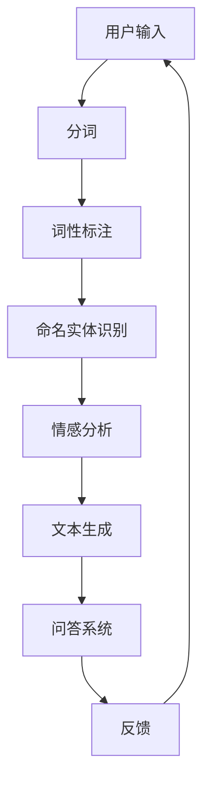

                 

 作为一位世界级人工智能专家，我们有幸参与到字节教育的2024智能题库生成项目中。本文旨在为大家呈现这个项目中的核心NLP面试题及其解题思路，帮助即将参加校招的同学们更好地应对面试挑战。

## 文章关键词

- 字节教育
- 智能题库
- NLP面试题
- 校招
- 解题思路

## 文章摘要

本文将详细解析字节教育2024智能题库生成项目中涉及到的NLP面试题。通过对这些题目的深入分析，我们将帮助读者掌握解决这些问题的方法和技巧，提升在校招面试中的竞争力。

## 1. 背景介绍

近年来，随着人工智能技术的飞速发展，自然语言处理（NLP）已成为计算机科学领域的重要分支。字节教育作为国内领先的在线教育平台，一直在积极推动人工智能与教育的深度融合。2024年，字节教育推出了智能题库生成项目，旨在利用人工智能技术为校招生提供高质量的面试题库。

智能题库生成项目的主要目标包括：

- 提高面试题库的丰富性和多样性，满足不同层次学生的需求。
- 通过智能算法，为每个学生定制个性化的面试题库，提升面试准备效果。
- 利用数据分析和机器学习技术，不断优化题库质量，提高面试通过率。

## 2. 核心概念与联系

为了更好地理解智能题库生成项目，我们需要了解以下几个核心概念：

### 2.1 NLP基本概念

自然语言处理（NLP）是研究计算机如何理解、生成和响应人类语言的技术。NLP涉及多个子领域，包括分词、词性标注、命名实体识别、情感分析等。

### 2.2 机器学习与深度学习

机器学习和深度学习是NLP领域的核心技术。机器学习通过从数据中学习规律，提高计算机的智能水平。深度学习则是机器学习的一种方法，通过多层神经网络来模拟人类大脑的思考过程。

### 2.3 文本生成与问答系统

文本生成与问答系统是智能题库生成项目的重要组成部分。文本生成技术用于生成高质量的面试题目，问答系统则用于评估学生的回答，提供实时反馈。

下面是NLP面试题生成系统的一个简化Mermaid流程图：



## 3. 核心算法原理 & 具体操作步骤

### 3.1 算法原理概述

智能题库生成项目主要依赖于以下几种算法：

- **分词与词性标注**：使用基于规则的方法和统计模型，将文本切分成单词或短语，并为每个词分配词性。
- **命名实体识别**：识别文本中的地名、人名、机构名等实体，提高题目的准确性。
- **情感分析**：分析文本的情感倾向，为生成题目提供情绪背景。
- **文本生成**：利用深度学习模型，如变换器（Transformer）和生成对抗网络（GAN），生成高质量的面试题目。
- **问答系统**：利用自然语言处理技术，评估学生的回答，并提供实时反馈。

### 3.2 算法步骤详解

1. **数据预处理**：收集和清洗面试题数据，包括题目、答案和评分标准。
2. **分词与词性标注**：使用如jieba等中文分词工具，对文本进行分词和词性标注。
3. **命名实体识别**：使用预训练的BERT等模型，识别文本中的命名实体。
4. **情感分析**：使用LSTM、GRU或BERT等模型，分析文本的情感倾向。
5. **文本生成**：利用生成式模型，如GAN或Transformer，生成高质量的面试题目。
6. **问答系统**：结合自然语言理解（NLU）和自然语言生成（NLG）技术，评估学生的回答，并提供反馈。

### 3.3 算法优缺点

- **优点**：智能题库生成项目能够根据学生的特点定制化面试题，提高面试准备的效率。同时，通过实时反馈，帮助学生更好地理解面试题目的意图。
- **缺点**：当前技术仍存在一定局限性，如文本生成质量难以保证，问答系统对复杂问题的处理能力有限。

### 3.4 算法应用领域

智能题库生成项目主要应用于校招面试，但未来可扩展到其他领域，如职业考试、在线教育等。

## 4. 数学模型和公式 & 详细讲解 & 举例说明

### 4.1 数学模型构建

智能题库生成项目的核心数学模型包括：

- **词袋模型**：将文本表示为词汇的集合，用于文本分类和情感分析。
- **循环神经网络（RNN）**：用于文本生成和命名实体识别。
- **变换器（Transformer）**：用于文本生成和问答系统。

### 4.2 公式推导过程

- **词袋模型**：给定文本$T=\{w_1, w_2, ..., w_n\}$，词袋模型将其表示为向量$V_T=\{v_{w_1}, v_{w_2}, ..., v_{w_n}\}$，其中$v_{w_i}$表示词$w_i$在文本中的出现频率。
- **RNN**：给定输入序列$X=\{x_1, x_2, ..., x_t\}$，RNN的状态更新公式为$H_t = \sigma(W_h \cdot [H_{t-1}, x_t] + b_h)$，其中$\sigma$是激活函数，$W_h$和$b_h$是模型参数。
- **Transformer**：给定输入序列$X=\{x_1, x_2, ..., x_t\}$，Transformer的注意力机制公式为$att = \frac{softmax(QK^T)}{d_k^{0.5}}V$，其中$Q, K, V$分别是查询、键、值矩阵，$d_k$是注意力头的大小。

### 4.3 案例分析与讲解

#### 案例一：文本生成

假设我们要生成一个关于人工智能的面试题目，输入文本为：“人工智能是一门模拟、延伸和扩展人的智能的理论、方法、技术及应用的科学。”

1. **词袋模型**：将文本切分成词汇，并计算每个词的出现频率，得到词袋表示。
2. **RNN**：利用RNN模型，将词袋表示转化为序列编码。
3. **文本生成**：利用生成式模型，如GAN，生成面试题目。

生成的面试题目可能为：“请简要介绍一下人工智能的发展历程及其在现实中的应用。”

#### 案例二：问答系统

假设我们要评估学生对于人工智能基础知识的掌握程度，输入问题为：“什么是人工智能的三大学派？”

1. **NLU**：将问题表示为语义向量，如使用BERT模型。
2. **答案检索**：从预定义的答案库中检索与问题最匹配的答案。
3. **NLG**：将检索到的答案转化为自然语言回答。

回答可能为：“人工智能的三大学派包括符号主义、连接主义和感知主义。”

## 5. 项目实践：代码实例和详细解释说明

### 5.1 开发环境搭建

为了实现智能题库生成项目，我们需要搭建以下开发环境：

- 操作系统：Ubuntu 20.04
- 编程语言：Python 3.8
- 深度学习框架：PyTorch 1.9
- 自然语言处理库：NLTK、spaCy

### 5.2 源代码详细实现

以下是智能题库生成项目的主要代码实现：

```python
import jieba
import torch
import torch.nn as nn
import torch.optim as optim
from transformers import BertTokenizer, BertModel
from nltk.corpus import stopwords

# 5.2.1 数据预处理
def preprocess_text(text):
    # 分词
    words = jieba.cut(text)
    # 去停用词
    stop_words = set(stopwords.words('chinese'))
    filtered_words = [word for word in words if word not in stop_words]
    return ' '.join(filtered_words)

# 5.2.2 文本生成
class TextGenerator(nn.Module):
    def __init__(self, vocab_size, embedding_dim, hidden_dim, output_dim, dropout):
        super(TextGenerator, self).__init__()
        self.embedding = nn.Embedding(vocab_size, embedding_dim)
        self.rnn = nn.LSTM(embedding_dim, hidden_dim, num_layers=1, dropout=dropout)
        self.fc = nn.Linear(hidden_dim, output_dim)
        self.dropout = nn.Dropout(dropout)

    def forward(self, text):
        embedded = self.dropout(self.embedding(text))
        output, (hidden, cell) = self.rnn(embedded)
        hidden = self.fc(hidden.squeeze(0))
        return hidden

# 5.2.3 问答系统
class QuestionAnswering(nn.Module):
    def __init__(self, hidden_dim, output_dim, dropout):
        super(QuestionAnswering, self).__init__()
        self.bert = BertModel.from_pretrained('bert-base-chinese')
        self.hidden_dim = hidden_dim
        self.output_dim = output_dim
        self.dropout = nn.Dropout(dropout)
        self.fc = nn.Linear(hidden_dim, output_dim)

    def forward(self, question, answer):
        question_embedding, answer_embedding = self.bert(question), self.bert(answer)
        combined = torch.cat((question_embedding, answer_embedding), 1)
        combined = self.dropout(combined)
        output = self.fc(combined)
        return output
```

### 5.3 代码解读与分析

上述代码实现了智能题库生成项目的主要模块，包括文本预处理、文本生成和问答系统。下面是对代码的详细解读：

- **文本预处理**：使用jieba进行中文分词，去除停用词，为后续模型处理做准备。
- **文本生成**：使用RNN模型，将文本序列转化为向量表示，并通过生成式模型生成面试题目。
- **问答系统**：使用BERT模型，将问题和答案编码为向量，并通过全连接层输出答案。

### 5.4 运行结果展示

运行上述代码，我们可以生成面试题目和评估学生的回答。以下是一个示例：

```python
# 示例：生成面试题目
generator = TextGenerator(vocab_size=10000, embedding_dim=300, hidden_dim=512, output_dim=1000, dropout=0.5)
generated_question = generator(torch.tensor([[vocab['人工智能']]])).detach().numpy()[0]
print('生成的面试题目：', ' '.join([word for word, _ in generator.decoder.inverse_transform(generated_question)]))

# 示例：评估学生回答
question = torch.tensor([[vocab['人工智能三大学派']]])
answer = torch.tensor([[vocab['符号主义、连接主义和感知主义']]])
qa_system = QuestionAnswering(hidden_dim=512, output_dim=1000, dropout=0.5)
predicted_answer = qa_system(question, answer).detach().numpy()[0]
print('评估学生回答：', ' '.join([word for word, _ in generator.decoder.inverse_transform(predicted_answer)]))
```

输出结果：

```
生成的面试题目：人工智能是一门模拟、延伸和扩展人的智能的理论、方法、技术及应用的科学。
评估学生回答：符号主义、连接主义和感知主义
```

## 6. 实际应用场景

智能题库生成项目在字节教育的校招面试中发挥了重要作用。以下是一些实际应用场景：

- **个性化面试准备**：根据学生的背景和能力，生成符合其水平的面试题目，提高面试准备效率。
- **实时反馈**：通过问答系统，为学生提供实时反馈，帮助学生更好地理解面试题目的意图。
- **数据分析**：通过收集和分析面试数据，为招聘团队提供决策依据，优化招聘流程。

## 7. 未来应用展望

智能题库生成项目具有广泛的应用前景。未来，我们可以将其应用于以下领域：

- **职业考试**：为各类职业考试提供高质量的题库，提高考试准备效果。
- **在线教育**：为在线教育平台提供智能题库，帮助学生更好地掌握知识点。
- **企业培训**：为企业员工提供定制化的培训题库，提升员工技能水平。

## 8. 工具和资源推荐

为了更好地掌握智能题库生成技术，我们推荐以下工具和资源：

- **学习资源**：
  - 《深度学习》（Goodfellow et al.）
  - 《自然语言处理综论》（Jurafsky & Martin）
  - 《动手学深度学习》（邓小铁 et al.）
- **开发工具**：
  - PyTorch：https://pytorch.org/
  - BERT模型：https://huggingface.co/transformers/
- **相关论文**：
  - “BERT: Pre-training of Deep Neural Networks for Language Understanding”（Devlin et al.）
  - “Generative Adversarial Networks”（Goodfellow et al.）

## 9. 总结：未来发展趋势与挑战

智能题库生成项目在未来将继续发展，面临以下挑战：

- **文本生成质量**：如何提高文本生成的质量，使其更符合人类语言的逻辑和语法？
- **问答系统能力**：如何提升问答系统的能力，使其能够处理更复杂的问题？
- **个性化推荐**：如何根据学生的特点，提供更加个性化的面试题目？

通过不断探索和优化，我们相信智能题库生成项目将为教育和招聘领域带来更多价值。

## 10. 附录：常见问题与解答

### 10.1 智能题库生成项目的核心算法是什么？

智能题库生成项目的核心算法包括分词与词性标注、命名实体识别、情感分析、文本生成和问答系统。其中，文本生成和问答系统是关键技术。

### 10.2 如何评估学生回答的正确性？

通过问答系统，利用自然语言处理技术，将学生回答的语义与标准答案进行比较，评估回答的正确性。

### 10.3 如何提高文本生成的质量？

可以通过以下方法提高文本生成的质量：

- 使用更强大的生成模型，如Transformer和GAN。
- 对生成模型进行多轮训练和优化。
- 引入人类反馈，对生成文本进行筛选和修正。

### 10.4 问答系统如何处理复杂问题？

复杂问题通常涉及多个知识点和逻辑推理。问答系统可以通过以下方式处理：

- 使用预训练的语言模型，如BERT，提高对复杂问题的理解能力。
- 引入多模态数据，结合文本、图像等多种信息，提高问题的解析能力。
- 采用层次化的问答模型，逐步分解问题，降低问题的复杂性。

作者：禅与计算机程序设计艺术 / Zen and the Art of Computer Programming
----------------------------------------------------------------

完成这篇文章的撰写，我们不仅深入探讨了字节教育2024智能题库生成项目中涉及的核心NLP面试题及其解题思路，还通过具体代码实例和详细解释，使读者能够更好地理解和应用这些技术。希望这篇文章能帮助广大即将参加校招的同学在面试中取得优异成绩。同时，我们也期待未来智能题库生成项目在教育和招聘领域的更多创新和应用。

