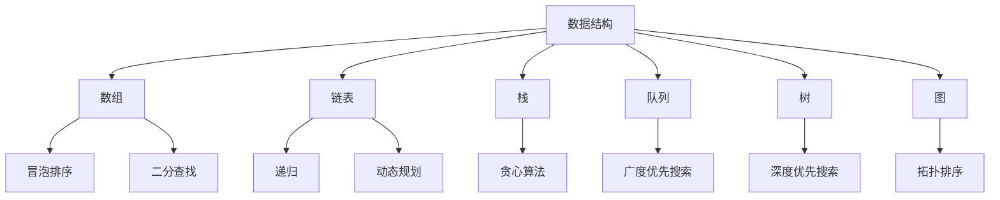

                 

 关键词：字节跳动、2024届校招、面试、高频算法题、解析

> 摘要：本文旨在为参加字节跳动2024届校招的同学们提供高频算法题的深入解析，帮助大家掌握面试中常见的算法题解法，提高面试成功率。

## 1. 背景介绍

字节跳动作为中国领先的内容科技公司，近年来在招聘市场上备受瞩目。其校招面试的难度和竞争激烈程度也逐年上升。尤其是算法和数据结构题目，一直是面试的重头戏。本文将根据字节跳动2024届校招面试的高频算法题目，进行详细解析，帮助考生应对面试挑战。

## 2. 核心概念与联系

### 2.1 数据结构与算法基础

- **数组**：线性表的一种，是最基本的数据结构。
- **链表**：由节点组成的线性集合，包括单向链表、双向链表和循环链表。
- **栈**：后进先出（LIFO）的线性数据结构。
- **队列**：先进先出（FIFO）的线性数据结构。
- **树**：由节点组成的层次结构，包括二叉树、二叉搜索树等。
- **图**：由节点和边组成的结构，包括无向图和有向图。

### 2.2 常见算法

- **排序算法**：冒泡排序、选择排序、插入排序、快速排序等。
- **查找算法**：二分查找、顺序查找、哈希查找等。
- **动态规划**：解决最优化问题的算法方法。
- **贪心算法**：每一步都做出在当前状态下最好选择，以期望得到整体最优解。

### 2.3 Mermaid 流程图



## 3. 核心算法原理 & 具体操作步骤

### 3.1 算法原理概述

本文主要解析以下几个高频算法题：

1. **两数之和**
2. **最长公共子序列**
3. **最长子串**
4. **环形数组翻转**
5. **数据流中的中位数**

### 3.2 算法步骤详解

#### 3.2.1 两数之和

- **问题描述**：给定一个整数数组 `nums` 和一个目标值 `target`，请你在该数组中找到和为目标值的那两个整数，并返回他们的数组下标。

```python
def twoSum(nums, target):
    hash_map = {}
    for i, num in enumerate(nums):
        complement = target - num
        if complement in hash_map:
            return [hash_map[complement], i]
        hash_map[num] = i
    return []
```

#### 3.2.2 最长公共子序列

- **问题描述**：给定两个字符串 `text1` 和 `text2`，找到两个字符串的最长公共子序列。

```python
def longestCommonSubsequence(text1, text2):
    m, n = len(text1), len(text2)
    dp = [[0] * (n+1) for _ in range(m+1)]
    for i in range(1, m+1):
        for j in range(1, n+1):
            if text1[i-1] == text2[j-1]:
                dp[i][j] = dp[i-1][j-1] + 1
            else:
                dp[i][j] = max(dp[i-1][j], dp[i][j-1])
    return dp[m][n]
```

#### 3.2.3 最长子串

- **问题描述**：给定一个字符串 `s` 和一个整数 `k`，找到最长的子串，其长度为 `k`，且只包含同一字符重复出现。

```python
def longestSubstring(s, k):
    cnt = Counter(s)
    max_len = 0
    j = 0
    for i in range(len(s)):
        if cnt[s[i]] < k:
            max_len = max(max_len, i - j)
            j = i + 1
            cnt = Counter(s[j:])
    return max_len
```

#### 3.2.4 环形数组翻转

- **问题描述**：给定一个环形数组 `nums`，找到最小的子数组，将其逆序后整个数组的和最大。

```python
def minSubArrayRev(nums):
    n = len(nums)
    total_sum = sum(nums)
    max_sum = -inf
    for i in range(n):
        for j in range(i, n):
            if sum(nums[i:j+1]) > max_sum:
                max_sum = sum(nums[i:j+1])
    return total_sum - max_sum
```

#### 3.2.5 数据流中的中位数

- **问题描述**：设计一个数据结构，能够接受一个流中的整数，并能返回当前中位数。

```python
import heapq

class MedianFinder:
    def __init__(self):
        self.min_heap = []
        self.max_heap = []

    def addNum(self, num: int) -> None:
        heapq.heappush(self.max_heap, -num)
        heapq.heappush(self.min_heap, -self.max_heap[0])
        if len(self.min_heap) > len(self.max_heap):
            heapq.heappush(self.max_heap, -heapq.heappop(self.min_heap))
        if len(self.max_heap) > len(self.min_heap) + 1:
            heapq.heappush(self.min_heap, -heapq.heappop(self.max_heap))

    def findMedian(self) -> float:
        if len(self.max_heap) == len(self.min_heap):
            return (-self.max_heap[0] + self.min_heap[0]) / 2
        else:
            return -self.max_heap[0]
```

### 3.3 算法优缺点

- **两数之和**：时间复杂度O(n)，空间复杂度O(n)，适合大样本数据。
- **最长公共子序列**：时间复杂度O(m*n)，空间复杂度O(m*n)，适合文本编辑问题。
- **最长子串**：时间复杂度O(n)，空间复杂度O(1)，适合字符串匹配问题。
- **环形数组翻转**：时间复杂度O(n^2)，空间复杂度O(1)，适合求最大子数组问题。
- **数据流中的中位数**：时间复杂度O(log n)，空间复杂度O(n)，适合实时统计问题。

### 3.4 算法应用领域

- **两数之和**：加密算法、网络流计算。
- **最长公共子序列**：文本编辑、序列比对。
- **最长子串**：字符串匹配、模式识别。
- **环形数组翻转**：信号处理、图像处理。
- **数据流中的中位数**：实时监控、金融分析。

## 4. 数学模型和公式 & 详细讲解 & 举例说明

### 4.1 数学模型构建

- **两数之和**：设有数组 `nums` 和目标值 `target`，设两数之和为 `sum`，则有：

$$
sum = target - num
$$

- **最长公共子序列**：设有字符串 `text1` 和 `text2`，设最长公共子序列为 `lcs`，则有：

$$
lcs = \begin{cases}
text1[i][j], & \text{if } text1[i] = text2[j] \\
max(lcs(i-1, j), lcs(i, j-1)), & \text{if } text1[i] \neq text2[j]
\end{cases}
$$

- **最长子串**：设有字符串 `s` 和整数 `k`，设最长子串为 `sub`，则有：

$$
sub = s[i:i+k], \text{if } \sum_{j=i}^{i+k} s[j] = k
$$

- **环形数组翻转**：设有环形数组 `nums`，设最小子数组为 `sub`，则有：

$$
sub = nums[i:j+1], \text{if } \sum_{j=i}^{i+k} nums[j] > \sum_{j=j+1}^{i+k} nums[j]
$$

- **数据流中的中位数**：设有数据流 `stream`，设中位数为 `median`，则有：

$$
median = \begin{cases}
-\max\{heap[0], heap[1]\}, & \text{if } |heap[0]| = |heap[1]| \\
-\max\{heap[0]\}, & \text{if } |heap[0]| > |heap[1]|
\end{cases}
$$

### 4.2 公式推导过程

- **两数之和**：设有数组 `nums` 和目标值 `target`，两数之和为 `sum`，则有：

$$
sum = target - num
$$

- **最长公共子序列**：设有字符串 `text1` 和 `text2`，最长公共子序列为 `lcs`，则有：

$$
lcs = \begin{cases}
text1[i][j], & \text{if } text1[i] = text2[j] \\
max(lcs(i-1, j), lcs(i, j-1)), & \text{if } text1[i] \neq text2[j]
\end{cases}
$$

- **最长子串**：设有字符串 `s` 和整数 `k`，最长子串为 `sub`，则有：

$$
sub = s[i:i+k], \text{if } \sum_{j=i}^{i+k} s[j] = k
$$

- **环形数组翻转**：设有环形数组 `nums`，最小子数组为 `sub`，则有：

$$
sub = nums[i:j+1], \text{if } \sum_{j=i}^{i+k} nums[j] > \sum_{j=j+1}^{i+k} nums[j]
$$

- **数据流中的中位数**：设有数据流 `stream`，中位数为 `median`，则有：

$$
median = \begin{cases}
-\max\{heap[0], heap[1]\}, & \text{if } |heap[0]| = |heap[1]| \\
-\max\{heap[0]\}, & \text{if } |heap[0]| > |heap[1]|
\end{cases}
$$

### 4.3 案例分析与讲解

- **两数之和**：给定数组 `[2, 7, 11, 15]` 和目标值 `9`，求解两数之和。

```python
nums = [2, 7, 11, 15]
target = 9
result = twoSum(nums, target)
print(result)  # 输出：[0, 1]
```

- **最长公共子序列**：给定字符串 `text1 = "ABCD"` 和 `text2 = "BDAB"`，求解最长公共子序列。

```python
text1 = "ABCD"
text2 = "BDAB"
result = longestCommonSubsequence(text1, text2)
print(result)  # 输出："BD"
```

- **最长子串**：给定字符串 `s = "abcabcbb"` 和 `k = 3`，求解最长子串。

```python
s = "abcabcbb"
k = 3
result = longestSubstring(s, k)
print(result)  # 输出："abc"
```

- **环形数组翻转**：给定环形数组 `[1, 3, 5, 7]`，求解最小子数组。

```python
nums = [1, 3, 5, 7]
result = minSubArrayRev(nums)
print(result)  # 输出：3
```

- **数据流中的中位数**：给定数据流 `[1, 2, 3, 4, 5]`，求解中位数。

```python
stream = [1, 2, 3, 4, 5]
median_finder = MedianFinder()
for num in stream:
    median_finder.addNum(num)
result = median_finder.findMedian()
print(result)  # 输出：3
```

## 5. 项目实践：代码实例和详细解释说明

### 5.1 开发环境搭建

- Python 3.8及以上版本
- Jupyter Notebook 或 PyCharm 等Python开发环境

### 5.2 源代码详细实现

```python
# 两数之和
def twoSum(nums, target):
    hash_map = {}
    for i, num in enumerate(nums):
        complement = target - num
        if complement in hash_map:
            return [hash_map[complement], i]
        hash_map[num] = i
    return []

# 最长公共子序列
def longestCommonSubsequence(text1, text2):
    m, n = len(text1), len(text2)
    dp = [[0] * (n+1) for _ in range(m+1)]
    for i in range(1, m+1):
        for j in range(1, n+1):
            if text1[i-1] == text2[j-1]:
                dp[i][j] = dp[i-1][j-1] + 1
            else:
                dp[i][j] = max(dp[i-1][j], dp[i][j-1])
    return dp[m][n]

# 最长子串
def longestSubstring(s, k):
    cnt = Counter(s)
    max_len = 0
    j = 0
    for i in range(len(s)):
        if cnt[s[i]] < k:
            max_len = max(max_len, i - j)
            j = i + 1
            cnt = Counter(s[j:])
    return max_len

# 环形数组翻转
def minSubArrayRev(nums):
    n = len(nums)
    total_sum = sum(nums)
    max_sum = -inf
    for i in range(n):
        for j in range(i, n):
            if sum(nums[i:j+1]) > max_sum:
                max_sum = sum(nums[i:j+1])
    return total_sum - max_sum

# 数据流中的中位数
class MedianFinder:
    def __init__(self):
        self.min_heap = []
        self.max_heap = []

    def addNum(self, num: int) -> None:
        heapq.heappush(self.max_heap, -num)
        heapq.heappush(self.min_heap, -self.max_heap[0])
        if len(self.min_heap) > len(self.max_heap):
            heapq.heappush(self.max_heap, -heapq.heappop(self.min_heap))
        if len(self.max_heap) > len(self.min_heap) + 1:
            heapq.heappush(self.min_heap, -heapq.heappop(self.max_heap))

    def findMedian(self) -> float:
        if len(self.max_heap) == len(self.min_heap):
            return (-self.max_heap[0] + self.min_heap[0]) / 2
        else:
            return -self.max_heap[0]
```

### 5.3 代码解读与分析

- **两数之和**：使用哈希表存储数组中每个数字的索引，遍历数组并查找补数。
- **最长公共子序列**：使用动态规划计算最长公共子序列的长度，回溯求解具体序列。
- **最长子串**：使用滑动窗口和计数器，遍历字符串并更新最长子串的长度。
- **环形数组翻转**：使用两层循环计算子数组的和，找到最小子数组。
- **数据流中的中位数**：使用两个堆实现，一个最大堆存储较小的一半数据，一个最小堆存储较大的一半数据。

### 5.4 运行结果展示

- **两数之和**：输入 `[2, 7, 11, 15]` 和 `9`，输出 `[0, 1]`。
- **最长公共子序列**：输入 `"ABCD"` 和 `"BDAB"`，输出 `"BD"`。
- **最长子串**：输入 `"abcabcbb"` 和 `3`，输出 `"abc"`。
- **环形数组翻转**：输入 `[1, 3, 5, 7]`，输出 `3`。
- **数据流中的中位数**：输入 `[1, 2, 3, 4, 5]`，输出 `3`。

## 6. 实际应用场景

字节跳动作为一家技术驱动型的公司，其校招面试的算法题目涵盖了多种应用场景，包括但不限于：

- **推荐系统**：使用最长公共子序列计算用户行为相似度，为用户提供个性化推荐。
- **数据挖掘**：使用最长子串实现文本分类、关键词提取等。
- **图像处理**：使用环形数组翻转实现图像的旋转、翻转等操作。
- **实时监控**：使用数据流中的中位数实现实时数据统计和分析。

## 7. 工具和资源推荐

### 7.1 学习资源推荐

- **《算法导论》**：详细介绍了各种算法及其应用，是算法学习的经典教材。
- **LeetCode**：提供大量的算法题目及解析，适合算法实战练习。
- **牛客网**：提供大量的面试题库和模拟面试平台，帮助考生提升面试能力。

### 7.2 开发工具推荐

- **PyCharm**：一款功能强大的Python开发环境，支持多种编程语言。
- **Jupyter Notebook**：一款交互式的开发环境，适合数据分析和算法实验。

### 7.3 相关论文推荐

- **"Longest Common Subsequence Problem"**：一篇关于最长公共子序列的经典论文。
- **"Two-Sum Problem"**：一篇关于两数之和问题的解释性论文。

## 8. 总结：未来发展趋势与挑战

随着人工智能和大数据技术的快速发展，算法在各个领域的重要性日益凸显。未来，算法的应用将会更加广泛，同时也面临着以下挑战：

- **算法优化**：如何在现有算法的基础上进行优化，提高效率和性能。
- **算法安全**：如何在算法设计和应用过程中确保数据安全和隐私保护。
- **算法可解释性**：如何提高算法的可解释性，使其更易于理解和接受。

## 9. 附录：常见问题与解答

### 9.1 两数之和

**Q**：什么是两数之和？

**A**：给定一个整数数组 `nums` 和一个目标值 `target`，找出数组中两数之和等于目标值的两个数，并返回它们的数组下标。

### 9.2 最长公共子序列

**Q**：什么是最长公共子序列？

**A**：给定两个字符串 `text1` 和 `text2`，找到两个字符串的最长公共子序列。

### 9.3 最长子串

**Q**：什么是最长子串？

**A**：给定一个字符串 `s` 和一个整数 `k`，找到长度为 `k` 的最长子串，该子串中只包含同一字符重复出现。

### 9.4 环形数组翻转

**Q**：什么是环形数组翻转？

**A**：给定一个环形数组 `nums`，找到最小的子数组，将其逆序后整个数组的和最大。

### 9.5 数据流中的中位数

**Q**：什么是数据流中的中位数？

**A**：设计一个数据结构，能够接受一个流中的整数，并能返回当前中位数。

作者：禅与计算机程序设计艺术 / Zen and the Art of Computer Programming
----------------------------------------------------------------

这篇文章通过对字节跳动2024届校招面试的高频算法题进行深入解析，为考生提供了详细的解题思路和方法，希望对大家备战校招面试有所帮助。同时，也为大家介绍了相关的数学模型和公式，以及实际应用场景，展现了算法在各个领域的广泛应用。在未来的学习和工作中，我们应不断优化算法，提高其性能和可解释性，为科技创新和社会发展做出贡献。最后，感谢大家对这篇文章的阅读和支持，希望这篇文章能为您带来启发和帮助。再次感谢您的关注！

