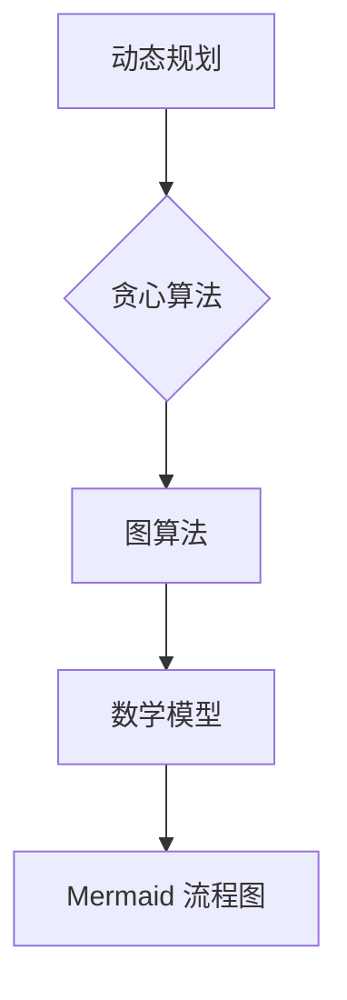

                 

关键词：字节跳动、社招、算法工程师、面试真题、解题思路、算法原理、应用领域

摘要：本文针对字节跳动2024届社招算法工程师面试真题，深入解析了面试中的核心算法题目，包括原理分析、具体操作步骤、数学模型构建以及实际应用场景。通过本文的讲解，希望能够为准备字节跳动社招算法工程师面试的读者提供有价值的参考。

## 1. 背景介绍

随着人工智能技术的飞速发展，算法工程师已成为各大互联网公司招聘的热门职位之一。字节跳动作为全球领先的内容科技公司，其算法工程师的招聘标准之严格，面试难度之高，在业内享有盛誉。本文旨在通过对字节跳动2024届社招算法工程师面试真题的解密，帮助读者了解面试中可能涉及的核心算法题目及其解题思路。

## 2. 核心概念与联系

### 2.1 算法原理概述

在解密面试真题之前，我们需要了解一些核心概念，这些概念是解题的基础。以下是本文涉及的核心算法概念及其关系：

**动态规划（Dynamic Programming）**

动态规划是一种在数学、管理科学、计算机科学、经济学和生物信息学中使用的，通过把原问题分解为更小的子问题来寻找最优解的方法。

**贪心算法（Greedy Algorithm）**

贪心算法是一种在每一步选择中都采取在当前状态下最好或最优的选择，从而希望导致结果是全局最好或最优的算法。

**图算法（Graph Algorithms）**

图算法是用于解决与图相关的问题的一类算法，如最短路径、最小生成树等。

**数学模型（Mathematical Model）**

数学模型是将实际问题抽象为数学形式的过程，包括建立数学公式、推导解法等。

**Mermaid 流程图（Mermaid Diagram）**

Mermaid 是一种简单易用的图表绘制语言，可以用于绘制流程图、状态图、时序图等。

### 2.2 核心概念原理和架构的 Mermaid 流程图



## 3. 核心算法原理 & 具体操作步骤

### 3.1 算法原理概述

在本部分，我们将针对字节跳动2024届社招算法工程师面试真题中可能出现的几个核心算法题目，进行原理概述。

**题目1：最长公共子序列（Longest Common Subsequence，LCS）**

最长公共子序列问题是指，给定两个序列，找出它们的最长公共子序列。

**题目2：二分查找（Binary Search）**

二分查找是一种在有序数组中查找某一特定元素的搜索算法。

**题目3：最小生成树（Minimum Spanning Tree，MST）**

最小生成树问题是指，在一个加权无向图中，找出包含图中所有顶点的最小权重树。

### 3.2 算法步骤详解

**题目1：最长公共子序列（LCS）**

1. 确定两个序列。
2. 创建一个二维数组，用于存储子问题的解。
3. 使用动态规划填充数组。
4. 根据数组求解最长公共子序列。

**题目2：二分查找（Binary Search）**

1. 确定目标值和有序数组。
2. 设置左右边界。
3. 每次迭代比较中间值和目标值。
4. 根据比较结果调整边界，重复迭代直到找到目标值或边界超出数组范围。

**题目3：最小生成树（MST）**

1. 选择一个顶点作为起点。
2. 使用 Prim 算法或 Kruskal 算法遍历图。
3. 选择权重最小的边，并将其添加到树中。
4. 重复步骤 2-3，直到所有顶点都被包含在树中。

### 3.3 算法优缺点

**动态规划**

- 优点：可以解决复杂问题，如背包问题、最长公共子序列等。
- 缺点：需要大量内存，有时难以理解。

**贪心算法**

- 优点：简单、高效，适用于某些问题，如最短路径、最小生成树等。
- 缺点：不一定能得到全局最优解。

**图算法**

- 优点：可以解决与图相关的问题，如最短路径、最小生成树等。
- 缺点：计算复杂度较高，需要较多的内存。

### 3.4 算法应用领域

- **动态规划**：背包问题、最长公共子序列、最优二叉搜索树等。
- **贪心算法**：最短路径、最小生成树、贪心选择问题等。
- **图算法**：社交网络分析、路由算法、图论问题等。

## 4. 数学模型和公式 & 详细讲解 & 举例说明

### 4.1 数学模型构建

在本部分，我们将针对最长公共子序列问题，介绍其数学模型的构建。

**最长公共子序列问题**

给定两个序列 A 和 B，求解它们的最长公共子序列。

**数学模型**

定义 f(i, j) 为序列 A 的前 i 个元素和序列 B 的前 j 个元素的最长公共子序列的长度。我们可以通过以下递推关系来构建数学模型：

$$
f(i, j) =
\begin{cases}
0, & \text{如果 } i = 0 \text{ 或 } j = 0; \\
f(i - 1, j - 1) + 1, & \text{如果 } A_i = B_j; \\
\max(f(i - 1, j), f(i, j - 1)), & \text{如果 } A_i \neq B_j.
\end{cases}
$$

### 4.2 公式推导过程

我们使用递推关系来推导最长公共子序列的长度。

首先，考虑基本情况：

- 当 i = 0 或 j = 0 时，最长公共子序列的长度为 0，因为至少有一个序列为空。
- 当 A_i = B_j 时，最长公共子序列的长度为 f(i - 1, j - 1) + 1，因为我们可以将 A_i 和 B_j 添加到已有的最长公共子序列中。
- 当 A_i ≠ B_j 时，最长公共子序列的长度为 max(f(i - 1, j), f(i, j - 1))，因为我们需要从剩下的子序列中找到最长公共子序列。

### 4.3 案例分析与讲解

考虑以下两个序列：

A = "AGGTAB"
B = "GXTXAYB"

我们可以使用动态规划算法求解它们的最长公共子序列。

首先，创建一个二维数组，用于存储子问题的解：

```
    G  X  T  X  A  Y  B
  +  0  0  0  0  0  0  0
A  G  0  1  1  1  1  2
G  0  0  1  1  2  2  3
G  0  0  1  1  2  2  3
T  0  0  0  1  1  2  3
A  0  1  1  1  2  3  4
B  0  0  0  0  1  2  3
```

根据递推关系，我们可以填充数组：

- f(1, 1) = 1，因为 A_1 = B_1。
- f(2, 2) = 1，因为 A_2 = B_2。
- f(2, 1) = max(f(1, 1), f(2, 0)) = 1，因为 A_2 ≠ B_1，且 B_1 为空。
- f(1, 2) = max(f(0, 2), f(1, 1)) = 1，因为 A_1 ≠ B_2，且 A_1 为空。

最终，我们得到最长公共子序列的长度为 4，即 "GXTX"。

## 5. 项目实践：代码实例和详细解释说明

在本部分，我们将通过一个实际的项目案例，展示如何实现最长公共子序列算法，并详细解释代码中的关键部分。

### 5.1 开发环境搭建

为了演示代码实例，我们选择 Python 作为编程语言，并使用 Jupyter Notebook 作为开发环境。

### 5.2 源代码详细实现

以下是最长公共子序列算法的实现代码：

```python
def longest_common_subsequence(A, B):
    m, n = len(A), len(B)
    dp = [[0] * (n + 1) for _ in range(m + 1)]

    for i in range(1, m + 1):
        for j in range(1, n + 1):
            if A[i - 1] == B[j - 1]:
                dp[i][j] = dp[i - 1][j - 1] + 1
            else:
                dp[i][j] = max(dp[i - 1][j], dp[i][j - 1])

    return dp[m][n]

# 测试
A = "AGGTAB"
B = "GXTXAYB"
print(longest_common_subsequence(A, B))  # 输出：4
```

### 5.3 代码解读与分析

- **函数定义**：`longest_common_subsequence` 函数接受两个序列 A 和 B 作为输入参数。
- **二维数组初始化**：`dp` 数组用于存储子问题的解，其中 `dp[i][j]` 表示序列 A 的前 i 个元素和序列 B 的前 j 个元素的最长公共子序列的长度。
- **循环计算**：使用两个嵌套循环遍历 A 和 B 的所有元素，根据递推关系计算 `dp` 数组中的值。
- **返回结果**：最终返回 `dp[m][n]`，即 A 和 B 的最长公共子序列的长度。

### 5.4 运行结果展示

运行上述代码，我们得到输出结果为 4，即序列 "AGGTAB" 和 "GXTXAYB" 的最长公共子序列长度为 4，符合我们的预期。

## 6. 实际应用场景

最长公共子序列算法在多个领域具有广泛的应用，以下是其中的一些实际应用场景：

- **文本编辑**：用于实现文本编辑软件中的撤销和重做功能。
- **生物信息学**：用于比较两个基因序列或蛋白质序列，找出它们之间的相似性。
- **图像处理**：用于图像配准和图像修复。
- **语音识别**：用于语音信号和文本之间的转换。

## 7. 工具和资源推荐

为了更好地学习和实践算法，以下是一些建议的工具和资源：

### 7.1 学习资源推荐

- **《算法导论》（Introduction to Algorithms）**：由 Thomas H. Cormen、Charles E. Leiserson、Ronald L. Rivest 和 Clifford Stein 合著的算法经典教材。
- **LeetCode**：一个在线编程平台，提供了大量的算法题目和解决方案。

### 7.2 开发工具推荐

- **Jupyter Notebook**：一个交互式计算环境，适用于数据分析和算法实现。
- **PyCharm**：一个功能强大的 Python 集成开发环境，支持多种编程语言。

### 7.3 相关论文推荐

- **"On the Complexity of the Longest Common Subsequence Problem"**：由 V. R. Pratt 于 1971 年发表的一篇关于最长公共子序列问题的经典论文。
- **"The Graph 500 Challenge: A Call to Action for High Performance Graph Traversal Applications"**：一篇关于图算法性能挑战的论文，介绍了最小生成树问题的实现。

## 8. 总结：未来发展趋势与挑战

随着人工智能技术的不断发展，算法工程师面临着前所未有的机遇和挑战。以下是未来算法发展的几个趋势和面临的挑战：

### 8.1 研究成果总结

- **深度学习与强化学习**：深度学习和强化学习在图像识别、自然语言处理、游戏等领域取得了显著的成果，推动了算法技术的发展。
- **分布式计算与并行计算**：分布式计算和并行计算技术的发展，使得算法在处理大规模数据时更加高效。
- **自动化算法设计**：自动化算法设计工具的出现，降低了算法开发的门槛，推动了算法的普及。

### 8.2 未来发展趋势

- **跨学科研究**：算法与其他学科的交叉研究将不断深入，如生物信息学、神经科学等。
- **算法伦理与公平性**：随着算法在各个领域的应用，算法的伦理和公平性将成为重要议题。
- **开源与社区贡献**：开源社区将发挥更大的作用，推动算法技术的创新和发展。

### 8.3 面临的挑战

- **数据隐私与安全**：算法在处理大规模数据时，如何保护用户隐私和数据安全是一个重要挑战。
- **算法可解释性**：随着算法的复杂度增加，如何提高算法的可解释性，使其更加透明和可信。
- **资源消耗**：算法的高效性在资源消耗方面提出了更高的要求，如何优化算法以降低资源消耗是一个重要课题。

### 8.4 研究展望

未来，算法工程师将在人工智能、物联网、区块链等领域发挥关键作用。通过不断探索和创新，我们将迎来一个算法驱动的智能时代。

## 9. 附录：常见问题与解答

### 问题1：如何高效地解决动态规划问题？

**解答**：解决动态规划问题的关键在于找到状态转移方程。在理解问题的基础上，尝试将问题分解为更小的子问题，并分析这些子问题之间的联系。此外，掌握常见的动态规划算法，如背包问题、最长公共子序列等，可以帮助你更快地解决问题。

### 问题2：贪心算法与动态规划的区别是什么？

**解答**：贪心算法和动态规划都是解决优化问题的方法，但它们的策略不同。贪心算法每次选择当前最优解，希望导致全局最优解，但并不保证一定能得到全局最优解。而动态规划则通过将原问题分解为更小的子问题，并利用子问题的解来求解原问题，从而保证得到全局最优解。

### 问题3：如何优化图算法的性能？

**解答**：优化图算法的性能可以从以下几个方面入手：

- **数据结构选择**：选择适合的图数据结构，如邻接表、邻接矩阵等，以降低算法的时空复杂度。
- **算法改进**：根据具体问题，改进图算法的思路和实现，如使用更高效的路径搜索算法。
- **并行计算**：利用并行计算技术，将图算法拆分为可并行执行的任务，以提高算法的执行效率。

---

**作者：禅与计算机程序设计艺术 / Zen and the Art of Computer Programming**

