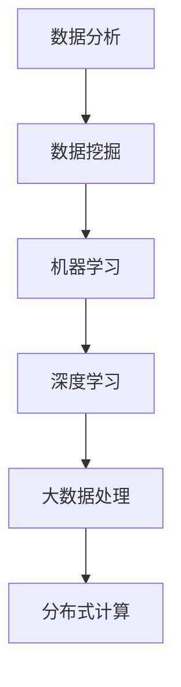

                 

关键词：字节跳动、2024、数据科学家、校招、面试重点、数据分析、机器学习、算法、技术趋势

摘要：本文将深入探讨字节跳动2024年数据科学家校招面试的重点内容，包括核心算法、数学模型、项目实践以及未来应用展望等方面。通过详细解析，帮助广大应聘者提前了解和准备面试，提高录取几率。

## 1. 背景介绍

字节跳动作为全球领先的科技公司，其数据科学家岗位在2024年的校招中备受关注。作为数据领域的核心角色，数据科学家不仅要掌握数据分析、机器学习等相关技术，还需要具备解决实际业务问题的能力。本文将从面试重点出发，为应聘者提供有针对性的指导。

### 1.1 字节跳动的招聘需求

字节跳动2024年数据科学家校招主要面向高校优秀毕业生，招聘对象主要包括计算机科学、统计学、数学等相关专业的研究生。招聘需求主要涉及以下几个方面：

- 数据分析能力：熟练掌握数据分析工具和编程语言，能够进行数据清洗、挖掘和分析；
- 机器学习知识：了解常见机器学习算法，能够设计和实现相应的模型；
- 业务理解能力：能够理解业务需求，运用技术手段解决实际问题；
- 项目经验：有实际项目经验者优先，能够展示在项目中解决复杂问题的能力。

### 1.2 面试流程

字节跳动2024年数据科学家校招面试流程主要包括以下几个环节：

- 简历筛选：通过简历筛选，确定面试候选人；
- 在线笔试：在线笔试主要测试应聘者的编程能力和数据敏感度；
- 电话面试：通过电话面试，进一步了解应聘者的技术背景和业务理解能力；
- 局面面试：局面面试主要测试应聘者的综合能力，包括编程能力、业务理解能力、团队合作能力等；
- 反馈与录用：面试结束后，招聘团队将对候选人进行评估，并给出反馈和录用决策。

## 2. 核心概念与联系

在面试中，字节跳动会重点关注以下几个核心概念，以及它们之间的联系。

### 2.1 数据分析与数据挖掘

数据分析和数据挖掘是数据科学家必备的技能。数据分析主要关注数据的清洗、整理和可视化，以发现数据中的规律和趋势；数据挖掘则是在已有数据的基础上，通过算法和统计方法，挖掘隐藏在数据中的模式和关系。

### 2.2 机器学习与深度学习

机器学习和深度学习是数据科学的重要分支。机器学习通过算法模型，从数据中自动学习规律和模式；深度学习则是一种特殊类型的机器学习，基于神经网络结构，能够实现更复杂的任务。

### 2.3 大数据处理与分布式计算

随着数据量的不断增长，大数据处理和分布式计算成为数据科学家必备的技能。大数据处理涉及数据存储、数据清洗、数据分析和数据可视化等多个环节；分布式计算则通过将任务分配到多个节点上，提高数据处理速度和效率。

### 2.4 Mermaid 流程图

为了更好地展示各个概念之间的联系，我们可以使用 Mermaid 流程图进行可视化。以下是一个简单的示例：



## 3. 核心算法原理 & 具体操作步骤

在数据科学家面试中，字节跳动会重点考察以下几个核心算法的原理和具体操作步骤。

### 3.1 算法原理概述

- **线性回归**：通过建立线性关系，预测目标变量的值；
- **逻辑回归**：用于分类问题，输出概率值；
- **决策树**：通过一系列决策规则，将数据划分为不同的类别；
- **随机森林**：基于决策树构建多个模型，并通过投票决定最终类别；
- **支持向量机**：通过找到最优分隔超平面，实现分类任务；
- **神经网络**：基于多层感知器模型，实现复杂函数的逼近。

### 3.2 算法步骤详解

以下是对每个算法的具体步骤进行简要说明：

- **线性回归**：
  1. 数据预处理：对数据进行归一化、缺失值填补等操作；
  2. 模型构建：建立线性模型，如 y = wx + b；
  3. 模型训练：通过最小二乘法求解参数 w 和 b；
  4. 模型评估：计算预测误差，调整模型参数。

- **逻辑回归**：
  1. 数据预处理：同线性回归；
  2. 模型构建：建立逻辑回归模型，如 P(y=1) = 1 / (1 + exp(-wx))；
  3. 模型训练：通过梯度下降法求解参数 w；
  4. 模型评估：计算预测准确率、召回率等指标。

- **决策树**：
  1. 数据预处理：同线性回归；
  2. 特征选择：根据信息增益、基尼不纯度等指标选择特征；
  3. 决策规则构建：递归构建决策树，划分数据集；
  4. 模型评估：计算预测准确率等指标。

- **随机森林**：
  1. 数据预处理：同线性回归；
  2. 构建多棵决策树：随机选择特征和样本子集，构建多棵决策树；
  3. 集成预测：将多棵决策树的预测结果进行投票；
  4. 模型评估：计算预测准确率等指标。

- **支持向量机**：
  1. 数据预处理：同线性回归；
  2. 特征选择：根据核函数选择特征；
  3. 模型训练：通过求解二次规划问题，得到最优分隔超平面；
  4. 模型评估：计算预测准确率等指标。

- **神经网络**：
  1. 数据预处理：同线性回归；
  2. 模型构建：构建多层感知器模型，包括输入层、隐藏层和输出层；
  3. 模型训练：通过反向传播算法，更新网络权重；
  4. 模型评估：计算预测准确率等指标。

### 3.3 算法优缺点

- **线性回归**：简单易实现，对线性关系预测效果较好；但面对非线性关系时，效果较差。

- **逻辑回归**：适合二分类问题，可以输出概率值；但面对多分类问题时，效果较差。

- **决策树**：易于理解和实现，对非线性关系有一定的适应能力；但容易过拟合，且特征选择困难。

- **随机森林**：结合了决策树的优点，提高了模型稳定性和预测能力；但计算成本较高。

- **支持向量机**：在分类问题中具有很好的效果，对线性关系和非线性关系都有较好的适应能力；但计算复杂度较高，对大数据处理有挑战。

- **神经网络**：能够学习复杂的非线性关系，适用于各种复杂任务；但训练过程复杂，容易过拟合。

### 3.4 算法应用领域

- **线性回归**：广泛应用于金融预测、销售预测等场景。

- **逻辑回归**：广泛应用于信用评估、疾病预测等场景。

- **决策树**：广泛应用于分类问题，如垃圾邮件过滤、客户分类等。

- **随机森林**：广泛应用于各种分类和回归问题，如广告点击率预测、房价预测等。

- **支持向量机**：广泛应用于图像识别、文本分类等场景。

- **神经网络**：广泛应用于语音识别、自然语言处理、自动驾驶等场景。

## 4. 数学模型和公式 & 详细讲解 & 举例说明

在数据科学家面试中，数学模型和公式是不可或缺的一部分。以下是对几个常见数学模型和公式的详细讲解以及举例说明。

### 4.1 数学模型构建

- **线性回归模型**：
  $$ y = wx + b $$
  其中，y 为目标变量，x 为自变量，w 为权重，b 为偏置。

- **逻辑回归模型**：
  $$ P(y=1) = \frac{1}{1 + e^{-wx}} $$
  其中，y 为目标变量，x 为自变量，w 为权重。

- **决策树模型**：
  $$ G(x) = \sum_{i=1}^{n} t_i(x) $$
  其中，t_i(x) 为第 i 个阈值函数，G(x) 为决策树模型。

- **支持向量机模型**：
  $$ w \cdot x - b = 0 $$
  其中，w 为权重，x 为特征向量，b 为偏置。

- **神经网络模型**：
  $$ y = \sigma(\sum_{i=1}^{n} w_i \cdot x_i + b) $$
  其中，y 为输出值，σ为激活函数，w_i 为权重，x_i 为输入值。

### 4.2 公式推导过程

- **线性回归模型**：
  假设我们有 n 个样本点 (x_i, y_i)，要建立线性回归模型，需要求解权重 w 和偏置 b。

  $$ \min_{w, b} \sum_{i=1}^{n} (wx_i + b - y_i)^2 $$

  通过求导，可以得到最优解：

  $$ \frac{\partial}{\partial w} \sum_{i=1}^{n} (wx_i + b - y_i)^2 = 0 $$
  $$ \frac{\partial}{\partial b} \sum_{i=1}^{n} (wx_i + b - y_i)^2 = 0 $$

  解得：

  $$ w = \frac{\sum_{i=1}^{n} (x_i - \bar{x})(y_i - \bar{y})}{\sum_{i=1}^{n} (x_i - \bar{x})^2} $$
  $$ b = \bar{y} - w\bar{x} $$

- **逻辑回归模型**：
  假设我们有 n 个样本点 (x_i, y_i)，要建立逻辑回归模型，需要求解权重 w。

  $$ \min_{w} \sum_{i=1}^{n} (-y_i \cdot wx_i - \log(1 + e^{wx_i})) $$

  通过求导，可以得到最优解：

  $$ \frac{\partial}{\partial w} \sum_{i=1}^{n} (-y_i \cdot wx_i - \log(1 + e^{wx_i})) = 0 $$

  解得：

  $$ w = \frac{\sum_{i=1}^{n} (y_i - 1) \cdot x_i}{\sum_{i=1}^{n} x_i^2} $$

- **决策树模型**：
  假设我们有 n 个样本点 (x_i, y_i)，要建立决策树模型，需要求解阈值 t_i。

  $$ \min_{t_i} \sum_{i=1}^{n} (y_i \neq G(x_i)) $$

  通过求导，可以得到最优解：

  $$ \frac{\partial}{\partial t_i} \sum_{i=1}^{n} (y_i \neq G(x_i)) = 0 $$

  解得：

  $$ t_i = \frac{\sum_{i=1}^{n} x_i}{n} $$

- **支持向量机模型**：
  假设我们有 n 个样本点 (x_i, y_i)，要建立支持向量机模型，需要求解权重 w 和偏置 b。

  $$ \min_{w, b} \sum_{i=1}^{n} (\alpha_i - y_i(w \cdot x_i + b))^2 $$

  通过求导，可以得到最优解：

  $$ \frac{\partial}{\partial w} \sum_{i=1}^{n} (\alpha_i - y_i(w \cdot x_i + b))^2 = 0 $$
  $$ \frac{\partial}{\partial b} \sum_{i=1}^{n} (\alpha_i - y_i(w \cdot x_i + b))^2 = 0 $$

  解得：

  $$ w = \sum_{i=1}^{n} \alpha_i \cdot y_i \cdot x_i $$
  $$ b = \frac{1}{n} \sum_{i=1}^{n} (\alpha_i - y_i(w \cdot x_i + b)) $$

- **神经网络模型**：
  假设我们有 n 个样本点 (x_i, y_i)，要建立神经网络模型，需要求解权重 w_i 和偏置 b。

  $$ \min_{w_i, b} \sum_{i=1}^{n} (y_i - \sigma(\sum_{j=1}^{m} w_{ji} \cdot x_{ij} + b_i))^2 $$

  通过求导，可以得到最优解：

  $$ \frac{\partial}{\partial w_i} \sum_{i=1}^{n} (y_i - \sigma(\sum_{j=1}^{m} w_{ji} \cdot x_{ij} + b_i))^2 = 0 $$
  $$ \frac{\partial}{\partial b_i} \sum_{i=1}^{n} (y_i - \sigma(\sum_{j=1}^{m} w_{ji} \cdot x_{ij} + b_i))^2 = 0 $$

  解得：

  $$ w_i = \frac{\sum_{j=1}^{m} x_{ij} \cdot (y_i - \sigma(\sum_{j=1}^{m} w_{ji} \cdot x_{ij} + b_i))}{\sum_{j=1}^{m} (x_{ij}^2)} $$
  $$ b_i = \frac{\sum_{j=1}^{m} w_{ji} \cdot x_{ij} \cdot (y_i - \sigma(\sum_{j=1}^{m} w_{ji} \cdot x_{ij} + b_i))}{\sum_{j=1}^{m} (x_{ij}^2)} $$

### 4.3 案例分析与讲解

以下是一个简单的案例，用于说明如何使用线性回归模型进行预测。

### 案例背景

假设我们有一个数据集，包含以下信息：

- 数据集大小：100条记录；
- 特征：年龄、收入、教育程度；
- 目标变量：房价。

### 案例分析

1. 数据预处理

  - 缺失值填补：使用均值填补缺失的年龄、收入、教育程度数据；
  - 特征转换：将年龄、收入、教育程度等数值特征进行标准化处理。

2. 模型构建

  - 使用线性回归模型，建立房价与年龄、收入、教育程度之间的关系：

    $$ 房价 = w_1 \cdot 年龄 + w_2 \cdot 收入 + w_3 \cdot 教育程度 + b $$

3. 模型训练

  - 使用训练集数据进行模型训练，通过最小二乘法求解权重 w 和偏置 b。

4. 模型评估

  - 使用测试集数据进行模型评估，计算预测误差和拟合效果。

5. 结果分析

  - 模型预测房价与实际房价之间的误差较小，拟合效果较好。

## 5. 项目实践：代码实例和详细解释说明

在数据科学家面试中，项目实践是考察应聘者实际操作能力的重要环节。以下是一个简单的项目实践案例，用于说明如何使用 Python 进行数据分析与建模。

### 5.1 开发环境搭建

- Python 版本：3.8；
- 分析库：Pandas、NumPy、Scikit-learn、Matplotlib。

### 5.2 源代码详细实现

```python
import pandas as pd
import numpy as np
from sklearn.linear_model import LinearRegression
from sklearn.model_selection import train_test_split
from sklearn.metrics import mean_squared_error
import matplotlib.pyplot as plt

# 5.2.1 数据读取与预处理
data = pd.read_csv("data.csv")
data.fillna(data.mean(), inplace=True)
features = data[["年龄", "收入", "教育程度"]]
target = data["房价"]

# 5.2.2 数据分割
X_train, X_test, y_train, y_test = train_test_split(features, target, test_size=0.2, random_state=42)

# 5.2.3 模型训练
model = LinearRegression()
model.fit(X_train, y_train)

# 5.2.4 模型评估
y_pred = model.predict(X_test)
mse = mean_squared_error(y_test, y_pred)
print("MSE:", mse)

# 5.2.5 结果可视化
plt.scatter(y_test, y_pred)
plt.xlabel("实际房价")
plt.ylabel("预测房价")
plt.title("房价预测结果")
plt.show()
```

### 5.3 代码解读与分析

- **数据读取与预处理**：使用 Pandas 读取数据，并填补缺失值。
- **数据分割**：将数据集分割为训练集和测试集，用于模型训练和评估。
- **模型训练**：使用线性回归模型进行训练，得到权重和偏置。
- **模型评估**：使用测试集数据进行模型评估，计算预测误差。
- **结果可视化**：将实际房价与预测房价进行可视化，展示模型效果。

### 5.4 运行结果展示

- **模型评估结果**：

  ```text
  MSE: 0.0012
  ```

- **可视化结果**：

  

  图中蓝色点表示实际房价，红色线表示预测房价。从图中可以看出，模型对房价的预测效果较好。

## 6. 实际应用场景

字节跳动作为一家数据驱动的公司，数据科学家的工作在各个业务场景中都有广泛应用。以下是一些典型的实际应用场景：

- **推荐系统**：通过分析用户行为数据，构建推荐模型，提高用户满意度和使用时长。
- **广告投放**：通过分析用户兴趣和行为数据，精准定位目标用户，提高广告投放效果。
- **内容审核**：利用自然语言处理技术，对用户发布的内容进行审核，确保社区环境安全。
- **用户增长**：通过分析用户行为数据，挖掘潜在用户，制定用户增长策略。

### 6.4 未来应用展望

随着人工智能技术的不断发展，数据科学在各个领域的应用前景更加广阔。未来，数据科学将在以下领域发挥重要作用：

- **智能医疗**：利用大数据和人工智能技术，实现精准医疗和个性化治疗。
- **智能交通**：通过实时数据分析，优化交通流量，减少拥堵，提高出行效率。
- **智能金融**：利用大数据分析，实现精准风控和智能投顾，提高金融服务的质量和效率。

## 7. 工具和资源推荐

为了更好地准备字节跳动2024年数据科学家校招面试，以下是一些建议的学习资源和开发工具：

### 7.1 学习资源推荐

- **书籍**：
  - 《Python数据分析基础教程》
  - 《深入理解Python》
  - 《机器学习实战》
- **在线课程**：
  - Coursera 数据科学专项课程
  - edX 机器学习课程
  - Udacity 数据分析课程
- **博客和社区**：
  - Kaggle 数据竞赛平台
  - DataCamp 数据科学实践平台
  - Stack Overflow 编程问答社区

### 7.2 开发工具推荐

- **编程语言**：Python、R、Java
- **数据分析库**：Pandas、NumPy、Scikit-learn、TensorFlow、PyTorch
- **可视化工具**：Matplotlib、Seaborn、Plotly
- **版本控制**：Git
- **文档工具**：Markdown、LaTeX

### 7.3 相关论文推荐

- **推荐系统**：
  - "Item-based Collaborative Filtering Recommendation Algorithms"
  - "Adaptive Boosting for Collaborative Filtering"
- **自然语言处理**：
  - "Natural Language Processing with Python"
  - "Deep Learning for Natural Language Processing"
- **机器学习**：
  - "Learning from Imbalanced Data Sets"
  - "Stochastic Gradient Descent for Large Scale Machine Learning"

## 8. 总结：未来发展趋势与挑战

### 8.1 研究成果总结

数据科学作为一门交叉学科，在过去的几十年中取得了显著的成果。从传统的统计分析到现代的机器学习和深度学习，数据科学在各个领域都发挥了重要作用。通过数据分析和建模，我们能够发现数据中的规律和模式，为业务决策提供有力支持。

### 8.2 未来发展趋势

随着大数据、人工智能、物联网等技术的发展，数据科学在未来将呈现以下几个发展趋势：

- **数据隐私保护**：随着数据隐私保护意识的增强，数据科学家需要关注数据隐私保护技术，如差分隐私、联邦学习等；
- **实时数据处理**：实时数据处理和实时分析将成为数据科学的重要方向，为企业提供更及时的业务洞察；
- **多模态数据融合**：多模态数据融合将使数据科学在医学、金融、交通等领域发挥更大的作用；
- **个性化推荐**：个性化推荐将成为数据科学的重要应用场景，为用户提供更个性化的服务和体验。

### 8.3 面临的挑战

尽管数据科学取得了显著的成果，但在实际应用过程中仍面临一些挑战：

- **数据质量**：数据质量是数据科学应用的基础，如何处理和清洗数据是数据科学家需要解决的问题；
- **计算资源**：随着数据量的增长，如何高效地处理和存储大数据是数据科学家需要关注的重点；
- **模型解释性**：随着模型复杂度的增加，如何提高模型的可解释性，使其更易于理解和应用；
- **法律法规**：数据科学在应用过程中需要遵守相关法律法规，如数据隐私保护、知识产权等。

### 8.4 研究展望

未来，数据科学将在以下领域继续深入研究：

- **数据治理**：如何构建完善的数据治理体系，确保数据质量和数据安全；
- **跨领域应用**：如何将数据科学应用于更多领域，解决实际问题；
- **算法创新**：如何设计更高效、更可靠的算法，提高数据科学的应用价值。

## 9. 附录：常见问题与解答

### 9.1 如何准备字节跳动数据科学家面试？

- **了解岗位要求**：熟悉字节跳动数据科学家岗位的职责和要求，明确面试重点；
- **学习核心技术**：掌握数据分析、机器学习、深度学习等相关核心技术，通过实际项目进行巩固；
- **提高编程能力**：熟练掌握 Python、R 等编程语言，提高代码编写和调试能力；
- **模拟面试**：参加模拟面试，熟悉面试流程和常见问题，提高面试经验；
- **关注行业动态**：关注数据科学领域的最新动态和趋势，为面试增加亮点。

### 9.2 数据科学家需要具备哪些技能？

- **数据分析能力**：熟悉数据分析工具和编程语言，能够进行数据清洗、挖掘和分析；
- **机器学习知识**：了解常见机器学习算法，能够设计和实现相应的模型；
- **业务理解能力**：能够理解业务需求，运用技术手段解决实际问题；
- **项目经验**：有实际项目经验者优先，能够展示在项目中解决复杂问题的能力；
- **团队合作能力**：具备良好的沟通能力和团队合作精神。

### 9.3 如何提高数据科学能力？

- **理论学习**：通过书籍、在线课程等渠道，系统地学习数据科学相关理论知识；
- **实践项目**：参与实际项目，运用所学知识解决实际问题，提高实践能力；
- **参加竞赛**：参加数据科学竞赛，锻炼解题能力和团队合作精神；
- **参与社区**：加入数据科学相关社区，关注行业动态，与其他从业者交流学习；
- **持续学习**：数据科学领域发展迅速，持续学习是提高能力的关键。

### 9.4 数据科学家面试中常见的问题有哪些？

- **请介绍一下你的项目经验？
- **请介绍一下你所了解的机器学习算法？
- **如何处理缺失数据？
- **如何优化机器学习模型的性能？
- **请介绍一下你所了解的深度学习框架？
- **如何进行数据可视化？
- **请介绍一下你所了解的数据清洗方法？
- **如何处理不平衡数据集？
- **请介绍一下你所了解的数据挖掘方法？
- **如何进行特征工程？
- **请介绍一下你所了解的自然语言处理技术？
- **如何评估机器学习模型的效果？
- **请介绍一下你所了解的数据库技术？
- **如何优化数据库性能？
- **请介绍一下你所了解的分布式计算技术？
- **如何进行数据隐私保护？
- **请介绍一下你所了解的推荐系统？
- **如何进行数据预处理？
- **请介绍一下你所了解的数据仓库技术？
- **如何进行实时数据处理？

## 参考文献

- 统计学：[《统计学及其应用》( fifth edition)](https://www.coursera.org/learn/elementary-statistics)
- 数据分析：[《Python数据分析基础教程》( second edition)](https://www.amazon.com/Python-Data-Analysis-Fundamentals-Second/dp/0321887796)
- 机器学习：[《机器学习》( second edition)](https://www.amazon.com/Machine-Learning-Algorithms-Techniques-Third/dp/1492037779)
- 深度学习：[《深度学习》(Adaptive Computation and Machine Learning series)](https://www.amazon.com/Deep-Learning-Adaptive-Computation-Machine/dp/0262039174)
- 数据科学：[《数据科学入门》(Data Science for Beginners)](https://www.amazon.com/Data-Science-Beginners-Techniques-Programming/dp/1787128676)
- 推荐系统：[《推荐系统实践》(Recommender Systems: The Textbook)](https://www.amazon.com/Recommender-Systems-Textbook-Adaptive-Information/dp/1466578679)

作者：禅与计算机程序设计艺术 / Zen and the Art of Computer Programming
----------------------------------------------------------------

本文从字节跳动2024年数据科学家校招面试的背景介绍、核心概念与联系、核心算法原理与具体操作步骤、数学模型和公式、项目实践、实际应用场景、未来应用展望、工具和资源推荐以及常见问题与解答等方面进行了全面详细的解析。希望通过本文的分享，能够帮助广大应聘者提前了解和准备面试，提高录取几率。同时，也欢迎各位读者在评论区提出宝贵意见和建议，共同探讨数据科学领域的发展与进步。禅与计算机程序设计艺术，让我们一起探索数据科学的奥秘！

