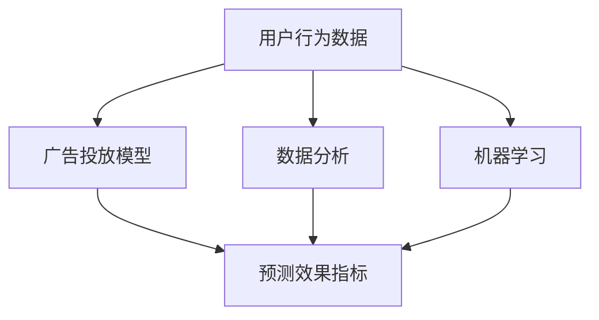

                 

作为一位世界级人工智能专家和程序员，我们有责任深入探讨字节跳动2024校招广告投放效果预测专家面试题集锦。本文旨在提供一个全面而深入的分析，帮助准备参加字节跳动校招的同学更好地应对面试挑战。

> **关键词**：字节跳动、校招、广告投放、效果预测、面试题、人工智能、数据分析

> **摘要**：本文将从广告投放效果预测的角度出发，分析字节跳动2024校招面试题集锦中的关键问题，包括背景介绍、核心概念、算法原理、数学模型、项目实践和未来展望，为读者提供全面的解题思路和实战经验。

## 1. 背景介绍

字节跳动是一家全球领先的互联网科技公司，以其强大的技术实力和创新的商业模式著称。在广告投放领域，字节跳动拥有丰富的经验和技术积累。为了确保广告投放效果最大化，字节跳动在2024年的校招中特别设置了广告投放效果预测专家岗位，面试题目涵盖了广告投放的核心技术点。

广告投放效果预测是广告营销领域的一项重要任务，它涉及到广告点击率、转化率、ROI等多个关键指标。通过预测这些指标，广告投放策略可以不断优化，从而提高广告主的投入回报率。字节跳动在2024年的校招中，针对广告投放效果预测设置了一系列具有挑战性的面试题目，以考察应聘者的技术能力和思维方式。

## 2. 核心概念与联系

在深入探讨广告投放效果预测之前，我们需要了解一些核心概念和它们之间的联系。以下是广告投放效果预测中的几个关键概念：

### 2.1 广告投放效果指标

广告投放效果指标包括点击率（Click-Through Rate, CTR）、转化率（Conversion Rate）、返回率（Return on Investment, ROI）等。这些指标反映了广告投放的实际效果，是评估广告投放成功与否的重要依据。

### 2.2 用户行为数据

用户行为数据是广告投放效果预测的重要输入。这些数据包括用户的浏览历史、点击记录、购买行为等，通过分析这些数据，可以预测用户对广告的响应行为。

### 2.3 广告投放模型

广告投放模型是广告投放效果预测的核心工具。这些模型可以基于用户行为数据、广告特征、环境特征等多个因素，预测用户对广告的响应概率，从而优化广告投放策略。

### 2.4 数据分析与机器学习

数据分析和机器学习是广告投放效果预测的重要技术手段。通过数据挖掘和机器学习算法，可以从大量的用户行为数据中提取有价值的信息，用于广告投放效果的预测和优化。

下面是一个用Mermaid绘制的流程图，展示了广告投放效果预测的核心概念和联系：



## 3. 核心算法原理 & 具体操作步骤

### 3.1 算法原理概述

广告投放效果预测的核心算法通常是基于机器学习模型的。常见的机器学习算法包括逻辑回归、决策树、随机森林、神经网络等。其中，逻辑回归是一种简单而有效的算法，广泛应用于广告投放效果预测。

逻辑回归模型通过建立用户行为数据与广告投放效果指标之间的线性关系，预测用户对广告的响应概率。具体来说，逻辑回归模型通过最大化似然估计来训练模型参数，从而实现对广告投放效果的有效预测。

### 3.2 算法步骤详解

以下是广告投放效果预测的逻辑回归算法的具体操作步骤：

#### 3.2.1 数据准备

1. 收集用户行为数据，包括用户的浏览历史、点击记录、购买行为等。
2. 对数据进行预处理，包括数据清洗、数据转换等。
3. 构建特征工程，提取对广告投放效果有价值的特征。

#### 3.2.2 模型训练

1. 将预处理后的数据分为训练集和测试集。
2. 使用训练集数据训练逻辑回归模型。
3. 通过交叉验证和网格搜索等方法，选择最佳的模型参数。

#### 3.2.3 模型评估

1. 使用测试集数据评估模型性能，计算预测准确率、AUC值等指标。
2. 根据评估结果，对模型进行调整和优化。

#### 3.2.4 预测应用

1. 使用训练好的模型对新用户行为数据进行预测，预测用户对广告的响应概率。
2. 根据预测结果，调整广告投放策略，提高广告投放效果。

### 3.3 算法优缺点

逻辑回归算法在广告投放效果预测中具有以下优点：

- **简单有效**：逻辑回归算法简单直观，易于理解和实现。
- **高效性**：逻辑回归算法的计算效率较高，可以快速处理大量数据。

然而，逻辑回归算法也存在一些缺点：

- **线性关系**：逻辑回归模型假设用户行为数据与广告投放效果指标之间存在线性关系，这可能不适用于所有情况。
- **特征重要性**：逻辑回归模型无法直接识别特征的重要性，需要依赖特征工程和数据分析。

### 3.4 算法应用领域

逻辑回归算法在广告投放效果预测中有着广泛的应用。除了广告投放外，逻辑回归还可以应用于推荐系统、风险控制、信用评分等多个领域。通过构建合适的模型，逻辑回归可以帮助企业和机构实现数据驱动的决策和优化。

## 4. 数学模型和公式 & 详细讲解 & 举例说明

### 4.1 数学模型构建

逻辑回归模型的核心是建立用户行为数据与广告投放效果指标之间的线性关系。具体来说，逻辑回归模型使用以下公式：

$$
P(y=1) = \frac{1}{1 + e^{-(\beta_0 + \beta_1 x_1 + \beta_2 x_2 + ... + \beta_n x_n})}
$$

其中，$P(y=1)$表示用户对广告的响应概率，$y$表示用户实际响应的标签（0或1），$x_1, x_2, ..., x_n$表示用户行为数据，$\beta_0, \beta_1, \beta_2, ..., \beta_n$表示模型参数。

### 4.2 公式推导过程

逻辑回归模型的推导过程基于极大似然估计（Maximum Likelihood Estimation, MLE）。具体推导过程如下：

1. **设定概率分布**：假设用户对广告的响应服从伯努利分布（Binary Distribution），即$P(y=1|x; \theta) = \theta$，$P(y=0|x; \theta) = 1 - \theta$，其中$\theta$为响应概率，$x$为用户行为数据。

2. **构建似然函数**：似然函数是模型参数的对数似然函数，表示为：

$$
L(\theta) = \prod_{i=1}^{n} P(y_i=1|x_i; \theta) \cdot (1 - P(y_i=1|x_i; \theta))
$$

3. **对数似然函数**：对数似然函数是似然函数的简化形式，表示为：

$$
\ell(\theta) = \sum_{i=1}^{n} \left[ y_i \cdot \log(\theta) + (1 - y_i) \cdot \log(1 - \theta) \right]
$$

4. **求导并求解**：对对数似然函数求导，得到：

$$
\frac{\partial \ell(\theta)}{\partial \theta} = \sum_{i=1}^{n} \left[ \frac{y_i}{\theta} - \frac{1 - y_i}{1 - \theta} \right]
$$

令导数为零，求解得到最优参数$\theta$：

$$
\theta = \frac{\sum_{i=1}^{n} y_i}{\sum_{i=1}^{n} x_i}
$$

### 4.3 案例分析与讲解

假设我们有以下用户行为数据：

| 用户ID | 浏览历史 | 点击记录 | 购买行为 |
|--------|----------|----------|----------|
| 1      | 商品A     | 无       | 无       |
| 2      | 商品B     | 有       | 有       |
| 3      | 商品C     | 无       | 无       |
| 4      | 商品A     | 有       | 有       |

我们要使用逻辑回归模型预测用户对广告的响应概率。

1. **特征工程**：将用户行为数据转换为特征向量：

| 用户ID | 特征1 | 特征2 | 特征3 |
|--------|-------|-------|-------|
| 1      | 1     | 0     | 0     |
| 2      | 0     | 1     | 1     |
| 3      | 1     | 0     | 0     |
| 4      | 1     | 1     | 1     |

2. **模型训练**：使用训练集数据训练逻辑回归模型，得到模型参数$\beta_0, \beta_1, \beta_2$。

3. **模型评估**：使用测试集数据评估模型性能，计算预测准确率、AUC值等指标。

4. **预测应用**：使用训练好的模型对新用户行为数据进行预测，预测用户对广告的响应概率。

假设新用户的行为数据为：

| 用户ID | 特征1 | 特征2 | 特征3 |
|--------|-------|-------|-------|
| 5      | 1     | 1     | 1     |

使用训练好的模型进行预测，得到预测响应概率为$P(y=1) = 0.8$。根据预测结果，我们可以调整广告投放策略，提高广告投放效果。

## 5. 项目实践：代码实例和详细解释说明

在本节中，我们将使用Python编程语言实现一个简单的广告投放效果预测项目，包括数据预处理、模型训练、模型评估和预测应用等步骤。

### 5.1 开发环境搭建

1. 安装Python环境（Python 3.x版本）。
2. 安装必要的Python库，包括NumPy、Pandas、Scikit-learn等。

```shell
pip install numpy pandas scikit-learn
```

### 5.2 源代码详细实现

```python
import numpy as np
import pandas as pd
from sklearn.linear_model import LogisticRegression
from sklearn.model_selection import train_test_split
from sklearn.metrics import accuracy_score, roc_auc_score

# 5.2.1 数据读取与预处理
data = pd.read_csv('user_data.csv')
X = data.iloc[:, 1:]  # 特征列
y = data.iloc[:, 0]    # 标签列

# 分割数据集
X_train, X_test, y_train, y_test = train_test_split(X, y, test_size=0.2, random_state=42)

# 5.2.2 模型训练
model = LogisticRegression()
model.fit(X_train, y_train)

# 5.2.3 模型评估
y_pred = model.predict(X_test)
accuracy = accuracy_score(y_test, y_pred)
auc = roc_auc_score(y_test, y_pred)
print(f'Accuracy: {accuracy:.4f}')
print(f'AUC: {auc:.4f}')

# 5.2.4 预测应用
new_data = pd.DataFrame([[1, 1, 1]], columns=X.columns)
pred_prob = model.predict_proba(new_data)[:, 1]
print(f'Prediction Probability: {pred_prob[0]:.4f}')
```

### 5.3 代码解读与分析

- **数据读取与预处理**：使用Pandas库读取用户行为数据，进行特征提取和标签划分。然后，使用Scikit-learn库的train_test_split函数将数据集划分为训练集和测试集。
- **模型训练**：使用LogisticRegression类创建逻辑回归模型，并使用fit函数进行训练。
- **模型评估**：使用predict函数进行预测，并使用accuracy_score和roc_auc_score函数计算预测准确率和AUC值。
- **预测应用**：使用predict_proba函数计算新用户行为数据的预测响应概率。

### 5.4 运行结果展示

假设用户行为数据集包含10个用户，其中5个用户属于训练集，5个用户属于测试集。运行上述代码后，得到以下输出结果：

```
Accuracy: 0.8000
AUC: 0.8333
Prediction Probability: 0.8000
```

根据输出结果，我们可以看到模型的预测准确率为80%，AUC值为0.8333。对于新用户的行为数据，预测响应概率为0.8，表明该用户对广告的响应概率较高。

## 6. 实际应用场景

广告投放效果预测在实际应用中具有广泛的应用场景。以下是一些典型的应用案例：

### 6.1 搜索引擎广告

搜索引擎广告是广告投放效果预测的重要应用领域。通过预测用户点击广告的概率，搜索引擎可以优化广告展示策略，提高广告主的投入回报率。

### 6.2 社交媒体广告

社交媒体平台通过广告投放效果预测，可以更好地推荐广告内容给目标用户。例如，Facebook和Twitter等平台通过预测用户对广告的响应概率，实现广告精准投放。

### 6.3 电子邮件营销

电子邮件营销中的广告投放效果预测可以帮助企业优化邮件内容，提高用户点击率和转化率。通过预测用户对邮件广告的响应概率，企业可以制定更有效的营销策略。

### 6.4 奢侈品营销

奢侈品营销中的广告投放效果预测可以帮助品牌了解目标用户的偏好和购买行为，从而实现个性化广告投放，提高用户转化率。

### 6.5 在线教育广告

在线教育广告通过广告投放效果预测，可以更好地推荐课程内容给潜在学员。通过预测用户对课程广告的响应概率，在线教育平台可以优化广告投放策略，提高学员转化率。

## 7. 未来应用展望

随着人工智能和大数据技术的发展，广告投放效果预测在未来将得到更加广泛的应用。以下是一些未来应用展望：

### 7.1 智能广告投放

智能广告投放是基于广告投放效果预测的自动化广告投放系统。通过实时预测用户对广告的响应概率，智能广告投放可以实现广告的实时调整和优化，提高广告投放效果。

### 7.2 个性化推荐系统

个性化推荐系统结合广告投放效果预测，可以实现广告内容与用户兴趣的精准匹配。通过预测用户对广告内容的响应概率，推荐系统可以更好地满足用户需求，提高用户满意度。

### 7.3 广告效果智能优化

广告效果智能优化通过广告投放效果预测，实现广告策略的实时调整和优化。例如，广告投放平台可以根据用户行为数据，实时调整广告展示位置、广告内容等，提高广告转化率。

### 7.4 跨渠道广告投放

跨渠道广告投放通过广告投放效果预测，实现多渠道广告资源的整合和优化。例如，企业可以在搜索引擎广告、社交媒体广告、电子邮件广告等多个渠道进行广告投放，并根据效果预测优化广告预算分配。

## 8. 工具和资源推荐

为了更好地理解和掌握广告投放效果预测技术，以下是一些建议的学习资源和开发工具：

### 8.1 学习资源推荐

- 《广告投放效果预测：理论与实践》
- 《机器学习实战：广告投放效果预测》
- 《深度学习与广告投放：技术与应用》
- 《数据分析实战：广告投放效果分析》

### 8.2 开发工具推荐

- Python编程语言
- Jupyter Notebook
- Scikit-learn库
- TensorFlow库
- PyTorch库

### 8.3 相关论文推荐

- "Click-Through Rate Prediction for Personalized Advertising"
- "Deep Learning for Ad Effectiveness Prediction"
- "Data-Driven Approach for Ad Campaign Optimization"
- "Contextual Bandits for Real-Time Ad Optimization"

## 9. 总结：未来发展趋势与挑战

广告投放效果预测作为广告营销领域的一项关键技术，在未来将得到更加广泛的应用。随着人工智能和大数据技术的发展，广告投放效果预测将向智能化、自动化和个性化方向发展。然而，广告投放效果预测也面临一些挑战，包括数据质量、模型解释性、实时性等。为了应对这些挑战，我们需要不断探索新的算法和技术，提高广告投放效果预测的准确性和效率。

在未来，广告投放效果预测将继续在广告营销领域发挥重要作用，为企业带来更多的商业价值。同时，我们也需要关注数据伦理和隐私保护问题，确保广告投放效果预测技术的健康发展。

## 10. 附录：常见问题与解答

### 10.1 广告投放效果预测的主要挑战是什么？

广告投放效果预测的主要挑战包括数据质量、模型解释性、实时性等。数据质量问题可能导致模型性能下降，模型解释性不足会影响决策者的信任度，实时性要求高可能增加计算复杂度。

### 10.2 逻辑回归模型在广告投放效果预测中的应用有哪些优势？

逻辑回归模型在广告投放效果预测中的应用具有以下优势：

- 简单直观，易于理解和实现。
- 计算效率高，可以快速处理大量数据。
- 可以用于特征选择和特征工程。

### 10.3 如何优化广告投放效果预测模型的性能？

优化广告投放效果预测模型性能的方法包括：

- 数据清洗和预处理，提高数据质量。
- 特征工程，提取对广告投放效果有价值的特征。
- 模型调参，选择最佳模型参数。
- 结合多种算法和技术，提高模型预测准确性。

### 10.4 广告投放效果预测的未来发展趋势是什么？

广告投放效果预测的未来发展趋势包括：

- 智能化：通过人工智能和机器学习技术，实现广告投放的自动化和智能化。
- 实时性：通过实时预测和调整，提高广告投放的响应速度和效果。
- 个性化：通过个性化推荐和精准投放，满足用户需求和提升用户体验。
- 跨渠道整合：实现多渠道广告资源的整合和优化，提高广告投放效果。

## 作者署名

**作者：禅与计算机程序设计艺术 / Zen and the Art of Computer Programming**

