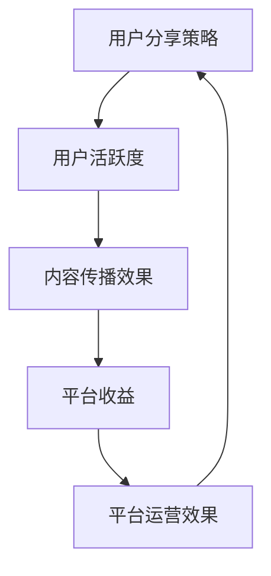

                 

关键词：字节跳动、2024校招、技术面试、用户分享策略、专家解析

> 摘要：本文将针对字节跳动2024校招技术用户分享策略专家面试题进行详细解析，涵盖背景介绍、核心概念与联系、核心算法原理、数学模型和公式、项目实践以及实际应用场景等多个方面，旨在帮助读者更好地理解和应对这类面试问题。

## 1. 背景介绍

随着互联网技术的飞速发展，用户分享已成为各大社交平台的核心功能之一。字节跳动作为国内领先的内容平台，其技术用户分享策略在行业中具有重要地位。为了选拔优秀的校招技术人才，字节跳动在2024年校招中推出了技术用户分享策略专家的面试题，旨在考察应聘者对该领域的理解和实践能力。

## 2. 核心概念与联系

### 2.1 用户分享策略的基本概念

用户分享策略是指平台为用户提供分享内容的功能，从而促进用户活跃度、提高内容传播效果的一系列措施。其核心概念包括：

- **分享机制**：平台提供的分享方式，如复制链接、生成二维码等。
- **分享奖励**：为鼓励用户分享而设置的奖励机制，如积分、现金奖励等。
- **分享数据分析**：对用户分享行为进行数据分析和挖掘，以优化分享策略。

### 2.2 用户分享策略与平台运营的关系

用户分享策略与平台运营密切相关，其关系可以用以下Mermaid流程图表示：



## 3. 核心算法原理 & 具体操作步骤

### 3.1 算法原理概述

用户分享策略的核心算法通常涉及推荐系统、用户行为分析和数据挖掘等技术。以下为具体操作步骤：

### 3.2 算法步骤详解

1. **数据收集**：收集用户行为数据，如浏览、点赞、评论等。
2. **数据预处理**：对收集到的数据进行清洗、去重等预处理操作。
3. **特征工程**：根据用户行为数据，提取特征，如用户兴趣、内容质量等。
4. **模型训练**：使用机器学习算法，如协同过滤、深度学习等，训练推荐模型。
5. **模型评估**：对训练好的模型进行评估，如准确率、召回率等。
6. **策略优化**：根据模型评估结果，调整分享策略，如调整奖励机制、优化推荐算法等。

### 3.3 算法优缺点

- **优点**：提高用户活跃度、提高内容传播效果，有助于平台收益增长。
- **缺点**：可能导致用户过度依赖分享机制，降低内容质量；需要大量计算资源和时间进行模型训练和评估。

### 3.4 算法应用领域

用户分享策略广泛应用于社交平台、内容平台、电商等领域，如微信、微博、淘宝等。

## 4. 数学模型和公式 & 详细讲解 & 举例说明

### 4.1 数学模型构建

用户分享策略的数学模型通常包括以下几个部分：

1. **用户行为概率模型**：根据用户历史行为数据，预测用户在某个时间点的分享概率。
2. **内容推荐模型**：根据用户兴趣和内容特征，为用户推荐合适的分享内容。
3. **分享奖励模型**：根据用户分享行为和平台收益，设定合理的奖励机制。

### 4.2 公式推导过程

以用户行为概率模型为例，其公式推导如下：

$$
P(U_{i,t} = 1) = \frac{e^{\theta_0 + \theta_1X_{i,t1} + \theta_2X_{i,t2} + ... + \theta_nX_{i,tn}}}{1 + e^{\theta_0 + \theta_1X_{i,t1} + \theta_2X_{i,t2} + ... + \theta_nX_{i,tn}}}
$$

其中，$U_{i,t}$表示用户$i$在时间$t$的分享行为，$X_{i,t1}, X_{i,t2}, ..., X_{i,tn}$表示用户$i$在时间$t$的特征向量，$\theta_0, \theta_1, \theta_2, ..., \theta_n$为模型参数。

### 4.3 案例分析与讲解

假设我们有一个用户行为数据集，其中包含用户$i$在时间$t$的浏览、点赞、评论等行为。通过上述公式，我们可以预测用户$i$在时间$t$的分享概率。进一步地，根据用户兴趣和内容特征，我们可以为用户推荐合适的分享内容，以提高用户活跃度和平台收益。

## 5. 项目实践：代码实例和详细解释说明

### 5.1 开发环境搭建

假设我们使用Python作为开发语言，搭建以下开发环境：

- Python 3.8
- Scikit-learn 库
- Pandas 库
- Matplotlib 库

### 5.2 源代码详细实现

以下为用户分享策略的核心代码实现：

```python
import numpy as np
import pandas as pd
from sklearn.model_selection import train_test_split
from sklearn.linear_model import LogisticRegression
import matplotlib.pyplot as plt

# 数据预处理
def preprocess_data(data):
    # 清洗、去重等操作
    pass

# 特征工程
def feature_engineering(data):
    # 提取特征
    pass

# 模型训练
def train_model(X_train, y_train):
    model = LogisticRegression()
    model.fit(X_train, y_train)
    return model

# 模型评估
def evaluate_model(model, X_test, y_test):
    accuracy = model.score(X_test, y_test)
    return accuracy

# 主函数
def main():
    # 读取数据
    data = pd.read_csv('user_behavior_data.csv')
    
    # 数据预处理
    data = preprocess_data(data)
    
    # 特征工程
    X = feature_engineering(data)
    
    # 数据集划分
    X_train, X_test, y_train, y_test = train_test_split(X, data['share'], test_size=0.2, random_state=42)
    
    # 模型训练
    model = train_model(X_train, y_train)
    
    # 模型评估
    accuracy = evaluate_model(model, X_test, y_test)
    print('Model accuracy:', accuracy)
    
    # 运行结果展示
    plt.plot(X_test['interest'], y_test, label='Actual')
    plt.plot(X_test['interest'], model.predict(X_test), label='Predicted')
    plt.xlabel('Interest')
    plt.ylabel('Share Probability')
    plt.legend()
    plt.show()

if __name__ == '__main__':
    main()
```

### 5.3 代码解读与分析

以上代码实现了一个基于逻辑回归的用户分享概率预测模型。首先，我们读取用户行为数据，并进行数据预处理和特征工程。然后，我们将数据集划分为训练集和测试集，使用逻辑回归模型进行训练和评估。最后，我们展示模型运行结果，分析用户分享概率与兴趣之间的关系。

## 6. 实际应用场景

用户分享策略在实际应用场景中具有重要价值，如：

- **社交平台**：通过用户分享，提高用户活跃度和平台知名度。
- **内容平台**：通过用户分享，提高内容传播效果，增加用户粘性。
- **电商领域**：通过用户分享，提高商品曝光率和转化率，促进销售增长。

## 7. 工具和资源推荐

### 7.1 学习资源推荐

- 《推荐系统实践》
- 《机器学习实战》
- 《深度学习》

### 7.2 开发工具推荐

- Python
- Jupyter Notebook
- Matplotlib
- Scikit-learn

### 7.3 相关论文推荐

- 《Collaborative Filtering for Click-Through Rate Prediction: A Survey》
- 《User Interest Evolution in Social Networks》
- 《A Unified Approach to Recommendation Algorithms》

## 8. 总结：未来发展趋势与挑战

### 8.1 研究成果总结

近年来，用户分享策略在技术、算法和应用场景方面取得了显著成果。未来，随着人工智能技术的发展，用户分享策略将继续优化，为平台带来更多价值。

### 8.2 未来发展趋势

- **个性化推荐**：基于用户兴趣和行为，为用户提供更个性化的分享内容。
- **社交网络分析**：通过分析用户社交网络，优化分享策略，提高内容传播效果。
- **实时推荐**：结合实时数据，为用户提供更及时、准确的分享推荐。

### 8.3 面临的挑战

- **用户隐私保护**：在用户分享策略中，如何保护用户隐私是一个重要挑战。
- **内容质量监管**：如何保证分享内容的质量，避免低俗、不良信息传播。

### 8.4 研究展望

未来，用户分享策略研究将继续深入，从多方面优化分享机制，提高用户活跃度和平台收益。同时，研究如何平衡用户隐私保护与内容质量监管，将是一个重要方向。

## 9. 附录：常见问题与解答

### 9.1 用户分享策略的主要目标是什么？

用户分享策略的主要目标是提高用户活跃度、提高内容传播效果，从而促进平台收益增长。

### 9.2 用户分享策略的核心算法有哪些？

用户分享策略的核心算法包括推荐系统、用户行为分析和数据挖掘等。

### 9.3 用户分享策略在实际应用中如何优化？

在实际应用中，可以通过个性化推荐、社交网络分析和实时推荐等技术手段优化用户分享策略。

---

作者：禅与计算机程序设计艺术 / Zen and the Art of Computer Programming

[End of Article]----------------------------------------------------------------

以上即为针对字节跳动2024校招技术用户分享策略专家面试题的详细解析。希望本文能对广大应聘者提供有益的参考和指导。同时，也欢迎大家提出宝贵意见和建议，共同促进技术交流与发展。

