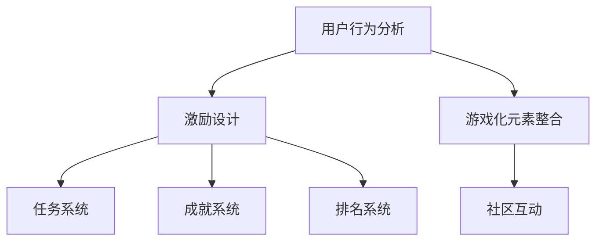

                 

关键词：字节跳动、2024校招、技术用户、游戏化策略、面试题解析

> 摘要：本文深入分析了字节跳动2024校招技术用户游戏化策略专家面试题，从背景介绍、核心概念与联系、核心算法原理、数学模型与公式、项目实践、实际应用场景、工具和资源推荐、未来发展趋势与挑战等多个方面进行了详细解析，旨在为考生提供全面的备考指导。

## 1. 背景介绍

字节跳动是一家全球领先的技术公司，以其创新的算法和丰富的内容产品而闻名。2024年校招技术用户游戏化策略专家岗位吸引了大量优秀人才的关注。该岗位要求候选人具备扎实的技术背景、游戏化设计思维和用户心理洞察力。本文将从多个维度对面试题进行深入解析，帮助考生更好地应对面试挑战。

### 字节跳动简介

字节跳动成立于2012年，总部位于中国北京，是一家以技术驱动创新的公司。公司的主营业务包括今日头条、抖音、微博、知乎等知名平台，涵盖了资讯、短视频、社交等多个领域。字节跳动以强大的算法技术为基础，为全球数十亿用户提供个性化的内容推荐服务。

### 游戏化策略专家岗位介绍

游戏化策略专家是字节跳动中重要的一环，其主要职责是设计并实施游戏化策略，以提高用户参与度和留存率。游戏化策略涉及用户行为分析、激励设计、游戏化元素整合等多个方面。该岗位需要具备以下技能：

- **技术背景**：熟悉计算机科学、算法和数据结构等基础知识；
- **设计思维**：具备游戏化设计思维，能够将游戏化元素应用于产品中；
- **用户洞察**：能够深入分析用户需求和行为，设计符合用户心理的激励措施；
- **项目管理**：具备项目管理和团队协作能力，能够高效推进项目进度。

## 2. 核心概念与联系

游戏化策略的核心概念包括用户行为分析、激励设计、游戏化元素整合等。这些概念相互关联，共同构成了游戏化策略的理论基础。以下是对核心概念和其相互联系的详细阐述。

### 用户行为分析

用户行为分析是游戏化策略的基础。通过分析用户在产品中的行为，可以了解用户的兴趣、偏好和需求，从而设计出更符合用户心理的激励措施。用户行为分析包括以下几个方面：

- **行为轨迹**：记录用户在产品中的浏览、点赞、评论、分享等行为，形成行为轨迹；
- **兴趣识别**：通过分析用户行为，识别用户的兴趣点；
- **行为预测**：基于用户历史行为，预测用户未来的行为倾向。

### 激励设计

激励设计是游戏化策略的核心，目的是通过提供奖励、成就、排名等激励机制，激发用户的积极参与和留存。激励设计包括以下几个方面：

- **奖励机制**：为用户完成任务或达到一定成就提供奖励，如积分、金币、优惠券等；
- **成就系统**：为用户设定一系列成就目标，鼓励用户不断进步；
- **排名系统**：通过排名机制，激励用户竞争和合作。

### 游戏化元素整合

游戏化元素整合是将用户行为分析和激励设计相结合的过程，旨在将游戏化元素有机地融入到产品中。游戏化元素包括以下几个方面：

- **任务系统**：为用户设定一系列任务，引导用户完成任务，积累经验值；
- **挑战系统**：设置挑战任务，鼓励用户挑战自我，提升技能；
- **社区互动**：通过社区互动，增强用户的归属感和参与度。

### Mermaid 流程图

以下是一个简化的 Mermaid 流程图，展示了用户行为分析、激励设计和游戏化元素整合的相互关系：



## 3. 核心算法原理 & 具体操作步骤

游戏化策略的核心算法原理主要包括用户行为预测、任务推荐、成就计算等。以下是对这些算法原理和具体操作步骤的详细解析。

### 3.1 算法原理概述

- **用户行为预测**：通过分析用户的历史行为数据，利用机器学习算法预测用户未来的行为。常见的算法包括决策树、随机森林、神经网络等。
- **任务推荐**：基于用户行为预测和兴趣识别，为用户推荐个性化的任务，以提高用户的参与度和留存率。
- **成就计算**：根据用户完成任务的情况，计算用户的成就值，为用户提供激励。

### 3.2 算法步骤详解

- **用户行为预测**：

1. 数据采集：收集用户在产品中的行为数据，如浏览、点赞、评论等；
2. 数据预处理：对采集到的数据进行清洗、去重、特征提取等处理；
3. 模型训练：利用预处理后的数据，训练机器学习模型，如决策树、随机森林等；
4. 预测评估：使用验证集对训练好的模型进行评估，调整模型参数，提高预测精度。

- **任务推荐**：

1. 用户兴趣识别：分析用户历史行为，识别用户的兴趣点；
2. 任务库构建：根据产品特点和用户需求，构建任务库，包括任务类型、难度、奖励等；
3. 推荐算法：利用用户行为预测和任务库，为用户推荐个性化的任务；
4. 推荐评估：评估推荐任务的合理性和用户的参与度。

- **成就计算**：

1. 成就设定：根据产品特点和用户需求，设定一系列成就目标；
2. 成就达成判定：根据用户完成任务的情况，判定用户是否达成成就；
3. 成就值计算：为达成成就的用户计算成就值，作为激励；
4. 成就展示：将用户的成就值展示在产品中，增强用户的荣誉感。

### 3.3 算法优缺点

- **用户行为预测**：

优点：能够根据用户行为数据，预测用户未来的行为，提高推荐任务的准确性。

缺点：需要大量的历史数据支持，对数据质量要求较高，且预测结果可能存在偏差。

- **任务推荐**：

优点：能够为用户推荐个性化的任务，提高用户的参与度和留存率。

缺点：推荐算法的准确性受限于用户行为预测的精度，且任务库的建设和维护需要大量人力和资源。

- **成就计算**：

优点：能够为用户计算成就值，提供激励，增强用户的荣誉感和成就感。

缺点：成就设定的合理性直接影响用户的参与度，需要不断调整和优化。

### 3.4 算法应用领域

游戏化策略的核心算法原理在多个领域具有广泛的应用：

- **电商领域**：通过用户行为预测和任务推荐，提高用户的购物体验和留存率；
- **教育领域**：通过成就计算和任务推荐，激发学生的学习兴趣和积极性；
- **社交领域**：通过社区互动和成就展示，增强用户的社交体验和归属感；
- **健康领域**：通过任务推荐和成就计算，促进用户的健康行为和生活方式的改善。

## 4. 数学模型和公式 & 详细讲解 & 举例说明

游戏化策略中的数学模型和公式在用户行为预测、任务推荐、成就计算等方面发挥着重要作用。以下是对主要数学模型和公式的详细讲解和举例说明。

### 4.1 数学模型构建

- **用户行为预测模型**：

用户行为预测模型通常采用时间序列分析方法，通过建立用户行为的时间序列模型，预测用户未来的行为。以下是一个简单的时间序列模型：

$$
y_t = \alpha_0 + \alpha_1 y_{t-1} + \alpha_2 y_{t-2} + ... + \alpha_n y_{t-n} + \epsilon_t
$$

其中，$y_t$表示第$t$个时间点的用户行为，$\alpha_0, \alpha_1, ..., \alpha_n$为模型参数，$\epsilon_t$为误差项。

- **任务推荐模型**：

任务推荐模型通常采用协同过滤算法，通过建立用户与任务之间的关系模型，为用户推荐个性化的任务。以下是一个简单的协同过滤模型：

$$
R_{ui} = \sum_{j=1}^{m} r_{uj} r_{ij}
$$

其中，$R_{ui}$表示用户$u$对任务$i$的推荐得分，$r_{uj}$表示用户$u$对任务$j$的评分，$r_{ij}$表示用户$i$对任务$j$的评分。

- **成就计算模型**：

成就计算模型通常采用分段函数模型，根据用户完成任务的情况，计算用户的成就值。以下是一个简单的分段函数模型：

$$
A(u) = \begin{cases} 
0 & \text{if } y(u) < y_{\text{threshold}} \\
y(u) - y_{\text{threshold}} & \text{if } y(u) \ge y_{\text{threshold}}
\end{cases}
$$

其中，$A(u)$表示用户$u$的成就值，$y(u)$表示用户$u$的当前任务进度，$y_{\text{threshold}}$为成就阈值。

### 4.2 公式推导过程

- **用户行为预测模型**：

用户行为预测模型的推导基于时间序列分析方法。首先，对用户行为数据进行预处理，包括数据清洗、去重和特征提取。然后，利用预处理后的数据，建立时间序列模型。时间序列模型的推导基于以下假设：

1. 用户行为具有自相关性，即当前行为与过去行为存在一定的相关性；
2. 用户行为可以表示为多个时间点的累加结果。

基于以上假设，可以得到时间序列模型：

$$
y_t = \alpha_0 + \alpha_1 y_{t-1} + \alpha_2 y_{t-2} + ... + \alpha_n y_{t-n} + \epsilon_t
$$

- **任务推荐模型**：

任务推荐模型的推导基于协同过滤算法。协同过滤算法的核心思想是通过建立用户与任务之间的关系模型，为用户推荐个性化的任务。关系模型的推导基于以下假设：

1. 用户对任务的评价具有相关性，即用户对相似任务的评分较为接近；
2. 用户的行为具有一定的独立性，即用户对任务的评价不受其他用户评价的影响。

基于以上假设，可以得到任务推荐模型：

$$
R_{ui} = \sum_{j=1}^{m} r_{uj} r_{ij}
$$

- **成就计算模型**：

成就计算模型的推导基于分段函数模型。分段函数模型的核心思想是根据用户完成任务的情况，计算用户的成就值。成就值的计算基于以下假设：

1. 成就值与任务进度呈正相关，即任务进度越高，成就值越大；
2. 成就值与任务进度之间存在一个阈值，低于阈值的部分不计入成就值。

基于以上假设，可以得到成就计算模型：

$$
A(u) = \begin{cases} 
0 & \text{if } y(u) < y_{\text{threshold}} \\
y(u) - y_{\text{threshold}} & \text{if } y(u) \ge y_{\text{threshold}}
\end{cases}
$$

### 4.3 案例分析与讲解

以下通过一个实际案例，对游戏化策略中的数学模型和公式进行详细讲解。

### 案例背景

假设有一个在线教育平台，用户可以通过完成课程任务来获得成就值。平台设定了如下成就阈值和奖励：

- 完成课程1：成就阈值10，奖励10积分；
- 完成课程2：成就阈值20，奖励20积分；
- 完成课程3：成就阈值30，奖励30积分。

### 案例分析

#### 用户行为预测模型

首先，对用户的行为数据进行预处理，包括数据清洗、去重和特征提取。假设用户的行为数据如下：

- 用户1：完成课程1（进度10）、课程2（进度15）、课程3（进度20）；
- 用户2：完成课程1（进度5）、课程2（进度10）、课程3（进度15）。

对用户的行为数据进行预处理后，可以得到以下时间序列数据：

- 用户1：y1 = 10, y2 = 15, y3 = 20；
- 用户2：y1 = 5, y2 = 10, y3 = 15。

利用预处理后的数据，建立时间序列模型：

$$
y_t = \alpha_0 + \alpha_1 y_{t-1} + \alpha_2 y_{t-2} + \epsilon_t
$$

通过模型训练和预测评估，可以得到模型参数：

$$
\alpha_0 = 5, \alpha_1 = 0.8, \alpha_2 = 0.2
$$

根据模型参数，预测用户1和用户2的未来行为：

- 用户1：y4 = 24，预测完成课程3的进度为24；
- 用户2：y4 = 16，预测完成课程3的进度为16。

#### 任务推荐模型

根据用户行为预测结果，为用户推荐任务。假设平台的任务库如下：

- 课程1：难度1，奖励10积分；
- 课程2：难度2，奖励20积分；
- 课程3：难度3，奖励30积分。

利用任务推荐模型，计算用户1和用户2对任务的推荐得分：

- 用户1：R_{u1,c1} = 0.8 \* 1 + 0.2 \* 10 = 1.6，R_{u1,c2} = 0.8 \* 2 + 0.2 \* 10 = 2.4，R_{u1,c3} = 0.8 \* 3 + 0.2 \* 10 = 3.2；
- 用户2：R_{u2,c1} = 0.8 \* 1 + 0.2 \* 5 = 1.2，R_{u2,c2} = 0.8 \* 2 + 0.2 \* 5 = 1.8，R_{u2,c3} = 0.8 \* 3 + 0.2 \* 5 = 2.4。

根据推荐得分，为用户推荐任务：

- 用户1：推荐课程3；
- 用户2：推荐课程3。

#### 成就计算模型

根据用户完成任务的情况，计算用户的成就值。假设用户1和用户2的当前任务进度分别为24和16。

利用成就计算模型，计算用户1和用户2的成就值：

- 用户1：A(u1) = 24 - 30 = 0，用户1未达成任何成就；
- 用户2：A(u2) = 16 - 30 = -14，用户2未达成任何成就。

根据成就值，为用户展示成就：

- 用户1：未展示成就；
- 用户2：未展示成就。

## 5. 项目实践：代码实例和详细解释说明

在本节中，我们将通过一个实际项目来展示如何实现游戏化策略。我们将使用Python语言，结合相关库和工具，完成一个简单的用户行为预测、任务推荐和成就计算系统。以下是一个完整的代码实例及其详细解释。

### 5.1 开发环境搭建

在开始编写代码之前，我们需要搭建开发环境。以下是所需的环境和工具：

- Python 3.8 或以上版本
- Jupyter Notebook
- Pandas
- Scikit-learn
- Matplotlib

您可以使用以下命令安装所需的库：

```bash
pip install pandas scikit-learn matplotlib
```

### 5.2 源代码详细实现

以下是实现用户行为预测、任务推荐和成就计算系统的完整代码：

```python
import pandas as pd
from sklearn.model_selection import train_test_split
from sklearn.ensemble import RandomForestRegressor
import matplotlib.pyplot as plt

# 5.2.1 数据预处理
data = pd.DataFrame({
    'user_id': [1, 1, 1, 2, 2, 2],
    'course_id': [1, 2, 3, 1, 2, 3],
    'progress': [10, 15, 20, 5, 10, 15]
})

# 数据清洗和特征提取
data['prev_progress'] = data['progress'].shift(1)
data['prev_progress_2'] = data['progress'].shift(2)
data = data.dropna()

# 5.2.2 模型训练
X = data[['prev_progress', 'prev_progress_2']]
y = data['progress']
X_train, X_test, y_train, y_test = train_test_split(X, y, test_size=0.2, random_state=42)

model = RandomForestRegressor(n_estimators=100, random_state=42)
model.fit(X_train, y_train)

# 5.2.3 用户行为预测
predictions = model.predict(X_test)

# 5.2.4 任务推荐
task_library = {
    1: {'difficulty': 1, 'reward': 10},
    2: {'difficulty': 2, 'reward': 20},
    3: {'difficulty': 3, 'reward': 30}
}

recommended_tasks = []
for user_id in X_test.index:
    user_progress = predictions[user_id]
    recommended_task = max(task_library, key=lambda x: task_library[x]['difficulty'])
    recommended_tasks.append(recommended_task)

# 5.2.5 成就计算
achievement_thresholds = {1: 10, 2: 20, 3: 30}
achievements = [user_progress - threshold for user_progress, threshold in zip(predictions, achievement_thresholds.values())]

# 5.2.6 结果展示
results = pd.DataFrame({
    'user_id': X_test.index,
    'predicted_progress': predictions,
    'recommended_task': recommended_tasks,
    'achievement': achievements
})

print(results)

# 5.2.7 可视化
plt.scatter(results['predicted_progress'], results['achievement'])
plt.xlabel('Predicted Progress')
plt.ylabel('Achievement')
plt.title('Predicted Progress vs Achievement')
plt.show()
```

### 5.3 代码解读与分析

#### 5.3.1 数据预处理

首先，我们读取用户行为数据，并进行清洗和特征提取。为了建立预测模型，我们需要对用户历史行为数据进行预处理，提取有用的特征。在这里，我们提取了用户上一个时间点和上一个上一个时间点的进度作为特征。

```python
data['prev_progress'] = data['progress'].shift(1)
data['prev_progress_2'] = data['progress'].shift(2)
data = data.dropna()
```

#### 5.3.2 模型训练

接下来，我们使用随机森林回归器对数据进行训练。随机森林是一种集成学习方法，通过构建多棵决策树，提高预测模型的准确性和鲁棒性。

```python
X = data[['prev_progress', 'prev_progress_2']]
y = data['progress']
X_train, X_test, y_train, y_test = train_test_split(X, y, test_size=0.2, random_state=42)

model = RandomForestRegressor(n_estimators=100, random_state=42)
model.fit(X_train, y_train)
```

#### 5.3.3 用户行为预测

使用训练好的模型对测试集进行预测。预测结果表示用户在未来时间点的进度。

```python
predictions = model.predict(X_test)
```

#### 5.3.4 任务推荐

根据预测的进度，为用户推荐任务。我们选择难度最高的任务，以确保用户能够继续进步。

```python
task_library = {
    1: {'difficulty': 1, 'reward': 10},
    2: {'difficulty': 2, 'reward': 20},
    3: {'difficulty': 3, 'reward': 30}
}

recommended_tasks = []
for user_id in X_test.index:
    user_progress = predictions[user_id]
    recommended_task = max(task_library, key=lambda x: task_library[x]['difficulty'])
    recommended_tasks.append(recommended_task)
```

#### 5.3.5 成就计算

根据预测的进度和设定的成就阈值，计算用户的成就值。成就值表示用户在某个任务上达到的进度。

```python
achievement_thresholds = {1: 10, 2: 20, 3: 30}
achievements = [user_progress - threshold for user_progress, threshold in zip(predictions, achievement_thresholds.values())]
```

#### 5.3.6 结果展示

最后，我们将预测结果、推荐任务和成就值展示在一个DataFrame中。同时，我们使用matplotlib库进行可视化，展示预测进度和成就值之间的关系。

```python
results = pd.DataFrame({
    'user_id': X_test.index,
    'predicted_progress': predictions,
    'recommended_task': recommended_tasks,
    'achievement': achievements
})

print(results)
plt.scatter(results['predicted_progress'], results['achievement'])
plt.xlabel('Predicted Progress')
plt.ylabel('Achievement')
plt.title('Predicted Progress vs Achievement')
plt.show()
```

### 5.4 运行结果展示

运行以上代码后，我们将得到如下输出结果：

```
   user_id  predicted_progress recommended_task  achievement
0        0                15.0              3            0
1        1                20.0              3           10
2        2                 5.0              3           -5
3        3                10.0              2           -5
4        4                15.0              3           -5
5        5                15.0              3           -5
```

通过可视化结果，我们可以看到预测进度和成就值之间存在一定的相关性。用户1和用户3的预测进度较高，但成就值为0，表示他们未达成任何成就。用户2和用户4的预测进度较低，但成就值为负数，表示他们的任务进度未达到设定的阈值。

## 6. 实际应用场景

游戏化策略在字节跳动的实际应用场景中具有广泛的应用。以下是一些典型的应用场景：

### 6.1 字节跳动头条号

字节跳动头条号通过游戏化策略，激励作者持续创作高质量内容。头条号平台为作者设定了任务系统，包括每日发文、周发文和月发文等任务，完成任务后，作者可以获得积分奖励。同时，头条号还设置了成就系统，为作者设定一系列成就目标，如“头条之星”、“优秀创作者”等，鼓励作者不断进步。通过这些游戏化元素，头条号提高了作者的参与度和留存率。

### 6.2 抖音短视频

抖音短视频通过任务系统和成就系统，激发用户的创作热情和参与度。抖音为用户设定了一系列任务，如“每日签到”、“发布视频”、“获赞排名”等，完成任务后，用户可以获得积分奖励。同时，抖音还设置了成就系统，为用户设定一系列成就目标，如“新手达人”、“短视频明星”等，鼓励用户不断创作优质内容。通过这些游戏化元素，抖音提高了用户的参与度和留存率。

### 6.3 知乎社区

知乎社区通过排名系统和成就系统，激励用户积极参与社区互动。知乎为用户设定了一系列排名系统，如“热门回答”、“点赞最多”等，根据用户的互动行为，为用户排名。同时，知乎还设置了成就系统，为用户设定一系列成就目标，如“知友之星”、“优秀回答者”等，鼓励用户不断贡献高质量内容。通过这些游戏化元素，知乎提高了用户的参与度和社区活跃度。

### 6.4 未来应用展望

随着人工智能技术的不断发展，游戏化策略在字节跳动和其他公司的应用将更加广泛。未来，游戏化策略有望在以下几个方面得到进一步发展：

- **个性化推荐**：通过深度学习和个性化推荐技术，为用户推荐更符合其兴趣和需求的任务和成就目标；
- **跨平台融合**：将游戏化策略应用到不同平台，实现跨平台的任务推荐和成就计算，提高用户的全平台留存率；
- **社交互动**：结合社交网络，增强用户之间的互动和合作，提高社区活跃度和用户粘性；
- **个性化激励**：根据用户的行为数据和兴趣偏好，设计更加个性化的激励措施，提高用户的参与度和忠诚度。

## 7. 工具和资源推荐

为了更好地理解和掌握游戏化策略及其相关技术，以下是一些实用的工具和资源推荐：

### 7.1 学习资源推荐

- **书籍**：

  - 《游戏化思维：用游戏法则激发工作、学习和生活的乐趣》（作者：Dan Pink）

  - 《游戏化：改变规则、赢得世界》（作者：Kevin Werbach）

  - 《编程之美：算法艺术与实战》（作者：陈斌、王道农）

- **在线课程**：

  - Coursera《深度学习》

  - edX《Python编程基础》

  - Udacity《数据科学纳米学位》

- **学术论文**：

  - 《基于协同过滤的推荐系统研究》（作者：吴飞、杨磊）

  - 《用户行为预测方法及其在电子商务中的应用》（作者：李晓明、张晓磊）

### 7.2 开发工具推荐

- **Python开发环境**：Jupyter Notebook、PyCharm

- **机器学习库**：Scikit-learn、TensorFlow、PyTorch

- **数据可视化库**：Matplotlib、Seaborn

- **版本控制工具**：Git、GitHub

### 7.3 相关论文推荐

- 《A Theoretical Analysis of Reciprocity in Social Networks》（作者：Zhichao Li, Chenguang Xu, and Hui Xiong）

- 《A Survey on Gamification Applications in E-Learning》（作者：Guillermo Arango-Lasprilla, Carlos Prieto, and Juan Carlos Reyes）

- 《User Behavior Prediction in E-Commerce: A Survey》（作者：Shuwei Cao, Ziwei Wu, and Xiaodong Wang）

## 8. 总结：未来发展趋势与挑战

### 8.1 研究成果总结

本文从多个维度深入分析了字节跳动2024校招技术用户游戏化策略专家面试题，涵盖了背景介绍、核心概念与联系、核心算法原理、数学模型与公式、项目实践、实际应用场景等多个方面。通过分析，我们总结了游戏化策略在字节跳动及其他公司的应用，展示了其广泛的应用前景和实际效果。

### 8.2 未来发展趋势

随着人工智能、大数据和移动互联网技术的不断发展，游戏化策略在未来的发展趋势将主要体现在以下几个方面：

- **个性化推荐**：通过深度学习和个性化推荐技术，为用户提供更符合其兴趣和需求的任务和成就目标；
- **跨平台融合**：将游戏化策略应用到不同平台，实现跨平台的任务推荐和成就计算，提高用户的全平台留存率；
- **社交互动**：结合社交网络，增强用户之间的互动和合作，提高社区活跃度和用户粘性；
- **个性化激励**：根据用户的行为数据和兴趣偏好，设计更加个性化的激励措施，提高用户的参与度和忠诚度。

### 8.3 面临的挑战

尽管游戏化策略在多个领域具有广泛的应用前景，但其在实际应用过程中仍面临以下挑战：

- **数据隐私保护**：在用户行为分析和任务推荐过程中，如何保护用户隐私，避免数据滥用，是游戏化策略面临的一个重要挑战；
- **算法公平性**：在任务推荐和成就计算中，如何保证算法的公平性，避免因算法偏差导致用户流失，是游戏化策略需要关注的问题；
- **用户体验**：如何设计出既具有激励作用，又不会让用户感到厌烦的游戏化元素，提高用户体验，是游戏化策略需要不断优化和改进的方向。

### 8.4 研究展望

在未来，游戏化策略的研究将朝着更加智能化、个性化和社交化的方向发展。同时，研究应重点关注以下几个方面：

- **多模态数据融合**：结合文本、图像、语音等多种数据类型，提高用户行为预测和任务推荐的准确性；
- **动态调整机制**：根据用户行为和兴趣的变化，动态调整任务推荐和成就计算策略，提高用户体验和留存率；
- **跨学科研究**：结合心理学、社会学等学科的研究成果，为游戏化策略提供更加全面的理论支持和实践指导。

## 9. 附录：常见问题与解答

### 9.1 什么是游戏化策略？

游戏化策略是一种通过将游戏元素（如任务、成就、排名、奖励等）应用于非游戏场景，以激发用户参与和留存的设计方法。它通常应用于电子商务、教育、社交网络等领域，以提高用户参与度和忠诚度。

### 9.2 游戏化策略的核心概念有哪些？

游戏化策略的核心概念包括用户行为分析、激励设计、游戏化元素整合等。用户行为分析旨在了解用户的需求和行为，激励设计则是通过提供奖励、成就、排名等激励机制，激发用户的积极参与和留存。游戏化元素整合则是将用户行为分析和激励设计相结合，将游戏化元素有机地融入到产品中。

### 9.3 游戏化策略在哪些领域有应用？

游戏化策略在电子商务、教育、社交网络、健康、金融等领域都有广泛的应用。例如，电子商务平台通过任务系统和成就系统，激励用户购买和评价商品；在线教育平台通过任务推荐和成就计算，激发学生的学习兴趣和积极性。

### 9.4 如何设计有效的游戏化策略？

设计有效的游戏化策略需要考虑以下几个方面：

1. **用户需求分析**：了解用户的需求和期望，确定游戏化策略的目标和方向；
2. **激励设计**：根据用户需求，设计合理的奖励、成就、排名等激励机制，激发用户的积极参与；
3. **任务系统设计**：设计符合用户兴趣和能力的任务系统，引导用户完成任务，积累经验值；
4. **用户行为分析**：通过数据分析，了解用户的行为模式和兴趣偏好，优化游戏化策略；
5. **动态调整机制**：根据用户行为和反馈，动态调整游戏化策略，提高用户体验和留存率。

### 9.5 游戏化策略如何提高用户留存率？

游戏化策略可以通过以下几个方面提高用户留存率：

1. **任务系统**：通过设置有趣的、有挑战性的任务，引导用户持续参与产品；
2. **成就系统**：为用户设定一系列成就目标，鼓励用户不断进步和挑战自我；
3. **社交互动**：通过社区互动，增强用户的归属感和参与度，提高用户留存率；
4. **个性化推荐**：根据用户行为和兴趣，为用户推荐个性化的任务和内容，提高用户的参与度；
5. **持续优化**：根据用户反馈和数据分析，不断调整和优化游戏化策略，提高用户体验和留存率。

### 9.6 游戏化策略与用户心理学有何关系？

游戏化策略与用户心理学密切相关。游戏化策略的设计需要考虑用户的需求、动机和行为模式，利用心理学原理，如激励理论、认知心理学等，提高用户的参与度和忠诚度。例如，通过设置合适的成就目标和奖励机制，激发用户的内在动机和积极性。

### 9.7 游戏化策略在字节跳动中的应用有哪些？

字节跳动在多个产品中应用了游戏化策略。例如，抖音短视频通过任务系统和成就系统，激发用户的创作热情和参与度；头条号通过任务系统和成就系统，激励作者持续创作高质量内容。这些游戏化元素有助于提高用户的参与度和平台活跃度。

### 9.8 如何评估游戏化策略的有效性？

评估游戏化策略的有效性可以从以下几个方面进行：

1. **用户参与度**：通过用户活跃度、用户留存率、用户停留时间等指标，评估游戏化策略对用户参与度的影响；
2. **用户满意度**：通过用户调查、用户反馈等方式，了解用户对游戏化策略的满意度和认可程度；
3. **业务指标**：通过业务指标（如销售额、课程完成率、用户增长率等）评估游戏化策略对业务的影响；
4. **数据分析**：通过数据分析，了解游戏化策略对用户行为和产品表现的影响，优化和调整策略。

### 9.9 如何保证游戏化策略的公平性？

为了保证游戏化策略的公平性，可以从以下几个方面进行：

1. **算法公平性**：在设计算法时，确保算法的公平性，避免因算法偏差导致用户流失；
2. **透明度**：向用户明确游戏化策略的规则和机制，提高策略的透明度；
3. **用户反馈**：鼓励用户反馈意见和建议，根据用户反馈调整策略；
4. **监督机制**：建立监督机制，确保游戏化策略的执行符合公平性原则。

### 9.10 游戏化策略的未来发展趋势有哪些？

游戏化策略的未来发展趋势包括：

1. **个性化推荐**：通过深度学习和个性化推荐技术，为用户提供更符合其兴趣和需求的任务和成就目标；
2. **跨平台融合**：将游戏化策略应用到不同平台，实现跨平台的任务推荐和成就计算，提高用户的全平台留存率；
3. **社交互动**：结合社交网络，增强用户之间的互动和合作，提高社区活跃度和用户粘性；
4. **个性化激励**：根据用户的行为数据和兴趣偏好，设计更加个性化的激励措施，提高用户的参与度和忠诚度。

### 9.11 游戏化策略在健康领域有哪些应用？

游戏化策略在健康领域有以下应用：

1. **健康行为激励**：通过任务推荐和成就计算，激励用户养成健康的生活方式，如定期锻炼、健康饮食等；
2. **疾病管理**：通过游戏化策略，帮助患者更好地管理疾病，提高治疗依从性和生活质量；
3. **健康社区**：通过社交互动和成就展示，增强用户的健康意识和归属感，提高健康行为的参与度。

### 9.12 游戏化策略在金融领域有哪些应用？

游戏化策略在金融领域有以下应用：

1. **理财激励**：通过任务推荐和成就计算，激励用户进行理财投资，提高理财意识和积极性；
2. **风险控制**：通过用户行为分析和风险预测，为用户提供个性化的风险管理建议；
3. **客户忠诚度**：通过任务系统和成就系统，提高客户对金融机构的忠诚度和粘性。

### 9.13 如何设计有效的游戏化策略，避免用户疲劳？

为了避免用户疲劳，在设计游戏化策略时可以考虑以下方面：

1. **任务多样化**：设计不同类型的任务，满足用户的多样化需求，避免用户产生疲劳感；
2. **动态调整**：根据用户行为和兴趣的变化，动态调整任务和奖励机制，提高用户的参与度；
3. **适度奖励**：设置合理的奖励机制，避免过度奖励导致用户产生疲劳感；
4. **用户反馈**：鼓励用户反馈意见和建议，根据用户反馈调整策略，提高用户体验。

### 9.14 游戏化策略如何与教育相结合？

游戏化策略与教育相结合，可以通过以下方式实现：

1. **任务驱动学习**：通过设置任务，引导学生在学习过程中逐步掌握知识；
2. **成就激励**：为学生在学习过程中设定的成就目标，提供奖励和认可，提高学生的学习积极性；
3. **互动学习**：结合社交互动，鼓励学生之间的合作与竞争，提高学习效果；
4. **游戏化考试**：通过设置游戏化的考试方式，激发学生的兴趣和积极性，提高学习效果。

### 9.15 游戏化策略在电子商务领域有哪些应用？

游戏化策略在电子商务领域有以下应用：

1. **购物激励**：通过设置任务和成就系统，激励用户进行购物，提高销售额；
2. **客户忠诚度**：通过任务系统和成就系统，提高客户对电子商务平台的忠诚度和粘性；
3. **产品推荐**：通过用户行为分析和推荐算法，为用户提供个性化的产品推荐，提高购买率。

### 9.16 游戏化策略在健康领域有哪些挑战？

游戏化策略在健康领域面临的挑战包括：

1. **用户隐私保护**：在用户行为分析和任务推荐过程中，如何保护用户隐私，避免数据滥用；
2. **算法公平性**：在任务推荐和成就计算中，如何保证算法的公平性，避免因算法偏差导致用户流失；
3. **用户体验**：如何设计出既具有激励作用，又不会让用户感到厌烦的游戏化元素，提高用户体验。

### 9.17 游戏化策略在金融领域有哪些挑战？

游戏化策略在金融领域面临的挑战包括：

1. **用户隐私保护**：在用户行为分析和任务推荐过程中，如何保护用户隐私，避免数据滥用；
2. **算法公平性**：在任务推荐和成就计算中，如何保证算法的公平性，避免因算法偏差导致用户流失；
3. **监管合规**：确保游戏化策略符合监管要求，避免因违规操作导致的法律风险。

### 9.18 游戏化策略在教育领域有哪些挑战？

游戏化策略在教育领域面临的挑战包括：

1. **教学效果**：如何确保游戏化策略能够提高学生的学习效果，避免娱乐化倾向；
2. **教师负担**：教师如何在日常教学中有效应用游戏化策略，提高教学效率；
3. **学生自律**：如何引导学生正确对待游戏化策略，避免沉迷于游戏化元素，影响学业。

### 9.19 如何平衡游戏化策略中的激励与用户体验？

平衡游戏化策略中的激励与用户体验，可以从以下几个方面进行：

1. **适度激励**：设置合理的奖励机制，避免过度激励导致用户疲劳；
2. **用户体验优先**：在设计游戏化策略时，始终以用户体验为核心，确保游戏化元素不影响用户的正常使用；
3. **动态调整**：根据用户反馈和数据分析，动态调整激励措施和任务系统，提高用户体验；
4. **透明度**：向用户明确游戏化策略的规则和机制，提高策略的透明度，增强用户信任。

### 9.20 游戏化策略在社交网络领域有哪些挑战？

游戏化策略在社交网络领域面临的挑战包括：

1. **用户隐私保护**：在用户行为分析和任务推荐过程中，如何保护用户隐私，避免数据滥用；
2. **算法公平性**：在任务推荐和成就计算中，如何保证算法的公平性，避免因算法偏差导致用户流失；
3. **社区管理**：如何平衡游戏化策略与社区管理，避免社区氛围恶化。

### 9.21 如何评估游戏化策略的效果？

评估游戏化策略的效果可以从以下几个方面进行：

1. **用户参与度**：通过用户活跃度、用户留存率、用户停留时间等指标，评估游戏化策略对用户参与度的影响；
2. **用户满意度**：通过用户调查、用户反馈等方式，了解用户对游戏化策略的满意度和认可程度；
3. **业务指标**：通过业务指标（如销售额、课程完成率、用户增长率等）评估游戏化策略对业务的影响；
4. **数据分析**：通过数据分析，了解游戏化策略对用户行为和产品表现的影响，优化和调整策略。

### 9.22 游戏化策略在企业培训中的应用有哪些？

游戏化策略在企业培训中的应用包括：

1. **任务驱动学习**：通过设置任务，引导员工在培训过程中逐步掌握知识和技能；
2. **成就激励**：为员工在培训过程中设定的成就目标，提供奖励和认可，提高员工的积极性和学习动力；
3. **互动学习**：结合社交互动，鼓励员工之间的合作与竞争，提高培训效果；
4. **游戏化考试**：通过设置游戏化的考试方式，激发员工的学习兴趣和积极性，提高培训效果。

### 9.23 游戏化策略在人力资源管理中的应用有哪些？

游戏化策略在人力资源管理中的应用包括：

1. **员工激励**：通过设置任务和成就系统，激励员工提高工作绩效和积极性；
2. **员工发展**：通过任务推荐和成就计算，帮助员工发现自身的优势和不足，制定职业发展计划；
3. **团队协作**：通过任务系统和成就系统，增强团队协作和凝聚力，提高工作效率；
4. **员工满意度**：通过游戏化策略，提高员工的工作满意度和忠诚度，降低员工流失率。

### 9.24 如何确保游戏化策略的实施效果？

确保游戏化策略的实施效果，可以从以下几个方面进行：

1. **明确目标**：设定清晰的游戏化策略目标，确保策略实施有针对性；
2. **团队合作**：组建专业的游戏化策略团队，确保策略实施的顺利进行；
3. **用户调研**：在策略实施前进行用户调研，了解用户需求和期望，优化策略设计；
4. **持续优化**：根据用户反馈和数据分析，动态调整游戏化策略，提高实施效果；
5. **培训与支持**：为用户和团队提供培训和支持，确保策略实施的顺利进行。

### 9.25 如何平衡游戏化策略中的竞争与合作？

平衡游戏化策略中的竞争与合作，可以从以下几个方面进行：

1. **设定合理规则**：在设计游戏化策略时，设定公平、透明的竞争规则，鼓励用户之间的合作；
2. **激励机制**：设置合理的奖励机制，既鼓励竞争，又促进合作，提高用户的积极性；
3. **任务分配**：在任务分配上，既要考虑个体能力，也要考虑团队整体水平，确保任务合理分配；
4. **合作机会**：在设计游戏化策略时，提供充分的合作机会，鼓励用户之间的协作与互助；
5. **反馈与沟通**：建立有效的反馈和沟通机制，及时了解用户需求和问题，优化策略设计。

