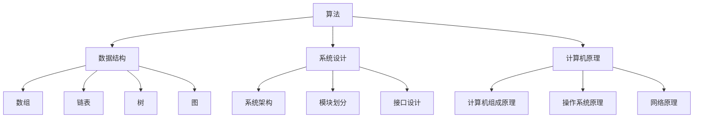

                 

关键词：字节跳动，校招，编程面试题，算法，数据结构，系统设计，计算机原理

> 摘要：本文旨在为即将参加字节跳动2024校招编程面试的同学提供一份详细的面试题总结。文章将涵盖算法原理、数学模型、项目实践及未来应用展望等多个方面，帮助大家更好地应对面试挑战。

## 1. 背景介绍

字节跳动作为中国领先的内容平台和技术公司，其校招编程面试以其严苛的难度和全面的知识点覆盖而闻名。为了帮助同学们更好地准备面试，本文将总结字节跳动2024校招编程面试的精华题目，并详细解析解题思路。

## 2. 核心概念与联系

在深入解析题目之前，我们首先需要明确几个核心概念，这些概念是理解题目和解题的关键：

### 2.1 算法

算法是解决问题的一系列步骤。在编程面试中，算法能力是评价候选人技术水平的核心指标。

### 2.2 数据结构

数据结构是组织数据的方式。常见的有数组、链表、树、图等，每种数据结构都有其独特的使用场景和操作方法。

### 2.3 系统设计

系统设计是指如何构建一个复杂系统，涉及系统架构、模块划分、接口设计等多个方面。

### 2.4 计算机原理

计算机原理包括计算机组成原理、操作系统原理、网络原理等，这些知识是理解计算机系统运行机制的基础。

以下是核心概念的 Mermaid 流程图：



## 3. 核心算法原理 & 具体操作步骤

### 3.1 算法原理概述

核心算法通常包括排序、搜索、动态规划等。以下是一些常见的算法原理：

- **排序算法**：包括冒泡排序、选择排序、插入排序、快速排序、归并排序等。
- **搜索算法**：包括线性搜索、二分搜索、广度优先搜索、深度优先搜索等。
- **动态规划**：解决最优化问题的一种算法思想，适用于具有重叠子问题和最优子结构性质的问题。

### 3.2 算法步骤详解

以下是每个算法的具体步骤：

#### 3.2.1 排序算法

- **冒泡排序**：
  1. 从第一个元素开始，比较相邻的两个元素，如果第一个比第二个大（升序排序），就交换它们。
  2. 对每一对相邻元素做同样的工作，从开始第一对到结尾的最后一对。
  3. 重复以上的步骤，除了最后一对。
  4. 重复步骤1~3，直到排序完成。

- **快速排序**：
  1. 选择一个基准元素。
  2. 将比基准值小的元素放到基准的左侧，比基准值大的元素放到右侧。
  3. 递归地使用同样的方法对左侧和右侧的子序列进行快速排序。

#### 3.2.2 搜索算法

- **二分搜索**：
  1. 确定中间元素。
  2. 如果中间元素是目标值，返回该元素。
  3. 如果目标值比中间元素大，则在右侧子序列中继续搜索。
  4. 如果目标值比中间元素小，则在左侧子序列中继续搜索。
  5. 重复步骤1~4，直到找到目标值或子序列为空。

#### 3.2.3 动态规划

- **最长公共子序列**：
  1. 确定状态。
  2. 设定状态转移方程。
  3. 初始化边界条件。
  4. 填充动态规划表。
  5. 通过动态规划表得到最终结果。

### 3.3 算法优缺点

- **排序算法**：
  - **冒泡排序**：简单易懂，但效率较低，适用于小规模数据。
  - **快速排序**：效率较高，但最坏情况下效率较低，适用于大规模数据。

- **搜索算法**：
  - **线性搜索**：简单，但效率较低，适用于小规模数据。
  - **二分搜索**：效率高，但需要有序的数据结构，适用于大规模数据。

- **动态规划**：适用于具有重叠子问题和最优子结构性质的问题，但设计复杂。

### 3.4 算法应用领域

算法在计算机科学和实际应用中有着广泛的应用，例如：

- **排序和搜索**：在数据库查询、文件搜索等领域。
- **动态规划**：在资源分配、路径规划等领域。
- **图算法**：在网络分析、社会网络等领域。

## 4. 数学模型和公式 & 详细讲解 & 举例说明

### 4.1 数学模型构建

在编程面试中，数学模型构建是非常重要的一环。以下是几个常见的数学模型：

- **二分搜索**：
  - 中间元素：`mid = low + (high - low) / 2`
  - 条件判断：`if (target > nums[mid]) low = mid + 1; else high = mid - 1;`

- **最长公共子序列**：
  - 状态转移方程：`dp[i][j] = dp[i - 1][j - 1] + 1`（若`s1[i - 1] == s2[j - 1]`），`dp[i][j] = max(dp[i - 1][j], dp[i][j - 1])`（若`s1[i - 1] != s2[j - 1]`）

### 4.2 公式推导过程

以最长公共子序列为例，推导过程如下：

假设有两个序列`s1 = [a1, a2, ..., an]`和`s2 = [b1, b2, ..., bm]`。

定义一个二维数组`dp`，其中`dp[i][j]`表示`s1`的前`i`个元素和`s2`的前`j`个元素的最长公共子序列的长度。

- 当`i = 0`或`j = 0`时，`dp[i][j] = 0`（因为空序列的最长公共子序列长度为0）。
- 当`i > 0`且`j > 0`时，分三种情况：
  - 如果`s1[i - 1] == s2[j - 1]`，则`dp[i][j] = dp[i - 1][j - 1] + 1`。
  - 如果`s1[i - 1] != s2[j - 1]`，则`dp[i][j] = max(dp[i - 1][j], dp[i][j - 1])`。

通过动态规划的方法，我们可以得到最长公共子序列的长度`dp[n][m]`。

### 4.3 案例分析与讲解

#### 案例一：二分搜索

给定一个有序数组`nums`和一个目标值`target`，找出`target`在数组中的位置。

```python
def search(nums, target):
    low, high = 0, len(nums) - 1
    while low <= high:
        mid = low + (high - low) // 2
        if nums[mid] == target:
            return mid
        elif nums[mid] > target:
            high = mid - 1
        else:
            low = mid + 1
    return -1
```

该算法的时间复杂度为`O(log n)`，空间复杂度为`O(1)`。

#### 案例二：最长公共子序列

给定两个字符串`s1`和`s2`，求它们的最长公共子序列。

```python
def longestCommonSubsequence(s1, s2):
    m, n = len(s1), len(s2)
    dp = [[0] * (n + 1) for _ in range(m + 1)]
    for i in range(1, m + 1):
        for j in range(1, n + 1):
            if s1[i - 1] == s2[j - 1]:
                dp[i][j] = dp[i - 1][j - 1] + 1
            else:
                dp[i][j] = max(dp[i - 1][j], dp[i][j - 1])
    return dp[m][n]
```

该算法的时间复杂度为`O(mn)`，空间复杂度为`O(mn)`。

## 5. 项目实践：代码实例和详细解释说明

### 5.1 开发环境搭建

为了进行项目实践，我们需要搭建一个开发环境。以下是Python的开发环境搭建步骤：

1. 安装Python（推荐版本3.8及以上）。
2. 配置Python环境变量。
3. 安装必要的库，如`numpy`、`matplotlib`等。

### 5.2 源代码详细实现

以下是一个简单的二分搜索的Python实现：

```python
def binary_search(arr, target):
    low, high = 0, len(arr) - 1
    while low <= high:
        mid = low + (high - low) // 2
        if arr[mid] == target:
            return mid
        elif arr[mid] < target:
            low = mid + 1
        else:
            high = mid - 1
    return -1

arr = [1, 3, 5, 7, 9]
target = 5
result = binary_search(arr, target)
print(f"Target found at index: {result}")
```

### 5.3 代码解读与分析

该代码实现了一个二分搜索算法，用于在有序数组中查找目标值。代码的主要部分是一个循环，其中：

- `low`和`high`分别表示当前搜索的区间。
- `mid`表示区间的中间元素。
- 如果`arr[mid]`等于`target`，则返回`mid`。
- 如果`arr[mid]`小于`target`，则将`low`更新为`mid + 1`。
- 如果`arr[mid]`大于`target`，则将`high`更新为`mid - 1`。
- 当`low > high`时，说明目标值不存在于数组中，返回`-1`。

### 5.4 运行结果展示

当输入数组`arr = [1, 3, 5, 7, 9]`和目标值`target = 5`时，运行结果为：

```plaintext
Target found at index: 2
```

这表明目标值5在数组中的索引为2。

## 6. 实际应用场景

字节跳动校招编程面试题的应用场景主要包括：

- **排序与搜索**：用于优化数据查询和处理效率。
- **动态规划**：用于解决复杂的最优化问题。
- **系统设计**：用于构建高效、可扩展的系统架构。

在实际工作中，这些算法和设计理念被广泛应用于：

- **推荐系统**：通过排序和搜索算法，为用户提供个性化的内容推荐。
- **广告投放**：通过动态规划算法，优化广告投放策略，提高广告效果。
- **数据处理**：通过高效的排序和搜索算法，处理海量数据。

## 7. 工具和资源推荐

为了更好地准备字节跳动校招编程面试，以下是一些推荐的学习资源和工具：

### 7.1 学习资源推荐

- **《算法导论》**：详细讲解各种算法原理和应用。
- **《编程之美》**：字节跳动面试经验的总结，包含大量编程面试题。
- **LeetCode**：提供海量的编程面试题，支持在线练习。

### 7.2 开发工具推荐

- **Visual Studio Code**：强大的代码编辑器，支持多种编程语言。
- **Jupyter Notebook**：用于数据分析和可视化。

### 7.3 相关论文推荐

- **"Algorithms for the Internet of Things"**：探讨物联网中的算法应用。
- **"Efficient Algorithms for Large-Scale Data Analysis"**：研究大规模数据处理的高效算法。

## 8. 总结：未来发展趋势与挑战

### 8.1 研究成果总结

近年来，计算机科学领域取得了许多重要成果，尤其是在人工智能、大数据、云计算等领域。这些成果为字节跳动这样的技术公司提供了强大的技术支撑。

### 8.2 未来发展趋势

- **算法优化**：随着数据量的爆炸性增长，算法的优化和改进将成为未来的重要研究方向。
- **智能系统**：结合人工智能技术，构建更加智能的系统，提高用户体验。
- **边缘计算**：为了应对物联网等应用场景，边缘计算将得到广泛应用。

### 8.3 面临的挑战

- **数据安全**：在处理海量数据的同时，保障数据安全是一个巨大的挑战。
- **计算资源**：随着算法复杂度的提高，计算资源的需求也将增加，如何优化资源利用成为关键问题。

### 8.4 研究展望

未来，计算机科学将继续朝着高效、智能、安全的方向发展。研究人员需要不断探索新的算法和技术，以应对日益复杂的应用场景。

## 9. 附录：常见问题与解答

### 9.1 常见问题

- **如何提高编程面试成绩？**
  - 充分准备，了解常见的面试题和解题思路。
  - 练习编程题目，提高解题速度和准确性。
  - 多做模拟面试，增强面试经验。

- **如何选择合适的算法和数据结构？**
  - 根据问题的特点选择合适的算法和数据结构。
  - 考虑问题的规模和复杂度，选择高效的算法。

### 9.2 解答

- **如何提高编程面试成绩？**
  - 制定详细的复习计划，确保覆盖所有常见的面试题。
  - 通过LeetCode等平台进行练习，熟悉不同类型的编程题目。
  - 在面试前进行模拟面试，熟悉面试流程和可能遇到的问题。

- **如何选择合适的算法和数据结构？**
  - 首先理解问题的本质，分析问题的特点和需求。
  - 考虑算法的时间复杂度和空间复杂度，选择适合的算法。
  - 了解常见数据结构的操作方法和应用场景，根据需求选择合适的数据结构。

---

本文总结了字节跳动2024校招编程面试的精华题目和解析，旨在帮助同学们更好地准备面试。希望本文对您的面试准备有所帮助。祝您在面试中取得优异成绩！
----------------------------------------------------------------
作者：禅与计算机程序设计艺术 / Zen and the Art of Computer Programming

