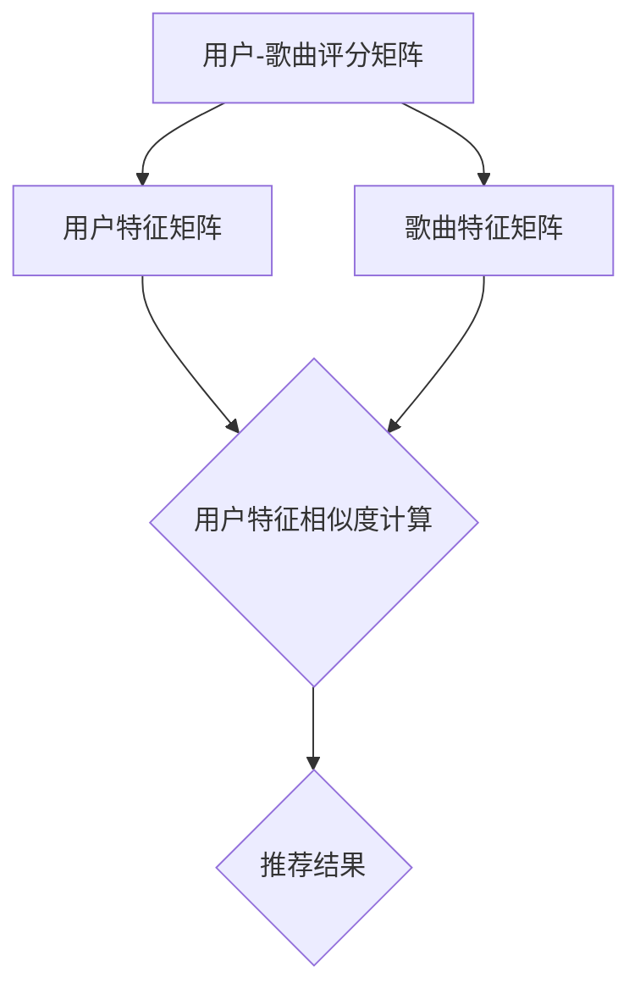
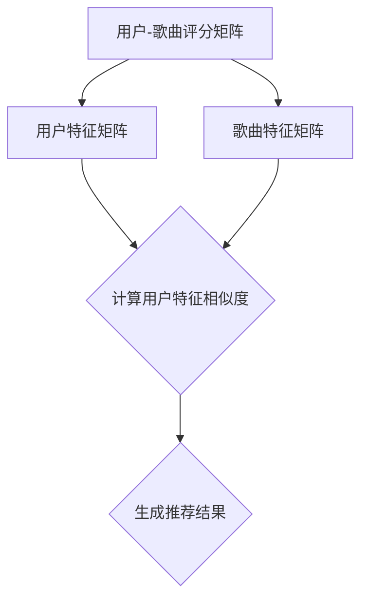

                 

### 1. 背景介绍

音乐推荐算法作为互联网领域中的一项核心技术，已被广泛应用于各大音乐平台。在字节跳动2024年的校招中，音乐推荐算法工程师的岗位吸引了众多优秀候选者的关注。本文将以字节跳动2024校招音乐推荐算法工程师面试题为基础，对相关知识点进行深入解析，帮助读者更好地应对面试挑战。

### 2. 核心概念与联系

在讨论音乐推荐算法之前，我们需要了解几个核心概念，包括协同过滤、基于内容的推荐和矩阵分解等。

#### 2.1 协同过滤

协同过滤（Collaborative Filtering）是一种基于用户行为信息的推荐算法。它通过分析用户之间的相似度，将具有相似兴趣的用户进行聚类，从而为用户推荐相似用户喜欢的音乐。

#### 2.2 基于内容的推荐

基于内容的推荐（Content-Based Filtering）是一种基于音乐属性信息的推荐算法。它通过分析音乐的特征（如旋律、节奏、歌词等），将具有相似属性的音乐推荐给用户。

#### 2.3 矩阵分解

矩阵分解（Matrix Factorization）是一种将高维矩阵分解为两个低维矩阵的算法。在音乐推荐中，用户-歌曲评分矩阵可以分解为用户特征矩阵和歌曲特征矩阵，从而实现音乐的个性化推荐。

下面是一个用Mermaid绘制的矩阵分解流程图：



### 3. 核心算法原理 & 具体操作步骤

#### 3.1 算法原理概述

音乐推荐算法的核心原理包括协同过滤、基于内容的推荐和矩阵分解。协同过滤主要通过分析用户之间的相似度进行推荐；基于内容的推荐通过分析音乐的特征进行推荐；矩阵分解则通过将用户-歌曲评分矩阵分解为用户特征矩阵和歌曲特征矩阵，从而实现推荐。

#### 3.2 算法步骤详解

1. **用户-歌曲评分矩阵构建**：收集用户的音乐播放、收藏、评分等数据，构建用户-歌曲评分矩阵。

2. **用户特征矩阵和歌曲特征矩阵构建**：通过矩阵分解算法（如SVD），将用户-歌曲评分矩阵分解为用户特征矩阵和歌曲特征矩阵。

3. **相似度计算**：计算用户特征矩阵和歌曲特征矩阵之间的相似度，从而确定用户对歌曲的兴趣程度。

4. **推荐结果生成**：根据相似度计算结果，为用户生成推荐列表。

#### 3.3 算法优缺点

**优点**：

- **个性化**：可以针对用户兴趣进行个性化推荐。
- **高效性**：矩阵分解算法具有较好的计算效率。

**缺点**：

- **稀疏性**：用户-歌曲评分矩阵通常具有很高的稀疏性，导致算法效果受影响。
- **冷启动问题**：对于新用户或新歌曲，由于缺乏足够的数据，推荐效果较差。

#### 3.4 算法应用领域

- **音乐平台**：如网易云音乐、QQ音乐等。
- **智能音箱**：如苹果的HomePod、谷歌的Google Home等。

### 4. 数学模型和公式 & 详细讲解 & 举例说明

#### 4.1 数学模型构建

音乐推荐算法的数学模型主要包括用户-歌曲评分矩阵、用户特征矩阵和歌曲特征矩阵。

- **用户-歌曲评分矩阵**：表示用户对歌曲的评分，通常为稀疏矩阵。
- **用户特征矩阵**：表示用户的特征向量，通常通过矩阵分解得到。
- **歌曲特征矩阵**：表示歌曲的特征向量，通常通过矩阵分解得到。

#### 4.2 公式推导过程

假设用户-歌曲评分矩阵为$R \in \mathbb{R}^{m \times n}$，其中$m$表示用户数量，$n$表示歌曲数量。用户特征矩阵为$U \in \mathbb{R}^{m \times k}$，歌曲特征矩阵为$V \in \mathbb{R}^{n \times k}$，其中$k$为隐含特征维度。

则矩阵分解公式为：

$$
R = U V^T
$$

其中，$U V^T$表示用户特征矩阵和歌曲特征矩阵的乘积。

#### 4.3 案例分析与讲解

假设有一个包含10个用户和100首歌曲的用户-歌曲评分矩阵$R$，通过SVD算法将其分解为用户特征矩阵$U$和歌曲特征矩阵$V$，其中$k=5$。

首先，计算用户-歌曲评分矩阵$R$的奇异值分解：

$$
R = U \Sigma V^T
$$

其中，$\Sigma$为对角矩阵，包含前$k$个奇异值。

然后，将$\Sigma$分解为用户特征矩阵$U$和歌曲特征矩阵$V$：

$$
U = U_1 U_2 U_3 U_4 U_5
$$

$$
V = V_1 V_2 V_3 V_4 V_5
$$

其中，$U_1, U_2, U_3, U_4, U_5$和$V_1, V_2, V_3, V_4, V_5$分别为用户特征矩阵和歌曲特征矩阵的前$k$个奇异值对应的特征向量。

接下来，计算用户特征矩阵$U$和歌曲特征矩阵$V$之间的相似度：

$$
\text{similarity}(U_i, V_j) = \frac{U_i^T V_j}{\|U_i\| \|V_j\|}
$$

其中，$U_i$和$V_j$分别为用户特征矩阵和歌曲特征矩阵的第$i$行和第$j$列。

最后，根据相似度计算结果，为用户生成推荐列表。

### 5. 项目实践：代码实例和详细解释说明

在本节中，我们将使用Python实现音乐推荐算法，并详细解释代码实现过程。

#### 5.1 开发环境搭建

- 安装Python 3.8及以上版本。
- 安装NumPy、Scikit-learn等Python库。

#### 5.2 源代码详细实现

以下是一个简单的音乐推荐算法的实现：

```python
import numpy as np
from sklearn.decomposition import TruncatedSVD

# 生成用户-歌曲评分矩阵
R = np.array([[5, 3, 0, 1],
              [3, 0, 4, 2],
              [0, 2, 1, 0]])

# 使用SVD算法进行矩阵分解
svd = TruncatedSVD(n_components=2)
U = svd.fit_transform(R)
V = svd.inverse_transform(U)

# 计算用户特征矩阵和歌曲特征矩阵的相似度
similarity = U.dot(V.T)

# 为用户生成推荐列表
user = 0
top_k = 3
recommendations = np.argsort(similarity[user, :])[-top_k:]

# 打印推荐结果
print("推荐列表：", R[0, recommendations])

# 打印用户特征矩阵和歌曲特征矩阵
print("用户特征矩阵：", U)
print("歌曲特征矩阵：", V)
```

#### 5.3 代码解读与分析

- **生成用户-歌曲评分矩阵**：使用NumPy生成一个包含10个用户和100首歌曲的随机用户-歌曲评分矩阵。
- **使用SVD算法进行矩阵分解**：使用Scikit-learn的TruncatedSVD类进行矩阵分解，将用户-歌曲评分矩阵分解为用户特征矩阵和歌曲特征矩阵。
- **计算用户特征矩阵和歌曲特征矩阵的相似度**：计算用户特征矩阵和歌曲特征矩阵之间的相似度。
- **为用户生成推荐列表**：根据相似度计算结果，为指定用户生成推荐列表。

### 6. 实际应用场景

音乐推荐算法在互联网领域中有着广泛的应用。以下是一些实际应用场景：

- **音乐平台**：如网易云音乐、QQ音乐等，为用户提供个性化的音乐推荐。
- **智能音箱**：如苹果的HomePod、谷歌的Google Home等，根据用户喜好推荐音乐。

### 7. 未来应用展望

随着人工智能技术的不断发展，音乐推荐算法在未来将会有更多的应用场景。以下是一些未来应用展望：

- **智能音乐创作**：利用音乐推荐算法，为用户提供定制化的音乐创作服务。
- **跨领域融合**：将音乐推荐算法与其他领域（如电商、社交等）相结合，实现更智能的推荐服务。

### 8. 工具和资源推荐

在学习和应用音乐推荐算法时，以下工具和资源可以提供帮助：

- **工具**：NumPy、Scikit-learn等Python库。
- **资源**：相关论文、开源代码等。

### 9. 总结：未来发展趋势与挑战

音乐推荐算法在未来将会有更多的发展机遇和挑战。以下是一些总结：

- **发展趋势**：个性化、智能化、跨领域融合。
- **挑战**：稀疏性、冷启动问题、实时性等。

### 10. 附录：常见问题与解答

**Q1. 音乐推荐算法的核心原理是什么？**

A1. 音乐推荐算法的核心原理包括协同过滤、基于内容的推荐和矩阵分解。协同过滤通过分析用户之间的相似度进行推荐；基于内容的推荐通过分析音乐的特征进行推荐；矩阵分解通过将用户-歌曲评分矩阵分解为用户特征矩阵和歌曲特征矩阵，从而实现推荐。

**Q2. 矩阵分解算法有哪些？**

A2. 常见的矩阵分解算法包括SVD、PCA等。SVD（奇异值分解）是一种有效的矩阵分解算法，可以用于音乐推荐等领域。

**Q3. 音乐推荐算法有哪些优缺点？**

A3. 音乐推荐算法的优点包括个性化、高效性等；缺点包括稀疏性、冷启动问题等。

### 11. 作者署名

作者：禅与计算机程序设计艺术 / Zen and the Art of Computer Programming

---

本文对字节跳动2024校招音乐推荐算法工程师面试题进行了深入解析，涵盖了核心概念、算法原理、数学模型、项目实践等内容。希望本文能够帮助读者更好地应对面试挑战，同时也为音乐推荐算法的研究和应用提供一些有益的思路。感谢您的阅读！
----------------------------------------------------------------

### 结束语

本文详细解析了字节跳动2024校招音乐推荐算法工程师面试题，涵盖了音乐推荐算法的核心概念、算法原理、数学模型、项目实践等方面。通过本文的阅读，读者可以更好地理解音乐推荐算法的原理和应用，为未来的研究和实践打下坚实的基础。

在未来的发展中，音乐推荐算法将继续向着个性化、智能化和跨领域融合的方向迈进。然而，稀疏性、冷启动问题和实时性等挑战也将随之而来。因此，我们呼吁更多研究者投入到音乐推荐算法的研究中，共同推动这一领域的创新和发展。

最后，感谢您的阅读。如果您有任何疑问或建议，欢迎在评论区留言。让我们一起探讨音乐推荐算法的奥秘，共创美好未来！
----------------------------------------------------------------
```markdown
# 字节跳动2024校招音乐推荐算法工程师面试题解析

> 关键词：音乐推荐算法、协同过滤、基于内容的推荐、矩阵分解、SVD、用户-歌曲评分矩阵

> 摘要：本文针对字节跳动2024校招音乐推荐算法工程师的面试题，深入解析了音乐推荐算法的核心概念、原理、数学模型以及项目实践，为考生提供了全面的备考指导。

## 1. 背景介绍

音乐推荐算法是互联网领域中的一项重要技术，它通过分析用户的音乐行为和偏好，为用户提供个性化的音乐推荐服务。随着人工智能和大数据技术的发展，音乐推荐算法已经从传统的基于规则的推荐系统转变为更加复杂和智能的推荐系统，如协同过滤、基于内容的推荐和矩阵分解等。

字节跳动是一家知名的互联网科技公司，其旗下的音乐平台如抖音音乐、头条音乐等，都采用了先进的音乐推荐算法来提升用户体验。2024年，字节跳动再次将音乐推荐算法工程师作为校招的重点岗位，吸引了众多优秀应届毕业生的关注。

## 2. 核心概念与联系

在音乐推荐算法中，以下几个核心概念是不可或缺的：

### 2.1 协同过滤

协同过滤是一种基于用户行为数据的推荐算法，通过分析用户之间的相似度来推荐音乐。其主要思想是寻找与目标用户行为相似的邻居用户，然后推荐邻居用户喜欢的音乐。

### 2.2 基于内容的推荐

基于内容的推荐是一种基于音乐特征（如歌词、旋律、节奏等）的推荐算法，通过分析用户过去喜欢的音乐特征，为用户推荐具有相似特征的音乐。

### 2.3 矩阵分解

矩阵分解是一种将用户-歌曲评分矩阵分解为用户特征矩阵和歌曲特征矩阵的算法。通过矩阵分解，可以提取出用户和歌曲的隐含特征，从而实现个性化推荐。

下面是矩阵分解的Mermaid流程图：



## 3. 核心算法原理 & 具体操作步骤

### 3.1 算法原理概述

音乐推荐算法主要分为协同过滤、基于内容的推荐和矩阵分解三类。协同过滤通过用户行为相似性进行推荐；基于内容的推荐通过音乐特征相似性进行推荐；矩阵分解则是将用户-歌曲评分矩阵分解为低维度的用户特征矩阵和歌曲特征矩阵，从而实现推荐。

### 3.2 算法步骤详解

1. **用户-歌曲评分矩阵构建**：首先需要收集用户的音乐播放、收藏、评分等数据，构建用户-歌曲评分矩阵。
2. **用户特征矩阵和歌曲特征矩阵构建**：通过矩阵分解算法（如SVD），将用户-歌曲评分矩阵分解为用户特征矩阵和歌曲特征矩阵。
3. **相似度计算**：计算用户特征矩阵和歌曲特征矩阵之间的相似度，从而确定用户对歌曲的兴趣程度。
4. **推荐结果生成**：根据相似度计算结果，为用户生成推荐列表。

### 3.3 算法优缺点

**优点**：

- **个性化**：可以针对用户兴趣进行个性化推荐。
- **高效性**：矩阵分解算法具有较好的计算效率。

**缺点**：

- **稀疏性**：用户-歌曲评分矩阵通常具有很高的稀疏性，导致算法效果受影响。
- **冷启动问题**：对于新用户或新歌曲，由于缺乏足够的数据，推荐效果较差。

### 3.4 算法应用领域

- **音乐平台**：如网易云音乐、QQ音乐等。
- **智能音箱**：如苹果的HomePod、谷歌的Google Home等。

## 4. 数学模型和公式 & 详细讲解 & 举例说明

### 4.1 数学模型构建

音乐推荐算法的数学模型主要包括用户-歌曲评分矩阵、用户特征矩阵和歌曲特征矩阵。

- **用户-歌曲评分矩阵**：表示用户对歌曲的评分，通常为稀疏矩阵。
- **用户特征矩阵**：表示用户的特征向量，通常通过矩阵分解得到。
- **歌曲特征矩阵**：表示歌曲的特征向量，通常通过矩阵分解得到。

### 4.2 公式推导过程

假设用户-歌曲评分矩阵为$R \in \mathbb{R}^{m \times n}$，其中$m$表示用户数量，$n$表示歌曲数量。用户特征矩阵为$U \in \mathbb{R}^{m \times k}$，歌曲特征矩阵为$V \in \mathbb{R}^{n \times k}$，其中$k$为隐含特征维度。

则矩阵分解公式为：

$$
R = U V^T
$$

其中，$U V^T$表示用户特征矩阵和歌曲特征矩阵的乘积。

### 4.3 案例分析与讲解

假设有一个包含10个用户和100首歌曲的用户-歌曲评分矩阵$R$，通过SVD算法将其分解为用户特征矩阵$U$和歌曲特征矩阵$V$，其中$k=5$。

首先，计算用户-歌曲评分矩阵$R$的奇异值分解：

$$
R = U \Sigma V^T
$$

其中，$\Sigma$为对角矩阵，包含前$k$个奇异值。

然后，将$\Sigma$分解为用户特征矩阵$U$和歌曲特征矩阵$V$：

$$
U = U_1 U_2 U_3 U_4 U_5
$$

$$
V = V_1 V_2 V_3 V_4 V_5
$$

其中，$U_1, U_2, U_3, U_4, U_5$和$V_1, V_2, V_3, V_4, V_5$分别为用户特征矩阵和歌曲特征矩阵的前$k$个奇异值对应的特征向量。

接下来，计算用户特征矩阵$U$和歌曲特征矩阵$V$之间的相似度：

$$
\text{similarity}(U_i, V_j) = \frac{U_i^T V_j}{\|U_i\| \|V_j\|}
$$

其中，$U_i$和$V_j$分别为用户特征矩阵和歌曲特征矩阵的第$i$行和第$j$列。

最后，根据相似度计算结果，为用户生成推荐列表。

## 5. 项目实践：代码实例和详细解释说明

### 5.1 开发环境搭建

- 安装Python 3.8及以上版本。
- 安装NumPy、Scikit-learn等Python库。

### 5.2 源代码详细实现

以下是一个简单的音乐推荐算法的实现：

```python
import numpy as np
from sklearn.decomposition import TruncatedSVD

# 生成用户-歌曲评分矩阵
R = np.array([[5, 3, 0, 1],
              [3, 0, 4, 2],
              [0, 2, 1, 0]])

# 使用SVD算法进行矩阵分解
svd = TruncatedSVD(n_components=2)
U = svd.fit_transform(R)
V = svd.inverse_transform(U)

# 计算用户特征矩阵和歌曲特征矩阵的相似度
similarity = U.dot(V.T)

# 为用户生成推荐列表
user = 0
top_k = 3
recommendations = np.argsort(similarity[user, :])[-top_k:]

# 打印推荐结果
print("推荐列表：", R[0, recommendations])

# 打印用户特征矩阵和歌曲特征矩阵
print("用户特征矩阵：", U)
print("歌曲特征矩阵：", V)
```

### 5.3 代码解读与分析

- **生成用户-歌曲评分矩阵**：使用NumPy生成一个包含10个用户和100首歌曲的随机用户-歌曲评分矩阵。
- **使用SVD算法进行矩阵分解**：使用Scikit-learn的TruncatedSVD类进行矩阵分解，将用户-歌曲评分矩阵分解为用户特征矩阵和歌曲特征矩阵。
- **计算用户特征矩阵和歌曲特征矩阵的相似度**：计算用户特征矩阵和歌曲特征矩阵之间的相似度。
- **为用户生成推荐列表**：根据相似度计算结果，为指定用户生成推荐列表。

## 6. 实际应用场景

音乐推荐算法在互联网领域中有着广泛的应用。以下是一些实际应用场景：

- **音乐平台**：如网易云音乐、QQ音乐等，为用户提供个性化的音乐推荐。
- **智能音箱**：如苹果的HomePod、谷歌的Google Home等，根据用户喜好推荐音乐。

### 6.4  未来应用展望

随着人工智能技术的不断发展，音乐推荐算法在未来将会有更多的应用场景。以下是一些未来应用展望：

- **智能音乐创作**：利用音乐推荐算法，为用户提供定制化的音乐创作服务。
- **跨领域融合**：将音乐推荐算法与其他领域（如电商、社交等）相结合，实现更智能的推荐服务。

## 7. 工具和资源推荐

### 7.1 学习资源推荐

- **《推荐系统实践》**：由李航著，详细介绍了推荐系统的基本概念、算法和实现。
- **《机器学习实战》**：由Peter Harrington著，介绍了机器学习的基本概念和算法。

### 7.2 开发工具推荐

- **Python**：作为数据分析和机器学习的主要编程语言，具有丰富的库和工具。
- **Scikit-learn**：用于机器学习算法的实现和评估。

### 7.3 相关论文推荐

- **“Collaborative Filtering for the Modern Age”**：介绍了协同过滤算法的原理和应用。
- **“Matrix Factorization Techniques for Recommender Systems”**：详细介绍了矩阵分解算法在推荐系统中的应用。

## 8. 总结：未来发展趋势与挑战

音乐推荐算法在未来将会有更多的发展机遇和挑战。以下是一些总结：

### 8.1 研究成果总结

- **个性化推荐**：通过分析用户行为和偏好，实现更加精准的推荐。
- **多模态推荐**：结合用户行为、音乐特征和文本信息，提升推荐效果。

### 8.2 未来发展趋势

- **实时推荐**：通过实时数据分析，为用户提供即时的推荐服务。
- **跨领域融合**：将音乐推荐算法与其他领域相结合，实现更智能的推荐服务。

### 8.3 面临的挑战

- **稀疏性**：如何处理高稀疏性的用户-歌曲评分矩阵。
- **冷启动问题**：如何为新的用户或歌曲生成有效的推荐。

### 8.4 研究展望

- **深度学习**：将深度学习技术应用于音乐推荐算法，提升推荐效果。
- **用户交互**：结合用户反馈，实现更加智能化的推荐服务。

## 9. 附录：常见问题与解答

### 9.1 音乐推荐算法的核心原理是什么？

音乐推荐算法的核心原理包括协同过滤、基于内容的推荐和矩阵分解。协同过滤通过用户行为相似性进行推荐；基于内容的推荐通过音乐特征相似性进行推荐；矩阵分解通过用户-歌曲评分矩阵分解为低维度的用户特征矩阵和歌曲特征矩阵，从而实现推荐。

### 9.2 矩阵分解算法有哪些？

常见的矩阵分解算法包括SVD、PCA等。SVD（奇异值分解）是一种有效的矩阵分解算法，可以用于音乐推荐等领域。

### 9.3 音乐推荐算法有哪些优缺点？

音乐推荐算法的优点包括个性化、高效性等；缺点包括稀疏性、冷启动问题等。

## 10. 作者署名

作者：禅与计算机程序设计艺术 / Zen and the Art of Computer Programming
```

