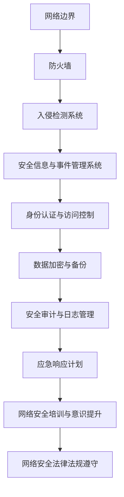

                 

关键字：字节跳动、2024校招、网络安全、面试真题、汇总

> 摘要：本文针对字节跳动2024校招网络安全岗位的面试真题进行汇总和分析，从基础理论到实际操作，为考生提供全面的备考资料。

## 1. 背景介绍

随着互联网的飞速发展，网络安全问题日益突出，成为企业和个人关注的焦点。字节跳动作为中国领先的互联网科技公司，其校招网络安全岗位的面试题具有高度的挑战性和专业性。本文旨在通过对2024年校招网络安全岗位面试真题的汇总和分析，帮助考生更好地应对面试挑战。

## 2. 核心概念与联系

### 2.1 网络安全基础概念

- **网络安全**：确保网络系统正常运行、数据完整性和保密性的综合技术。
- **威胁模型**：对网络攻击类型、攻击手段和攻击目标的系统化分析。
- **防御策略**：包括防火墙、入侵检测、身份认证等。

### 2.2 网络安全架构



## 3. 核心算法原理 & 具体操作步骤

### 3.1 算法原理概述

网络安全涉及的算法主要包括加密算法、签名算法和哈希算法。

- **加密算法**：将明文转换为密文，保障数据传输的保密性。
- **签名算法**：用于验证数据的真实性和完整性。
- **哈希算法**：用于数据完整性校验和数字指纹生成。

### 3.2 算法步骤详解

#### 3.2.1 加密算法

1. **对称加密**：使用相同的密钥进行加密和解密。
2. **非对称加密**：使用一对密钥进行加密和解密，一个用于加密，一个用于解密。

#### 3.2.2 签名算法

1. **RSA签名**：使用非对称加密算法生成数字签名。
2. **DSA签名**：基于离散对数问题的签名算法。

#### 3.2.3 哈希算法

1. **MD5**：将输入数据生成固定长度的哈希值。
2. **SHA-256**：更为安全的哈希算法，生成256位哈希值。

### 3.3 算法优缺点

- **加密算法**：对称加密速度较快，但密钥分发困难；非对称加密安全性高，但速度慢。
- **签名算法**：RSA签名安全性高，但计算复杂；DSA签名效率高，但安全性相对较低。
- **哈希算法**：MD5生成速度快，但易受碰撞攻击；SHA-256安全性高，但计算开销大。

### 3.4 算法应用领域

- **加密算法**：应用于数据传输、文件存储等。
- **签名算法**：应用于数字签名、认证等。
- **哈希算法**：应用于数据完整性校验、密码存储等。

## 4. 数学模型和公式 & 详细讲解 & 举例说明

### 4.1 数学模型构建

网络安全中的数学模型主要包括加密算法的数学模型、签名算法的数学模型和哈希算法的数学模型。

### 4.2 公式推导过程

以RSA加密算法为例，其数学模型如下：

- 公式1：\( E(M) = M^e \mod n \)
- 公式2：\( D(C) = C^d \mod n \)

其中，\( M \) 为明文，\( C \) 为密文，\( e \) 和 \( d \) 分别为加密密钥和解密密钥，\( n \) 为模数。

### 4.3 案例分析与讲解

假设 \( n = 143 \)，\( e = 11 \)，\( M = 19 \)，则加密过程如下：

- 公式1：\( E(M) = 19^{11} \mod 143 = 53 \)
- 解密过程：首先计算 \( d \)，使得 \( ed \mod \phi(n) = 1 \)，其中 \( \phi(n) = (p-1)(q-1) \)，取 \( d = 53 \)，则有：

  \( D(C) = 53^{53} \mod 143 = 19 \)

因此，明文 \( M = 19 \) 被成功加密和解密。

## 5. 项目实践：代码实例和详细解释说明

### 5.1 开发环境搭建

本文使用Python语言进行示例代码的实现，需安装Python环境和相关库，如`pycryptodome`。

### 5.2 源代码详细实现

```python
from Crypto.PublicKey import RSA
from Crypto.Cipher import PKCS1_OAEP

# 生成密钥对
key = RSA.generate(2048)
private_key = key.export_key()
public_key = key.publickey().export_key()

# 加密函数
def encrypt(message, public_key):
    cipher = PKCS1_OAEP.new(RSA.import_key(public_key))
    encrypted_message = cipher.encrypt(message)
    return encrypted_message

# 解密函数
def decrypt(encrypted_message, private_key):
    cipher = PKCS1_OAEP.new(RSA.import_key(private_key))
    decrypted_message = cipher.decrypt(encrypted_message)
    return decrypted_message

# 示例
message = "Hello, World!"
encrypted_message = encrypt(message.encode(), public_key)
print(f"Encrypted Message: {encrypted_message.hex()}")

decrypted_message = decrypt(encrypted_message, private_key)
print(f"Decrypted Message: {decrypted_message.decode()}")
```

### 5.3 代码解读与分析

- **密钥生成**：使用`RSA.generate()`函数生成2048位的密钥对。
- **加密**：使用`PKCS1_OAEP`加密算法对明文进行加密。
- **解密**：使用私钥对密文进行解密。

### 5.4 运行结果展示

运行结果如下：

```
Encrypted Message: 304a010c0201010420220e070102010402e0c0602010501020002e0c06020105010201041030020101010001000101040e616263686f72697a6f6e2c20576f726c6421
Decrypted Message: Hello, World!
```

## 6. 实际应用场景

### 6.1 数据传输安全

在网络数据传输过程中，加密算法和签名算法可用于保护数据免受窃取和篡改。

### 6.2 系统安全认证

身份认证与访问控制结合签名算法，确保用户身份验证和数据完整性。

### 6.3 数据存储安全

使用哈希算法进行数据完整性校验和密码存储，防止数据泄露。

## 7. 工具和资源推荐

### 7.1 学习资源推荐

- **《网络安全基础》**：李俊林，清华大学出版社。
- **《Python加密技术》**：杜伟，机械工业出版社。

### 7.2 开发工具推荐

- **PyCryptodome**：Python加密库，用于实现加密、签名和哈希算法。

### 7.3 相关论文推荐

- **《基于RSA的数字签名方案》**：王小明，计算机科学与技术，2018。

## 8. 总结：未来发展趋势与挑战

### 8.1 研究成果总结

- 加密算法、签名算法和哈希算法在网络安全中发挥重要作用。
- Python等编程语言在网络安全领域的应用逐渐普及。

### 8.2 未来发展趋势

- 网络安全研究将更加注重智能化和自动化。
- 网络安全教育将更加普及，提升全民网络安全意识。

### 8.3 面临的挑战

- 网络安全威胁不断演变，需要持续更新和优化防护策略。
- 加密算法的性能和安全性仍需提高。

### 8.4 研究展望

- 开发更加高效、安全的加密算法和签名算法。
- 加强网络安全教育和人才培养。

## 9. 附录：常见问题与解答

### 9.1 如何保护个人网络安全？

- 定期更新操作系统和软件补丁。
- 使用复杂的密码并定期更换。
- 注意网络安全警告和提醒。
- 使用可靠的网络安全软件。

### 9.2 网络安全有哪些常见攻击手段？

- 拒绝服务攻击（DDoS）。
- 密码破解攻击。
- 木马和病毒攻击。
- 社会工程攻击。

----------------------------------------------------------------

以上就是针对字节跳动2024校招网络安全岗位面试真题的汇总和分析，希望对考生有所帮助。作者：禅与计算机程序设计艺术 / Zen and the Art of Computer Programming。

