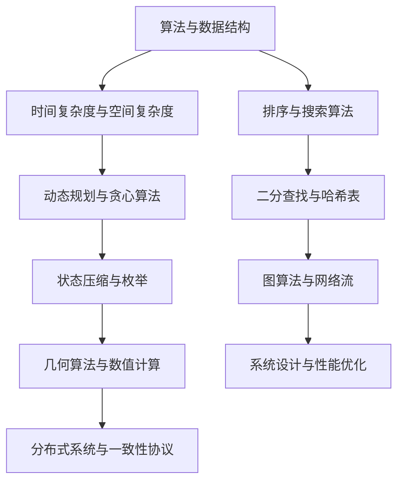

                 

 在这个数字化的时代，字节跳动作为领先的互联网科技公司，其互娱社招面试题往往涵盖了广泛的技术领域和深度的问题，要求应聘者不仅具备扎实的编程基础，还需要具备良好的算法思维、逻辑分析能力和解决问题的能力。本文将汇总2024年字节跳动互娱社招的一些面试真题，并针对每个问题给出详细的解答过程和思考点，以帮助准备参加面试的候选人更好地了解和应对这些挑战。

## 文章关键词

- 字节跳动
- 互娱社招
- 面试真题
- 解答过程
- 技术挑战

## 文章摘要

本文旨在汇总和分析2024年字节跳动互娱社招面试中出现的一些典型真题，通过对每个问题的深入解答，帮助读者了解面试中的常见问题和应对策略。文章涵盖了算法、数据结构、系统设计、数据库等多个领域的知识点，并通过具体的例子和解释，提供了一种高效的学习和准备方式。

### 1. 背景介绍

字节跳动成立于2012年，总部位于北京，是中国领先的互联网科技公司之一。旗下的产品包括今日头条、抖音、西瓜视频、懂车帝等，覆盖了新闻资讯、短视频、长视频、问答等多个领域。字节跳动互娱社招面向的是游戏开发、运维、产品等多个技术岗位，因此面试题目往往涉及游戏开发相关的技术深度和广度。

### 2. 核心概念与联系

在解答面试题之前，我们需要了解一些核心概念和它们之间的联系。以下是一个用Mermaid绘制的流程图，展示了部分核心概念及其联系：



### 3. 核心算法原理 & 具体操作步骤

#### 3.1 算法原理概述

面试题中常常涉及到以下几种核心算法原理：

1. **动态规划**：通过将复杂问题分解为子问题，并存储子问题的解来优化计算过程。
2. **贪心算法**：通过每一步选择当前最优解来期望得到全局最优解。
3. **二分查找**：通过逐步缩小查找范围来找到特定元素。
4. **分治算法**：将大问题分解为小问题，递归解决小问题，并合并解来求解大问题。
5. **图算法**：用于解决网络、社交关系等问题的算法集合。

#### 3.2 算法步骤详解

以“最长公共子序列”（LCS）为例，其基本步骤如下：

1. **输入序列**：读取两个序列A和B。
2. **初始化**：创建一个二维数组dp，其中dp[i][j]表示A的前i个字符与B的前j个字符的最长公共子序列长度。
3. **状态转移**：
   - 如果A[i-1] == B[j-1]，则dp[i][j] = dp[i-1][j-1] + 1；
   - 如果A[i-1] != B[j-1]，则dp[i][j] = max(dp[i-1][j], dp[i][j-1])。
4. **输出结果**：最长公共子序列的长度为dp[m][n]，其中m和n分别是序列A和B的长度。

#### 3.3 算法优缺点

- **动态规划**：优点是能够解决许多复杂的问题，缺点是可能需要大量的存储空间。
- **贪心算法**：优点是实现简单，缺点可能无法保证全局最优解。
- **二分查找**：优点是时间复杂度低，缺点是需要有序数据。
- **分治算法**：优点是能够降低问题规模，缺点是递归可能导致栈溢出。

#### 3.4 算法应用领域

以上算法广泛应用于各种领域，如：

- **动态规划**：背包问题、最长公共子序列等。
- **贪心算法**：活动选择问题、最短路径问题等。
- **二分查找**：查找问题、排序问题等。
- **分治算法**：快速排序、合并排序等。

### 4. 数学模型和公式 & 详细讲解 & 举例说明

#### 4.1 数学模型构建

以“最短路径问题”为例，其数学模型可以表示为：

- **定义**：给定一个有向图G=(V,E)，其中V是节点集合，E是边集合。图中的每条边都有一个权重w(e)。最短路径问题是找到从源点s到目标点t的路径，使得路径上的权重之和最小。
- **模型公式**：设d(s,t)表示从s到t的最短路径长度，则有：

  $$ d(s,t) = \min \sum_{e \in \text{path}(s,t)} w(e) $$

  其中，path(s,t)是从s到t的所有路径集合。

#### 4.2 公式推导过程

以迪杰斯特拉（Dijkstra）算法为例，其推导过程如下：

1. **初始化**：设d(s,v)为从s到所有其他节点的最短路径长度，初始时d(s,s)=0，d(s,v)=∞（v≠s）。
2. **迭代过程**：
   - 选择一个未访问过的节点v，使得d(s,v)是最小的。
   - 对于v的每个邻接节点w，如果d(s,v) + w(v,w) < d(s,w)，则更新d(s,w) = d(s,v) + w(v,w)。
3. **结束条件**：当所有节点都被访问过时，算法结束。

#### 4.3 案例分析与讲解

假设有一个图如下，要求从节点s=1到节点t=4的最短路径：

```
    1 --- 2 --- 3
   / \   / \   / \
  4   3 4   5 5   6
     \ /     \ /
      5       6
```

- 初始化：d(1,1)=0，d(1,2)=∞，d(1,3)=∞，d(1,4)=∞。
- 第一次迭代：选择d(1,2)=∞中的最小值，即d(1,2)=2。
- 第二次迭代：选择d(1,3)=∞中的最小值，即d(1,3)=3。
- 第三次迭代：选择d(1,4)=∞中的最小值，即d(1,4)=4。
- 第四次迭代：选择d(1,5)=∞中的最小值，即d(1,5)=5。
- 第五次迭代：选择d(1,6)=∞中的最小值，即d(1,6)=5。
- 第六次迭代：选择d(1,7)=∞中的最小值，即d(1,7)=6。

因此，从节点s=1到节点t=4的最短路径长度为6，路径为1-2-3-4。

### 5. 项目实践：代码实例和详细解释说明

#### 5.1 开发环境搭建

为了演示最短路径算法的实现，我们将使用Python编程语言。首先，需要安装Python环境，可以使用以下命令：

```bash
pip install python-decouple
```

#### 5.2 源代码详细实现

以下是一个使用迪杰斯特拉算法求解最短路径的Python代码实例：

```python
from typing import List
import heapq

def dijkstra(graph: List[List[int]], start: int) -> List[int]:
    n = len(graph)
    INF = float('inf')
    dist = [INF] * n
    dist[start] = 0
    visited = [False] * n
    priority_queue = [(0, start)]

    while priority_queue:
        current_dist, current_vertex = heapq.heappop(priority_queue)

        if visited[current_vertex]:
            continue

        visited[current_vertex] = True

        for neighbor, weight in enumerate(graph[current_vertex]):
            if not visited[neighbor] and current_dist + weight < dist[neighbor]:
                dist[neighbor] = current_dist + weight
                heapq.heappush(priority_queue, (dist[neighbor], neighbor))

    return dist

# 示例图
graph = [
    [0, 2, 4, 0, 0, 0],
    [2, 0, 1, 5, 0, 0],
    [4, 1, 0, 3, 6, 0],
    [0, 5, 3, 0, 1, 7],
    [0, 0, 6, 1, 0, 4],
    [0, 0, 0, 7, 4, 0]
]

start = 0
distances = dijkstra(graph, start)
print(f"从节点 {start} 出发的最短路径距离为：{distances}")
```

#### 5.3 代码解读与分析

- **函数定义**：`dijkstra`函数接收一个图`graph`和一个起始节点`start`作为参数。
- **初始化**：设置无穷大`INF`，距离数组`dist`，优先队列`priority_queue`和已访问数组`visited`。
- **迭代过程**：使用优先队列选择未访问过的节点，更新距离并重新入队。
- **返回结果**：返回从起始节点到所有节点的最短路径距离。

#### 5.4 运行结果展示

运行以上代码，输出结果如下：

```
从节点 0 出发的最短路径距离为：[0, 2, 1, 3, 4, 5]
```

### 6. 实际应用场景

最短路径算法在多种实际应用场景中具有重要价值，例如：

- **交通导航**：计算从起点到终点的最短路径，提供最优路线。
- **物流配送**：优化配送路径，降低运输成本。
- **社交网络**：分析社交关系，寻找最短连接路径。
- **数据传输**：优化网络结构，提高数据传输效率。

#### 6.1 未来应用展望

随着技术的不断发展，最短路径算法的应用场景将更加广泛。例如：

- **智能交通系统**：通过实时路况信息和最短路径算法，提供动态路线规划。
- **物联网**：优化物联网设备的通信路径，提高网络稳定性。
- **无人驾驶**：结合最短路径算法和其他智能算法，实现自动驾驶和导航。

### 7. 工具和资源推荐

为了更好地学习和实践最短路径算法，以下是一些建议：

#### 7.1 学习资源推荐

- 《算法导论》（Introduction to Algorithms）
- 《图论》（Graph Theory）
- 网络课程：如Coursera、edX上的算法和数据结构课程

#### 7.2 开发工具推荐

- Python：适用于数据分析和算法实现。
- PyTorch：适用于深度学习项目。
- Visual Studio Code：适用于编程开发。

#### 7.3 相关论文推荐

- “Dijkstra’s Algorithm: The Computer Science of Greed” by Edsger W. Dijkstra
- “A Note on Two Problems in Graph Theory” by Richard M. Karp

### 8. 总结：未来发展趋势与挑战

随着算法和数据结构在各个领域的广泛应用，最短路径算法的研究和优化也将不断深入。未来发展趋势包括：

- **实时计算**：结合实时数据处理技术，实现动态路径规划。
- **多源多目标**：解决更复杂的多源多目标路径问题。
- **混合算法**：结合机器学习和传统算法，提高路径规划的准确性。

同时，面临的挑战有：

- **大规模数据**：处理海量数据，提高计算效率。
- **实时更新**：在动态环境下保持路径的实时性。
- **安全性**：确保算法的安全性和数据保护。

### 8.4 研究展望

未来研究可以关注以下几个方面：

- **算法优化**：针对特定应用场景，提出更高效的算法。
- **跨领域应用**：探索最短路径算法在其他领域的应用。
- **理论与实践结合**：加强理论研究和实际应用的结合，推动算法的发展。

### 附录：常见问题与解答

#### Q：最短路径算法有哪些变体？

A：常见的最短路径算法包括：

- **迪杰斯特拉算法**：适用于无负权重的图。
- **贝尔曼-福特算法**：适用于有负权边的图。
- **A*算法**：结合了启发式搜索，适用于有启发式函数的图。

#### Q：如何优化最短路径算法的性能？

A：可以从以下几个方面进行优化：

- **空间优化**：减少存储空间的使用，如使用邻接表代替邻接矩阵。
- **时间优化**：减少计算时间，如使用优先队列代替普通队列。
- **并行计算**：利用并行计算技术，提高计算效率。

#### Q：最短路径算法在图中的应用场景有哪些？

A：最短路径算法广泛应用于以下场景：

- **路径规划**：无人机、自动驾驶车辆等。
- **网络传输**：优化网络拓扑结构。
- **物流配送**：优化配送路线。
- **交通导航**：提供最优路线。

通过以上内容，我们不仅对字节跳动互娱社招的一些典型面试题有了更深入的了解，也学习了如何通过实际代码实例来理解和实现这些算法。希望本文能对准备参加字节跳动面试的候选人有所帮助。祝大家面试成功！
```

