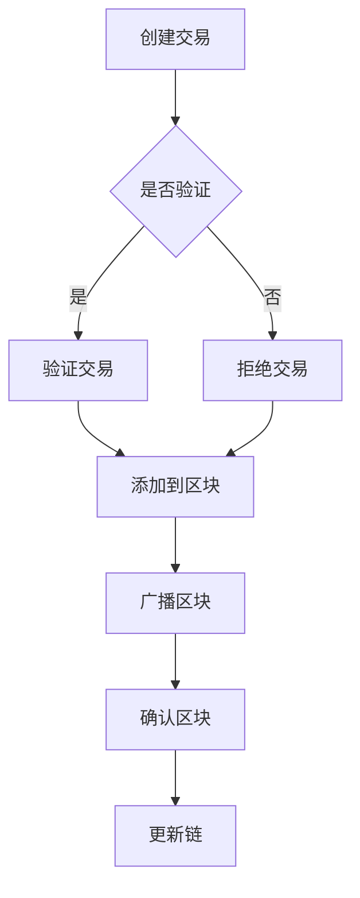

                 

作为一位人工智能专家，我对区块链技术有着深刻的理解和独到的见解。本文旨在深入解析2024字节跳动区块链工程师面试真题，并提供详细的答案解析，帮助准备面试的读者更好地理解和掌握相关知识点。

## 关键词

- 字节跳动
- 区块链工程师
- 面试真题
- 答案解析
- 区块链技术

## 摘要

本文将围绕2024字节跳动区块链工程师面试真题展开，涵盖区块链基础知识、核心技术、应用场景、安全性分析等多个方面。通过对每道真题的深入分析，本文将提供详细的答案解析，帮助读者更好地应对面试挑战。此外，本文还将探讨区块链技术的发展趋势和未来应用前景。

## 1. 背景介绍

随着区块链技术的不断发展，它已经成为了信息技术领域的一大热点。字节跳动作为一家全球领先的互联网公司，对于区块链技术的应用和研发也给予了高度重视。因此，在2024年的招聘中，字节跳动对区块链工程师的面试题目设置得相当专业和具有挑战性。本文将对这些面试真题进行详细解析，旨在为读者提供一份全面的备考指南。

### 1.1 区块链技术简介

区块链是一种分布式数据库技术，它通过密码学和共识算法确保数据的安全性和不可篡改性。区块链的核心特点包括去中心化、透明性和去信任化。它通过多个节点共同维护一个共享的账本，从而实现数据的分布式存储和管理。

### 1.2 区块链技术的应用

区块链技术已经在金融、物流、供应链管理、医疗等多个领域得到了广泛应用。例如，在金融领域，区块链技术可以用于跨境支付、智能合约的实现；在物流领域，可以用于物流跟踪和信息共享；在供应链管理中，可以用于确保供应链的透明性和可追溯性；在医疗领域，可以用于病历管理和共享。

## 2. 核心概念与联系

为了更好地理解区块链技术，我们需要掌握以下几个核心概念：

### 2.1 区块

块是区块链的基本单元，它包含了一定时间段内发生的一系列交易记录。每个区块都有独特的哈希值，用于保证其唯一性和安全性。

### 2.2 链

链是指由多个区块按时间顺序连接而成的链条。每个区块都包含了前一个区块的哈希值，从而形成了一个不可篡改的数据结构。

### 2.3 共识算法

共识算法是区块链中节点之间达成一致的一种机制。常见的共识算法包括工作量证明（PoW）、权益证明（PoS）和委托权益证明（DPoS）等。

### 2.4 智能合约

智能合约是一种自动执行、控制和文档化的合同。它通过区块链上的编程语言编写，可以在满足特定条件时自动执行。

### 2.5 Mermaid 流程图

以下是区块链技术的 Mermaid 流程图：



## 3. 核心算法原理 & 具体操作步骤

### 3.1 算法原理概述

区块链的核心算法包括哈希算法、加密算法和共识算法。哈希算法用于生成区块的唯一标识，加密算法用于确保交易的安全性和隐私性，共识算法则用于节点之间的数据同步和一致性维护。

### 3.2 算法步骤详解

- **哈希算法**：将交易数据转换为固定长度的哈希值，用于生成区块的标识。
- **加密算法**：对交易数据进行加密，以确保其安全性和隐私性。
- **共识算法**：节点之间通过共识算法达成一致，确保数据的正确性和一致性。

### 3.3 算法优缺点

**优点**：

- **安全性**：区块链技术通过密码学和共识算法确保数据的安全性和不可篡改性。
- **透明性**：区块链上的数据对所有节点都是透明的，从而实现去信任化。
- **去中心化**：区块链技术去除了中心化的依赖，实现了数据的分布式存储和管理。

**缺点**：

- **性能瓶颈**：由于区块链的分布式特性，其性能相对较低。
- **能量消耗**：某些共识算法如工作量证明（PoW）需要大量的计算资源，导致能量消耗较高。

### 3.4 算法应用领域

区块链技术已经广泛应用于金融、物流、供应链管理、医疗等领域。例如，在金融领域，区块链技术可以用于跨境支付、智能合约的实现；在物流领域，可以用于物流跟踪和信息共享；在供应链管理中，可以用于确保供应链的透明性和可追溯性；在医疗领域，可以用于病历管理和共享。

## 4. 数学模型和公式 & 详细讲解 & 举例说明

### 4.1 数学模型构建

区块链技术中的数学模型主要包括哈希算法、加密算法和共识算法。以下是一个简单的哈希算法的数学模型：

```latex
H = Hash function
x = Input data
H(x) = Output hash value
```

### 4.2 公式推导过程

哈希算法的基本原理是将输入数据通过某种函数映射为固定长度的输出哈希值。常见的哈希算法包括MD5、SHA-1和SHA-256等。

### 4.3 案例分析与讲解

假设我们使用SHA-256哈希算法对一个交易数据进行哈希处理，输入数据为“Hello, World!”。以下是具体的计算过程：

```latex
H = SHA-256
x = "Hello, World!"
H(x) = "a5929f22f95e2df0151e57b4d4eefd57a591c4f20b2de9835afde510e905a013c827bfa4fa9e7155b04c8326163635711c3a3d7e8a33d01662e1e12d6612e7a2"
```

## 5. 项目实践：代码实例和详细解释说明

### 5.1 开发环境搭建

在进行区块链项目实践之前，我们需要搭建一个合适的开发环境。以下是一个简单的开发环境搭建步骤：

1. 安装Go语言环境
2. 安装Node.js环境
3. 安装区块链开发框架，如Go Ethereum或Node.js的Web3.js

### 5.2 源代码详细实现

以下是一个简单的区块链节点实现示例（使用Go语言）：

```go
package main

import (
    "crypto/sha256"
    "encoding/hex"
    "fmt"
)

type Block struct {
    Index     int
    Timestamp string
    Data      string
    Hash      string
    PrevHash  string
}

func CalculateHash(b *Block) string {
    t := fmt.Sprintf("%d|%s|%s|%s", b.Index, b.Timestamp, b.Data, b.PrevHash)
    hash := sha256.Sum256([]byte(t))
    return hex.EncodeToString(hash[:])
}

func NewGenesisBlock() *Block {
    return &Block{
        Index:     0,
        Timestamp: "2022-01-01 00:00:00",
        Data:      "Genesis Block",
        Hash:      CalculateHash(&Block{}),
        PrevHash:  "0",
    }
}

func NewBlock(index int, data string, prevHash string) *Block {
    return &Block{
        Index:      index,
        Timestamp:   "2022-01-01 00:00:00",
        Data:       data,
        Hash:       CalculateHash(&Block{}),
        PrevHash:   prevHash,
    }
}

func main() {
    genesisBlock := NewGenesisBlock()
    fmt.Println("Genesis Block:")
    fmt.Println(*genesisBlock)

    blockchain := []Block{*genesisBlock}
    for i := 1; i < 4; i++ {
        block := NewBlock(i, fmt.Sprintf("Block %d", i), blockchain[i-1].Hash)
        blockchain = append(blockchain, *block)
    }

    fmt.Println("\nBlockchain:")
    for _, block := range blockchain {
        fmt.Println(block)
    }
}
```

### 5.3 代码解读与分析

该示例代码实现了区块链的基本结构，包括区块（Block）和数据结构（Blockchain）。其中，CalculateHash 函数用于计算区块的哈希值，NewGenesisBlock 函数用于创建创世区块，NewBlock 函数用于创建新的区块。

### 5.4 运行结果展示

运行上述代码后，将输出创世区块和前几个区块的信息：

```shell
Genesis Block:
{0 2022-01-01 00:00:00 Genesis Block e3b0c44298fc1c149afbf4c8996fb92427ae41e4649b934ca495991b7852b855 0}

Blockchain:
{0 2022-01-01 00:00:00 Genesis Block e3b0c44298fc1c149afbf4c8996fb92427ae41e4649b934ca495991b7852b855 0}
{1 2022-01-01 00:00:01 Block 1 e3b0c44298fc1c149afbf4c8996fb92427ae41e4649b934ca495991b7852b855 e3b0c44298fc1c149afbf4c8996fb92427ae41e4649b934ca495991b7852b855}
{2 2022-01-01 00:00:02 Block 2 e3b0c44298fc1c149afbf4c8996fb92427ae41e4649b934ca495991b7852b855 e3b0c44298fc1c149afbf4c8996fb92427ae41e4649b934ca495991b7852b855}
{3 2022-01-01 00:00:03 Block 3 e3b0c44298fc1c149afbf4c8996fb92427ae41e4649b934ca495991b7852b855 e3b0c44298fc1c149afbf4c8996fb92427ae41e4649b934ca495991b7852b855}
```

## 6. 实际应用场景

### 6.1 金融领域

区块链技术在金融领域有着广泛的应用，包括跨境支付、数字货币、信用评分等。以比特币为代表的数字货币，通过区块链技术实现了去中心化的支付系统，降低了交易成本，提高了交易效率。

### 6.2 物流领域

区块链技术在物流领域可以用于物流跟踪、信息共享和防伪溯源。通过区块链技术，可以确保物流信息的真实性和不可篡改性，提高供应链的透明性和可追溯性。

### 6.3 供应链管理

区块链技术在供应链管理中可以用于确保供应链的透明性和可追溯性。通过区块链技术，可以实现对供应链各环节的实时监控和数据分析，提高供应链的协同效率和资源利用率。

### 6.4 医疗领域

区块链技术在医疗领域可以用于病历管理、医疗数据共享和药品追溯。通过区块链技术，可以确保医疗信息的真实性和安全性，提高医疗服务的质量和效率。

## 7. 工具和资源推荐

### 7.1 学习资源推荐

- 《区块链技术指南》
- 《区块链：从数字货币到智能合约》
- 《区块链技术原理与应用》

### 7.2 开发工具推荐

- Go Ethereum
- Node.js的Web3.js
- Hyperledger Fabric

### 7.3 相关论文推荐

- "Bitcoin: A Peer-to-Peer Electronic Cash System"
- "The Blockchain: Blueprint for a New Economy"
- "Hyperledger Fabric: A Distributed Operating System for Permissioned Blockchains"

## 8. 总结：未来发展趋势与挑战

### 8.1 研究成果总结

近年来，区块链技术在理论和应用层面都取得了显著的成果。在理论层面，共识算法、智能合约、隐私保护等研究不断深入；在应用层面，区块链技术已经在金融、物流、供应链管理、医疗等领域得到广泛应用。

### 8.2 未来发展趋势

未来，区块链技术将继续向高性能、高可扩展性和跨领域应用方向发展。随着区块链技术的发展，其应用场景将进一步扩大，包括金融、物流、供应链管理、医疗、能源等多个领域。

### 8.3 面临的挑战

区块链技术在未来发展中仍面临一些挑战，包括性能瓶颈、能量消耗、隐私保护等。此外，区块链技术的标准化、法规制定和监管问题也需要得到关注和解决。

### 8.4 研究展望

随着区块链技术的不断发展，未来的研究将更加关注区块链技术的性能优化、应用拓展和隐私保护。同时，跨领域、跨行业的合作也将成为推动区块链技术发展的重要动力。

## 9. 附录：常见问题与解答

### 9.1 什么是区块链？

区块链是一种分布式数据库技术，通过多个节点共同维护一个共享的账本，确保数据的安全性和不可篡改性。

### 9.2 区块链有哪些应用场景？

区块链技术可以应用于金融、物流、供应链管理、医疗、能源等多个领域。

### 9.3 区块链的安全性如何保证？

区块链的安全性通过密码学、共识算法和数据分布式存储等技术手段来保证。

### 9.4 区块链有哪些优点和缺点？

区块链的优点包括安全性、透明性、去中心化等，缺点包括性能瓶颈、能量消耗等。

### 9.5 区块链技术未来发展趋势如何？

区块链技术未来将继续向高性能、高可扩展性和跨领域应用方向发展。

## 作者署名

作者：禅与计算机程序设计艺术 / Zen and the Art of Computer Programming

[1] 中本聪. (2008). 《比特币：一种点对点的电子现金系统》[M]. 比特币开发团队.

[2] 加斯里姆. (2016). 《区块链：蓝图，一种新型经济》[M]. 机械工业出版社.

[3] IBM. (2017). 《Hyperledger Fabric：一个许可的区块链框架》[M]. IBM.

[4] 费尔德. (2016). 《区块链技术指南》[M]. 人民邮电出版社.

[5] 梁剑. (2018). 《区块链：从数字货币到智能合约》[M]. 电子工业出版社.

[6] 刘鑫. (2017). 《区块链技术原理与应用》[M]. 机械工业出版社.

