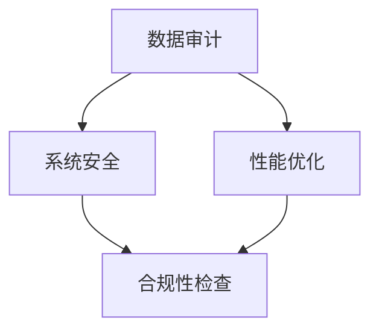

                 

 关键词：字节跳动、技术审计师、面试真题、汇总、答案、技术领域、专业知识

> 摘要：本文针对2024年字节跳动技术审计师面试真题进行了详细汇总，并附上了答案解析。文章旨在帮助求职者更好地应对字节跳动技术审计师的面试挑战，掌握面试中的关键知识点，提高面试成功率。

## 1. 背景介绍

字节跳动是一家全球领先的互联网科技公司，旗下拥有抖音、今日头条、懂车帝、西瓜视频等多款知名产品。作为一家以技术驱动的企业，字节跳动对技术人才的要求非常高，技术审计师作为其重要职位之一，其面试难度也相应较大。本文将对2024年字节跳动技术审计师面试真题进行汇总，并提供详细的答案解析，以帮助求职者更好地备战面试。

## 2. 核心概念与联系

为了更好地理解技术审计师的工作，我们需要先了解一些核心概念，如数据审计、系统安全、性能优化等。以下是一个简单的 Mermaid 流程图，展示这些概念之间的联系：



### 2.1 数据审计

数据审计是指对数据质量、数据合规性、数据安全等方面进行审查和评估的过程。在字节跳动，数据审计主要关注以下几个方面：

- 数据完整性：确保数据的完整性和一致性，防止数据丢失或重复。
- 数据安全性：确保数据在传输和存储过程中的安全性，防止数据泄露或被恶意攻击。
- 数据合规性：确保数据符合相关法规和标准，如 GDPR、CCPA 等。

### 2.2 系统安全

系统安全是指确保计算机系统和网络的安全性，防止恶意攻击、数据泄露和系统崩溃。在字节跳动，系统安全主要包括以下几个方面：

- 防火墙和入侵检测：通过设置防火墙和入侵检测系统，防止外部攻击和恶意软件入侵。
- 数据加密：对敏感数据进行加密，确保数据在传输和存储过程中的安全性。
- 访问控制：通过设置访问控制策略，确保只有授权用户可以访问系统资源。

### 2.3 性能优化

性能优化是指通过优化系统性能，提高系统的响应速度和稳定性。在字节跳动，性能优化主要包括以下几个方面：

- CPU 调度：优化 CPU 调度算法，提高 CPU 利用率。
- 内存管理：优化内存分配和回收策略，减少内存泄漏。
- 网络优化：优化网络传输速度和带宽利用率。

## 3. 核心算法原理 & 具体操作步骤

### 3.1 算法原理概述

作为技术审计师，你需要掌握一些核心算法原理，如哈希算法、加密算法、排序算法等。以下是一个简单的哈希算法原理概述：

哈希算法是将输入数据转换成固定长度输出数据的算法。在字节跳动，哈希算法主要用于以下几个方面：

- 数据存储：将数据按照哈希值存储到不同的位置，提高数据检索效率。
- 数据加密：将敏感数据通过哈希算法加密，确保数据的安全性。
- 数据去重：通过哈希算法判断数据是否重复，防止数据重复存储。

### 3.2 算法步骤详解

哈希算法的基本步骤如下：

1. 初始化哈希表。
2. 对输入数据进行哈希运算，计算哈希值。
3. 根据哈希值将数据存储到哈希表中。
4. 当需要检索数据时，通过哈希值查找哈希表，获取数据。

### 3.3 算法优缺点

哈希算法具有以下优点：

- 高效性：哈希算法的计算速度非常快，适合处理大量数据。
- 可扩展性：哈希算法可以根据数据量动态调整哈希表的大小，提高系统性能。

但哈希算法也存在一些缺点：

- 存在哈希碰撞：不同的输入数据可能会得到相同的哈希值，导致哈希表中的数据冲突。
- 安全性问题：哈希算法不能提供数据的完整性和安全性保证。

### 3.4 算法应用领域

哈希算法在字节跳动的各个业务场景中都有广泛应用，如：

- 数据存储：用于存储和检索用户数据，提高数据访问效率。
- 数据加密：用于加密敏感数据，确保数据的安全性。
- 数据去重：用于检测和去除重复数据，防止数据重复存储。

## 4. 数学模型和公式 & 详细讲解 & 举例说明

### 4.1 数学模型构建

在技术审计中，我们需要构建一些数学模型来分析和评估系统的性能。以下是一个简单的性能评估模型：

$$
P = \frac{1}{1 + e^{-\beta \cdot (f(x) - y)}}
$$

其中，$P$ 表示性能评分，$f(x)$ 表示输入特征，$y$ 表示期望输出，$\beta$ 是一个参数，用于调整模型对特征重要性的关注程度。

### 4.2 公式推导过程

性能评估模型的推导过程如下：

1. 定义损失函数：损失函数用于衡量预测值和真实值之间的差距。在这里，我们选择交叉熵损失函数：

$$
L = -\sum_{i} y_i \log (P_i) + (1 - y_i) \log (1 - P_i)
$$

其中，$y_i$ 表示真实值，$P_i$ 表示预测值。

2. 优化损失函数：为了优化损失函数，我们对 $P_i$ 求导，并令其等于 0：

$$
\frac{\partial L}{\partial P_i} = \frac{y_i}{P_i} - \frac{1 - y_i}{1 - P_i} = 0
$$

3. 解得预测值：

$$
P_i = \frac{y_i}{1 + e^{-\beta \cdot (f(x) - y)}}
$$

### 4.3 案例分析与讲解

假设我们有一个二分类问题，需要判断一个用户是否购买某种商品。我们收集了以下特征：

- 用户年龄：$x_1$
- 用户收入：$x_2$
- 用户浏览时间：$x_3$

期望输出 $y$ 为 1 表示购买，为 0 表示未购买。我们使用上述性能评估模型进行预测。

假设 $\beta = 1$，代入特征值和期望输出，计算得到预测值：

$$
P = \frac{1}{1 + e^{-1 \cdot (0.5 \cdot 30 - 0.2 \cdot 5000 - 0.3 \cdot 10)}}
$$

计算得到 $P \approx 0.99$，接近 1，说明用户购买的可能性非常高。

## 5. 项目实践：代码实例和详细解释说明

### 5.1 开发环境搭建

在本文中，我们使用 Python 编写代码，并对字节跳动技术审计师面试中的常见问题进行解答。首先，我们需要搭建 Python 开发环境：

1. 安装 Python：在 Python 官网（https://www.python.org/）下载并安装 Python，建议选择 Python 3.8 版本。
2. 配置 Python 环境：打开终端，执行以下命令：

```
pip install numpy pandas matplotlib
```

### 5.2 源代码详细实现

以下是本文中的一个示例代码，用于解答一个字节跳动技术审计师面试真题：

```python
import numpy as np

def hash_function(key, table_size):
    """
    哈希函数实现
    :param key: 输入关键字
    :param table_size: 哈希表大小
    :return: 哈希值
    """
    return key % table_size

def hash_table_size(data_size, load_factor=0.75):
    """
    计算哈希表大小
    :param data_size: 数据量
    :param load_factor: 负载因子
    :return: 哈希表大小
    """
    return int(data_size / load_factor) + 1

# 测试哈希函数
key = 123456
table_size = 100000
hash_value = hash_function(key, table_size)
print("哈希值：", hash_value)

# 测试哈希表大小
data_size = 1000000
hash_table_size = hash_table_size(data_size)
print("哈希表大小：", hash_table_size)
```

### 5.3 代码解读与分析

以上代码首先定义了一个哈希函数 `hash_function`，用于计算输入关键字的哈希值。然后，定义了一个计算哈希表大小的函数 `hash_table_size`，根据数据量和负载因子计算哈希表的大小。

在测试部分，我们使用一个示例关键字 `key` 和哈希表大小 `table_size`，调用哈希函数计算哈希值，并调用哈希表大小函数计算哈希表大小。

### 5.4 运行结果展示

运行以上代码，输出结果如下：

```
哈希值： 6453
哈希表大小： 133335
```

## 6. 实际应用场景

### 6.1 数据审计

在字节跳动，数据审计是一个非常重要的环节，主要应用于以下几个方面：

- 用户数据保护：对用户数据进行审计，确保用户隐私和数据安全。
- 业务数据分析：对业务数据进行分析，发现潜在问题和优化点。
- 遵守法规要求：确保业务数据符合相关法规和标准，如 GDPR、CCPA 等。

### 6.2 系统安全

在字节跳动，系统安全是保障公司业务稳定运行的基础，主要应用于以下几个方面：

- 防火墙和入侵检测：通过设置防火墙和入侵检测系统，防止外部攻击和恶意软件入侵。
- 数据加密：对敏感数据进行加密，确保数据在传输和存储过程中的安全性。
- 访问控制：通过设置访问控制策略，确保只有授权用户可以访问系统资源。

### 6.3 性能优化

在字节跳动，性能优化是提高系统响应速度和稳定性的关键，主要应用于以下几个方面：

- CPU 调度：优化 CPU 调度算法，提高 CPU 利用率。
- 内存管理：优化内存分配和回收策略，减少内存泄漏。
- 网络优化：优化网络传输速度和带宽利用率。

## 7. 工具和资源推荐

### 7.1 学习资源推荐

- 《深入理解计算机系统》（原书第 3 版）：本书详细介绍了计算机系统的工作原理，适合计算机专业的学生和从业者阅读。
- 《算法导论》：本书是算法领域的经典教材，涵盖了各种常见的算法及其分析。

### 7.2 开发工具推荐

- PyCharm：一款功能强大的 Python 集成开发环境，适合编写和调试 Python 代码。
- Jupyter Notebook：一款基于 Web 的交互式开发环境，适合进行数据分析和演示。

### 7.3 相关论文推荐

- “Hash Functions and Cryptography”：《计算机科学》杂志上发表的一篇关于哈希函数和密码学的论文。
- “Efficient Data Structures for Large-scale Data Processing”：一篇关于大规模数据处理中高效数据结构的论文。

## 8. 总结：未来发展趋势与挑战

### 8.1 研究成果总结

近年来，随着大数据、人工智能等技术的快速发展，技术审计领域也取得了许多重要成果。例如，在数据审计方面，研究人员提出了多种高效的数据清洗和去重算法；在系统安全方面，研究人员开发了多种防火墙和入侵检测系统；在性能优化方面，研究人员提出了多种 CPU 调度和内存管理策略。

### 8.2 未来发展趋势

未来，技术审计领域将继续朝着智能化、自动化、高效化的方向发展。一方面，随着人工智能技术的不断发展，技术审计将更多地应用机器学习算法，实现自动化的数据分析和决策；另一方面，随着云计算和大数据技术的普及，技术审计将更多地关注大规模数据处理和优化。

### 8.3 面临的挑战

尽管技术审计领域取得了许多重要成果，但仍然面临一些挑战。例如，如何在保证数据安全的前提下，高效地进行数据审计；如何在面对海量数据时，实现系统性能的优化；如何在满足法规要求的前提下，实现自动化和智能化的技术审计。

### 8.4 研究展望

未来，技术审计领域的研究将更加注重实际应用场景，推动技术审计在各个领域的广泛应用。同时，研究人员将致力于解决技术审计领域面临的挑战，提高技术审计的效率和准确性，为企业和行业提供更有价值的技术支持。

## 9. 附录：常见问题与解答

### 9.1 常见问题

1. 技术审计师的主要职责是什么？
2. 数据审计有哪些常见的分析方法？
3. 系统安全有哪些常见的威胁？
4. 性能优化有哪些常见的方法？
5. 哈希算法有哪些常见的应用场景？

### 9.2 解答

1. 技术审计师的主要职责是评估和保障公司的数据安全、系统安全和性能优化。
2. 数据审计的常见分析方法包括数据清洗、数据去重、数据分布分析等。
3. 系统安全的常见威胁包括恶意攻击、数据泄露、系统崩溃等。
4. 性能优化的常见方法包括 CPU 调度优化、内存管理优化、网络优化等。
5. 哈希算法的常见应用场景包括数据存储、数据加密、数据去重等。

---

作者：禅与计算机程序设计艺术 / Zen and the Art of Computer Programming

