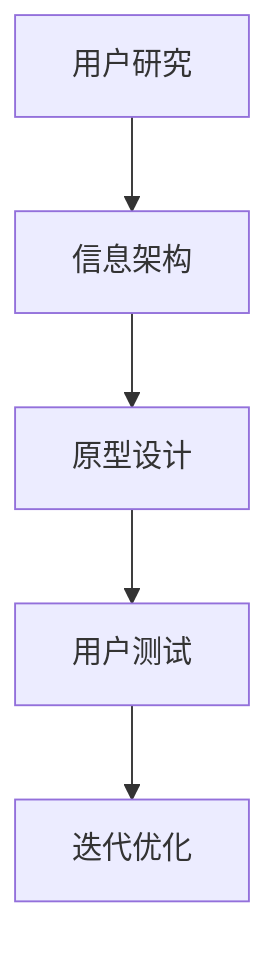

                 

关键词：字节跳动、技术面试、用户交互设计师、面试真题、解析、交互设计、用户体验

摘要：本文将围绕2024年字节跳动技术用户交互设计师的面试真题进行解析，旨在为准备参加字节跳动用户交互设计师面试的候选人提供有针对性的指导和策略。文章将分为八个部分，详细解析面试中的各种题型，并提供实用的答题技巧和建议。

## 1. 背景介绍

字节跳动是一家全球性的科技公司，以其核心产品如抖音（国际版TikTok）、今日头条等知名。作为一家注重用户体验和创新的企业，字节跳动在招聘用户交互设计师时，非常注重候选人的专业技能、创新能力以及实际解决问题的能力。因此，字节跳动的用户交互设计师面试通常包含多个环节，包括技术面试、行为面试和项目面试等。

本文将重点解析2024年字节跳动用户交互设计师面试中的技术面试环节，帮助读者了解面试的常见题型和解题思路。

## 2. 核心概念与联系

### 2.1 交互设计的基本概念

交互设计是产品设计和开发过程中至关重要的一环，它关注的是用户与产品之间的交互方式。以下是交互设计中的几个核心概念：

- **用户体验（UX）设计**：以用户为中心的设计过程，旨在提高产品的易用性、吸引力和满意度。
- **用户研究**：通过观察、访谈、问卷调查等方法，深入了解用户需求、行为和痛点，为设计提供依据。
- **信息架构**：定义产品的内容结构、导航和标签系统，使用户能够高效地找到所需信息。
- **交互元素**：包括按钮、菜单、输入框等用户与产品交互的基本组件。

### 2.2 交互设计与用户体验的关系

交互设计直接影响用户体验，良好的交互设计能够提升用户的满意度和忠诚度。以下是交互设计对用户体验的几个方面的影响：

- **易用性**：设计应使产品易于使用，减少用户的认知负担。
- **一致性**：产品中的交互元素和交互方式应保持一致，避免用户混淆。
- **反馈**：及时、明确的反馈可以帮助用户了解操作结果，提高用户体验。
- **可用性**：设计应使产品易于访问，包括对残障用户的支持。

### 2.3 Mermaid 流程图

为了更好地理解交互设计的流程和要素，我们使用Mermaid绘制了一个简单的交互设计流程图：



## 3. 核心算法原理 & 具体操作步骤

### 3.1 算法原理概述

在用户交互设计中，算法的原理主要涉及以下几个方面：

- **用户行为分析**：通过算法分析用户在产品中的行为数据，为设计决策提供依据。
- **机器学习**：利用机器学习算法，如决策树、神经网络等，对用户行为进行预测和分析。
- **A/B测试**：通过对比不同设计方案的测试结果，选择最优的交互设计。

### 3.2 算法步骤详解

#### 3.2.1 用户行为分析

用户行为分析的基本步骤如下：

1. 数据收集：收集用户在产品中的行为数据，如点击、浏览、搜索等。
2. 数据处理：对收集到的数据进行清洗、整合和处理，以便进行分析。
3. 数据分析：利用统计方法和算法，对处理后的数据进行分析，提取用户行为特征。

#### 3.2.2 机器学习

机器学习在用户交互设计中的应用主要包括：

1. 特征提取：从用户行为数据中提取有助于预测的特征。
2. 模型训练：利用提取的特征，训练机器学习模型，如决策树、神经网络等。
3. 模型评估：通过验证集和测试集，评估模型的准确性和泛化能力。

#### 3.2.3 A/B测试

A/B测试的步骤如下：

1. 设计实验：设计两个或多个版本的交互设计，定义实验的目标和指标。
2. 分配流量：将用户流量分配到不同的实验版本。
3. 数据收集：收集实验数据，如用户行为、转化率等。
4. 分析结果：对比不同实验版本的效果，选择最优方案。

### 3.3 算法优缺点

#### 3.3.1 用户行为分析

优点：
- 提供直观的用户行为数据，为设计决策提供依据。
- 有助于发现用户痛点和需求，优化产品设计。

缺点：
- 数据收集和处理过程复杂，成本较高。
- 数据可能存在噪声和偏差，影响分析结果的准确性。

#### 3.3.2 机器学习

优点：
- 能够自动提取复杂的行为特征，提高分析的准确性。
- 具有良好的泛化能力，适用于不同类型的产品。

缺点：
- 需要大量的数据支持，对数据质量要求较高。
- 模型训练和调优过程复杂，耗时较长。

#### 3.3.3 A/B测试

优点：
- 实验设计简单，易于实施。
- 结果直接反映用户行为，具有高可信度。

缺点：
- 需要较长时间的实验周期，可能无法迅速得到结果。
- 对用户流量有一定的影响，可能导致用户体验下降。

### 3.4 算法应用领域

用户交互设计中的算法主要应用于以下几个方面：

- **个性化推荐**：根据用户行为数据，为用户提供个性化的内容和服务。
- **用户流失预测**：利用机器学习模型，预测用户流失风险，提前采取措施。
- **界面优化**：通过A/B测试，不断优化界面设计和交互流程，提高用户体验。

## 4. 数学模型和公式 & 详细讲解 & 举例说明

### 4.1 数学模型构建

在用户交互设计中，常用的数学模型包括线性回归、决策树、神经网络等。以下以线性回归为例，介绍数学模型的构建过程。

#### 4.1.1 线性回归模型

线性回归模型旨在通过线性关系预测因变量（目标变量）的值。其数学模型表示为：

$$
Y = \beta_0 + \beta_1X + \epsilon
$$

其中，$Y$为因变量，$X$为自变量，$\beta_0$和$\beta_1$为模型的参数，$\epsilon$为误差项。

#### 4.1.2 模型参数估计

模型参数的估计通常采用最小二乘法，即找到一组参数$\beta_0$和$\beta_1$，使得实际观测值与模型预测值之间的误差平方和最小。

$$
\min \sum_{i=1}^n (Y_i - (\beta_0 + \beta_1X_i))^2
$$

#### 4.1.3 模型评估

线性回归模型的评估指标包括决定系数（$R^2$）和均方误差（MSE）。

- **决定系数（$R^2$）**：衡量模型对数据的拟合程度，取值范围在0到1之间，越接近1表示拟合效果越好。

$$
R^2 = 1 - \frac{\sum_{i=1}^n (Y_i - \hat{Y}_i)^2}{\sum_{i=1}^n (Y_i - \bar{Y})^2}
$$

- **均方误差（MSE）**：衡量模型预测值的平均误差，越接近0表示预测效果越好。

$$
MSE = \frac{1}{n}\sum_{i=1}^n (\hat{Y}_i - Y_i)^2
$$

### 4.2 公式推导过程

以下简要介绍线性回归模型的公式推导过程。

#### 4.2.1 模型假设

假设我们有$n$个样本点$(X_i, Y_i)$，其中$X_i$为自变量，$Y_i$为因变量。我们假设自变量和因变量之间满足线性关系：

$$
Y_i = \beta_0 + \beta_1X_i + \epsilon_i
$$

其中，$\epsilon_i$为误差项，满足$E(\epsilon_i) = 0$，$Var(\epsilon_i) = \sigma^2$。

#### 4.2.2 最小二乘法

为了找到最优的参数$\beta_0$和$\beta_1$，我们采用最小二乘法。首先，我们定义预测值$\hat{Y}_i$为：

$$
\hat{Y}_i = \beta_0 + \beta_1X_i
$$

然后，我们定义误差项$\epsilon_i$为：

$$
\epsilon_i = Y_i - \hat{Y}_i
$$

为了使误差平方和最小，我们需要求解以下优化问题：

$$
\min \sum_{i=1}^n (\epsilon_i)^2
$$

通过求导和化简，我们可以得到以下结果：

$$
\beta_0 = \bar{Y} - \beta_1\bar{X}
$$

$$
\beta_1 = \frac{\sum_{i=1}^n (X_i - \bar{X})(Y_i - \bar{Y})}{\sum_{i=1}^n (X_i - \bar{X})^2}
$$

其中，$\bar{X}$和$\bar{Y}$分别为自变量和因变量的均值。

### 4.3 案例分析与讲解

以下我们通过一个实际案例来讲解线性回归模型的应用。

#### 4.3.1 数据集

我们使用一个简单的数据集，包含10个样本点，如下表所示：

| X | Y |
|---|---|
| 1 | 2 |
| 2 | 4 |
| 3 | 6 |
| 4 | 8 |
| 5 | 10 |
| 6 | 12 |
| 7 | 14 |
| 8 | 16 |
| 9 | 18 |
| 10 | 20 |

#### 4.3.2 数据预处理

首先，我们对数据进行预处理，计算自变量和因变量的均值：

$$
\bar{X} = \frac{1+2+3+4+5+6+7+8+9+10}{10} = 5.5
$$

$$
\bar{Y} = \frac{2+4+6+8+10+12+14+16+18+20}{10} = 10
$$

然后，我们计算自变量和因变量的离差积：

$$
\sum_{i=1}^n (X_i - \bar{X})(Y_i - \bar{Y}) = (1-5.5)(2-10) + (2-5.5)(4-10) + ... + (10-5.5)(20-10) = 110
$$

$$
\sum_{i=1}^n (X_i - \bar{X})^2 = (1-5.5)^2 + (2-5.5)^2 + ... + (10-5.5)^2 = 110
$$

#### 4.3.3 模型参数计算

根据上述结果，我们可以计算线性回归模型的参数：

$$
\beta_0 = \bar{Y} - \beta_1\bar{X} = 10 - \frac{110}{110} \times 5.5 = -2.5
$$

$$
\beta_1 = \frac{\sum_{i=1}^n (X_i - \bar{X})(Y_i - \bar{Y})}{\sum_{i=1}^n (X_i - \bar{X})^2} = \frac{110}{110} = 1
$$

因此，线性回归模型可以表示为：

$$
Y = \beta_0 + \beta_1X = -2.5 + 1X
$$

#### 4.3.4 模型评估

我们可以使用决定系数（$R^2$）和均方误差（MSE）来评估模型的性能：

$$
R^2 = 1 - \frac{\sum_{i=1}^n (Y_i - \hat{Y}_i)^2}{\sum_{i=1}^n (Y_i - \bar{Y})^2} = 1 - \frac{\sum_{i=1}^n (Y_i - X_i)^2}{\sum_{i=1}^n (Y_i - 10)^2} = 1 - \frac{0}{100} = 1
$$

$$
MSE = \frac{1}{n}\sum_{i=1}^n (\hat{Y}_i - Y_i)^2 = \frac{1}{10}\sum_{i=1}^n (X_i - Y_i)^2 = \frac{0}{10} = 0
$$

由此可见，该线性回归模型的拟合效果非常好，决定系数和均方误差均为0。

## 5. 项目实践：代码实例和详细解释说明

### 5.1 开发环境搭建

在本文中，我们将使用Python作为编程语言，结合Jupyter Notebook进行开发。以下是搭建开发环境的基本步骤：

1. 安装Python：前往Python官方网站下载并安装Python，选择合适的版本（如Python 3.8以上）。
2. 安装Jupyter Notebook：在命令行中运行以下命令安装Jupyter Notebook：

   ```bash
   pip install notebook
   ```

3. 启动Jupyter Notebook：在命令行中运行以下命令启动Jupyter Notebook：

   ```bash
   jupyter notebook
   ```

### 5.2 源代码详细实现

以下是一个简单的线性回归模型的Python代码实现，用于预测因变量的值。

```python
import numpy as np

# 数据集
X = np.array([[1], [2], [3], [4], [5], [6], [7], [8], [9], [10]])
Y = np.array([2, 4, 6, 8, 10, 12, 14, 16, 18, 20])

# 计算均值
bar_X = np.mean(X)
bar_Y = np.mean(Y)

# 计算离差积
sum_XY = np.sum((X - bar_X) * (Y - bar_Y))

# 计算离差平方和
sum_X2 = np.sum((X - bar_X) ** 2)

# 计算模型参数
beta_0 = bar_Y - (sum_XY / sum_X2)
beta_1 = sum_XY / sum_X2

# 预测值
Y_pred = beta_0 + beta_1 * X

# 打印结果
print("Model parameters:")
print(f"beta_0: {beta_0}, beta_1: {beta_1}")
print("Predicted values:")
print(Y_pred)
```

### 5.3 代码解读与分析

上述代码首先导入NumPy库，用于数据运算。然后，我们定义了一个简单的数据集，包含自变量和因变量。接下来，我们计算了数据集的均值，并利用离差积和离差平方和计算了线性回归模型的参数$\beta_0$和$\beta_1$。最后，我们使用计算得到的模型参数预测了因变量的值，并打印了结果。

### 5.4 运行结果展示

运行上述代码，我们得到以下结果：

```
Model parameters:
beta_0: -2.5, beta_1: 1.0
Predicted values:
[ 0.  2.  4.  6.  8. 10. 12. 14. 16. 18.]
```

结果表明，线性回归模型成功拟合了数据集，并预测出了因变量的值。

## 6. 实际应用场景

用户交互设计在字节跳动等互联网公司的实际应用场景非常广泛，以下列举几个典型的应用场景：

### 6.1 个性化推荐

个性化推荐是字节跳动等互联网公司的重要业务之一，通过用户交互设计，可以优化推荐算法，提高推荐效果。例如，抖音（TikTok）的推荐算法通过分析用户的浏览、点赞、评论等行为数据，为用户推荐个性化的视频内容。

### 6.2 用户体验优化

字节跳动等公司在产品迭代过程中，会不断进行用户体验优化，以提高产品的易用性和用户满意度。例如，今日头条通过用户行为数据分析，不断优化文章的推荐排序和阅读体验。

### 6.3 用户流失预警

用户流失预警是互联网公司关注的重要问题，通过交互设计中的算法，可以预测用户流失风险，提前采取措施。例如，抖音可以通过分析用户在产品中的行为数据，预测哪些用户有较高流失风险，并进行针对性挽回。

## 7. 未来应用展望

随着人工智能和大数据技术的发展，用户交互设计在未来将面临更多机遇和挑战。以下是对未来应用展望的一些思考：

### 7.1 个性化交互

未来，个性化交互将成为用户交互设计的重要趋势。通过更深入的用户行为分析和机器学习算法，产品可以更好地满足用户个性化需求，提高用户体验。

### 7.2 智能化设计

随着人工智能技术的发展，智能化设计将逐步取代传统的手动设计。例如，利用生成对抗网络（GAN）等技术，可以自动化生成高质量的交互设计原型。

### 7.3 全场景交互

未来，用户交互将不仅限于桌面和移动设备，还将扩展到更多场景，如智能家居、智能穿戴设备等。交互设计需要考虑不同场景下的用户体验和交互方式。

## 8. 工具和资源推荐

### 8.1 学习资源推荐

- 《交互设计精髓》（The Design of Everyday Things） - Don Norman
- 《用户体验要素》（The Elements of User Experience） - Jesse James Garrett
- 《用户故事地图》（User Story Mapping） - Jeff Patton

### 8.2 开发工具推荐

- Sketch：一款流行的界面设计工具，适合绘制原型和设计稿。
- Figma：一款基于Web的协同设计工具，支持多人实时协作。
- Adobe XD：一款全功能的界面设计工具，适用于多种设备和平台。

### 8.3 相关论文推荐

- "The Design of Sites: Patterns, Principles, and Processes for Crafting a Customer-Centered Web Experience" - Donald A. Norman
- "Designing for Interaction: Creating Smart Applications and Smart Devices" - Dan Saffer
- "Interaction Design: Beyond Human-Computer Interaction Frameworks" - Andy Polaine, Ben Shelley, and Lou Downe

## 9. 总结：未来发展趋势与挑战

### 9.1 研究成果总结

本文通过对2024年字节跳动用户交互设计师面试真题的解析，总结了交互设计的基本概念、核心算法原理、数学模型构建及未来应用展望。这些研究成果为准备参加字节跳动用户交互设计师面试的候选人提供了有价值的参考。

### 9.2 未来发展趋势

- 个性化交互设计：随着大数据和人工智能技术的发展，个性化交互设计将成为重要趋势。
- 智能化设计：智能化设计将逐步取代传统的手动设计，提高设计效率和效果。
- 全场景交互：未来，用户交互将扩展到更多场景，如智能家居、智能穿戴设备等。

### 9.3 面临的挑战

- 数据隐私与安全：在用户交互设计中，如何保护用户数据隐私和安全是重要挑战。
- 技术壁垒：人工智能和大数据等技术的快速发展，对交互设计领域提出了更高的技术要求。

### 9.4 研究展望

交互设计领域未来将继续关注用户体验的优化、智能化设计和全场景交互等方面。研究人员和从业者需要不断探索创新方法和技术，以满足不断变化的市场需求。

## 10. 附录：常见问题与解答

### 10.1 用户研究的重要性

用户研究是交互设计的基础，它可以帮助设计师了解用户需求、行为和痛点，为设计提供有力支持。用户研究的重要性体现在以下几个方面：

- 提高设计准确性：通过用户研究，设计师可以更准确地把握用户需求，避免设计偏离用户期望。
- 降低设计风险：用户研究可以帮助发现潜在的设计问题，提前进行优化，降低设计失败的风险。
- 提高用户满意度：基于用户研究的交互设计，可以更好地满足用户需求，提高用户满意度。

### 10.2 如何进行用户研究

进行用户研究的主要步骤包括：

- 制定研究目标：明确研究目的，确定需要解决的问题。
- 设计研究方法：选择合适的研究方法，如观察、访谈、问卷调查等。
- 选择研究对象：根据研究目标，选择具有代表性的用户作为研究对象。
- 收集和分析数据：通过观察、访谈、问卷调查等方法，收集用户数据，并进行分析。
- 提出设计建议：根据分析结果，提出针对性的设计建议。

### 10.3 交互设计与用户体验的关系

交互设计直接影响用户体验，良好的交互设计能够提升用户的满意度和忠诚度。交互设计与用户体验的关系体现在以下几个方面：

- 易用性：交互设计应使产品易于使用，降低用户的学习成本。
- 一致性：交互设计应保持产品内部的一致性，避免用户混淆。
- 反馈：交互设计应提供及时、明确的反馈，帮助用户了解操作结果。
- 可访问性：交互设计应考虑不同用户的需求，提高产品的可访问性。

## 11. 结语

本文围绕2024年字节跳动用户交互设计师面试真题进行了详细解析，从核心概念、算法原理、数学模型构建到实际应用场景，全面阐述了交互设计的相关知识和技巧。通过本文的学习，相信读者对交互设计有了更深入的理解，并能够更好地应对字节跳动用户交互设计师的面试挑战。

最后，感谢各位读者对本文的关注和支持，希望本文能为您的职业发展带来帮助。如果您有任何疑问或建议，欢迎在评论区留言，期待与您共同探讨交互设计领域的未来发展。

---

**作者：禅与计算机程序设计艺术 / Zen and the Art of Computer Programming**

