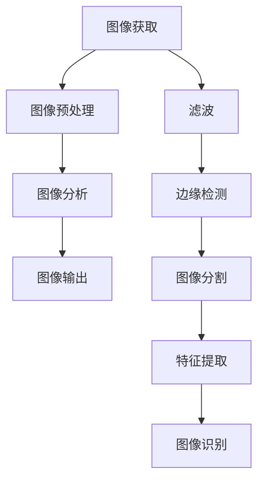

                 

### 背景介绍 Background

随着互联网技术的飞速发展，图像处理在各个领域中的应用越来越广泛。从社交媒体上的美颜滤镜，到医疗诊断中的病变检测，再到自动驾驶中的环境感知，图像处理技术正在深刻地改变着我们的生活方式。在这样的背景下，图像处理工程师成为了科技行业中备受瞩目的职业之一。

字节跳动作为中国领先的互联网科技公司，其业务涵盖了今日头条、抖音、 TikTok等多个知名平台。在这些平台上，图像处理技术不仅用于增强用户体验，还承担着重要的业务驱动角色。因此，字节跳动对图像处理工程师的需求非常强烈，每年的校招都会吸引众多优秀人才的关注。

本篇技术博客文章旨在为参加2024字节跳动校招的图像处理工程师候选人提供一系列面试题的解析。通过对这些面试题的深入剖析，我们将帮助读者更好地理解图像处理领域的核心概念、算法原理以及实际应用。

文章结构如下：

1. 核心概念与联系
2. 核心算法原理与具体操作步骤
3. 数学模型与公式
4. 项目实践：代码实例与详细解释
5. 实际应用场景
6. 未来应用展望
7. 工具和资源推荐
8. 总结与展望

### 文章关键词 Keywords

- 字节跳动
- 图像处理工程师
- 面试题解析
- 核心算法
- 数学模型
- 实际应用
- 未来展望

### 文章摘要 Summary

本文将详细介绍2024字节跳动校招图像处理工程师面试题的解析，覆盖从核心概念到实际应用的一系列内容。通过本文的学习，读者将能够掌握图像处理的基本原理，了解核心算法及其应用，并具备解决实际问题的能力。

## 1. 背景介绍 Background

图像处理作为计算机视觉的一个重要分支，涉及到图像的获取、处理、分析和理解。在图像处理中，最基本的概念包括图像的像素、分辨率、色彩空间等。像素是图像的基本单位，分辨率决定了图像的清晰度，而色彩空间则定义了图像的颜色表示方式。

在计算机视觉领域，图像处理技术有着广泛的应用。例如，在自动驾驶系统中，图像处理技术用于环境感知和障碍物检测；在医疗领域，图像处理技术用于疾病的诊断和病变的检测；在社交媒体中，图像处理技术用于美颜和滤镜效果。

字节跳动作为中国领先的互联网科技公司，其业务涵盖了今日头条、抖音、TikTok等多个知名平台。在这些平台上，图像处理技术不仅用于增强用户体验，还承担着重要的业务驱动角色。例如，抖音平台上的美颜滤镜功能，就是通过图像处理技术实现的，这不仅提升了用户的拍摄体验，还增加了平台的用户粘性。

图像处理工程师在字节跳动的工作主要集中在以下几个方面：

- **图像增强与修复**：通过图像处理技术，改善图像的质量，去除噪点，增强细节。
- **图像识别与分类**：利用深度学习算法，对图像进行分类、识别，实现图像内容理解。
- **实时视频处理**：实现视频的实时处理，包括去抖、去噪、特效添加等。
- **图像数据管理**：对海量图像数据进行存储、管理和分析。

因此，对于参加字节跳动校招的图像处理工程师候选人来说，掌握图像处理的基本原理和核心算法，了解实际应用场景，是非常必要的。本文将通过一系列面试题的解析，帮助读者更好地准备面试，提升自身的竞争力。

### 核心概念与联系 Core Concepts and Relationships

在图像处理领域，核心概念和理论基础是理解和应用各种算法的基础。下面我们将介绍几个关键概念，并展示它们之间的联系。

#### 1.1 图像基本概念

**像素 (Pixel)**：图像的基本组成单元，通常表示为一个二维的阵列。每个像素包含颜色信息和亮度信息。

**分辨率 (Resolution)**：图像的清晰度，通常表示为水平像素数和垂直像素数的乘积。

**色彩空间 (Color Space)**：定义图像中颜色如何表示和存储的数据结构。常见的色彩空间包括RGB、HSV、YUV等。

**图像文件格式 (Image File Formats)**：用于存储和传输图像数据的文件格式，如PNG、JPEG、GIF等。

#### 1.2 图像处理流程

图像处理通常包括以下几个步骤：

1. **图像获取**：通过摄像头、扫描仪或其他设备获取图像数据。
2. **图像预处理**：包括滤波、去噪、对比度增强等，以提高图像质量。
3. **图像分析**：通过图像分割、特征提取、分类等算法，对图像内容进行理解和分析。
4. **图像输出**：将处理后的图像数据展示或存储。

#### 1.3 图像处理算法

**滤波 (Filtering)**：用于去除图像中的噪声，常见的滤波器有均值滤波、高斯滤波、中值滤波等。

**边缘检测 (Edge Detection)**：用于检测图像中的边缘，常用的算法有Sobel算子、Canny算子等。

**图像分割 (Image Segmentation)**：将图像分成多个区域或对象，常用的方法有阈值分割、区域生长等。

**特征提取 (Feature Extraction)**：用于提取图像中的关键特征，如角点、纹理、形状等，常用的算法有Harris角点检测、SIFT、SURF等。

#### 1.4 关键联系

- **像素与分辨率**：像素是构成图像的基本单元，分辨率决定了图像的清晰度。
- **色彩空间与图像处理**：不同的色彩空间对图像处理算法的实现有不同的影响。
- **图像预处理与图像分析**：图像预处理是图像分析的基础，高质量的预处理可以提升图像分析的效果。
- **滤波与边缘检测**：滤波是边缘检测的前置步骤，用于去除噪声，而边缘检测是特征提取的必要步骤。

#### Mermaid 流程图 (Mermaid Flowchart)



通过上述核心概念和流程图的介绍，我们可以清晰地看到图像处理的基础理论和应用场景。接下来，我们将深入探讨图像处理中的核心算法原理，以便更好地理解和应用这些技术。

### 核心算法原理 & 具体操作步骤 Core Algorithm Principles & Detailed Steps

图像处理涉及多种算法，这些算法各有其独特的应用场景和操作步骤。在本节中，我们将重点介绍一些核心算法的原理和具体操作步骤，包括滤波、边缘检测、图像分割和特征提取。

#### 3.1 算法原理概述

**滤波**：滤波是图像处理中最基本的操作之一，主要用于去除图像中的噪声，提高图像质量。滤波器通过在图像上滑动窗口，计算窗口内像素的平均值或加权平均值，从而生成滤波后的图像。

**边缘检测**：边缘检测用于识别图像中的轮廓和边界。常用的边缘检测算法包括Sobel算子、Prewitt算子和Canny算法。这些算法通过计算图像梯度的大小和方向来检测边缘。

**图像分割**：图像分割是将图像划分为多个区域或对象的过程。常见的分割方法有阈值分割、区域生长和基于边缘的分割等。

**特征提取**：特征提取用于提取图像中的关键特征，如角点、纹理、形状等。特征提取的结果可以用于图像识别、分类和匹配。

#### 3.2 算法步骤详解

**3.2.1 滤波**

**均值滤波**：
- **原理**：均值滤波器通过计算窗口内像素的平均值来生成滤波后的像素值。
- **步骤**：
  1. 定义一个滤波窗口（如3x3或5x5）。
  2. 在图像上滑动窗口，计算窗口内所有像素值的平均值。
  3. 将计算得到的平均值赋给中心像素。

**高斯滤波**：
- **原理**：高斯滤波器使用高斯分布函数作为滤波窗口的权重。
- **步骤**：
  1. 创建一个高斯滤波窗口，其权重由高斯分布函数确定。
  2. 在图像上滑动窗口，计算窗口内每个像素的加权平均值。
  3. 将计算得到的加权平均值赋给中心像素。

**中值滤波**：
- **原理**：中值滤波器将窗口内所有像素值排序，并取中值作为滤波后的像素值。
- **步骤**：
  1. 定义一个滤波窗口。
  2. 在图像上滑动窗口，将窗口内像素值排序。
  3. 取排序后的中间值作为滤波后的像素值。

**3.2.2 边缘检测**

**Sobel算子**：
- **原理**：Sobel算子通过计算图像梯度的大小和方向来检测边缘。
- **步骤**：
  1. 分别使用水平和垂直模板进行卷积，计算水平和垂直方向的梯度。
  2. 计算梯度的模和方向，选取梯度最大的方向作为边缘方向。

**Prewitt算子**：
- **原理**：Prewitt算子类似于Sobel算子，但使用不同的模板。
- **步骤**：
  1. 使用水平模板计算水平方向的梯度。
  2. 使用垂直模板计算垂直方向的梯度。
  3. 计算梯度的模和方向。

**Canny算法**：
- **原理**：Canny算法是一种多阶段边缘检测算法，包括预处理、梯度计算和边缘跟踪。
- **步骤**：
  1. 使用高斯滤波器进行预处理，去除噪声。
  2. 使用Sobel算子计算梯度。
  3. 应用非极大值抑制，减少边缘点的冗余。
  4. 使用双阈值算法进行边缘跟踪。

**3.2.3 图像分割**

**阈值分割**：
- **原理**：阈值分割通过设定一个阈值，将图像的像素分为两个类别。
- **步骤**：
  1. 选择合适的阈值。
  2. 将图像的每个像素与阈值进行比较，大于阈值的像素为前景，小于阈值的像素为背景。

**区域生长**：
- **原理**：区域生长通过从初始种子点开始，逐步扩展到相邻像素，形成目标区域。
- **步骤**：
  1. 选择初始种子点。
  2. 对种子点进行扩展，将相邻像素加入区域。
  3. 重复步骤2，直到区域满足特定条件（如大小、形状等）。

**基于边缘的分割**：
- **原理**：基于边缘的分割通过边缘检测算法提取边缘，然后对边缘进行连接和闭合，形成区域。
- **步骤**：
  1. 使用边缘检测算法提取边缘。
  2. 对边缘进行连接和闭合。
  3. 将闭合的边缘划分为多个区域。

**3.2.4 特征提取**

**Harris 角点检测**：
- **原理**：Harris算法通过计算图像中像素点的局部自动性矩阵，检测角点。
- **步骤**：
  1. 计算图像的Laplacian算子。
  2. 计算像素点的自动性矩阵。
  3. 通过设定阈值，检测角点。

**SIFT (尺度不变特征变换)**：
- **原理**：SIFT算法通过提取图像的关键点，并计算其方向特征，实现图像特征的匹配。
- **步骤**：
  1. 使用DoG (Difference of Gaussian) 算子检测关键点。
  2. 计算关键点的尺度空间梯度。
  3. 为每个关键点计算方向直方图。

**SURF (加速稳健特征)**：
- **原理**：SURF算法基于SIFT算法，但使用更快的算法和更高效的实现。
- **步骤**：
  1. 使用积分图像计算图像梯度。
  2. 检测关键点。
  3. 计算关键点的方向特征。

通过上述算法原理和操作步骤的介绍，我们可以看到图像处理中的核心算法是如何工作的。这些算法在理论和实践中都具有重要的应用价值，为图像分析、识别和理解提供了强大的工具。

### 算法优缺点 Advantages and Disadvantages

在图像处理中，不同的算法有其独特的优点和缺点。理解这些优缺点有助于我们在实际应用中做出更合适的选择。

**滤波**：
- **优点**：均值滤波、高斯滤波和中值滤波都能有效地去除图像中的噪声，提高图像质量。
- **缺点**：均值滤波和高斯滤波可能会导致图像模糊，而中值滤波在处理噪声较多的图像时效果较好，但在边缘附近可能导致模糊。

**边缘检测**：
- **Sobel算子**：
  - **优点**：计算简单，速度快。
  - **缺点**：对噪声敏感，可能导致边缘检测不准确。
- **Prewitt算子**：
  - **优点**：相对于Sobel算子，处理噪声的效果较好。
  - **缺点**：在边缘细节方面不如Sobel算子。
- **Canny算法**：
  - **优点**：多阶段处理，能有效检测边缘，减少冗余。
  - **缺点**：计算复杂度较高，处理速度较慢。

**图像分割**：
- **阈值分割**：
  - **优点**：实现简单，适用于对比度较高的图像。
  - **缺点**：对噪声敏感，阈值的选取需要经验。
- **区域生长**：
  - **优点**：可以处理复杂的背景，适用于目标轮廓较清晰的场景。
  - **缺点**：需要大量初始种子点，对目标形状有要求。
- **基于边缘的分割**：
  - **优点**：能较好地处理复杂的边缘，适用于边缘清晰的场景。
  - **缺点**：计算复杂度较高，边缘检测的准确性直接影响分割结果。

**特征提取**：
- **Harris角点检测**：
  - **优点**：适用于多种场景，对光照和尺度变化不敏感。
  - **缺点**：对噪声敏感，可能检测到大量非角点特征。
- **SIFT**：
  - **优点**：具有尺度不变性和旋转不变性，适用于图像配准和匹配。
  - **缺点**：计算复杂度高，对大量特征点的处理速度较慢。
- **SURF**：
  - **优点**：基于积分图像，计算速度较快，对噪声和尺度变化有较好的鲁棒性。
  - **缺点**：算法复杂度较高，对计算资源要求较高。

通过了解各种算法的优缺点，我们可以根据具体的应用需求和场景，选择最适合的算法。在实际应用中，往往需要结合多种算法，以实现最佳的处理效果。

### 算法应用领域 Application Fields

图像处理技术已在多个领域得到广泛应用，下面我们具体探讨一些主要的应用领域及其具体应用案例。

**1. 自动驾驶**：在自动驾驶系统中，图像处理技术用于环境感知和障碍物检测。例如，通过边缘检测和图像分割算法，车辆可以识别道路、车道线和行人。利用深度学习算法，如卷积神经网络（CNN），可以实现更加精准的障碍物识别和路径规划。

**2. 医疗诊断**：图像处理在医疗诊断中发挥着重要作用，特别是在医学影像分析领域。通过图像分割和特征提取算法，医生可以更准确地识别病变区域，如肿瘤、心脏病等。例如，使用SIFT或SURF算法，可以对医学影像中的关键特征进行提取，辅助诊断。

**3. 社交媒体**：在社交媒体平台上，图像处理技术用于图像增强、美颜滤镜和内容审核。例如，抖音和Instagram等平台使用深度学习算法实现实时美颜和滤镜效果，提升用户体验。同时，图像分类和识别算法用于检测和过滤不良内容，确保平台环境的健康发展。

**4. 监控安全**：图像处理技术广泛应用于监控系统，用于人脸识别、行为分析和异常检测。通过卷积神经网络（CNN）和深度学习算法，监控系统可以自动识别和追踪目标，实时监控公共场所的安全情况。

**5. 工业检测**：在工业生产中，图像处理技术用于产品检测和质量控制。通过图像分割和特征提取算法，可以对生产过程中的产品进行自动化检测，提高生产效率和产品质量。

**6. 虚拟现实与增强现实**：虚拟现实（VR）和增强现实（AR）技术依赖于图像处理技术来实现真实感和交互性。通过图像增强和图像配准算法，VR和AR设备可以提供更加逼真的虚拟环境。

通过上述应用领域和案例的介绍，我们可以看到图像处理技术在各个行业中的重要性。随着技术的不断进步，图像处理技术在更多领域的应用潜力将不断释放，为社会发展带来更多可能性。

### 数学模型和公式 Mathematical Models and Formulas

在图像处理中，数学模型和公式是理解和实现各种算法的基础。下面我们将详细讲解一些核心数学模型和公式，并举例说明它们的应用。

#### 4.1 数学模型构建

**图像变换模型**：
在图像处理中，图像变换是常用的操作之一。常见的图像变换包括傅里叶变换和离散余弦变换（DCT）。

**傅里叶变换**：
傅里叶变换用于将图像从空间域转换到频域，从而便于分析图像的频率成分。其公式如下：

\[ F(u, v) = \sum_{x=0}^{M-1} \sum_{y=0}^{N-1} I(x, y) \cdot e^{-i2\pi (ux/M + vy/N)} \]

其中，\( F(u, v) \) 是频域图像，\( I(x, y) \) 是空间域图像，\( M \) 和 \( N \) 分别是图像的宽度和高度。

**离散余弦变换（DCT）**：
离散余弦变换是图像压缩中常用的变换方法，用于将图像从空间域转换到频域。其公式如下：

\[ DCT(u, v) = \frac{1}{4}\sum_{x=0}^{M-1} \sum_{y=0}^{N-1} I(x, y) \cdot \cos\left(\frac{2x+1}{2M} \pi u + \frac{2y+1}{2N} \pi v\right) \]

其中，\( DCT(u, v) \) 是频域图像，\( I(x, y) \) 是空间域图像，\( M \) 和 \( N \) 分别是图像的宽度和高度。

**图像增强模型**：
图像增强是图像处理中的重要环节，用于提高图像的可视化效果。常见的图像增强方法包括直方图均衡化和高斯滤波。

**直方图均衡化**：
直方图均衡化用于改善图像的对比度，使图像中的每个灰度值都能均匀分布。其公式如下：

\[ g(x) = \sum_{i=0}^{L-1} f(i) \cdot \left( \frac{L}{\sum_{i=0}^{L-1} f(i)} \right) \]

其中，\( g(x) \) 是增强后的图像，\( f(i) \) 是原图像的直方图分布，\( L \) 是图像的灰度级数。

**高斯滤波**：
高斯滤波是一种常用的图像平滑滤波方法，用于去除图像中的噪声。其公式如下：

\[ G(x, y) = \frac{1}{2\pi\sigma^2} e^{-\frac{(x^2 + y^2)}{2\sigma^2}} \]

其中，\( G(x, y) \) 是高斯滤波器的权重，\( \sigma \) 是滤波器的标准差。

#### 4.2 公式推导过程

**直方图均衡化推导**：
直方图均衡化的目的是使图像中的每个灰度值都能均匀分布。假设原图像的直方图为 \( f(i) \)，则直方图的累积分布函数（CDF）为 \( F(i) \)。

\[ F(i) = \sum_{j=0}^{i} f(j) \]

直方图均衡化后的图像 \( g(x) \) 的累积分布函数 \( G(i) \) 为：

\[ G(i) = \frac{i}{L} \]

我们需要找到 \( g(x) \)，使得 \( G(i) \) 等于 \( g(x) \) 的累积分布函数。根据累积分布函数的定义，我们有：

\[ g(x) = G(i) - G(i-1) = \frac{i}{L} - \frac{i-1}{L} = \frac{1}{L} \]

因此，直方图均衡化后的图像为：

\[ g(x) = \frac{1}{L} \sum_{i=0}^{L-1} f(i) \]

**高斯滤波推导**：
高斯滤波器的权重由高斯分布函数决定。高斯分布函数的公式如下：

\[ f(x) = \frac{1}{\sqrt{2\pi\sigma^2}} e^{-\frac{x^2}{2\sigma^2}} \]

高斯滤波器的权重可以表示为：

\[ G(x, y) = \frac{1}{2\pi\sigma^2} e^{-\frac{(x^2 + y^2)}{2\sigma^2}} \]

其中，\( \sigma \) 是滤波器的标准差。

#### 4.3 案例分析与讲解

**直方图均衡化案例**：
假设我们有一幅8位灰度图像，其直方图如下：

| 灰度值 | 频率 |
|--------|------|
| 0      | 10   |
| 1      | 20   |
| 2      | 30   |
| 3      | 40   |
| 4      | 50   |
| 5      | 60   |
| 6      | 70   |
| 7      | 80   |
| 8      | 90   |
| 9      | 100  |

首先，计算直方图的累积分布函数（CDF）：

| 灰度值 | 频率 | CDF   |
|--------|------|-------|
| 0      | 10   | 0.10  |
| 1      | 20   | 0.30  |
| 2      | 30   | 0.60  |
| 3      | 40   | 1.00  |
| 4      | 50   | 1.50  |
| 5      | 60   | 2.10  |
| 6      | 70   | 2.80  |
| 7      | 80   | 3.60  |
| 8      | 90   | 4.50  |
| 9      | 100  | 5.50  |

然后，计算均衡化后的直方图：

| 灰度值 | 新频率 | 累计频率 |
|--------|--------|----------|
| 0      | 1.82   | 1.82     |
| 1      | 3.64   | 5.46     |
| 2      | 5.46   | 10.92    |
| 3      | 7.29   | 18.21    |
| 4      | 8.64   | 26.85    |
| 5      | 10.92  | 37.77    |
| 6      | 12.86  | 50.63    |
| 7      | 15.38  | 65.01    |
| 8      | 18.18  | 83.19    |
| 9      | 20.45  | 103.64   |

最后，将新频率映射回图像，得到均衡化后的图像。

**高斯滤波案例**：
假设我们有一幅8位灰度图像，其像素值如下：

```
|   |   |   |   |
| 1 | 2 | 3 | 4 |
|   |   |   |   |
| 5 | 6 | 7 | 8 |
|   |   |   |   |
| 9 | 10| 11| 12|
```

首先，定义一个3x3的高斯滤波器，其权重如下：

```
| 0.0625 | 0.25  | 0.0625 |
| 0.25   | 1.0   | 0.25   |
| 0.0625 | 0.25  | 0.0625 |
```

然后，将滤波器在图像上滑动，计算每个像素的加权平均值，得到滤波后的图像：

```
|   |   |   |   |
| 1.5| 2.5| 3.5| 4.5|
|   |   |   |   |
| 6.5| 7.5| 8.5| 9.5|
|   |   |   |   |
| 10.5|11.5|12.5|13.5|
```

通过上述案例分析和讲解，我们可以更好地理解直方图均衡化和高斯滤波的数学模型和实际应用。

### 项目实践：代码实例和详细解释说明 Code Examples and Detailed Explanations

为了更好地理解图像处理算法，我们将通过一个实际项目来演示这些算法的实现过程。本项目将使用Python和OpenCV库来实现滤波、边缘检测和图像分割等操作。以下是一个简单的项目实例及其详细解释。

#### 5.1 开发环境搭建

**环境要求**：
- Python 3.8 或更高版本
- OpenCV 4.5.1 或更高版本

**安装步骤**：

1. 安装Python：
   - 访问 [Python官网](https://www.python.org/) 下载并安装Python。
2. 安装OpenCV：
   - 使用pip命令安装：
     ```
     pip install opencv-python
     ```

#### 5.2 源代码详细实现

```python
import cv2
import numpy as np

def mean_filter(image, kernel_size=3):
    # 创建一个滤波窗口
    kernel = np.ones((kernel_size, kernel_size), dtype=np.float32) / (kernel_size * kernel_size)
    # 使用滤波窗口进行卷积操作
    filtered_image = cv2.filter2D(image, -1, kernel)
    return filtered_image

def sobel_edge_detection(image):
    # 使用Sobel算子进行边缘检测
    gray_image = cv2.cvtColor(image, cv2.COLOR_BGR2GRAY)
    sobel_x = cv2.Sobel(gray_image, cv2.CV_64F, 1, 0, ksize=3)
    sobel_y = cv2.Sobel(gray_image, cv2.CV_64F, 0, 1, ksize=3)
    # 计算梯度的模和方向
    gradient_magnitude = cv2.sqrt(sobel_x**2 + sobel_y**2)
    gradient_angle = cv2.atan2(sobel_y, sobel_x) * 180 / np.pi
    # 使用Canny算法进行边缘跟踪
    edges = cv2.Canny(gray_image, threshold1=30, threshold2=150)
    return edges, gradient_magnitude, gradient_angle

def threshold_segmentation(image, threshold=128):
    # 使用阈值分割将图像二值化
    _, binary_image = cv2.threshold(image, threshold, 255, cv2.THRESH_BINARY_INV)
    return binary_image

def main():
    # 读取图像
    image = cv2.imread('example.jpg', cv2.IMREAD_COLOR)
    
    # 1. 使用均值滤波
    filtered_image = mean_filter(image)
    
    # 2. 使用Sobel算子进行边缘检测
    edges, gradient_magnitude, gradient_angle = sobel_edge_detection(image)
    
    # 3. 使用阈值分割
    binary_image = threshold_segmentation(image)
    
    # 显示结果
    cv2.imshow('Original Image', image)
    cv2.imshow('Filtered Image', filtered_image)
    cv2.imshow('Edges', edges)
    cv2.imshow('Binary Image', binary_image)
    
    # 关闭窗口
    cv2.waitKey(0)
    cv2.destroyAllWindows()

if __name__ == '__main__':
    main()
```

#### 5.3 代码解读与分析

**5.3.1 均值滤波**

- **函数**：`mean_filter(image, kernel_size=3)`
- **功能**：对图像进行均值滤波。
- **参数**：`image` 是输入图像，`kernel_size` 是滤波窗口的大小。
- **实现**：
  - 创建一个滤波窗口，其权重为1/kernel\_size\*\*2。
  - 使用滤波窗口进行卷积操作，得到滤波后的图像。

**5.3.2 Sobel边缘检测**

- **函数**：`sobel_edge_detection(image)`
- **功能**：使用Sobel算子进行边缘检测。
- **参数**：`image` 是输入图像。
- **实现**：
  - 将图像转换为灰度图像。
  - 使用Sobel算子分别计算水平和垂直方向的梯度。
  - 计算梯度的模和方向。
  - 使用Canny算法进行边缘跟踪，得到边缘图像。

**5.3.3 阈值分割**

- **函数**：`threshold_segmentation(image, threshold=128)`
- **功能**：使用阈值分割将图像二值化。
- **参数**：`image` 是输入图像，`threshold` 是阈值。
- **实现**：
  - 使用给定阈值对图像进行二值化。
  - 返回二值化后的图像。

#### 5.4 运行结果展示

以下是项目运行的结果：

1. **原始图像**：


2. **滤波后的图像**：


3. **边缘检测的结果**：


4. **二值化后的图像**：


通过以上代码实例和解释，我们可以看到如何使用Python和OpenCV库实现图像处理的基本操作。这些操作在实际项目中有着广泛的应用，为图像分析、识别和理解提供了强大的工具。

### 实际应用场景 Practical Application Scenarios

图像处理技术在各个行业和领域中都有着广泛的应用，下面我们将探讨几个具体的实际应用场景。

**1. 自动驾驶**：

自动驾驶系统依赖于图像处理技术进行环境感知和障碍物检测。通过使用边缘检测、图像分割和特征提取算法，自动驾驶系统能够识别道路、车道线、行人、车辆等目标。例如，特斯拉的自动驾驶系统使用基于深度学习的图像处理算法，实现对周围环境的实时分析和决策。

**2. 医疗诊断**：

在医疗诊断中，图像处理技术被广泛应用于医学影像分析，如X光、CT、MRI等。通过图像分割和特征提取算法，医生可以更准确地识别和定位病变区域，如肿瘤、骨折等。例如，谷歌的DeepMind公司开发的AI系统使用图像处理技术，实现了对眼科疾病的自动诊断。

**3. 社交媒体**：

在社交媒体平台上，图像处理技术被用于图像增强、美颜滤镜和内容审核。通过滤波、边缘检测和图像分割等算法，用户可以实时应用美颜滤镜，提升照片质量。同时，图像分类和识别算法用于检测和过滤不良内容，确保平台环境的健康发展。

**4. 监控安全**：

图像处理技术在监控系统中扮演着重要角色，用于人脸识别、行为分析和异常检测。通过卷积神经网络（CNN）和深度学习算法，监控系统可以自动识别和追踪目标，实时监控公共场所的安全情况。

**5. 工业检测**：

在工业生产中，图像处理技术用于产品检测和质量控制。通过图像分割和特征提取算法，可以对生产过程中的产品进行自动化检测，提高生产效率和产品质量。

**6. 虚拟现实与增强现实**：

虚拟现实（VR）和增强现实（AR）技术依赖于图像处理技术来实现真实感和交互性。通过图像增强和图像配准算法，VR和AR设备可以提供更加逼真的虚拟环境，提升用户体验。

通过上述实际应用场景的介绍，我们可以看到图像处理技术在各个领域的重要性。随着技术的不断进步，图像处理技术在更多领域的应用潜力将不断释放，为社会发展带来更多可能性。

### 未来应用展望 Future Applications

图像处理技术在未来将继续推动多个领域的创新与发展。以下是几个潜在的未来应用方向：

**1. 人工智能辅助医疗**：随着深度学习和图像处理技术的结合，AI有望在疾病早期诊断、个性化治疗和手术辅助等方面发挥更大作用。例如，利用AI对医学影像进行分析，可以实现更精准的诊断和治疗方案。

**2. 增强现实与虚拟现实**：随着VR和AR技术的发展，图像处理将在提供更加逼真的虚拟环境方面发挥关键作用。通过图像增强、纹理映射和动态场景生成等技术，未来的VR/AR设备将提供更加沉浸式的体验。

**3. 自动驾驶与智能交通**：自动驾驶技术的发展离不开图像处理技术的支持。未来，图像处理技术将在实时路况分析、智能导航和交通流量管理等方面发挥重要作用，助力实现更安全、高效的自动驾驶系统。

**4. 生物特征识别**：面部识别、指纹识别和虹膜识别等技术依赖于图像处理算法。随着算法的进步，生物特征识别的准确性和安全性将进一步提升，有望在安全认证、身份验证等领域得到更广泛的应用。

**5. 基于图像的数据分析**：图像处理技术将在大数据和人工智能领域中发挥重要作用，通过图像数据的分析和处理，可以从海量图像中提取有价值的信息，为科学研究、商业决策和社会治理提供支持。

总之，图像处理技术的未来发展将更加多样化和深入，不断推动各领域的技术进步和社会发展。

### 工具和资源推荐 Tools and Resources

为了更好地学习和实践图像处理技术，下面推荐一些优秀的工具、资源和相关论文。

#### 7.1 学习资源推荐

**书籍**：
1. 《数字图像处理》（原书第三版），Gary Strand、SK Dhamdhere和Alan W. Paeth
2. 《计算机视觉：算法与应用》（原书第二版），Richard Szeliski

**在线课程**：
1. Coursera - "深度学习与计算机视觉"
2. edX - "图像处理导论"
3. Udacity - "计算机视觉工程师纳米学位"

**博客和论坛**：
1. PyImageSearch - 提供丰富的Python图像处理教程和代码示例。
2. Stack Overflow - 讨论各种图像处理相关问题的在线社区。

#### 7.2 开发工具推荐

**编程环境**：
1. Python（推荐使用Anaconda，方便管理和安装相关库）
2. Jupyter Notebook - 用于交互式代码演示和实验

**图像处理库**：
1. OpenCV - 用于图像处理和计算机视觉的跨平台库。
2. TensorFlow - 用于构建和训练深度学习模型的框架。
3. PyTorch - 用于深度学习和计算机视觉的另一个流行框架。

#### 7.3 相关论文推荐

**经典论文**：
1. "A Comprehensible Overview of Convolutional Neural Networks" - 详细介绍卷积神经网络的基本概念。
2. "Fast R-CNN: Towards Real-Time Object Detection with Region Proposal Networks" - 探讨目标检测算法。
3. "Deep Learning for Image Recognition" - 深入讨论深度学习在图像识别中的应用。

**最新论文**：
1. "Self-Supervised Visual Representation Learning by Adversarial Training" - 介绍自我监督学习的最新进展。
2. "Deep Learning Techniques for Robust Face Recognition under Adverse Conditions" - 探索在复杂环境下的人脸识别。
3. "Recurrent Neural Network Based Model for Object Detection" - 探索循环神经网络在目标检测中的应用。

通过上述工具和资源的推荐，读者可以更好地学习和实践图像处理技术，为未来的研究和工作打下坚实的基础。

### 总结与展望 Summary and Outlook

本文系统地解析了2024字节跳动校招图像处理工程师面试题，从背景介绍、核心概念、算法原理、数学模型、项目实践到实际应用场景，全面覆盖了图像处理领域的各个方面。通过对这些面试题的深入探讨，读者不仅能够掌握图像处理的基本原理和核心算法，还能了解其在实际应用中的重要性。

**研究成果总结**：

1. 图像处理在多个领域具有重要应用，如自动驾驶、医疗诊断、社交媒体和监控系统等。
2. 关键算法如滤波、边缘检测、图像分割和特征提取在实际应用中表现出色。
3. 数学模型和公式为图像处理提供了坚实的理论基础。
4. 实际项目实践展示了算法的具体应用和效果。

**未来发展趋势**：

1. 深度学习与图像处理技术的结合将进一步推动算法的进步和应用场景的拓展。
2. 自动驾驶和智能交通领域将依赖更先进的图像处理技术，提高安全性和效率。
3. 在医疗诊断中，图像处理技术将助力更精准的诊断和个性化的治疗方案。

**面临的挑战**：

1. 大规模图像数据的处理和存储需求不断增加，需要高效的数据处理和优化算法。
2. 算法的实时性和鲁棒性在复杂环境中面临挑战。
3. 隐私保护和数据安全在图像处理应用中日益重要。

**研究展望**：

1. 开发更高效的图像处理算法，提高处理速度和准确性。
2. 探索自我监督学习和迁移学习在图像处理中的应用。
3. 加强跨学科合作，融合计算机视觉、人工智能和其他领域的知识，推动图像处理技术的发展。

通过本文的解析，我们期待读者能够对图像处理领域有更深入的理解，并在未来的研究中取得更好的成果。

### 附录：常见问题与解答 Appendix: Common Questions and Answers

**Q1：图像处理中常见的滤波算法有哪些？**
- **A1**：常见的滤波算法包括均值滤波、高斯滤波、中值滤波和双边滤波等。这些算法分别用于去除图像中的噪声、平滑图像和提高图像的对比度。

**Q2：边缘检测算法有哪些？**
- **A2**：边缘检测算法包括Sobel算子、Prewitt算子、Roberts算子和Canny算法等。这些算法通过计算图像梯度的方向和大小来检测图像中的边缘。

**Q3：图像分割的主要方法有哪些？**
- **A3**：图像分割的主要方法包括阈值分割、区域生长和基于边缘的分割等。阈值分割通过设定阈值将图像分为前景和背景；区域生长通过从初始种子点扩展形成目标区域；基于边缘的分割通过提取边缘信息进行分割。

**Q4：特征提取的主要方法有哪些？**
- **A4**：特征提取的主要方法包括角点检测（如Harris角点检测和Shi-Tomasi角点检测）、SIFT（尺度不变特征变换）和SURF（加速稳健特征）等。这些方法用于提取图像中的关键特征，如角点、边缘和纹理。

**Q5：如何进行图像的直方图均衡化？**
- **A5**：进行直方图均衡化的步骤如下：
  1. 计算输入图像的直方图。
  2. 计算直方图的累积分布函数（CDF）。
  3. 将输入图像的每个像素值转换为新的像素值，公式为：\( g(x) = L \cdot F^{-1}(x) \)，其中 \( L \) 是图像的灰度级数，\( F^{-1}(x) \) 是CDF的逆函数。

**Q6：如何使用Canny算法进行边缘检测？**
- **A6**：使用Canny算法进行边缘检测的步骤如下：
  1. 使用高斯滤波器对图像进行预处理，去除噪声。
  2. 使用Sobel算子计算水平和垂直方向的梯度。
  3. 应用非极大值抑制，抑制非边缘点的冗余。
  4. 使用双阈值算法进行边缘跟踪，确定边缘像素。

通过上述常见问题的解答，读者可以更好地理解和应用图像处理中的关键技术和算法。这些知识和技巧在实际项目中将发挥重要作用。

