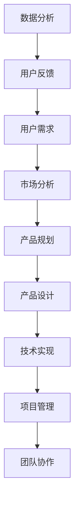

                 

 **关键词：**
- 字节跳动
- 校招
- 技术产品经理
- 面试题
- 解析
- 深度分析

**摘要：**
本文将详细解析2024字节跳动校招中技术产品经理面试题，结合专业知识与实际案例，深入探讨面试中可能出现的问题及其解决方案。通过本篇文章，读者可以了解技术产品经理面试的核心考点，提升面试应对能力，为成功进入字节跳动奠定基础。

## 1. 背景介绍

字节跳动是一家全球领先的移动互联网公司，旗下拥有抖音、今日头条、懂车帝等多个知名产品。每年，字节跳动都会在全球范围内招募优秀的技术人才，其中技术产品经理是一个重要的职位。技术产品经理（Technical Product Manager，简称TPM）在字节跳动的工作中起着至关重要的作用，他们负责将技术需求和商业目标结合起来，推动产品的发展。

技术产品经理的职责包括但不限于以下几个方面：

1. **需求分析**：理解用户需求，分析市场需求，制定产品规划和需求文档。
2. **产品设计**：制定产品功能、界面和交互设计，确保产品的用户体验。
3. **技术协调**：与技术团队紧密合作，确保产品设计能够顺利实现。
4. **项目管理**：制定项目计划，跟踪项目进度，确保按时交付。
5. **团队协作**：协调团队成员的工作，促进跨部门合作，提高团队效率。

随着移动互联网和人工智能技术的不断发展，技术产品经理在字节跳动中的作用越来越重要。他们需要具备扎实的技术背景、敏锐的市场洞察力和优秀的项目管理能力，才能在激烈的竞争环境中脱颖而出。

## 2. 核心概念与联系

在技术产品经理的面试中，核心概念和联系的理解是至关重要的一环。以下是一些重要的概念及其之间的关系，我们使用Mermaid流程图来表示这些概念和联系。



### 2.1 用户需求

用户需求是产品经理工作的起点。了解用户需求是制定产品规划和设计的重要依据。用户需求可以通过用户调研、数据分析等方式获取。

### 2.2 市场分析

市场分析是对用户需求进行更深入的探讨，包括竞争对手分析、市场趋势分析等，以确定产品的市场定位和目标用户。

### 2.3 产品规划

产品规划是根据市场分析和用户需求，制定产品的功能、目标和时间线。

### 2.4 产品设计

产品设计是将产品规划转化为具体的设计方案，包括功能设计、界面设计和交互设计等。

### 2.5 技术实现

技术实现是根据产品设计，与技术团队一起将产品功能转化为实际的代码。

### 2.6 项目管理

项目管理是确保产品按时、按质量完成的重要环节，包括任务分配、进度跟踪和风险控制等。

### 2.7 团队协作

团队协作是技术产品经理的核心能力之一，包括跨部门沟通、资源协调和团队激励等。

### 2.8 数据分析

数据分析是产品经理的重要工具，通过对用户行为、产品性能等数据进行分析，可以指导产品的优化和改进。

### 2.9 用户反馈

用户反馈是产品改进的重要来源，通过收集和分析用户反馈，可以不断优化产品，提升用户体验。

## 3. 核心算法原理 & 具体操作步骤

### 3.1 算法原理概述

在技术产品经理的面试中，算法原理的理解和应用是考察的重点之一。以下介绍几个常见的算法原理及其应用场景。

### 3.1.1 用户画像算法

用户画像算法是根据用户行为数据，对用户进行分类和标签化，以便更好地了解用户需求和行为模式。常用的用户画像算法包括协同过滤、聚类分析和回归分析等。

### 3.1.2 推荐系统算法

推荐系统算法是基于用户画像和内容特征，为用户推荐相关的产品或内容。常用的推荐系统算法包括基于内容的推荐、协同过滤推荐和混合推荐等。

### 3.1.3 数据挖掘算法

数据挖掘算法是从大量数据中提取有价值信息的方法，包括分类、聚类、关联规则挖掘等。

### 3.2 算法步骤详解

以下以协同过滤推荐算法为例，详细解释其具体操作步骤。

### 3.2.1 用户行为数据收集

收集用户在平台上的行为数据，如浏览记录、购买记录、评论等。

### 3.2.2 用户行为数据预处理

对用户行为数据进行清洗、去重和归一化等处理，以确保数据质量。

### 3.2.3 构建用户-物品矩阵

根据用户行为数据，构建用户-物品矩阵，表示用户对物品的偏好。

### 3.2.4 计算相似度

计算用户之间的相似度，常用的相似度计算方法包括余弦相似度、皮尔逊相关系数等。

### 3.2.5 推荐物品

根据用户相似度矩阵，为用户推荐相似度高的物品。

### 3.3 算法优缺点

### 3.3.1 优点

- 能够为用户推荐个性化的内容，提升用户体验。
- 能够发现用户未知的兴趣点，拓展用户视野。

### 3.3.2 缺点

- 需要大量的用户行为数据，数据隐私问题值得关注。
- 可能会陷入“推荐泡沫”，导致用户接受的信息单一。

### 3.4 算法应用领域

协同过滤推荐算法广泛应用于电商平台、社交媒体、新闻客户端等领域，为用户推荐感兴趣的产品、内容和服务。

## 4. 数学模型和公式 & 详细讲解 & 举例说明

### 4.1 数学模型构建

在技术产品经理的面试中，掌握一定的数学模型和公式是非常必要的。以下介绍几个常用的数学模型及其应用。

### 4.1.1 概率论模型

概率论模型主要用于评估用户行为和风险。

- **贝叶斯公式**：用于计算后验概率，公式如下：
  $$P(A|B) = \frac{P(B|A) \cdot P(A)}{P(B)}$$
- **马尔可夫链**：用于分析用户行为序列，公式如下：
  $$P(X_n|X_{n-1}, X_{n-2}, \ldots) = P(X_n|X_{n-1})$$

### 4.1.2 线性回归模型

线性回归模型用于预测用户行为和需求。

- **线性回归公式**：$y = w_0 + w_1 \cdot x_1 + w_2 \cdot x_2 + \ldots + w_n \cdot x_n$

### 4.1.3 决策树模型

决策树模型用于分类和回归分析。

- **决策树公式**：根据特征值进行决策，递归划分数据集。

### 4.2 公式推导过程

以下以线性回归模型为例，详细解释公式推导过程。

假设我们有一组数据点 $(x_1, y_1), (x_2, y_2), \ldots, (x_n, y_n)$，我们要找到一条直线 $y = w_0 + w_1 \cdot x_1 + w_2 \cdot x_2 + \ldots + w_n \cdot x_n$，使得这条直线与数据点之间的误差最小。

- **误差函数**：$E = \sum_{i=1}^{n} (y_i - (w_0 + w_1 \cdot x_{i1} + w_2 \cdot x_{i2} + \ldots + w_n \cdot x_{in}))^2$
- **最小二乘法**：求解误差函数的导数，令其等于零，得到：
  $$\frac{\partial E}{\partial w_j} = 0$$

通过求解上述方程组，我们可以得到最优的权重参数 $w_j$。

### 4.3 案例分析与讲解

以下以用户流失预测为例，详细讲解线性回归模型的应用。

假设我们要预测一组用户的流失率，已知每个用户的行为数据（如浏览时长、购买频率等）。我们使用线性回归模型来预测流失率。

- **特征选择**：选择与用户流失率相关的特征，如浏览时长、购买频率等。
- **数据预处理**：对特征数据进行归一化处理，消除不同特征之间的量纲差异。
- **模型训练**：使用训练集数据训练线性回归模型。
- **模型评估**：使用验证集数据评估模型效果，调整模型参数。

通过以上步骤，我们可以得到一个预测用户流失率的线性回归模型，从而为产品优化和运营决策提供支持。

## 5. 项目实践：代码实例和详细解释说明

### 5.1 开发环境搭建

在技术产品经理的面试中，掌握项目实践能力是非常重要的。以下以一个简单的用户流失预测项目为例，介绍开发环境的搭建。

- **编程语言**：Python
- **数据预处理工具**：Pandas
- **机器学习库**：Scikit-learn
- **可视化库**：Matplotlib

### 5.2 源代码详细实现

以下是一个简单的用户流失预测项目的源代码实现。

```python
import pandas as pd
from sklearn.linear_model import LinearRegression
from sklearn.model_selection import train_test_split
from sklearn.metrics import mean_squared_error
import matplotlib.pyplot as plt

# 数据预处理
data = pd.read_csv('user_data.csv')
X = data[[' browsing_time', ' purchase_frequency']]
y = data[' churn_rate']

# 数据归一化
X_normalized = (X - X.min()) / (X.max() - X.min())

# 模型训练
model = LinearRegression()
model.fit(X_normalized, y)

# 模型评估
X_train, X_test, y_train, y_test = train_test_split(X_normalized, y, test_size=0.2, random_state=42)
y_pred = model.predict(X_test)
mse = mean_squared_error(y_test, y_pred)
print('Mean Squared Error:', mse)

# 可视化
plt.scatter(X_test[' browsing_time'], y_test)
plt.plot(X_test[' browsing_time'], y_pred, color='red')
plt.xlabel('Browsing Time')
plt.ylabel('Churn Rate')
plt.show()
```

### 5.3 代码解读与分析

- **数据预处理**：读取用户数据，对数据进行归一化处理，消除特征之间的量纲差异。
- **模型训练**：使用线性回归模型对数据进行训练。
- **模型评估**：使用测试集数据评估模型效果，计算均方误差。
- **可视化**：绘制散点图和回归线，展示模型预测结果。

### 5.4 运行结果展示

运行上述代码后，可以得到以下结果：

- **均方误差**：用于评估模型预测的准确性，越小表示模型预测越准确。
- **可视化结果**：展示用户流失率与浏览时长之间的线性关系，以及模型预测结果。

## 6. 实际应用场景

### 6.1 用户流失预测

用户流失预测是技术产品经理在实际工作中常见的一个应用场景。通过分析用户行为数据，预测哪些用户可能会流失，从而采取相应的措施提高用户留存率。在实际操作中，可以使用机器学习算法对用户行为数据进行分析，构建用户流失预测模型。

### 6.2 内容推荐系统

内容推荐系统是字节跳动等公司的重要产品功能之一。通过分析用户行为和内容特征，为用户推荐感兴趣的内容，提高用户活跃度和留存率。在实际操作中，可以使用协同过滤、基于内容的推荐等算法构建推荐系统。

### 6.3 项目管理

技术产品经理在项目管理中发挥着关键作用。他们需要制定项目计划，跟踪项目进度，协调团队成员的工作。在实际操作中，可以使用项目管理工具（如Trello、JIRA等）来提高项目管理的效率。

### 6.4 团队协作

团队协作是技术产品经理的核心能力之一。在实际操作中，需要与产品、技术、运营等多个部门进行沟通和协作，确保项目的顺利进行。在实际操作中，可以采用敏捷开发、看板管理等协作方式来提高团队效率。

## 7. 未来应用展望

### 7.1 人工智能技术的应用

随着人工智能技术的不断发展，技术产品经理在未来将有更多的应用场景。例如，使用深度学习算法构建更准确的用户画像，提高推荐系统的效果；利用自然语言处理技术实现智能客服，提升用户满意度等。

### 7.2 数据隐私与安全

随着数据隐私和安全问题的日益突出，技术产品经理需要关注如何在保护用户隐私的前提下，充分利用用户数据。在实际操作中，可以采用差分隐私、联邦学习等技术来保护用户隐私。

### 7.3 跨界融合

技术产品经理需要在各个领域进行跨界融合，推动产品创新。例如，将物联网技术应用于智能家居产品，将区块链技术应用于供应链管理等领域。

## 8. 工具和资源推荐

### 8.1 学习资源推荐

- 《产品经理实战指南》
- 《人人都是产品经理》
- 《深度学习》

### 8.2 开发工具推荐

- Python
- JIRA
- Trello

### 8.3 相关论文推荐

- "User Modeling and User-Adapted Interaction"
- "Recommender Systems: The Textbook"
- "The Elements of Statistical Learning"

## 9. 总结：未来发展趋势与挑战

### 9.1 研究成果总结

本文总结了2024字节跳动校招技术产品经理面试题的核心考点，包括用户需求分析、市场分析、产品设计、技术实现、项目管理、团队协作、数据分析等方面。同时，介绍了核心算法原理、数学模型和公式、项目实践等方面的内容。

### 9.2 未来发展趋势

- 人工智能技术的广泛应用
- 数据隐私与安全问题的关注
- 跨界融合推动产品创新

### 9.3 面临的挑战

- 复杂的业务场景和技术需求
- 快速变化的市场环境
- 团队协作和跨部门沟通的挑战

### 9.4 研究展望

未来，技术产品经理需要不断学习新技术、提升自身能力，以应对不断变化的市场环境。同时，需要关注数据隐私和安全问题，推动跨界融合，为用户提供更好的产品和服务。

## 附录：常见问题与解答

### 9.4.1 技术产品经理的核心能力是什么？

技术产品经理的核心能力包括：用户需求分析、市场分析、产品设计、技术实现、项目管理和团队协作等。

### 9.4.2 如何做好用户需求分析？

做好用户需求分析的关键在于：深入了解用户、收集多渠道的用户反馈、进行数据分析，结合市场趋势和业务目标，制定合理的需求分析报告。

### 9.4.3 如何提高团队协作效率？

提高团队协作效率的方法包括：明确项目目标、制定合理的项目计划、定期沟通和反馈、使用项目管理工具、建立良好的团队文化等。

### 9.4.4 技术产品经理如何应对快速变化的市场环境？

技术产品经理应关注市场动态、积极学习新技术、灵活调整产品策略，以快速应对市场变化，确保产品竞争力。

### 9.4.5 数据隐私与安全如何保障？

数据隐私与安全的保障措施包括：采用加密技术、数据脱敏、差分隐私、联邦学习等技术，建立完善的数据隐私政策和安全管理体系。

---

**作者：禅与计算机程序设计艺术 / Zen and the Art of Computer Programming**

