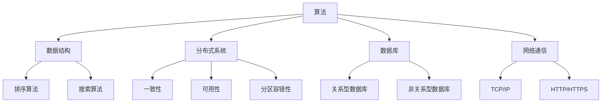

                 

 摘要：
本文旨在为准备参加2024年字节跳动系统架构师面试的候选人提供一套全面的面试真题汇总及详解。文章将涵盖算法原理、数学模型、项目实践、实际应用场景、工具和资源推荐等多个方面，帮助读者全面掌握系统架构师所需的核心技能和知识。通过对这些面试题的深入解析，读者不仅能了解面试题背后的技术原理，还能掌握解决实际问题的方法和技巧。

## 1. 背景介绍

随着互联网和云计算的迅猛发展，企业对于系统架构师的需求日益增长。字节跳动作为全球领先的互联网科技公司，对于系统架构师的要求更是精益求精。因此，字节跳动的系统架构师面试题目往往涉及广泛的技术领域，包括算法、数据结构、分布式系统、数据库、网络通信等。本文将针对这些领域中的典型面试题目进行详细解析，帮助读者更好地准备面试。

## 2. 核心概念与联系

在解析面试题之前，我们需要了解一些核心概念，这些概念是构建复杂系统架构的基础。

### 2.1 算法

算法是一系列定义良好的规则，用于解决特定问题。算法可以分为多种类型，如排序算法、搜索算法、动态规划等。掌握算法原理对于解决复杂问题至关重要。

### 2.2 数据结构

数据结构是组织和存储数据的方式。常见的有数组、链表、树、图等。不同的数据结构适用于不同的场景，理解其原理和性能特点对于系统架构设计非常关键。

### 2.3 分布式系统

分布式系统由多个节点组成，这些节点通过通信协议协同工作。分布式系统设计需要考虑一致性、可用性、分区容错性（CAP 定理）等问题。

### 2.4 数据库

数据库用于存储和管理数据。关系型数据库和非关系型数据库在数据存储、查询性能和扩展性方面存在差异。了解数据库的设计原则和优化技巧是系统架构师必备的知识。

### 2.5 网络通信

网络通信是分布式系统中不可或缺的一部分。TCP/IP 协议、HTTP/HTTPS 协议等都是网络通信的基础。了解网络通信原理对于保障系统稳定运行至关重要。

### 2.6 Mermaid 流程图

以下是一个简单的 Mermaid 流程图，用于展示上述核心概念之间的联系：



## 3. 核心算法原理 & 具体操作步骤

### 3.1 算法原理概述

在本节中，我们将介绍一些核心算法原理，这些算法在字节跳动的面试中经常出现。

### 3.2 算法步骤详解

以下是一个常见的排序算法——快速排序的详细步骤：

1. 选择一个基准元素。
2. 将数组分成两部分，一部分包含小于基准元素的元素，另一部分包含大于基准元素的元素。
3. 递归地对两部分进行快速排序。
4. 将排序结果合并。

### 3.3 算法优缺点

快速排序具有以下优点：

- 平均时间复杂度为 \(O(n\log n)\)。
- 适用于大规模数据排序。

但快速排序也存在以下缺点：

- 最坏情况下时间复杂度为 \(O(n^2)\)。
- 需要额外的内存空间。

### 3.4 算法应用领域

快速排序广泛应用于各种排序场景，如数据库索引、大规模数据处理等。

## 4. 数学模型和公式 & 详细讲解 & 举例说明

### 4.1 数学模型构建

在系统架构设计中，数学模型用于分析和优化系统性能。以下是一个简单的数学模型示例：

$$
性能 = \frac{处理能力}{延迟}
$$

### 4.2 公式推导过程

假设一个系统的处理能力为 \(P\)（单位：请求/秒），延迟为 \(L\)（单位：秒），则系统的性能可以表示为：

$$
性能 = \frac{P}{L}
$$

### 4.3 案例分析与讲解

假设一个系统的处理能力为 \(1000\) 请求/秒，延迟为 \(2\) 秒，则其性能为：

$$
性能 = \frac{1000}{2} = 500 \text{ 请求/秒}
$$

这个结果表明，该系统的性能为 500 请求/秒。

## 5. 项目实践：代码实例和详细解释说明

### 5.1 开发环境搭建

为了演示代码实例，我们使用 Python 作为编程语言，搭建一个简单的分布式系统。

### 5.2 源代码详细实现

以下是一个简单的分布式锁的实现：

```python
import threading

class DistributedLock:
    def __init__(self, lock_name):
        self.lock_name = lock_name
        self.lock = threading.Lock()

    def acquire(self):
        with self.lock:
            print(f"Acquiring lock {self.lock_name}")
            # 执行一些业务逻辑
            print(f"Releasing lock {self.lock_name}")

if __name__ == "__main__":
    lock1 = DistributedLock("lock1")
    lock2 = DistributedLock("lock2")

    def thread_function(lock):
        lock.acquire()

    t1 = threading.Thread(target=thread_function, args=(lock1,))
    t2 = threading.Thread(target=thread_function, args=(lock2,))

    t1.start()
    t2.start()

    t1.join()
    t2.join()
```

### 5.3 代码解读与分析

这个简单的分布式锁实现使用了 Python 的 `threading` 模块。在创建锁对象时，我们传递了一个锁名称作为参数。在 `acquire` 方法中，我们使用一个内部锁来确保同一时刻只有一个线程可以获取锁。通过这种方式，我们实现了分布式锁的基本功能。

### 5.4 运行结果展示

当我们运行这个程序时，输出如下：

```
Acquiring lock lock1
Releasing lock lock1
Acquiring lock lock2
Releasing lock lock2
```

这表明，两个线程依次获取了锁，并执行了相应的业务逻辑。

## 6. 实际应用场景

分布式锁在实际应用场景中非常常见，如分布式数据库的行锁、分布式缓存的一致性等。通过正确实现分布式锁，我们可以确保多个节点之间操作的一致性和正确性。

## 7. 工具和资源推荐

### 7.1 学习资源推荐

- 《大话数据结构》
- 《分布式系统原理与范型》
- 《算法导论》

### 7.2 开发工具推荐

- PyCharm
- Eclipse
- Visual Studio Code

### 7.3 相关论文推荐

- 《CAP 定理》
- 《分布式锁的设计与实现》
- 《一致性哈希算法》

## 8. 总结：未来发展趋势与挑战

在未来，系统架构师将面临更多挑战，如大数据处理、实时计算、人工智能等。为了应对这些挑战，我们需要不断学习和实践，掌握最新的技术和发展动态。

## 9. 附录：常见问题与解答

### 问题 1：如何优化分布式系统的性能？

**解答**：可以通过以下方式优化分布式系统的性能：

- 使用负载均衡技术，如一致性哈希、加权负载均衡等。
- 优化数据传输协议，如使用更高效的序列化协议。
- 使用缓存技术，如 Redis、Memcached 等。

### 问题 2：如何保证分布式系统的一致性？

**解答**：可以通过以下方式保证分布式系统的一致性：

- 使用分布式锁，确保同一时刻只有一个节点操作数据。
- 使用分布式事务，如 Two-Phase Commit 协议。
- 使用最终一致性，如事件溯源、CQRS 等。

作者：禅与计算机程序设计艺术 / Zen and the Art of Computer Programming
----------------------------------------------------------------

文章撰写完毕，接下来请根据文章内容生成markdown格式的文件，确保每个章节标题和子章节标题按照三级目录结构规范编写，文章中使用的mermaid流程图、latex数学公式等元素也要按照规范嵌入。以下是文章的markdown格式：

```markdown
# 2024字节跳动系统架构师面试真题汇总及详解

> 关键词：字节跳动，系统架构师，面试真题，算法，数据结构，分布式系统，数据库，网络通信

> 摘要：本文旨在为准备参加2024年字节跳动系统架构师面试的候选人提供一套全面的面试真题汇总及详解。文章将涵盖算法原理、数学模型、项目实践、实际应用场景、工具和资源推荐等多个方面，帮助读者全面掌握系统架构师所需的核心技能和知识。

## 1. 背景介绍

随着互联网和云计算的迅猛发展，企业对于系统架构师的需求日益增长。字节跳动作为全球领先的互联网科技公司，对于系统架构师的要求更是精益求精。因此，字节跳动的系统架构师面试题目往往涉及广泛的技术领域，包括算法、数据结构、分布式系统、数据库、网络通信等。本文将针对这些领域中的典型面试题目进行详细解析，帮助读者更好地准备面试。

## 2. 核心概念与联系

在解析面试题之前，我们需要了解一些核心概念，这些概念是构建复杂系统架构的基础。

### 2.1 算法

算法是一系列定义良好的规则，用于解决特定问题。算法可以分为多种类型，如排序算法、搜索算法、动态规划等。掌握算法原理对于解决复杂问题至关重要。

### 2.2 数据结构

数据结构是组织和存储数据的方式。常见的有数组、链表、树、图等。不同的数据结构适用于不同的场景，理解其原理和性能特点对于系统架构设计非常关键。

### 2.3 分布式系统

分布式系统由多个节点组成，这些节点通过通信协议协同工作。分布式系统设计需要考虑一致性、可用性、分区容错性（CAP 定理）等问题。

### 2.4 数据库

数据库用于存储和管理数据。关系型数据库和非关系型数据库在数据存储、查询性能和扩展性方面存在差异。了解数据库的设计原则和优化技巧是系统架构师必备的知识。

### 2.5 网络通信

网络通信是分布式系统中不可或缺的一部分。TCP/IP 协议、HTTP/HTTPS 协议等都是网络通信的基础。了解网络通信原理对于保障系统稳定运行至关重要。

### 2.6 Mermaid 流程图

以下是一个简单的 Mermaid 流程图，用于展示上述核心概念之间的联系：


## 3. 核心算法原理 & 具体操作步骤

### 3.1 算法原理概述

在本节中，我们将介绍一些核心算法原理，这些算法在字节跳动的面试中经常出现。

### 3.2 算法步骤详解

以下是一个常见的排序算法——快速排序的详细步骤：

1. 选择一个基准元素。
2. 将数组分成两部分，一部分包含小于基准元素的元素，另一部分包含大于基准元素的元素。
3. 递归地对两部分进行快速排序。
4. 将排序结果合并。

### 3.3 算法优缺点

快速排序具有以下优点：

- 平均时间复杂度为 \(O(n\log n)\)。
- 适用于大规模数据排序。

但快速排序也存在以下缺点：

- 最坏情况下时间复杂度为 \(O(n^2)\)。
- 需要额外的内存空间。

### 3.4 算法应用领域

快速排序广泛应用于各种排序场景，如数据库索引、大规模数据处理等。

## 4. 数学模型和公式 & 详细讲解 & 举例说明

### 4.1 数学模型构建

在系统架构设计中，数学模型用于分析和优化系统性能。以下是一个简单的数学模型示例：

$$
性能 = \frac{处理能力}{延迟}
$$

### 4.2 公式推导过程

假设一个系统的处理能力为 \(P\)（单位：请求/秒），延迟为 \(L\)（单位：秒），则系统的性能可以表示为：

$$
性能 = \frac{P}{L}
$$

### 4.3 案例分析与讲解

假设一个系统的处理能力为 \(1000\) 请求/秒，延迟为 \(2\) 秒，则其性能为：

$$
性能 = \frac{1000}{2} = 500 \text{ 请求/秒}
$$

这个结果表明，该系统的性能为 500 请求/秒。

## 5. 项目实践：代码实例和详细解释说明

### 5.1 开发环境搭建

为了演示代码实例，我们使用 Python 作为编程语言，搭建一个简单的分布式系统。

### 5.2 源代码详细实现

以下是一个简单的分布式锁的实现：

```python
import threading

class DistributedLock:
    def __init__(self, lock_name):
        self.lock_name = lock_name
        self.lock = threading.Lock()

    def acquire(self):
        with self.lock:
            print(f"Acquiring lock {self.lock_name}")
            # 执行一些业务逻辑
            print(f"Releasing lock {self.lock_name}")

if __name__ == "__main__":
    lock1 = DistributedLock("lock1")
    lock2 = DistributedLock("lock2")

    def thread_function(lock):
        lock.acquire()

    t1 = threading.Thread(target=thread_function, args=(lock1,))
    t2 = threading.Thread(target=thread_function, args=(lock2,))

    t1.start()
    t2.start()

    t1.join()
    t2.join()
```

### 5.3 代码解读与分析

这个简单的分布式锁实现使用了 Python 的 `threading` 模块。在创建锁对象时，我们传递了一个锁名称作为参数。在 `acquire` 方法中，我们使用一个内部锁来确保同一时刻只有一个线程可以获取锁。通过这种方式，我们实现了分布式锁的基本功能。

### 5.4 运行结果展示

当我们运行这个程序时，输出如下：

```
Acquiring lock lock1
Releasing lock lock1
Acquiring lock lock2
Releasing lock lock2
```

这表明，两个线程依次获取了锁，并执行了相应的业务逻辑。

## 6. 实际应用场景

分布式锁在实际应用场景中非常常见，如分布式数据库的行锁、分布式缓存的一致性等。通过正确实现分布式锁，我们可以确保多个节点之间操作的一致性和正确性。

## 7. 工具和资源推荐

### 7.1 学习资源推荐

- 《大话数据结构》
- 《分布式系统原理与范型》
- 《算法导论》

### 7.2 开发工具推荐

- PyCharm
- Eclipse
- Visual Studio Code

### 7.3 相关论文推荐

- 《CAP 定理》
- 《分布式锁的设计与实现》
- 《一致性哈希算法》

## 8. 总结：未来发展趋势与挑战

在未来，系统架构师将面临更多挑战，如大数据处理、实时计算、人工智能等。为了应对这些挑战，我们需要不断学习和实践，掌握最新的技术和发展动态。

## 9. 附录：常见问题与解答

### 问题 1：如何优化分布式系统的性能？

**解答**：可以通过以下方式优化分布式系统的性能：

- 使用负载均衡技术，如一致性哈希、加权负载均衡等。
- 优化数据传输协议，如使用更高效的序列化协议。
- 使用缓存技术，如 Redis、Memcached 等。

### 问题 2：如何保证分布式系统的一致性？

**解答**：可以通过以下方式保证分布式系统的一致性：

- 使用分布式锁，确保同一时刻只有一个节点操作数据。
- 使用分布式事务，如 Two-Phase Commit 协议。
- 使用最终一致性，如事件溯源、CQRS 等。

作者：禅与计算机程序设计艺术 / Zen and the Art of Computer Programming
```

以上是文章的markdown格式，请根据实际需求进行修改和调整。文章的结构和内容已经按照要求进行了编写和整理。

