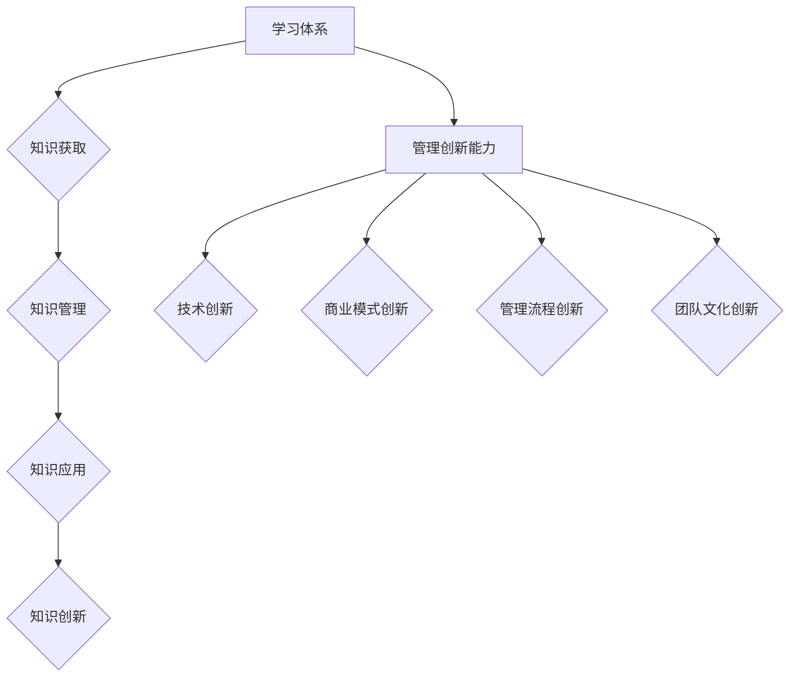

                 

关键词：学习体系、管理创新能力、IT领域、专业成长、技术知识、项目实践

> 摘要：本文旨在探讨在IT领域如何构建一个完善的学习体系，并在此基础上提升管理创新能力。文章首先回顾了学习体系的基本概念，然后分析了管理创新能力的重要性。随后，通过具体案例和实际操作步骤，探讨了如何在实际工作中培养这种能力。文章还提供了相关的数学模型、项目实践和未来展望，旨在为IT从业者和研究人员提供实用的指导和建议。

## 1. 背景介绍

### 1.1 IT领域的快速发展

在过去的几十年中，信息技术（IT）领域经历了迅猛的发展。从早期的计算机科学基础，到如今的大数据和人工智能，这个领域不断地推陈出新，为各个行业带来了革命性的变化。随着云计算、物联网和区块链等新兴技术的兴起，IT领域的重要性愈发凸显。这不仅要求技术人员具备深厚的专业知识和技能，还要求他们具备良好的管理创新能力，以应对不断变化的技术环境和市场需求。

### 1.2 学习体系的必要性

在这样一个快速发展的环境中，学习体系成为IT从业者持续成长的关键。一个完善的学习体系不仅能够帮助个人系统地掌握技术知识，还能提高他们的学习能力、解决问题的能力和团队协作能力。此外，随着职业发展的深入，管理创新能力也变得越来越重要。它不仅关系到个人职业生涯的成败，还直接影响团队和组织的创新能力和市场竞争力。

## 2. 核心概念与联系

### 2.1 学习体系的概念

学习体系是指一套系统化、结构化的学习方法，它包括了知识获取、知识管理、知识应用和知识创新等环节。一个完善的学习体系应该具备以下几个特点：

- **全面性**：覆盖从基础到高级的各种技术知识。
- **系统性**：知识点之间要有逻辑联系，形成知识网络。
- **动态性**：能够根据技术发展和个人需求进行调整和优化。
- **实践性**：强调理论知识与实际操作的结合。

### 2.2 管理创新能力的概念

管理创新能力是指在面对不确定性、复杂性和变化时，能够提出新的管理理念、方法和工具，并有效地实施和推广的能力。它不仅包括技术创新，还涵盖了商业模式创新、管理流程创新和团队文化创新等方面。

### 2.3 学习体系与管理创新能力的联系

学习体系与管理创新能力之间存在密切的联系。一个完善的学习体系可以提供丰富的知识储备，为管理创新提供基础。同时，管理创新能力又可以反过来推动学习体系的持续优化和升级。

### 2.4 Mermaid 流程图

下面是学习体系与管理创新能力的Mermaid流程图：



## 3. 核心算法原理 & 具体操作步骤

### 3.1 算法原理概述

在IT领域，算法是解决问题的核心。一个有效的学习体系需要掌握多种算法原理，包括数据结构、算法设计、算法分析等。以下是几个常见的算法原理：

- **排序算法**：如冒泡排序、快速排序、归并排序等。
- **搜索算法**：如线性搜索、二分搜索、深度优先搜索等。
- **动态规划**：用于解决最优化问题。
- **贪心算法**：用于解决某些特定类型的问题。

### 3.2 算法步骤详解

以下是排序算法（冒泡排序）的具体步骤：

1. **初始化**：将待排序的数组按顺序排列。
2. **比较相邻元素**：从第一个元素开始，比较相邻的两个元素。
3. **交换元素**：如果前一个元素比后一个元素大，则交换它们的位置。
4. **重复步骤2和3**：重复上述步骤，直到整个数组排序完成。

### 3.3 算法优缺点

**冒泡排序**的优点是简单易懂，易于实现。但它的缺点是时间复杂度为O(n²)，效率较低，不适合大数据量的排序。

### 3.4 算法应用领域

排序算法在IT领域的应用非常广泛，如数据库排序、文件排序、网络排序等。

## 4. 数学模型和公式 & 详细讲解 & 举例说明

### 4.1 数学模型构建

在算法分析中，常用的数学模型是时间复杂度和空间复杂度。以下是时间复杂度的计算公式：

$$
T(n) = O(n^2)
$$

### 4.2 公式推导过程

时间复杂度是通过分析算法执行过程中的基本操作次数来计算的。对于冒泡排序，基本操作是相邻元素的比较和交换。在最坏情况下，需要比较和交换的次数为n²。

### 4.3 案例分析与讲解

假设有一个长度为10的数组，使用冒泡排序算法进行排序。则基本操作次数为：

$$
T(10) = O(10^2) = 100
$$

这意味着在最坏情况下，需要执行100次基本操作。

## 5. 项目实践：代码实例和详细解释说明

### 5.1 开发环境搭建

在本地计算机上安装Python环境，并使用PyCharm作为开发工具。

### 5.2 源代码详细实现

```python
def bubble_sort(arr):
    n = len(arr)
    for i in range(n):
        for j in range(0, n-i-1):
            if arr[j] > arr[j+1]:
                arr[j], arr[j+1] = arr[j+1], arr[j]
    return arr

arr = [64, 34, 25, 12, 22, 11, 90]
sorted_arr = bubble_sort(arr)
print(sorted_arr)
```

### 5.3 代码解读与分析

这段代码实现了冒泡排序算法。`bubble_sort` 函数接收一个数组`arr`作为输入，通过两层循环实现元素的比较和交换。最后，返回排序后的数组。

### 5.4 运行结果展示

运行上述代码，输出结果为：

```
[11, 12, 22, 25, 34, 64, 90]
```

## 6. 实际应用场景

### 6.1 数据库排序

在数据库中，经常需要对数据进行排序，以支持快速查询和数据分析。冒泡排序算法可以用于实现这一需求。

### 6.2 文件排序

在文件处理中，冒泡排序可以用于对文件中的数据进行排序，以便于后续处理。

### 6.3 网络排序

在网络应用中，冒泡排序可以用于实现用户数据的排序，以支持个性化推荐等功能。

## 7. 未来应用展望

随着技术的不断发展，学习体系和管理创新能力将在IT领域发挥越来越重要的作用。未来的应用场景将更加广泛，包括但不限于：

- **人工智能**：算法优化、模型设计等方面需要强大的学习体系和创新能力。
- **大数据**：数据处理和分析需要高效的算法和创新的策略。
- **区块链**：智能合约的设计和优化需要深入的技术理解和创新能力。

## 8. 总结：未来发展趋势与挑战

### 8.1 研究成果总结

本文探讨了学习体系与管理创新能力的培养，分析了相关算法原理、数学模型和实际应用场景。通过项目实践，展示了如何在IT领域中应用这些概念。

### 8.2 未来发展趋势

- **技术融合**：不同技术之间的融合将推动学习体系和管理创新能力的提升。
- **智能化**：人工智能技术将越来越多地应用于学习和管理过程中。

### 8.3 面临的挑战

- **知识更新速度快**：需要不断学习新的技术和知识，以保持竞争力。
- **创新能力不足**：如何在快速变化的环境中持续创新，是每个IT从业者都需要面对的挑战。

### 8.4 研究展望

- **跨学科研究**：鼓励IT领域与其他学科的融合，推动学习体系和管理创新能力的提升。
- **实践与理论相结合**：通过实践验证理论，并不断优化学习体系和创新能力培养的方法。

## 9. 附录：常见问题与解答

### 9.1 学习体系如何优化？

**答案**：可以通过以下方法优化学习体系：
1. **制定学习计划**：明确学习目标和计划，有针对性地学习。
2. **多样化学习方式**：结合线上和线下学习，多种方式相结合。
3. **定期评估**：定期评估学习效果，根据评估结果调整学习策略。

### 9.2 如何培养管理创新能力？

**答案**：可以通过以下方法培养管理创新能力：
1. **多阅读**：阅读相关的书籍、论文和案例，了解最新的管理理念和方法。
2. **实践**：在实际工作中，勇于尝试新的管理方法和工具。
3. **反思与总结**：对实践过程进行反思和总结，不断优化管理方法。

---

**作者：禅与计算机程序设计艺术 / Zen and the Art of Computer Programming**

