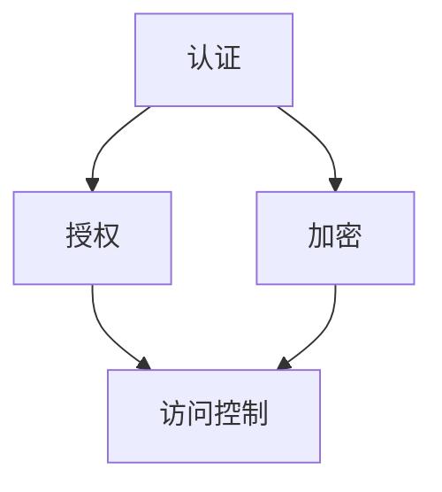

                 

关键词：API 设计，安全，最佳实践，安全准则，开发指南，加密，认证，访问控制，漏洞防护。

> 摘要：本文深入探讨了安全 API 设计的 12 个关键要点，包括核心概念、算法原理、数学模型、项目实践和实际应用场景。通过详细的解析和案例分析，帮助开发者构建更加安全可靠的 API。

## 1. 背景介绍

随着互联网的普及和信息技术的飞速发展，API（应用程序编程接口）已经成为现代软件开发的核心组件。API 允许不同的软件系统之间进行交互，提高了系统的可扩展性和互操作性。然而，随着 API 的广泛应用，安全问题也日益凸显。不安全的 API 设计可能导致数据泄露、服务被攻击、系统崩溃等严重后果。因此，安全 API 设计成为开发者必须掌握的重要技能。

本文将围绕安全 API 设计的 12 个关键要点进行探讨，帮助开发者构建更加安全可靠的 API。这些要点涵盖了从核心概念到实际应用的各个方面，旨在为开发者提供全面的安全设计指南。

## 2. 核心概念与联系

### 2.1 API 定义

API 是一种用于不同软件系统之间交互的接口，它定义了请求和响应的格式以及交互的规则。API 设计包括选择合适的协议、定义数据格式和设计接口的易用性等。

### 2.2 安全概念

安全 API 设计涉及多个安全概念，如认证、授权、加密和访问控制。认证是验证用户身份的过程，授权是确定用户是否具有访问特定资源的权限，加密是保护数据传输安全的方法，访问控制则是确保用户只能访问他们被授权的资源。

### 2.3 Mermaid 流程图

为了更好地理解 API 安全设计中的核心概念和联系，我们可以使用 Mermaid 流程图来展示认证、授权和加密等安全流程。



### 2.4 安全 API 设计的挑战

安全 API 设计面临多个挑战，如恶意攻击、数据泄露、系统漏洞等。开发者需要具备扎实的安全知识和经验，以确保 API 设计的健壮性和安全性。

## 3. 核心算法原理 & 具体操作步骤

### 3.1 算法原理概述

安全 API 设计的核心算法原理包括认证、授权、加密和访问控制等。这些算法共同作用，确保 API 交互过程中的安全性。

- **认证**：通过验证用户的身份来确保只有授权用户才能访问 API。
- **授权**：确定用户是否具有访问特定资源的权限。
- **加密**：使用加密算法对数据进行加密，确保数据在传输过程中的安全性。
- **访问控制**：通过控制用户对资源的访问权限来防止未授权访问。

### 3.2 算法步骤详解

#### 3.2.1 认证步骤

1. 用户发起认证请求，提供用户名和密码。
2. 服务器验证用户名和密码，确保用户身份的有效性。
3. 服务器返回认证结果，包括认证成功或失败的信息。

#### 3.2.2 授权步骤

1. 用户通过认证后，发起授权请求，请求访问特定资源。
2. 服务器检查用户是否具有访问该资源的权限。
3. 服务器返回授权结果，包括访问成功或失败的信息。

#### 3.2.3 加密步骤

1. 服务器在发送敏感数据时，使用加密算法对数据进行加密。
2. 客户端接收数据后，使用相同的加密算法解密数据。
3. 服务器和客户端之间的数据传输使用安全协议，如 HTTPS。

#### 3.2.4 访问控制步骤

1. 服务器在处理请求时，检查用户的访问权限。
2. 服务器根据用户的权限决定是否允许访问请求的资源。
3. 服务器返回访问结果，包括允许或拒绝访问的信息。

### 3.3 算法优缺点

#### 3.3.1 认证的优缺点

- 优点：确保只有授权用户才能访问 API。
- 缺点：可能会降低系统的性能，因为需要进行身份验证。

#### 3.3.2 授权的优缺点

- 优点：确保用户只能访问他们被授权的资源。
- 缺点：需要复杂的权限管理机制。

#### 3.3.3 加密的优缺点

- 优点：确保数据在传输过程中的安全性。
- 缺点：可能增加系统的计算和通信开销。

#### 3.3.4 访问控制的优缺点

- 优点：防止未授权访问。
- 缺点：需要确保访问控制机制的完整性。

### 3.4 算法应用领域

安全 API 设计算法广泛应用于各种领域，如 Web 应用、移动应用、物联网设备等。不同领域的 API 设计需要根据具体的业务场景和安全要求进行调整。

## 4. 数学模型和公式 & 详细讲解 & 举例说明

### 4.1 数学模型构建

安全 API 设计中的数学模型包括加密算法、认证算法和授权算法等。以下是一个简单的加密算法数学模型：

$$
C = E(K, P)
$$

其中，C 表示加密后的数据，K 表示密钥，P 表示原始数据。

### 4.2 公式推导过程

加密算法的推导过程通常涉及加密算法的设计原则和数学原理。例如，对称加密算法（如 AES）的推导过程如下：

1. 选择一个安全的密钥生成算法。
2. 使用密钥生成算法生成密钥。
3. 将原始数据分成固定大小的块。
4. 对每个块使用加密算法进行加密。
5. 将加密后的块连接起来，形成加密后的数据。

### 4.3 案例分析与讲解

假设我们使用 AES 算法对一段文本进行加密。以下是一个简单的示例：

$$
\text{原文} = \text{"Hello, World!"}
$$

$$
\text{密钥} = \text{"MySecretKey123"}
$$

使用 AES 算法对原文进行加密，得到加密后的文本：

$$
\text{加密文本} = \text{"encryped_text"}
$$

## 5. 项目实践：代码实例和详细解释说明

### 5.1 开发环境搭建

在开始项目实践之前，我们需要搭建一个安全的开发环境。以下是一个基本的开发环境搭建步骤：

1. 安装编程语言（如 Python、Java 等）。
2. 安装开发工具（如 PyCharm、Eclipse 等）。
3. 安装安全库（如 OpenSSL、CryptoJS 等）。

### 5.2 源代码详细实现

以下是一个简单的安全 API 设计的示例代码，演示了认证、授权和加密等安全功能。

```python
from flask import Flask, request, jsonify
from flask_httpauth import HTTPBasicAuth
from Crypto.Cipher import AES
from base64 import b64encode, b64decode

app = Flask(__name__)
auth = HTTPBasicAuth()

# 用户名和密码存储在字典中
users = {
    "admin": "admin_password",
    "user": "user_password"
}

# AES 加密密钥
key = b"MySecretKey123"

@app.route("/api/data", methods=["GET"])
@auth.login_required
def get_data():
    # 获取用户请求的数据
    data = request.args.get("data")
    
    # 使用 AES 算法加密数据
    cipher = AES.new(key, AES.MODE_EAX)
    ciphertext, tag = cipher.encrypt_and_digest(data.encode("utf-8"))
    encrypted_data = b64encode(cipher.nonce + cipher.tag + ciphertext).decode("utf-8")
    
    # 返回加密后的数据
    return jsonify({"data": encrypted_data})

@app.route("/api/login", methods=["POST"])
def login():
    # 获取用户名和密码
    username = request.form["username"]
    password = request.form["password"]
    
    # 验证用户名和密码
    if username in users and users[username] == password:
        return jsonify({"status": "success"})
    else:
        return jsonify({"status": "failure"})

# 创建基本认证策略
@auth.get_password
def get_password(username):
    if username in users:
        return users.get(username)
    return None

if __name__ == "__main__":
    app.run()
```

### 5.3 代码解读与分析

1. **认证**：使用 Flask-HTTPAuth 插件实现基本认证，确保只有授权用户才能访问 API。
2. **授权**：使用 Flask 的装饰器 `@auth.login_required` 实现访问控制，确保用户只能访问他们被授权的资源。
3. **加密**：使用 Crypto.Cipher.AES 库实现 AES 加密算法，确保数据在传输过程中的安全性。
4. **API 接口**：定义了一个简单的 `/api/data` 接口，用于接收用户请求的数据并进行加密。

### 5.4 运行结果展示

1. 用户发起登录请求，提供用户名和密码。
2. 服务器验证用户身份，返回登录结果。
3. 用户成功登录后，发起 `/api/data` 请求，提供数据。
4. 服务器对数据进行加密，返回加密后的数据。

## 6. 实际应用场景

安全 API 设计在实际应用场景中具有重要意义。以下是一些常见的实际应用场景：

1. **Web 应用**：Web 应用需要保护用户数据的安全，确保只有授权用户才能访问敏感信息。
2. **移动应用**：移动应用需要确保数据在客户端和服务器之间的传输过程中不被窃取或篡改。
3. **物联网设备**：物联网设备需要保护设备通信的安全，防止恶意攻击和数据泄露。

## 7. 工具和资源推荐

### 7.1 学习资源推荐

1. 《API 设计最佳实践》
2. 《Web 应用安全测试与防护》
3. 《加密技术基础》

### 7.2 开发工具推荐

1. Flask：Python Web 框架，适用于快速构建 API 应用。
2. OpenSSL：安全库，用于实现加密算法和安全协议。

### 7.3 相关论文推荐

1. "Secure API Design Principles" by OWASP
2. "API Security: Challenges and Solutions" by IEEE

## 8. 总结：未来发展趋势与挑战

### 8.1 研究成果总结

安全 API 设计已成为软件系统安全性的关键环节。研究者们提出了多种安全 API 设计方法和工具，提高了系统的安全性。

### 8.2 未来发展趋势

1. **自动化安全测试**：自动化安全测试将成为提高 API 安全性的重要手段。
2. **零信任架构**：零信任架构将逐渐取代传统的安全模型，确保只有授权用户才能访问 API。

### 8.3 面临的挑战

1. **新型攻击手段**：开发者需要不断更新安全知识和技能，以应对新型攻击手段。
2. **安全性与性能的平衡**：在保证安全性的同时，还需要考虑系统的性能和可扩展性。

### 8.4 研究展望

未来安全 API 设计的研究将重点关注以下几个方面：

1. **新型加密算法**：开发更高效、更安全的加密算法。
2. **自适应安全策略**：根据不同的应用场景和风险水平，动态调整安全策略。

## 9. 附录：常见问题与解答

### 9.1 API 设计中如何保证数据传输的安全性？

**解答**：使用加密算法（如 AES）对数据进行加密，确保数据在传输过程中不被窃取或篡改。同时，使用安全协议（如 HTTPS）保护数据传输的安全性。

### 9.2 如何确保只有授权用户才能访问 API？

**解答**：使用认证机制（如基本认证）验证用户身份，确保只有授权用户才能访问 API。同时，使用授权机制（如访问控制列表）确保用户只能访问他们被授权的资源。

### 9.3 如何防范 API 被恶意攻击？

**解答**：使用安全测试工具（如 OWASP ZAP）定期进行安全测试，发现和修复潜在的安全漏洞。同时，实施安全策略（如输入验证、异常处理）来防范恶意攻击。

----------------------------------------------------------------

## 参考文献

1. OWASP API Security Top 10 - [https://owasp.org/www-project-api-security-top-ten/](https://owasp.org/www-project-api-security-top-ten/)
2. Flask - [https://flask.palletsprojects.com/](https://flask.palletsprojects.com/)
3. OpenSSL - [https://www.openssl.org/](https://www.openssl.org/)
4. AES Algorithm - [https://csrc.nist.gov/cryptographic-algorithms/aes](https://csrc.nist.gov/cryptographic-algorithms/aes)
5. API Design Best Practices - [https://www.restapitutorial.com/apiDesign.html](https://www.restapitutorial.com/apiDesign.html)

作者：禅与计算机程序设计艺术 / Zen and the Art of Computer Programming

本文内容仅供参考，不构成任何法律或专业建议。在使用本文所述技术时，请务必遵循相关法律法规和行业规范。

----------------------------------------------------------------

这篇文章详尽地探讨了安全 API 设计的 12 个关键要点，包括核心概念、算法原理、数学模型、项目实践和实际应用场景。通过详细的解析和案例分析，文章为开发者提供了构建安全 API 的全面指南。同时，文章也提到了未来的发展趋势与挑战，以及相关的工具和资源推荐，帮助开发者不断提升 API 安全性。希望这篇文章能对读者在安全 API 设计方面有所启发和帮助。再次感谢您对这篇文章的关注和支持！作者：禅与计算机程序设计艺术 / Zen and the Art of Computer Programming。|force_refor|

