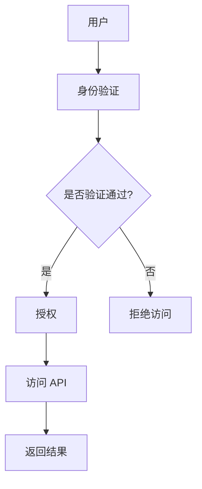

                 

关键词：安全 API 设计、API 安全性、安全最佳实践、安全架构、安全漏洞、防御措施

> 摘要：本文将详细探讨安全 API 设计的步骤和方法，旨在帮助开发者构建安全可靠且易维护的 API 系统并提供一整套安全最佳实践和防御措施，以确保 API 服务在复杂多变的网络环境中能够抵御各种安全威胁。

## 1. 背景介绍

随着互联网技术的迅猛发展和业务需求的不断增长，API（应用程序编程接口）成为了软件系统间交互和数据共享的核心桥梁。无论是企业内部系统间的集成，还是第三方服务与客户端的应用，API 都扮演着至关重要的角色。然而，随着 API 应用的广泛普及，API 安全问题也日益突出，成为了网络安全领域的热点问题之一。

API 是软件系统对外提供功能的接口，通过定义一套标准化的接口规范，使得不同的系统和服务可以方便地进行通信和交互。API 的普及带来了诸多便利，但也暴露出了诸多安全风险。API 可能成为黑客攻击的目标，如 SQL 注入、XSS（跨站脚本攻击）等；也可能因为设计不当或实现缺陷，导致权限滥用、数据泄露等问题。

本文将深入探讨如何设计安全的 API，以保障系统的安全性和可靠性。我们将从核心概念、算法原理、数学模型、项目实践、应用场景等多个维度，系统地介绍安全 API 设计的详细步骤和方法。

## 2. 核心概念与联系

### 2.1 API 安全的概念

API 安全是指保障 API 系统在设计和实现过程中不受各种威胁和攻击的影响，确保系统的完整性、保密性和可用性。API 安全涉及到多个方面，包括身份验证、授权、输入验证、API 密钥管理等。

### 2.2 API 攻击类型

了解常见的 API 攻击类型对于设计安全的 API 非常重要。以下是一些典型的 API 攻击类型：

- **SQL 注入**：攻击者通过在 API 输入参数中插入恶意 SQL 代码，实现对数据库的未授权访问。
- **XSS 攻击**：攻击者通过在 API 的响应中注入恶意脚本，进而实现对用户浏览器的控制。
- **权限滥用**：攻击者通过合法的 API 接口获取到高于其权限的信息或操作。
- **API 密钥泄露**：攻击者获取到 API 密钥，从而非法使用 API 服务。

### 2.3 API 安全架构

为了构建一个安全的 API 系统架构，我们需要关注以下几个方面：

- **身份验证和授权**：确保只有合法用户才能访问 API。
- **输入验证和过滤**：对输入数据进行严格验证和过滤，防止恶意输入。
- **API 密钥管理**：确保 API 密钥的安全存储和传输。
- **日志和监控**：记录 API 的访问日志，监控异常行为。

### 2.4 Mermaid 流程图

为了更好地理解 API 安全架构，我们可以使用 Mermaid 工具绘制一个简化的 API 安全架构图。以下是示例：



## 3. 核心算法原理 & 具体操作步骤

### 3.1 算法原理概述

API 安全的核心算法原理主要包括以下几个方面：

- **身份验证**：通过用户名和密码、令牌、生物识别等方式验证用户的身份。
- **授权**：根据用户的身份和权限，确定其能够访问的 API 接口和操作。
- **输入验证和过滤**：对输入数据进行类型检查、长度限制、正则表达式匹配等，以防止恶意输入。
- **API 密钥管理**：通过加密存储和传输 API 密钥，确保密钥的安全。

### 3.2 算法步骤详解

以下是设计安全的 API 所需的具体操作步骤：

#### 3.2.1 设计安全需求

- 分析系统需求和业务场景，确定 API 的功能和安全需求。
- 制定安全策略和规范，确保 API 的安全性。

#### 3.2.2 身份验证设计

- 选择合适的身份验证方式，如用户名密码、单点登录、OAuth 等。
- 设计认证流程，确保认证过程的安全。

#### 3.2.3 授权设计

- 定义用户角色和权限，设计 RBAC（基于角色的访问控制）或 ABAC（基于属性的访问控制）模型。
- 实现权限验证，确保用户只能访问其权限范围内的 API 接口。

#### 3.2.4 输入验证和过滤

- 对输入数据进行严格验证和过滤，如检查数据类型、长度、范围等。
- 使用正则表达式匹配非法字符和 SQL 注入攻击。

#### 3.2.5 API 密钥管理

- 设计 API 密钥生成和存储方案，如使用加密存储。
- 设计 API 密钥传输方案，如使用 HTTPS 传输。

#### 3.2.6 日志和监控

- 记录 API 的访问日志，包括用户信息、请求参数、响应结果等。
- 监控异常行为，如频繁的 API 访问、异常错误等。

### 3.3 算法优缺点

- **身份验证**：优点是能够确保用户身份的合法性，缺点是需要额外的认证过程，可能会影响性能。
- **授权**：优点是能够限制用户权限，防止权限滥用，缺点是复杂的权限管理可能会导致系统复杂度增加。
- **输入验证和过滤**：优点是能够防止恶意输入和攻击，缺点是可能会影响 API 的响应速度。
- **API 密钥管理**：优点是能够确保 API 密钥的安全，缺点是需要额外的管理和维护工作。

### 3.4 算法应用领域

- **企业内部系统集成**：确保不同系统间的安全通信和数据共享。
- **第三方服务集成**：保障第三方服务的安全接入和使用。
- **移动应用开发**：确保移动应用与服务器间的安全交互。

## 4. 数学模型和公式 & 详细讲解 & 举例说明

### 4.1 数学模型构建

在 API 安全设计中，我们可以使用一些数学模型来描述安全需求和算法原理。以下是一个简化的数学模型示例：

- **用户身份模型**：用户身份可以用一个三元组 $(u, p, t)$ 表示，其中 $u$ 是用户名，$p$ 是密码，$t$ 是认证令牌。
- **权限模型**：用户权限可以用一个集合 $P$ 表示，如 $P = \{read, write, delete\}$。
- **输入验证模型**：输入数据可以用一个函数 $f(x)$ 表示，如 $f(x) = \begin{cases} 1, & \text{if } x \text{ is valid} \\ 0, & \text{otherwise} \end{cases}$。

### 4.2 公式推导过程

以下是一个简单的公式推导示例，用于描述用户身份验证过程：

- **验证公式**：$V(u, p, t) = \begin{cases} \text{true}, & \text{if } A(u) \text{ and } P(p) \text{ and } T(t) \\ \text{false}, & \text{otherwise} \end{cases}$

其中，$A(u)$ 表示用户名合法，$P(p)$ 表示密码正确，$T(t)$ 表示认证令牌有效。

### 4.3 案例分析与讲解

以下是一个简单的案例，用于展示如何使用数学模型和公式进行 API 安全设计：

**案例**：设计一个简单的 API，允许用户通过用户名和密码进行身份验证。

- **用户身份模型**：$(u, p, t)$，其中 $u = "alice"$，$p = "password123"$，$t = "abc123"$。
- **权限模型**：$P = \{read, write, delete\}$，用户 $alice$ 的权限为 $P_{alice} = \{read, write\}$。
- **输入验证模型**：$f(x) = \begin{cases} 1, & \text{if } x \in \{\text{合法字符}\} \\ 0, & \text{otherwise} \end{cases}$。

**身份验证过程**：

1. 输入用户名 $u = "alice"$，密码 $p = "password123"$，认证令牌 $t = "abc123"$。
2. 检查用户名是否合法：$A("alice") = \text{true}$。
3. 检查密码是否正确：$P("password123") = \text{true}$。
4. 检查认证令牌是否有效：$T("abc123") = \text{true}$。
5. 验证结果：$V("alice", "password123", "abc123") = \text{true}$，用户身份验证通过。

## 5. 项目实践：代码实例和详细解释说明

### 5.1 开发环境搭建

为了演示安全 API 的设计与实现，我们将使用 Python 编写一个简单的 API 服务。以下是开发环境搭建步骤：

1. 安装 Python 3.8 或更高版本。
2. 安装 Flask 框架：`pip install flask`
3. 安装 Flask-RESTful 扩展：`pip install flask-restful`

### 5.2 源代码详细实现

以下是一个简单的安全 API 服务示例，包括身份验证、授权、输入验证等功能：

```python
from flask import Flask, request, jsonify
from flask_restful import Resource, Api
from functools import wraps

app = Flask(__name__)
api = Api(app)

# 用户身份验证装饰器
def require_authorization(f):
    @wraps(f)
    def decorated_function(*args, **kwargs):
        auth_header = request.headers.get('Authorization')
        if not auth_header:
            return jsonify({'error': 'Authentication required'}), 401
        token = auth_header.split(' ')[1]
        # 验证 token 是否有效（此处使用静态 token 作为示例，实际应用中应使用动态 token）
        if token != 'static_token':
            return jsonify({'error': 'Invalid token'}), 403
        return f(*args, **kwargs)
    return decorated_function

# 权限验证装饰器
def require_permission(permission):
    def decorator(f):
        @wraps(f)
        def decorated_function(*args, **kwargs):
            user = get_current_user()
            if permission not in user.permissions:
                return jsonify({'error': 'Permission denied'}), 403
            return f(*args, **kwargs)
        return decorated_function
    return decorator

# 模拟用户信息
users = {
    'alice': {
        'permissions': ['read', 'write']
    },
    'bob': {
        'permissions': ['read']
    }
}

# 获取当前用户
def get_current_user():
    auth_header = request.headers.get('Authorization')
    if not auth_header:
        return None
    token = auth_header.split(' ')[1]
    for user, info in users.items():
        if info['token'] == token:
            return user
    return None

# API 资源类
class HelloWorld(Resource):
    @require_authorization
    @require_permission('read')
    def get(self):
        return {'hello': 'world'}

api.add_resource(HelloWorld, '/')

if __name__ == '__main__':
    app.run(debug=True)
```

### 5.3 代码解读与分析

在上面的代码中，我们使用了 Flask 和 Flask-RESTful 框架来创建一个简单的 API 服务。以下是对关键部分的解读：

- **身份验证装饰器**：`require_authorization` 用于检查请求中是否包含有效的认证令牌。如果没有令牌或令牌无效，将返回 401 错误。
- **权限验证装饰器**：`require_permission` 用于检查用户是否具有执行特定操作的权限。如果没有权限，将返回 403 错误。
- **用户信息模拟**：我们使用一个简单的字典 `users` 来模拟用户信息和权限。实际应用中，用户信息应存储在数据库中，并使用动态令牌进行身份验证。
- **API 资源类**：`HelloWorld` 是一个简单的 API 资源类，它使用了 `require_authorization` 和 `require_permission` 装饰器来确保只有经过身份验证且具有正确权限的用户才能访问。

### 5.4 运行结果展示

在终端中运行上述代码，并使用 curl 发送 GET 请求：

```bash
$ curl -H "Authorization: Bearer static_token" -X GET http://127.0.0.1:5000/
{"hello": "world"}
```

如果请求中没有包含有效的认证令牌，将返回 401 错误：

```bash
$ curl -X GET http://127.0.0.1:5000/
{"error": "Authentication required"}
```

尝试发送一个没有权限的请求，将返回 403 错误：

```bash
$ curl -H "Authorization: Bearer invalid_token" -X GET http://127.0.0.1:5000/
{"error": "Invalid token"}
```

## 6. 实际应用场景

### 6.1 企业内部系统集成

在大型企业中，不同的业务系统需要相互集成，以实现数据共享和工作流程的自动化。API 作为系统集成的重要手段，必须确保其安全性。通过使用安全 API 设计方法，企业可以防止未经授权的访问和数据泄露，保障系统的完整性。

### 6.2 第三方服务集成

第三方服务（如支付网关、身份认证服务等）与企业的应用系统集成时，也需要通过安全的 API 交互。设计安全的 API 可以确保第三方服务的接入安全可靠，防止数据泄露和欺诈行为。

### 6.3 移动应用开发

移动应用通常需要通过 API 调用与服务器端进行交互。安全 API 设计对于移动应用尤为重要，因为移动设备的安全防护措施相对较弱。通过采用安全 API 设计方法，可以确保移动应用的数据传输安全和用户体验。

## 7. 工具和资源推荐

### 7.1 学习资源推荐

- **《API 设计最佳实践》**：这本书提供了详细的 API 设计指南和最佳实践。
- **OWASP API 安全指南**：这是一个开源项目，提供了全面的 API 安全指南和工具。

### 7.2 开发工具推荐

- **Postman**：用于 API 测试和调试的工具。
- **Swagger**：用于生成 API 文档和 UI 的工具。

### 7.3 相关论文推荐

- **"API Security: A Comprehensive Survey"**：这篇论文详细介绍了 API 安全的各个方面。
- **"Protecting APIs from Attackers"**：这篇论文探讨了常见的 API 攻击手段和防御策略。

## 8. 总结：未来发展趋势与挑战

### 8.1 研究成果总结

- **身份验证方法**：生物识别技术、令牌认证等不断发展和优化，提供了更高效和安全的身份验证方案。
- **输入验证技术**：采用更严格的输入验证和过滤机制，可以有效防止 SQL 注入和 XSS 攻击。
- **API 密钥管理**：采用加密存储和传输 API 密钥，保障密钥的安全。

### 8.2 未来发展趋势

- **零信任架构**：零信任架构强调不再假设内部网络的安全，通过严格的身份验证和授权机制确保 API 安全。
- **自动化安全测试**：采用自动化工具进行 API 安全测试，提高测试效率和覆盖范围。

### 8.3 面临的挑战

- **隐私保护**：随着数据隐私法规的加强，如何平衡安全需求和数据隐私保护成为挑战。
- **复杂性和成本**：随着安全机制的复杂化，如何确保安全措施不会过度增加系统复杂度和开发成本。

### 8.4 研究展望

未来的研究应关注以下几个方面：

- **零信任架构**：深入研究零信任架构在 API 安全中的应用，探讨其在不同场景下的适用性。
- **自动化安全测试**：开发更高效、更智能的自动化安全测试工具，提高 API 安全性。
- **隐私保护**：研究如何在确保安全的同时，保护用户数据的隐私。

## 9. 附录：常见问题与解答

### 9.1 问题 1：什么是 API 安全？

API 安全是指保障 API 系统在设计和实现过程中不受各种威胁和攻击的影响，确保系统的完整性、保密性和可用性。

### 9.2 问题 2：如何设计安全的 API？

设计安全的 API 需要遵循以下原则：
- 使用安全的身份验证和授权机制。
- 对输入数据进行严格验证和过滤。
- 确保 API 密钥的安全存储和传输。
- 记录 API 的访问日志，监控异常行为。

### 9.3 问题 3：什么是零信任架构？

零信任架构是一种安全理念，它不再假设内部网络的安全，通过严格的身份验证和授权机制来确保 API 安全。

### 9.4 问题 4：如何进行 API 安全测试？

进行 API 安全测试可以采用以下方法：
- 手动测试：使用工具（如 Postman）进行手动测试，检查 API 的输入验证和输出验证。
- 自动化测试：编写自动化测试脚本，对 API 进行自动化测试，提高测试效率和覆盖范围。

作者：禅与计算机程序设计艺术 / Zen and the Art of Computer Programming
----------------------------------------------------------------

这篇文章详细探讨了安全 API 设计的各个关键环节，包括背景介绍、核心概念、算法原理、数学模型、项目实践、应用场景、工具和资源推荐等。通过具体的代码实例，展示了如何在实际项目中实现安全的 API 设计。同时，文章还对未来发展趋势和挑战进行了展望，并提供了常见问题的解答。

在设计安全的 API 时，开发者需要综合考虑身份验证、授权、输入验证、API 密钥管理等多个方面。随着网络安全威胁的不断演变，API 安全设计也需要不断更新和改进，以应对新的挑战。开发者应持续关注最新的安全研究和实践，确保 API 系统的安全性和可靠性。希望这篇文章能够为开发者提供有价值的参考和启示。

