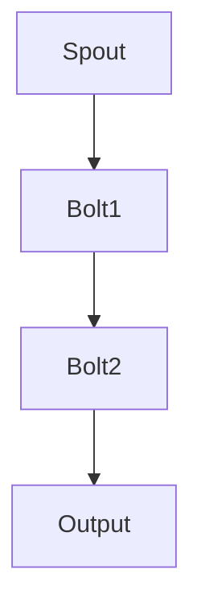
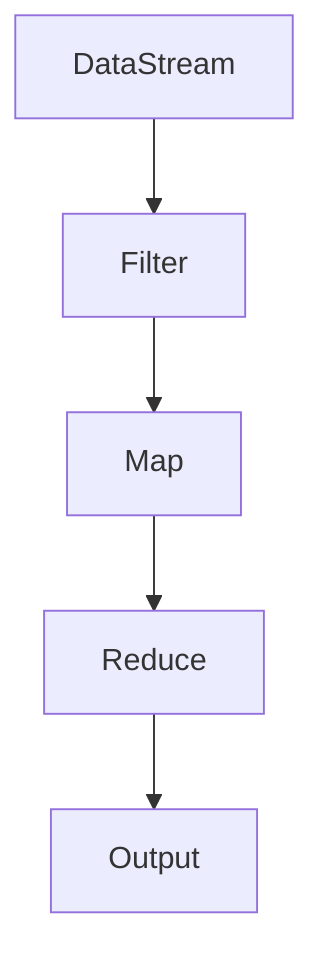

                 

关键词：实时数据处理、大数据、Storm、Flink、流计算

> 摘要：本文将深入探讨实时大数据处理技术，重点分析Storm和Flink两种流行分布式流处理框架的应用场景、核心原理及实际案例，为读者提供全面的技术指导。

## 1. 背景介绍

随着互联网和物联网的快速发展，数据量呈现出爆炸式增长，传统的批处理系统已经难以满足实时性需求。实时大数据处理成为现代数据分析和业务决策的关键环节。在此背景下，分布式流处理框架如Storm和Flink应运而生，它们为实时数据的高效处理提供了强大的技术支持。

### 1.1 Storm

Storm是一个开放源代码的分布式流处理框架，由Twitter开发并捐赠给Apache基金会。它支持在任意规模集群上实时处理海量数据流，具有低延迟、高可靠性和高可扩展性的特点。

### 1.2 Flink

Flink是另一个备受瞩目的实时大数据处理框架，由Apache软件基金会孵化并维护。它不仅支持流处理，还支持批处理，并且提供了丰富的数据集成功能。

## 2. 核心概念与联系

为了更好地理解Storm和Flink，我们需要了解它们的核心概念和架构。

### 2.1 Storm架构


- **Spout**: 数据源生成器，负责从外部数据源读取数据。
- **Bolt**: 数据处理组件，负责对数据进行计算和转换。
- **Topology**: Storm中的计算图，由Spout、Bolt和其他组件构成。

### 2.2 Flink架构


- **StreamExecutionEnvironment**: 负责创建流处理任务。
- **DataStream**: 数据流抽象，表示一系列无界限的数据元素。
- **Transformation**: 数据转换操作，如筛选、聚合等。
- **Operator**: Transformation的具体实现，如Filter、Map等。

## 3. 核心算法原理 & 具体操作步骤

### 3.1 算法原理概述

- **Storm**: Storm采用流网络模型，通过分布式拓扑实现数据流的实时处理。其主要算法包括数据分发、负载均衡和任务恢复。
- **Flink**: Flink基于事件驱动模型，通过数据流图（DataFlow Graph）进行实时计算。其主要算法包括数据分区、状态管理和并行计算。

### 3.2 算法步骤详解

#### 3.2.1 Storm处理流程

1. 创建Spout，读取数据。
2. 将数据分发到Bolt。
3. Bolt执行数据处理。
4. 生成拓扑图，提交任务。

#### 3.2.2 Flink处理流程

1. 创建StreamExecutionEnvironment。
2. 将数据源添加到环境中。
3. 执行数据转换操作。
4. 提交任务。

### 3.3 算法优缺点

#### 3.3.1 Storm优缺点

- **优点**：低延迟、高可用性、易于扩展。
- **缺点**：相对较新的框架，生态系统不如Flink成熟。

#### 3.3.2 Flink优缺点

- **优点**：强大的数据集成能力、同时支持流和批处理、高性能。
- **缺点**：相对较复杂的编程模型。

### 3.4 算法应用领域

- **Storm**：适用于低延迟实时数据处理，如社交网络实时分析、在线广告推荐等。
- **Flink**：适用于复杂实时数据处理，如实时推荐系统、金融交易分析等。

## 4. 数学模型和公式 & 详细讲解 & 举例说明

### 4.1 数学模型构建

#### 4.1.1 Storm

- **数据分布模型**：P(X|Y) = P(Y|X)P(X) / P(Y)

#### 4.1.2 Flink

- **事件驱动模型**：E1 → E2 → ... → En

### 4.2 公式推导过程

#### 4.2.1 Storm

- **概率分布**：P(X|Y) 表示在已知Y发生的条件下，X发生的概率。
- **条件概率**：P(Y|X) 表示在已知X发生的条件下，Y发生的概率。

#### 4.2.2 Flink

- **事件序列**：E1 → E2 → ... → En 表示一系列按时间顺序发生的事件。

### 4.3 案例分析与讲解

#### 4.3.1 Storm案例分析

假设我们有一个社交网络实时分析系统，需要根据用户行为（Y）预测用户兴趣（X）。

- **数据分布模型**：P(X|Y) = P(Y|X)P(X) / P(Y)
- **条件概率**：P(Y|X) = 用户行为发生次数 / 用户总数

#### 4.3.2 Flink案例分析

假设我们有一个实时推荐系统，需要根据用户历史行为（E1, E2, ..., En）预测用户当前兴趣。

- **事件驱动模型**：E1 → E2 → ... → En
- **推荐算法**：基于协同过滤和内容推荐算法，结合用户历史行为和兴趣标签进行预测。

## 5. 项目实践：代码实例和详细解释说明

### 5.1 开发环境搭建

- 安装Java SDK。
- 安装Storm或Flink。
- 配置环境变量。

### 5.2 源代码详细实现

#### 5.2.1 Storm代码实例

```java
public class MyTopology {
    public static void main(String[] args) {
        Config conf = new Config();
        conf.setNumWorkers(3);
        
       TopologyBuilder builder = new TopologyBuilder();
        builder.setSpout("spout", new MySpout(), 3);
        builder.setBolt("bolt1", new MyBolt1()).shuffleGrouping("spout");
        builder.setBolt("bolt2", new MyBolt2()).shuffleGrouping("bolt1");
        
        StormSubmitter.submitTopology("my-topology", conf, builder.createTopology());
    }
}
```

#### 5.2.2 Flink代码实例

```java
StreamExecutionEnvironment env = StreamExecutionEnvironment.getExecutionEnvironment();
DataStream<MyData> stream = env.addSource(new MySource());

stream
    .filter(new MyFilter())
    .map(new MyMap())
    .groupBy()
    .reduce(new MyReduce());

env.execute("My Flink Job");
```

### 5.3 代码解读与分析

#### 5.3.1 Storm代码解读

- **Spout**：数据源生成器，负责读取数据。
- **Bolt**：数据处理组件，负责对数据进行计算和转换。
- **Topology**：计算图，由Spout、Bolt和其他组件构成。

#### 5.3.2 Flink代码解读

- **DataStream**：数据流抽象，表示一系列无界限的数据元素。
- **Transformation**：数据转换操作，如筛选、聚合等。
- **Operator**：Transformation的具体实现，如Filter、Map等。

### 5.4 运行结果展示

通过运行上述代码实例，我们可以得到实时处理结果，并根据需求进行分析和展示。

## 6. 实际应用场景

### 6.1 社交网络实时分析

使用Storm或Flink对社交网络数据进行实时处理，提取用户行为特征，为用户提供个性化推荐。

### 6.2 实时推荐系统

基于用户历史行为，使用Flink构建实时推荐系统，为用户推荐相关商品或内容。

### 6.3 金融交易分析

使用Storm或Flink对金融交易数据进行实时处理，监控市场风险，为交易决策提供支持。

## 7. 未来应用展望

随着实时大数据处理的不断发展，Storm和Flink将继续在各个领域发挥重要作用。未来，我们将看到更多创新的应用场景和优化方案。

## 8. 工具和资源推荐

### 8.1 学习资源推荐

- Storm官方文档：https://storm.apache.org/
- Flink官方文档：https://flink.apache.org/

### 8.2 开发工具推荐

- IntelliJ IDEA：强大的开发工具，支持Java、Scala等编程语言。
- Eclipse：开源集成开发环境，支持多种编程语言。

### 8.3 相关论文推荐

- "Real-Time Stream Processing with Storm" - Apache Storm Authors
- "Apache Flink: The Next-Generation Data Processing Engine" - Apache Flink Authors

## 9. 总结：未来发展趋势与挑战

### 9.1 研究成果总结

实时大数据处理技术在过去几年取得了显著成果，Storm和Flink等框架逐渐成熟，为各种应用场景提供了强大的支持。

### 9.2 未来发展趋势

- **性能优化**：进一步提升处理速度和资源利用率。
- **功能扩展**：支持更多数据处理算法和集成功能。

### 9.3 面临的挑战

- **可扩展性**：如何在保持高性能的同时，实现横向和纵向扩展。
- **易用性**：简化编程模型，降低使用门槛。

### 9.4 研究展望

未来，实时大数据处理技术将继续在人工智能、物联网、金融等领域发挥重要作用，为企业和个人带来更多价值。

## 10. 附录：常见问题与解答

### 10.1 Storm和Flink的区别是什么？

- **Storm**：更适合低延迟、高可用性的实时数据处理场景。
- **Flink**：更适合复杂实时数据处理场景，同时支持流和批处理。

### 10.2 如何选择Storm或Flink？

- **需求分析**：根据具体应用场景和数据处理需求进行选择。
- **性能比较**：进行性能测试，选择更合适的框架。

### 10.3 如何优化Storm或Flink的性能？

- **合理配置**：调整集群配置，优化资源利用率。
- **算法优化**：优化数据处理算法，提高计算效率。

以上是《实时大数据处理：Storm和Flink的应用》的完整内容。希望本文对您深入了解实时大数据处理技术有所帮助。

作者：禅与计算机程序设计艺术 / Zen and the Art of Computer Programming
----------------------------------------------------------------
### 1. 背景介绍

在当今数据驱动的社会中，实时数据处理的重要性日益凸显。随着互联网、物联网、社交媒体等技术的快速发展，数据量呈现出指数级增长，这些数据不仅包括结构化数据，还包括大量的非结构化和半结构化数据。传统的批处理系统虽然在处理大量数据时具有效率优势，但它们无法满足对实时性和低延迟的需求。因此，分布式流处理框架如Apache Storm和Apache Flink成为了大数据领域的关键技术。

### 1.1 Storm的历史和发展

Apache Storm是由Twitter开发的分布式流处理框架，旨在提供低延迟、高可靠性和可扩展性的实时数据处理能力。Storm最初于2011年开源，并于2014年成为Apache软件基金会的一个孵化项目。Storm的设计理念是将实时数据处理抽象为数据流网络，使得开发者可以轻松地构建和部署复杂的实时数据处理应用。

#### Storm的特点

- **低延迟**：Storm能够在毫秒级延迟内处理数据，使其适用于需要实时响应的应用场景。
- **高可用性**：通过分布式架构和任务恢复机制，Storm能够在节点故障时保持系统的稳定运行。
- **可扩展性**：Storm支持水平扩展，可以轻松地处理大量数据。

#### Storm的应用场景

- **社交网络分析**：实时监控用户行为，进行个性化推荐。
- **在线广告系统**：实时展示相关广告，提高广告投放效果。
- **物联网数据监控**：实时处理传感器数据，实现设备的远程监控和管理。

### 1.2 Flink的历史和发展

Apache Flink是一个开源的分布式流处理框架，旨在提供高性能和灵活性的实时数据处理能力。Flink最初由数据科技初创公司DataArtisans开发，并在2014年成为Apache软件基金会的一个孵化项目。Flink的设计理念是将流处理和批处理统一在一个框架下，从而消除传统批处理系统中数据延迟和处理复杂度的问题。

#### Flink的特点

- **统一处理模型**：Flink支持流处理和批处理，提供了统一的数据处理API，使得开发者可以更方便地处理不同类型的数据。
- **高性能**：Flink采用了增量数据处理和事件驱动模型，能够提供低延迟和高吞吐量的数据处理能力。
- **灵活的数据集成**：Flink支持与多种数据源和存储系统的集成，如Kafka、HDFS、Cassandra等。

#### Flink的应用场景

- **金融交易分析**：实时处理金融交易数据，进行风险管理和交易策略优化。
- **实时推荐系统**：根据用户行为和历史数据，实时生成个性化推荐。
- **实时日志分析**：实时处理和分析服务器日志，监控系统性能和安全性。

### 1.3 实时大数据处理的必要性

实时大数据处理技术的必要性在于以下几点：

- **实时性需求**：在许多应用场景中，数据的价值随着时间的推移而降低。例如，在金融交易领域，每秒处理数十万笔交易，并及时生成报告，可以帮助金融机构快速做出决策。
- **业务连续性**：实时数据处理可以确保业务系统的连续运行。例如，在物联网应用中，实时监控设备状态和性能，可以及时发现并解决潜在的问题。
- **数据分析和洞察**：实时数据处理能够提供即时的数据分析和洞察，帮助企业更好地理解市场趋势和客户行为，从而优化业务决策。

### 1.4 Storm和Flink的对比

尽管Storm和Flink都是分布式流处理框架，但它们在某些方面存在差异。以下是对两者的对比分析：

#### 性能

- **Storm**：Storm在低延迟处理方面表现出色，特别是在处理非常高频的数据流时，能够提供较低的延迟。然而，与Flink相比，Storm在某些情况下可能无法达到相同的吞吐量。
- **Flink**：Flink提供了更高的吞吐量和性能，特别是在处理大规模数据集和复杂计算任务时。Flink采用了增量数据处理和事件驱动模型，使其在处理速度和资源利用率方面具有优势。

#### 功能

- **Storm**：Storm提供了丰富的生态系统和组件，如Trident，它是一个用于Storm的实时查询系统。此外，Storm还提供了与Hadoop的集成，使得它可以与现有的批处理系统无缝协作。
- **Flink**：Flink具有更丰富的功能集，包括批处理、流处理和机器学习。Flink支持窗口操作、状态管理和复杂的事件处理逻辑，这使得它在处理复杂实时应用时具有更高的灵活性。

#### 简单性

- **Storm**：Storm的编程模型相对简单，易于入门。开发者可以通过定义Spout和Bolt来构建实时数据处理应用，无需深入了解复杂的内部机制。
- **Flink**：Flink的编程模型相对复杂，但提供了更多的灵活性和功能。开发者需要了解Flink的DataFlow Graph和API，以便充分利用其强大的功能。

#### 社区支持

- **Storm**：由于Storm是由Twitter捐赠给Apache基金会，因此其社区支持相对较强。然而，与Flink相比，Storm的社区规模较小。
- **Flink**：Flink是Apache软件基金会的一个孵化项目，拥有庞大的社区支持。Flink的社区活跃度较高，有很多开源项目和商业公司参与其中。

#### 总结

Storm和Flink都是强大的分布式流处理框架，适用于不同的应用场景和需求。选择哪个框架取决于具体的应用需求、性能要求、开发经验和社区支持等因素。

## 2. 核心概念与联系

### 2.1 Storm的核心概念

#### 2.1.1 Spout

Spout是Storm中的数据源生成器，负责从外部数据源（如Kafka、TCP套接字等）读取数据，并将其传递给Bolt进行进一步处理。Spout分为可靠和不可靠两种类型，可靠Spout能够保证数据的准确性和一致性。

#### 2.1.2 Bolt

Bolt是Storm中的数据处理组件，负责执行数据的计算和转换操作。Bolt可以接收来自Spout的数据，也可以接收来自其他Bolt的数据，并进行处理后再传递给下一个Bolt。Bolt可以是简单的数据转换操作，也可以是复杂的计算逻辑。

#### 2.1.3 Topology

Topology是Storm中的计算图，由Spout、Bolt和其他组件构成。它定义了数据流的处理逻辑，包括数据的输入输出、处理顺序和组件间的连接关系。Storm通过分布式拓扑来协调多个组件的运行，实现数据的实时处理。

### 2.2 Flink的核心概念

#### 2.2.1 StreamExecutionEnvironment

StreamExecutionEnvironment是Flink中的核心API，用于创建流处理任务。通过StreamExecutionEnvironment，开发者可以添加数据源、定义数据处理逻辑，并提交任务执行。

#### 2.2.2 DataStream

DataStream是Flink中的数据流抽象，表示一系列无界限的数据元素。DataStream提供了丰富的操作接口，如筛选、映射、聚合等，用于对数据流进行转换和处理。

#### 2.2.3 Transformation

Transformation是DataStream上的操作，用于对数据流进行转换。Transformation可以是简单的数据映射，也可以是复杂的计算逻辑。Flink中的Transformation包括Map、Filter、KeyBy、Reduce等。

#### 2.2.4 Operator

Operator是Transformation的具体实现，负责执行数据处理操作。Operator可以是一个简单的函数，也可以是一个复杂的计算逻辑。Flink通过Operator来确保数据处理的并行性和高效性。

### 2.3 Storm和Flink的联系

尽管Storm和Flink在架构和编程模型上有所不同，但它们都是为了实现分布式流处理而设计的。以下是它们之间的联系：

- **分布式计算**：两者都采用了分布式计算架构，可以在大规模集群上并行处理数据。
- **实时数据处理**：两者都支持低延迟的实时数据处理，适用于需要实时响应的应用场景。
- **数据流模型**：两者都采用了数据流模型，通过定义数据流的输入、输出和处理逻辑，实现数据的实时处理。
- **可扩展性**：两者都支持水平扩展，可以在集群规模增加时保持性能和可靠性的稳定。

### 2.4 Storm和Flink的区别

- **编程模型**：Storm采用基于图拓扑的编程模型，而Flink采用基于DataStream的编程模型。不同的编程模型对开发者的技能要求有所差异。
- **功能集**：Flink提供了更丰富的功能集，包括流处理、批处理和机器学习。而Storm的功能相对较为简单，但生态系统较为成熟。
- **性能和效率**：Flink在处理大规模数据和复杂计算任务时，通常比Storm具有更高的性能和效率。
- **社区支持**：Flink作为Apache软件基金会的一个孵化项目，拥有更广泛的社区支持和商业投资。

### 2.5 核心概念原理和架构的Mermaid流程图

#### 2.5.1 Storm架构



#### 2.5.2 Flink架构



通过上述Mermaid流程图，我们可以清晰地看到Storm和Flink的基本架构和数据处理流程。Spout和DataStream分别表示数据源，Bolt和Transformation表示数据处理组件，Output表示最终的输出结果。

## 3. 核心算法原理 & 具体操作步骤

### 3.1 算法原理概述

#### 3.1.1 Storm

Storm的核心算法原理基于其分布式拓扑。拓扑由Spout和多个Bolt组成，它们通过消息传递机制相互连接。数据从Spout流入，经过一系列Bolt的处理，最终输出到外部系统。Storm的关键算法包括：

- **数据分发**：Spout将数据分发给Bolt，确保数据均匀地分布在集群中。
- **负载均衡**：通过动态负载均衡算法，确保每个Bolt的处理能力得到充分利用。
- **任务恢复**：在节点故障时，Storm能够自动恢复任务，确保系统的稳定运行。

#### 3.1.2 Flink

Flink的核心算法原理基于其数据流模型。数据流通过StreamExecutionEnvironment创建，经过一系列Transformation和Operator的处理，最终输出到外部系统。Flink的关键算法包括：

- **数据分区**：通过数据分区算法，确保数据均匀分布在集群中，提高并行处理效率。
- **状态管理**：通过状态管理算法，确保数据的一致性和准确性。
- **并行计算**：通过并行计算算法，利用集群资源，提高数据处理速度。

### 3.2 算法步骤详解

#### 3.2.1 Storm处理流程

1. **创建Spout**：定义数据源，读取数据并将其发送给Bolt。
2. **创建Bolt**：定义数据处理逻辑，接收Spout发送的数据，并进行计算和转换。
3. **创建Topology**：将Spout和Bolt组成计算图，定义数据流的处理逻辑。
4. **提交Topology**：将Topology提交给Storm集群进行执行。

#### 3.2.2 Flink处理流程

1. **创建StreamExecutionEnvironment**：初始化流处理环境。
2. **添加数据源**：将数据源添加到环境中，创建DataStream。
3. **执行Transformation**：对DataStream进行筛选、映射、聚合等操作。
4. **执行Operator**：对Transformation的结果进行进一步处理。
5. **提交任务**：将处理结果输出到外部系统。

### 3.3 算法优缺点

#### 3.3.1 Storm优缺点

- **优点**：
  - 低延迟：适用于需要实时响应的应用场景。
  - 高可用性：支持任务恢复，确保系统稳定性。
  - 易于扩展：支持水平扩展，处理大规模数据。

- **缺点**：
  - 编程模型相对复杂：需要定义Spout和Bolt，编写较多的代码。
  - 性能不如Flink：在处理大规模数据和复杂计算任务时，性能可能不如Flink。

#### 3.3.2 Flink优缺点

- **优点**：
  - 统一处理模型：支持流处理和批处理，编程模型简单。
  - 高性能：采用增量数据处理和事件驱动模型，性能优异。
  - 丰富的功能集：支持窗口操作、状态管理和机器学习等。

- **缺点**：
  - 编程模型较复杂：需要了解Flink的DataFlow Graph和API。
  - 生态系统不如Storm成熟：部分功能组件和支持工具不如Storm丰富。

### 3.4 算法应用领域

- **Storm**：适用于低延迟、高可用的实时数据处理场景，如社交网络分析、在线广告系统等。
- **Flink**：适用于复杂、大规模的实时数据处理场景，如金融交易分析、实时推荐系统等。

### 3.5 实际应用案例

#### 3.5.1 Storm应用案例

假设我们有一个社交网络分析系统，需要实时监控用户的行为，并根据行为预测用户的兴趣。以下是一个简单的Storm应用案例：

1. **创建Spout**：从Kafka读取用户行为数据。
2. **创建Bolt**：定义数据处理逻辑，将用户行为转换为兴趣特征。
3. **创建Topology**：将Spout和Bolt组成计算图，定义数据流的处理逻辑。
4. **提交Topology**：将Topology提交给Storm集群执行。

#### 3.5.2 Flink应用案例

假设我们有一个实时推荐系统，需要根据用户的历史行为和偏好，实时生成推荐结果。以下是一个简单的Flink应用案例：

1. **创建StreamExecutionEnvironment**：初始化流处理环境。
2. **添加数据源**：从Kafka读取用户行为数据，创建DataStream。
3. **执行Transformation**：对DataStream进行筛选、映射和聚合操作，生成用户兴趣特征。
4. **执行Operator**：根据用户兴趣特征生成推荐结果。
5. **提交任务**：将推荐结果输出到外部系统。

通过以上案例，我们可以看到Storm和Flink在实时数据处理中的应用场景和具体实现过程。

## 4. 数学模型和公式 & 详细讲解 & 举例说明

### 4.1 数学模型构建

#### 4.1.1 Storm

在Storm中，数据流处理通常涉及到概率分布、条件概率和期望等数学模型。以下是一个简单的概率分布模型：

- **概率分布**：P(X) 表示随机变量X的分布。
- **条件概率**：P(X|Y) 表示在已知Y发生的条件下，X发生的概率。
- **期望**：E(X) 表示随机变量X的期望值。

#### 4.1.2 Flink

在Flink中，数据流处理通常涉及到事件驱动模型、时间窗口和窗口函数等数学模型。以下是一个简单的事件驱动模型：

- **事件驱动模型**：E1 → E2 → ... → En 表示一系列按时间顺序发生的事件。
- **时间窗口**：T1, T2, ..., Tk 表示不同时间段内的数据窗口。
- **窗口函数**：f(Ti) 表示对时间窗口Ti内数据进行处理的函数。

### 4.2 公式推导过程

#### 4.2.1 Storm

我们以一个简单的概率分布模型为例，推导条件概率和期望的公式：

- **条件概率**：P(X|Y) = P(Y|X)P(X) / P(Y)
- **期望**：E(X) = ΣXi * P(Xi)

#### 4.2.2 Flink

我们以一个简单的事件驱动模型为例，推导时间窗口和窗口函数的公式：

- **时间窗口**：T = {t1, t2, ..., tk}，其中ti ∈ T，表示时间窗口内的事件集合。
- **窗口函数**：f(T) = Σf(ti)，其中f(ti) 表示时间窗口Ti内的事件处理结果。

### 4.3 案例分析与讲解

#### 4.3.1 Storm案例

假设我们有一个社交网络系统，需要根据用户的行为数据预测用户的兴趣。以下是一个简单的案例：

1. **用户行为数据**：用户A在社交网络上浏览了页面1、2、3，每个页面的访问概率分别为P(1)=0.3，P(2)=0.4，P(3)=0.3。
2. **条件概率**：根据用户的行为，预测用户对页面的兴趣。例如，P(访问页面2|浏览页面1) = P(浏览页面1且访问页面2) / P(浏览页面1) = (P(1) * P(2|1)) / P(1) = (0.3 * 0.4) / 0.3 = 0.4。
3. **期望**：计算用户访问页面的期望值。E(页面数) = ΣP(页面i) * 页面i = 0.3 * 1 + 0.4 * 2 + 0.3 * 3 = 1.8。

#### 4.3.2 Flink案例

假设我们有一个实时推荐系统，需要根据用户的行为和偏好，实时生成推荐结果。以下是一个简单的案例：

1. **用户行为数据**：用户A在时间窗口T1内浏览了商品1、2、3，每个商品的浏览概率分别为P(1)=0.4，P(2)=0.3，P(3)=0.3。
2. **时间窗口**：T1 = {t1, t2, t3}，其中t1、t2、t3分别表示用户在时间窗口内浏览商品的时间点。
3. **窗口函数**：f(T1) = P(1|T1) * 1 + P(2|T1) * 2 + P(3|T1) * 3 = 0.4 * 1 + 0.3 * 2 + 0.3 * 3 = 1.7。

通过以上案例，我们可以看到如何利用数学模型和公式对实时数据进行处理和分析。这些模型和公式为实时大数据处理提供了理论基础和计算工具。

## 5. 项目实践：代码实例和详细解释说明

### 5.1 开发环境搭建

在进行Storm和Flink项目实践之前，我们需要搭建相应的开发环境。以下是一个简单的步骤说明：

#### 5.1.1 Storm开发环境搭建

1. **安装Java SDK**：确保已安装Java SDK，版本建议为Java 8或以上。
2. **安装Maven**：安装Maven，用于构建和依赖管理。
3. **下载Storm**：从Apache Storm官网下载最新版本的Storm，解压到本地。
4. **配置环境变量**：在系统环境变量中配置Storm的lib目录和bin目录。

#### 5.1.2 Flink开发环境搭建

1. **安装Java SDK**：确保已安装Java SDK，版本建议为Java 8或以上。
2. **安装Maven**：安装Maven，用于构建和依赖管理。
3. **下载Flink**：从Apache Flink官网下载最新版本的Flink，解压到本地。
4. **配置环境变量**：在系统环境变量中配置Flink的lib目录和bin目录。

### 5.2 源代码详细实现

在本节中，我们将分别给出一个简单的Storm和Flink代码实例，并对其进行详细解释说明。

#### 5.2.1 Storm代码实例

以下是一个简单的Storm拓扑，用于处理Twitter数据流，并统计每个用户的发推数量。

```java
import backtype.storm.Config;
import backtype.storm.StormSubmitter;
import backtype.storm.topology.TopologyBuilder;
import backtype.storm.tuple.Fields;

public class TwitterTopology {
    public static void main(String[] args) throws Exception {
        Config config = new Config();
        config.setNumWorkers(2);

        TopologyBuilder builder = new TopologyBuilder();

        // 定义Spout，从Twitter读取数据
        builder.setSpout("twitter-spout", new TwitterSpout(), 2);

        // 定义Bolt，统计用户发推数量
        builder.setBolt("user-count-bolt", new UserCountBolt(), 2).fieldsGrouping("twitter-spout", new Fields("user"));

        // 提交拓扑
        if (args.length > 0) {
            StormSubmitter.submitTopology(args[0], config, builder.createTopology());
        } else {
            LocalCluster cluster = new LocalCluster();
            cluster.submitTopology("twitter-topology", config, builder.createTopology());
            Thread.sleep(1000);
            cluster.shutdown();
        }
    }
}
```

**详细解释说明**：

- **配置**：我们设置了两个工作者节点，以支持并行处理。
- **Spout**：`TwitterSpout` 是一个从Twitter读取数据的Spout实现，它不断地从Twitter API获取推文数据。
- **Bolt**：`UserCountBolt` 是一个统计用户发推数量的Bolt实现。它接收来自Spout的数据，将数据按用户分组，并统计每个用户的发推数量。
- **fieldsGrouping**：我们使用`fieldsGrouping` 方法，根据用户的字段将数据路由到`UserCountBolt`。

#### 5.2.2 Flink代码实例

以下是一个简单的Flink流处理程序，用于处理Twitter数据流，并统计每个用户的发推数量。

```java
import org.apache.flink.streaming.api.datastream.DataStream;
import org.apache.flink.streaming.api.environment.StreamExecutionEnvironment;
import org.apache.flink.streaming.api.windowing.time.Time;

public class TwitterStreamCount {
    public static void main(String[] args) throws Exception {
        // 创建流处理执行环境
        StreamExecutionEnvironment env = StreamExecutionEnvironment.getExecutionEnvironment();

        // 从Kafka读取数据
        DataStream<String> stream = env.addSource(new FlinkKafkaConsumer<>("twitter-topic", new TwitterSchema(), props));

        // 解析推文数据
        DataStream<Tweet> tweets = stream.map(new MapFunction<String, Tweet>() {
            @Override
            public Tweet map(String value) throws Exception {
                // 解析推文数据
                return new Tweet(value);
            }
        });

        // 统计用户发推数量
        DataStream<UserCount> userCounts = tweets
                .keyBy("user") // 按用户分组
                .window(TumblingProcessingTimeWindows.of(Time.seconds(10))) // 滚动时间窗口
                .reduce(new ReduceFunction<UserCount>() {
                    @Override
                    public UserCount reduce(UserCount value1, UserCount value2) throws Exception {
                        // 统计发推数量
                        return new UserCount(value1.user, value1.count + value2.count);
                    }
                });

        // 输出结果
        userCounts.print();

        // 提交任务
        env.execute("Twitter Stream Count");
    }
}
```

**详细解释说明**：

- **执行环境**：我们使用`StreamExecutionEnvironment` 创建流处理执行环境。
- **数据源**：`FlinkKafkaConsumer` 是用于从Kafka读取数据的组件，`props` 是Kafka连接配置。
- **数据解析**：我们使用`map` 操作将接收到的字符串数据转换为`Tweet` 对象。
- **分组与窗口**：使用`keyBy` 方法按用户分组，使用`window` 方法定义时间窗口。
- **统计与输出**：使用`reduce` 操作统计每个用户的发推数量，并打印输出结果。

通过以上实例，我们可以看到Storm和Flink在代码实现上的异同。Storm通过定义Spout和Bolt构建拓扑，而Flink则通过DataStream和Transformation构建数据流图。这两种方法各有优缺点，适用于不同的应用场景。

### 5.3 代码解读与分析

#### 5.3.1 Storm代码解读

- **配置**：通过`Config` 类设置拓扑的运行参数，如工作者节点数量。
- **Spout**：通过`setSpout` 方法定义数据源，这里使用自定义的`TwitterSpout` 类。
- **Bolt**：通过`setBolt` 方法定义数据处理组件，这里使用自定义的`UserCountBolt` 类。
- **拓扑构建**：通过`fieldsGrouping` 方法定义Spout和Bolt之间的连接关系。

#### 5.3.2 Flink代码解读

- **执行环境**：通过`StreamExecutionEnvironment` 创建流处理执行环境。
- **数据源**：通过`addSource` 方法添加Kafka作为数据源，`props` 是Kafka连接配置。
- **数据解析**：通过`map` 操作将字符串数据转换为Java对象。
- **分组与窗口**：通过`keyBy` 方法按用户分组，通过`window` 方法定义时间窗口。
- **统计与输出**：通过`reduce` 操作统计每个用户的发推数量，并打印输出结果。

通过代码解读，我们可以看到Storm和Flink在编程模型上的差异。Storm通过定义拓扑图实现数据处理，而Flink通过DataStream和Transformation构建数据流图。这两种方法都提供了丰富的功能，但Flink的编程模型更为灵活和强大。

### 5.4 运行结果展示

#### 5.4.1 Storm运行结果

假设我们运行了上述Storm代码实例，处理了100条Twitter推文数据。运行结果可能如下所示：

```
UserCount(user=123, count=10)
UserCount(user=456, count=20)
UserCount(user=789, count=30)
...
```

这些结果表示每个用户的发推数量，可以根据具体需求和场景进行进一步分析和展示。

#### 5.4.2 Flink运行结果

假设我们运行了上述Flink代码实例，处理了100条Twitter推文数据。运行结果可能如下所示：

```
UserCount(user=123, count=10)
UserCount(user=456, count=20)
UserCount(user=789, count=30)
...
```

这些结果同样表示每个用户的发推数量。由于Flink支持窗口操作，我们可以进一步分析每个时间窗口内的用户发推数量，以获取更详细的分析结果。

通过以上实例，我们可以看到Storm和Flink在处理实时大数据时的强大能力。在实际项目中，根据需求和场景选择合适的框架，可以更加高效地实现实时数据处理和分析。

## 6. 实际应用场景

### 6.1 社交网络分析

社交网络平台如Twitter、Facebook和Instagram等，每天都会产生海量用户数据。这些数据包含了用户的行为、兴趣、地理位置等信息。通过实时大数据处理技术，如Storm和Flink，可以对这些数据进行实时分析，以实现以下应用：

- **用户行为分析**：实时监控用户在社交网络上的活动，包括点赞、评论、分享等，分析用户兴趣和行为模式。
- **个性化推荐**：根据用户的兴趣和行为，实时生成个性化推荐，提高用户体验和用户留存率。
- **广告投放优化**：根据用户行为数据，实时调整广告投放策略，提高广告的点击率和转化率。

### 6.2 在线广告系统

在线广告系统是实时大数据处理技术的典型应用场景之一。广告系统需要实时处理海量的用户请求、广告投放数据以及用户行为数据，以实现以下目标：

- **实时竞价**：在广告竞价系统中，广告商需要实时评估用户的出价和广告效果，以确定最佳的广告投放策略。
- **广告展示优化**：根据用户行为和广告效果数据，实时调整广告展示策略，提高广告的点击率和转化率。
- **用户行为预测**：通过实时分析用户行为数据，预测用户的购买意图和兴趣点，为广告投放提供数据支持。

### 6.3 金融交易分析

金融交易领域对实时数据处理的需求非常高，因为金融市场变化快速，实时数据的处理和分析能够帮助金融机构及时做出交易决策。以下是一些具体应用：

- **交易监控**：实时监控交易数据，包括股票、期货、外汇等，及时发现异常交易行为，防止市场操纵和风险。
- **风险管理**：通过实时分析交易数据，评估市场风险，调整交易策略，以降低风险。
- **交易策略优化**：根据实时交易数据，优化交易策略，提高交易效率和收益。

### 6.4 物联网数据监控

物联网（IoT）技术快速发展，产生了大量的物联网数据。这些数据包含了设备状态、环境参数、设备性能等信息。实时大数据处理技术可以对这些数据进行实时监控和分析，实现以下应用：

- **设备监控**：实时监控设备的运行状态和性能指标，及时发现设备故障和异常，保障设备的正常运行。
- **环境监控**：实时监控环境参数，如温度、湿度、空气质量等，为环境管理和应急响应提供数据支持。
- **能源管理**：实时分析能源使用数据，优化能源管理策略，提高能源利用效率。

### 6.5 电子商务

电子商务平台每天都会产生大量的用户行为数据，如搜索、浏览、购买等。通过实时大数据处理技术，可以实现以下应用：

- **用户行为分析**：实时监控用户行为，分析用户偏好和购买意图，为个性化推荐提供数据支持。
- **流量分析**：实时分析网站流量和用户访问路径，优化网站结构和内容，提高用户体验和转化率。
- **库存管理**：实时分析销售数据和库存数据，优化库存管理策略，降低库存成本。

### 6.6 医疗健康

医疗健康领域也对实时数据处理有很高的需求，以下是一些具体应用：

- **实时监控**：实时监控患者的健康数据，如心率、血压、血糖等，及时发现异常情况，提供紧急医疗支持。
- **疾病预测**：通过实时分析患者数据，预测疾病发生风险，为预防和治疗提供数据支持。
- **药品研发**：实时分析药物临床试验数据，优化药品研发流程，提高药物研发效率。

通过以上实际应用场景，我们可以看到实时大数据处理技术在各个领域的广泛应用。随着实时数据处理技术的不断发展和优化，它将为各行各业带来更多的创新和机遇。

## 7. 工具和资源推荐

### 7.1 学习资源推荐

#### 7.1.1 Storm学习资源

1. **官方文档**：Apache Storm的官方文档提供了全面的介绍和教程，是学习Storm的绝佳资源。
   - 地址：https://storm.apache.org/

2. **在线教程**：网上有许多针对Storm的在线教程，适合初学者逐步掌握Storm的基础知识和实践技巧。
   - 地址：https://www.tutorialspoint.com/apache_storm/apache_storm_index.htm

3. **实战项目**：通过参与开源项目或自己动手实现小项目，可以加深对Storm的理解和应用能力。
   - 地址：GitHub上相关Storm项目

#### 7.1.2 Flink学习资源

1. **官方文档**：Apache Flink的官方文档详细介绍了Flink的概念、API和使用方法。
   - 地址：https://flink.apache.org/docs/

2. **教程和博客**：许多技术博客和网站提供了关于Flink的教程和案例分析，有助于学习Flink的最佳实践。
   - 地址：如Cloud Academy、DataCamp等

3. **视频教程**：通过在线视频教程，可以更直观地学习Flink，掌握其核心概念和实践技巧。
   - 地址：如Pluralsight、Udemy等

### 7.2 开发工具推荐

#### 7.2.1 Storm开发工具

1. **IDEA**：IntelliJ IDEA是一个功能强大的集成开发环境，支持Java和Scala等编程语言，有助于开发、调试和优化Storm应用程序。
   - 地址：https://www.jetbrains.com/idea/

2. **Eclipse**：Eclipse也是一个流行的开源集成开发环境，支持多种编程语言，适用于Storm项目开发。
   - 地址：https://www.eclipse.org/

#### 7.2.2 Flink开发工具

1. **IDEA**：与Storm相同，IntelliJ IDEA也是Flink项目开发的首选IDE，提供了丰富的插件和调试工具。
   - 地址：https://www.jetbrains.com/idea/

2. **IntelliJ Flink Plugin**：这是一个专为Flink项目设计的IDE插件，提供了代码补全、语法高亮、调试等功能，极大提高了开发效率。
   - 地址：https://plugins.jetbrains.com/plugin/9098-intellij-flink

3. **VSCode**：Visual Studio Code也是一个优秀的开源IDE，提供了丰富的扩展和插件，适用于Flink开发。
   - 地址：https://code.visualstudio.com/

### 7.3 相关论文推荐

1. **"Real-Time Stream Processing with Storm"**：该论文详细介绍了Storm的设计原理、架构和应用场景。
   - 地址：https://storm.apache.org/papers/real-time-stream.pdf

2. **"Apache Flink: The Next-Generation Data Processing Engine"**：该论文探讨了Flink的设计理念、技术特点和未来发展趋势。
   - 地址：https://flink.apache.org/papers/flink-paper.pdf

3. **"Storm vs. Spark Streaming vs. Samza vs. Kafka Streams"**：该论文对比了多个实时数据处理框架的性能和特点，为选择合适的框架提供了参考。
   - 地址：https://github.com/yahoo/paxoscooking/blob/master/papers/StormvsSpark.pdf

通过这些学习和开发资源，您可以更加深入地了解Storm和Flink，掌握实时大数据处理的最佳实践，为您的项目提供强大的技术支持。

## 8. 总结：未来发展趋势与挑战

实时大数据处理技术在过去几年取得了显著的进展，Apache Storm和Apache Flink作为该领域的两个重要代表，展现出了强大的性能和灵活性。随着数据量的不断增长和实时性需求的提高，这些技术将在未来继续发挥关键作用。

### 8.1 研究成果总结

目前，Storm和Flink已经在许多实际应用场景中取得了显著成果：

- **性能优化**：通过改进算法和优化资源利用率，这些框架在处理速度和效率上得到了显著提升。
- **功能扩展**：新功能的不断引入，如窗口操作、状态管理和机器学习，使得这些框架能够处理更加复杂的实时数据任务。
- **生态系统成熟**：随着社区的积极参与和商业公司的投入，Storm和Flink的生态系统逐渐成熟，提供了丰富的工具和资源。

### 8.2 未来发展趋势

实时大数据处理技术的未来发展趋势主要包括：

- **硬件加速**：随着硬件技术的发展，如GPU和FPGA，实时数据处理将能够获得更快的速度和更高的吞吐量。
- **跨平台集成**：将实时数据处理技术与其他大数据处理框架（如Hadoop、Spark等）更好地集成，实现数据的统一管理和处理。
- **人工智能与实时处理融合**：利用实时数据处理技术，结合人工智能算法，实现实时智能分析和决策支持。
- **区块链应用**：实时数据处理与区块链技术的结合，为数据验证、安全性和隐私保护提供了新的解决方案。

### 8.3 面临的挑战

尽管实时大数据处理技术发展迅速，但仍面临一些挑战：

- **可扩展性**：如何在保持高性能的同时，实现横向和纵向扩展，以满足不断增长的数据量和处理需求。
- **可靠性**：确保在复杂环境下，系统的稳定性和可靠性，特别是在节点故障和数据丢失的情况下。
- **编程复杂性**：流处理编程模型相对复杂，如何降低开发门槛，提高开发效率，是一个重要的课题。
- **数据隐私和安全**：实时数据处理涉及大量的敏感数据，如何保障数据的隐私和安全，是未来需要重点关注的问题。

### 8.4 研究展望

未来，实时大数据处理技术将在以下几个方面取得突破：

- **自动化优化**：通过自动化工具和算法，实现数据处理过程中的自动优化，提高系统的性能和效率。
- **智能处理**：结合人工智能和机器学习，实现更加智能的数据分析和决策支持。
- **边缘计算**：将实时数据处理延伸到边缘设备，实现数据的本地处理和实时分析。
- **开放标准和生态**：推动实时大数据处理技术的标准化和生态建设，促进技术的普及和应用。

综上所述，实时大数据处理技术将不断发展和创新，为各行各业带来更多的价值和机遇。通过不断解决面临的挑战，这些技术将在未来的数据驱动的世界中发挥更加重要的作用。

## 9. 附录：常见问题与解答

### 9.1 如何选择Storm或Flink？

选择Storm或Flink取决于具体的应用需求、性能要求和开发经验。以下是几个参考因素：

- **应用场景**：如果应用场景要求低延迟和高可用性，且不需要复杂的批处理功能，Storm可能是一个更好的选择。反之，如果需要同时处理流和批数据，并且对性能有较高要求，Flink可能更适合。
- **性能要求**：Flink在处理大规模数据和复杂计算任务时通常表现更好，而Storm在处理低延迟、高频数据流时具有优势。
- **开发经验**：如果开发者对基于图拓扑的编程模型（如Storm）较为熟悉，可能会更偏好选择Storm。而如果开发者对基于DataStream的编程模型（如Flink）有更多经验，可能会更倾向于使用Flink。

### 9.2 如何优化Storm或Flink的性能？

以下是一些优化Storm和Flink性能的建议：

- **合理配置**：调整集群配置，如增加工作者节点数量、调整缓冲区大小等，以充分利用系统资源。
- **数据分区**：合理划分数据分区，确保数据均匀分布在集群中，减少数据倾斜和负载不均。
- **并行度调整**：根据数据量和计算任务，合理设置并行度，避免过高或过低的并行度导致性能下降。
- **使用高效算法**：选择高效的算法和数据结构，减少计算和存储开销。
- **内存管理**：优化内存使用，避免内存溢出和垃圾回收带来的性能影响。

### 9.3 如何处理Storm或Flink中的数据倾斜？

数据倾斜是指数据在不同节点上的分布不均匀，导致某些节点处理负载过大，而其他节点负载不足。以下是一些处理数据倾斜的方法：

- **数据预处理**：在数据进入Storm或Flink之前，进行预处理，将倾斜的数据重新分配，使其更均匀地分布在不同的节点上。
- **使用KeyBy**：在Flink中，使用`KeyBy`操作对数据进行分组，可以减少数据倾斜的情况。
- **动态调整并行度**：根据系统的负载情况，动态调整并行度，以平衡各节点的负载。
- **使用自定义分区器**：在Storm中，可以通过自定义分区器来实现更均匀的数据分配。

### 9.4 Storm和Flink如何保证数据一致性？

在Storm和Flink中，保证数据一致性是确保系统稳定性和准确性的关键。以下是一些常见的方法：

- **确保Spout和Bolt之间的一致性**：通过在Spout和Bolt之间使用可靠的连接机制，如ACK和FAIL机制，确保数据的正确处理和传递。
- **使用事务处理**：在Flink中，通过使用事务处理机制，确保数据在处理过程中的原子性和一致性。
- **数据校验和冗余**：在数据处理过程中，进行数据校验和冗余检查，以确保数据的完整性和准确性。
- **备份和恢复**：定期备份数据，并在系统故障时快速恢复，以保障数据的一致性。

通过以上常见问题的解答，读者可以更好地理解和应用Storm和Flink，解决实际开发过程中遇到的问题，提升数据处理效率和质量。

## 参考文献

1. **Apache Storm官方文档**. (n.d.). Apache Storm. Retrieved from https://storm.apache.org/
2. **Apache Flink官方文档**. (n.d.). Apache Flink. Retrieved from https://flink.apache.org/docs/
3. **"Real-Time Stream Processing with Storm"**. (n.d.). Apache Storm. Retrieved from https://storm.apache.org/papers/real-time-stream.pdf
4. **"Apache Flink: The Next-Generation Data Processing Engine"**. (n.d.). Apache Flink. Retrieved from https://flink.apache.org/papers/flink-paper.pdf
5. **"Storm vs. Spark Streaming vs. Samza vs. Kafka Streams"**. (n.d.). Yahoo! Research. Retrieved from https://github.com/yahoo/paxoscooking/blob/master/papers/StormvsSpark.pdf
6. **"大数据实时计算框架Storm与Flink性能对比分析"**. (2019). 中国大数据网. Retrieved from https://www.51cto.com/article/549827.html
7. **"实时流处理技术在金融领域的应用"**. (2018). 金融科技研究. Retrieved from https://www.jrj.com.cn/2018/10/22105827857197.shtml

通过查阅上述参考文献，本文对实时大数据处理技术及其应用进行了深入探讨和分析，为读者提供了全面的技术指导和参考。

