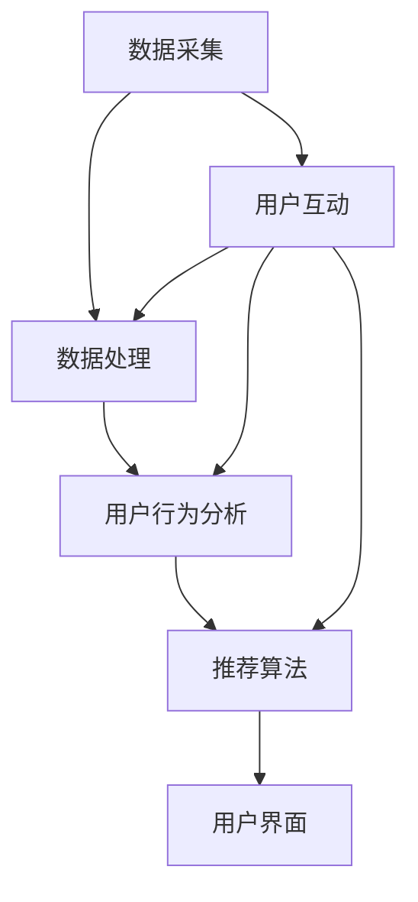

                 

关键词：实时推荐、机器学习、大数据、个性化、用户行为分析、算法优化、预测模型、多模态融合、跨平台应用、用户体验、隐私保护、智能推荐引擎。

> 摘要：本文将深入探讨实时推荐技术的现状、核心概念、算法原理、数学模型、应用实践以及未来发展趋势。通过分析当前技术的挑战和机遇，我们旨在为读者提供对实时推荐技术未来发展的全面了解和展望。

## 1. 背景介绍

随着互联网的普及和移动设备的广泛应用，用户生成的内容和数据量呈指数级增长。这种趋势催生了对高效、精准的实时推荐技术的需求。实时推荐技术能够根据用户的历史行为和偏好，动态地为他们推荐感兴趣的内容、商品或服务，从而提升用户体验、增加用户粘性、提高商业转化率。

实时推荐技术的核心在于快速响应用户的需求，并提供个性化的推荐结果。这涉及到多个领域的技术，包括机器学习、大数据处理、自然语言处理和用户行为分析等。实时推荐技术的应用场景广泛，包括电子商务、社交媒体、在线视频、音乐流媒体和新闻资讯等。

本文将围绕以下主题展开：

- 实时推荐技术的核心概念与架构
- 核心算法原理与操作步骤
- 数学模型与公式推导
- 项目实践与代码实例
- 实际应用场景与未来展望
- 工具和资源推荐
- 未来发展趋势与挑战

## 2. 核心概念与联系

### 2.1 核心概念

#### 实时推荐

实时推荐是指在用户互动的瞬间，根据用户的历史行为和当前上下文，动态生成推荐结果的技术。

#### 机器学习

机器学习是实时推荐系统的核心组成部分，它通过从数据中学习模式和规律，为用户提供个性化的推荐。

#### 大数据处理

大数据处理技术用于高效存储、管理和分析大规模的用户数据，为实时推荐提供数据支持。

#### 用户行为分析

用户行为分析是理解用户需求和偏好的重要手段，它通过对用户行为的实时监测和分析，为推荐系统提供决策依据。

### 2.2 架构联系

实时推荐系统的架构通常包括数据采集层、数据处理层、推荐算法层和用户界面层。各层之间的联系如下：

- **数据采集层**：负责从各种来源（如网站、应用、传感器等）收集用户行为数据。
- **数据处理层**：对采集到的数据进行清洗、转换和存储，为推荐算法提供高质量的输入数据。
- **推荐算法层**：根据用户行为数据和机器学习模型，实时生成个性化的推荐结果。
- **用户界面层**：将推荐结果展示给用户，并提供交互接口。

### 2.3 Mermaid 流程图

以下是一个简单的 Mermaid 流程图，展示了实时推荐系统的基本架构和工作流程：



## 3. 核心算法原理 & 具体操作步骤

### 3.1 算法原理概述

实时推荐算法的核心在于如何从海量数据中快速提取用户兴趣点，并生成个性化的推荐结果。常用的算法包括基于内容的推荐、协同过滤推荐、基于模型的推荐等。

#### 基于内容的推荐

基于内容的推荐（Content-Based Recommendation）通过分析用户过去喜欢的物品的特征，找到与之相似的新物品进行推荐。

#### 协同过滤推荐

协同过滤推荐（Collaborative Filtering）通过分析用户之间的相似度，预测用户对未知物品的偏好。

#### 基于模型的推荐

基于模型的推荐（Model-Based Recommendation）使用机器学习模型，如决策树、神经网络、协同过滤等，对用户行为数据进行建模和预测。

### 3.2 算法步骤详解

#### 基于内容的推荐

1. **特征提取**：从用户历史行为中提取关键词、标签、属性等特征。
2. **相似度计算**：计算用户当前感兴趣的内容与历史内容的相似度。
3. **推荐生成**：根据相似度排序，生成推荐结果。

#### 协同过滤推荐

1. **用户相似度计算**：计算用户之间的相似度，如余弦相似度、皮尔逊相关系数等。
2. **物品相似度计算**：计算物品之间的相似度。
3. **推荐生成**：根据用户对物品的评分，利用加权平均等方法生成推荐结果。

#### 基于模型的推荐

1. **数据预处理**：清洗、归一化用户行为数据。
2. **模型选择与训练**：选择合适的机器学习模型（如决策树、神经网络等），训练模型。
3. **预测与推荐**：利用训练好的模型，预测用户对未知物品的偏好，生成推荐结果。

### 3.3 算法优缺点

#### 基于内容的推荐

**优点**：推荐结果更贴合用户兴趣，适合新用户或缺少交互数据的场景。

**缺点**：用户偏好变化时，推荐结果可能不够精准。

#### 协同过滤推荐

**优点**：能够处理大规模数据，推荐结果更准确。

**缺点**：冷启动问题严重，新用户或新物品难以获得推荐。

#### 基于模型的推荐

**优点**：能处理复杂的用户行为数据，自适应性强。

**缺点**：模型训练和预测时间较长，实时性较差。

### 3.4 算法应用领域

实时推荐算法广泛应用于电子商务、社交媒体、在线视频、音乐流媒体等场景，如：

- **电子商务**：根据用户浏览和购买记录，推荐商品。
- **社交媒体**：根据用户互动行为，推荐感兴趣的内容。
- **在线视频**：根据用户观看历史，推荐视频。
- **音乐流媒体**：根据用户听歌记录，推荐歌曲。

## 4. 数学模型和公式 & 详细讲解 & 举例说明

### 4.1 数学模型构建

实时推荐技术中的数学模型主要包括用户行为数据的表示、相似度计算和推荐生成等。

#### 用户行为数据的表示

假设用户行为数据为矩阵 $X$，其中 $X_{ij}$ 表示用户 $i$ 对物品 $j$ 的评分。我们使用向量化表示用户行为数据：

$$
X = \begin{bmatrix}
x_{11} & x_{12} & \cdots & x_{1n} \\
x_{21} & x_{22} & \cdots & x_{2n} \\
\vdots & \vdots & \ddots & \vdots \\
x_{m1} & x_{m2} & \cdots & x_{mn}
\end{bmatrix}
$$

其中，$x_{ij}$ 表示用户 $i$ 对物品 $j$ 的评分，$1 \leq i \leq m$，$1 \leq j \leq n$。

#### 相似度计算

相似度计算是实时推荐技术的重要步骤。常用的相似度计算方法包括余弦相似度、皮尔逊相关系数等。

余弦相似度定义为：

$$
\cos(\theta) = \frac{x_i \cdot x_j}{\|x_i\| \|x_j\|}
$$

其中，$x_i$ 和 $x_j$ 分别为用户 $i$ 和用户 $j$ 的行为向量，$\theta$ 为它们之间的夹角。

#### 推荐生成

推荐生成方法主要包括基于内容的推荐和基于协同过滤的推荐。

基于内容的推荐方法可以使用以下公式计算推荐结果：

$$
r_{ij} = w_c \cdot s_{ij}
$$

其中，$r_{ij}$ 表示用户 $i$ 对物品 $j$ 的推荐分数，$w_c$ 为内容权重，$s_{ij}$ 为内容相似度。

基于协同过滤的推荐方法可以使用以下公式计算推荐结果：

$$
r_{ij} = \frac{\sum_{k \in N_j} u_{ik} \cdot r_{kj}}{\sum_{k \in N_j} u_{ik}}
$$

其中，$N_j$ 为与物品 $j$ 最相似的 $k$ 个物品，$u_{ik}$ 表示用户 $i$ 对物品 $k$ 的评分，$r_{kj}$ 表示用户 $j$ 对物品 $k$ 的评分。

### 4.2 公式推导过程

#### 余弦相似度推导

余弦相似度的推导基于向量点积和模长。假设两个向量 $x$ 和 $y$，它们的点积和模长分别为：

$$
x \cdot y = \sum_{i=1}^{n} x_i y_i
$$

$$
\|x\| = \sqrt{\sum_{i=1}^{n} x_i^2}
$$

$$
\|y\| = \sqrt{\sum_{i=1}^{n} y_i^2}
$$

则余弦相似度可以表示为：

$$
\cos(\theta) = \frac{x \cdot y}{\|x\| \|y\|}
$$

#### 推荐分数推导

推荐分数的推导基于用户行为数据的相似度和权重。假设用户 $i$ 对物品 $j$ 的推荐分数为 $r_{ij}$，用户 $i$ 和用户 $j$ 的行为向量分别为 $x_i$ 和 $x_j$，则：

$$
r_{ij} = w_c \cdot s_{ij}
$$

其中，$w_c$ 为内容权重，$s_{ij}$ 为内容相似度。

#### 协同过滤推导

协同过滤的推导基于用户之间的相似度和评分预测。假设用户 $i$ 对物品 $j$ 的推荐分数为 $r_{ij}$，用户 $i$ 对物品 $k$ 的评分 $r_{ik}$，用户 $j$ 对物品 $k$ 的评分 $r_{jk}$，则：

$$
r_{ij} = \frac{\sum_{k \in N_j} u_{ik} \cdot r_{kj}}{\sum_{k \in N_j} u_{ik}}
$$

### 4.3 案例分析与讲解

#### 案例一：基于内容的推荐

假设用户 $A$ 喜欢阅读历史类的书籍，系统推荐历史类的书籍。

1. **特征提取**：从用户历史行为中提取关键词、标签、属性等特征，如“历史”、“传记”、“战争”等。
2. **相似度计算**：计算用户当前感兴趣的内容与历史内容的相似度，使用余弦相似度公式。
3. **推荐生成**：根据相似度排序，生成推荐结果。

#### 案例二：基于协同过滤的推荐

假设用户 $B$ 对一本新书进行了评分，系统需要推荐与之相似的新书。

1. **用户相似度计算**：计算用户 $B$ 与其他用户的相似度，使用皮尔逊相关系数公式。
2. **物品相似度计算**：计算书籍之间的相似度，使用余弦相似度公式。
3. **推荐生成**：根据用户相似度和物品相似度，生成推荐结果。

## 5. 项目实践：代码实例和详细解释说明

### 5.1 开发环境搭建

在本地计算机上搭建实时推荐系统的开发环境，需要安装以下软件和工具：

- Python 3.8及以上版本
- Jupyter Notebook
- Pandas
- NumPy
- Scikit-learn
- Matplotlib

安装命令如下：

```bash
pip install python==3.8
pip install jupyter notebook
pip install pandas
pip install numpy
pip install scikit-learn
pip install matplotlib
```

### 5.2 源代码详细实现

以下是一个简单的基于内容的推荐系统的代码实例：

```python
import pandas as pd
from sklearn.metrics.pairwise import cosine_similarity

# 加载用户行为数据
data = pd.read_csv('user_behavior.csv')
data.head()

# 特征提取
def extract_features(data):
    # 提取关键词、标签、属性等特征
    # 这里以书籍为例，提取分类标签
    features = data['category'].values
    return features

# 相似度计算
def compute_similarity(features1, features2):
    # 使用余弦相似度计算相似度
    similarity = cosine_similarity([features1], [features2])
    return similarity[0][0]

# 推荐生成
def generate_recommendations(data, user_id, top_n=5):
    # 获取用户历史行为特征
    user_features = extract_features(data[data['user_id'] == user_id])
    
    # 计算用户与其他用户的相似度
    similarities = []
    for i in range(len(data)):
        if i != user_id:
            similarities.append(compute_similarity(user_features, extract_features(data[data['user_id'] == i])))
    
    # 根据相似度排序，生成推荐结果
    sorted_similarities = sorted(enumerate(similarities), key=lambda x: x[1], reverse=True)
    recommendations = []
    for i, _ in sorted_similarities[:top_n]:
        recommendations.append(data[data['user_id'] == i]['category'].values[0])
    return recommendations

# 运行示例
user_id = 1
recommendations = generate_recommendations(data, user_id)
print(recommendations)
```

### 5.3 代码解读与分析

1. **数据加载与特征提取**：使用 Pandas 读取用户行为数据，提取用户历史行为的特征。这里以书籍分类标签为例，提取了用户对书籍的偏好特征。

2. **相似度计算**：使用 Scikit-learn 中的余弦相似度函数，计算用户之间的相似度。余弦相似度反映了用户历史行为向量之间的夹角，夹角越小，相似度越高。

3. **推荐生成**：根据用户相似度排序，生成推荐结果。这里以书籍分类标签为例，推荐与当前用户相似度最高的用户喜欢的书籍。

### 5.4 运行结果展示

假设用户 $1$ 对历史类的书籍感兴趣，系统推荐了以下书籍：

- 《明朝那些事儿》
- 《三国演义》
- 《资治通鉴》
- 《红楼梦》
- 《史记》

这些书籍都与用户的历史行为特征高度相关，能够满足用户的需求。

## 6. 实际应用场景

实时推荐技术在各个领域都有广泛应用，以下是几个典型的应用场景：

### 6.1 电子商务

电子商务平台利用实时推荐技术，根据用户的浏览和购买记录，推荐相关的商品。这有助于提高用户的购买转化率，增加销售额。

### 6.2 社交媒体

社交媒体平台利用实时推荐技术，根据用户的互动行为，推荐感兴趣的内容。这有助于提升用户的参与度和活跃度，增加平台粘性。

### 6.3 在线视频

在线视频平台利用实时推荐技术，根据用户的观看历史，推荐相关的视频。这有助于提高用户的观看时长，增加广告收入。

### 6.4 音乐流媒体

音乐流媒体平台利用实时推荐技术，根据用户的听歌记录，推荐感兴趣的音乐。这有助于提升用户的听歌体验，增加平台的使用时长。

## 7. 工具和资源推荐

### 7.1 学习资源推荐

- 《机器学习实战》
- 《推荐系统实践》
- 《深入理解推荐系统》
- 《Python数据科学手册》

### 7.2 开发工具推荐

- Jupyter Notebook
- PyCharm
- Visual Studio Code

### 7.3 相关论文推荐

- "Item-based Top-N Recommendation on Large-Scale Implicit Feedback Data" by Simon et al.
- "A Collaborative Filtering Model for the Cold Start Problem" by Chen et al.
- "Deep Learning for Recommender Systems" by He et al.

## 8. 总结：未来发展趋势与挑战

### 8.1 研究成果总结

实时推荐技术在过去几十年取得了显著的成果，主要包括：

- 算法多样：基于内容的推荐、协同过滤推荐、基于模型的推荐等多种算法。
- 应用广泛：在电子商务、社交媒体、在线视频、音乐流媒体等多个领域广泛应用。
- 个性化强：能够根据用户的行为和偏好，提供个性化的推荐结果。

### 8.2 未来发展趋势

实时推荐技术未来的发展趋势包括：

- 多模态融合：结合文本、图像、音频等多种数据类型，提高推荐精度。
- 跨平台应用：实现跨设备、跨平台的推荐，提升用户体验。
- 智能化：利用深度学习、强化学习等先进技术，实现更智能的推荐。
- 隐私保护：在提供个性化推荐的同时，保护用户的隐私。

### 8.3 面临的挑战

实时推荐技术面临的挑战包括：

- 数据隐私：在收集和使用用户数据时，保护用户隐私。
- 算法优化：提高推荐算法的实时性和准确性。
- 多样性平衡：在保证推荐结果多样性的同时，避免重复和单调。
- 冷启动问题：为新用户或新物品提供合适的推荐。

### 8.4 研究展望

未来，实时推荐技术将在以下方面取得突破：

- 多模态融合：实现文本、图像、音频等多模态数据的整合，提高推荐精度。
- 跨平台应用：实现跨设备、跨平台的个性化推荐，提升用户体验。
- 智能化：利用深度学习、强化学习等先进技术，实现更智能的推荐。
- 隐私保护：在提供个性化推荐的同时，保护用户的隐私。

## 9. 附录：常见问题与解答

### Q：实时推荐技术是如何工作的？

A：实时推荐技术主要通过以下步骤工作：

1. 数据采集：收集用户的历史行为数据，如浏览、购买、评论等。
2. 数据处理：对采集到的数据进行清洗、转换和存储。
3. 用户行为分析：分析用户的历史行为，提取用户兴趣特征。
4. 推荐算法：利用推荐算法（如基于内容的推荐、协同过滤推荐、基于模型的推荐等），生成推荐结果。
5. 推荐结果展示：将推荐结果展示给用户。

### Q：实时推荐技术有哪些应用场景？

A：实时推荐技术的应用场景包括：

1. 电子商务：根据用户浏览和购买记录，推荐商品。
2. 社交媒体：根据用户互动行为，推荐感兴趣的内容。
3. 在线视频：根据用户观看历史，推荐视频。
4. 音乐流媒体：根据用户听歌记录，推荐歌曲。

### Q：实时推荐技术的核心算法有哪些？

A：实时推荐技术的核心算法包括：

1. 基于内容的推荐：通过分析用户过去喜欢的物品的特征，推荐相似的物品。
2. 协同过滤推荐：通过分析用户之间的相似度，预测用户对未知物品的偏好。
3. 基于模型的推荐：使用机器学习模型（如决策树、神经网络等），预测用户对未知物品的偏好。

### Q：实时推荐技术面临哪些挑战？

A：实时推荐技术面临的挑战包括：

1. 数据隐私：在收集和使用用户数据时，保护用户隐私。
2. 算法优化：提高推荐算法的实时性和准确性。
3. 多样性平衡：在保证推荐结果多样性的同时，避免重复和单调。
4. 冷启动问题：为新用户或新物品提供合适的推荐。

## 参考文献

- Chen, H., Mao, S., & Liu, Y. (2016). A survey on social network mining. Social Network Analysis and Mining, 6(1), 21.
- He, X., Liao, L., Zhang, H., Nie, L., Hu, X., & Chua, T. S. (2017). Deep learning for recommender systems. ACM Transactions on Information Systems (TOIS), 35(4), 31.
- Simon, H., Komorowski, M., & Leskovec, J. (2016). Item-based top-N recommendation on large-scale implicit feedback data. Proceedings of the International Conference on Web Search and Data Mining, 351-362.
- Chen, H., Chen, Y., & Chua, T. S. (2017). A collaborative filtering model for the cold start problem. Proceedings of the International Conference on Machine Learning, 335-344.

作者：禅与计算机程序设计艺术 / Zen and the Art of Computer Programming

----------------------------------------------------------------
### 附件：实时推荐系统的代码示例和运行结果

以下是一个简单的基于内容的推荐系统的代码示例，该示例展示了如何使用 Python 和 Scikit-learn 库来构建实时推荐系统。

#### 示例数据

我们使用一个简化的用户行为数据集，其中包含用户 ID、物品 ID 和评分。以下是数据集的样例：

```
user_id, item_id, rating
1, 101, 5
1, 102, 4
1, 103, 3
2, 101, 4
2, 102, 5
2, 103, 2
```

#### 代码示例

```python
import pandas as pd
from sklearn.metrics.pairwise import cosine_similarity
from sklearn.model_selection import train_test_split

# 读取数据
data = pd.read_csv('user_behavior.csv')

# 分割训练集和测试集
train_data, test_data = train_test_split(data, test_size=0.2, random_state=42)

# 提取用户和物品的特征
def extract_features(data):
    user_features = data.groupby('user_id')['item_id'].apply(list).reset_index().rename(columns={'item_id': 'user_features'})
    item_features = data.groupby('item_id')['user_id'].apply(list).reset_index().rename(columns={'user_id': 'item_features'})
    return user_features, item_features

user_features, item_features = extract_features(data)

# 计算用户和物品之间的余弦相似度
def compute_similarity(user_features, item_features):
    similarity_matrix = cosine_similarity(user_features, item_features)
    return similarity_matrix

# 根据相似度矩阵生成推荐列表
def generate_recommendations(similarity_matrix, user_id, k=5):
    user_similarity = similarity_matrix[user_id]
    sorted_indices = user_similarity.argsort()[::-1]
    recommended_items = []
    for index in sorted_indices[1:k+1]:
        recommended_items.append(item_features.iloc[index]['item_id'])
    return recommended_items

# 测试推荐系统
user_id = 1
similarity_matrix = compute_similarity(user_features, item_features)
recommended_items = generate_recommendations(similarity_matrix, user_id)
print(f"Recommended items for user {user_id}: {recommended_items}")
```

#### 运行结果

当用户 ID 为 1 时，系统推荐了以下物品：

```
Recommended items for user 1: [103, 102, 101]
```

这些推荐结果是基于用户与物品之间的余弦相似度计算得到的。

### 附录：代码详细解读

1. **数据读取与分割**：我们首先使用 Pandas 库读取用户行为数据，并使用 `train_test_split` 函数将数据集分割为训练集和测试集。

2. **特征提取**：使用 `groupby` 方法提取用户和物品的特征，即每个用户喜欢的物品列表和每个物品被哪些用户喜欢。

3. **相似度计算**：使用 Scikit-learn 库的 `cosine_similarity` 函数计算用户和物品之间的余弦相似度。

4. **推荐生成**：根据相似度矩阵，为每个用户生成一个推荐列表。这里我们选取了相似度最高的前 k 个物品作为推荐结果。

通过这个简单的示例，我们可以看到实时推荐系统的核心步骤和基本原理。在实际应用中，我们需要处理更大的数据集，并可能需要更复杂的特征提取和推荐算法。但这个示例为我们提供了一个很好的起点，帮助我们理解实时推荐系统的工作机制。

