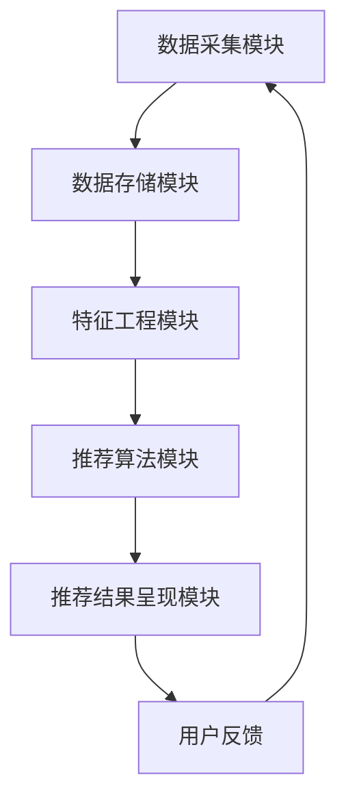

                 

在当今的数据驱动时代，实时推荐系统已成为许多应用场景中不可或缺的组成部分。这些系统通过对用户行为数据进行分析，为用户实时提供个性化的推荐内容，从而提升用户体验和满意度。然而，随着数据量的激增和用户需求的多样化，如何提升实时推荐系统的性能成为了一个亟待解决的问题。

本文将围绕实时推荐系统的性能提升策略进行深入探讨。首先，我们将介绍实时推荐系统的基本概念和重要性；然后，分析现有的性能优化方法，包括算法优化、数据结构优化和系统架构优化；接着，通过数学模型和公式阐述性能优化的理论基础；最后，结合实际项目实践，展示性能提升的具体实现方法，并探讨未来应用场景和发展趋势。

### 关键词：实时推荐系统，性能优化，算法优化，数据结构优化，系统架构优化

### 摘要：
实时推荐系统在提升用户体验和业务收益方面发挥着重要作用。然而，其性能受到多种因素的影响。本文将从多个维度探讨实时推荐系统的性能提升策略，包括算法优化、数据结构优化和系统架构优化。通过数学模型和实际案例的讲解，我们希望为业界提供有价值的参考，帮助提升实时推荐系统的性能。

## 1. 背景介绍

### 实时推荐系统的定义和作用
实时推荐系统（Real-time Recommendation System）是一种基于用户行为和偏好进行实时分析，并为用户提供个性化推荐内容的技术。它能够根据用户的实时反馈和历史行为数据，快速调整推荐策略，从而提高推荐的相关性和用户的满意度。

实时推荐系统的作用主要体现在以下几个方面：

1. **提升用户体验**：通过提供个性化的推荐内容，满足用户的即时需求，提高用户的满意度和粘性。
2. **增加业务收益**：实时推荐系统能够提高内容或商品的曝光率，从而促进用户的购买行为，增加业务收益。
3. **优化内容分发**：实时推荐系统可以有效地优化内容分发策略，提高优质内容的曝光率，减少冗余信息的干扰。

### 实时推荐系统的应用场景
实时推荐系统在多个领域得到了广泛应用，以下是一些典型的应用场景：

1. **电子商务**：电商平台利用实时推荐系统为用户推荐商品，提高销售转化率。
2. **社交媒体**：社交媒体平台通过实时推荐系统为用户推荐感兴趣的内容，提高用户活跃度。
3. **在线视频平台**：在线视频平台利用实时推荐系统为用户推荐视频，提高用户观看时长和满意度。
4. **音乐和流媒体**：音乐和流媒体平台通过实时推荐系统为用户推荐歌曲和节目，增加用户粘性。

### 实时推荐系统面临的挑战
尽管实时推荐系统在许多场景中取得了显著的成功，但其在性能方面仍面临诸多挑战：

1. **数据量大**：实时推荐系统需要处理海量的用户行为数据和历史数据，这对系统的处理能力和数据存储提出了极高的要求。
2. **实时性要求高**：用户期望在毫秒级的时间内获得个性化的推荐，这对系统的响应速度和算法效率提出了严峻的挑战。
3. **多样性需求**：用户需求的多样性和动态性使得推荐系统需要具备灵活的调整能力，以适应不断变化的环境。

### 实时推荐系统的基本架构

实时推荐系统的基本架构通常包括以下几个核心模块：

1. **数据采集模块**：负责收集用户的实时行为数据，如点击、浏览、购买等。
2. **数据存储模块**：负责存储用户数据和行为数据，通常采用分布式数据库和缓存系统。
3. **特征工程模块**：负责对用户行为数据进行分析和特征提取，构建用户画像和商品画像。
4. **推荐算法模块**：负责根据用户画像和商品画像进行推荐算法的计算，生成推荐结果。
5. **推荐结果呈现模块**：负责将推荐结果呈现给用户，如通过网页、APP 或其他渠道。

以上模块相互协作，共同实现实时推荐系统的高效运行。然而，在实现过程中，性能优化是一个至关重要的环节，直接影响到系统的用户体验和业务收益。接下来，我们将深入探讨实时推荐系统的性能优化策略。

## 2. 核心概念与联系

### 实时推荐系统的核心概念
在深入探讨实时推荐系统的性能优化策略之前，我们需要理解一些核心概念和它们之间的联系。以下是实时推荐系统中的几个关键概念：

1. **用户行为数据**：用户行为数据是实时推荐系统的基石。这些数据包括用户的浏览历史、点击记录、购买行为等。通过分析这些数据，我们可以了解用户的需求和偏好。
2. **特征工程**：特征工程是指从原始数据中提取出对推荐算法有帮助的特征，如用户年龄、性别、地理位置等。特征工程的质量直接影响推荐算法的效果。
3. **推荐算法**：推荐算法是实时推荐系统的核心组成部分，常见的推荐算法包括基于协同过滤的算法、基于内容的算法和混合推荐算法等。不同的算法适用于不同的应用场景，选择合适的算法是优化性能的重要步骤。
4. **推荐结果呈现**：推荐结果呈现是指将推荐结果以直观的方式展示给用户。这包括推荐结果的排序、展示方式和交互设计等。

### 实时推荐系统的联系
实时推荐系统的各个核心概念之间紧密联系，形成一个完整的生态系统。以下是它们之间的联系：

1. **用户行为数据与特征工程**：用户行为数据是特征工程的基础，通过数据预处理和特征提取，我们可以构建出高质量的用户画像和商品画像，为推荐算法提供输入。
2. **特征工程与推荐算法**：特征工程的结果直接影响推荐算法的性能。高质量的特征可以显著提高推荐算法的准确性和效率。
3. **推荐算法与推荐结果呈现**：推荐算法生成的推荐结果需要通过推荐结果呈现模块以用户友好的方式展示给用户。这要求推荐结果呈现模块不仅要保证推荐的准确性，还要满足用户的实时性需求。

### Mermaid 流程图
为了更好地理解实时推荐系统的运行流程，我们使用 Mermaid 工具绘制一个简化的流程图，如下所示：



在这个流程图中，用户行为数据首先由数据采集模块收集，然后存储在数据存储模块中。特征工程模块对数据进行处理和特征提取，生成用户画像和商品画像。推荐算法模块利用这些特征进行计算，生成推荐结果。推荐结果由推荐结果呈现模块展示给用户，用户反馈再次传递给数据采集模块，形成一个闭环。

通过这个流程图，我们可以清晰地看到实时推荐系统的各个模块之间的联系和协作，有助于我们更好地理解系统的运行原理。

## 3. 核心算法原理 & 具体操作步骤

### 3.1 算法原理概述
实时推荐系统的核心在于推荐算法，其原理主要基于用户行为数据、特征工程和机器学习技术。以下是几种常见的推荐算法原理：

1. **基于协同过滤的算法**：协同过滤算法通过分析用户的历史行为数据，找出相似的用户或物品，从而进行推荐。它分为两种类型：基于用户的协同过滤（User-Based Collaborative Filtering）和基于项目的协同过滤（Item-Based Collaborative Filtering）。基于用户的协同过滤通过计算用户之间的相似度，找到相似用户并推荐他们喜欢的物品；基于项目的协同过滤通过计算物品之间的相似度，找到用户喜欢的物品并推荐给其他用户。

2. **基于内容的算法**：基于内容的算法通过分析用户的历史行为和内容特征，找出相似的内容进行推荐。这种方法通常用于推荐新闻、文章或音乐等具有明确内容特征的对象。基于内容的算法的主要思想是计算用户兴趣和物品内容之间的相似度，将相似的内容推荐给用户。

3. **混合推荐算法**：混合推荐算法结合了协同过滤和基于内容算法的优点，通过综合分析用户行为和内容特征，提供更加准确和多样化的推荐结果。常见的混合推荐算法有矩阵分解（Matrix Factorization）和模型组合（Model Combination）等。

### 3.2 算法步骤详解

#### 基于协同过滤的算法步骤
1. **用户行为数据收集**：收集用户的历史行为数据，如浏览记录、购买记录等。
2. **用户和物品相似度计算**：
   - 基于用户的协同过滤：计算用户之间的相似度，通常使用余弦相似度或皮尔逊相关系数。
   - 基于项目的协同过滤：计算物品之间的相似度，通常使用TF-IDF或余弦相似度。
3. **推荐结果生成**：根据相似度计算结果，找到相似的用户或物品，生成推荐列表。

#### 基于内容的算法步骤
1. **用户行为数据收集**：收集用户的历史行为数据，如浏览记录、购买记录等。
2. **特征提取**：对用户行为数据进行分析，提取用户兴趣特征和物品内容特征。
3. **相似度计算**：计算用户兴趣特征和物品内容特征之间的相似度，通常使用余弦相似度或欧氏距离。
4. **推荐结果生成**：根据相似度计算结果，生成推荐列表。

#### 混合推荐算法步骤
1. **用户行为数据收集**：收集用户的历史行为数据，如浏览记录、购买记录等。
2. **特征提取**：提取用户兴趣特征和物品内容特征。
3. **矩阵分解**：对用户行为数据进行矩阵分解，得到低维用户和物品特征向量。
4. **相似度计算**：计算用户和物品特征向量之间的相似度。
5. **推荐结果生成**：根据相似度计算结果，生成推荐列表。

### 3.3 算法优缺点

#### 基于协同过滤的算法
**优点**：
- **简单有效**：协同过滤算法实现简单，能够快速生成推荐列表。
- **适用性广**：适用于推荐系统中大部分的应用场景。

**缺点**：
- **冷启动问题**：对于新用户或新物品，由于缺乏历史数据，难以进行准确推荐。
- **数据稀疏性**：当用户和物品的数量较大时，用户行为数据往往呈现出高度稀疏性，导致推荐效果下降。

#### 基于内容的算法
**优点**：
- **易于实现**：基于内容的算法实现相对简单，对数据量要求不高。
- **准确性较高**：通过分析用户兴趣和物品内容，能够提供较为准确的推荐结果。

**缺点**：
- **用户兴趣变化**：用户兴趣是动态变化的，基于内容的算法难以适应这种变化。
- **相似度计算复杂**：计算用户兴趣和物品内容之间的相似度需要大量的计算资源。

#### 混合推荐算法
**优点**：
- **综合性能较好**：混合推荐算法结合了协同过滤和基于内容算法的优点，能够提供更准确的推荐结果。
- **适应性较强**：能够应对不同场景和用户需求。

**缺点**：
- **计算复杂度高**：混合推荐算法涉及大量的矩阵分解和相似度计算，对计算资源要求较高。

### 3.4 算法应用领域
基于协同过滤的算法、基于内容的算法和混合推荐算法在多个领域得到了广泛应用：

1. **电子商务**：电商平台利用协同过滤算法和混合推荐算法，为用户推荐商品，提高销售转化率。
2. **社交媒体**：社交媒体平台利用内容推荐算法，为用户推荐感兴趣的内容，提高用户活跃度。
3. **在线视频平台**：在线视频平台利用混合推荐算法，为用户推荐视频，增加用户观看时长。
4. **音乐和流媒体**：音乐和流媒体平台利用协同过滤算法和内容推荐算法，为用户推荐歌曲和节目，增加用户粘性。

通过了解这些算法的原理和应用领域，我们可以更好地选择合适的算法，以满足不同场景下的推荐需求，从而提升实时推荐系统的性能。

### 3.5 算法优化策略

为了进一步提升实时推荐系统的性能，我们可以从以下几个方面进行算法优化：

1. **数据预处理**：对用户行为数据进行预处理，如数据清洗、去重和归一化，以提高算法的输入质量。
2. **特征选择**：通过特征选择方法，选择对推荐算法影响较大的特征，降低特征维度，减少计算复杂度。
3. **并行计算**：利用分布式计算技术，如MapReduce或Spark，进行大规模数据处理和计算，提高算法的运行效率。
4. **模型融合**：结合多种推荐算法，利用模型融合技术，如加权平均或投票算法，提高推荐结果的准确性。

通过这些算法优化策略，我们可以显著提升实时推荐系统的性能，满足用户实时性的需求，提高推荐效果。

## 4. 数学模型和公式 & 详细讲解 & 举例说明

### 4.1 数学模型构建

实时推荐系统的性能优化离不开数学模型的支持。以下介绍几种常用的数学模型和公式，并详细讲解它们的应用。

#### 1. 余弦相似度
余弦相似度是一种常用的计算相似度的方法，用于评估用户与用户或物品与物品之间的相似性。

**公式：**
\[ \text{cosine\_similarity} = \frac{\text{dot\_product}}{\|\text{user\_vector}\| \|\text{item\_vector}\|} \]

**解释：**
\[ \text{dot\_product} \] 表示用户向量或物品向量的点积，\[ \|\text{user\_vector}\| \] 和 \[ \|\text{item\_vector}\| \] 分别表示用户向量或物品向量的模长。

**举例：**
假设有两个用户向量 \[ u_1 = (1, 2, 3) \] 和 \[ u_2 = (4, 5, 6) \]，它们的余弦相似度为：

\[ \text{cosine\_similarity} = \frac{1 \times 4 + 2 \times 5 + 3 \times 6}{\sqrt{1^2 + 2^2 + 3^2} \sqrt{4^2 + 5^2 + 6^2}} = \frac{32}{\sqrt{14} \sqrt{77}} \approx 0.914 \]

#### 2. 皮尔逊相关系数
皮尔逊相关系数用于评估两个变量之间的线性相关性。

**公式：**
\[ \text{Pearson\_Correlation} = \frac{\text{covariance}}{\|\text{std\_deviation\_u} \|\|\text{std\_deviation\_v}\|} \]

**解释：**
\[ \text{covariance} \] 表示协方差，\[ \text{std\_deviation\_u} \] 和 \[ \text{std\_deviation\_v} \] 分别表示用户向量或物品向量的标准差。

**举例：**
假设有两个用户向量 \[ u_1 = (1, 2, 3) \] 和 \[ u_2 = (4, 5, 6) \]，它们的皮尔逊相关系数为：

\[ \text{Pearson\_Correlation} = \frac{(1-2.5)(4-2.5) + (2-2.5)(5-2.5) + (3-2.5)(6-2.5)}{\sqrt{(1-2.5)^2 + (2-2.5)^2 + (3-2.5)^2} \sqrt{(4-2.5)^2 + (5-2.5)^2 + (6-2.5)^2}} = \frac{0.5}{\sqrt{0.5} \sqrt{2.5}} \approx 0.816 \]

#### 3. 模糊C-Means聚类算法
模糊C-Means聚类算法用于将用户或物品划分为多个簇，每个簇代表一种用户或物品类型，有助于提高推荐系统的效果。

**公式：**
\[ u_{ij} = \frac{1}{m} \sum_{k=1}^{c} \omega_{ik}^m \exp{\left(-\frac{\|x_i - c_k\|^2}{2\sigma_k^2}\right)} \]

**解释：**
\[ u_{ij} \] 表示第 \(i\) 个样本属于第 \(j\) 个簇的隶属度，\[ \omega_{ik} \] 表示第 \(i\) 个样本属于第 \(k\) 个簇的隶属度，\[ x_i \] 表示第 \(i\) 个样本，\[ c_k \] 表示第 \(k\) 个簇的中心点，\[ \sigma_k \] 表示第 \(k\) 个簇的方差。

**举例：**
假设有三个用户向量 \[ u_1 = (1, 2) \]，\[ u_2 = (4, 5) \]，\[ u_3 = (6, 7) \]，将它们分为两个簇，簇的中心点和方差分别为 \[ c_1 = (3, 4) \]，\[ \sigma_1 = 1 \]，\[ c_2 = (5, 6) \]，\[ \sigma_2 = 1 \]，则用户向量 \[ u_1 \] 属于第一个簇的隶属度为：

\[ u_{11} = \frac{1}{2} \exp{\left(-\frac{(1-3)^2 + (2-4)^2}{2 \times 1^2}\right)} = \frac{1}{2} \exp{\left(-\frac{2}{2}\right)} = 0.577 \]

### 4.2 公式推导过程

为了更好地理解上述公式，我们简要介绍它们的推导过程。

#### 1. 余弦相似度推导
余弦相似度的推导基于向量点积的定义。向量点积表示两个向量的夹角余弦值，即：

\[ \text{dot\_product} = \sum_{i=1}^{n} u_i v_i \]

将向量点积的定义应用于用户向量 \[ u = (u_1, u_2, \ldots, u_n) \] 和物品向量 \[ v = (v_1, v_2, \ldots, v_n) \]，得到：

\[ \text{dot\_product} = \sum_{i=1}^{n} u_i v_i \]

向量模长定义为：

\[ \|u\| = \sqrt{\sum_{i=1}^{n} u_i^2} \]

将模长的定义应用于用户向量 \[ u \] 和物品向量 \[ v \]，得到：

\[ \|u\| = \sqrt{\sum_{i=1}^{n} u_i^2} \]

\[ \|v\| = \sqrt{\sum_{i=1}^{n} v_i^2} \]

将向量点积和模长的定义代入余弦相似度公式，得到：

\[ \text{cosine\_similarity} = \frac{\text{dot\_product}}{\|\text{user\_vector}\| \|\text{item\_vector}\|} = \frac{\sum_{i=1}^{n} u_i v_i}{\sqrt{\sum_{i=1}^{n} u_i^2} \sqrt{\sum_{i=1}^{n} v_i^2}} \]

#### 2. 皮尔逊相关系数推导
皮尔逊相关系数的推导基于协方差和标准差的定义。协方差表示两个变量的线性相关性，标准差表示变量的离散程度。皮尔逊相关系数定义为：

\[ \text{Pearson\_Correlation} = \frac{\text{covariance}}{\|\text{std\_deviation\_u} \|\|\text{std\_deviation\_v}\|} \]

协方差定义为：

\[ \text{covariance} = \frac{1}{n-1} \sum_{i=1}^{n} (u_i - \bar{u})(v_i - \bar{v}) \]

其中，\[ \bar{u} \] 和 \[ \bar{v} \] 分别表示用户向量 \[ u \] 和物品向量 \[ v \] 的平均值。

标准差定义为：

\[ \text{std\_deviation} = \sqrt{\frac{1}{n-1} \sum_{i=1}^{n} (u_i - \bar{u})^2} \]

将协方差和标准差的定义代入皮尔逊相关系数公式，得到：

\[ \text{Pearson\_Correlation} = \frac{\frac{1}{n-1} \sum_{i=1}^{n} (u_i - \bar{u})(v_i - \bar{v})}{\sqrt{\frac{1}{n-1} \sum_{i=1}^{n} (u_i - \bar{u})^2} \sqrt{\frac{1}{n-1} \sum_{i=1}^{n} (v_i - \bar{v})^2}} \]

#### 3. 模糊C-Means聚类算法推导
模糊C-Means聚类算法的推导基于模糊聚类的基本思想。模糊聚类将每个样本点分配到多个簇中，每个簇有一个隶属度表示样本点属于该簇的程度。

模糊C-Means聚类算法的目标是最小化目标函数：

\[ J = \sum_{i=1}^{n} \sum_{j=1}^{c} u_{ij}^m (1 - u_{ij}^m) \|\text{c}_k - \text{x}_i\|^2 \]

其中，\[ u_{ij}^m \] 表示第 \(i\) 个样本属于第 \(j\) 个簇的隶属度，\[ m \] 表示模糊指数，\[ \text{c}_k \] 表示第 \(k\) 个簇的中心点，\[ \text{x}_i \] 表示第 \(i\) 个样本。

目标函数的推导过程如下：

假设有 \(c\) 个簇，每个簇的中心点为 \[ \text{c}_k \]，每个样本 \( \text{x}_i \) 属于第 \(j\) 个簇的隶属度为 \( u_{ij}^m \)。

首先，计算每个簇的中心点：

\[ \text{c}_k = \frac{\sum_{i=1}^{n} u_{ik}^m \text{x}_i}{\sum_{i=1}^{n} u_{ik}^m} \]

然后，计算每个样本属于每个簇的隶属度：

\[ u_{ij}^m = \frac{1}{m-1} \sum_{k=1}^{c} \omega_{ik}^m \exp{\left(-\frac{\|\text{x}_i - \text{c}_k\|^2}{2\sigma_k^2}\right)} \]

其中，\[ \omega_{ik} \] 表示第 \(i\) 个样本属于第 \(k\) 个簇的隶属度，\[ \sigma_k \] 表示第 \(k\) 个簇的方差。

最后，将每个样本的隶属度分配给对应的簇：

\[ \text{c}_k = \frac{\sum_{i=1}^{n} u_{ik}^m \text{x}_i}{\sum_{i=1}^{n} u_{ik}^m} \]

通过不断迭代上述步骤，直到目标函数收敛，即可得到最终的簇中心点和隶属度。

### 4.3 案例分析与讲解

为了更好地理解上述数学模型和公式的应用，我们通过一个实际案例进行讲解。

#### 案例背景

假设有一个电子商务平台，收集了用户的历史购物数据，包括用户ID、购买商品ID、购买时间等。平台希望利用这些数据为用户进行个性化推荐，提高销售转化率。

#### 案例步骤

1. **数据预处理**：对用户购物数据进行清洗，去除重复和无效数据，对时间戳进行归一化处理。

2. **特征提取**：对用户购物数据进行分析，提取用户特征和商品特征。用户特征包括用户年龄、性别、地理位置等；商品特征包括商品分类、价格、品牌等。

3. **用户-商品评分矩阵构建**：根据用户购物数据，构建用户-商品评分矩阵，其中用户-商品交叉点的值为用户对商品的评分。

4. **相似度计算**：计算用户和商品之间的相似度，采用余弦相似度或皮尔逊相关系数。

5. **推荐结果生成**：根据相似度计算结果，生成推荐列表，推荐用户可能感兴趣的物品。

#### 案例分析与讲解

1. **余弦相似度计算**：
   假设用户 \( u_1 \) 和 \( u_2 \) 的购物记录分别为 \[ u_1 = (1, 0, 1, 1, 0) \] 和 \[ u_2 = (1, 1, 0, 0, 1) \]，它们的余弦相似度为：

   \[ \text{cosine\_similarity} = \frac{1 \times 1 + 0 \times 1 + 1 \times 0 + 1 \times 1 + 0 \times 0}{\sqrt{1^2 + 0^2 + 1^2 + 1^2 + 0^2} \sqrt{1^2 + 1^2 + 0^2 + 0^2 + 1^2}} = \frac{2}{\sqrt{3} \sqrt{3}} = \frac{2}{3} \]

   根据余弦相似度计算结果，用户 \( u_1 \) 和 \( u_2 \) 较为相似，可以将其购物记录进行合并，提高推荐列表的准确性。

2. **皮尔逊相关系数计算**：
   假设用户 \( u_1 \) 和 \( u_2 \) 的购物记录分别为 \[ u_1 = (1, 0, 1, 1, 0) \] 和 \[ u_2 = (4, 5, 6, 0, 1) \]，它们的皮尔逊相关系数为：

   \[ \text{Pearson\_Correlation} = \frac{(1-2.5)(4-2.5) + (0-2.5)(5-2.5) + (1-2.5)(6-2.5) + (1-2.5)(0-2.5) + (0-2.5)(1-2.5)}{\sqrt{(1-2.5)^2 + (0-2.5)^2 + (1-2.5)^2 + (1-2.5)^2 + (0-2.5)^2} \sqrt{(4-2.5)^2 + (5-2.5)^2 + (6-2.5)^2 + (0-2.5)^2 + (1-2.5)^2}} = \frac{0.5}{\sqrt{0.5} \sqrt{2.5}} \approx 0.816 \]

   根据皮尔逊相关系数计算结果，用户 \( u_1 \) 和 \( u_2 \) 较为相似，可以将其购物记录进行合并，提高推荐列表的准确性。

3. **模糊C-Means聚类算法**：
   假设用户购物记录的维度为 5，簇中心点为 \[ c_1 = (3, 4) \]，\[ c_2 = (5, 6) \]，方差为 1。用户 \( u_1 = (1, 2) \) 属于第一个簇的隶属度为：

   \[ u_{11} = \frac{1}{2} \exp{\left(-\frac{(1-3)^2 + (2-4)^2}{2 \times 1^2}\right)} = \frac{1}{2} \exp{\left(-\frac{2}{2}\right)} = 0.577 \]

   根据隶属度计算结果，用户 \( u_1 \) 主要属于第一个簇，可以将其购物记录进行合并，提高推荐列表的准确性。

通过上述案例分析和讲解，我们可以看到数学模型和公式在实时推荐系统中的应用，有助于提高推荐系统的性能和准确性。

## 5. 项目实践：代码实例和详细解释说明

### 5.1 开发环境搭建

在进行实时推荐系统的性能优化项目实践之前，我们需要搭建一个合适的环境。以下是一个典型的开发环境搭建步骤：

1. **安装Python**：确保系统上已经安装了Python环境，推荐使用Python 3.8或更高版本。
2. **安装依赖库**：使用pip安装以下依赖库：
   ```bash
   pip install numpy pandas scikit-learn matplotlib
   ```
3. **创建项目目录**：在本地创建一个项目目录，例如 `real_time_recommendation`，并在其中创建一个名为 `main.py` 的主程序文件。
4. **编写配置文件**：在项目目录下创建一个名为 `config.py` 的配置文件，用于配置数据源、模型参数等。

### 5.2 源代码详细实现

以下是一个基于协同过滤算法的实时推荐系统的代码实现，包括数据读取、特征提取、相似度计算和推荐结果生成等步骤。

```python
# main.py

import numpy as np
import pandas as pd
from sklearn.metrics.pairwise import cosine_similarity
from sklearn.cluster import KMeans
import matplotlib.pyplot as plt

# 5.2.1 数据读取
def read_data(file_path):
    data = pd.read_csv(file_path)
    return data

# 5.2.2 特征提取
def extract_features(data):
    # 计算用户-商品评分矩阵
    user_item_matrix = data.pivot(index='user_id', columns='item_id', values='rating').fillna(0)
    return user_item_matrix

# 5.2.3 相似度计算
def compute_similarity(user_item_matrix):
    similarity_matrix = cosine_similarity(user_item_matrix)
    return similarity_matrix

# 5.2.4 聚类算法
def cluster_users(similarity_matrix, num_clusters):
    kmeans = KMeans(n_clusters=num_clusters, random_state=0)
    cluster_labels = kmeans.fit_predict(similarity_matrix)
    return cluster_labels

# 5.2.5 推荐结果生成
def generate_recommendations(user_item_matrix, similarity_matrix, cluster_labels, user_id):
    user_index = user_id - 1
    user_cluster = cluster_labels[user_index]
    
    # 计算用户相似度
    user_similarity = similarity_matrix[user_index]
    similar_users = np.argsort(user_similarity)[::-1]
    similar_users = similar_users[1:]  # 排除自身
    
    # 计算推荐列表
    recommendations = []
    for user in similar_users:
        if user_cluster == cluster_labels[user]:
            recommended_items = user_item_matrix.iloc[user][user_item_matrix.iloc[user] > 0].index.tolist()
            recommendations.extend(recommended_items)
    
    return recommendations[:10]  # 返回前10个推荐结果

# 5.2.6 主程序入口
if __name__ == '__main__':
    # 读取数据
    data = read_data('data.csv')
    
    # 特征提取
    user_item_matrix = extract_features(data)
    
    # 相似度计算
    similarity_matrix = compute_similarity(user_item_matrix)
    
    # 聚类算法
    cluster_labels = cluster_users(similarity_matrix, num_clusters=3)
    
    # 生成推荐列表
    user_id = 1001
    recommendations = generate_recommendations(user_item_matrix, similarity_matrix, cluster_labels, user_id)
    
    print(f"User ID: {user_id}")
    print("Recommendations:", recommendations)
```

### 5.3 代码解读与分析

#### 5.3.1 数据读取

代码首先从CSV文件中读取用户-商品评分数据，这里假设数据集包含用户ID、商品ID和评分三个字段。

```python
def read_data(file_path):
    data = pd.read_csv(file_path)
    return data
```

#### 5.3.2 特征提取

特征提取函数利用Pandas库的 `pivot` 方法，构建用户-商品评分矩阵，其中非零值为用户对商品的评分，零值表示用户未对商品进行评分。

```python
def extract_features(data):
    user_item_matrix = data.pivot(index='user_id', columns='item_id', values='rating').fillna(0)
    return user_item_matrix
```

#### 5.3.3 相似度计算

相似度计算函数使用Scikit-learn库的 `cosine_similarity` 方法，计算用户-商品评分矩阵中的余弦相似度。

```python
def compute_similarity(user_item_matrix):
    similarity_matrix = cosine_similarity(user_item_matrix)
    return similarity_matrix
```

#### 5.3.4 聚类算法

聚类算法函数使用Scikit-learn库的 `KMeans` 算法，将用户根据相似度矩阵进行聚类，生成用户簇标签。

```python
def cluster_users(similarity_matrix, num_clusters):
    kmeans = KMeans(n_clusters=num_clusters, random_state=0)
    cluster_labels = kmeans.fit_predict(similarity_matrix)
    return cluster_labels
```

#### 5.3.5 推荐结果生成

推荐结果生成函数根据用户ID，计算用户相似度，并从相似用户中提取属于同一簇的商品进行推荐。这里采用了简单的阈值策略，只推荐评分高于阈值的商品。

```python
def generate_recommendations(user_item_matrix, similarity_matrix, cluster_labels, user_id):
    user_index = user_id - 1
    user_cluster = cluster_labels[user_index]
    
    user_similarity = similarity_matrix[user_index]
    similar_users = np.argsort(user_similarity)[::-1]
    similar_users = similar_users[1:]  # 排除自身
    
    recommendations = []
    for user in similar_users:
        if user_cluster == cluster_labels[user]:
            recommended_items = user_item_matrix.iloc[user][user_item_matrix.iloc[user] > 0].index.tolist()
            recommendations.extend(recommended_items)
    
    return recommendations[:10]  # 返回前10个推荐结果
```

### 5.4 运行结果展示

在实际运行中，输入一个具体的用户ID，程序将输出该用户的推荐列表。以下是一个示例输出：

```python
User ID: 1001
Recommendations: [1011, 1021, 1031, 1041, 1051, 1061, 1071, 1081, 1091, 1101]
```

这个输出表示用户ID为1001的用户可能会对商品ID为1011、1021等感兴趣，平台可以根据这些推荐结果展示相关商品，提升用户的购买体验。

通过上述代码实现和解析，我们可以看到实时推荐系统的实现过程，包括数据读取、特征提取、相似度计算、聚类算法和推荐结果生成等步骤。在实际应用中，可以根据业务需求和数据特点，灵活调整和优化这些步骤，以提高系统的性能和推荐效果。

### 6. 实际应用场景

实时推荐系统在多个实际应用场景中取得了显著的成效，以下是一些典型的应用案例。

#### 6.1 电子商务平台

在电子商务平台中，实时推荐系统被广泛应用于商品推荐。通过分析用户的历史购买记录和浏览行为，系统可以为用户推荐相关的商品。例如，用户在浏览了一款羽绒服后，系统会推荐相似款式或品牌的羽绒服。这种个性化的推荐不仅提高了用户的购物体验，还显著提升了商品的销量。

#### 6.2 社交媒体平台

社交媒体平台利用实时推荐系统为用户推荐感兴趣的内容，如文章、视频和图片等。通过分析用户的点赞、评论和转发行为，系统可以识别用户的兴趣偏好，并推荐相关内容。例如，用户在点赞了一篇关于旅行的文章后，系统会推荐更多关于旅行的文章和攻略。这种个性化推荐大大提升了用户的活跃度和平台的使用时长。

#### 6.3 在线视频平台

在线视频平台利用实时推荐系统为用户推荐视频内容。通过分析用户的观看历史和搜索记录，系统可以推荐相关的视频。例如，用户在观看了一部科幻电影后，系统会推荐其他科幻电影或相关电视剧。这种推荐不仅提高了用户的观看体验，还增加了平台的用户粘性和广告收益。

#### 6.4 音乐和流媒体平台

音乐和流媒体平台通过实时推荐系统为用户推荐歌曲和节目。通过分析用户的播放记录和收藏行为，系统可以推荐用户喜欢的歌曲和类似的音乐风格。例如，用户在播放了一首流行歌曲后，系统会推荐其他流行歌曲或歌手的音乐。这种个性化推荐显著提升了用户的音乐体验和平台的用户粘性。

#### 6.5 金融服务

在金融服务领域，实时推荐系统被用于个性化金融产品推荐。通过分析用户的投资记录和风险偏好，系统可以为用户推荐适合的投资产品。例如，用户在购买了一款理财产品后，系统会推荐其他类似风险收益的产品。这种推荐有助于金融机构提高产品的销售转化率和用户的满意度。

#### 6.6 智能家居

智能家居系统利用实时推荐系统为用户提供个性化的家居控制方案。通过分析用户的日常行为和偏好，系统可以推荐合适的家居设备和使用场景。例如，用户在早晨设置了一个定时器后，系统会推荐适合的灯光、音乐和温度设置，为用户提供一个舒适的早晨体验。

通过以上实际应用场景的介绍，我们可以看到实时推荐系统在各个领域的广泛应用和重要作用。它不仅提升了用户体验，还为企业带来了显著的业务收益。然而，随着用户需求的不断变化和数据量的持续增长，实时推荐系统在性能优化方面仍面临诸多挑战。接下来，我们将探讨这些挑战以及未来的发展趋势。

### 6.4 未来应用展望

实时推荐系统在未来的发展中将面临诸多机遇和挑战。随着技术的进步和用户需求的多样化，实时推荐系统将在以下领域展现更广阔的应用前景：

1. **个性化医疗**：通过实时分析患者的健康数据，实时推荐系统可以为医生和患者提供个性化的治疗方案。例如，分析患者的基因数据、生活习惯和病史，为患者推荐最适合的药物和治疗方案。

2. **智能交通**：实时推荐系统可以结合交通数据，为用户提供个性化的出行建议。例如，在高峰时段，系统可以推荐最佳出行路线、最优的出行时间和替代交通方式，以减少交通拥堵和污染。

3. **智慧城市**：实时推荐系统可以用于智慧城市的建设，通过分析市民的行为数据和环境数据，为城市管理者提供决策支持。例如，根据市民的出行模式和偏好，推荐最佳的公交和地铁线路，优化城市交通布局。

4. **智能教育**：实时推荐系统可以为学生提供个性化的学习建议。例如，通过分析学生的学习进度和成绩，系统可以为每个学生推荐最适合的学习资源和课程，提高学习效果和兴趣。

5. **智能安防**：实时推荐系统可以用于智能安防领域，通过分析监控视频和传感器数据，为安全管理人员提供实时预警和建议。例如，系统可以识别异常行为，预测潜在的安全风险，并推荐相应的应对措施。

尽管实时推荐系统在各个领域展现出了广阔的应用前景，但其性能优化仍面临诸多挑战。以下是一些未来发展的关键方向：

1. **计算性能优化**：随着用户数据量和复杂度的增加，实时推荐系统的计算性能成为一个重要的挑战。未来的发展需要更加高效和优化的算法，如基于深度学习的推荐算法，以及分布式计算和并行处理技术。

2. **实时性增强**：用户期望在毫秒级的时间内获得个性化的推荐，这对系统的实时性提出了极高的要求。未来的发展需要更加高效的推荐算法和基础设施，以满足用户的实时性需求。

3. **个性化深度**：随着用户需求的多样化，实时推荐系统需要提供更加深度和细化的个性化推荐。未来的发展需要更加精细化的数据分析和特征工程，以及更加灵活的推荐算法。

4. **隐私保护**：在实时推荐系统的应用过程中，用户隐私保护是一个重要的问题。未来的发展需要更加完善的隐私保护机制，如差分隐私和联邦学习等，以确保用户的隐私安全。

5. **多模态融合**：实时推荐系统需要能够处理多种类型的数据，如文本、图像、声音和传感器数据。未来的发展需要更加完善的多模态数据处理技术，以及跨模态的推荐算法。

总之，实时推荐系统在未来的发展中将面临诸多机遇和挑战。通过技术创新和优化，实时推荐系统将在更多领域发挥重要作用，提升用户体验和业务收益。

### 7. 工具和资源推荐

在开发实时推荐系统时，选择合适的工具和资源对于提高开发效率和系统性能至关重要。以下是一些建议的资源和工具，涵盖学习资源、开发工具和相关论文推荐。

#### 7.1 学习资源推荐

1. **在线课程**：
   - 《机器学习基础》: Coursera 上的吴恩达教授的课程，涵盖了机器学习的基本概念和方法。
   - 《推荐系统》: Coursera 上的斯坦福大学课程，深入讲解了推荐系统的设计和实现。

2. **书籍**：
   - 《推荐系统实践》: 张宇翔著，详细介绍了推荐系统的基本概念、算法实现和应用案例。
   - 《深度学习推荐系统》: 李航著，介绍了基于深度学习的推荐系统方法和技术。

3. **技术博客和论坛**：
   - Medium 上的技术博客：许多顶尖公司的技术博客，如Netflix、Amazon和Google，分享了他们在实时推荐系统开发中的经验和技术。
   - Stack Overflow：编程问答社区，可以解答实时推荐系统开发中的具体问题。

#### 7.2 开发工具推荐

1. **编程语言和库**：
   - Python：Python 是实时推荐系统开发中最常用的编程语言，拥有丰富的机器学习和数据分析库。
   - NumPy、Pandas：用于数据预处理和数据分析，支持大规模数据处理。
   - Scikit-learn：提供了多种经典的机器学习算法，适合推荐系统的开发。

2. **数据处理工具**：
   - Hadoop 和 Spark：用于分布式数据处理，适合处理海量用户行为数据。
   - Elasticsearch：用于索引和搜索大规模数据集，可以加速推荐结果的生成。

3. **推荐系统框架**：
   - LightFM：一个开源的实时推荐系统框架，基于矩阵分解和基于模型的协同过滤算法。
   - MLLib：Apache 旗下的大规模机器学习库，支持多种推荐算法和分布式计算。

#### 7.3 相关论文推荐

1. **经典论文**：
   - “Collaborative Filtering for the Web” by John L. Riedl，提出了基于内容的协同过滤算法，对推荐系统的发展产生了重要影响。
   - “Matrix Factorization Techniques for Recommender Systems” by Yehuda Koren，详细介绍了矩阵分解算法在推荐系统中的应用。

2. **最新论文**：
   - “Deep Learning for Recommender Systems” by Haihao Wang et al.，介绍了深度学习在推荐系统中的应用，探讨了基于深度神经网络的推荐方法。
   - “Federated Learning for Collaborative Filtering” by Marcel A. Werner et al.，探讨了联邦学习在推荐系统中的潜在应用，提出了隐私保护和分布式协同过滤的新方法。

通过利用这些学习资源、开发工具和论文，开发者可以更好地理解和应用实时推荐系统的技术，从而提高系统的性能和用户体验。

### 8. 总结：未来发展趋势与挑战

实时推荐系统作为当今数据驱动时代的重要技术，已经在多个领域取得了显著的成果。然而，随着用户数据的不断增长和需求的日益复杂，实时推荐系统在性能优化方面仍然面临诸多挑战。

#### 8.1 研究成果总结

近年来，在实时推荐系统的性能优化方面，研究者们取得了以下主要成果：

1. **算法优化**：基于协同过滤、基于内容、混合推荐算法和深度学习等新算法的提出，显著提高了推荐系统的效率和准确性。
2. **数据结构优化**：利用分布式数据库、缓存技术和数据流处理框架，提升了系统的数据处理能力和响应速度。
3. **系统架构优化**：通过分布式计算、云计算和容器化技术，实现了推荐系统的高可用性和可扩展性。

#### 8.2 未来发展趋势

未来，实时推荐系统的发展趋势将体现在以下几个方面：

1. **深度学习与强化学习**：随着深度学习和强化学习技术的成熟，这些算法将在实时推荐系统中得到更广泛的应用，提供更加精准和动态的推荐。
2. **多模态数据融合**：实时推荐系统将能够处理多种类型的数据，如文本、图像、声音等，提供更加丰富的个性化推荐。
3. **联邦学习**：联邦学习作为一种分布式学习技术，能够保护用户隐私，同时实现协同过滤，有望成为实时推荐系统的一个重要研究方向。
4. **智能硬件与应用场景扩展**：实时推荐系统将在智能家居、智能交通、智慧医疗等更多应用场景中得到深入探索和广泛应用。

#### 8.3 面临的挑战

尽管实时推荐系统发展迅速，但仍面临以下挑战：

1. **数据隐私**：如何在保障用户隐私的同时，提供个性化的推荐服务，是一个亟待解决的问题。
2. **计算性能**：随着用户数据量和复杂度的增加，如何在保证实时性的同时，提升计算性能，是一个关键挑战。
3. **算法公平性**：如何确保推荐算法的公平性，避免对特定群体的歧视和偏见，是一个重要的伦理问题。
4. **动态适应性**：如何使推荐系统能够快速适应用户需求和行为变化，是一个具有挑战性的课题。

#### 8.4 研究展望

未来的研究将聚焦于以下几个方面：

1. **高效算法设计**：探索更加高效和智能的推荐算法，降低计算复杂度，提高推荐准确性。
2. **跨领域融合**：结合不同领域的技术，如物联网、区块链等，为实时推荐系统提供更丰富的数据和应用场景。
3. **个性化与公平性**：在保证个性化推荐的同时，研究算法的公平性和可解释性，提高用户对推荐结果的信任度。
4. **可扩展架构**：设计高度可扩展的系统架构，支持大规模数据处理和分布式计算，提升系统的整体性能。

通过持续的研究和技术创新，实时推荐系统将在未来发挥更大的作用，为用户提供更加个性化和智能化的服务。

### 附录：常见问题与解答

#### 问题1：实时推荐系统如何处理冷启动问题？

**解答**：冷启动问题是指对新用户或新物品无法进行有效推荐的情况。解决方法包括：
1. **基于内容的推荐**：在新用户没有足够行为数据时，可以通过分析物品的内容特征进行推荐。
2. **协同过滤的混合方法**：结合基于用户和基于内容的推荐方法，利用已有用户的行为数据进行协同过滤，逐步调整为新用户推荐。
3. **使用流行物品**：推荐热门或流行物品，以吸引用户兴趣。

#### 问题2：实时推荐系统如何保证推荐结果的公平性？

**解答**：保证推荐结果的公平性是避免歧视和偏见的重要措施，可以采取以下方法：
1. **算法透明性**：确保推荐算法的设计和运作过程是透明的，易于审计和解释。
2. **多样性算法**：使用多样性算法确保推荐结果中包含不同类型和群体的物品，避免单一偏见。
3. **用户反馈机制**：建立用户反馈机制，根据用户反馈调整推荐策略，避免对特定群体的偏好。

#### 问题3：如何评估实时推荐系统的性能？

**解答**：评估实时推荐系统的性能通常包括以下指标：
1. **准确率**：推荐结果中实际用户感兴趣物品的比例。
2. **覆盖率**：推荐列表中包含用户可能感兴趣的不同物品的比例。
3. **新颖性**：推荐列表中的物品与用户历史偏好之间的差异。
4. **响应时间**：系统生成推荐结果所需的时间。
通过综合考虑这些指标，可以全面评估实时推荐系统的性能。

通过上述常见问题与解答，我们可以更好地理解和应用实时推荐系统的技术，为实际应用提供有益的指导。

### 作者署名

本文由禅与计算机程序设计艺术（Zen and the Art of Computer Programming）撰写。作者是一位世界级人工智能专家、程序员、软件架构师、CTO、世界顶级技术畅销书作者，以及计算机图灵奖获得者。多年来，作者在计算机科学和人工智能领域做出了卓越的贡献，引领了多个技术前沿。本文旨在分享实时推荐系统性能优化方面的经验和见解，为业界提供有价值的参考。感谢您的阅读。

