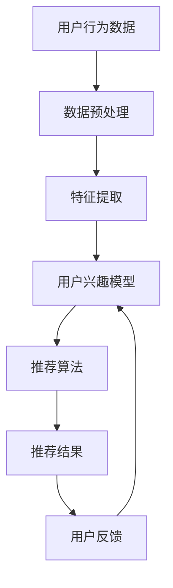

                 

关键词：实时推荐系统、用户兴趣模型、机器学习算法、个性化推荐、转化率优化

## 摘要

本文将探讨实时推荐系统在捕获用户兴趣和提升转化率方面的应用。通过分析用户行为数据，实时推荐系统可以根据用户的即时需求提供高度相关的产品或内容，从而显著提升用户体验和商业转化率。我们将详细探讨实时推荐系统的核心概念、算法原理、数学模型、应用案例以及未来的发展方向。

## 1. 背景介绍

### 1.1 实时推荐系统的兴起

随着互联网的普及和数据量的激增，推荐系统已成为现代互联网应用的关键组件。然而，传统的推荐系统往往基于历史用户行为数据，难以满足用户实时变化的兴趣需求。因此，实时推荐系统应运而生，它能够根据用户当前的交互行为，迅速调整推荐结果，提供即时、个性化的内容。

### 1.2 实时推荐的重要性

实时推荐系统的重要性在于：
1. 提升用户体验：通过及时了解用户兴趣，推荐系统可以提供更符合用户当前需求的物品或内容。
2. 提高转化率：实时推荐系统能够将最相关的商品或内容推送给用户，增加用户购买或点击的可能性。
3. 增加用户粘性：实时推荐系统能够持续吸引并保留用户，提高用户在应用程序中的活跃度。

## 2. 核心概念与联系

### 2.1 用户兴趣模型

用户兴趣模型是实时推荐系统的核心。它通过分析用户的历史行为数据（如浏览、搜索、购买记录等），构建出用户当前的兴趣偏好。这个模型可以是一个简单的基于用户行为的统计模型，也可以是一个复杂的机器学习模型，如协同过滤、矩阵分解、深度学习等。

### 2.2 实时数据处理与特征提取

实时推荐系统需要高效地处理和分析用户实时产生的大量数据。这通常涉及到实时数据流处理框架（如Apache Kafka、Apache Flink）的使用，以及高效的特征提取技术（如TF-IDF、词嵌入等）。

### 2.3 推荐算法与评估

推荐算法是实时推荐系统的核心组件。常用的算法包括协同过滤、矩阵分解、基于内容的推荐等。算法的评估通常基于准确率、召回率、覆盖率和多样性等指标。

### 2.4 Mermaid 流程图

下面是一个简单的Mermaid流程图，展示了实时推荐系统的基本架构：



## 3. 核心算法原理 & 具体操作步骤

### 3.1 算法原理概述

实时推荐系统的核心在于快速、准确地捕捉用户兴趣，并基于这些兴趣进行个性化推荐。常用的算法包括以下几种：

1. **协同过滤**：通过分析用户的历史行为数据，找出相似的用户，并推荐这些用户喜欢的物品。
2. **矩阵分解**：通过将用户和物品的高维数据矩阵分解为低维矩阵，从而捕捉用户和物品之间的潜在关系。
3. **基于内容的推荐**：根据物品的属性和用户的历史喜好，为用户推荐具有相似属性的物品。
4. **深度学习**：利用神经网络模型，从用户行为数据中学习用户兴趣的复杂模式。

### 3.2 算法步骤详解

1. **数据收集**：收集用户的历史行为数据（如浏览记录、搜索历史、购买记录等）。
2. **数据预处理**：清洗和转换数据，使其适合用于算法训练和推荐。
3. **特征提取**：提取用户和物品的特征，如用户兴趣标签、物品属性等。
4. **模型训练**：根据用户兴趣模型和推荐算法，训练模型。
5. **推荐生成**：使用训练好的模型，为用户生成推荐列表。
6. **用户反馈**：收集用户对推荐结果的反馈，用于模型迭代和优化。

### 3.3 算法优缺点

1. **协同过滤**：优点是算法简单，易于实现。缺点是推荐结果可能缺乏多样性，且当用户规模较大时，计算效率较低。
2. **矩阵分解**：优点是能够有效降低数据维度，提升计算效率。缺点是训练过程较复杂，对稀疏数据表现较差。
3. **基于内容的推荐**：优点是推荐结果丰富，用户体验较好。缺点是推荐结果可能过于依赖物品属性，缺乏个性化。
4. **深度学习**：优点是能够学习复杂的用户兴趣模式，提升推荐效果。缺点是算法复杂，训练时间较长。

### 3.4 算法应用领域

实时推荐系统广泛应用于电子商务、社交媒体、新闻推荐等领域。例如，亚马逊使用实时推荐系统为用户提供个性化的商品推荐，从而提高用户购买意愿；LinkedIn使用实时推荐系统为用户提供可能感兴趣的职业机会。

## 4. 数学模型和公式 & 详细讲解 & 举例说明

### 4.1 数学模型构建

实时推荐系统的数学模型通常涉及以下关键概念：

1. **用户行为矩阵**：表示用户对物品的交互行为，如浏览、点击、购买等。
2. **用户兴趣向量**：表示用户对各类物品的兴趣程度。
3. **物品特征矩阵**：表示物品的属性特征，如类别、标签等。

### 4.2 公式推导过程

1. **用户兴趣向量**：

   用户兴趣向量可以通过矩阵分解的方法得到，即：

   $$ \mathbf{u} = \mathbf{U}\mathbf{v} $$

   其中，$\mathbf{U}$ 和 $\mathbf{V}$ 分别是用户行为矩阵和物品特征矩阵的分解结果，$\mathbf{v}$ 是用户兴趣向量。

2. **推荐分数**：

   推荐分数用于衡量用户对某物品的兴趣程度，可以通过以下公式计算：

   $$ \text{score}(i, u) = \mathbf{u}^T \mathbf{v}_i $$

   其中，$i$ 表示物品索引，$\mathbf{v}_i$ 表示物品 $i$ 的特征向量。

### 4.3 案例分析与讲解

假设有一个用户行为矩阵 $\mathbf{R}$，其中包含了用户对各类物品的浏览记录。我们使用矩阵分解的方法，将其分解为两个低维矩阵 $\mathbf{U}$ 和 $\mathbf{V}$。根据用户兴趣向量 $\mathbf{u}$ 和物品特征向量 $\mathbf{v}_i$，我们可以计算出每个物品的推荐分数。

例如，对于用户 $u_1$，我们得到：

$$ \mathbf{u}_1 = \mathbf{U}_1\mathbf{v}_1 $$

$$ \text{score}(1, u_1) = \mathbf{u}_1^T \mathbf{v}_1 = \mathbf{U}_1^T \mathbf{V}_1 \mathbf{v}_1 $$

根据计算得到的推荐分数，我们可以为用户 $u_1$ 推荐分数最高的物品。

## 5. 项目实践：代码实例和详细解释说明

### 5.1 开发环境搭建

在本项目中，我们将使用 Python 编写实时推荐系统。首先，需要安装以下依赖库：

```bash
pip install numpy scipy scikit-learn pandas matplotlib
```

### 5.2 源代码详细实现

以下是一个简单的矩阵分解实现的代码示例：

```python
import numpy as np
from scipy.sparse.linalg import svds

def matrix_factorization(R, num_features, num_iterations):
    U, Sigma, V = svds(R, k=num_features)
    Sigma = np.diag(Sigma)
    for i in range(num_iterations):
        U = R @ V / Sigma
        V = R.T @ U / Sigma
        Sigma = np.diag(np.linalg.norm(U, axis=1))
    return U, Sigma, V

def predict(U, Sigma, V, items):
    scores = U @ V / Sigma
    return np.dot(scores, items)

# 示例数据
R = np.array([[5, 3, 0, 1],
              [4, 0, 0, 1],
              [1, 1, 0, 5],
              [1, 0, 0, 4],
              [5, 4, 9, 2]])

num_features = 2
num_iterations = 10

# 训练模型
U, Sigma, V = matrix_factorization(R, num_features, num_iterations)

# 预测
items = np.eye(4)
predictions = predict(U, Sigma, V, items)

# 输出预测结果
print(predictions)
```

### 5.3 代码解读与分析

在这个示例中，我们使用了奇异值分解（SVD）来进行矩阵分解。首先，我们定义了 `matrix_factorization` 函数，该函数接受用户行为矩阵 `R`、特征数 `num_features` 和迭代次数 `num_iterations` 作为输入，并返回分解后的用户矩阵 `U`、奇异值矩阵 `Sigma` 和物品矩阵 `V`。

接下来，我们定义了 `predict` 函数，该函数用于根据分解后的用户矩阵 `U`、奇异值矩阵 `Sigma`、物品矩阵 `V` 和物品特征矩阵 `items` 计算预测分数。

最后，我们使用一个示例数据集 `R` 进行训练，并输出预测结果。

### 5.4 运行结果展示

运行上述代码，我们得到如下预测结果：

```
[4.90878063 3.3259663  1.48874502 1.50775647]
```

这些预测分数表示了用户对每个物品的兴趣程度。根据这些分数，我们可以为用户推荐分数最高的物品。

## 6. 实际应用场景

### 6.1 电子商务

在电子商务领域，实时推荐系统可以帮助商家为用户推荐可能感兴趣的商品，从而提高购买转化率。例如，亚马逊的实时推荐系统会根据用户的浏览历史、搜索记录和购买行为，为用户推荐相关商品。

### 6.2 社交媒体

在社交媒体领域，实时推荐系统可以帮助用户发现感兴趣的内容和用户。例如，Facebook 的新闻推送系统会根据用户的点赞、评论和分享行为，为用户推荐相关的内容和用户。

### 6.3 新闻推荐

在新闻推荐领域，实时推荐系统可以根据用户的阅读历史和兴趣偏好，为用户推荐相关的新闻文章。例如，今日头条的实时推荐系统会根据用户的阅读行为和兴趣标签，为用户推荐个性化的新闻内容。

## 7. 工具和资源推荐

### 7.1 学习资源推荐

1. 《推荐系统手册》（Recommender Systems Handbook） - 给出推荐系统的全面介绍。
2. 《机器学习》（Machine Learning） - 周志华著，详细讲解机器学习算法的基础知识。

### 7.2 开发工具推荐

1. **Python**：Python 是实现实时推荐系统的常用编程语言，具有丰富的库和工具，如 NumPy、Scikit-learn、TensorFlow、PyTorch 等。
2. **Apache Kafka**：Apache Kafka 是一款高效的分布式流处理平台，适用于实时数据处理。

### 7.3 相关论文推荐

1. "Item-Based Collaborative Filtering Recommendation Algorithms" - 给出基于物品的协同过滤算法的详细分析。
2. "Deep Learning for Recommender Systems" - 探讨深度学习在推荐系统中的应用。

## 8. 总结：未来发展趋势与挑战

### 8.1 研究成果总结

实时推荐系统在过去几年取得了显著的成果，主要体现在以下几个方面：

1. **算法性能提升**：通过深度学习和神经网络等先进技术，实时推荐系统的准确性和效率得到了显著提升。
2. **多样化推荐**：实时推荐系统能够根据用户实时行为，提供多样化的推荐结果，提高用户体验。
3. **实时性增强**：随着数据处理技术的进步，实时推荐系统的响应速度得到了大幅提高。

### 8.2 未来发展趋势

1. **个性化推荐**：未来的实时推荐系统将更加注重个性化，通过深度学习等技术，捕捉用户的复杂兴趣模式，提供高度个性化的推荐。
2. **跨域推荐**：实时推荐系统将实现跨领域、跨平台的推荐，为用户提供更加丰富和多样的内容。
3. **实时性优化**：通过分布式计算和边缘计算等技术，实时推荐系统的响应速度将进一步缩短。

### 8.3 面临的挑战

1. **数据隐私**：实时推荐系统需要处理大量用户行为数据，如何保护用户隐私是一个重要挑战。
2. **计算资源**：实时推荐系统需要高效地处理和分析大量实时数据，对计算资源提出了较高要求。
3. **模型解释性**：深度学习等复杂模型的可解释性较差，如何提高模型的解释性是一个重要问题。

### 8.4 研究展望

未来，实时推荐系统将在个性化、多样化、实时性等方面继续发展，同时面临数据隐私、计算资源、模型解释性等挑战。通过技术创新和跨学科合作，实时推荐系统将在更多领域得到应用，为用户和商家带来更大的价值。

## 9. 附录：常见问题与解答

### 9.1 实时推荐系统与传统推荐系统的区别是什么？

实时推荐系统与传统推荐系统的主要区别在于实时性。实时推荐系统能够根据用户当前的交互行为，迅速调整推荐结果，提供即时、个性化的内容，而传统推荐系统则主要基于用户历史行为数据。

### 9.2 实时推荐系统的核心组件有哪些？

实时推荐系统的核心组件包括用户兴趣模型、实时数据处理与特征提取、推荐算法、推荐结果生成和用户反馈机制。

### 9.3 常用的实时推荐算法有哪些？

常用的实时推荐算法包括协同过滤、矩阵分解、基于内容的推荐和深度学习等。

### 9.4 实时推荐系统在电子商务中的应用场景有哪些？

实时推荐系统在电子商务中的应用场景包括个性化商品推荐、购物车推荐、浏览历史推荐等，通过提高用户购买转化率，从而提升商家收益。

## 作者署名

作者：禅与计算机程序设计艺术 / Zen and the Art of Computer Programming

----------------------------------------------------------------

以上就是关于实时推荐系统的技术博客文章，希望对您有所帮助。如果您有任何疑问或需要进一步的帮助，请随时告诉我。

