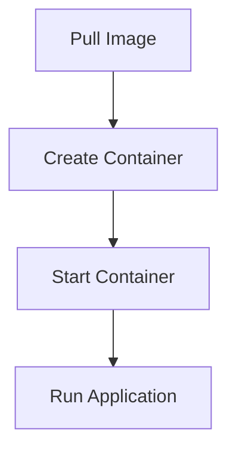

                 

关键词：容器、Docker、容器化、虚拟化、Linux命名空间、Cgroups、网络命名空间、容器编排、容器镜像、容器运行时

> 摘要：本文将深入探讨容器技术的基本原理，包括容器的工作机制、核心概念、以及如何通过具体的代码实例来理解和应用容器技术。本文旨在为读者提供一个全面的技术指南，帮助他们掌握容器技术，并在实际项目中应用。

## 1. 背景介绍

容器技术的崛起标志着现代软件开发模式的一次革命。传统的虚拟化技术虽然可以隔离操作系统，但它们通常需要较多的资源，且启动速度较慢。相比之下，容器提供了一种更轻量、高效的解决方案。容器允许开发人员在几乎任何地方运行应用程序，只要有一个支持容器的环境，这一点使得容器在微服务架构、持续集成和持续部署（CI/CD）等领域得到了广泛应用。

容器技术起源于Linux内核的命名空间（Namespace）和Cgroups（控制组）等特性。通过使用这些特性，容器可以创建一个隔离的运行环境，使得应用程序看起来像是运行在自己的操作系统中。这种隔离性确保了不同的应用程序不会互相干扰，从而提高了系统的稳定性和安全性。

本文将首先介绍容器的基础概念，然后深入探讨Docker容器的工作原理，并通过代码实例展示如何构建、运行和编排容器。

## 2. 核心概念与联系

### 2.1. 容器与虚拟机的区别

容器与传统的虚拟机（VM）在隔离性上有相似之处，但它们在资源消耗和性能上有显著差异。虚拟机通过完全模拟一个独立的操作系统来提供隔离，而容器则通过共享宿主机的操作系统内核来提供隔离。这种差异导致了容器在启动速度和资源占用上的优势。

| 特性 | 容器 | 虚拟机 |
| --- | --- | --- |
| 启动速度 | 快 | 慢 |
| 资源占用 | 少 | 多 |
| 隔离性 | 高 | 高 |
| 可移植性 | 高 | 中 |

### 2.2. 容器的核心概念

- **容器镜像（Container Image）**：容器镜像是一个静态的文件系统，包含了运行容器所需的全部内容，如应用程序、库、环境变量等。容器镜像通常基于基础镜像，如`ubuntu`或`centos`。
- **容器运行时（Container Runtime）**：容器运行时负责从容器镜像创建和运行容器。常见的容器运行时有`runc`、`docker-containerd`等。
- **容器编排（Container Orchestration）**：容器编排工具如Kubernetes，负责管理容器的生命周期，包括部署、扩展、更新等。

### 2.3. Mermaid 流程图

下面是一个简单的Mermaid流程图，展示了容器从镜像创建到运行的过程。



## 3. 核心算法原理 & 具体操作步骤

### 3.1 算法原理概述

容器技术依赖于以下核心概念和机制：

- **Linux命名空间（Namespace）**：命名空间用于隔离进程的视图，包括进程、文件系统、网络等。
- **Cgroups（Control Groups）**：Cgroups用于限制和控制进程的资源使用，如CPU、内存、磁盘IO等。
- **容器镜像与容器运行时**：容器镜像定义了容器的文件系统，容器运行时负责从镜像创建和运行容器。

### 3.2 算法步骤详解

1. **拉取容器镜像**：使用Docker或其他容器运行时从远程仓库拉取所需的容器镜像。
   ```shell
   docker pull ubuntu:latest
   ```

2. **创建容器**：使用容器运行时创建一个新的容器，这个容器将基于刚才拉取的镜像。
   ```shell
   docker run --name my-container -itd ubuntu:latest
   ```

3. **启动容器**：启动容器，使其开始运行。
   ```shell
   docker start my-container
   ```

4. **运行应用**：在容器中运行应用程序，这个应用将运行在隔离的环境中。
   ```shell
   docker exec -it my-container /bin/bash
   ```

### 3.3 算法优缺点

**优点**：

- **轻量级**：容器共享宿主机的操作系统内核，不需要额外的资源。
- **快速启动**：容器启动速度远快于虚拟机。
- **高可移植性**：容器可以在任何支持容器运行时的环境中运行。

**缺点**：

- **依赖宿主机内核**：容器技术依赖于Linux内核的特性，如命名空间和Cgroups。
- **安全性**：虽然容器提供了隔离性，但并不意味着绝对安全。

### 3.4 算法应用领域

容器技术广泛应用于以下几个方面：

- **微服务架构**：容器可以帮助实现服务的隔离，提高系统的可伸缩性。
- **持续集成与持续部署（CI/CD）**：容器可以快速部署和测试应用程序。
- **云计算**：容器化技术是云计算平台（如AWS、Google Cloud、Azure）的核心组成部分。

## 4. 数学模型和公式 & 详细讲解 & 举例说明

### 4.1 数学模型构建

容器技术中涉及的数学模型主要包括资源分配模型和调度模型。以下是一个简化的资源分配模型：

$$
C_{total} = C_{container} + C_{kernel}
$$

其中，$C_{total}$是宿主机总的计算资源，$C_{container}$是容器的计算资源，$C_{kernel}$是操作系统内核的计算资源。

### 4.2 公式推导过程

容器的计算资源需求可以通过以下公式计算：

$$
C_{container} = f(C_{CPU}, C_{MEM}, C_{DISK}, C_{NET})
$$

其中，$C_{CPU}$、$C_{MEM}$、$C_{DISK}$、$C_{NET}$分别是容器的CPU、内存、磁盘IO和网络带宽需求。

### 4.3 案例分析与讲解

假设一个容器需要1个CPU核心、2GB内存、10GB磁盘空间和1Mbps的网络带宽。根据上述公式，我们可以计算出：

$$
C_{container} = f(1, 2, 10, 1) = 1 + 2 + 10 + 1 = 14
$$

因此，该容器的总计算资源需求为14。

## 5. 项目实践：代码实例和详细解释说明

### 5.1 开发环境搭建

在开始之前，请确保您的系统中安装了Docker。如果没有，请通过以下命令安装：

```shell
# 使用Ubuntu系统安装Docker
sudo apt-get update
sudo apt-get install docker.io
```

### 5.2 源代码详细实现

以下是一个简单的Dockerfile，用于构建一个简单的Web服务器容器。

```Dockerfile
# 使用官方的Ubuntu基础镜像
FROM ubuntu:latest

# 设置环境变量
ENV HTTPD_ROOT=/var/www/html
ENV HTTPD_PORT=80

# 安装Apache Web服务器
RUN apt-get update && apt-get install -y apache2

# 配置Apache服务
COPY ./httpd.conf ${HTTPD_ROOT}/conf/httpd.conf
COPY ./index.html ${HTTPD_ROOT}/index.html

# 启动Apache服务
EXPOSE ${HTTPD_PORT}
CMD ["httpd", "-D", "FOREGROUND"]

# 设置容器启动时的用户
USER apache
```

### 5.3 代码解读与分析

- **FROM**：指定基础镜像为`ubuntu:latest`。
- **ENV**：设置环境变量，包括Web服务器的根目录和端口号。
- **RUN**：执行安装Apache Web服务器的命令。
- **COPY**：复制本地文件到容器的文件系统中。
- **EXPOSE**：暴露容器的端口号。
- **CMD**：指定容器启动时运行的命令。
- **USER**：设置容器启动时的用户。

### 5.4 运行结果展示

1. **构建容器镜像**：

   ```shell
   docker build -t my-web-server .
   ```

2. **运行容器**：

   ```shell
   docker run -d -p 8080:80 my-web-server
   ```

3. **访问Web服务**：

   打开浏览器，输入`http://localhost:8080`，应看到Apache默认的Web页面。

## 6. 实际应用场景

容器技术已经在多个领域得到了广泛应用，以下是一些典型的应用场景：

- **微服务架构**：通过容器化，各个微服务可以独立部署和扩展。
- **持续集成与持续部署（CI/CD）**：容器化可以帮助快速构建、测试和部署应用程序。
- **云计算**：容器化技术是云计算平台的核心组成部分，提供了高效的资源利用。

### 6.4 未来应用展望

随着技术的不断进步，容器技术在以下几个方面有着广阔的发展前景：

- **容器安全**：加强对容器安全的防护，包括容器镜像的签名和验证。
- **容器网络**：改进容器网络性能，支持更复杂的网络拓扑。
- **容器编排**：提高容器编排工具的智能化水平，自动化管理容器生命周期。

## 7. 工具和资源推荐

### 7.1 学习资源推荐

- 《Docker Deep Dive》：一本深度探讨Docker技术和原理的书籍。
- 《Kubernetes Up & Running》：一本介绍Kubernetes容器编排工具的实践指南。

### 7.2 开发工具推荐

- Docker Desktop：适用于Windows和macOS的Docker开发工具。
- Kubernetes CLI：用于管理和操作Kubernetes集群的命令行工具。

### 7.3 相关论文推荐

- "Linux Containers: Security and Performance"：探讨容器安全性和性能的论文。
- "The Design and Implementation of the FreeBSD Jails System"：关于BSD Jails系统的设计与实现。

## 8. 总结：未来发展趋势与挑战

容器技术在过去几年中取得了显著的发展，但同时也面临着一些挑战。未来，容器技术将在以下几个方面继续发展：

- **安全性**：加强对容器安全的防护，包括容器镜像的签名和验证。
- **性能优化**：改进容器网络性能，支持更复杂的网络拓扑。
- **智能化**：提高容器编排工具的智能化水平，自动化管理容器生命周期。

面对这些挑战，研究人员和开发者需要不断探索新的解决方案，推动容器技术的进步。

## 9. 附录：常见问题与解答

### Q：什么是容器镜像？

A：容器镜像是一个静态的文件系统，包含了运行容器所需的全部内容，如应用程序、库、环境变量等。

### Q：容器和虚拟机有什么区别？

A：容器与虚拟机在隔离性上有相似之处，但容器通过共享宿主机的操作系统内核来提供隔离，而虚拟机通过完全模拟一个独立的操作系统来提供隔离。

### Q：如何开始学习容器技术？

A：可以通过阅读相关书籍，如《Docker Deep Dive》和《Kubernetes Up & Running》，以及在线教程和实践项目来学习容器技术。

---

作者：禅与计算机程序设计艺术 / Zen and the Art of Computer Programming
----------------------------------------------------------------
---
请注意，本文中的代码实例和数学模型仅供参考，实际应用时可能需要根据具体需求进行调整。此外，本文内容和观点仅供参考，不应被视为专业咨询。在实施任何技术解决方案之前，请确保进行充分的测试和验证。

