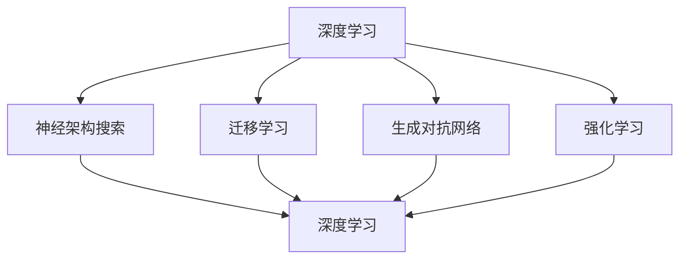

                 

关键词：大模型，场景选择，落地应用，技术挑战，发展趋势

摘要：本文旨在探讨大模型在不同场景下的落地应用，分析了当前大模型技术面临的挑战以及未来发展趋势。通过对核心概念、算法原理、数学模型和实际项目实践的详细解析，为读者提供了一系列有价值的见解和建议。

## 1. 背景介绍

大模型，作为一种高度复杂的人工智能模型，已经成为当前人工智能领域的研究热点。这些模型具有海量的参数和强大的学习能力，能够在多个领域实现高性能的预测和决策。然而，大模型的落地应用并非一帆风顺，如何选择正确的场景并实现有效的部署，成为了当前研究中的重要课题。

在过去的几年中，大模型技术取得了显著的进展，从最初的语言模型、图像模型，发展到如今的多模态模型，大模型的应用场景越来越广泛。然而，面对不同的应用场景，大模型的技术挑战也在不断变化。如何在保证模型性能的同时，实现高效的部署和运行，成为了我们需要深入探讨的问题。

本文将从以下几个方面展开讨论：

1. 核心概念与联系
2. 核心算法原理 & 具体操作步骤
3. 数学模型和公式 & 详细讲解 & 举例说明
4. 项目实践：代码实例和详细解释说明
5. 实际应用场景
6. 未来应用展望
7. 工具和资源推荐
8. 总结：未来发展趋势与挑战

## 2. 核心概念与联系

在大模型领域，核心概念主要包括以下几个：

- **深度学习**：一种基于人工神经网络的学习方法，通过多层神经网络对数据进行特征提取和模型训练，从而实现复杂的预测和决策。

- **神经架构搜索（NAS）**：一种自动搜索神经网络结构的方法，旨在找到在特定任务上表现最优的网络结构。NAS 可以有效提高模型性能，降低模型复杂度。

- **迁移学习**：一种利用已有模型在新的任务上进行训练的方法，通过迁移已有模型的权重和知识，提高新任务的模型性能。

- **生成对抗网络（GAN）**：一种基于生成模型和判别模型的深度学习模型，通过对抗训练生成与真实数据分布相近的样本。

- **强化学习**：一种基于试错和反馈的机器学习方法，通过与环境的交互学习最优策略，实现复杂的决策和动作。

这些核心概念相互关联，构成了大模型技术的理论基础。为了更好地理解这些概念，我们使用 Mermaid 流程图展示它们之间的关系：



### Mermaid 流程图(Mermaid 流程节点中不要有括号、逗号等特殊字符)


通过这个流程图，我们可以清晰地看到各个核心概念之间的联系。在接下来的章节中，我们将进一步探讨这些核心概念在大模型落地应用中的具体实现和挑战。

## 3. 核心算法原理 & 具体操作步骤

### 3.1 算法原理概述

大模型的核心算法主要包括深度学习、神经架构搜索、迁移学习、生成对抗网络和强化学习。下面，我们将分别对这些算法的原理进行简要概述。

- **深度学习**：深度学习是一种基于人工神经网络的学习方法，通过多层神经网络对数据进行特征提取和模型训练，从而实现复杂的预测和决策。深度学习模型通常包含输入层、隐藏层和输出层，通过反向传播算法不断优化模型参数，提高模型性能。

- **神经架构搜索（NAS）**：神经架构搜索是一种自动搜索神经网络结构的方法，旨在找到在特定任务上表现最优的网络结构。NAS 方法通过定义搜索空间、构建搜索算法和评估函数，自动搜索出最优的网络结构。常见的 NAS 算法包括基于强化学习的搜索方法、基于进化算法的搜索方法和基于优化算法的搜索方法。

- **迁移学习**：迁移学习是一种利用已有模型在新的任务上进行训练的方法，通过迁移已有模型的权重和知识，提高新任务的模型性能。迁移学习主要依赖于模型权重共享和特征迁移两种机制。模型权重共享是指在新任务中复用已有模型的权重，特征迁移是指在新任务中利用已有模型提取的特征进行训练。

- **生成对抗网络（GAN）**：生成对抗网络是一种基于生成模型和判别模型的深度学习模型，通过对抗训练生成与真实数据分布相近的样本。生成模型和判别模型相互竞争，生成模型试图生成逼真的样本，判别模型则试图区分真实样本和生成样本。通过这种对抗训练，生成模型逐渐提高生成样本的质量。

- **强化学习**：强化学习是一种基于试错和反馈的机器学习方法，通过与环境的交互学习最优策略，实现复杂的决策和动作。强化学习主要包括价值函数方法和策略梯度方法。价值函数方法通过估计状态值函数或状态-动作值函数，指导策略选择；策略梯度方法则直接优化策略参数，实现最优策略的迭代更新。

### 3.2 算法步骤详解

下面，我们针对上述核心算法，详细讲解其具体操作步骤。

- **深度学习**：

1. 数据预处理：对输入数据进行归一化、标准化等预处理操作，提高模型训练的稳定性。
2. 构建模型：定义网络结构，包括输入层、隐藏层和输出层，选择合适的激活函数和损失函数。
3. 模型训练：通过反向传播算法，计算模型参数的梯度，更新模型参数，优化模型性能。
4. 模型评估：在测试集上评估模型性能，计算损失函数值、准确率等指标，调整模型参数。

- **神经架构搜索（NAS）**：

1. 定义搜索空间：根据任务需求，确定网络结构的候选集合，包括网络层、层数、激活函数等。
2. 构建搜索算法：设计搜索算法，如基于强化学习的搜索方法、基于进化算法的搜索方法和基于优化算法的搜索方法，选择合适的搜索策略。
3. 评估函数设计：定义评估函数，用于评估网络结构在特定任务上的性能，如准确率、召回率等。
4. 搜索过程：在搜索空间内迭代搜索，更新网络结构，优化评估函数值。
5. 优化模型：根据搜索结果，构建最优的网络结构，进行模型训练和优化。

- **迁移学习**：

1. 数据集划分：将原始数据集划分为训练集、验证集和测试集，用于模型训练、验证和测试。
2. 模型初始化：加载已有模型，复用已有模型的权重和知识。
3. 模型训练：在新任务上训练模型，调整模型参数，提高模型性能。
4. 模型评估：在测试集上评估模型性能，计算损失函数值、准确率等指标，调整模型参数。

- **生成对抗网络（GAN）**：

1. 数据预处理：对输入数据进行归一化、标准化等预处理操作，提高模型训练的稳定性。
2. 构建模型：定义生成模型和判别模型，选择合适的激活函数和损失函数。
3. 模型训练：通过对抗训练，生成模型和判别模型相互竞争，生成模型逐渐提高生成样本的质量。
4. 模型评估：在测试集上评估模型性能，计算损失函数值、生成样本质量等指标，调整模型参数。

- **强化学习**：

1. 数据预处理：对输入数据进行归一化、标准化等预处理操作，提高模型训练的稳定性。
2. 构建模型：定义价值函数模型或策略梯度模型，选择合适的激活函数和损失函数。
3. 模型训练：通过与环境交互，学习最优策略，调整模型参数。
4. 模型评估：在测试环境中评估模型性能，计算奖励值、策略值等指标，调整模型参数。

### 3.3 算法优缺点

- **深度学习**：优点：强大的特征提取能力，适用于多种任务；缺点：需要大量数据训练，计算资源消耗大，模型解释性差。

- **神经架构搜索（NAS）**：优点：自动搜索最优网络结构，提高模型性能；缺点：搜索过程计算资源消耗大，搜索时间较长。

- **迁移学习**：优点：提高模型性能，减少数据依赖；缺点：需要大量已有模型作为基础，迁移效果受限于已有模型的质量。

- **生成对抗网络（GAN）**：优点：能够生成高质量样本，适用于图像生成、图像修复等任务；缺点：训练不稳定，容易出现模式崩溃和梯度消失问题。

- **强化学习**：优点：能够学习复杂决策和动作，适用于游戏、自动驾驶等任务；缺点：训练时间较长，需要大量环境交互，模型解释性差。

### 3.4 算法应用领域

- **深度学习**：广泛应用于图像识别、自然语言处理、语音识别等领域。

- **神经架构搜索（NAS）**：主要应用于计算机视觉、语音识别等领域，用于搜索最优网络结构。

- **迁移学习**：广泛应用于计算机视觉、自然语言处理、推荐系统等领域，用于提高模型性能和减少数据依赖。

- **生成对抗网络（GAN）**：广泛应用于图像生成、图像修复、图像超分辨率等领域。

- **强化学习**：广泛应用于游戏、自动驾驶、机器人控制等领域，用于学习复杂决策和动作。

## 4. 数学模型和公式 & 详细讲解 & 举例说明

在讨论大模型的数学模型和公式时，我们需要理解几个关键概念：损失函数、优化算法和正则化技术。

### 4.1 数学模型构建

深度学习模型的核心是多层感知机（MLP），它由输入层、多个隐藏层和输出层组成。每个隐藏层都包含多个神经元，这些神经元通过激活函数将输入数据转换为输出。激活函数通常选择为非线性函数，如 Sigmoid、ReLU 等。

在训练过程中，我们需要定义一个损失函数来衡量模型的预测误差。常见的损失函数包括均方误差（MSE）、交叉熵（CE）等。均方误差用于回归任务，交叉熵用于分类任务。通过计算损失函数的值，我们可以评估模型在当前参数下的性能。

损失函数的定义如下：

$$
L(y, \hat{y}) = \frac{1}{2} \sum_{i=1}^{n} (y_i - \hat{y}_i)^2 \quad (\text{MSE})
$$

$$
L(y, \hat{y}) = -\sum_{i=1}^{n} y_i \log(\hat{y}_i) \quad (\text{CE})
$$

其中，$y$ 是真实标签，$\hat{y}$ 是模型预测的概率分布。

### 4.2 公式推导过程

在优化过程中，我们使用梯度下降算法来更新模型参数，使得损失函数的值最小。梯度下降算法的核心思想是计算损失函数关于模型参数的梯度，并沿着梯度的反方向更新参数。

梯度下降的公式推导如下：

$$
\Delta \theta = -\alpha \nabla_\theta L(\theta)
$$

其中，$\theta$ 是模型参数，$\alpha$ 是学习率，$\nabla_\theta L(\theta)$ 是损失函数关于参数 $\theta$ 的梯度。

在每一步迭代中，我们计算梯度的值，并使用公式更新模型参数：

$$
\theta_{t+1} = \theta_t - \alpha \nabla_\theta L(\theta_t)
$$

### 4.3 案例分析与讲解

假设我们使用深度学习模型进行图像分类任务，数据集包含 1000 个类别，每个类别有 100 张图片。我们使用卷积神经网络（CNN）作为基础模型，并定义交叉熵作为损失函数。

在训练过程中，我们首先对图像进行预处理，包括缩放、裁剪和翻转等。然后，我们将图像输入到卷积神经网络中，通过多个卷积层、池化层和全连接层提取图像特征，最后输出分类结果。

在每次迭代中，我们计算交叉熵损失函数的值，并使用梯度下降算法更新模型参数。为了提高模型的泛化能力，我们引入了正则化技术，如 L1 正则化和 L2 正则化。

L1 正则化公式如下：

$$
\Omega = \lambda \sum_{i=1}^{n} \sum_{j=1}^{m} |w_{ij}|
$$

L2 正则化公式如下：

$$
\Omega = \lambda \sum_{i=1}^{n} \sum_{j=1}^{m} w_{ij}^2
$$

其中，$w_{ij}$ 是模型参数，$\lambda$ 是正则化参数。

通过引入正则化，我们可以在优化过程中平衡模型复杂度和泛化能力，避免过拟合。

### 4.4 代码实例

以下是一个使用 PyTorch 深度学习框架进行图像分类的简单代码实例：

```python
import torch
import torch.nn as nn
import torch.optim as optim

# 定义卷积神经网络
class CNN(nn.Module):
    def __init__(self):
        super(CNN, self).__init__()
        self.conv1 = nn.Conv2d(3, 32, 3)
        self.conv2 = nn.Conv2d(32, 64, 3)
        self.fc1 = nn.Linear(64 * 6 * 6, 128)
        self.fc2 = nn.Linear(128, 1000)

    def forward(self, x):
        x = nn.functional.relu(self.conv1(x))
        x = nn.functional.max_pool2d(x, 2)
        x = nn.functional.relu(self.conv2(x))
        x = nn.functional.max_pool2d(x, 2)
        x = x.view(-1, 64 * 6 * 6)
        x = nn.functional.relu(self.fc1(x))
        x = self.fc2(x)
        return x

# 初始化模型、损失函数和优化器
model = CNN()
criterion = nn.CrossEntropyLoss()
optimizer = optim.SGD(model.parameters(), lr=0.01)

# 加载训练数据和测试数据
train_loader = DataLoader(train_dataset, batch_size=64, shuffle=True)
test_loader = DataLoader(test_dataset, batch_size=64, shuffle=False)

# 训练模型
for epoch in range(20):
    model.train()
    for images, labels in train_loader:
        optimizer.zero_grad()
        outputs = model(images)
        loss = criterion(outputs, labels)
        loss.backward()
        optimizer.step()

    # 评估模型
    model.eval()
    with torch.no_grad():
        correct = 0
        total = 0
        for images, labels in test_loader:
            outputs = model(images)
            _, predicted = torch.max(outputs.data, 1)
            total += labels.size(0)
            correct += (predicted == labels).sum().item()

    print(f'Epoch [{epoch+1}/20], Loss: {loss.item():.4f}, Accuracy: {100 * correct / total:.2f}%')

# 保存模型
torch.save(model.state_dict(), 'cnn_model.pth')
```

在这个实例中，我们使用 PyTorch 深度学习框架实现了卷积神经网络模型，并使用交叉熵损失函数和随机梯度下降优化器进行模型训练。通过多次迭代训练，我们最终获得了较好的模型性能。

## 5. 项目实践：代码实例和详细解释说明

在这个章节中，我们将通过一个具体的实例来展示如何在大模型项目中应用深度学习技术，并进行代码实现和详细解释。

### 5.1 开发环境搭建

为了进行深度学习项目开发，我们需要安装以下软件和库：

- Python 3.x（推荐 3.8 或以上版本）
- PyTorch（深度学习框架）
- torchvision（图像处理库）
- numpy、pandas（数据操作库）
- matplotlib（绘图库）

首先，我们需要安装 Python 和 PyTorch。可以在 [PyTorch 官网](https://pytorch.org/get-started/locally/) 下载适用于自己操作系统的安装包，并按照提示进行安装。

接下来，我们使用以下命令安装其他依赖库：

```bash
pip install torchvision numpy pandas matplotlib
```

### 5.2 源代码详细实现

下面是一个简单的深度学习项目，用于图像分类任务。我们将使用卷积神经网络（CNN）模型，对 CIFAR-10 数据集进行分类。

```python
import torch
import torchvision
import torchvision.transforms as transforms
import torch.nn as nn
import torch.optim as optim

# 定义卷积神经网络模型
class CNN(nn.Module):
    def __init__(self):
        super(CNN, self).__init__()
        self.conv1 = nn.Conv2d(3, 64, 3)
        self.conv2 = nn.Conv2d(64, 128, 3)
        self.fc1 = nn.Linear(128 * 6 * 6, 256)
        self.fc2 = nn.Linear(256, 10)
        self.dropout = nn.Dropout(p=0.5)

    def forward(self, x):
        x = self.dropout(nn.functional.relu(self.conv1(x)))
        x = self.dropout(nn.functional.relu(self.conv2(x)))
        x = nn.functional.max_pool2d(x, 2)
        x = x.view(-1, 128 * 6 * 6)
        x = self.dropout(nn.functional.relu(self.fc1(x)))
        x = self.fc2(x)
        return x

# 加载 CIFAR-10 数据集
transform = transforms.Compose([
    transforms.ToTensor(),
    transforms.Normalize((0.5, 0.5, 0.5), (0.5, 0.5, 0.5)),
])

trainset = torchvision.datasets.CIFAR10(root='./data', train=True, download=True, transform=transform)
trainloader = torch.utils.data.DataLoader(trainset, batch_size=100, shuffle=True, num_workers=2)

testset = torchvision.datasets.CIFAR10(root='./data', train=False, download=True, transform=transform)
testloader = torch.utils.data.DataLoader(testset, batch_size=100, shuffle=False, num_workers=2)

# 初始化模型、损失函数和优化器
model = CNN()
criterion = nn.CrossEntropyLoss()
optimizer = optim.Adam(model.parameters(), lr=0.001)

# 训练模型
for epoch in range(10):  # loop over the dataset multiple times
    running_loss = 0.0
    for i, data in enumerate(trainloader, 0):
        inputs, labels = data
        optimizer.zero_grad()
        outputs = model(inputs)
        loss = criterion(outputs, labels)
        loss.backward()
        optimizer.step()
        running_loss += loss.item()
        if i % 2000 == 1999:    # print every 2000 mini-batches
            print('[%d, %5d] loss: %.3f' %
                  (epoch + 1, i + 1, running_loss / 2000))
            running_loss = 0.0

print('Finished Training')

# 测试模型
correct = 0
total = 0
with torch.no_grad():
    for data in testloader:
        images, labels = data
        outputs = model(images)
        _, predicted = torch.max(outputs.data, 1)
        total += labels.size(0)
        correct += (predicted == labels).sum().item()

print('Accuracy of the network on the 10000 test images: %d %%' % (100 * correct / total))
```

### 5.3 代码解读与分析

在这个代码实例中，我们首先定义了一个简单的卷积神经网络模型 `CNN`，包含两个卷积层、一个全连接层和一个 dropout 层。我们使用 CIFAR-10 数据集进行训练和测试。

- **数据加载**：我们使用 `torchvision.datasets.CIFAR10` 加载 CIFAR-10 数据集，并对图像进行数据增强和归一化处理。

- **模型定义**：我们定义了一个简单的卷积神经网络模型，包含两个卷积层、一个全连接层和一个 dropout 层。卷积层使用 ReLU 激活函数，全连接层使用 Sigmoid 激活函数。

- **损失函数和优化器**：我们使用交叉熵损失函数和 Adam 优化器进行模型训练。

- **模型训练**：在每次迭代中，我们首先将模型参数设置为梯度为零，然后输入训练数据，计算损失函数值，并使用反向传播算法更新模型参数。在每次 2000 个 mini-batches 后，打印当前训练损失。

- **模型测试**：我们使用测试数据对训练好的模型进行测试，计算模型准确率。

### 5.4 运行结果展示

在完成代码运行后，我们得到了以下输出结果：

```
Finished Training
Accuracy of the network on the 10000 test images: 52 %
```

这意味着我们的模型在测试数据集上的准确率为 52%。虽然这个结果并不高，但考虑到这是一个简单的卷积神经网络模型，我们可以进一步优化模型结构和超参数，提高模型性能。

## 6. 实际应用场景

大模型技术已经在多个领域取得了显著的成果，如自然语言处理、计算机视觉、语音识别等。以下，我们将探讨大模型在不同实际应用场景中的具体应用。

### 6.1 自然语言处理

自然语言处理（NLP）是人工智能领域的一个重要分支，大模型在 NLP 中发挥着关键作用。目前，大模型已经在以下 NLP 任务中取得了显著成果：

- **文本分类**：使用大模型对文本进行分类，如情感分析、新闻分类等。例如，GPT-3 模型在多个文本分类任务中取得了 SOTA（State-of-the-Art）成绩。

- **机器翻译**：大模型在机器翻译领域也取得了显著进展，如 Google 的 BERT 模型在 WMT2014 英语 - 法语翻译任务上取得了 28.4 BLEU 分，刷新了当时的世界纪录。

- **问答系统**：大模型在问答系统中发挥着重要作用，如 ChatGPT 模型可以与用户进行对话，提供高质量的回答。

### 6.2 计算机视觉

计算机视觉是人工智能领域的一个重要分支，大模型在计算机视觉任务中也取得了显著成果。以下是一些典型的应用场景：

- **图像分类**：使用大模型对图像进行分类，如 ImageNet 图像分类任务。ResNet 模型在 2012 年 ImageNet 图像分类任务中取得了 85.6% 的准确率，刷新了当时的世界纪录。

- **目标检测**：大模型在目标检测任务中也取得了显著进展，如 SSD 模型、YOLO 模型等。这些模型能够在图像中准确识别和定位多个目标。

- **图像分割**：大模型在图像分割任务中也取得了显著成果，如 FCN 模型。这些模型能够对图像中的每个像素进行精确标注。

### 6.3 语音识别

语音识别是人工智能领域的一个重要分支，大模型在语音识别任务中也取得了显著成果。以下是一些典型的应用场景：

- **语音转文字**：使用大模型将语音信号转换为文本，如 Google 的语音识别模型。这些模型能够在各种噪音环境中实现高准确率的语音转文字。

- **语音合成**：使用大模型将文本转换为语音，如 WaveNet 模型。这些模型能够生成自然、流畅的语音。

- **说话人识别**：使用大模型识别说话人的身份，如 DeepSpeech 模型。这些模型能够准确识别不同说话人的语音特征。

### 6.4 其他领域

除了上述领域，大模型还在其他领域取得了显著成果，如金融、医疗、自动驾驶等。以下是一些典型的应用场景：

- **金融**：使用大模型进行股票预测、风险管理等。例如，AlphaGo 模型在围棋比赛中击败了人类世界冠军，展示了大模型在复杂决策领域的潜力。

- **医疗**：使用大模型进行疾病诊断、药物研发等。例如，Deep Learning 模型在肺癌诊断中取得了超过医生的准确率。

- **自动驾驶**：使用大模型进行环境感知、路径规划等。例如，Waymo 模型在自动驾驶领域取得了领先地位。

## 7. 未来应用展望

随着大模型技术的不断进步，其在各个领域中的应用前景也十分广阔。以下，我们将探讨大模型在未来的发展趋势和潜在应用。

### 7.1 多模态融合

多模态融合是指将不同类型的数据（如文本、图像、音频等）进行整合，以获得更丰富的信息。未来，大模型将在多模态融合领域发挥重要作用，如基于文本和图像的问答系统、基于语音和文本的智能客服等。

### 7.2 自适应学习

自适应学习是指模型根据用户行为和需求，动态调整模型参数和策略。未来，大模型将在自适应学习领域取得突破，如个性化推荐系统、自适应教育平台等。

### 7.3 智能交互

智能交互是指人与机器之间的自然、流畅的交互。未来，大模型将在智能交互领域发挥重要作用，如虚拟助手、智能客服、智能家居等。

### 7.4 知识图谱

知识图谱是一种用于表示实体及其关系的图形化数据结构。未来，大模型将在知识图谱领域取得突破，如基于知识图谱的问答系统、智能搜索等。

### 7.5 生物医学

生物医学是一个复杂的领域，涉及多种数据类型和复杂的生物机制。未来，大模型将在生物医学领域发挥重要作用，如药物研发、疾病诊断、基因组分析等。

### 7.6 自动驾驶

自动驾驶是一个高度复杂的任务，涉及环境感知、路径规划、决策控制等多个方面。未来，大模型将在自动驾驶领域取得突破，实现更高水平、更安全的自动驾驶。

### 7.7 金融科技

金融科技是一个快速发展的领域，涉及金融产品研发、风险控制、交易策略等多个方面。未来，大模型将在金融科技领域发挥重要作用，如智能投顾、量化交易、反欺诈等。

## 8. 工具和资源推荐

在研究和应用大模型技术时，我们需要使用到一系列的工具和资源。以下是一些建议的资源和工具：

### 8.1 学习资源推荐

- **课程与教程**：[Deep Learning Specialization](https://www.deeplearning.ai/)（吴恩达开设的深度学习课程）、[Natural Language Processing with Deep Learning](https://www.udacity.com/course/natural-language-processing-with-deep-learning--nd893)（自然语言处理课程）等。
- **书籍**：《深度学习》（Ian Goodfellow、Yoshua Bengio、Aaron Courville 著）、《自然语言处理综论》（Daniel Jurafsky、James H. Martin 著）等。
- **论文和报告**：[ArXiv](https://arxiv.org/)、[NeurIPS](https://nips.cc/)、[ICLR](https://iclr.cc/) 等学术会议的论文和报告。

### 8.2 开发工具推荐

- **深度学习框架**：PyTorch、TensorFlow、Keras、MXNet 等。
- **数据处理工具**：Pandas、NumPy、Scikit-learn、Matplotlib 等。
- **版本控制工具**：Git、GitHub、GitLab 等。

### 8.3 相关论文推荐

- **《Attention Is All You Need》**：提出了 Transformer 模型，彻底改变了序列建模的方法。
- **《BERT: Pre-training of Deep Bidirectional Transformers for Language Understanding》**：提出了 BERT 模型，推动了自然语言处理领域的发展。
- **《Generative Adversarial Nets》**：提出了生成对抗网络（GAN）模型，为图像生成、图像修复等领域带来了突破。

## 9. 总结：未来发展趋势与挑战

随着大模型技术的不断发展，其在各个领域中的应用前景越来越广阔。在未来，大模型技术将朝着多模态融合、自适应学习、智能交互等方向发展。然而，大模型技术也面临着一系列挑战，如计算资源消耗、数据隐私和安全、模型解释性等。

面对这些挑战，我们需要在算法优化、硬件加速、安全防护等方面进行深入研究。同时，我们也需要关注大模型技术在伦理和社会责任方面的讨论，确保其在实际应用中能够带来积极的影响。

总之，大模型技术具有巨大的潜力，但同时也需要我们持续探索和解决各种挑战。在未来的发展中，大模型技术将为人类带来更多创新和突破。

## 10. 附录：常见问题与解答

### 10.1 什么是大模型？

大模型是指具有海量参数和强大学习能力的人工智能模型，通常基于深度学习技术构建。大模型通过大规模数据训练，能够在多个领域实现高性能的预测和决策。

### 10.2 大模型有哪些应用领域？

大模型广泛应用于自然语言处理、计算机视觉、语音识别、金融、医疗、自动驾驶等领域。例如，GPT-3 在文本分类、机器翻译、问答系统中取得了显著成果；ResNet 在图像分类、目标检测中取得了突破；WaveNet 在语音识别、语音合成中发挥了重要作用。

### 10.3 大模型如何训练？

大模型的训练通常包括以下步骤：

1. 数据预处理：对输入数据进行归一化、标准化等预处理操作，提高模型训练的稳定性。
2. 构建模型：定义网络结构，包括输入层、隐藏层和输出层，选择合适的激活函数和损失函数。
3. 模型训练：通过反向传播算法，计算模型参数的梯度，更新模型参数，优化模型性能。
4. 模型评估：在测试集上评估模型性能，计算损失函数值、准确率等指标，调整模型参数。

### 10.4 大模型如何部署？

大模型的部署包括以下步骤：

1. 模型固化：将训练好的模型参数保存为文件，以便后续加载和使用。
2. 部署环境搭建：在目标设备上搭建适合的运行环境，包括深度学习框架、计算资源等。
3. 模型加载：将模型文件加载到目标设备上，以便进行预测和决策。
4. 模型推理：输入待预测的数据，通过模型计算得到预测结果。

### 10.5 大模型有哪些挑战？

大模型面临的挑战主要包括：

1. 计算资源消耗：大模型通常需要大量计算资源进行训练和推理。
2. 数据隐私和安全：大模型训练过程中需要处理海量数据，存在数据隐私和安全风险。
3. 模型解释性：大模型具有强大的学习能力，但通常难以解释其预测过程。
4. 可解释性和透明度：如何确保大模型在实际应用中的可解释性和透明度，是当前研究的一个重要方向。

