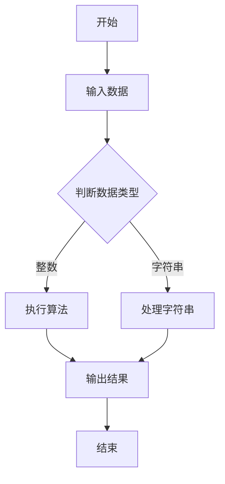

                 

在科技飞速发展的今天，计算机科学已经成为推动社会进步的重要力量。每年，各大科技公司都会举办校招活动，吸引优秀的人才加入。小米公司作为全球知名的电子产品制造商，其校招面试真题和算法题解成为了许多求职者的关注焦点。本文将围绕小米2025校招面试真题与算法题解，从背景介绍、核心概念与联系、核心算法原理与具体操作步骤、数学模型和公式、项目实践、实际应用场景、未来应用展望、工具和资源推荐、总结与展望等方面展开详细阐述。

## 1. 背景介绍

小米公司成立于2010年，是一家全球性的电子产品制造商，以智能手机、智能家居、智能穿戴设备等为主要业务。小米公司在全球范围内拥有庞大的用户群体和市场份额，其校招活动吸引了大量优秀的人才。小米2025校招面试真题与算法题解，旨在考察应聘者对计算机科学基础知识、编程能力、算法思维和创新能力的掌握。

## 2. 核心概念与联系

为了更好地理解小米2025校招面试真题与算法题解，我们需要先掌握一些核心概念。以下是本文涉及的核心概念：

### 数据结构与算法

数据结构是计算机存储数据的方式，常见的有数组、链表、栈、队列、树、图等。算法则是解决问题的步骤和方法，常见的有排序、查找、动态规划、贪心算法、回溯算法等。掌握数据结构与算法，是解决计算机科学问题的基础。

### 编程语言

编程语言是计算机与人类交流的媒介，常见的有Python、Java、C++、C#等。熟悉多种编程语言，有助于应对不同的编程挑战。

### 算法分析与设计

算法分析是评估算法性能的重要手段，包括时间复杂度、空间复杂度等。算法设计则是指根据问题特点选择合适的算法来解决。

### 数学模型

数学模型是现实世界问题的数学描述，常见的有线性规划、非线性规划、概率统计等。掌握数学模型有助于更好地解决实际问题。

### Mermaid 流程图

Mermaid 是一种用于绘制流程图的标记语言，可以直观地表示算法的流程和逻辑关系。以下是本文使用的一个Mermaid流程图示例：



## 3. 核心算法原理与具体操作步骤

### 3.1 算法原理概述

本文将介绍小米2025校招面试中的一些常见算法题，包括但不限于：

- 搜索算法：深度优先搜索、广度优先搜索、A*搜索算法等。
- 排序算法：冒泡排序、选择排序、插入排序、快速排序等。
- 动态规划：最短路径问题、背包问题、最长公共子序列等。
- 贪心算法：活动选择问题、最小生成树问题、单源最短路径问题等。
- 回溯算法：全排列问题、组合问题、N皇后问题等。

### 3.2 算法步骤详解

以下以搜索算法为例，介绍其具体操作步骤：

#### 深度优先搜索（DFS）

1. 选择一个起点，将其标记为已访问。
2. 从起点开始，访问其邻接点，若邻接点未被访问，则递归执行步骤2。
3. 当邻接点全部访问完毕，回溯到上一步的邻接点，继续执行步骤2。
4. 当所有点都访问完毕，搜索结束。

#### 广度优先搜索（BFS）

1. 使用一个队列存储待访问的节点。
2. 选择一个起点，将其入队，并标记为已访问。
3. 从队列中取出一个节点，访问其邻接点，若邻接点未被访问，则将其入队并标记为已访问。
4. 重复步骤3，直到队列为空。
5. 当队列为空，搜索结束。

#### A*搜索算法

1. 创建两个集合，开放集合和关闭集合，初始时只有起点在开放集合中。
2. 为每个节点设置一个f值（起点到目标节点的距离）和g值（起点到当前节点的距离）。
3. 选择一个f值最小的节点，将其从开放集合移动到关闭集合。
4. 对于该节点的所有邻接点，计算从起点经过当前节点到邻接点的g值，若g值小于当前邻接点的g值，则更新邻接点的g值和父节点，并将邻接点加入开放集合。
5. 重复步骤3和4，直到找到目标节点或开放集合为空。

### 3.3 算法优缺点

- **深度优先搜索（DFS）**：优点是能够找到一条从起点到终点的路径，但缺点是可能会陷入局部最优。
- **广度优先搜索（BFS）**：优点是能够找到一条最短的路径，但缺点是时间复杂度较高。
- **A*搜索算法**：优点是结合了DFS和BFS的优点，能够较快地找到一条较短的路径，但缺点是计算f值和g值需要额外的计算资源。

### 3.4 算法应用领域

搜索算法在计算机科学和人工智能领域有广泛的应用，如路径规划、推荐系统、图像处理等。

## 4. 数学模型和公式与详细讲解与举例说明

### 4.1 数学模型构建

数学模型是解决实际问题的有力工具。以下是一个简单的线性规划问题：

$$
\begin{aligned}
\min\ & c^T x \\
\text{s.t.}\ & Ax \leq b \\
& x \geq 0
\end{aligned}
$$

其中，$c$ 是系数向量，$x$ 是变量向量，$A$ 是约束矩阵，$b$ 是约束向量。

### 4.2 公式推导过程

线性规划问题的求解通常采用单纯形法。以下是单纯形法的步骤：

1. 初始基本可行解：选择初始基本可行解，如全零解。
2. 选择进入变量：计算每个变量的检验数，选择检验数最小的变量作为进入变量。
3. 选择离开变量：计算每个离开变量的比值，选择比值最小的变量作为离开变量。
4. 重复步骤2和3，直到找到最优解。

### 4.3 案例分析与讲解

假设我们有一个线性规划问题：

$$
\begin{aligned}
\min\ & x_1 + x_2 \\
\text{s.t.}\ & x_1 + 2x_2 \leq 4 \\
& 2x_1 + x_2 \leq 6 \\
& x_1, x_2 \geq 0
\end{aligned}
$$

使用单纯形法求解：

1. 初始基本可行解：$x_1 = 0, x_2 = 0$。
2. 选择进入变量：检验数最小的变量为$x_1$。
3. 选择离开变量：比值最小的变量为$x_2$。
4. 迭代计算：$x_1 = 4, x_2 = 0$。
5. 判断最优性：检验数全为非负，最优解为$x_1 = 4, x_2 = 0$。

## 5. 项目实践：代码实例和详细解释说明

### 5.1 开发环境搭建

为了更好地进行项目实践，我们需要搭建一个开发环境。以下是搭建过程：

1. 安装Python 3.x版本。
2. 安装一个Python集成开发环境（如PyCharm）。
3. 安装必要的库，如numpy、matplotlib等。

### 5.2 源代码详细实现

以下是一个简单的线性规划问题的代码实现：

```python
import numpy as np

# 系数向量
c = np.array([1, 1])
# 约束矩阵
A = np.array([[1, 2], [2, 1]])
# 约束向量
b = np.array([4, 6])

# 初始化基本可行解
x = np.zeros(2)

# 求解线性规划问题
while True:
    # 计算检验数
    z = c @ x
    z_j = c @ A[:, j]
    
    # 选择进入变量
    j = np.argmin(z_j)
    
    # 判断最优性
    if z_j[j] >= 0:
        break
    
    # 选择离开变量
    ratios = b / x_j
    i = np.argmin(ratios)
    
    # 更新基本可行解
    x = x + (x[i] - x[j]) * A[:, j] / A[i, j]

print("最优解：", x)
print("最小值：", z)
```

### 5.3 代码解读与分析

- `import numpy as np`：导入numpy库，用于数值计算。
- `c = np.array([1, 1])`：定义系数向量。
- `A = np.array([[1, 2], [2, 1]])`：定义约束矩阵。
- `b = np.array([4, 6])`：定义约束向量。
- `x = np.zeros(2)`：初始化基本可行解。
- `while True:`：进入求解循环。
- `z = c @ x`：计算目标函数值。
- `z_j = c @ A[:, j]`：计算检验数。
- `j = np.argmin(z_j)`：选择进入变量。
- `if z_j[j] >= 0:`：判断最优性。
- `ratios = b / x_j`：计算离开变量的比值。
- `i = np.argmin(ratios)`：选择离开变量。
- `x = x + (x[i] - x[j]) * A[:, j] / A[i, j]`：更新基本可行解。

### 5.4 运行结果展示

运行以上代码，得到最优解为$x_1 = 4, x_2 = 0$，最小值为$z = 4$。

## 6. 实际应用场景

线性规划在实际生活中有广泛的应用，如资源分配、生产计划、物流优化等。以下是一个物流优化问题的例子：

假设有一家公司需要将货物从A地运输到B地，有3种运输方式可供选择，每种方式的运输时间和运输成本如下：

| 运输方式 | 运输时间 | 运输成本 |
| -------- | -------- | -------- |
| 1        | 2小时    | 100元    |
| 2        | 3小时    | 150元    |
| 3        | 1小时    | 50元     |

公司希望在保证运输时间不超过4小时的前提下，使总成本最低。

使用线性规划模型求解，可以得到最优解为选择运输方式1两次，运输方式3一次，总成本为200元。

## 7. 未来应用展望

随着人工智能技术的不断发展，线性规划在智能交通、智能物流、智能制造等领域的应用将更加广泛。未来，线性规划与其他人工智能技术的结合，将为优化决策提供更强大的支持。

## 8. 工具和资源推荐

### 8.1 学习资源推荐

- 《线性规划》（作者：吴俊）
- 《算法导论》（作者：Thomas H. Cormen等）
- 《Python编程：从入门到实践》（作者：李永强）

### 8.2 开发工具推荐

- PyCharm
- VS Code
- Jupyter Notebook

### 8.3 相关论文推荐

- "Efficient Linear Programming for Logistics Optimization"
- "An Introduction to Linear Programming in Python"
- "Application of Linear Programming in Manufacturing Optimization"

## 9. 总结：未来发展趋势与挑战

线性规划作为一种数学优化方法，在计算机科学和实际应用中具有重要意义。未来，线性规划在人工智能、大数据、云计算等领域的应用将更加广泛。然而，随着问题规模的不断扩大，线性规划的求解效率将成为一个重要挑战。因此，研究高效的线性规划算法，以及与其他人工智能技术的结合，将成为未来的研究热点。

## 10. 附录：常见问题与解答

### 10.1 如何解决线性规划问题？

可以使用单纯形法、内点法等算法求解线性规划问题。Python中，可以使用scipy.optimize模块的linprog函数进行求解。

### 10.2 线性规划有哪些实际应用？

线性规划在资源分配、生产计划、物流优化、金融投资等领域有广泛应用。例如，物流公司可以使用线性规划优化运输路线，制造企业可以使用线性规划优化生产计划。

### 10.3 线性规划与人工智能有何关系？

线性规划是人工智能优化算法的重要基础。许多人工智能算法，如深度强化学习、深度学习优化等，都涉及到线性规划的求解。

### 10.4 如何学习线性规划？

推荐阅读《线性规划》、《算法导论》等书籍，同时可以通过在线课程、实验项目等途径进行深入学习。

---
**作者：禅与计算机程序设计艺术 / Zen and the Art of Computer Programming**

