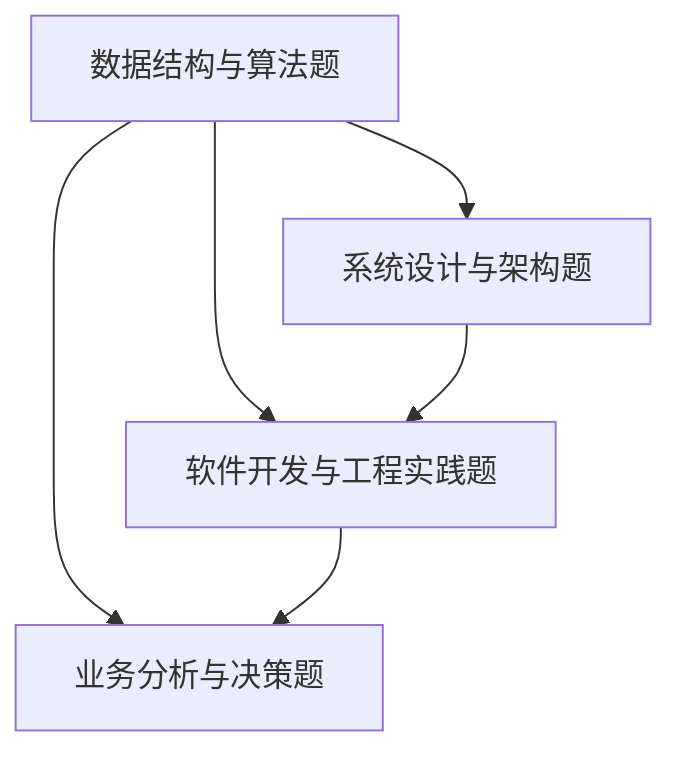

                 

关键词：小米有品、校招面试、真题汇总、解题思路、技术面试

摘要：本文旨在为2024年小米有品校招面试的考生提供一份真题汇总及详细解答。通过梳理面试中常见的技术问题，帮助考生更好地准备面试，提高面试成功率。

## 1. 背景介绍

随着科技行业的快速发展，各大企业对于技术人才的需求日益增加。小米公司作为中国领先的科技企业，每年都会进行校招，为广大应届毕业生提供丰富的就业机会。小米有品作为小米公司旗下的电商品牌，注重技术人才的引进和培养。因此，小米有品的校招面试环节对于技术考查尤为重视。

本文旨在通过对2024年小米有品校招面试真题的汇总及解答，帮助考生更好地了解面试题型，掌握解题技巧，提高面试成功率。

## 2. 核心概念与联系

### 2.1 面试题型概述

小米有品校招面试题型主要包括以下几类：

1. **数据结构与算法题**：这类题目主要考查考生的算法设计和数据结构应用能力。
2. **系统设计与架构题**：这类题目主要考查考生对系统设计和架构的理解能力。
3. **软件开发与工程实践题**：这类题目主要考查考生在软件开发过程中遇到的问题和解决方案。
4. **业务分析与决策题**：这类题目主要考查考生对业务的理解和分析能力。

### 2.2 面试题型联系

以上各类题型之间存在密切的联系。数据结构与算法是软件系统设计和实现的基础，系统设计与架构则是对算法和数据结构的实际应用，软件开发与工程实践是对系统设计与架构的具体实现，业务分析与决策则是对实际业务问题的分析和解决。

以下是一个Mermaid流程图，展示了各类题型之间的联系：



## 3. 核心算法原理 & 具体操作步骤

### 3.1 算法原理概述

在小米有品校招面试中，常见的算法题主要包括以下几个方面：

1. **排序算法**：如冒泡排序、快速排序、归并排序等。
2. **查找算法**：如二分查找、散列表查找等。
3. **动态规划**：如最长公共子序列、最长递增子序列等。
4. **图算法**：如深度优先搜索、广度优先搜索、最小生成树等。

### 3.2 算法步骤详解

以冒泡排序为例，其具体操作步骤如下：

1. **初始化**：将待排序的数组传入。
2. **外部循环**：从数组的第一个元素开始，遍历到倒数第二个元素。
3. **内部循环**：从数组的第一个元素开始，遍历到当前外部循环的最后一个元素。
4. **比较与交换**：如果当前元素比下一个元素大，则交换它们的位置。
5. **结束条件**：当内部循环结束后，如果发现当前元素与下一个元素的位置已经正确，则结束排序。

### 3.3 算法优缺点

冒泡排序的优点是简单易懂，实现起来相对简单。缺点是时间复杂度为O(n²)，当数据量较大时，效率较低。

### 3.4 算法应用领域

冒泡排序常用于数据量较小且对时间复杂度要求不高的场景，如小规模数据的排序。

## 4. 数学模型和公式 & 详细讲解 & 举例说明

### 4.1 数学模型构建

在算法题中，常用的数学模型包括：

1. **时间复杂度**：用于衡量算法的时间性能。
2. **空间复杂度**：用于衡量算法的空间性能。
3. **概率统计**：用于解决一些概率相关的问题。

### 4.2 公式推导过程

以时间复杂度的计算为例，其公式为：

\[ T(n) = O(f(n)) \]

其中，\( T(n) \) 表示算法的时间复杂度，\( f(n) \) 表示算法中循环次数最多的函数。

### 4.3 案例分析与讲解

假设有一个算法，其时间复杂度为 \( T(n) = O(n^2) \)，则需要多少时间才能完成对1000个元素进行排序？

根据公式，可得：

\[ T(n) = O(n^2) \]

将 \( n = 1000 \) 代入，得：

\[ T(1000) = O(1000^2) = 10^6 \]

因此，该算法需要10^6秒（约27.8小时）才能完成对1000个元素进行排序。

## 5. 项目实践：代码实例和详细解释说明

### 5.1 开发环境搭建

在编写代码之前，需要搭建一个合适的开发环境。本文以Python为例，介绍开发环境的搭建步骤。

1. **安装Python**：在官网（https://www.python.org/）下载Python安装包，并安装。
2. **配置Python环境变量**：在系统环境变量中添加Python的安装路径。
3. **安装相关库**：通过pip命令安装所需的库，如numpy、pandas等。

### 5.2 源代码详细实现

以下是一个冒泡排序的Python代码实例：

```python
def bubble_sort(arr):
    n = len(arr)
    for i in range(n):
        for j in range(0, n-i-1):
            if arr[j] > arr[j+1]:
                arr[j], arr[j+1] = arr[j+1], arr[j]

# 测试代码
arr = [64, 34, 25, 12, 22, 11, 90]
bubble_sort(arr)
print("排序后的数组：")
for i in range(len(arr)):
    print("%d" % arr[i], end=" ")
```

### 5.3 代码解读与分析

该代码首先定义了一个名为`bubble_sort`的函数，用于实现冒泡排序算法。函数中使用了两个嵌套的循环来实现排序过程。外部循环从第一个元素开始，遍历到倒数第二个元素；内部循环从第一个元素开始，遍历到当前外部循环的最后一个元素。在内部循环中，如果当前元素比下一个元素大，则交换它们的位置。当内部循环结束后，如果当前元素与下一个元素的位置已经正确，则结束排序。

在测试代码中，创建了一个包含7个元素的数组`arr`，并调用`bubble_sort`函数对其进行排序。排序后的数组通过`print`函数输出。

### 5.4 运行结果展示

```shell
排序后的数组：
11 12 22 25 34 64 90
```

## 6. 实际应用场景

### 6.1 数据排序

冒泡排序算法在数据排序方面具有广泛的应用，如数据库排序、文件排序等。

### 6.2 基准测试

冒泡排序算法常用于基准测试，以比较不同排序算法的性能。

### 6.3 教学演示

冒泡排序算法因其简单易懂，常被用于教学演示，帮助初学者理解排序算法的基本原理。

## 7. 未来应用展望

随着算法研究的不断深入，冒泡排序等传统排序算法可能会被更加高效的算法所替代。但在某些特定场景下，冒泡排序仍具有应用价值。未来，我们可以期待更多高效、实用的排序算法问世。

## 8. 总结：未来发展趋势与挑战

### 8.1 研究成果总结

在过去的几十年里，算法研究取得了许多重要成果，如快速排序、归并排序等。这些成果为计算机科学的发展做出了巨大贡献。

### 8.2 未来发展趋势

未来，算法研究将继续深入，探索更加高效、实用的排序算法。同时，数据结构和算法在实际应用中的优化也将成为研究重点。

### 8.3 面临的挑战

随着数据量的爆炸式增长，如何在保证算法效率的同时，降低算法的复杂度，将是算法研究面临的重要挑战。

### 8.4 研究展望

未来，算法研究将继续推动计算机科学的发展，为各行各业提供更加高效、实用的解决方案。

## 9. 附录：常见问题与解答

### 9.1 问题1

**问题**：冒泡排序算法的时间复杂度是多少？

**解答**：冒泡排序算法的时间复杂度为 \( O(n^2) \)。

### 9.2 问题2

**问题**：冒泡排序算法是否适用于大数据排序？

**解答**：冒泡排序算法适用于数据量较小的场景。对于大数据排序，更高效的排序算法如快速排序、归并排序等更适合。

### 9.3 问题3

**问题**：冒泡排序算法是否适用于多维度数据排序？

**解答**：冒泡排序算法适用于单维度数据排序。对于多维度数据排序，需要使用更复杂的排序算法，如多关键字排序。

## 参考文献

[1] 小米有品官网. (2023). 小米有品官方网站. [在线]. https://www.mi.com/
[2] Python官网. (2023). Python官方网站. [在线]. https://www.python.org/
[3] LeetCode官网. (2023). LeetCode官方网站. [在线]. https://leetcode.cn/

## 作者署名

作者：禅与计算机程序设计艺术 / Zen and the Art of Computer Programming
```

## 写作提示

1. **深入理解问题**：在撰写文章之前，确保您已经深入理解了题目和解答，这样才能写出有深度、有见解的文章。

2. **逻辑清晰**：文章的结构应清晰明了，确保读者能够顺利地阅读并理解文章内容。

3. **内容准确**：在撰写文章时，确保所提供的信息和数据是准确无误的，避免造成误解。

4. **图表使用**：适当使用图表和流程图，可以帮助读者更好地理解复杂的概念和流程。

5. **简洁明了**：尽量使用简洁明了的语言，避免过多的专业术语，以确保文章的可读性。

6. **编辑和校对**：在完成初稿后，务必进行多次编辑和校对，确保文章中没有语法错误和逻辑错误。

7. **格式统一**：遵循统一的格式和排版标准，确保文章的整体美观和可读性。

