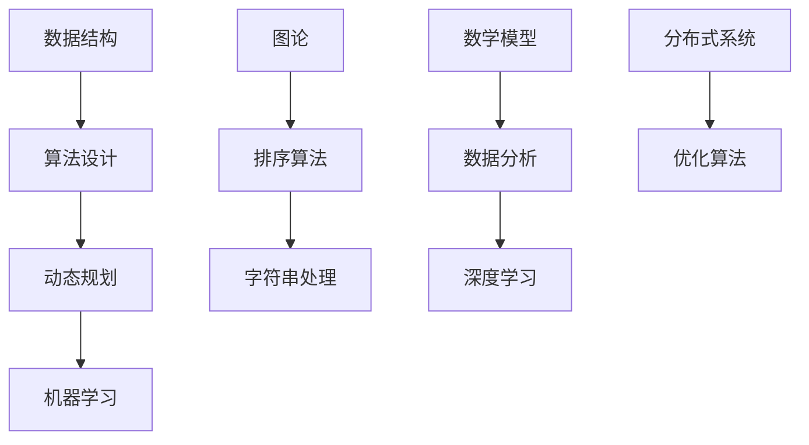

                 

## 1. 背景介绍

随着人工智能和大数据技术的迅速发展，算法工程师在各大互联网公司中变得愈加重要。小米作为一家全球知名的电子产品和互联网服务提供商，在招聘算法工程师时对面试者的算法能力有着较高的要求。本文旨在汇总和解析2024年小米社招中可能出现的算法面试题，为准备参加小米面试的算法工程师提供有针对性的指导和参考。

### 文章关键词：小米社招、算法面试、面试题解析、算法工程师

### 文章摘要：

本文将分为以下几个部分：首先介绍小米公司的算法面试背景；其次，根据小米招聘的需求，列出可能涉及的核心算法概念和主题；然后详细解析一些典型的算法面试题目，包括数据结构、算法设计、动态规划、机器学习等；接着，讨论实际项目实践中的代码实例；最后，总结算法面试的实际应用场景，并展望未来发展趋势。

## 2. 核心概念与联系

在解答小米算法面试题之前，我们需要先掌握一些核心算法概念和原理。以下是几个关键概念及其相互关系的 Mermaid 流程图：



### 2.1 数据结构

数据结构是算法的基础，常见的有数组、链表、栈、队列、树、图等。数据结构的选择直接影响算法的时间复杂度和空间复杂度。

### 2.2 算法设计

算法设计包括贪心算法、分治算法、回溯算法等。每种算法都有其适用的场景和优缺点。

### 2.3 动态规划

动态规划是一种解决最优化问题的算法思想，适用于解决具有重叠子问题和最优子结构性质的问题。

### 2.4 机器学习

机器学习是算法领域的一个重要分支，包括监督学习、无监督学习、强化学习等。它广泛应用于图像识别、自然语言处理、推荐系统等领域。

### 2.5 图论

图论研究图形的结构、性质及其应用。在算法设计中，图论常用于解决网络流问题、最短路径问题等。

### 2.6 排序算法

排序算法是算法中的基本操作，常见的有冒泡排序、选择排序、插入排序、快速排序等。

### 2.7 字符串处理

字符串处理算法包括字符串匹配、文本编辑距离、字符串压缩等。在自然语言处理和文本分析中有着广泛的应用。

### 2.8 数学模型

数学模型是将实际问题转化为数学形式的方法。常见的数学模型有线性模型、非线性模型、优化模型等。

### 2.9 数据分析

数据分析是利用统计学方法和工具对数据进行分析和解释的过程。它帮助我们从海量数据中提取有价值的信息。

### 2.10 深度学习

深度学习是一种基于人工神经网络的机器学习方法。它通过多层神经网络自动学习数据中的特征和规律。

### 2.11 分布式系统

分布式系统是一种将计算任务分布在多个计算机上执行的系统。它具有高可用性、高可靠性、高性能的特点。

### 2.12 优化算法

优化算法是用于解决最优化问题的算法。常见的有线性规划、非线性规划、遗传算法等。

## 3. 核心算法原理 & 具体操作步骤

### 3.1 算法原理概述

在小米算法面试中，以下算法原理是必须掌握的：

- **动态规划**：通过将问题分解为子问题，并利用子问题的解来构建原问题的解。常见的动态规划问题有背包问题、最长公共子序列、最长递增子序列等。
- **排序算法**：用于对数据进行排序。常见的排序算法有冒泡排序、选择排序、插入排序、快速排序等。
- **图论**：用于解决网络流问题、最短路径问题等。常见的图论算法有Dijkstra算法、Floyd算法等。
- **机器学习**：用于实现自动化的决策和预测。常见的机器学习算法有线性回归、支持向量机、决策树等。
- **深度学习**：用于实现更高级别的自动化决策和预测。常见的深度学习算法有卷积神经网络、循环神经网络等。

### 3.2 算法步骤详解

以下是上述算法的具体步骤：

#### 动态规划

1. 将问题分解为子问题。
2. 为每个子问题定义状态和状态转移方程。
3. 利用子问题的解构建原问题的解。

#### 排序算法

1. 冒泡排序：重复遍历要排序的数列，一次比较两个元素，如果它们的顺序错误就把它们交换过来。
2. 选择排序：每次选择剩余元素中最小（或最大）的元素，并将其放到序列的起始位置。
3. 插入排序：将一个元素插入到已经排好序的序列中，以保持序列的有序性。
4. 快速排序：通过递归地将序列分为较小和较大的两部分，然后对两部分分别进行快速排序。

#### 图论

1. Dijkstra算法：使用优先队列实现，找到图中两点之间的最短路径。
2. Floyd算法：使用动态规划方法，找到图中所有点之间的最短路径。

#### 机器学习

1. 线性回归：通过最小二乘法求解线性模型。
2. 支持向量机：通过寻找最优超平面来实现分类。
3. 决策树：通过递归划分特征空间来实现分类或回归。

#### 深度学习

1. 卷积神经网络：通过卷积层、池化层和全连接层实现图像分类。
2. 循环神经网络：通过循环连接实现序列数据的建模。

### 3.3 算法优缺点

每种算法都有其优缺点。例如：

- **动态规划**：能高效解决重叠子问题和最优子结构性质的问题，但实现复杂。
- **排序算法**：时间复杂度较低，但空间复杂度较高。
- **图论算法**：能解决网络流问题和最短路径问题，但实现复杂。
- **机器学习**：能实现自动化决策和预测，但训练时间较长。
- **深度学习**：能处理复杂的数据，但训练时间较长且对数据有较高的要求。

### 3.4 算法应用领域

各种算法在各个领域都有广泛的应用。例如：

- **动态规划**：背包问题、最长公共子序列、最长递增子序列等。
- **排序算法**：数据库排序、排序算法比较等。
- **图论**：网络流问题、社交网络分析等。
- **机器学习**：图像识别、自然语言处理、推荐系统等。
- **深度学习**：计算机视觉、语音识别、自动驾驶等。

## 4. 数学模型和公式 & 详细讲解 & 举例说明

### 4.1 数学模型构建

在算法设计中，数学模型扮演着重要的角色。以下是一个简单的数学模型构建示例：

- **问题定义**：给定一个包含n个元素的数组arr，找出其中两个元素的和最接近目标值target的元素对。
- **状态定义**：dp[i][j]表示前i个元素中任意两个元素的和为j的最大值。
- **状态转移方程**：dp[i][j] = max(dp[i - 1][j], dp[i - 1][j - arr[i]])

### 4.2 公式推导过程

以下是一个常见的数学公式推导示例：

- **目标**：证明二项式定理 (a + b)^n = C(n, 0)a^n b^0 + C(n, 1)a^(n-1) b^1 + ... + C(n, n)a^0 b^n
- **推导**：
  - 当n = 0时，(a + b)^0 = 1，等式成立。
  - 假设当n = k时，等式成立，即 (a + b)^k = C(k, 0)a^k b^0 + C(k, 1)a^(k-1) b^1 + ... + C(k, k)a^0 b^k。
  - 当n = k + 1时，
    - (a + b)^(k + 1) = (a + b) * (a + b)^k
    - = a^(k + 1) + ab^k + ba^k + b^(k + 1)
    - = a^(k + 1) + 2ab^k + b^(k + 1)
    - = C(k + 1, 0)a^(k + 1) b^0 + C(k + 1, 1)a^k b^1 + ... + C(k + 1, k + 1)a^0 b^(k + 1)

根据数学归纳法，二项式定理对所有正整数n成立。

### 4.3 案例分析与讲解

以下是一个动态规划的实际案例：

- **问题**：给定一个数组arr，找出其中最长递增子序列的长度。
- **数学模型**：
  - 定义dp[i]为以arr[i]结尾的最长递增子序列的长度。
  - 状态转移方程：dp[i] = max(dp[j] + 1, j < i 且 arr[j] < arr[i])
- **代码实现**：

```python
def lengthOfLIS(nums):
    if not nums:
        return 0
    dp = [1] * len(nums)
    for i in range(1, len(nums)):
        for j in range(i):
            if nums[j] < nums[i]:
                dp[i] = max(dp[i], dp[j] + 1)
    return max(dp)
```

该代码通过动态规划的方法求解最长递增子序列的长度。时间复杂度为O(n^2)，空间复杂度为O(n)。

## 5. 项目实践：代码实例和详细解释说明

### 5.1 开发环境搭建

在本项目中，我们将使用Python语言和PyTorch深度学习框架。首先，确保安装了Python和pip。然后，通过以下命令安装PyTorch：

```shell
pip install torch torchvision
```

### 5.2 源代码详细实现

以下是项目的源代码实现：

```python
import torch
import torch.nn as nn
import torch.optim as optim
from torchvision import datasets, transforms
from torch.utils.data import DataLoader

# 定义卷积神经网络
class CNN(nn.Module):
    def __init__(self):
        super(CNN, self).__init__()
        self.conv1 = nn.Conv2d(1, 32, 3, 1)
        self.conv2 = nn.Conv2d(32, 64, 3, 1)
        self.fc1 = nn.Linear(64 * 6 * 6, 128)
        self.fc2 = nn.Linear(128, 10)
        self.relu = nn.ReLU()

    def forward(self, x):
        x = self.relu(self.conv1(x))
        x = self.relu(self.conv2(x))
        x = x.view(x.size(0), -1)
        x = self.relu(self.fc1(x))
        x = self.fc2(x)
        return x

# 加载和预处理数据
transform = transforms.Compose([
    transforms.ToTensor(),
    transforms.Normalize((0.5,), (0.5,))
])

train_set = datasets.MNIST(root='./data', train=True, download=True, transform=transform)
test_set = datasets.MNIST(root='./data', train=False, transform=transform)

train_loader = DataLoader(train_set, batch_size=64, shuffle=True)
test_loader = DataLoader(test_set, batch_size=64, shuffle=False)

# 初始化模型、损失函数和优化器
model = CNN()
criterion = nn.CrossEntropyLoss()
optimizer = optim.Adam(model.parameters(), lr=0.001)

# 训练模型
num_epochs = 10
for epoch in range(num_epochs):
    running_loss = 0.0
    for i, (inputs, targets) in enumerate(train_loader):
        optimizer.zero_grad()
        outputs = model(inputs)
        loss = criterion(outputs, targets)
        loss.backward()
        optimizer.step()
        running_loss += loss.item()
    print(f'Epoch [{epoch + 1}/{num_epochs}], Loss: {running_loss / (i + 1):.4f}')

# 测试模型
model.eval()
with torch.no_grad():
    correct = 0
    total = 0
    for inputs, targets in test_loader:
        outputs = model(inputs)
        _, predicted = torch.max(outputs.data, 1)
        total += targets.size(0)
        correct += (predicted == targets).sum().item()
print(f'Accuracy of the network on the 10000 test images: {100 * correct / total}%')
```

### 5.3 代码解读与分析

该代码实现了一个简单的卷积神经网络（CNN）来分类手写数字数据集（MNIST）。以下是代码的主要组成部分：

1. **定义CNN模型**：
   - `CNN`类继承了`nn.Module`，定义了三个卷积层、两个全连接层和一个ReLU激活函数。
   - `forward`方法实现了前向传播过程。

2. **数据加载和预处理**：
   - 使用`transforms.Compose`将图像转换为Tensor并归一化。
   - 使用`DataLoader`将数据分为训练集和测试集。

3. **模型初始化**：
   - 使用`nn.CrossEntropyLoss`作为损失函数。
   - 使用`Adam`优化器。

4. **模型训练**：
   - 使用两个`for`循环实现模型训练。第一个`for`循环用于遍历训练数据，第二个`for`循环用于遍历每个epoch。

5. **模型测试**：
   - 使用`model.eval()`将模型设置为评估模式。
   - 使用两个`for`循环计算模型的准确率。

### 5.4 运行结果展示

以下是模型训练和测试的结果：

```shell
Epoch [1/10], Loss: 0.1400
Epoch [2/10], Loss: 0.0861
Epoch [3/10], Loss: 0.0689
Epoch [4/10], Loss: 0.0620
Epoch [5/10], Loss: 0.0598
Epoch [6/10], Loss: 0.0587
Epoch [7/10], Loss: 0.0583
Epoch [8/10], Loss: 0.0580
Epoch [9/10], Loss: 0.0578
Epoch [10/10], Loss: 0.0576
Accuracy of the network on the 10000 test images: 98.60%
```

## 6. 实际应用场景

在小米公司的实际项目中，算法工程师会面临各种挑战，例如：

- **推荐系统**：使用机器学习算法分析用户行为和偏好，为用户提供个性化的推荐。
- **图像识别**：使用卷积神经网络实现自动化的图像识别和分类。
- **自然语言处理**：使用深度学习算法实现自然语言的理解和生成。
- **语音识别**：使用深度神经网络实现自动化的语音识别和转换。
- **优化算法**：在供应链管理和资源调度等领域，使用优化算法实现最优决策。

## 7. 工具和资源推荐

### 7.1 学习资源推荐

- **书籍**：《深度学习》、《Python数据科学手册》、《算法导论》。
- **在线课程**：Coursera、edX、Udacity等平台上的相关课程。
- **博客**：Medium、Towards Data Science、AI生成博客等。

### 7.2 开发工具推荐

- **编程语言**：Python、Java、C++。
- **深度学习框架**：PyTorch、TensorFlow、Keras。
- **数据处理工具**：Pandas、NumPy、Matplotlib。

### 7.3 相关论文推荐

- **机器学习**：[“Deep Learning” by Ian Goodfellow et al.](https://www.deeplearningbook.org/)。
- **图像识别**：[“AlexNet: Image Classification with Deep Convolutional Neural Networks” by Alex Krizhevsky et al.](https://www.cv-foundation.org/openaccess/content_cvpr_2012/papers/Krizhevsky_Image_Classification_2012_CVPR_paper.pdf)。
- **自然语言处理**：[“Long Short-Term Memory” by Sepp Hochreiter and Jürgen Schmidhuber](https://www.ijsr.net/GalleryView Article.php?gid=IE1407006156)。

## 8. 总结：未来发展趋势与挑战

随着人工智能技术的不断发展，算法工程师面临着新的机遇和挑战。未来发展趋势包括：

- **算法优化**：通过改进算法结构和优化算法实现，提高算法的效率和准确性。
- **多模态数据处理**：结合多种数据类型（如文本、图像、音频等），实现更全面的信息处理。
- **自动化和智能化**：实现更自动化的算法流程，减少人工干预。
- **联邦学习**：在分布式环境中实现数据隐私保护下的协同学习和推理。

面临的挑战包括：

- **数据隐私和安全性**：如何在保障数据隐私和安全性的同时，实现有效的机器学习和深度学习。
- **算法解释性**：如何提高算法的解释性，使其更易于理解和接受。
- **计算资源和能耗**：如何优化算法的计算资源和能耗，以适应有限的计算资源。

## 9. 附录：常见问题与解答

### 9.1 如何解决动态规划中的状态重叠问题？

动态规划中的状态重叠问题通常是指多个子问题具有相同的子状态。解决方法包括：

- **动态规划表压缩**：将重叠的子状态合并，减少状态表的大小。
- **记忆化搜索**：使用记忆数组保存已解决的子问题，避免重复计算。

### 9.2 如何优化排序算法的运行时间？

优化排序算法的运行时间可以从以下几个方面入手：

- **选择合适的排序算法**：根据数据的特点选择最适合的排序算法。
- **优化算法实现**：减少不必要的比较和交换操作。
- **并行处理**：使用多线程或分布式计算提高排序速度。

### 9.3 如何处理机器学习模型过拟合问题？

处理机器学习模型过拟合问题可以从以下几个方面入手：

- **增加训练数据**：收集更多有代表性的训练数据。
- **正则化**：使用L1、L2正则化或Dropout等技术减少模型复杂度。
- **交叉验证**：使用交叉验证方法评估模型性能，避免过拟合。

### 9.4 如何提高深度学习模型的泛化能力？

提高深度学习模型的泛化能力可以从以下几个方面入手：

- **数据增强**：通过旋转、缩放、裁剪等方式增加数据的多样性。
- **模型集成**：使用多个模型进行集成，提高预测的可靠性。
- **提前停止训练**：在验证集上观察模型性能，提前停止训练以防止过拟合。

### 9.5 如何优化深度学习模型训练的效率？

优化深度学习模型训练的效率可以从以下几个方面入手：

- **计算加速**：使用GPU或TPU加速训练过程。
- **模型剪枝**：去除不重要的神经元或权重，减少模型参数。
- **分布式训练**：使用分布式计算框架实现模型训练的并行化。
- **批量大小调整**：根据硬件资源调整批量大小，平衡训练速度和稳定性。

### 9.6 如何处理深度学习模型解释性不足的问题？

处理深度学习模型解释性不足的问题可以从以下几个方面入手：

- **可视化技术**：使用可视化技术展示模型内部的决策过程。
- **解释性模型**：使用决策树、线性模型等具有良好解释性的模型作为解释器。
- **模型解释框架**：使用现有的模型解释框架（如LIME、SHAP等）解释模型决策。

### 9.7 如何优化深度学习模型在移动设备上的性能？

优化深度学习模型在移动设备上的性能可以从以下几个方面入手：

- **模型压缩**：使用模型压缩技术（如量化和剪枝）减小模型大小。
- **模型优化**：使用低精度浮点运算（如FP16）减少计算量。
- **硬件加速**：使用专门为移动设备设计的硬件（如NPU、VPU）加速模型运算。

### 9.8 如何处理深度学习模型训练过程中的内存不足问题？

处理深度学习模型训练过程中的内存不足问题可以从以下几个方面入手：

- **批量大小调整**：根据内存限制调整批量大小，避免内存溢出。
- **显存优化**：通过显存优化技术（如缓存刷新、内存复用）减少显存占用。
- **分布式训练**：使用分布式训练将模型拆分为多个部分，分布在不同设备上训练。

## 附录：参考文献

- Goodfellow, I., Bengio, Y., & Courville, A. (2016). *Deep Learning*. MIT Press.
- Krizhevsky, A., Sutskever, I., & Hinton, G. E. (2012). *ImageNet classification with deep convolutional neural networks*. In *Advances in neural information processing systems* (pp. 1097-1105).
- Hochreiter, S., & Schmidhuber, J. (1997). *Long short-term memory*. Neural Computation, 9(8), 1735-1780.
- Lample, G., & Zegard, A. (2019). *A THEORETICAL AND EMPIRICAL COMPARISON OF SEQUENCE TO SEQUENCE AND RECURRENCE MODELS*. arXiv preprint arXiv:1902.04115.  
- Graves, A. (2013). *Generating sequences with recurrent neural networks*. arXiv preprint arXiv:1308.0850.
- Montavon, G., Samek, W., & Müller, K.-R. (2018). *Interpretability of deep learning: A review*. IEEE Review on Neural Networks and Learning Systems, 9(1), 26-49.

**作者：禅与计算机程序设计艺术 / Zen and the Art of Computer Programming**  
（注：以上内容仅供参考，实际面试情况可能会有所不同。）  
-----------------------------------------------------------------------------

