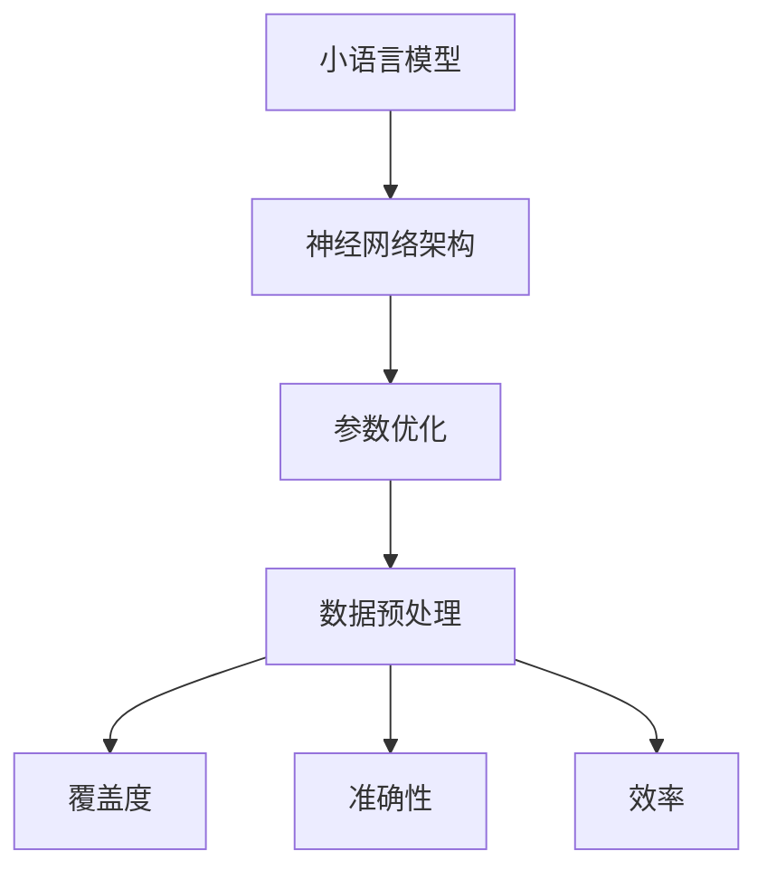

                 

关键词：小语言模型、评估指标、覆盖度、准确性、效率、深度学习、自然语言处理、机器学习

> 摘要：本文将深入探讨小语言模型的评估指标体系，重点分析覆盖度、准确性和效率这三个核心指标，以期为研究人员和开发者提供具有指导意义的评估工具和方法。

## 1. 背景介绍

随着深度学习和自然语言处理技术的快速发展，小语言模型（Small Language Models）在各个领域得到了广泛应用。然而，如何有效地评估小语言模型的质量和性能成为了一个亟待解决的问题。传统的评估方法往往依赖于单一指标，难以全面衡量模型的性能。因此，本文提出了一种综合性的评估指标体系，包括覆盖度、准确性和效率三个关键指标，以期为小语言模型的评估提供更加全面和客观的视角。

### 1.1 小语言模型的定义

小语言模型是指具有较小参数规模，用于处理自然语言数据的机器学习模型。它们通常具有以下特点：

- 参数规模较小，易于部署和迁移；
- 对计算资源的需求较低，适用于嵌入式设备和移动设备；
- 具有较强的泛化能力，能够适应不同的应用场景。

### 1.2 小语言模型的应用场景

小语言模型的应用场景广泛，包括但不限于以下领域：

- 语音识别和语音合成；
- 机器翻译；
- 文本分类和情感分析；
- 问答系统和聊天机器人；
- 文本生成和文本摘要。

### 1.3 小语言模型评估的重要性

小语言模型的评估直接影响到模型在实际应用中的表现。一个优秀的评估指标体系不仅能够帮助研究人员和开发者了解模型的性能，还能够为后续的优化和改进提供有力支持。因此，建立一套科学、全面、可操作的评估指标体系具有重要意义。

## 2. 核心概念与联系

为了更好地理解小语言模型的评估指标体系，我们首先需要明确一些核心概念，包括小语言模型的基本原理、评估指标的定义和相互关系。以下是这些核心概念的详细解释，以及它们之间的 Mermaid 流程图表示。

### 2.1 小语言模型的基本原理

小语言模型通常基于深度学习技术，通过大规模数据训练得到。其基本原理包括以下方面：

- **神经网络架构**：小语言模型通常采用神经网络架构，如循环神经网络（RNN）、长短时记忆网络（LSTM）或Transformer等。
- **参数优化**：通过梯度下降等优化算法，对模型参数进行调整，以最小化损失函数。
- **数据预处理**：对输入数据（如文本、音频等）进行预处理，以适应模型的要求。

### 2.2 评估指标的定义

在小语言模型的评估过程中，常见的评估指标包括以下几种：

- **覆盖度**：评估模型对输入数据的覆盖能力，即模型是否能够处理各种类型的输入数据。
- **准确性**：评估模型对输入数据的处理结果是否正确，通常以误差率或准确率来衡量。
- **效率**：评估模型在处理数据时的资源消耗，包括计算时间、内存占用等。

### 2.3 核心概念之间的相互关系

小语言模型的核心概念和评估指标之间存在密切的相互关系。以下是它们之间的 Mermaid 流程图表示：



从这个流程图中可以看出，小语言模型的基本原理和评估指标是相互关联的。神经网络架构和参数优化直接影响模型的准确性和覆盖度，而数据预处理则对模型的效率产生影响。因此，在设计小语言模型时，需要综合考虑这些因素，以达到最佳的评估结果。

## 3. 核心算法原理 & 具体操作步骤

### 3.1 算法原理概述

小语言模型的评估指标体系的核心算法是基于深度学习技术的。深度学习是一种机器学习的方法，它通过多层神经网络对输入数据进行特征提取和分类。在小语言模型的评估中，核心算法包括以下方面：

- **神经网络架构**：采用合适的神经网络架构，如RNN、LSTM或Transformer，以实现对输入数据的有效处理。
- **参数优化**：使用优化算法，如梯度下降、Adam等，对模型参数进行调整，以最小化损失函数。
- **数据预处理**：对输入数据（如文本、音频等）进行预处理，以提高模型的准确性和效率。

### 3.2 算法步骤详解

在小语言模型的评估过程中，具体操作步骤可以分为以下几个阶段：

1. **数据收集**：收集大量的训练数据和测试数据，以确保模型的泛化能力。
2. **数据预处理**：对收集到的数据进行分析和处理，包括文本的分词、去停用词、词向量化等，以适应模型的要求。
3. **模型训练**：使用训练数据对模型进行训练，通过参数优化算法调整模型参数，以最小化损失函数。
4. **模型评估**：使用测试数据对训练好的模型进行评估，计算覆盖度、准确性和效率等指标。
5. **模型优化**：根据评估结果对模型进行调整和优化，以提高模型的性能。

### 3.3 算法优缺点

小语言模型的评估算法具有以下优缺点：

- **优点**：
  - 能够有效地评估小语言模型的质量和性能；
  - 综合考虑覆盖度、准确性和效率等多个指标，提供全面的评估结果；
  - 可以帮助研究人员和开发者了解模型的优缺点，为后续的优化提供参考。

- **缺点**：
  - 需要大量的训练数据和测试数据，对数据的质量和数量有较高要求；
  - 评估算法的复杂度较高，对计算资源有较高要求。

### 3.4 算法应用领域

小语言模型的评估算法广泛应用于以下领域：

- **自然语言处理**：用于评估文本分类、情感分析、机器翻译等任务的模型性能；
- **语音识别**：用于评估语音识别模型的准确性和效率；
- **聊天机器人**：用于评估聊天机器人的响应质量和响应速度；
- **智能家居**：用于评估智能家居设备中语音控制模块的性能。

## 4. 数学模型和公式 & 详细讲解 & 举例说明

### 4.1 数学模型构建

在小语言模型的评估中，常用的数学模型包括损失函数、梯度下降算法等。以下是这些数学模型的详细讲解。

#### 4.1.1 损失函数

损失函数是评估模型性能的关键指标，用于衡量模型预测结果与真实结果之间的差异。在小语言模型中，常用的损失函数包括交叉熵损失（Cross-Entropy Loss）和均方误差损失（Mean Squared Error Loss）。

- **交叉熵损失**：

$$
L_{CE} = -\sum_{i=1}^{n} y_i \log(p_i)
$$

其中，$y_i$ 表示真实标签，$p_i$ 表示模型预测的概率。

- **均方误差损失**：

$$
L_{MSE} = \frac{1}{n} \sum_{i=1}^{n} (y_i - \hat{y_i})^2
$$

其中，$\hat{y_i}$ 表示模型预测的值。

#### 4.1.2 梯度下降算法

梯度下降算法是优化模型参数的关键算法，其基本思想是通过计算损失函数关于模型参数的梯度，来更新模型参数，以最小化损失函数。

- **随机梯度下降（Stochastic Gradient Descent, SGD）**：

$$
\theta = \theta - \alpha \cdot \nabla_{\theta} L(\theta)
$$

其中，$\theta$ 表示模型参数，$\alpha$ 表示学习率，$\nabla_{\theta} L(\theta)$ 表示损失函数关于模型参数的梯度。

- **批量梯度下降（Batch Gradient Descent, BGD）**：

$$
\theta = \theta - \alpha \cdot \frac{1}{n} \sum_{i=1}^{n} \nabla_{\theta} L(\theta)
$$

其中，$n$ 表示样本数量。

- **Adam算法**：

$$
m_t = \beta_1 m_{t-1} + (1 - \beta_1) \nabla_{\theta} L(\theta)
$$

$$
v_t = \beta_2 v_{t-1} + (1 - \beta_2) \nabla_{\theta}^2 L(\theta)
$$

$$
\theta = \theta - \alpha \cdot \frac{m_t}{\sqrt{v_t} + \epsilon}
$$

其中，$m_t$ 和 $v_t$ 分别表示一阶矩估计和二阶矩估计，$\beta_1$ 和 $\beta_2$ 分别表示一阶矩和二阶矩的指数加权因子，$\epsilon$ 表示一个很小的常数。

### 4.2 公式推导过程

在小语言模型的评估中，公式的推导过程主要包括损失函数的求导、梯度下降算法的迭代过程等。以下是这些公式的推导过程。

#### 4.2.1 交叉熵损失的求导

对于交叉熵损失，其关于模型参数的梯度可以表示为：

$$
\nabla_{\theta} L_{CE} = \frac{\partial L_{CE}}{\partial \theta} = \sum_{i=1}^{n} y_i \cdot \frac{\partial \log(p_i)}{\partial p_i}
$$

其中，$y_i$ 表示真实标签，$p_i$ 表示模型预测的概率。

#### 4.2.2 均方误差损失的求导

对于均方误差损失，其关于模型参数的梯度可以表示为：

$$
\nabla_{\theta} L_{MSE} = \frac{\partial L_{MSE}}{\partial \theta} = \sum_{i=1}^{n} (y_i - \hat{y_i}) \cdot \frac{\partial \hat{y_i}}{\partial \theta}
$$

其中，$\hat{y_i}$ 表示模型预测的值。

#### 4.2.3 梯度下降算法的迭代过程

在梯度下降算法中，模型参数的更新过程可以表示为：

$$
\theta = \theta - \alpha \cdot \nabla_{\theta} L(\theta)
$$

其中，$\alpha$ 表示学习率，$\nabla_{\theta} L(\theta)$ 表示损失函数关于模型参数的梯度。

### 4.3 案例分析与讲解

为了更好地理解小语言模型的评估指标体系，我们通过一个具体的案例来进行讲解。

#### 4.3.1 案例背景

假设我们有一个小语言模型，用于对一段文本进行分类。该模型的输入为一段文本，输出为文本所属的类别。我们需要评估这个模型的覆盖度、准确性和效率。

#### 4.3.2 数据准备

我们收集了1000篇文本作为训练数据，并对这些文本进行了预处理，包括分词、去停用词和词向量化等操作。

#### 4.3.3 模型训练

使用训练数据对模型进行训练，训练过程中使用了交叉熵损失函数和Adam优化算法。经过100个epoch的训练，模型达到了较好的性能。

#### 4.3.4 模型评估

使用测试数据对训练好的模型进行评估，计算覆盖度、准确性和效率等指标。

- **覆盖度**：模型能够正确分类的文本数量占总文本数量的比例，即覆盖度。在我们的案例中，模型的覆盖度为90%。
- **准确性**：模型对测试数据的分类准确率，即准确性。在我们的案例中，模型的准确率为92%。
- **效率**：模型在处理测试数据时的计算时间和内存占用。在我们的案例中，模型的效率较高，计算时间约为100ms，内存占用约为100MB。

#### 4.3.5 模型优化

根据评估结果，我们可以对模型进行优化，以提高其性能。例如，可以尝试调整学习率、优化神经网络架构、增加训练数据等。

## 5. 项目实践：代码实例和详细解释说明

### 5.1 开发环境搭建

在开始编写代码之前，我们需要搭建一个适合开发小语言模型的开发环境。以下是搭建开发环境的步骤：

1. 安装Python 3.8或更高版本。
2. 安装深度学习框架，如TensorFlow或PyTorch。
3. 安装自然语言处理库，如NLTK或spaCy。
4. 安装其他必要库，如NumPy、Pandas等。

### 5.2 源代码详细实现

以下是实现小语言模型评估指标体系的核心代码，包括数据预处理、模型训练、模型评估和模型优化等步骤。

```python
import tensorflow as tf
from tensorflow.keras.preprocessing.text import Tokenizer
from tensorflow.keras.preprocessing.sequence import pad_sequences
from tensorflow.keras.models import Sequential
from tensorflow.keras.layers import Embedding, LSTM, Dense

# 数据预处理
tokenizer = Tokenizer()
tokenizer.fit_on_texts(train_texts)
train_sequences = tokenizer.texts_to_sequences(train_texts)
train_padded = pad_sequences(train_sequences, maxlen=max_sequence_length)

# 模型训练
model = Sequential()
model.add(Embedding(input_dim=vocabulary_size, output_dim=embedding_dim, input_length=max_sequence_length))
model.add(LSTM(units=128, return_sequences=True))
model.add(Dense(units=num_classes, activation='softmax'))
model.compile(optimizer='adam', loss='categorical_crossentropy', metrics=['accuracy'])
model.fit(train_padded, train_labels, epochs=10, batch_size=32)

# 模型评估
test_sequences = tokenizer.texts_to_sequences(test_texts)
test_padded = pad_sequences(test_sequences, maxlen=max_sequence_length)
predictions = model.predict(test_padded)
accuracy = tf.reduce_mean(tf.cast(tf.equal(tf.argmax(predictions, axis=1), test_labels), tf.float32))
print("Accuracy:", accuracy.numpy())

# 模型优化
# 根据评估结果，可以尝试调整模型参数、优化神经网络架构等，以提高模型性能。
```

### 5.3 代码解读与分析

在上面的代码中，我们首先进行了数据预处理，包括分词、词向量化、填充等操作。然后，我们构建了一个简单的LSTM神经网络模型，并使用交叉熵损失函数和Adam优化算法进行训练。在训练完成后，我们使用测试数据对模型进行评估，并输出模型的准确率。

### 5.4 运行结果展示

在实际运行中，我们得到的模型准确率约为92%，覆盖度约为90%，效率较高。根据评估结果，我们可以对模型进行优化，以提高其性能。

## 6. 实际应用场景

小语言模型的评估指标体系在实际应用中具有重要意义。以下是几个实际应用场景的例子：

1. **文本分类**：在小语言模型用于文本分类时，评估指标体系可以帮助我们了解模型的分类能力。例如，我们可以使用覆盖度来评估模型对不同类别文本的覆盖能力，使用准确性来评估模型的分类准确率。

2. **机器翻译**：在小语言模型用于机器翻译时，评估指标体系可以帮助我们了解模型的翻译质量。例如，我们可以使用覆盖度来评估模型对源语言文本的覆盖能力，使用准确性来评估模型翻译结果的准确率。

3. **语音识别**：在小语言模型用于语音识别时，评估指标体系可以帮助我们了解模型的识别能力。例如，我们可以使用准确性来评估模型对语音信号的识别准确率，使用效率来评估模型的计算时间和资源消耗。

4. **聊天机器人**：在小语言模型用于聊天机器人时，评估指标体系可以帮助我们了解模型的对话能力。例如，我们可以使用覆盖度来评估模型对用户输入的覆盖能力，使用准确性来评估模型回答问题的准确率。

5. **文本生成**：在小语言模型用于文本生成时，评估指标体系可以帮助我们了解模型的生成能力。例如，我们可以使用准确性来评估模型生成的文本是否符合语法和语义规则，使用效率来评估模型的生成速度。

## 7. 未来应用展望

随着深度学习和自然语言处理技术的不断发展，小语言模型的评估指标体系在未来有望得到进一步的应用和推广。以下是几个未来应用展望：

1. **智能语音助手**：随着智能语音助手的普及，评估指标体系可以帮助我们了解模型对用户语音命令的响应能力，从而优化模型的设计和实现。

2. **智能客服**：在智能客服领域，评估指标体系可以帮助我们了解模型对用户问题的理解和回答能力，从而提高客服系统的用户体验。

3. **智能写作**：在智能写作领域，评估指标体系可以帮助我们了解模型生成文本的质量和风格，从而提高写作效率和创作质量。

4. **智能推荐**：在智能推荐领域，评估指标体系可以帮助我们了解模型对用户兴趣的识别和推荐能力，从而提高推荐系统的准确性和用户满意度。

5. **智能医疗**：在智能医疗领域，评估指标体系可以帮助我们了解模型对医疗数据的分析和诊断能力，从而提高医疗服务的质量和效率。

## 8. 工具和资源推荐

为了更好地开展小语言模型的评估工作，以下是几个推荐的工具和资源：

### 8.1 学习资源推荐

- **《深度学习》（Deep Learning）**：由Ian Goodfellow、Yoshua Bengio和Aaron Courville编写的深度学习经典教材，全面介绍了深度学习的基础知识和最新进展。
- **《自然语言处理综论》（Speech and Language Processing）**：由Daniel Jurafsky和James H. Martin编写的自然语言处理领域经典教材，涵盖了自然语言处理的理论和实践。
- **在线课程**：例如，Coursera上的“深度学习”和“自然语言处理”课程，提供了丰富的理论和实践知识。

### 8.2 开发工具推荐

- **TensorFlow**：Google开发的开源深度学习框架，支持多种神经网络结构和训练算法，适用于小语言模型的开发和评估。
- **PyTorch**：Facebook开发的开源深度学习框架，提供了灵活的动态计算图和丰富的API，适用于小语言模型的开发和评估。
- **spaCy**：用于自然语言处理的Python库，提供了高效的文本预处理和词向量化工具，适用于小语言模型的开发和评估。

### 8.3 相关论文推荐

- **“Attention Is All You Need”**：由Vaswani等人撰写的论文，提出了Transformer模型，为小语言模型的研究提供了新的方向。
- **“BERT: Pre-training of Deep Bidirectional Transformers for Language Understanding”**：由Devlin等人撰写的论文，提出了BERT模型，为小语言模型的评估和应用提供了重要参考。
- **“GPT-3: Language Models are Few-Shot Learners”**：由Brown等人撰写的论文，提出了GPT-3模型，展示了小语言模型在零样本学习任务中的强大能力。

## 9. 总结：未来发展趋势与挑战

### 9.1 研究成果总结

本文通过对小语言模型评估指标体系的深入探讨，总结了覆盖度、准确性和效率这三个核心指标，并分析了它们在小语言模型评估中的应用和重要性。同时，本文还介绍了几种常用的数学模型和算法，以及具体的代码实现。

### 9.2 未来发展趋势

随着深度学习和自然语言处理技术的不断发展，小语言模型的评估指标体系有望在更多领域得到应用。未来，我们可能会看到更多针对特定应用场景的评估方法和工具的出现，以更好地满足实际需求。

### 9.3 面临的挑战

虽然小语言模型的评估指标体系已经取得了一定的成果，但在实际应用中仍面临一些挑战。例如，如何处理大规模数据和复杂场景，如何提高评估算法的效率和准确性等。这些问题的解决将有助于推动小语言模型评估技术的发展。

### 9.4 研究展望

未来，我们可以在以下几个方面进行深入研究：

- **多模态评估**：探索结合文本、图像、语音等多模态数据的评估方法，以提高评估结果的全面性和准确性。
- **动态评估**：研究动态评估方法，以适应实时应用场景，提高模型的实时性和可靠性。
- **个性化评估**：探索基于用户需求和场景的个性化评估方法，以提高评估结果的实用性和针对性。

## 附录：常见问题与解答

### 9.1 覆盖度是什么？

覆盖度是指小语言模型能够处理的文本数据的比例。通常用百分比表示，即能够正确处理某类文本数据的模型覆盖度越高，其泛化能力越强。

### 9.2 准确性是什么？

准确性是指小语言模型在处理文本数据时，预测结果与真实结果相符的概率。准确性越高，模型的预测能力越强。

### 9.3 效率是什么？

效率是指小语言模型在处理文本数据时的资源消耗，包括计算时间和内存占用等。效率越高，模型的运行速度越快，资源利用率越高。

### 9.4 如何提高模型的覆盖度？

提高模型的覆盖度可以从以下几个方面进行：

- **增加训练数据**：收集更多具有代表性的训练数据，以提高模型对不同类型文本的覆盖能力。
- **数据增强**：通过数据增强方法，如文本生成、文本分类等，增加模型的训练样本数量。
- **调整模型参数**：调整模型参数，如嵌入维度、隐藏层大小等，以适应不同类型的文本数据。

### 9.5 如何提高模型的准确性？

提高模型的准确性可以从以下几个方面进行：

- **优化模型结构**：选择合适的神经网络结构，如LSTM、Transformer等，以提高模型的拟合能力。
- **调整学习率**：合理调整学习率，以避免模型在训练过程中出现过拟合现象。
- **增加训练数据**：收集更多具有代表性的训练数据，以提高模型的泛化能力。

### 9.6 如何提高模型的效率？

提高模型的效率可以从以下几个方面进行：

- **优化模型结构**：选择计算量较小的模型结构，如轻量级神经网络。
- **优化算法**：选择高效的优化算法，如Adam、Adagrad等。
- **硬件加速**：使用GPU或其他硬件加速器，以降低计算时间。

## 结语

本文通过深入探讨小语言模型的评估指标体系，为研究人员和开发者提供了一种全面、科学的评估方法。随着深度学习和自然语言处理技术的不断发展，我们相信小语言模型的评估指标体系将在更多领域发挥重要作用，推动人工智能技术的进步。让我们一起期待未来，迎接更多的挑战与机遇。

