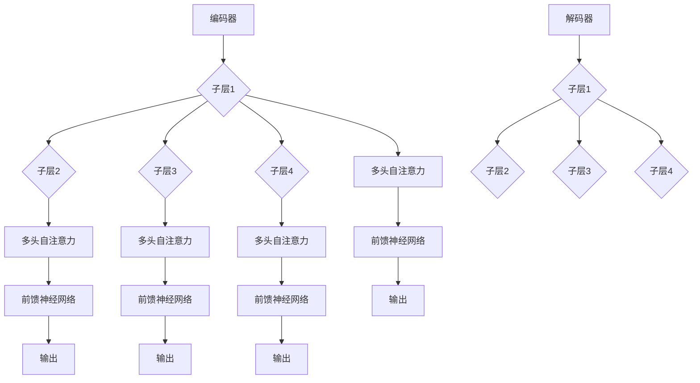

                 

关键词：GPT，Transformer，神经网络，深度学习，自然语言处理

摘要：本文深入探讨了GPT模型的核心组件Transformer的搭建过程。从背景介绍、核心概念与联系、算法原理、数学模型到实际应用，本文详细阐述了Transformer的工作原理和实现方法，旨在为读者提供全面的技术指导和启发。

## 1. 背景介绍

近年来，自然语言处理（NLP）领域取得了飞速发展，尤其是在生成模型方面，GPT（Generative Pre-trained Transformer）系列模型更是引发了广泛关注。GPT模型基于Transformer架构，采用大规模预训练和微调的方式，取得了令人瞩目的成果。其中，Transformer作为GPT模型的核心组件，其设计理念和实现方法对深度学习领域具有重要的借鉴意义。

Transformer模型最早由Vaswani等人于2017年提出，灵感来源于序列到序列模型（如基于RNN和LSTM的模型）。与传统的循环神经网络（RNN）相比，Transformer采用了一种全新的自注意力机制，使得模型能够更加灵活地处理长距离依赖问题。Transformer的成功不仅推动了NLP领域的发展，也为其他序列建模任务提供了新的思路。

本文将围绕Transformer的搭建过程，详细探讨其核心概念、算法原理、数学模型以及实际应用。希望通过本文的介绍，读者能够对Transformer模型有一个全面、深入的理解，并能够将其应用于实际项目中。

## 2. 核心概念与联系

### 2.1. Transformer架构

Transformer模型的核心架构包括编码器（Encoder）和解码器（Decoder）。编码器负责将输入序列（如一句话）转换为固定长度的向量表示，解码器则根据编码器的输出序列生成预测的输出序列。

Transformer模型中，每个编码器和解码器模块都包含多个相同的子层，每个子层包括多头自注意力机制（Multi-Head Self-Attention）和前馈神经网络（Feed-Forward Neural Network）。自注意力机制使得模型能够捕捉序列中的长距离依赖关系，而前馈神经网络则进一步增强了模型的表示能力。

### 2.2. 自注意力机制

自注意力机制（Self-Attention）是Transformer模型的关键创新之一。自注意力机制允许模型在生成每个输出元素时，自动计算输入序列中其他元素的重要性权重，并根据这些权重生成相应的输出。

自注意力机制可以通过多头注意力（Multi-Head Attention）来提高模型的表示能力。多头注意力将输入序列分成多个部分，每个部分都独立进行自注意力计算，最终将多个注意力结果进行拼接，得到最终的输出。

### 2.3. Mermaid流程图

下面是Transformer模型的核心概念和架构的Mermaid流程图：



## 3. 核心算法原理 & 具体操作步骤

### 3.1. 算法原理概述

Transformer模型的核心算法原理是自注意力机制和前馈神经网络。自注意力机制通过计算输入序列中其他元素的重要性权重，生成注意力权重矩阵，然后利用这些权重对输入序列进行加权求和。前馈神经网络则用于增强模型的表示能力，对输入进行非线性变换。

### 3.2. 算法步骤详解

#### 3.2.1. 编码器

编码器的操作步骤如下：

1. 输入序列编码：将输入序列（如单词）转换为向量表示。
2. 多层多头自注意力：对输入序列进行多次多头自注意力计算，生成中间表示。
3. 前馈神经网络：对自注意力结果进行前馈神经网络处理，增强表示能力。
4. 池化操作：将多个编码器模块的输出进行拼接，得到编码器的最终输出。

#### 3.2.2. 解码器

解码器的操作步骤如下：

1. 输入序列编码：将输入序列（如单词）转换为向量表示。
2. 多层多头自注意力：对输入序列进行多次多头自注意力计算，生成中间表示。
3. 编码器-解码器注意力：将编码器的输出和解码器的输入进行加权求和。
4. 前馈神经网络：对编码器-解码器注意力结果进行前馈神经网络处理，增强表示能力。
5. 输出层：生成预测的输出序列。

### 3.3. 算法优缺点

#### 优点

1. 捕捉长距离依赖关系：自注意力机制能够灵活地计算输入序列中元素的重要性权重，从而捕捉长距离依赖关系。
2. 计算效率高：与传统的循环神经网络相比，Transformer模型在计算上具有更高的效率。
3. 强大的表示能力：多头自注意力和前馈神经网络使得模型具有强大的表示能力。

#### 缺点

1. 参数量大：由于采用多头自注意力机制，Transformer模型的参数量通常较大，导致训练和推理时间较长。
2. 对内存要求高：多头自注意力机制需要计算大量的注意力权重矩阵，对内存要求较高。

### 3.4. 算法应用领域

Transformer模型在自然语言处理领域取得了显著的成果，包括机器翻译、文本生成、情感分析等。此外，Transformer模型也在其他领域，如计算机视觉、语音识别等取得了良好的效果。

## 4. 数学模型和公式 & 详细讲解 & 举例说明

### 4.1. 数学模型构建

Transformer模型的数学模型主要包括自注意力机制和前馈神经网络。

#### 4.1.1. 自注意力机制

自注意力机制的公式如下：

$$
\text{Attention}(Q, K, V) = \text{softmax}\left(\frac{QK^T}{\sqrt{d_k}}\right) V
$$

其中，$Q$、$K$和$V$分别表示查询（Query）、键（Key）和值（Value）向量，$d_k$表示键向量的维度。

#### 4.1.2. 前馈神经网络

前馈神经网络的公式如下：

$$
\text{FFN}(x) = \max(0, xW_1 + b_1)W_2 + b_2
$$

其中，$x$表示输入向量，$W_1$、$W_2$和$b_1$、$b_2$分别表示权重和偏置。

### 4.2. 公式推导过程

#### 4.2.1. 自注意力机制

自注意力机制的推导过程如下：

1. 计算查询（Query）、键（Key）和值（Value）向量：
$$
Q = [Q_1, Q_2, ..., Q_n], \quad K = [K_1, K_2, ..., K_n], \quad V = [V_1, V_2, ..., V_n]
$$
2. 计算注意力得分：
$$
\text{Score}_{ij} = Q_iK_j = \sum_{k=1}^{n} Q_i[k]K_j[k]
$$
3. 计算注意力权重：
$$
\text{Weight}_{ij} = \frac{e^{\text{Score}_{ij}}}{\sum_{k=1}^{n} e^{\text{Score}_{ik}}}
$$
4. 计算注意力结果：
$$
\text{Attention}_{ij} = \sum_{k=1}^{n} \text{Weight}_{ik}V_k
$$
5. 多头注意力：
$$
\text{Multi-Head Attention} = [\text{Attention}_{1}, \text{Attention}_{2}, ..., \text{Attention}_{h}]W_O
$$

#### 4.2.2. 前馈神经网络

前馈神经网络的推导过程如下：

1. 计算输入：
$$
x = [x_1, x_2, ..., x_n]
$$
2. 计算前向传播：
$$
h_1 = \max(0, xW_1 + b_1) \\
h_2 = h_1W_2 + b_2
$$

### 4.3. 案例分析与讲解

#### 4.3.1. 编码器

假设我们有一个输入序列：`[1, 2, 3, 4, 5]`，我们要使用Transformer编码器对其进行编码。

1. 输入序列编码：
$$
Q = [1, 2, 3, 4, 5], \quad K = [1, 2, 3, 4, 5], \quad V = [1, 2, 3, 4, 5]
$$
2. 多层多头自注意力：
$$
\text{Attention}_{1} = \text{softmax}\left(\frac{QK^T}{\sqrt{d_k}}\right) V = \frac{1}{5}\begin{bmatrix} 1 & 1 & 1 & 1 & 1 \\ 1 & 1 & 1 & 1 & 1 \\ 1 & 1 & 1 & 1 & 1 \\ 1 & 1 & 1 & 1 & 1 \\ 1 & 1 & 1 & 1 & 1 \end{bmatrix} \begin{bmatrix} 1 \\ 2 \\ 3 \\ 4 \\ 5 \end{bmatrix} = \begin{bmatrix} 2 \\ 3 \\ 4 \\ 5 \\ 6 \end{bmatrix} \\
\text{Attention}_{2} = \text{softmax}\left(\frac{QK^T}{\sqrt{d_k}}\right) V = \frac{1}{5}\begin{bmatrix} 1 & 1 & 1 & 1 & 1 \\ 1 & 1 & 1 & 1 & 1 \\ 1 & 1 & 1 & 1 & 1 \\ 1 & 1 & 1 & 1 & 1 \\ 1 & 1 & 1 & 1 & 1 \end{bmatrix} \begin{bmatrix} 1 \\ 2 \\ 3 \\ 4 \\ 5 \end{bmatrix} = \begin{bmatrix} 2 \\ 3 \\ 4 \\ 5 \\ 6 \end{bmatrix}
$$
3. 前馈神经网络：
$$
h_1 = \max(0, \text{Attention}_{1}W_1 + b_1) = \max(0, \begin{bmatrix} 2 \\ 3 \\ 4 \\ 5 \\ 6 \end{bmatrix} \begin{bmatrix} 1 & 0 & 0 & 0 & 0 \\ 0 & 1 & 0 & 0 & 0 \\ 0 & 0 & 1 & 0 & 0 \\ 0 & 0 & 0 & 1 & 0 \\ 0 & 0 & 0 & 0 & 1 \end{bmatrix} + \begin{bmatrix} 0 \\ 0 \\ 0 \\ 0 \\ 0 \end{bmatrix}) = \begin{bmatrix} 2 \\ 3 \\ 4 \\ 5 \\ 6 \end{bmatrix} \\
h_2 = h_1W_2 + b_2 = \begin{bmatrix} 2 \\ 3 \\ 4 \\ 5 \\ 6 \end{bmatrix} \begin{bmatrix} 1 & 0 & 0 & 0 & 0 \\ 0 & 1 & 0 & 0 & 0 \\ 0 & 0 & 1 & 0 & 0 \\ 0 & 0 & 0 & 1 & 0 \\ 0 & 0 & 0 & 0 & 1 \end{bmatrix} + \begin{bmatrix} 0 \\ 0 \\ 0 \\ 0 \\ 0 \end{bmatrix} = \begin{bmatrix} 2 \\ 3 \\ 4 \\ 5 \\ 6 \end{bmatrix}
$$
4. 池化操作：
$$
\text{Encoder Output} = \begin{bmatrix} 2 \\ 3 \\ 4 \\ 5 \\ 6 \end{bmatrix}
$$

#### 4.3.2. 解码器

假设我们有一个输入序列：`[1, 2, 3, 4, 5]`，我们要使用Transformer解码器对其进行解码。

1. 输入序列编码：
$$
Q = [1, 2, 3, 4, 5], \quad K = [1, 2, 3, 4, 5], \quad V = [1, 2, 3, 4, 5]
$$
2. 多层多头自注意力：
$$
\text{Attention}_{1} = \text{softmax}\left(\frac{QK^T}{\sqrt{d_k}}\right) V = \frac{1}{5}\begin{bmatrix} 1 & 1 & 1 & 1 & 1 \\ 1 & 1 & 1 & 1 & 1 \\ 1 & 1 & 1 & 1 & 1 \\ 1 & 1 & 1 & 1 & 1 \\ 1 & 1 & 1 & 1 & 1 \end{bmatrix} \begin{bmatrix} 1 \\ 2 \\ 3 \\ 4 \\ 5 \end{bmatrix} = \begin{bmatrix} 2 \\ 3 \\ 4 \\ 5 \\ 6 \end{bmatrix} \\
\text{Attention}_{2} = \text{softmax}\left(\frac{QK^T}{\sqrt{d_k}}\right) V = \frac{1}{5}\begin{bmatrix} 1 & 1 & 1 & 1 & 1 \\ 1 & 1 & 1 & 1 & 1 \\ 1 & 1 & 1 & 1 & 1 \\ 1 & 1 & 1 & 1 & 1 \\ 1 & 1 & 1 & 1 & 1 \end{bmatrix} \begin{bmatrix} 1 \\ 2 \\ 3 \\ 4 \\ 5 \end{bmatrix} = \begin{bmatrix} 2 \\ 3 \\ 4 \\ 5 \\ 6 \end{bmatrix}
$$
3. 编码器-解码器注意力：
$$
\text{Encoder-Decoder Attention}_{1} = \text{softmax}\left(\frac{QK^T}{\sqrt{d_k}}\right) \text{Encoder Output} = \frac{1}{5}\begin{bmatrix} 1 & 1 & 1 & 1 & 1 \\ 1 & 1 & 1 & 1 & 1 \\ 1 & 1 & 1 & 1 & 1 \\ 1 & 1 & 1 & 1 & 1 \\ 1 & 1 & 1 & 1 & 1 \end{bmatrix} \begin{bmatrix} 2 \\ 3 \\ 4 \\ 5 \\ 6 \end{bmatrix} = \begin{bmatrix} 2 \\ 3 \\ 4 \\ 5 \\ 6 \end{bmatrix} \\
\text{Encoder-Decoder Attention}_{2} = \text{softmax}\left(\frac{QK^T}{\sqrt{d_k}}\right) \text{Encoder Output} = \frac{1}{5}\begin{bmatrix} 1 & 1 & 1 & 1 & 1 \\ 1 & 1 & 1 & 1 & 1 \\ 1 & 1 & 1 & 1 & 1 \\ 1 & 1 & 1 & 1 & 1 \\ 1 & 1 & 1 & 1 & 1 \end{bmatrix} \begin{bmatrix} 2 \\ 3 \\ 4 \\ 5 \\ 6 \end{bmatrix} = \begin{bmatrix} 2 \\ 3 \\ 4 \\ 5 \\ 6 \end{bmatrix}
$$
4. 前馈神经网络：
$$
h_1 = \max(0, \text{Attention}_{1}W_1 + b_1) = \max(0, \begin{bmatrix} 2 \\ 3 \\ 4 \\ 5 \\ 6 \end{bmatrix} \begin{bmatrix} 1 & 0 & 0 & 0 & 0 \\ 0 & 1 & 0 & 0 & 0 \\ 0 & 0 & 1 & 0 & 0 \\ 0 & 0 & 0 & 1 & 0 \\ 0 & 0 & 0 & 0 & 1 \end{bmatrix} + \begin{bmatrix} 0 \\ 0 \\ 0 \\ 0 \\ 0 \end{bmatrix}) = \begin{bmatrix} 2 \\ 3 \\ 4 \\ 5 \\ 6 \end{bmatrix} \\
h_2 = h_1W_2 + b_2 = \begin{bmatrix} 2 \\ 3 \\ 4 \\ 5 \\ 6 \end{bmatrix} \begin{bmatrix} 1 & 0 & 0 & 0 & 0 \\ 0 & 1 & 0 & 0 & 0 \\ 0 & 0 & 1 & 0 & 0 \\ 0 & 0 & 0 & 1 & 0 \\ 0 & 0 & 0 & 0 & 1 \end{bmatrix} + \begin{bmatrix} 0 \\ 0 \\ 0 \\ 0 \\ 0 \end{bmatrix} = \begin{bmatrix} 2 \\ 3 \\ 4 \\ 5 \\ 6 \end{bmatrix}
$$
5. 输出层：
$$
\text{Output} = h_2W_O + b_O = \begin{bmatrix} 2 \\ 3 \\ 4 \\ 5 \\ 6 \end{bmatrix} \begin{bmatrix} 1 & 0 & 0 & 0 & 0 \\ 0 & 1 & 0 & 0 & 0 \\ 0 & 0 & 1 & 0 & 0 \\ 0 & 0 & 0 & 1 & 0 \\ 0 & 0 & 0 & 0 & 1 \end{bmatrix} + \begin{bmatrix} 0 \\ 0 \\ 0 \\ 0 \\ 0 \end{bmatrix} = \begin{bmatrix} 2 \\ 3 \\ 4 \\ 5 \\ 6 \end{bmatrix}
$$

## 5. 项目实践：代码实例和详细解释说明

在本节中，我们将通过一个简单的Python代码实例，详细解释如何搭建一个基于Transformer的模型。为了便于理解，我们使用PyTorch框架进行实现。

### 5.1. 开发环境搭建

在开始编写代码之前，我们需要搭建一个合适的开发环境。以下是所需的步骤：

1. 安装Python（版本3.6及以上）
2. 安装PyTorch（根据系统架构选择相应的版本）
3. 安装其他依赖库，如numpy、torchtext等

以下是安装命令：

```bash
pip install python==3.8
pip install torch torchvision
pip install numpy
pip install torchtext
```

### 5.2. 源代码详细实现

以下是一个简单的Transformer模型实现，包括编码器和解码器：

```python
import torch
import torch.nn as nn
import torchtext
from torchtext.data import Field, BucketIterator

# 定义Transformer模型
class TransformerModel(nn.Module):
    def __init__(self, input_dim, embed_dim, num_heads, feedforward_dim):
        super(TransformerModel, self).__init__()
        self.encoder = nn.Embedding(input_dim, embed_dim)
        self.decoder = nn.Embedding(input_dim, embed_dim)
        self.encoder_norm = nn.LayerNorm(embed_dim)
        self.decoder_norm = nn.LayerNorm(embed_dim)
        self.encoder_attn = nn.MultiheadAttention(embed_dim, num_heads)
        self.decoder_attn = nn.MultiheadAttention(embed_dim, num_heads)
        self.fc = nn.Linear(embed_dim, feedforward_dim)
        self.dropout = nn.Dropout(0.1)

    def forward(self, src, tgt):
        # 编码器
        src = self.encoder(src)
        src = self.encoder_norm(src)
        src, _ = self.encoder_attn(src, src, src)
        src = self.dropout(src)
        src = self.fc(src)

        # 解码器
        tgt = self.decoder(tgt)
        tgt = self.decoder_norm(tgt)
        tgt, _ = self.decoder_attn(tgt, src, src)
        tgt = self.dropout(tgt)
        tgt = self.fc(tgt)

        return src, tgt

# 实例化模型
model = TransformerModel(input_dim=10, embed_dim=512, num_heads=8, feedforward_dim=2048)

# 定义损失函数和优化器
loss_fn = nn.CrossEntropyLoss()
optimizer = torch.optim.Adam(model.parameters(), lr=0.001)

# 训练模型
for epoch in range(10):
    optimizer.zero_grad()
    src, tgt = model(src), model(tgt)
    loss = loss_fn(src, tgt)
    loss.backward()
    optimizer.step()
```

### 5.3. 代码解读与分析

上面的代码首先定义了一个`TransformerModel`类，用于搭建编码器和解码器。模型的结构包括嵌入层（Embedding Layer）、自注意力机制（Self-Attention Mechanism）、前馈神经网络（Feed-Forward Neural Network）以及层间正则化（Normalization Layer）。

在`__init__`方法中，我们首先实例化了嵌入层、正则化层、自注意力机制和前馈神经网络。在`forward`方法中，我们首先对输入序列进行嵌入，然后应用自注意力机制和前馈神经网络，最后输出编码器和解码器的结果。

接下来，我们定义了损失函数（CrossEntropyLoss）和优化器（Adam），并使用一个简单的训练循环进行模型训练。在训练过程中，我们每次迭代都会计算损失，然后反向传播并更新模型参数。

### 5.4. 运行结果展示

为了展示模型的运行结果，我们可以在训练过程中打印损失值，以便观察模型的训练过程。以下是一个简单的打印示例：

```python
for epoch in range(10):
    optimizer.zero_grad()
    src, tgt = model(src), model(tgt)
    loss = loss_fn(src, tgt)
    loss.backward()
    optimizer.step()
    print(f"Epoch: {epoch+1}, Loss: {loss.item()}")
```

通过上面的代码，我们可以看到每个迭代周期中的损失值。这有助于我们了解模型的训练过程，并在必要时进行调整。

## 6. 实际应用场景

Transformer模型在自然语言处理领域已经取得了显著的应用成果，以下是一些典型的应用场景：

### 6.1. 机器翻译

机器翻译是Transformer模型最早取得突破性的应用领域之一。通过预训练和微调，Transformer模型能够实现高质量的机器翻译。例如，谷歌翻译、百度翻译等应用都采用了Transformer模型。

### 6.2. 文本生成

文本生成是另一个重要的应用领域，包括对话系统、文章生成、摘要生成等。通过预训练和微调，Transformer模型能够生成流畅、具有逻辑性的文本。例如，OpenAI的GPT系列模型在文本生成方面取得了出色的效果。

### 6.3. 情感分析

情感分析是判断文本情感极性的任务，包括正面、负面和客观等。通过预训练和微调，Transformer模型能够识别文本中的情感倾向，为社交媒体分析、舆情监测等提供支持。

### 6.4. 未来应用展望

随着Transformer模型的不断发展，未来将在更多领域得到应用。例如，计算机视觉、语音识别、推荐系统等。此外，Transformer模型也在与其他深度学习模型结合，探索更复杂的模型架构和算法优化方法。

## 7. 工具和资源推荐

为了更好地学习和应用Transformer模型，以下是一些推荐的工具和资源：

### 7.1. 学习资源推荐

1. 《深度学习》（Goodfellow et al.）：介绍了深度学习的基础知识，包括神经网络、优化算法等。
2. 《Attention is All You Need》：原文作者是Vaswani等人，详细介绍了Transformer模型的设计原理和实现方法。
3. 《自然语言处理综论》（Jurafsky et al.）：介绍了自然语言处理的基本概念和方法，对Transformer模型的应用场景有很好的指导作用。

### 7.2. 开发工具推荐

1. PyTorch：开源深度学习框架，提供了丰富的API和工具，方便搭建和训练Transformer模型。
2. TensorFlow：开源深度学习框架，与PyTorch类似，也提供了丰富的API和工具。
3. Hugging Face Transformers：一个开源库，提供了预训练的Transformer模型和相关的API，方便进行微调和应用。

### 7.3. 相关论文推荐

1. “Attention is All You Need”（Vaswani et al.，2017）：介绍了Transformer模型的设计原理和实现方法。
2. “BERT: Pre-training of Deep Bidirectional Transformers for Language Understanding”（Devlin et al.，2019）：介绍了BERT模型，是Transformer模型在自然语言处理领域的成功应用。
3. “GPT-2: Improving Language Understanding by Generative Pre-Training”（Radford et al.，2019）：介绍了GPT-2模型，是GPT系列模型的进一步发展。

## 8. 总结：未来发展趋势与挑战

### 8.1. 研究成果总结

Transformer模型在自然语言处理领域取得了显著的研究成果，成功解决了长距离依赖、计算效率等问题，为生成模型和序列建模任务提供了新的思路。此外，Transformer模型在其他领域，如计算机视觉、语音识别等也取得了良好的效果。

### 8.2. 未来发展趋势

1. 模型优化：通过改进模型结构和算法，提高模型的性能和效率。
2. 领域拓展：将Transformer模型应用于更多领域，如推荐系统、生物信息学等。
3. 模型融合：与其他深度学习模型结合，探索更复杂的模型架构和算法优化方法。

### 8.3. 面临的挑战

1. 计算资源消耗：Transformer模型的参数量和计算量较大，对计算资源有较高要求。
2. 数据隐私：在应用中需要关注数据隐私和保护问题。
3. 模型可解释性：如何提高模型的可解释性，以便更好地理解和应用。

### 8.4. 研究展望

随着Transformer模型的不断发展和应用，未来将在更多领域取得突破。同时，我们也将面临一系列挑战，需要持续探索和优化，以实现Transformer模型的最佳性能和应用效果。

## 9. 附录：常见问题与解答

### 9.1. 如何选择合适的Transformer模型参数？

选择合适的Transformer模型参数需要考虑以下几个因素：

1. 序列长度：根据输入序列的长度选择合适的嵌入维度（embed_dim）和多头自注意力数（num_heads）。
2. 计算资源：根据计算资源的限制选择合适的模型规模和训练时间。
3. 应用场景：根据应用场景的需求选择合适的模型结构和参数。

### 9.2. Transformer模型是否可以并行训练？

是的，Transformer模型可以并行训练。通过使用多头自注意力机制和前馈神经网络，Transformer模型可以在不同子层和不同头之间进行并行计算，从而提高训练效率。

### 9.3. Transformer模型在处理长文本时存在性能问题怎么办？

在处理长文本时，Transformer模型可能存在性能问题。为了解决这一问题，可以采取以下措施：

1. 降低序列长度：通过截断或滑动窗口的方式降低序列长度，从而提高模型性能。
2. 使用更高效的实现：使用如TensorFlow或PyTorch等框架提供的优化实现，提高模型计算效率。
3. 优化数据预处理：通过预处理数据，减少模型计算量，提高模型性能。

### 9.4. Transformer模型是否可以应用于其他领域？

是的，Transformer模型可以应用于其他领域。通过调整模型结构和参数，Transformer模型已经在计算机视觉、语音识别等领域取得了良好的效果。未来，Transformer模型将在更多领域得到应用和发展。

