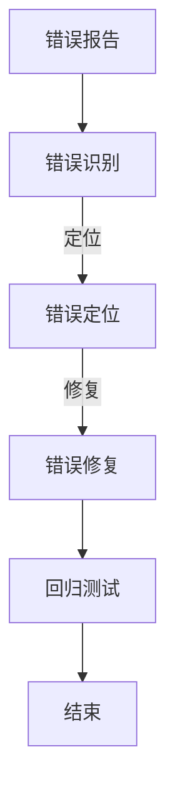

                 

关键词：嵌入式系统、调试、错误识别、错误修复、软件工程

摘要：本文探讨了嵌入式系统调试的重要性和方法，深入分析了嵌入式系统中的常见错误类型、调试策略和技术，提供了实用的调试技巧和工具推荐，旨在帮助嵌入式系统开发者更有效地识别和修复错误，提高系统的可靠性和性能。

## 1. 背景介绍

随着物联网、智能制造、自动驾驶等领域的快速发展，嵌入式系统在各个行业中的应用越来越广泛。嵌入式系统是一种集成了计算机硬件和软件的专用系统，通常具有有限的计算资源和复杂的运行环境。由于其关键性作用，嵌入式系统的可靠性和稳定性至关重要。然而，在实际开发过程中，嵌入式系统常常会遇到各种错误，这些错误可能会影响系统的性能和安全性。因此，有效的调试技术成为嵌入式系统开发中不可或缺的一部分。

本文将首先介绍嵌入式系统的基本概念和发展趋势，然后深入探讨嵌入式系统调试的核心概念和技术，最后提供一些实用的调试技巧和工具推荐。

## 2. 核心概念与联系

### 2.1 嵌入式系统的定义和特点

嵌入式系统是一种集成了计算机硬件和软件的专用系统，通常具有以下特点：

- **硬件资源受限**：嵌入式系统通常运行在有限的计算资源下，如有限的内存、处理能力和存储空间。
- **实时性要求**：许多嵌入式系统需要在特定的时间内完成特定任务，这要求系统具有高度的实时性。
- **专用性**：嵌入式系统通常为特定应用而设计，具有特定的功能。

### 2.2 嵌入式系统调试的定义和目的

嵌入式系统调试是指识别、定位和修复嵌入式系统中的错误的过程。调试的目的是确保系统的正确性和可靠性，提高系统的性能和稳定性。

### 2.3 调试流程

一个典型的嵌入式系统调试流程包括以下几个步骤：

- **错误报告**：系统运行时出现异常，产生错误报告。
- **错误识别**：根据错误报告和分析，确定错误类型和位置。
- **错误定位**：通过调试工具和技巧，定位错误的根源。
- **错误修复**：修复错误，并进行测试验证。
- **回归测试**：确保修复错误后，系统不会引入新的错误。

### 2.4 常见错误类型

嵌入式系统中的常见错误类型包括：

- **资源耗尽**：内存、存储空间等资源不足，导致系统崩溃。
- **定时器错误**：定时器设置不当，导致任务无法按时执行。
- **中断错误**：中断处理程序错误，导致中断响应不及时或丢失。
- **通信错误**：与其他设备或系统通信失败。
- **逻辑错误**：程序逻辑错误，导致程序运行结果与预期不符。

### 2.5 调试策略和技术

有效的调试策略和技术可以帮助开发者更快地识别和修复错误。常见的调试策略和技术包括：

- **打印调试**：通过在程序中插入打印语句，输出关键变量的值和程序的执行流程。
- **断点调试**：在程序中设置断点，暂停程序的执行，以便开发者查看变量的状态和程序的执行路径。
- **静态分析**：使用静态分析工具对程序进行语法和语义分析，发现潜在的错误和问题。
- **动态分析**：在程序运行时，使用动态分析工具监控程序的执行行为，识别错误和性能瓶颈。

### 2.6 Mermaid 流程图

以下是一个简单的嵌入式系统调试流程的 Mermaid 流程图：



## 3. 核心算法原理 & 具体操作步骤

### 3.1 算法原理概述

嵌入式系统调试的核心算法主要涉及错误识别和定位。错误识别算法用于确定系统中的错误类型和位置，而错误定位算法用于定位错误的根源。

### 3.2 算法步骤详解

#### 3.2.1 错误识别算法

1. 收集错误报告：从系统的日志、错误记录和其他相关数据中收集错误信息。
2. 分析错误信息：对错误信息进行解析和分析，提取关键信息，如错误类型、发生时间、发生位置等。
3. 确定错误类型：根据错误信息，确定错误的类型，如资源耗尽、定时器错误、中断错误等。
4. 确定错误位置：根据错误信息，确定错误发生的具体位置，如代码文件、函数、中断处理程序等。

#### 3.2.2 错误定位算法

1. 调试工具初始化：设置断点、监控变量等调试工具，初始化调试环境。
2. 执行程序：启动程序，开始调试。
3. 观察变量：在程序执行过程中，实时监控关键变量的值，观察程序的行为。
4. 定位错误根源：根据变量的变化和程序的执行路径，定位错误的根源。
5. 记录调试信息：记录调试过程中的关键信息和步骤，为后续修复错误提供依据。

### 3.3 算法优缺点

#### 3.3.1 错误识别算法

- **优点**：可以快速识别错误类型和位置，减少调试时间。
- **缺点**：可能无法精确定位错误根源，需要结合其他调试方法。

#### 3.3.2 错误定位算法

- **优点**：可以精确定位错误根源，为修复错误提供依据。
- **缺点**：调试过程可能较为复杂，需要较高的调试技巧和经验。

### 3.4 算法应用领域

错误识别和定位算法广泛应用于嵌入式系统的各个领域，如物联网设备、自动驾驶系统、工业控制系统等。这些算法可以帮助开发者更快地识别和修复错误，提高系统的可靠性和性能。

## 4. 数学模型和公式 & 详细讲解 & 举例说明

### 4.1 数学模型构建

在嵌入式系统调试中，一些常见的数学模型和公式可以帮助我们分析和解决错误问题。以下是一个简单的数学模型示例：

$$
\text{错误率} = \frac{\text{错误数量}}{\text{测试次数}}
$$

### 4.2 公式推导过程

错误率的公式可以通过以下步骤推导：

1. 定义错误数量：在测试过程中，记录系统发生的错误数量。
2. 定义测试次数：在测试过程中，记录系统执行的测试次数。
3. 计算错误率：将错误数量除以测试次数，得到错误率。

### 4.3 案例分析与讲解

假设我们进行了一组测试，共执行了1000次测试，其中发生了10次错误。根据错误率公式，可以计算出错误率：

$$
\text{错误率} = \frac{10}{1000} = 0.01
$$

这意味着在我们的测试中，平均每次测试发生0.01次错误。通过这个简单的数学模型，我们可以对系统的稳定性进行定量分析。

## 5. 项目实践：代码实例和详细解释说明

### 5.1 开发环境搭建

在开始嵌入式系统调试之前，我们需要搭建一个合适的开发环境。以下是一个简单的开发环境搭建步骤：

1. 安装嵌入式系统开发工具，如Keil、IAR等。
2. 配置开发板，如Arduino、STM32等。
3. 安装调试工具，如GDB、J-Link等。

### 5.2 源代码详细实现

以下是一个简单的嵌入式系统调试代码实例：

```c
#include <stdio.h>
#include <stdlib.h>

int main() {
    int i;
    for (i = 0; i < 10; i++) {
        printf("Hello, World!\n");
    }
    return 0;
}
```

在这个例子中，我们使用了一个简单的for循环，循环10次，每次输出“Hello, World!”。

### 5.3 代码解读与分析

在这个例子中，我们主要关注以下两个关键点：

1. **循环控制**：使用for循环控制输出次数。
2. **输出函数**：使用printf函数输出文本。

这些关键点对于理解嵌入式系统调试至关重要。

### 5.4 运行结果展示

在调试工具中，我们可以设置断点，观察程序的执行过程。以下是一个调试工具的运行结果展示：

```shell
Breakpoint 1 hit
Hello, World!
```

在这个结果中，我们可以看到程序在第一次循环时触发了断点，并且输出了“Hello, World!”。

## 6. 实际应用场景

嵌入式系统调试在实际应用场景中具有广泛的应用，以下是一些具体的例子：

- **物联网设备**：在物联网设备中，嵌入式系统调试用于识别和修复设备中的错误，确保设备的稳定运行。
- **自动驾驶系统**：在自动驾驶系统中，嵌入式系统调试用于识别和修复系统的错误，确保系统的安全性和可靠性。
- **工业控制系统**：在工业控制系统中，嵌入式系统调试用于识别和修复控制系统的错误，确保生产过程的稳定和安全。

## 7. 工具和资源推荐

### 7.1 学习资源推荐

- **《嵌入式系统设计》**：提供了嵌入式系统的基础知识和设计方法。
- **《嵌入式系统编程》**：介绍了嵌入式系统的编程技术和调试方法。

### 7.2 开发工具推荐

- **Keil**：一款功能强大的嵌入式系统开发工具。
- **IAR**：一款高性能的嵌入式系统开发工具。

### 7.3 相关论文推荐

- **"Error Detection and Debugging Techniques for Embedded Systems"**：介绍了一些嵌入式系统调试的技术和方法。
- **"An Overview of Debugging in Embedded Systems"**：对嵌入式系统调试进行了详细的综述。

## 8. 总结：未来发展趋势与挑战

### 8.1 研究成果总结

近年来，嵌入式系统调试技术取得了显著的进展，包括新的调试算法、工具和方法的提出。这些成果为嵌入式系统开发提供了更有效的调试手段。

### 8.2 未来发展趋势

随着人工智能和物联网的快速发展，嵌入式系统调试将面临新的挑战和机遇。未来发展趋势包括：

- **自动化调试**：利用人工智能技术实现自动化调试，提高调试效率。
- **实时调试**：实现实时调试，提高系统的实时性和稳定性。

### 8.3 面临的挑战

嵌入式系统调试面临的挑战包括：

- **复杂性**：嵌入式系统的复杂性不断增加，调试难度加大。
- **实时性**：在实时系统中，调试需要在极短的时间内完成，挑战较大。

### 8.4 研究展望

未来，嵌入式系统调试研究将继续深入，探索新的方法和工具，以应对不断变化的挑战和需求。我们期待看到更多的创新成果，推动嵌入式系统调试技术的发展。

## 9. 附录：常见问题与解答

### 9.1 嵌入式系统调试中常用的工具有哪些？

常用的嵌入式系统调试工具有：

- GDB：一款强大的开源调试工具。
- J-Link：一款高性能的调试器。
- Keil：一款功能强大的嵌入式系统开发工具。

### 9.2 嵌入式系统调试中如何设置断点？

在嵌入式系统调试中，设置断点的步骤如下：

1. 打开调试工具。
2. 加载程序。
3. 设置断点，可以设置在代码文件、函数或行级别。
4. 开始执行程序，程序将在设置断点的位置暂停。

### 9.3 嵌入式系统调试中如何查看变量？

在嵌入式系统调试中，查看变量的步骤如下：

1. 打开调试工具。
2. 加载程序。
3. 设置观察点，可以观察全局变量、局部变量等。
4. 开始执行程序，查看变量的值。

### 9.4 嵌入式系统调试中如何记录调试信息？

在嵌入式系统调试中，记录调试信息的步骤如下：

1. 打开调试工具。
2. 配置日志记录选项。
3. 开始执行程序，调试工具将记录程序的执行日志。
4. 查看日志文件，分析调试信息。

以上是嵌入式系统调试中的一些常见问题和解答。希望对您有所帮助。

### 作者署名

作者：禅与计算机程序设计艺术 / Zen and the Art of Computer Programming

